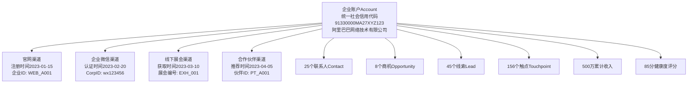
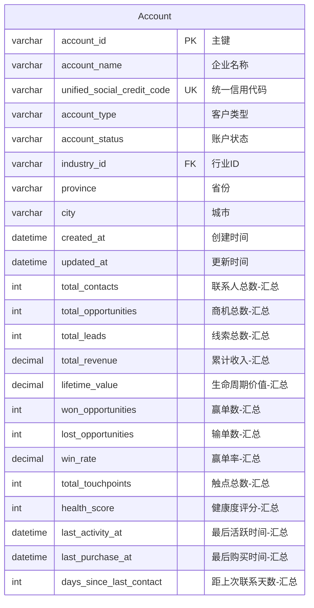
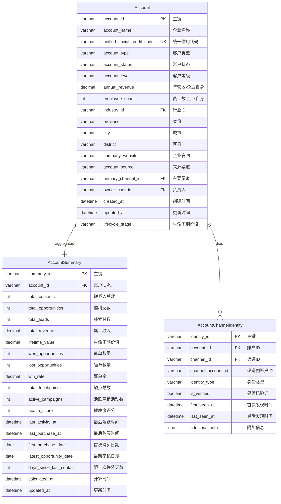
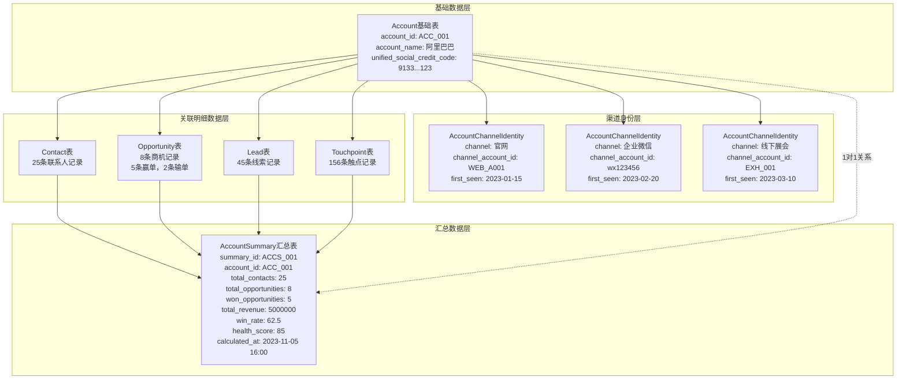
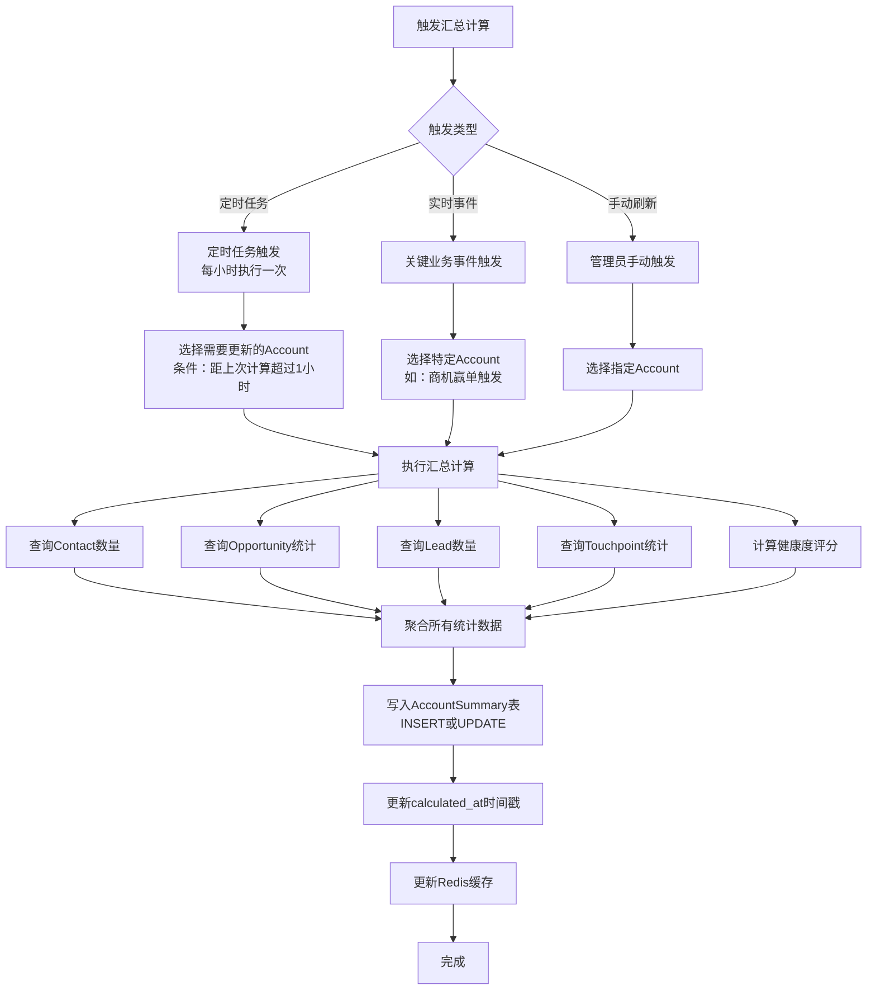

# Account 实体多渠道整合设计方案详解

## 目录
- [设计背景](#设计背景)
- [方案对比](#方案对比)
- [推荐方案详解](#推荐方案详解)
- [实现示例](#实现示例)

---

## 设计背景

### 多渠道场景特点

在B2B CDP场景下，一个企业账户（Account）的数据来源于多个渠道：



### 核心设计问题

**问题1：基础字段 vs 汇总字段**
- 基础字段：`account_name`、`industry_id`、`province`、`city` 等基本信息
- 汇总字段：`total_contacts`、`total_opportunities`、`total_revenue`、`health_score` 等统计数据

**问题2：实时性 vs 性能**
- 实时计算：每次查询都JOIN多张表计算，准确但慢
- 预先汇总：定期计算存储，快速但有延迟

**问题3：数据一致性**
- 如何保证汇总数据与明细数据一致
- 如何处理并发更新问题

---

## 方案对比

### 方案一：所有字段都在Account表中（不推荐）



**优点：**
- 表结构简单，只有一张表
- 查询简单，不需要JOIN

**缺点：**
- 字段过多，单表臃肿（20+个字段）
- 基础字段和汇总字段混在一起，职责不清晰
- 汇总字段更新频繁，影响主表性能
- 无法记录历史汇总数据
- 扩展性差，增加新的汇总维度需要修改表结构

**性能问题：**
```sql
-- 每次更新汇总数据都需要锁定Account表
UPDATE Account 
SET total_contacts = (SELECT COUNT(*) FROM Contact WHERE primary_account_id = 'ACC_001'),
    total_opportunities = (SELECT COUNT(*) FROM Opportunity WHERE account_id = 'ACC_001'),
    total_revenue = (SELECT SUM(amount) FROM Opportunity WHERE account_id = 'ACC_001' AND is_won = true),
    health_score = ... -- 复杂计算
WHERE account_id = 'ACC_001';

-- 问题：
-- 1. 多个子查询，性能差
-- 2. 频繁更新导致行锁竞争
-- 3. 基础信息查询也会被汇总字段更新阻塞
```

---

### 方案二：基础字段和汇总字段分离（推荐）



**优点：**
1. **职责清晰**
   - Account表：存储企业基础信息（相对稳定）
   - AccountSummary表：存储汇总统计数据（频繁变化）
   - AccountChannelIdentity表：存储多渠道身份映射

2. **性能优化**
   - 基础信息查询不受汇总数据更新影响
   - 汇总数据可以异步计算更新
   - 可以针对不同表设置不同的缓存策略

3. **扩展性强**
   - 增加新的汇总维度只需修改AccountSummary表
   - 可以按时间维度存储历史汇总数据
   - 支持多版本汇总模型

4. **数据一致性**
   - 通过`calculated_at`字段明确知道汇总数据的计算时间
   - 可以通过对比`calculated_at`和明细数据的`updated_at`判断是否需要重新计算

**缺点：**
- 需要JOIN查询才能获取完整数据（但可以通过缓存优化）
- 需要维护汇总计算逻辑

---

## 推荐方案详解

### 1. 表结构设计

#### Account 基础表

**设计原则：**
- 只存储企业的基础属性信息
- 这些信息相对稳定，变化频率低
- 直接来源于企业自身，不是统计计算得出

```sql
CREATE TABLE Account (
    -- 主键和唯一标识
    account_id VARCHAR(64) PRIMARY KEY COMMENT '账户唯一标识',
    account_name VARCHAR(200) NOT NULL COMMENT '企业名称',
    unified_social_credit_code VARCHAR(18) UNIQUE COMMENT '统一社会信用代码',
    
    -- 分类和状态
    account_type VARCHAR(50) NOT NULL COMMENT '客户类型：CUSTOMER/PARTNER/PROSPECT/COMPETITOR',
    account_status VARCHAR(50) NOT NULL COMMENT '账户状态：ACTIVE/DORMANT/CHURNED/BLACKLIST',
    account_level VARCHAR(50) COMMENT '客户等级：STRATEGIC/IMPORTANT/NORMAL',
    lifecycle_stage VARCHAR(50) COMMENT '生命周期阶段：AWARENESS/CONSIDERATION/DECISION/RETENTION/EXPANSION',
    
    -- 企业基本信息（来自企业自身，非统计）
    annual_revenue DECIMAL(18,2) COMMENT '企业年营收（万元）-来自企业工商信息',
    employee_count INT COMMENT '企业员工数-来自企业工商信息',
    industry_id VARCHAR(64) COMMENT '行业分类ID',
    
    -- 地址信息
    province VARCHAR(50) COMMENT '省份',
    city VARCHAR(50) COMMENT '城市',
    district VARCHAR(50) COMMENT '区县',
    company_address VARCHAR(500) COMMENT '详细地址',
    company_website VARCHAR(500) COMMENT '企业官网',
    
    -- 来源和归属
    account_source VARCHAR(100) COMMENT '来源：WEBSITE/EXHIBITION/PARTNER/COLD_CALL',
    primary_channel_id VARCHAR(64) COMMENT '主要渠道ID',
    owner_user_id VARCHAR(64) COMMENT '负责销售人员ID',
    
    -- 时间戳
    created_at DATETIME NOT NULL DEFAULT CURRENT_TIMESTAMP COMMENT '创建时间',
    updated_at DATETIME NOT NULL DEFAULT CURRENT_TIMESTAMP ON UPDATE CURRENT_TIMESTAMP COMMENT '更新时间',
    
    -- 扩展字段
    custom_fields JSON COMMENT '自定义扩展字段',
    
    -- 索引
    INDEX idx_account_name (account_name),
    INDEX idx_account_status (account_status),
    INDEX idx_account_type_status (account_type, account_status),
    INDEX idx_account_owner (owner_user_id),
    INDEX idx_account_industry (industry_id),
    INDEX idx_account_city (province, city),
    INDEX idx_account_created (created_at)
) ENGINE=InnoDB DEFAULT CHARSET=utf8mb4 COMMENT='企业账户基础信息表';
```

#### AccountSummary 汇总表

**设计原则：**
- 存储所有统计计算的汇总数据
- 数据从其他表聚合计算得出
- 可以定期重新计算保证准确性

```sql
CREATE TABLE AccountSummary (
    -- 主键
    summary_id VARCHAR(64) PRIMARY KEY COMMENT '汇总记录ID',
    account_id VARCHAR(64) NOT NULL UNIQUE COMMENT '账户ID-唯一',
    
    -- 关联数据统计
    total_contacts INT DEFAULT 0 COMMENT '关联联系人总数',
    total_opportunities INT DEFAULT 0 COMMENT '商机总数',
    total_leads INT DEFAULT 0 COMMENT '线索总数',
    
    -- 收入统计
    total_revenue DECIMAL(18,2) DEFAULT 0 COMMENT '累计成交收入（元）',
    lifetime_value DECIMAL(18,2) DEFAULT 0 COMMENT '客户生命周期价值LTV（元）',
    current_year_revenue DECIMAL(18,2) DEFAULT 0 COMMENT '本年度收入（元）',
    last_year_revenue DECIMAL(18,2) DEFAULT 0 COMMENT '去年收入（元）',
    
    -- 商机统计
    won_opportunities INT DEFAULT 0 COMMENT '赢单商机数',
    lost_opportunities INT DEFAULT 0 COMMENT '输单商机数',
    open_opportunities INT DEFAULT 0 COMMENT '进行中商机数',
    win_rate DECIMAL(5,2) DEFAULT 0 COMMENT '赢单率（%）',
    average_deal_size DECIMAL(18,2) DEFAULT 0 COMMENT '平均成交金额（元）',
    
    -- 互动统计
    total_touchpoints INT DEFAULT 0 COMMENT '总触点数',
    total_events INT DEFAULT 0 COMMENT '总事件数',
    active_campaigns INT DEFAULT 0 COMMENT '参与的活跃营销活动数',
    
    -- 健康度和活跃度
    health_score INT DEFAULT 0 COMMENT '健康度评分（0-100）',
    engagement_score INT DEFAULT 0 COMMENT '参与度评分（0-100）',
    churn_risk_score INT DEFAULT 0 COMMENT '流失风险评分（0-100，越高风险越大）',
    
    -- 时间维度统计
    last_activity_at DATETIME COMMENT '最后活跃时间（任何互动）',
    last_touchpoint_at DATETIME COMMENT '最后触点时间',
    last_purchase_at DATETIME COMMENT '最后购买时间',
    last_contact_at DATETIME COMMENT '最后主动联系时间',
    first_purchase_date DATE COMMENT '首次购买日期',
    latest_opportunity_date DATE COMMENT '最新商机日期',
    
    -- 天数统计
    days_since_last_activity INT DEFAULT 0 COMMENT '距上次活跃天数',
    days_since_last_contact INT DEFAULT 0 COMMENT '距上次联系天数',
    days_since_last_purchase INT DEFAULT 0 COMMENT '距上次购买天数',
    customer_tenure_days INT DEFAULT 0 COMMENT '成为客户的天数',
    
    -- 元数据
    calculated_at DATETIME NOT NULL COMMENT '汇总计算时间',
    updated_at DATETIME NOT NULL DEFAULT CURRENT_TIMESTAMP ON UPDATE CURRENT_TIMESTAMP COMMENT '更新时间',
    
    -- 外键和索引
    FOREIGN KEY (account_id) REFERENCES Account(account_id) ON DELETE CASCADE,
    INDEX idx_summary_health_score (health_score DESC),
    INDEX idx_summary_last_activity (last_activity_at DESC),
    INDEX idx_summary_total_revenue (total_revenue DESC),
    INDEX idx_summary_win_rate (win_rate DESC),
    INDEX idx_summary_churn_risk (churn_risk_score DESC),
    INDEX idx_summary_calculated (calculated_at)
) ENGINE=InnoDB DEFAULT CHARSET=utf8mb4 COMMENT='企业账户汇总统计表';
```

#### AccountChannelIdentity 多渠道身份映射表

**设计原则：**
- 记录同一个企业在不同渠道的身份标识
- 支持身份识别和合并
- 记录首次和最后发现时间

```sql
CREATE TABLE AccountChannelIdentity (
    -- 主键
    identity_id VARCHAR(64) PRIMARY KEY COMMENT '身份记录ID',
    
    -- 关联
    account_id VARCHAR(64) NOT NULL COMMENT '统一账户ID',
    channel_id VARCHAR(64) NOT NULL COMMENT '渠道ID',
    
    -- 渠道内身份
    channel_account_id VARCHAR(200) NOT NULL COMMENT '在该渠道内的账户ID',
    identity_type VARCHAR(50) COMMENT '身份类型：CORP_ID/WEBSITE_ID/PARTNER_ID',
    
    -- 验证状态
    is_verified BOOLEAN DEFAULT FALSE COMMENT '是否已验证',
    verification_method VARCHAR(50) COMMENT '验证方式：MANUAL/AUTO/CREDIT_CODE',
    
    -- 时间记录
    first_seen_at DATETIME NOT NULL COMMENT '首次在该渠道发现时间',
    last_seen_at DATETIME NOT NULL COMMENT '最后在该渠道活跃时间',
    
    -- 附加信息
    additional_info JSON COMMENT '渠道特有的附加信息',
    
    -- 索引
    UNIQUE KEY uk_account_channel (account_id, channel_id),
    INDEX idx_channel_account (channel_id, channel_account_id),
    INDEX idx_account (account_id),
    INDEX idx_first_seen (first_seen_at),
    
    FOREIGN KEY (account_id) REFERENCES Account(account_id) ON DELETE CASCADE,
    FOREIGN KEY (channel_id) REFERENCES Channel(channel_id)
) ENGINE=InnoDB DEFAULT CHARSET=utf8mb4 COMMENT='企业账户多渠道身份映射表';
```

---

### 2. 数据关系示意图



---

### 3. 汇总计算策略

#### 计算触发时机



#### 计算SQL示例

```sql
-- 完整的AccountSummary计算和更新
INSERT INTO AccountSummary (
    summary_id,
    account_id,
    total_contacts,
    total_opportunities,
    total_leads,
    total_revenue,
    won_opportunities,
    lost_opportunities,
    open_opportunities,
    win_rate,
    total_touchpoints,
    health_score,
    last_activity_at,
    last_purchase_at,
    days_since_last_contact,
    calculated_at
)
SELECT 
    CONCAT('ACCS_', account_id) as summary_id,
    a.account_id,
    
    -- 联系人统计
    COALESCE(c.contact_count, 0) as total_contacts,
    
    -- 商机统计
    COALESCE(o.opportunity_count, 0) as total_opportunities,
    
    -- 线索统计
    COALESCE(l.lead_count, 0) as total_leads,
    
    -- 收入统计
    COALESCE(o.total_revenue, 0) as total_revenue,
    COALESCE(o.won_count, 0) as won_opportunities,
    COALESCE(o.lost_count, 0) as lost_opportunities,
    COALESCE(o.open_count, 0) as open_opportunities,
    
    -- 赢单率
    CASE 
        WHEN COALESCE(o.won_count, 0) + COALESCE(o.lost_count, 0) > 0 
        THEN ROUND(COALESCE(o.won_count, 0) * 100.0 / (COALESCE(o.won_count, 0) + COALESCE(o.lost_count, 0)), 2)
        ELSE 0 
    END as win_rate,
    
    -- 触点统计
    COALESCE(t.touchpoint_count, 0) as total_touchpoints,
    
    -- 健康度评分（简化版）
    CASE
        WHEN DATEDIFF(NOW(), COALESCE(t.last_touchpoint, a.created_at)) <= 7 THEN 90
        WHEN DATEDIFF(NOW(), COALESCE(t.last_touchpoint, a.created_at)) <= 30 THEN 70
        WHEN DATEDIFF(NOW(), COALESCE(t.last_touchpoint, a.created_at)) <= 90 THEN 50
        ELSE 30
    END as health_score,
    
    -- 时间统计
    COALESCE(t.last_touchpoint, a.created_at) as last_activity_at,
    o.last_purchase as last_purchase_at,
    DATEDIFF(NOW(), COALESCE(t.last_touchpoint, a.created_at)) as days_since_last_contact,
    
    NOW() as calculated_at
    
FROM Account a

-- 联系人统计
LEFT JOIN (
    SELECT 
        primary_account_id,
        COUNT(*) as contact_count
    FROM Contact
    WHERE contact_status = 'ACTIVE'
    GROUP BY primary_account_id
) c ON a.account_id = c.primary_account_id

-- 商机统计
LEFT JOIN (
    SELECT 
        account_id,
        COUNT(*) as opportunity_count,
        SUM(CASE WHEN is_won = TRUE THEN amount ELSE 0 END) as total_revenue,
        SUM(CASE WHEN is_won = TRUE THEN 1 ELSE 0 END) as won_count,
        SUM(CASE WHEN is_lost = TRUE THEN 1 ELSE 0 END) as lost_count,
        SUM(CASE WHEN is_won = FALSE AND is_lost = FALSE THEN 1 ELSE 0 END) as open_count,
        MAX(CASE WHEN is_won = TRUE THEN actual_close_date END) as last_purchase
    FROM Opportunity
    GROUP BY account_id
) o ON a.account_id = o.account_id

-- 线索统计
LEFT JOIN (
    SELECT 
        converted_account_id,
        COUNT(*) as lead_count
    FROM Lead
    WHERE converted_account_id IS NOT NULL
    GROUP BY converted_account_id
) l ON a.account_id = l.converted_account_id

-- 触点统计
LEFT JOIN (
    SELECT 
        account_id,
        COUNT(*) as touchpoint_count,
        MAX(touchpoint_time) as last_touchpoint
    FROM Touchpoint
    GROUP BY account_id
) t ON a.account_id = t.account_id

WHERE a.account_id = 'ACC_001'  -- 可以批量处理多个账户

ON DUPLICATE KEY UPDATE
    total_contacts = VALUES(total_contacts),
    total_opportunities = VALUES(total_opportunities),
    total_leads = VALUES(total_leads),
    total_revenue = VALUES(total_revenue),
    won_opportunities = VALUES(won_opportunities),
    lost_opportunities = VALUES(lost_opportunities),
    open_opportunities = VALUES(open_opportunities),
    win_rate = VALUES(win_rate),
    total_touchpoints = VALUES(total_touchpoints),
    health_score = VALUES(health_score),
    last_activity_at = VALUES(last_activity_at),
    last_purchase_at = VALUES(last_purchase_at),
    days_since_last_contact = VALUES(days_since_last_contact),
    calculated_at = VALUES(calculated_at),
    updated_at = NOW();
```

---

### 4. 查询使用场景

#### 场景1：查询Account基础信息（高频，快速）

```sql
-- 只需要基础信息，不需要汇总数据
-- 查询速度快，不受汇总数据影响
SELECT 
    account_id,
    account_name,
    account_type,
    account_status,
    industry_id,
    province,
    city,
    owner_user_id
FROM Account
WHERE account_id = 'ACC_001';
```

#### 场景2：查询Account完整信息（包含汇总）

```sql
-- 需要基础信息 + 汇总数据
-- 使用LEFT JOIN，即使汇总数据不存在也能查到基础信息
SELECT 
    a.account_id,
    a.account_name,
    a.account_type,
    a.account_status,
    a.industry_id,
    a.province,
    a.city,
    a.owner_user_id,
    -- 汇总数据
    COALESCE(s.total_contacts, 0) as total_contacts,
    COALESCE(s.total_opportunities, 0) as total_opportunities,
    COALESCE(s.total_revenue, 0) as total_revenue,
    COALESCE(s.health_score, 0) as health_score,
    COALESCE(s.win_rate, 0) as win_rate,
    s.last_activity_at,
    s.calculated_at
FROM Account a
LEFT JOIN AccountSummary s ON a.account_id = s.account_id
WHERE a.account_id = 'ACC_001';
```

#### 场景3：客户列表查询（按汇总指标排序和筛选）

```sql
-- 查询健康度评分低于60分的客户，按收入排序
SELECT 
    a.account_id,
    a.account_name,
    a.account_status,
    a.owner_user_id,
    s.health_score,
    s.total_revenue,
    s.win_rate,
    s.last_activity_at,
    s.days_since_last_contact
FROM Account a
INNER JOIN AccountSummary s ON a.account_id = s.account_id
WHERE a.account_status = 'ACTIVE'
  AND s.health_score < 60
ORDER BY s.total_revenue DESC
LIMIT 50;
```

#### 场景4：客户360度视图（完整数据）

```sql
-- 查询某个客户的完整360度视图
-- 包括基础信息、汇总数据、多渠道身份
SELECT 
    -- 基础信息
    a.account_id,
    a.account_name,
    a.account_type,
    a.account_status,
    a.account_level,
    a.industry_id,
    a.province,
    a.city,
    a.owner_user_id,
    a.lifecycle_stage,
    
    -- 汇总统计
    s.total_contacts,
    s.total_opportunities,
    s.total_revenue,
    s.lifetime_value,
    s.won_opportunities,
    s.win_rate,
    s.health_score,
    s.last_activity_at,
    s.days_since_last_contact,
    s.calculated_at,
    
    -- 多渠道身份
    GROUP_CONCAT(
        CONCAT(ch.channel_name, ':', ci.channel_account_id)
        ORDER BY ci.first_seen_at
        SEPARATOR '; '
    ) as channel_identities
    
FROM Account a
LEFT JOIN AccountSummary s ON a.account_id = s.account_id
LEFT JOIN AccountChannelIdentity ci ON a.account_id = ci.account_id
LEFT JOIN Channel ch ON ci.channel_id = ch.channel_id
WHERE a.account_id = 'ACC_001'
GROUP BY a.account_id;
```

---

### 5. 缓存策略

#### Redis缓存结构

```python
# 缓存键设计
# 基础信息缓存（较长TTL，1小时）
account:basic:{account_id} -> JSON(Account基础字段)

# 汇总数据缓存（较短TTL，5分钟）
account:summary:{account_id} -> JSON(AccountSummary所有字段)

# 完整数据缓存（综合TTL，15分钟）
account:full:{account_id} -> JSON(Account + AccountSummary)

# 示例数据
account:basic:ACC_001 = {
    "account_id": "ACC_001",
    "account_name": "阿里巴巴网络技术有限公司",
    "account_type": "CUSTOMER",
    "account_status": "ACTIVE",
    "industry_id": "IND_001",
    "province": "浙江省",
    "city": "杭州市",
    "owner_user_id": "USER_001"
}

account:summary:ACC_001 = {
    "summary_id": "ACCS_001",
    "account_id": "ACC_001",
    "total_contacts": 25,
    "total_opportunities": 8,
    "total_revenue": 5000000.00,
    "won_opportunities": 5,
    "win_rate": 62.5,
    "health_score": 85,
    "last_activity_at": "2023-11-05 14:30:00",
    "calculated_at": "2023-11-05 16:00:00"
}
```

---

## 实现示例

### 完整代码示例（Python + SQLAlchemy）

```python
from sqlalchemy import Column, String, Integer, Decimal, DateTime, Boolean, JSON, ForeignKey
from sqlalchemy.orm import relationship
from datetime import datetime

# Account基础表模型
class Account(Base):
    __tablename__ = 'account'
    
    account_id = Column(String(64), primary_key=True)
    account_name = Column(String(200), nullable=False)
    unified_social_credit_code = Column(String(18), unique=True)
    account_type = Column(String(50), nullable=False)
    account_status = Column(String(50), nullable=False)
    account_level = Column(String(50))
    industry_id = Column(String(64))
    province = Column(String(50))
    city = Column(String(50))
    owner_user_id = Column(String(64))
    created_at = Column(DateTime, default=datetime.now)
    updated_at = Column(DateTime, default=datetime.now, onupdate=datetime.now)
    lifecycle_stage = Column(String(50))
    
    # 关系
    summary = relationship("AccountSummary", uselist=False, back_populates="account")
    channel_identities = relationship("AccountChannelIdentity", back_populates="account")
    contacts = relationship("Contact", back_populates="account")
    opportunities = relationship("Opportunity", back_populates="account")

# AccountSummary汇总表模型
class AccountSummary(Base):
    __tablename__ = 'account_summary'
    
    summary_id = Column(String(64), primary_key=True)
    account_id = Column(String(64), ForeignKey('account.account_id'), unique=True, nullable=False)
    
    # 统计字段
    total_contacts = Column(Integer, default=0)
    total_opportunities = Column(Integer, default=0)
    total_leads = Column(Integer, default=0)
    total_revenue = Column(Decimal(18, 2), default=0)
    lifetime_value = Column(Decimal(18, 2), default=0)
    won_opportunities = Column(Integer, default=0)
    lost_opportunities = Column(Integer, default=0)
    win_rate = Column(Decimal(5, 2), default=0)
    total_touchpoints = Column(Integer, default=0)
    health_score = Column(Integer, default=0)
    
    # 时间字段
    last_activity_at = Column(DateTime)
    last_purchase_at = Column(DateTime)
    days_since_last_contact = Column(Integer, default=0)
    
    # 元数据
    calculated_at = Column(DateTime, nullable=False)
    updated_at = Column(DateTime, default=datetime.now, onupdate=datetime.now)
    
    # 关系
    account = relationship("Account", back_populates="summary")

# AccountChannelIdentity渠道身份表模型
class AccountChannelIdentity(Base):
    __tablename__ = 'account_channel_identity'
    
    identity_id = Column(String(64), primary_key=True)
    account_id = Column(String(64), ForeignKey('account.account_id'), nullable=False)
    channel_id = Column(String(64), nullable=False)
    channel_account_id = Column(String(200), nullable=False)
    identity_type = Column(String(50))
    is_verified = Column(Boolean, default=False)
    first_seen_at = Column(DateTime, nullable=False)
    last_seen_at = Column(DateTime, nullable=False)
    additional_info = Column(JSON)
    
    # 关系
    account = relationship("Account", back_populates="channel_identities")


# 业务服务类
class AccountService:
    def __init__(self, db_session, redis_client):
        self.db = db_session
        self.redis = redis_client
    
    def get_account_full(self, account_id: str) -> dict:
        """获取Account完整信息（包含汇总数据）"""
        # 1. 尝试从缓存获取
        cache_key = f"account:full:{account_id}"
        cached = self.redis.get(cache_key)
        if cached:
            return json.loads(cached)
        
        # 2. 从数据库查询
        account = self.db.query(Account).filter_by(account_id=account_id).first()
        if not account:
            return None
        
        # 3. 构建返回数据
        result = {
            # 基础信息
            "account_id": account.account_id,
            "account_name": account.account_name,
            "account_type": account.account_type,
            "account_status": account.account_status,
            "industry_id": account.industry_id,
            "province": account.province,
            "city": account.city,
            "owner_user_id": account.owner_user_id,
            
            # 汇总数据
            "summary": {
                "total_contacts": account.summary.total_contacts if account.summary else 0,
                "total_opportunities": account.summary.total_opportunities if account.summary else 0,
                "total_revenue": float(account.summary.total_revenue) if account.summary else 0,
                "health_score": account.summary.health_score if account.summary else 0,
                "win_rate": float(account.summary.win_rate) if account.summary else 0,
                "last_activity_at": account.summary.last_activity_at.isoformat() if account.summary and account.summary.last_activity_at else None,
                "calculated_at": account.summary.calculated_at.isoformat() if account.summary and account.summary.calculated_at else None,
            },
            
            # 多渠道身份
            "channel_identities": [
                {
                    "channel_id": ci.channel_id,
                    "channel_account_id": ci.channel_account_id,
                    "is_verified": ci.is_verified,
                    "first_seen_at": ci.first_seen_at.isoformat()
                }
                for ci in account.channel_identities
            ]
        }
        
        # 4. 写入缓存（15分钟）
        self.redis.setex(cache_key, 900, json.dumps(result))
        
        return result
    
    def calculate_account_summary(self, account_id: str):
        """计算并更新Account汇总数据"""
        from sqlalchemy import func
        
        # 1. 统计联系人数量
        total_contacts = self.db.query(func.count(Contact.contact_id))\
            .filter(Contact.primary_account_id == account_id)\
            .filter(Contact.contact_status == 'ACTIVE')\
            .scalar() or 0
        
        # 2. 统计商机数据
        opp_stats = self.db.query(
            func.count(Opportunity.opportunity_id).label('total'),
            func.sum(case((Opportunity.is_won == True, Opportunity.amount), else_=0)).label('revenue'),
            func.sum(case((Opportunity.is_won == True, 1), else_=0)).label('won'),
            func.sum(case((Opportunity.is_lost == True, 1), else_=0)).label('lost'),
        ).filter(Opportunity.account_id == account_id).first()
        
        total_opportunities = opp_stats.total or 0
        total_revenue = opp_stats.revenue or 0
        won_opportunities = opp_stats.won or 0
        lost_opportunities = opp_stats.lost or 0
        
        # 3. 计算赢单率
        win_rate = 0
        if won_opportunities + lost_opportunities > 0:
            win_rate = round(won_opportunities * 100.0 / (won_opportunities + lost_opportunities), 2)
        
        # 4. 统计触点数量
        total_touchpoints = self.db.query(func.count(Touchpoint.touchpoint_id))\
            .filter(Touchpoint.account_id == account_id)\
            .scalar() or 0
        
        # 5. 计算健康度评分（简化版）
        last_touchpoint = self.db.query(func.max(Touchpoint.touchpoint_time))\
            .filter(Touchpoint.account_id == account_id)\
            .scalar()
        
        if last_touchpoint:
            days_since_last = (datetime.now() - last_touchpoint).days
            if days_since_last <= 7:
                health_score = 90
            elif days_since_last <= 30:
                health_score = 70
            elif days_since_last <= 90:
                health_score = 50
            else:
                health_score = 30
        else:
            health_score = 0
        
        # 6. 更新或插入AccountSummary
        summary = self.db.query(AccountSummary).filter_by(account_id=account_id).first()
        
        if summary:
            # 更新
            summary.total_contacts = total_contacts
            summary.total_opportunities = total_opportunities
            summary.total_revenue = total_revenue
            summary.won_opportunities = won_opportunities
            summary.lost_opportunities = lost_opportunities
            summary.win_rate = win_rate
            summary.total_touchpoints = total_touchpoints
            summary.health_score = health_score
            summary.last_activity_at = last_touchpoint
            summary.calculated_at = datetime.now()
        else:
            # 插入
            summary = AccountSummary(
                summary_id=f"ACCS_{account_id}",
                account_id=account_id,
                total_contacts=total_contacts,
                total_opportunities=total_opportunities,
                total_revenue=total_revenue,
                won_opportunities=won_opportunities,
                lost_opportunities=lost_opportunities,
                win_rate=win_rate,
                total_touchpoints=total_touchpoints,
                health_score=health_score,
                last_activity_at=last_touchpoint,
                calculated_at=datetime.now()
            )
            self.db.add(summary)
        
        self.db.commit()
        
        # 7. 清除缓存
        self.redis.delete(f"account:full:{account_id}")
        self.redis.delete(f"account:summary:{account_id}")
```

---

## 总结建议

### 强烈推荐：基础字段和汇总字段分离

**核心理由：**

1. **职责分离原则**
   - Account表：企业基础属性（相对稳定，来自企业自身）
   - AccountSummary表：业务统计数据（频繁变化，从其他表计算得出）
   - 符合单一职责原则

2. **性能优化**
   - 基础信息查询不受汇总计算影响
   - 可以针对不同表设置不同的缓存策略
   - 汇总计算可以异步执行，不阻塞业务流程

3. **扩展性强**
   - 新增汇总维度只需修改AccountSummary表
   - 可以支持多版本汇总（历史汇总表）
   - 便于进行A/B测试不同的汇总算法

4. **数据一致性**
   - 通过`calculated_at`字段明确知道数据新鲜度
   - 可以通过定时任务保证最终一致性
   - 支持重新计算修正数据

5. **多渠道支持**
   - AccountChannelIdentity独立表管理渠道身份
   - 清晰的身份映射关系
   - 便于渠道数据追溯和审计

**实施建议：**

1. **初期阶段**
   - 先实现Account和AccountSummary两张表
   - 使用定时任务（每小时）计算汇总数据
   - 在应用层做数据聚合展示

2. **优化阶段**
   - 引入Redis缓存，缓存热点Account数据
   - 实现关键事件的实时触发更新
   - 优化汇总计算SQL性能

3. **进阶阶段**
   - 实现汇总计算的增量更新
   - 引入消息队列异步处理
   - 实现历史汇总数据归档
