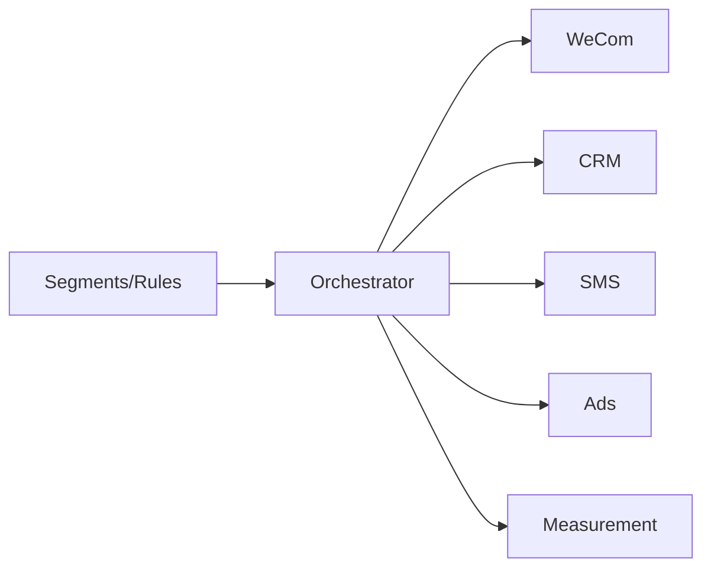

### 应用与触达（示例/预留）
- 渠道：企微、CRM工单/外呼、短信/邮件（可选）、广告回流（可选）。
- 实时规则：人群实时匹配、频控；编排画布；A/B接口预留。

```mermaid
flowchart LR
  Seg[Segments/Rules] --> Orc[Orchestrator]
  Orc --> WeCom
  Orc --> CRM
  Orc --> SMS
  Orc --> Ads
  Orc --> Eval[Measurement]
```

