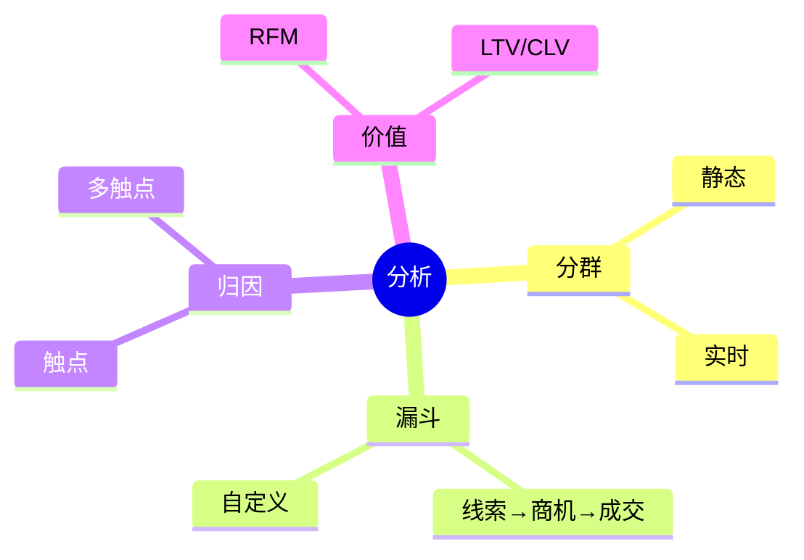

### 分析平台（示例/预留）
- 能力：分群、漏斗、路径、归因、RFM、LTV/CLV、客户流转。
- 多租户视图与权限；指标口径版本化；BI对接。

```mermaid
mindmap
  root((分析))
    分群
      静态
      实时
    漏斗
      线索→商机→成交
      自定义
    归因
      触点
      多触点
    价值
      RFM
      LTV/CLV
```

