# B2B CDP 核心架构设计方案

## 目录
- [系统架构总览](#系统架构总览)
- [核心实体设计](#核心实体设计)
- [关键业务流程](#关键业务流程)
- [技术实现方案](#技术实现方案)

---

## 系统架构总览

### 整体架构图

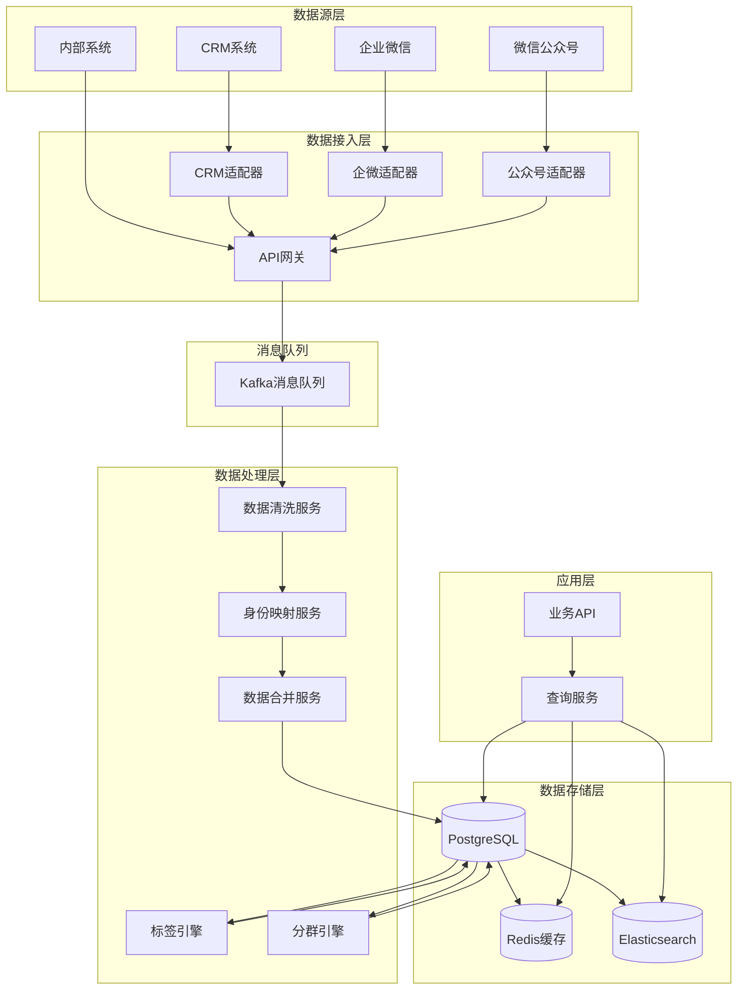

### 核心流程说明

**六大核心流程：**
1. **数据采集**：多渠道数据统一接入
2. **数据清洗**：格式标准化、数据验证
3. **身份映射**：识别不同渠道的同一主体
4. **全渠道整合**：合并为统一的实体
5. **标签打标**：根据规则和行为打标签
6. **客户圈人**：基于条件创建客户分群

---

## 核心实体设计

### 1. Account账户实体模型

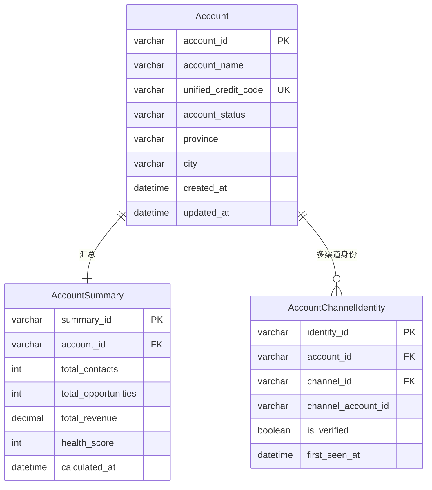

**表关系说明：**
- Account（1） : AccountSummary（1）- 一对一汇总关系
- Account（1） : AccountChannelIdentity（N）- 一个企业在多个渠道有多个身份

---

### 2. Contact联系人实体模型

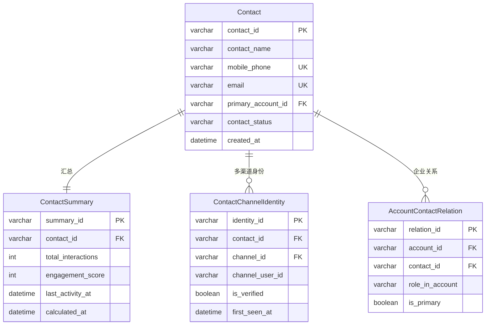

**表关系说明：**
- Contact（1） : ContactSummary（1）- 一对一汇总关系
- Contact（1） : ContactChannelIdentity（N）- 一个联系人在多个渠道有多个身份
- Contact（N） : Account（M）- 通过AccountContactRelation关联

---

### 3. Lead线索实体模型

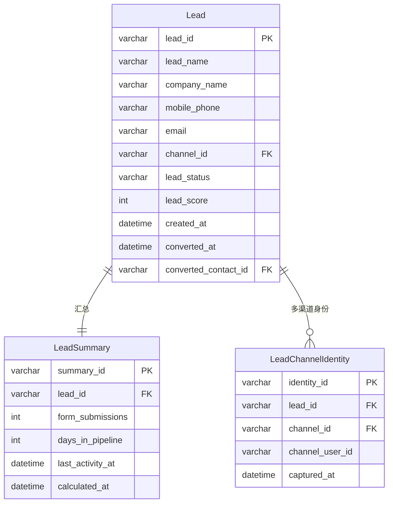

**表关系说明：**
- Lead（1） : LeadSummary（1）- 一对一汇总关系
- Lead（1） : LeadChannelIdentity（N）- 一个线索可能来自多个渠道
- Lead在转化时通过converted_contact_id关联到Contact

---

### 4. 标签系统实体模型

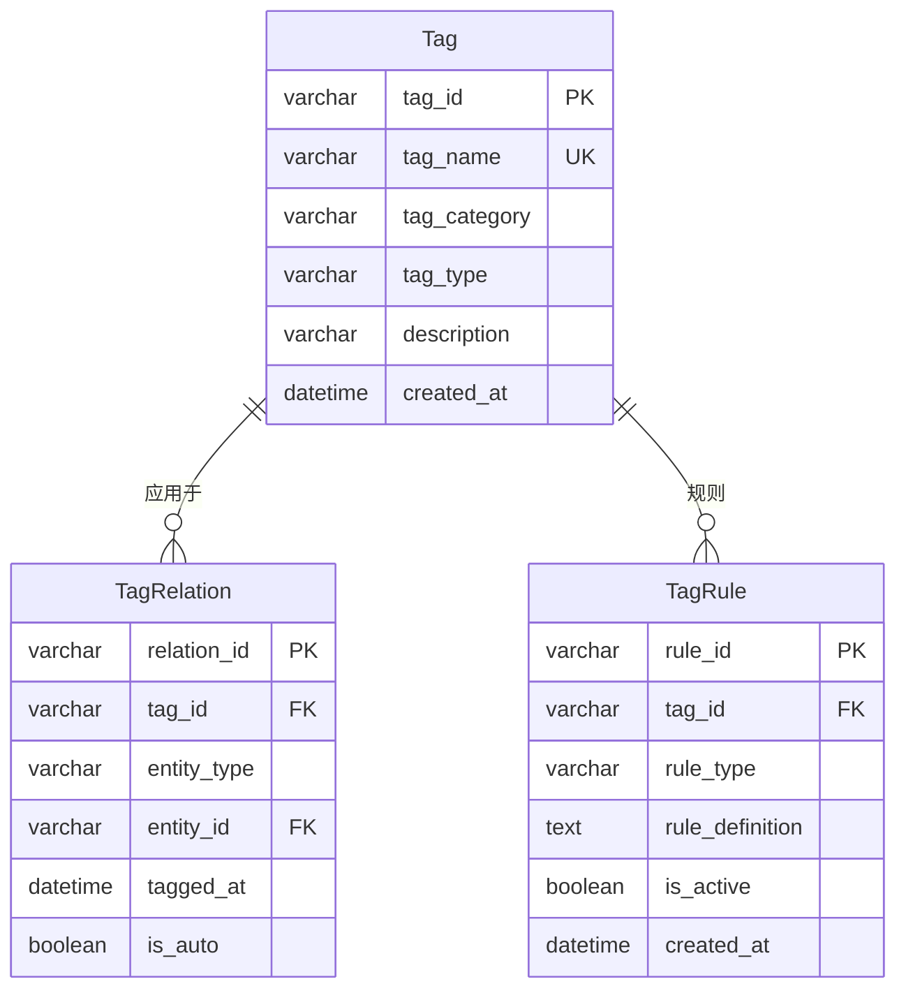

**表关系说明：**
- Tag（1） : TagRelation（N）- 一个标签可以打给多个实体
- Tag（1） : TagRule（N）- 一个标签可以有多个自动打标规则
- TagRelation通过entity_type和entity_id关联到Account/Contact/Lead

---

### 5. 分群系统实体模型

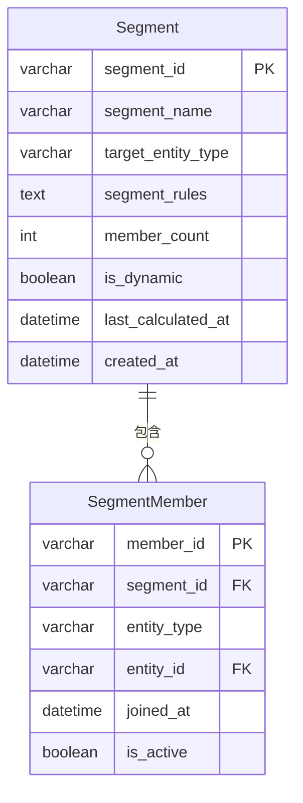

**表关系说明：**
- Segment（1） : SegmentMember（N）- 一个分群包含多个成员
- SegmentMember通过entity_type和entity_id关联到Account/Contact/Lead

---

### 6. 渠道实体模型

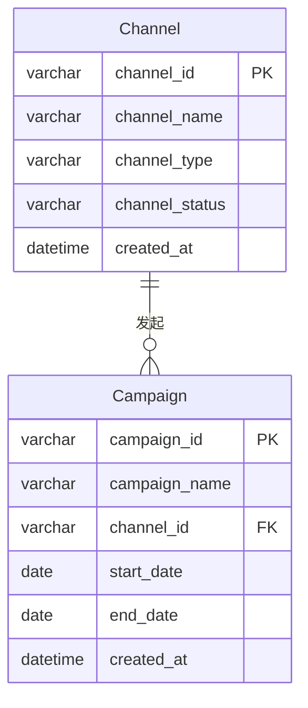

**表关系说明：**
- Channel（1） : Campaign（N）- 一个渠道可以发起多个营销活动

---

## 关键业务流程

### 1. 数据采集与清洗流程

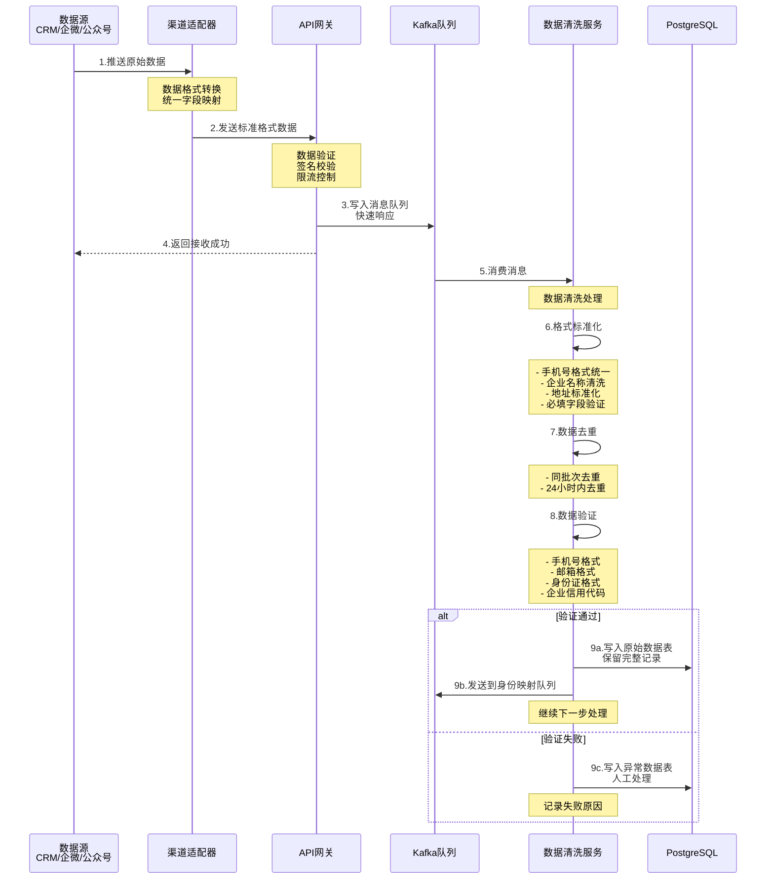

**关键点：**
- 适配器层：各渠道数据统一格式
- 网关层：快速响应，写入队列后立即返回
- 清洗层：格式标准化、去重、验证
- 异步处理：不阻塞数据采集主流程

---

### 2. 身份映射与全渠道整合流程

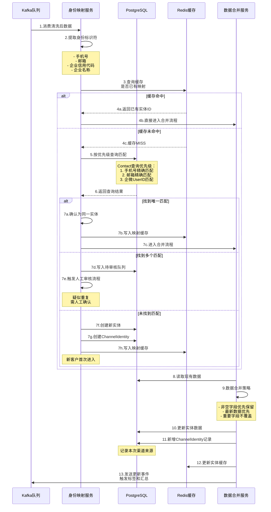

**关键点：**
- 缓存优先：减少数据库查询压力
- 匹配优先级：手机号 > 邮箱 > 企微ID
- 疑似重复：人工审核避免误合并
- 数据合并策略：保护重要字段不被覆盖

---

### 3. 标签打标流程

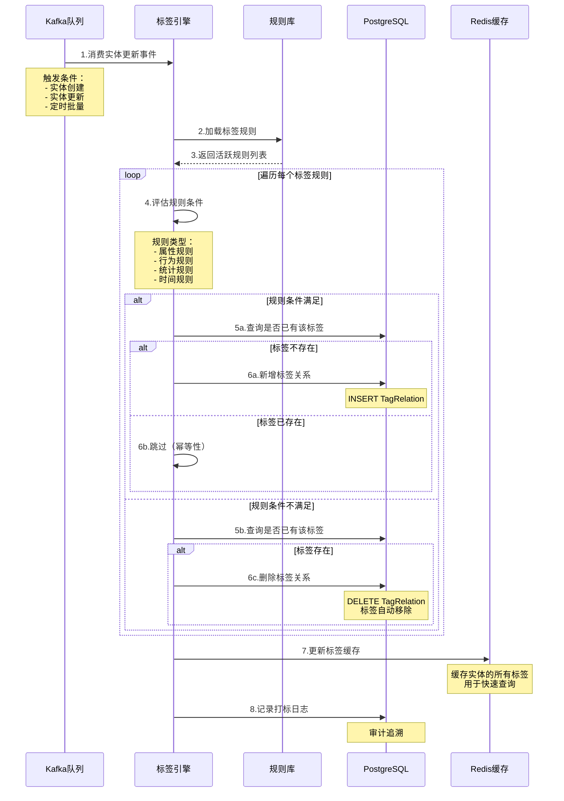

**标签规则示例：**

```
属性规则：
- 行业 = "互联网" → 打标签"互联网行业"
- 年营收 > 1亿 → 打标签"大型企业"
- 省份 = "浙江" → 打标签"浙江客户"

行为规则：
- 30天内访问次数 > 10 → 打标签"高活跃"
- 下载过白皮书 → 打标签"内容营销线索"
- 参加过线下活动 → 打标签"线下活动客户"

统计规则：
- 商机总数 > 5 → 打标签"重点跟进客户"
- 成交金额 > 100万 → 打标签"高价值客户"
- 流失天数 > 180 → 打标签"流失预警"

时间规则：
- 注册时间 < 7天 → 打标签"新客户"
- 最后活跃 < 30天 → 打标签"活跃客户"
```

---

### 4. 客户圈人（分群）流程

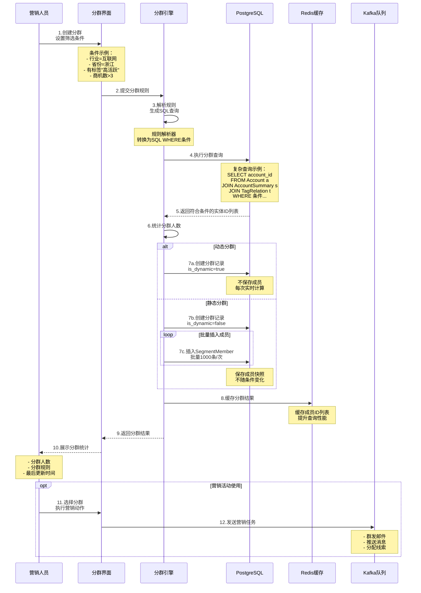

**动态分群 vs 静态分群：**

| 对比项 | 动态分群 | 静态分群 |
|--------|---------|---------|
| 成员存储 | 不存储，实时计算 | 存储快照 |
| 成员变化 | 自动更新 | 固定不变 |
| 查询性能 | 较慢（每次计算） | 快速（直接查表） |
| 存储占用 | 小 | 大 |
| 适用场景 | 持续性营销 | 一次性活动 |
| 示例 | "活跃客户"群 | "双11参与客户"群 |

---

### 5. 汇总计算流程

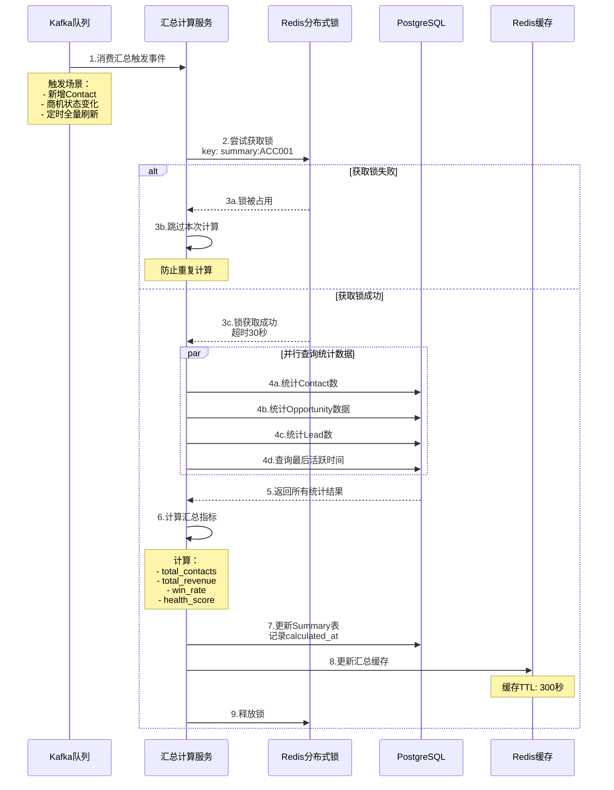

**汇总计算优化策略：**

```
增量计算：
- 只计算变化部分
- 减少全表扫描
- 提升计算速度

并行查询：
- 统计数据并行执行
- 减少总耗时
- 提升吞吐量

分布式锁：
- 防止重复计算
- 保证数据一致性
- 避免资源浪费

定时 + 实时：
- 定时任务：每小时全量刷新
- 实时触发：关键事件立即计算
- 保证数据新鲜度
```

---

## 技术实现方案

### 1. 数据库表结构设计

#### Account核心表

```sql
-- Account基础表
CREATE TABLE account (
    account_id VARCHAR(64) PRIMARY KEY COMMENT '账户ID',
    account_name VARCHAR(200) NOT NULL COMMENT '企业名称',
    unified_social_credit_code VARCHAR(18) UNIQUE COMMENT '统一信用代码',
    account_type VARCHAR(50) NOT NULL COMMENT '客户类型',
    account_status VARCHAR(50) NOT NULL COMMENT '账户状态',
    industry_id VARCHAR(64) COMMENT '行业ID',
    province VARCHAR(50) COMMENT '省份',
    city VARCHAR(50) COMMENT '城市',
    account_source VARCHAR(100) COMMENT '来源',
    owner_user_id VARCHAR(64) COMMENT '负责人',
    created_at DATETIME NOT NULL DEFAULT CURRENT_TIMESTAMP,
    updated_at DATETIME NOT NULL DEFAULT CURRENT_TIMESTAMP ON UPDATE CURRENT_TIMESTAMP,
    INDEX idx_name (account_name),
    INDEX idx_status (account_status),
    INDEX idx_city (province, city)
) ENGINE=InnoDB DEFAULT CHARSET=utf8mb4 COMMENT='企业账户表';

-- AccountSummary汇总表
CREATE TABLE account_summary (
    summary_id VARCHAR(64) PRIMARY KEY COMMENT '汇总ID',
    account_id VARCHAR(64) NOT NULL UNIQUE COMMENT '账户ID',
    total_contacts INT DEFAULT 0 COMMENT '联系人总数',
    total_opportunities INT DEFAULT 0 COMMENT '商机总数',
    total_leads INT DEFAULT 0 COMMENT '线索总数',
    total_revenue DECIMAL(18,2) DEFAULT 0 COMMENT '累计收入',
    won_opportunities INT DEFAULT 0 COMMENT '赢单数',
    lost_opportunities INT DEFAULT 0 COMMENT '输单数',
    win_rate DECIMAL(5,2) DEFAULT 0 COMMENT '赢单率',
    health_score INT DEFAULT 0 COMMENT '健康度评分',
    last_activity_at DATETIME COMMENT '最后活跃时间',
    calculated_at DATETIME NOT NULL COMMENT '计算时间',
    updated_at DATETIME NOT NULL DEFAULT CURRENT_TIMESTAMP ON UPDATE CURRENT_TIMESTAMP,
    FOREIGN KEY (account_id) REFERENCES account(account_id),
    INDEX idx_health_score (health_score DESC),
    INDEX idx_revenue (total_revenue DESC)
) ENGINE=InnoDB DEFAULT CHARSET=utf8mb4 COMMENT='企业账户汇总表';

-- AccountChannelIdentity渠道身份映射表
CREATE TABLE account_channel_identity (
    identity_id VARCHAR(64) PRIMARY KEY COMMENT '身份ID',
    account_id VARCHAR(64) NOT NULL COMMENT '账户ID',
    channel_id VARCHAR(64) NOT NULL COMMENT '渠道ID',
    channel_account_id VARCHAR(200) NOT NULL COMMENT '渠道内账户ID',
    identity_type VARCHAR(50) COMMENT '身份类型',
    is_verified BOOLEAN DEFAULT FALSE COMMENT '是否已验证',
    first_seen_at DATETIME NOT NULL COMMENT '首次发现时间',
    last_seen_at DATETIME NOT NULL COMMENT '最后活跃时间',
    UNIQUE KEY uk_account_channel (account_id, channel_id),
    INDEX idx_channel_account (channel_id, channel_account_id),
    FOREIGN KEY (account_id) REFERENCES account(account_id)
) ENGINE=InnoDB DEFAULT CHARSET=utf8mb4 COMMENT='企业渠道身份映射表';
```

#### Contact核心表

```sql
-- Contact基础表
CREATE TABLE contact (
    contact_id VARCHAR(64) PRIMARY KEY COMMENT '联系人ID',
    contact_name VARCHAR(100) NOT NULL COMMENT '姓名',
    mobile_phone VARCHAR(20) UNIQUE COMMENT '手机号',
    email VARCHAR(200) UNIQUE COMMENT '邮箱',
    wechat_id VARCHAR(100) COMMENT '微信ID',
    job_title VARCHAR(100) COMMENT '职位',
    contact_status VARCHAR(50) NOT NULL COMMENT '状态',
    primary_account_id VARCHAR(64) COMMENT '主要企业ID',
    contact_source VARCHAR(100) COMMENT '来源',
    owner_user_id VARCHAR(64) COMMENT '负责人',
    created_at DATETIME NOT NULL DEFAULT CURRENT_TIMESTAMP,
    updated_at DATETIME NOT NULL DEFAULT CURRENT_TIMESTAMP ON UPDATE CURRENT_TIMESTAMP,
    INDEX idx_phone (mobile_phone),
    INDEX idx_email (email),
    INDEX idx_account (primary_account_id)
) ENGINE=InnoDB DEFAULT CHARSET=utf8mb4 COMMENT='联系人表';

-- ContactSummary汇总表
CREATE TABLE contact_summary (
    summary_id VARCHAR(64) PRIMARY KEY COMMENT '汇总ID',
    contact_id VARCHAR(64) NOT NULL UNIQUE COMMENT '联系人ID',
    total_interactions INT DEFAULT 0 COMMENT '互动总数',
    email_opens INT DEFAULT 0 COMMENT '邮件打开数',
    email_clicks INT DEFAULT 0 COMMENT '邮件点击数',
    engagement_score INT DEFAULT 0 COMMENT '参与度评分',
    last_activity_at DATETIME COMMENT '最后活跃时间',
    calculated_at DATETIME NOT NULL COMMENT '计算时间',
    updated_at DATETIME NOT NULL DEFAULT CURRENT_TIMESTAMP ON UPDATE CURRENT_TIMESTAMP,
    FOREIGN KEY (contact_id) REFERENCES contact(contact_id),
    INDEX idx_engagement (engagement_score DESC)
) ENGINE=InnoDB DEFAULT CHARSET=utf8mb4 COMMENT='联系人汇总表';

-- ContactChannelIdentity渠道身份映射表
CREATE TABLE contact_channel_identity (
    identity_id VARCHAR(64) PRIMARY KEY COMMENT '身份ID',
    contact_id VARCHAR(64) NOT NULL COMMENT '联系人ID',
    channel_id VARCHAR(64) NOT NULL COMMENT '渠道ID',
    channel_user_id VARCHAR(200) NOT NULL COMMENT '渠道用户ID',
    identity_type VARCHAR(50) COMMENT '身份类型',
    is_verified BOOLEAN DEFAULT FALSE COMMENT '是否已验证',
    first_seen_at DATETIME NOT NULL COMMENT '首次发现时间',
    last_seen_at DATETIME NOT NULL COMMENT '最后活跃时间',
    UNIQUE KEY uk_contact_channel (contact_id, channel_id),
    INDEX idx_channel_user (channel_id, channel_user_id),
    FOREIGN KEY (contact_id) REFERENCES contact(contact_id)
) ENGINE=InnoDB DEFAULT CHARSET=utf8mb4 COMMENT='联系人渠道身份映射表';
```

#### 标签系统表

```sql
-- Tag标签表
CREATE TABLE tag (
    tag_id VARCHAR(64) PRIMARY KEY COMMENT '标签ID',
    tag_name VARCHAR(100) NOT NULL UNIQUE COMMENT '标签名称',
    tag_category VARCHAR(50) COMMENT '标签分类',
    tag_type VARCHAR(50) COMMENT '标签类型',
    description TEXT COMMENT '描述',
    created_at DATETIME NOT NULL DEFAULT CURRENT_TIMESTAMP,
    INDEX idx_category (tag_category)
) ENGINE=InnoDB DEFAULT CHARSET=utf8mb4 COMMENT='标签表';

-- TagRelation标签关系表
CREATE TABLE tag_relation (
    relation_id VARCHAR(64) PRIMARY KEY COMMENT '关系ID',
    tag_id VARCHAR(64) NOT NULL COMMENT '标签ID',
    entity_type VARCHAR(50) NOT NULL COMMENT '实体类型',
    entity_id VARCHAR(64) NOT NULL COMMENT '实体ID',
    tagged_at DATETIME NOT NULL DEFAULT CURRENT_TIMESTAMP COMMENT '打标时间',
    is_auto BOOLEAN DEFAULT FALSE COMMENT '是否自动打标',
    UNIQUE KEY uk_tag_entity (tag_id, entity_type, entity_id),
    INDEX idx_entity (entity_type, entity_id),
    FOREIGN KEY (tag_id) REFERENCES tag(tag_id)
) ENGINE=InnoDB DEFAULT CHARSET=utf8mb4 COMMENT='标签关系表';

-- TagRule标签规则表
CREATE TABLE tag_rule (
    rule_id VARCHAR(64) PRIMARY KEY COMMENT '规则ID',
    tag_id VARCHAR(64) NOT NULL COMMENT '标签ID',
    rule_type VARCHAR(50) NOT NULL COMMENT '规则类型',
    rule_definition TEXT NOT NULL COMMENT '规则定义',
    is_active BOOLEAN DEFAULT TRUE COMMENT '是否启用',
    created_at DATETIME NOT NULL DEFAULT CURRENT_TIMESTAMP,
    FOREIGN KEY (tag_id) REFERENCES tag(tag_id)
) ENGINE=InnoDB DEFAULT CHARSET=utf8mb4 COMMENT='标签规则表';
```

#### 分群系统表

```sql
-- Segment分群表
CREATE TABLE segment (
    segment_id VARCHAR(64) PRIMARY KEY COMMENT '分群ID',
    segment_name VARCHAR(200) NOT NULL COMMENT '分群名称',
    target_entity_type VARCHAR(50) NOT NULL COMMENT '目标实体类型',
    segment_rules TEXT NOT NULL COMMENT '分群规则',
    member_count INT DEFAULT 0 COMMENT '成员数量',
    is_dynamic BOOLEAN DEFAULT FALSE COMMENT '是否动态分群',
    last_calculated_at DATETIME COMMENT '最后计算时间',
    created_at DATETIME NOT NULL DEFAULT CURRENT_TIMESTAMP,
    INDEX idx_entity_type (target_entity_type)
) ENGINE=InnoDB DEFAULT CHARSET=utf8mb4 COMMENT='分群表';

-- SegmentMember分群成员表（仅静态分群使用）
CREATE TABLE segment_member (
    member_id VARCHAR(64) PRIMARY KEY COMMENT '成员ID',
    segment_id VARCHAR(64) NOT NULL COMMENT '分群ID',
    entity_type VARCHAR(50) NOT NULL COMMENT '实体类型',
    entity_id VARCHAR(64) NOT NULL COMMENT '实体ID',
    joined_at DATETIME NOT NULL DEFAULT CURRENT_TIMESTAMP COMMENT '加入时间',
    is_active BOOLEAN DEFAULT TRUE COMMENT '是否活跃',
    UNIQUE KEY uk_segment_entity (segment_id, entity_type, entity_id),
    INDEX idx_entity (entity_type, entity_id),
    FOREIGN KEY (segment_id) REFERENCES segment(segment_id)
) ENGINE=InnoDB DEFAULT CHARSET=utf8mb4 COMMENT='分群成员表';
```

---

### 2. Kafka Topic设计

```yaml
Topic设计:

1. data-ingestion (数据采集)
   Partition: 8
   Replication: 3
   Retention: 7天
   用途: 接收多渠道原始数据

2. data-cleaning (数据清洗)
   Partition: 8
   Replication: 3
   Retention: 3天
   用途: 清洗后的标准数据

3. identity-mapping (身份映射)
   Partition: 8
   Replication: 3
   Retention: 3天
   用途: 身份识别和映射任务

4. entity-merge (实体合并)
   Partition: 8
   Replication: 3
   Retention: 3天
   用途: 实体数据合并任务

5. tag-calculation (标签计算)
   Partition: 8
   Replication: 3
   Retention: 3天
   用途: 标签打标任务

6. summary-calculation (汇总计算)
   Partition: 8
   Replication: 3
   Retention: 3天
   用途: 汇总统计任务
```

---

### 3. 缓存策略设计

```yaml
Redis缓存设计:

1. 实体基础数据缓存
   Key: entity:{type}:{id}
   TTL: 300秒
   示例: entity:account:ACC001
   用途: 缓存Account/Contact基础信息

2. 汇总数据缓存
   Key: summary:{type}:{id}
   TTL: 300秒
   示例: summary:account:ACC001
   用途: 缓存Summary汇总数据

3. 标签缓存
   Key: tags:{type}:{id}
   TTL: 600秒
   示例: tags:account:ACC001
   Value: ["高价值客户", "互联网行业", "浙江"]
   用途: 缓存实体的所有标签

4. 分群成员缓存
   Key: segment:members:{segment_id}
   TTL: 1800秒
   Value: Set类型，存储entity_id
   用途: 缓存分群成员列表

5. 身份映射缓存
   Key: identity:{channel}:{channel_user_id}
   TTL: 3600秒
   示例: identity:wechat:openid_xxx
   Value: contact_id
   用途: 快速查询渠道身份对应的实体ID

6. 分布式锁
   Key: lock:summary:{entity_id}
   TTL: 30秒
   用途: 防止汇总计算重复执行
```

---

### 4. 核心服务接口设计

```yaml
数据采集服务:
  POST /api/ingestion/crm
    - 接收CRM数据
  POST /api/ingestion/wework
    - 接收企业微信数据
  POST /api/ingestion/wechat
    - 接收公众号数据

查询服务:
  GET /api/account/{id}
    - 查询Account详情
  GET /api/account/{id}/360
    - 查询Account 360度视图
  GET /api/contact/{id}
    - 查询Contact详情
  GET /api/contact/search
    - 搜索Contact

标签服务:
  GET /api/tag/list
    - 获取标签列表
  POST /api/tag/create
    - 创建标签
  POST /api/tag/apply
    - 手动打标签
  GET /api/tag/entity/{type}/{id}
    - 查询实体的所有标签

分群服务:
  POST /api/segment/create
    - 创建分群
  GET /api/segment/{id}/members
    - 获取分群成员
  POST /api/segment/calculate
    - 重新计算分群
  GET /api/segment/list
    - 获取分群列表
```

---

## 总结

### 核心能力

**1. 多渠道数据采集**
- 统一接入层，支持CRM、企微、公众号等多渠道
- 快速响应，异步处理
- 数据清洗和标准化

**2. 全渠道身份整合**
- 基于手机号、邮箱、企业信用代码等多维度匹配
- ChannelIdentity记录每个渠道身份
- 疑似重复人工审核

**3. 智能标签系统**
- 支持自动打标和手动打标
- 规则引擎驱动
- 标签分类管理

**4. 灵活分群能力**
- 动态分群：实时计算
- 静态分群：快照固化
- 支持复杂条件组合

**5. 实时汇总统计**
- 异步计算，不阻塞主流程
- 分布式锁防重
- 缓存优化查询性能

### 技术特点

```
简洁清晰：
- 专注核心业务流程
- 去除复杂行为数据
- 架构易于理解

高性能：
- 消息队列异步解耦
- 多级缓存策略
- 数据库索引优化

高可用：
- PostgreSQL主从复制
- Redis Cluster
- Kafka集群部署

可扩展：
- 微服务架构
- 水平扩展能力
- 插件化设计
```

### 适用场景

- 企业客户数：100万-1000万
- 联系人数：500万-5000万
- 线索数：200万-2000万/年
- 数据采集QPS：1000-10000
- 查询QPS：5000-50000
