# B2B CDP Entity Design Specification

## Table of Contents
- [Architecture Overview](#architecture-overview)
- [Core Entity Design](#core-entity-design)
- [Entity Relationship](#entity-relationship)
- [Business Processes](#business-processes)
- [Data Model Design](#data-model-design)

---

## Architecture Overview

### Layered Architecture

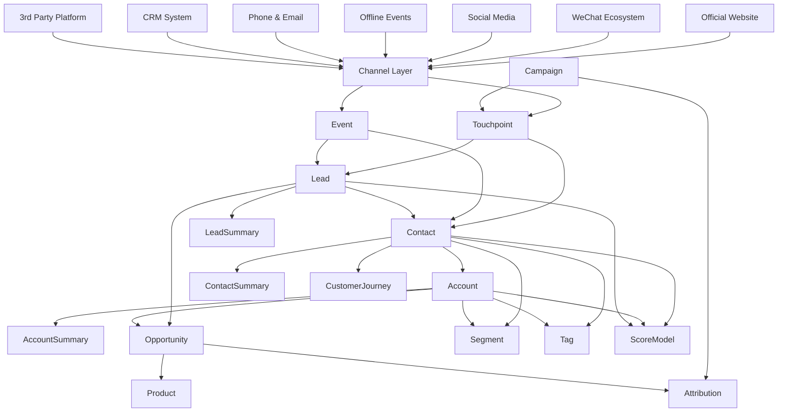
```mermaid
graph TB
    DS1[Official Website] --> CH[Channel Layer]
    DS2[WeChat Ecosystem] --> CH
    DS3[Social Media] --> CH
    DS4[Offline Events] --> CH
    DS5[Phone & Email] --> CH
    DS6[CRM System] --> CH
    DS7[3rd Party Platform] --> CH
    
    CH --> TP[Touchpoint]
    CH --> EV[Event]
    CM[Campaign] --> TP
    
    TP --> CT[Contact]
    TP --> LD[Lead]
    EV --> CT
    EV --> LD
    
    CT --> AC[Account]
    LD --> CT
    
    CT --> CTS[ContactSummary]
    LD --> LDS[LeadSummary]
    AC --> ACS[AccountSummary]
    
    LD --> OP[Opportunity]
    AC --> OP
    OP --> PR[Product]
    
    CT --> SG[Segment]
    AC --> SG
    CT --> TG[Tag]
    AC --> TG
    CT --> SC[ScoreModel]
    AC --> SC
    LD --> SC
    CT --> JN[CustomerJourney]
    CM --> AT[Attribution]
    OP --> AT
```

---

### Technology Architecture

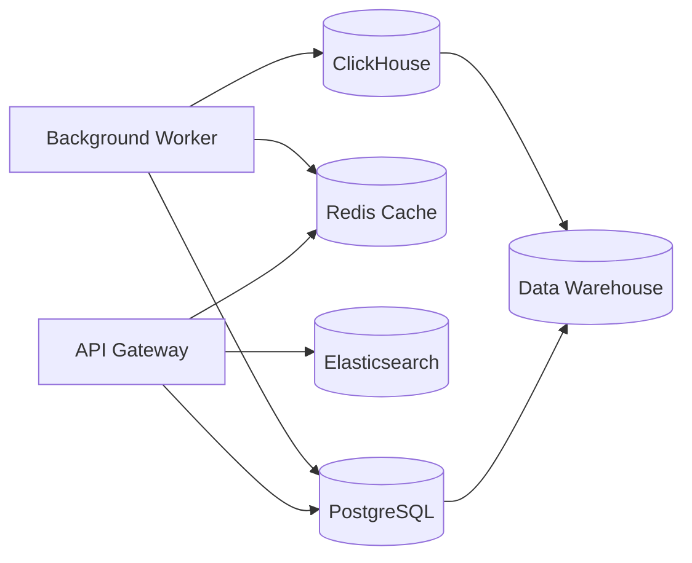
```mermaid
graph LR
    API[API Gateway] --> PG[(PostgreSQL)]
    API --> RD[(Redis Cache)]
    API --> ES[(Elasticsearch)]
    
    WK[Background Worker] --> PG
    WK --> CH[(ClickHouse)]
    WK --> RD
    
    PG --> DW[(Data Warehouse)]
    CH --> DW
```

---

## Core Entity Design

### Account Entity Model

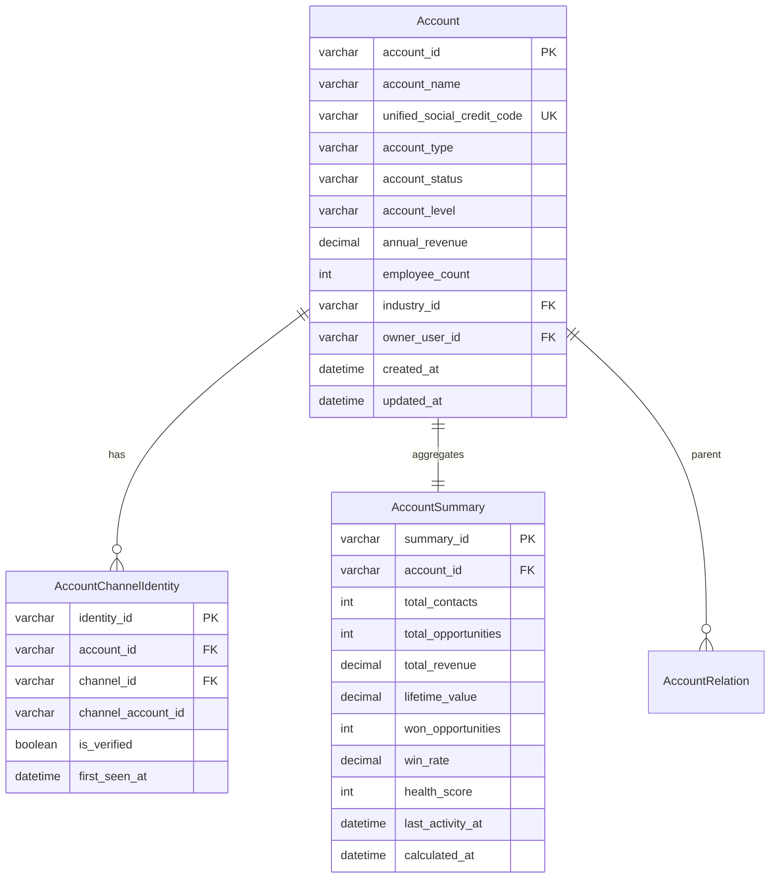
```mermaid
erDiagram
    Account ||--o{ AccountChannelIdentity : has
    Account ||--|| AccountSummary : aggregates
    Account ||--o{ AccountRelation : parent
    
    Account {
        varchar account_id PK
        varchar account_name
        varchar unified_social_credit_code UK
        varchar account_type
        varchar account_status
        varchar account_level
        decimal annual_revenue
        int employee_count
        varchar industry_id FK
        varchar owner_user_id FK
        datetime created_at
        datetime updated_at
    }
    
    AccountChannelIdentity {
        varchar identity_id PK
        varchar account_id FK
        varchar channel_id FK
        varchar channel_account_id
        boolean is_verified
        datetime first_seen_at
    }
    
    AccountSummary {
        varchar summary_id PK
        varchar account_id FK
        int total_contacts
        int total_opportunities
        decimal total_revenue
        decimal lifetime_value
        int won_opportunities
        decimal win_rate
        int health_score
        datetime last_activity_at
        datetime calculated_at
    }
```

**Key Fields:**
- `account_id` - Unique account identifier
- `unified_social_credit_code` - Enterprise unique identifier
- `account_type` - CUSTOMER, PARTNER, COMPETITOR, PROSPECT
- `account_status` - ACTIVE, DORMANT, CHURNED, BLACKLIST
- `account_level` - STRATEGIC, IMPORTANT, NORMAL
- `lifecycle_stage` - AWARENESS, CONSIDERATION, DECISION, RETENTION, EXPANSION

**AccountSummary Metrics:**
- `total_contacts` - Number of associated contacts
- `total_revenue` - Cumulative revenue
- `lifetime_value` - Customer lifetime value
- `win_rate` - Win rate percentage
- `health_score` - Health score (0-100)

---

### Contact Entity Model

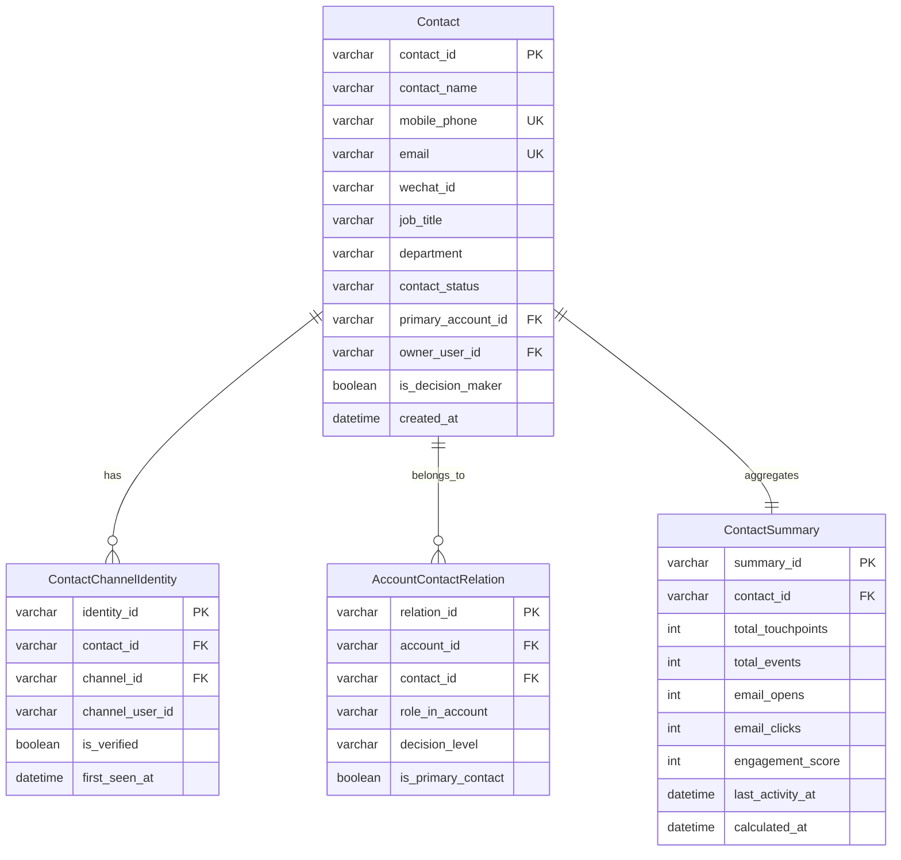
```mermaid
erDiagram
    Contact ||--o{ ContactChannelIdentity : has
    Contact ||--o{ AccountContactRelation : belongs_to
    Contact ||--|| ContactSummary : aggregates
    
    Contact {
        varchar contact_id PK
        varchar contact_name
        varchar mobile_phone UK
        varchar email UK
        varchar wechat_id
        varchar job_title
        varchar department
        varchar contact_status
        varchar primary_account_id FK
        varchar owner_user_id FK
        boolean is_decision_maker
        datetime created_at
    }
    
    ContactChannelIdentity {
        varchar identity_id PK
        varchar contact_id FK
        varchar channel_id FK
        varchar channel_user_id
        boolean is_verified
        datetime first_seen_at
    }
    
    ContactSummary {
        varchar summary_id PK
        varchar contact_id FK
        int total_touchpoints
        int total_events
        int email_opens
        int email_clicks
        int engagement_score
        datetime last_activity_at
        datetime calculated_at
    }
    
    AccountContactRelation {
        varchar relation_id PK
        varchar account_id FK
        varchar contact_id FK
        varchar role_in_account
        varchar decision_level
        boolean is_primary_contact
    }
```

**Key Fields:**
- `decision_level` - DECISION_MAKER, INFLUENCER, USER, GATEKEEPER
- `lifecycle_stage` - SUBSCRIBER, LEAD, MQL, SQL, OPPORTUNITY, CUSTOMER

**ContactSummary Metrics:**
- `engagement_score` - Engagement score (0-100)
- `email_opens` - Email open count
- `days_since_last_activity` - Days since last activity

---

### Lead Entity Model

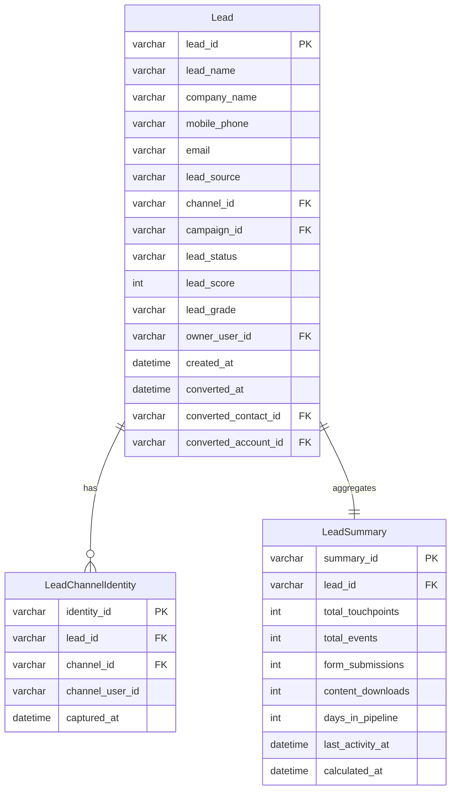
```mermaid
erDiagram
    Lead ||--o{ LeadChannelIdentity : has
    Lead ||--|| LeadSummary : aggregates
    
    Lead {
        varchar lead_id PK
        varchar lead_name
        varchar company_name
        varchar mobile_phone
        varchar email
        varchar lead_source
        varchar channel_id FK
        varchar campaign_id FK
        varchar lead_status
        int lead_score
        varchar lead_grade
        varchar owner_user_id FK
        datetime created_at
        datetime converted_at
        varchar converted_contact_id FK
        varchar converted_account_id FK
    }
    
    LeadChannelIdentity {
        varchar identity_id PK
        varchar lead_id FK
        varchar channel_id FK
        varchar channel_user_id
        datetime captured_at
    }
    
    LeadSummary {
        varchar summary_id PK
        varchar lead_id FK
        int total_touchpoints
        int total_events
        int form_submissions
        int content_downloads
        int days_in_pipeline
        datetime last_activity_at
        datetime calculated_at
    }
```

**Key Fields:**
- `lead_status` - NEW, CONTACTED, QUALIFIED, CONVERTED, DISQUALIFIED
- `lead_score` - Lead score (0-100)
- `lead_grade` - A, B, C, D
- `is_qualified` - MQL/SQL indicator

---

### Opportunity Entity Model

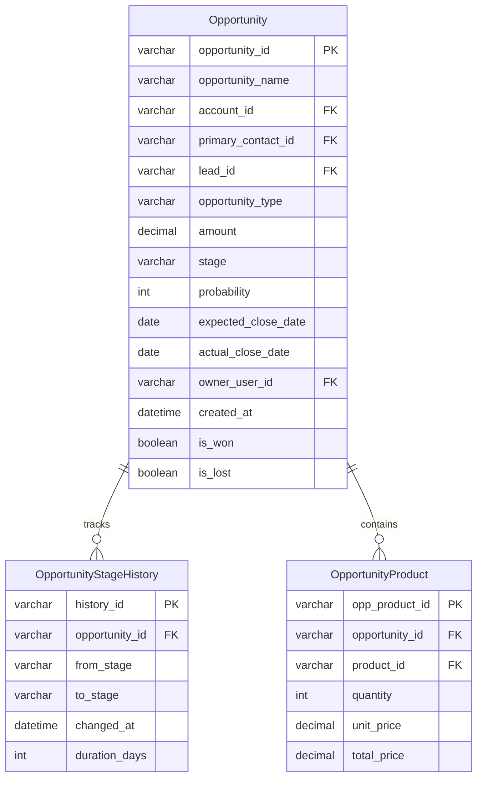
```mermaid
erDiagram
    Opportunity ||--o{ OpportunityStageHistory : tracks
    Opportunity ||--o{ OpportunityProduct : contains
    
    Opportunity {
        varchar opportunity_id PK
        varchar opportunity_name
        varchar account_id FK
        varchar primary_contact_id FK
        varchar lead_id FK
        varchar opportunity_type
        decimal amount
        varchar stage
        int probability
        date expected_close_date
        date actual_close_date
        varchar owner_user_id FK
        datetime created_at
        boolean is_won
        boolean is_lost
    }
    
    OpportunityStageHistory {
        varchar history_id PK
        varchar opportunity_id FK
        varchar from_stage
        varchar to_stage
        datetime changed_at
        int duration_days
    }
    
    OpportunityProduct {
        varchar opp_product_id PK
        varchar opportunity_id FK
        varchar product_id FK
        int quantity
        decimal unit_price
        decimal total_price
    }
```

**Key Fields:**
- `stage` - LEAD, QUALIFICATION, NEEDS_ANALYSIS, PROPOSAL, NEGOTIATION, CONTRACT, CLOSED_WON, CLOSED_LOST
- `probability` - Win probability (0-100)
- `opportunity_type` - NEW_BUSINESS, UPSELL, RENEWAL, CROSS_SELL

---

### Channel Entity Model

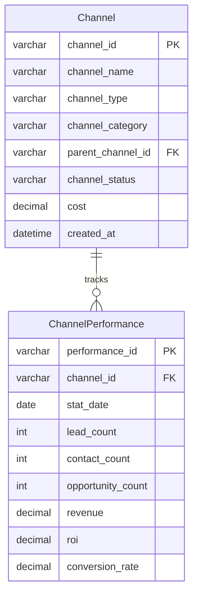
```mermaid
erDiagram
    Channel ||--o{ ChannelPerformance : tracks
    
    Channel {
        varchar channel_id PK
        varchar channel_name
        varchar channel_type
        varchar channel_category
        varchar parent_channel_id FK
        varchar channel_status
        decimal cost
        datetime created_at
    }
    
    ChannelPerformance {
        varchar performance_id PK
        varchar channel_id FK
        date stat_date
        int lead_count
        int contact_count
        int opportunity_count
        decimal revenue
        decimal roi
        decimal conversion_rate
    }
```

**Channel Types:**
- WEBSITE, SEO, SEM
- WECHAT, ENTERPRISE_WECHAT, DOUYIN
- EMAIL, PHONE
- OFFLINE_EVENT, EXHIBITION, PARTNER

---

### Campaign Entity Model

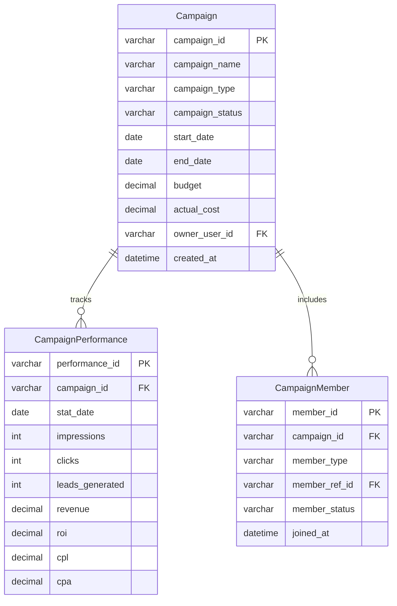
```mermaid
erDiagram
    Campaign ||--o{ CampaignPerformance : tracks
    Campaign ||--o{ CampaignMember : includes
    
    Campaign {
        varchar campaign_id PK
        varchar campaign_name
        varchar campaign_type
        varchar campaign_status
        date start_date
        date end_date
        decimal budget
        decimal actual_cost
        varchar owner_user_id FK
        datetime created_at
    }
    
    CampaignPerformance {
        varchar performance_id PK
        varchar campaign_id FK
        date stat_date
        int impressions
        int clicks
        int leads_generated
        decimal revenue
        decimal roi
        decimal cpl
        decimal cpa
    }
    
    CampaignMember {
        varchar member_id PK
        varchar campaign_id FK
        varchar member_type
        varchar member_ref_id FK
        varchar member_status
        datetime joined_at
    }
```

---

### Touchpoint Entity Model

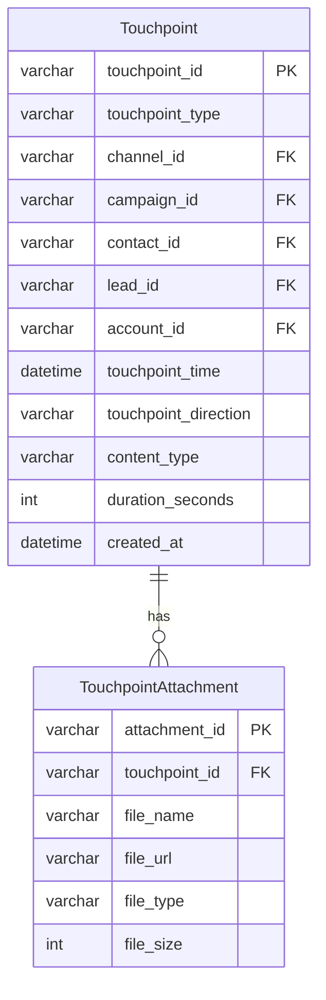
```mermaid
erDiagram
    Touchpoint ||--o{ TouchpointAttachment : has
    
    Touchpoint {
        varchar touchpoint_id PK
        varchar touchpoint_type
        varchar channel_id FK
        varchar campaign_id FK
        varchar contact_id FK
        varchar lead_id FK
        varchar account_id FK
        datetime touchpoint_time
        varchar touchpoint_direction
        varchar content_type
        int duration_seconds
        datetime created_at
    }
    
    TouchpointAttachment {
        varchar attachment_id PK
        varchar touchpoint_id FK
        varchar file_name
        varchar file_url
        varchar file_type
        int file_size
    }
```

**Touchpoint Types:**
- PAGE_VIEW, FORM_SUBMIT, DOWNLOAD
- EMAIL_OPEN, EMAIL_CLICK
- CALL, MEETING, CHAT

---

### Event Entity Model

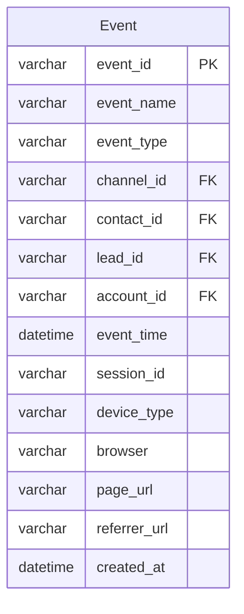
```mermaid
erDiagram
    Event {
        varchar event_id PK
        varchar event_name
        varchar event_type
        varchar channel_id FK
        varchar contact_id FK
        varchar lead_id FK
        varchar account_id FK
        datetime event_time
        varchar session_id
        varchar device_type
        varchar browser
        varchar page_url
        varchar referrer_url
        datetime created_at
    }
```

**Event Types:**
- PAGE_VIEW, BUTTON_CLICK
- FORM_START, FORM_SUBMIT
- FILE_DOWNLOAD, VIDEO_PLAY
- PRODUCT_TRIAL, SEARCH

---

### Product Entity Model

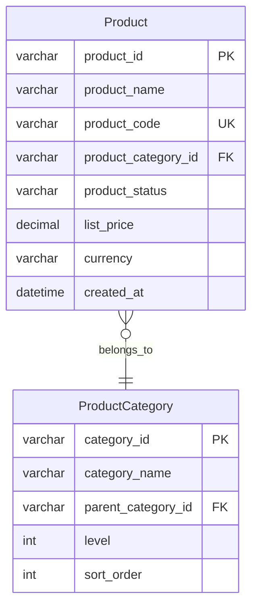
```mermaid
erDiagram
    Product }o--|| ProductCategory : belongs_to
    
    Product {
        varchar product_id PK
        varchar product_name
        varchar product_code UK
        varchar product_category_id FK
        varchar product_status
        decimal list_price
        varchar currency
        datetime created_at
    }
    
    ProductCategory {
        varchar category_id PK
        varchar category_name
        varchar parent_category_id FK
        int level
        int sort_order
    }
```

---

### Tag Entity Model

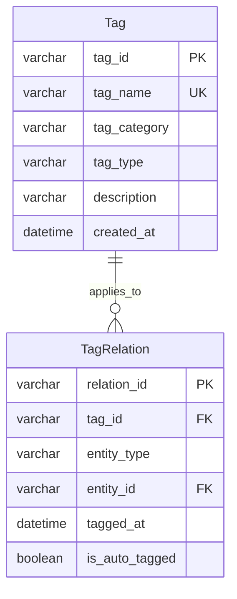
```mermaid
erDiagram
    Tag ||--o{ TagRelation : applies_to
    
    Tag {
        varchar tag_id PK
        varchar tag_name UK
        varchar tag_category
        varchar tag_type
        varchar description
        datetime created_at
    }
    
    TagRelation {
        varchar relation_id PK
        varchar tag_id FK
        varchar entity_type
        varchar entity_id FK
        datetime tagged_at
        boolean is_auto_tagged
    }
```

**Tag Types:**
- BEHAVIOR - Behavioral tags
- PROFILE - Profile tags
- BUSINESS - Business tags
- INTEREST - Interest tags

---

### Segment Entity Model

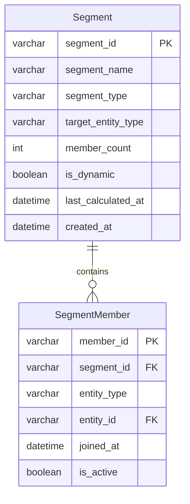
```mermaid
erDiagram
    Segment ||--o{ SegmentMember : contains
    
    Segment {
        varchar segment_id PK
        varchar segment_name
        varchar segment_type
        varchar target_entity_type
        int member_count
        boolean is_dynamic
        datetime last_calculated_at
        datetime created_at
    }
    
    SegmentMember {
        varchar member_id PK
        varchar segment_id FK
        varchar entity_type
        varchar entity_id FK
        datetime joined_at
        boolean is_active
    }
```

---

### Score Entity Model

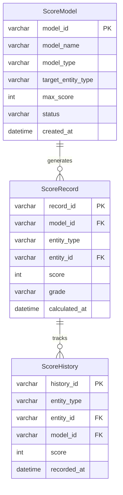
```mermaid
erDiagram
    ScoreModel ||--o{ ScoreRecord : generates
    ScoreRecord ||--o{ ScoreHistory : tracks
    
    ScoreModel {
        varchar model_id PK
        varchar model_name
        varchar model_type
        varchar target_entity_type
        int max_score
        varchar status
        datetime created_at
    }
    
    ScoreRecord {
        varchar record_id PK
        varchar model_id FK
        varchar entity_type
        varchar entity_id FK
        int score
        varchar grade
        datetime calculated_at
    }
    
    ScoreHistory {
        varchar history_id PK
        varchar entity_type
        varchar entity_id FK
        varchar model_id FK
        int score
        datetime recorded_at
    }
```

**Score Types:**
- LEAD_SCORING - Lead scoring
- ACCOUNT_HEALTH - Account health scoring
- CONTACT_ENGAGEMENT - Contact engagement scoring

---

### Industry Entity Model

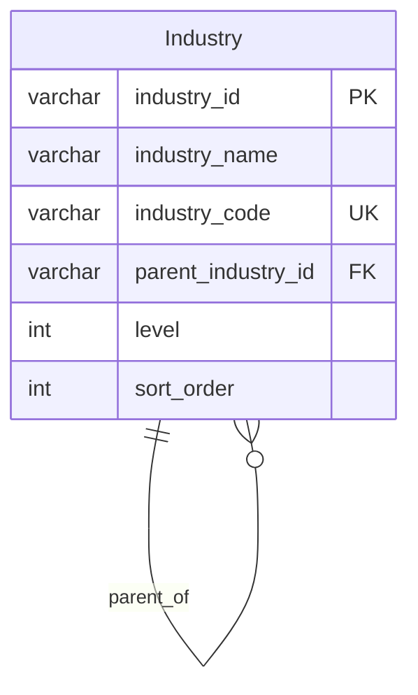
```mermaid
erDiagram
    Industry ||--o{ Industry : parent_of
    
    Industry {
        varchar industry_id PK
        varchar industry_name
        varchar industry_code UK
        varchar parent_industry_id FK
        int level
        int sort_order
    }
```

---

### Attribution Entity Model

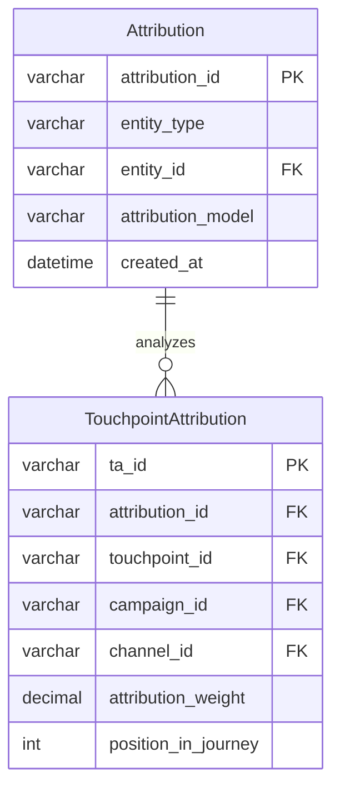
```mermaid
erDiagram
    Attribution ||--o{ TouchpointAttribution : analyzes
    
    Attribution {
        varchar attribution_id PK
        varchar entity_type
        varchar entity_id FK
        varchar attribution_model
        datetime created_at
    }
    
    TouchpointAttribution {
        varchar ta_id PK
        varchar attribution_id FK
        varchar touchpoint_id FK
        varchar campaign_id FK
        varchar channel_id FK
        decimal attribution_weight
        int position_in_journey
    }
```

**Attribution Models:**
- FIRST_TOUCH - First touch attribution
- LAST_TOUCH - Last touch attribution
- LINEAR - Linear attribution
- TIME_DECAY - Time decay attribution
- U_SHAPED - U-shaped attribution
- W_SHAPED - W-shaped attribution

---

### CustomerJourney Entity Model

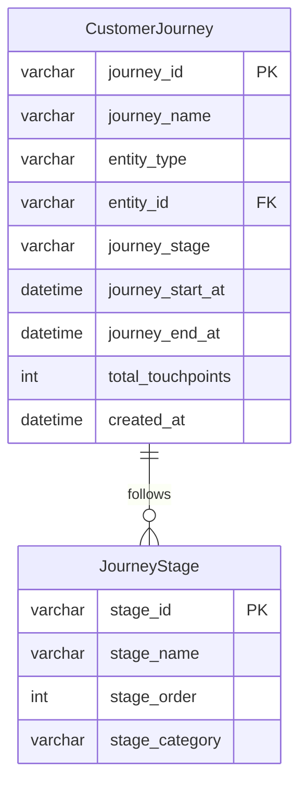
```mermaid
erDiagram
    CustomerJourney ||--o{ JourneyStage : follows
    
    CustomerJourney {
        varchar journey_id PK
        varchar journey_name
        varchar entity_type
        varchar entity_id FK
        varchar journey_stage
        datetime journey_start_at
        datetime journey_end_at
        int total_touchpoints
        datetime created_at
    }
    
    JourneyStage {
        varchar stage_id PK
        varchar stage_name
        int stage_order
        varchar stage_category
    }
```

---

## Entity Relationship

### Core Entity Relationships

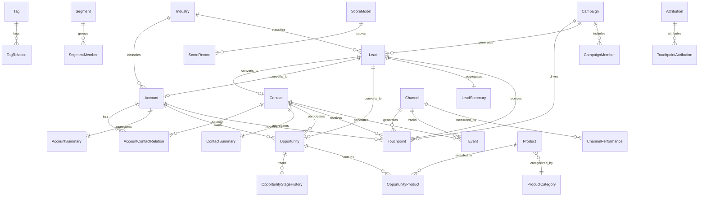
```mermaid
erDiagram
    Account ||--o{ AccountContactRelation : has
    Account ||--|| AccountSummary : aggregates
    Account ||--o{ Opportunity : owns
    Account ||--o{ Touchpoint : receives
    
    Contact ||--o{ AccountContactRelation : belongs
    Contact ||--|| ContactSummary : aggregates
    Contact ||--o{ Opportunity : participates
    Contact ||--o{ Touchpoint : receives
    Contact ||--o{ Event : generates
    
    Lead ||--o| Contact : converts_to
    Lead ||--o| Account : converts_to
    Lead ||--o| Opportunity : converts_to
    Lead ||--|| LeadSummary : aggregates
    Lead ||--o{ Touchpoint : receives
    
    Opportunity ||--o{ OpportunityStageHistory : tracks
    Opportunity ||--o{ OpportunityProduct : contains
    
    Product ||--o{ OpportunityProduct : included_in
    Product }o--|| ProductCategory : categorized_by
    
    Channel ||--o{ Touchpoint : generates
    Channel ||--o{ Event : tracks
    Channel ||--o{ ChannelPerformance : measured_by
    
    Campaign ||--o{ Touchpoint : drives
    Campaign ||--o{ Lead : generates
    Campaign ||--o{ CampaignMember : includes
    
    Tag ||--o{ TagRelation : tags
    Segment ||--o{ SegmentMember : groups
    
    ScoreModel ||--o{ ScoreRecord : scores
    
    Industry ||--o{ Account : classifies
    Industry ||--o{ Lead : classifies
    
    Attribution ||--o{ TouchpointAttribution : attributes
```

---

### Identity Resolution Architecture

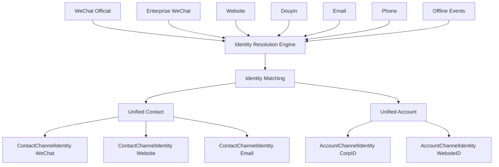
```mermaid
graph TB
    S1[WeChat Official] --> IR[Identity Resolution Engine]
    S2[Enterprise WeChat] --> IR
    S3[Website] --> IR
    S4[Douyin] --> IR
    S5[Email] --> IR
    S6[Phone] --> IR
    S7[Offline Events] --> IR
    
    IR --> IM[Identity Matching]
    IM --> UC[Unified Contact]
    IM --> UA[Unified Account]
    
    UC --> CI1[ContactChannelIdentity WeChat]
    UC --> CI2[ContactChannelIdentity Website]
    UC --> CI3[ContactChannelIdentity Email]
    
    UA --> AI1[AccountChannelIdentity CorpID]
    UA --> AI2[AccountChannelIdentity WebsiteID]
```

---

## Business Processes

### Lead to Opportunity Conversion

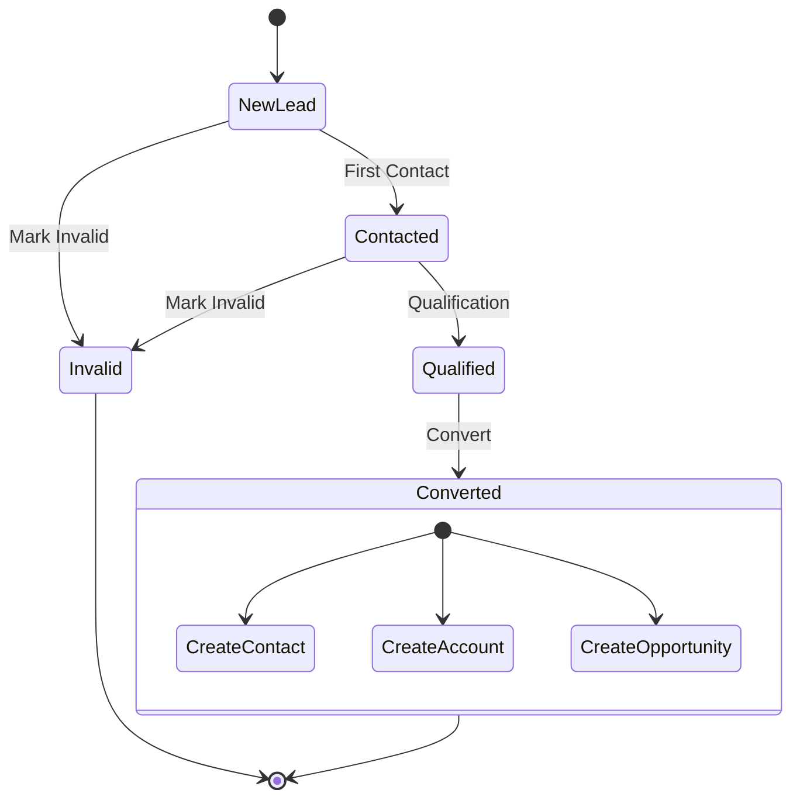
```mermaid
stateDiagram-v2
    [*] --> NewLead
    
    NewLead --> Contacted: First Contact
    NewLead --> Invalid: Mark Invalid
    
    Contacted --> Qualified: Qualification
    Contacted --> Invalid: Mark Invalid
    
    Qualified --> Converted: Convert
    
    state Converted {
        [*] --> CreateContact
        [*] --> CreateAccount
        [*] --> CreateOpportunity
    }
    
    Converted --> [*]
    Invalid --> [*]
```

---

### Opportunity Stage Progression

```mermaid
stateDiagram-v2
    [*] --> LeadStage
    
    LeadStage --> Qualification
    LeadStage --> Lost
    
    Qualification --> SolutionDesign
    Qualification --> Lost
    
    SolutionDesign --> Negotiation
    SolutionDesign --> Lost
    
    Negotiation --> Contract
    Negotiation --> Lost
    
    Contract --> Won
    Contract --> Lost
    
    Won --> [*]
    Lost --> [*]
```

---

### Customer Lifecycle

```mermaid
stateDiagram-v2
    [*] --> Awareness
    
    Awareness --> Consideration
    Consideration --> Decision
    Decision --> Retention
    Retention --> Expansion
    
    Retention --> Churn
    Expansion --> Churn
    
    Churn --> Winback
    Winback --> Retention
    Winback --> [*]
    
    Expansion --> [*]
```

---

### Multi-Channel Data Flow

```mermaid
sequenceDiagram
    participant User
    participant Channel
    participant Event
    participant Identity
    participant Lead
    participant Contact
    participant Account
    participant Summary
    
    User->>Channel: Interaction
    Channel->>Event: Log Event
    Event->>Identity: Identify User
    
    alt New User
        Identity->>Lead: Create Lead
        Lead->>Summary: Update LeadSummary
    else Known User
        Identity->>Contact: Link Contact
        Contact->>Account: Link Account
        Account->>Summary: Update Summary
    end
    
    Summary->>Channel: Trigger Response
    Channel->>User: Return Content
```

---

### Identity Matching Process

```mermaid
flowchart TD
    Start[Receive Data] --> Extract[Extract Identifiers]
    
    Extract --> Phone{Has Phone?}
    Extract --> Email{Has Email?}
    Extract --> WeChat{Has WeChat?}
    
    Phone -->|Yes| MatchPhone[Match by Phone Priority 1]
    Email -->|Yes| MatchEmail[Match by Email Priority 2]
    WeChat -->|Yes| MatchWeChat[Match by WeChat Priority 3]
    
    MatchPhone --> Found{Found?}
    MatchEmail --> Found
    MatchWeChat --> Found
    
    Found -->|Yes| Merge[Merge to Existing]
    Found -->|No| Create[Create New]
    
    Merge --> AddIdentity[Add Channel Identity]
    Create --> AddIdentity
    
    AddIdentity --> UpdateSummary[Update Summary]
    UpdateSummary --> End[Complete]
```

---

### Summary Update Strategy

```mermaid
flowchart LR
    T1[Scheduled Job Hourly] --> Engine[Calculation Engine]
    T2[Real-time Trigger] --> Engine
    T3[Manual Refresh] --> Engine
    
    Engine --> S1[AccountSummary]
    Engine --> S2[ContactSummary]
    Engine --> S3[LeadSummary]
```

---

## Data Model Design

### Account Table Schema

| Field | Type | Length | Constraint | Description | Example |
|-------|------|--------|------------|-------------|---------|
| account_id | VARCHAR | 64 | PK, NOT NULL | Unique account ID | ACC_20231105001 |
| account_name | VARCHAR | 200 | NOT NULL | Account name | Alibaba Group |
| unified_social_credit_code | VARCHAR | 18 | UNIQUE | Unified credit code | 91330000MA27XYZ123 |
| account_type | VARCHAR | 50 | NOT NULL | Account type | CUSTOMER, PARTNER, PROSPECT |
| industry_id | VARCHAR | 64 | FK | Industry ID | IND_001 |
| account_status | VARCHAR | 50 | NOT NULL | Account status | ACTIVE, DORMANT, CHURNED |
| account_level | VARCHAR | 50 |  | Account level | STRATEGIC, IMPORTANT, NORMAL |
| annual_revenue | DECIMAL | 18,2 |  | Annual revenue | 50000.00 |
| employee_count | INT |  |  | Employee count | 5000 |
| company_website | VARCHAR | 500 |  | Website URL | https://www.alibaba.com |
| province | VARCHAR | 50 |  | Province | Zhejiang |
| city | VARCHAR | 50 |  | City | Hangzhou |
| account_source | VARCHAR | 100 |  | Source | WEBSITE, EXHIBITION, PARTNER |
| primary_channel_id | VARCHAR | 64 | FK | Primary channel | CH_001 |
| owner_user_id | VARCHAR | 64 | FK | Owner user ID | USER_001 |
| created_at | DATETIME |  | NOT NULL | Created timestamp | 2023-11-05 10:30:00 |
| updated_at | DATETIME |  | NOT NULL | Updated timestamp | 2023-11-05 15:20:00 |
| lifecycle_stage | VARCHAR | 50 |  | Lifecycle stage | AWARENESS, RETENTION, EXPANSION |

---

### AccountSummary Table Schema

| Field | Type | Length | Constraint | Description | Example |
|-------|------|--------|------------|-------------|---------|
| summary_id | VARCHAR | 64 | PK, NOT NULL | Summary ID | ACCS_20231105001 |
| account_id | VARCHAR | 64 | FK, UNIQUE | Account ID | ACC_20231105001 |
| total_contacts | INT |  | DEFAULT 0 | Total contacts | 25 |
| total_opportunities | INT |  | DEFAULT 0 | Total opportunities | 8 |
| total_leads | INT |  | DEFAULT 0 | Total leads | 45 |
| total_revenue | DECIMAL | 18,2 | DEFAULT 0 | Total revenue | 5000000.00 |
| lifetime_value | DECIMAL | 18,2 | DEFAULT 0 | Lifetime value | 8000000.00 |
| won_opportunities | INT |  | DEFAULT 0 | Won count | 5 |
| lost_opportunities | INT |  | DEFAULT 0 | Lost count | 2 |
| win_rate | DECIMAL | 5,2 | DEFAULT 0 | Win rate % | 71.43 |
| total_touchpoints | INT |  | DEFAULT 0 | Total touchpoints | 156 |
| health_score | INT |  | DEFAULT 0 | Health score 0-100 | 85 |
| last_activity_at | DATETIME |  |  | Last activity time | 2023-11-05 14:30:00 |
| calculated_at | DATETIME |  | NOT NULL | Calculated time | 2023-11-05 16:00:00 |
| updated_at | DATETIME |  | NOT NULL | Updated time | 2023-11-05 16:00:00 |

---

### Contact Table Schema

| Field | Type | Length | Constraint | Description | Example |
|-------|------|--------|------------|-------------|---------|
| contact_id | VARCHAR | 64 | PK, NOT NULL | Contact ID | CNT_20231105001 |
| contact_name | VARCHAR | 100 | NOT NULL | Contact name | Zhang Wei |
| mobile_phone | VARCHAR | 20 | UNIQUE | Mobile phone | 13800138000 |
| email | VARCHAR | 200 | UNIQUE | Email address | zhangwei@company.com |
| wechat_id | VARCHAR | 100 |  | WeChat ID | wx_zhangwei |
| job_title | VARCHAR | 100 |  | Job title | CTO |
| department | VARCHAR | 100 |  | Department | Technology |
| contact_status | VARCHAR | 50 | NOT NULL | Status | ACTIVE, INACTIVE, UNSUBSCRIBED |
| primary_account_id | VARCHAR | 64 | FK | Primary account | ACC_20231105001 |
| contact_source | VARCHAR | 100 |  | Source | WEBSITE, FORM, IMPORT |
| primary_channel_id | VARCHAR | 64 | FK | Primary channel | CH_001 |
| owner_user_id | VARCHAR | 64 | FK | Owner user | USER_001 |
| created_at | DATETIME |  | NOT NULL | Created time | 2023-11-05 10:30:00 |
| updated_at | DATETIME |  | NOT NULL | Updated time | 2023-11-05 15:20:00 |
| lifecycle_stage | VARCHAR | 50 |  | Lifecycle stage | LEAD, MQL, SQL, CUSTOMER |
| is_decision_maker | BOOLEAN |  | DEFAULT FALSE | Is decision maker | true |
| is_verified | BOOLEAN |  | DEFAULT FALSE | Is verified | true |

---

### ContactSummary Table Schema

| Field | Type | Length | Constraint | Description | Example |
|-------|------|--------|------------|-------------|---------|
| summary_id | VARCHAR | 64 | PK, NOT NULL | Summary ID | CNTS_20231105001 |
| contact_id | VARCHAR | 64 | FK, UNIQUE | Contact ID | CNT_20231105001 |
| total_touchpoints | INT |  | DEFAULT 0 | Total touchpoints | 87 |
| total_events | INT |  | DEFAULT 0 | Total events | 234 |
| email_opens | INT |  | DEFAULT 0 | Email opens | 45 |
| email_clicks | INT |  | DEFAULT 0 | Email clicks | 23 |
| form_submissions | INT |  | DEFAULT 0 | Form submissions | 12 |
| content_downloads | INT |  | DEFAULT 0 | Content downloads | 8 |
| engagement_score | INT |  | DEFAULT 0 | Engagement score 0-100 | 78 |
| last_activity_at | DATETIME |  |  | Last activity | 2023-11-05 14:30:00 |
| days_since_last_activity | INT |  | DEFAULT 0 | Days since activity | 1 |
| calculated_at | DATETIME |  | NOT NULL | Calculated time | 2023-11-05 16:00:00 |
| updated_at | DATETIME |  | NOT NULL | Updated time | 2023-11-05 16:00:00 |

---

### Lead Table Schema

| Field | Type | Length | Constraint | Description | Example |
|-------|------|--------|------------|-------------|---------|
| lead_id | VARCHAR | 64 | PK, NOT NULL | Lead ID | LEAD_20231105001 |
| lead_name | VARCHAR | 100 | NOT NULL | Lead name | Li Ming |
| company_name | VARCHAR | 200 |  | Company name | Tencent Technology |
| mobile_phone | VARCHAR | 20 |  | Mobile phone | 13900139000 |
| email | VARCHAR | 200 |  | Email | liming@company.com |
| wechat_id | VARCHAR | 100 |  | WeChat ID | wx_liming |
| job_title | VARCHAR | 100 |  | Job title | Product Manager |
| lead_source | VARCHAR | 100 | NOT NULL | Lead source | WEBSITE, FORM, CAMPAIGN |
| channel_id | VARCHAR | 64 | FK | Channel ID | CH_001 |
| campaign_id | VARCHAR | 64 | FK | Campaign ID | CMP_001 |
| lead_status | VARCHAR | 50 | NOT NULL | Status | NEW, CONTACTED, QUALIFIED |
| lead_score | INT |  | DEFAULT 0 | Lead score 0-100 | 80 |
| lead_grade | VARCHAR | 10 |  | Lead grade | A, B, C, D |
| industry_id | VARCHAR | 64 | FK | Industry ID | IND_001 |
| province | VARCHAR | 50 |  | Province | Guangdong |
| city | VARCHAR | 50 |  | City | Shenzhen |
| owner_user_id | VARCHAR | 64 | FK | Owner user | USER_001 |
| created_at | DATETIME |  | NOT NULL | Created time | 2023-11-05 10:30:00 |
| updated_at | DATETIME |  | NOT NULL | Updated time | 2023-11-05 15:20:00 |
| last_contacted_at | DATETIME |  |  | Last contact | 2023-11-05 14:00:00 |
| converted_at | DATETIME |  |  | Converted time | 2023-11-10 09:00:00 |
| converted_contact_id | VARCHAR | 64 | FK | Converted contact | CNT_20231110001 |
| converted_account_id | VARCHAR | 64 | FK | Converted account | ACC_20231110001 |
| converted_opportunity_id | VARCHAR | 64 | FK | Converted opportunity | OPP_20231110001 |
| is_qualified | BOOLEAN |  | DEFAULT FALSE | Is qualified MQL/SQL | true |

---

### LeadSummary Table Schema

| Field | Type | Length | Constraint | Description | Example |
|-------|------|--------|------------|-------------|---------|
| summary_id | VARCHAR | 64 | PK, NOT NULL | Summary ID | LEADS_20231105001 |
| lead_id | VARCHAR | 64 | FK, UNIQUE | Lead ID | LEAD_20231105001 |
| total_touchpoints | INT |  | DEFAULT 0 | Total touchpoints | 12 |
| total_events | INT |  | DEFAULT 0 | Total events | 45 |
| form_submissions | INT |  | DEFAULT 0 | Form submissions | 3 |
| content_downloads | INT |  | DEFAULT 0 | Content downloads | 2 |
| page_views | INT |  | DEFAULT 0 | Page views | 28 |
| days_in_pipeline | INT |  | DEFAULT 0 | Days in pipeline | 7 |
| contact_attempts | INT |  | DEFAULT 0 | Contact attempts | 4 |
| last_activity_at | DATETIME |  |  | Last activity | 2023-11-05 14:30:00 |
| last_contact_attempt_at | DATETIME |  |  | Last contact attempt | 2023-11-05 11:00:00 |
| calculated_at | DATETIME |  | NOT NULL | Calculated time | 2023-11-05 16:00:00 |
| updated_at | DATETIME |  | NOT NULL | Updated time | 2023-11-05 16:00:00 |

---

### Opportunity Table Schema

| Field | Type | Length | Constraint | Description | Example |
|-------|------|--------|------------|-------------|---------|
| opportunity_id | VARCHAR | 64 | PK, NOT NULL | Opportunity ID | OPP_20231105001 |
| opportunity_name | VARCHAR | 200 | NOT NULL | Opportunity name | Tencent AI Platform Project |
| account_id | VARCHAR | 64 | FK, NOT NULL | Account ID | ACC_20231105001 |
| primary_contact_id | VARCHAR | 64 | FK | Primary contact | CNT_20231105001 |
| lead_id | VARCHAR | 64 | FK | Source lead | LEAD_20231105001 |
| opportunity_type | VARCHAR | 50 |  | Type | NEW_BUSINESS, UPSELL, RENEWAL |
| opportunity_source | VARCHAR | 100 |  | Source | LEAD_CONVERSION, DIRECT_SALES |
| amount | DECIMAL | 18,2 |  | Amount | 1000000.00 |
| currency | VARCHAR | 10 |  | Currency | CNY, USD, EUR |
| stage | VARCHAR | 50 | NOT NULL | Stage | QUALIFICATION, PROPOSAL, CONTRACT |
| probability | INT |  | DEFAULT 0 | Probability 0-100 | 60 |
| expected_close_date | DATE |  |  | Expected close | 2023-12-31 |
| actual_close_date | DATE |  |  | Actual close | 2023-12-25 |
| close_reason | VARCHAR | 200 |  | Close reason | Price, Competitor, Budget, Success |
| owner_user_id | VARCHAR | 64 | FK | Owner user | USER_001 |
| campaign_id | VARCHAR | 64 | FK | Campaign | CMP_001 |
| created_at | DATETIME |  | NOT NULL | Created time | 2023-11-05 10:30:00 |
| updated_at | DATETIME |  | NOT NULL | Updated time | 2023-11-05 15:20:00 |
| days_in_stage | INT |  | DEFAULT 0 | Days in stage | 15 |
| is_won | BOOLEAN |  | DEFAULT FALSE | Is won | false |
| is_lost | BOOLEAN |  | DEFAULT FALSE | Is lost | false |

---

### Channel Table Schema

| Field | Type | Length | Constraint | Description | Example |
|-------|------|--------|------------|-------------|---------|
| channel_id | VARCHAR | 64 | PK, NOT NULL | Channel ID | CH_001 |
| channel_name | VARCHAR | 100 | NOT NULL | Channel name | Website Product Page |
| channel_type | VARCHAR | 50 | NOT NULL | Type | WEBSITE, WECHAT, EMAIL, PHONE |
| channel_category | VARCHAR | 50 |  | Category | ONLINE, OFFLINE, SOCIAL |
| parent_channel_id | VARCHAR | 64 | FK | Parent channel | CH_PARENT_001 |
| channel_status | VARCHAR | 50 | NOT NULL | Status | ACTIVE, INACTIVE, TESTING |
| cost | DECIMAL | 18,2 |  | Cost per month | 50000.00 |
| created_at | DATETIME |  | NOT NULL | Created time | 2023-11-05 10:30:00 |
| updated_at | DATETIME |  | NOT NULL | Updated time | 2023-11-05 15:20:00 |

---

### Touchpoint Table Schema

| Field | Type | Length | Constraint | Description | Example |
|-------|------|--------|------------|-------------|---------|
| touchpoint_id | VARCHAR | 64 | PK, NOT NULL | Touchpoint ID | TP_20231105001 |
| touchpoint_type | VARCHAR | 50 | NOT NULL | Type | PAGE_VIEW, FORM_SUBMIT, EMAIL |
| channel_id | VARCHAR | 64 | FK | Channel | CH_001 |
| campaign_id | VARCHAR | 64 | FK | Campaign | CMP_001 |
| contact_id | VARCHAR | 64 | FK | Contact | CNT_20231105001 |
| lead_id | VARCHAR | 64 | FK | Lead | LEAD_20231105001 |
| account_id | VARCHAR | 64 | FK | Account | ACC_20231105001 |
| touchpoint_time | DATETIME |  | NOT NULL | Touchpoint time | 2023-11-05 14:30:00 |
| touchpoint_direction | VARCHAR | 20 |  | Direction | INBOUND, OUTBOUND |
| touchpoint_status | VARCHAR | 50 |  | Status | COMPLETED, SCHEDULED, CANCELLED |
| content_type | VARCHAR | 50 |  | Content type | WHITEPAPER, WEBINAR, DEMO |
| content_id | VARCHAR | 64 | FK | Content ID | CONTENT_001 |
| subject | VARCHAR | 200 |  | Subject | Product Demo Meeting |
| duration_seconds | INT |  |  | Duration seconds | 3600 |
| owner_user_id | VARCHAR | 64 | FK | Owner user | USER_001 |
| created_at | DATETIME |  | NOT NULL | Created time | 2023-11-05 14:30:00 |

---

### Event Table Schema

| Field | Type | Length | Constraint | Description | Example |
|-------|------|--------|------------|-------------|---------|
| event_id | VARCHAR | 64 | PK, NOT NULL | Event ID | EVT_20231105001 |
| event_name | VARCHAR | 100 | NOT NULL | Event name | page_view |
| event_type | VARCHAR | 50 | NOT NULL | Type | PAGE_VIEW, CLICK, FORM_SUBMIT |
| channel_id | VARCHAR | 64 | FK | Channel | CH_001 |
| contact_id | VARCHAR | 64 | FK | Contact | CNT_20231105001 |
| lead_id | VARCHAR | 64 | FK | Lead | LEAD_20231105001 |
| account_id | VARCHAR | 64 | FK | Account | ACC_20231105001 |
| event_time | DATETIME |  | NOT NULL | Event time | 2023-11-05 14:35:20 |
| session_id | VARCHAR | 64 |  | Session | SESSION_20231105001 |
| device_type | VARCHAR | 50 |  | Device | DESKTOP, MOBILE, TABLET |
| browser | VARCHAR | 50 |  | Browser | Chrome, Safari, Firefox |
| os | VARCHAR | 50 |  | OS | Windows 10, iOS 16 |
| ip_address | VARCHAR | 50 |  | IP | 192.168.1.1 |
| page_url | VARCHAR | 1000 |  | Page URL | https://example.com/product |
| referrer_url | VARCHAR | 1000 |  | Referrer URL | https://baidu.com/search |
| created_at | DATETIME |  | NOT NULL | Created time | 2023-11-05 14:35:20 |

---

## Entity Summary

### Entity Statistics

| Category | Entity Name | Count | Description |
|----------|-------------|-------|-------------|
| Customer Entities | Account, Contact, Lead | 3 | Core customer data |
| Summary Entities | AccountSummary, ContactSummary, LeadSummary | 3 | Aggregated statistics |
| Business Entities | Opportunity, Product, ProductCategory | 3 | Business transaction data |
| Marketing Entities | Campaign, Channel | 2 | Marketing management |
| Interaction Entities | Touchpoint, Event | 2 | Customer interaction data |
| Relationship Entities | AccountContactRelation, AccountRelation, OpportunityProduct, CampaignMember, TagRelation, SegmentMember | 6 | Entity relationships |
| Identity Entities | AccountChannelIdentity, ContactChannelIdentity, LeadChannelIdentity | 3 | Multi-channel identity |
| Analytics Entities | Segment, Tag, ScoreModel, ScoreRecord, ScoreHistory, Attribution, TouchpointAttribution, CustomerJourney, JourneyStage | 9 | Analytics and insights |
| Performance Entities | ChannelPerformance, CampaignPerformance | 2 | Performance metrics |
| History Entities | OpportunityStageHistory | 1 | Change history tracking |
| Support Entities | Industry, TouchpointAttachment | 2 | Supporting data |
| Total | | 36 | Complete B2B CDP coverage |

---

## Summary Table Design

### Design Principles

**Performance Optimization**
- Avoid frequent multi-table JOINs and aggregations
- Improve query performance for 360-degree customer view
- Reduce database load

**Business Requirements**
- Quickly display customer health scores
- Real-time customer value metrics
- Support customer alerting and monitoring

**Data Consistency**
- Unified calculation methodology
- Scheduled batch updates ensure accuracy
- Avoid real-time calculation inconsistencies

### Update Mechanisms

**Update Triggers:**
- Scheduled Jobs: Hourly full update
- Real-time Triggers: Immediate update on critical events
- Manual Refresh: On-demand administrator trigger

**Update Strategy:**
- Incremental Update: Only changed records
- Full Update: Periodic complete recalculation
- Async Update: Message queue to avoid blocking

---

## Index Design

### Account Table Indexes

```sql
-- Primary key
PRIMARY KEY (account_id);

-- Unique indexes
CREATE UNIQUE INDEX uk_account_credit_code ON Account(unified_social_credit_code) 
WHERE unified_social_credit_code IS NOT NULL;

-- Query indexes
CREATE INDEX idx_account_name ON Account(account_name);
CREATE INDEX idx_account_status ON Account(account_status);
CREATE INDEX idx_account_owner ON Account(owner_user_id);
CREATE INDEX idx_account_created ON Account(created_at DESC);
CREATE INDEX idx_account_industry ON Account(industry_id);

-- Composite indexes
CREATE INDEX idx_account_type_status ON Account(account_type, account_status);
CREATE INDEX idx_account_location ON Account(province, city);
```

### AccountSummary Table Indexes

```sql
-- Primary and unique
PRIMARY KEY (summary_id);
CREATE UNIQUE INDEX uk_summary_account ON AccountSummary(account_id);

-- Query indexes
CREATE INDEX idx_summary_health_score ON AccountSummary(health_score DESC);
CREATE INDEX idx_summary_last_activity ON AccountSummary(last_activity_at DESC);
CREATE INDEX idx_summary_total_revenue ON AccountSummary(total_revenue DESC);
CREATE INDEX idx_summary_win_rate ON AccountSummary(win_rate DESC);
```

### Contact Table Indexes

```sql
-- Primary key
PRIMARY KEY (contact_id);

-- Unique indexes
CREATE UNIQUE INDEX uk_contact_phone ON Contact(mobile_phone) 
WHERE mobile_phone IS NOT NULL;
CREATE UNIQUE INDEX uk_contact_email ON Contact(email) 
WHERE email IS NOT NULL;

-- Query indexes
CREATE INDEX idx_contact_name ON Contact(contact_name);
CREATE INDEX idx_contact_account ON Contact(primary_account_id);
CREATE INDEX idx_contact_status ON Contact(contact_status);
CREATE INDEX idx_contact_wechat ON Contact(wechat_id);

-- Composite indexes
CREATE INDEX idx_contact_phone_email ON Contact(mobile_phone, email);
```

### Event Table Indexes (ClickHouse)

```sql
-- Order by key
ORDER BY (channel_id, event_time, contact_id, event_type);

-- Partition key
PARTITION BY toYYYYMM(event_time);

-- Sample expression
SAMPLE BY cityHash64(event_id);
```

### Touchpoint Table Indexes

```sql
-- Primary key
PRIMARY KEY (touchpoint_id);

-- Query indexes
CREATE INDEX idx_touchpoint_contact ON Touchpoint(contact_id, touchpoint_time DESC);
CREATE INDEX idx_touchpoint_lead ON Touchpoint(lead_id, touchpoint_time DESC);
CREATE INDEX idx_touchpoint_account ON Touchpoint(account_id, touchpoint_time DESC);
CREATE INDEX idx_touchpoint_channel ON Touchpoint(channel_id, touchpoint_time DESC);
CREATE INDEX idx_touchpoint_campaign ON Touchpoint(campaign_id, touchpoint_time DESC);
CREATE INDEX idx_touchpoint_time ON Touchpoint(touchpoint_time DESC);
CREATE INDEX idx_touchpoint_type ON Touchpoint(touchpoint_type, touchpoint_time DESC);
```

---

## Conclusion

This B2B CDP entity design provides:

**Core Capabilities**
- 36 entities covering complete B2B CDP scenarios
- Multi-channel identity resolution
- Summary tables for performance optimization
- Complete customer lifecycle management
- Lead to opportunity conversion tracking

**Key Features**
- Flexible tagging and segmentation
- Multi-dimensional attribution analysis
- Detailed field design and data dictionary
- Professional database architecture
- Complete index optimization

**Use Cases**
- Multi-channel customer data integration
- 360-degree customer profile
- Precision marketing and segmentation
- Sales lead management and conversion
- Customer journey analysis
- Marketing attribution analysis
- Customer value assessment
- Customer health monitoring

Implementation can be phased based on business needs and refined iteratively.
