# B2B CDP 实体设计详细方案

## 📋 目录
- [整体架构](#整体架构)
- [核心实体设计](#核心实体设计)
- [实体关系图](#实体关系图)
- [业务流程](#业务流程)
- [数据模型详细设计](#数据模型详细设计)

---

## 整体架构

### 实体分层架构图

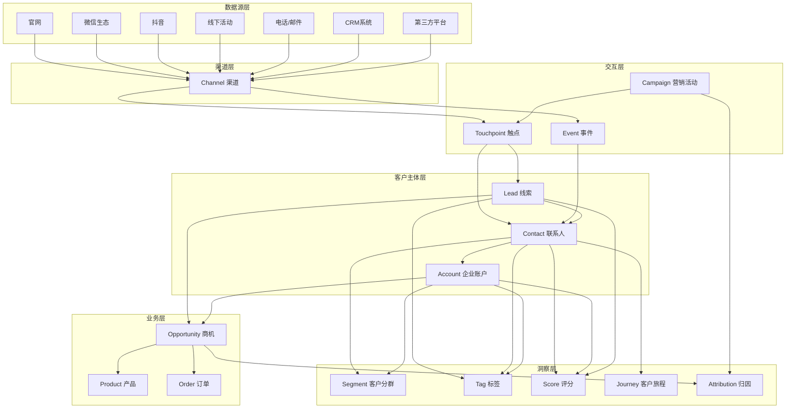

---

## 核心实体设计

### 1. Account（企业账户）- 核心实体

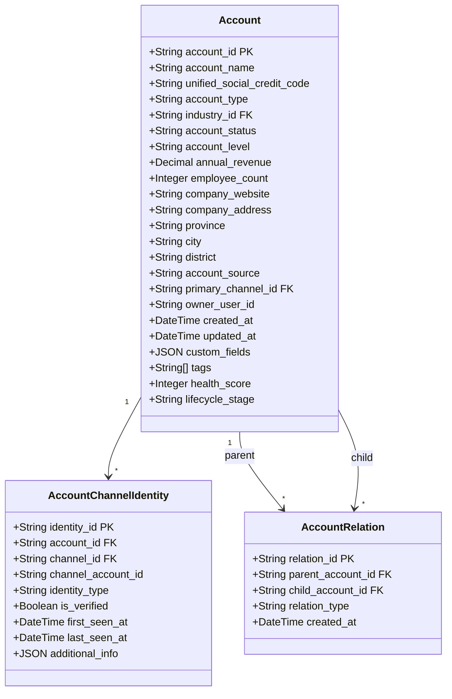

**字段说明：**
- `account_id`: 全局唯一账户ID
- `unified_social_credit_code`: 统一社会信用代码（企业唯一标识）
- `account_type`: 客户类型（潜在客户/现有客户/合作伙伴/竞争对手）
- `account_status`: 账户状态（活跃/休眠/流失/黑名单）
- `account_level`: 客户等级（战略级/重要级/普通级）
- `lifecycle_stage`: 生命周期阶段（认知期/考虑期/决策期/留存期/扩展期）

---

### 2. Contact（联系人）- 核心实体

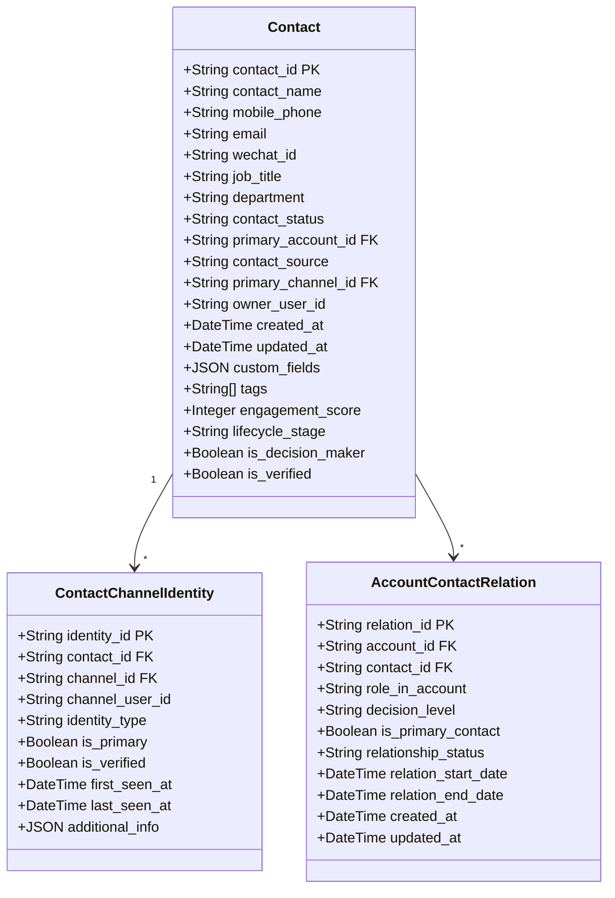

**字段说明：**
- `decision_level`: 决策层级（决策者/影响者/使用者/把关者）
- `engagement_score`: 参与度评分（基于互动频率和深度）
- `role_in_account`: 在企业中的角色（CEO/CTO/采购经理等）

---

### 3. Lead（线索）- 核心实体

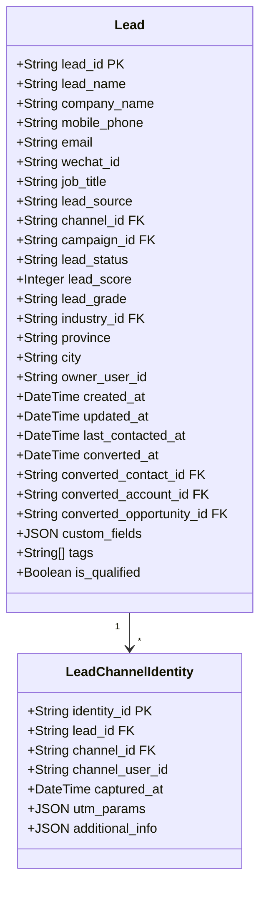

**字段说明：**
- `lead_status`: 线索状态（新建/联系中/已限定/已转化/无效）
- `lead_score`: 线索评分（基于行为和画像的综合评分）
- `lead_grade`: 线索等级（A/B/C/D）
- `is_qualified`: 是否为合格线索（MQL/SQL）

---

### 4. Opportunity（商机）- 核心实体

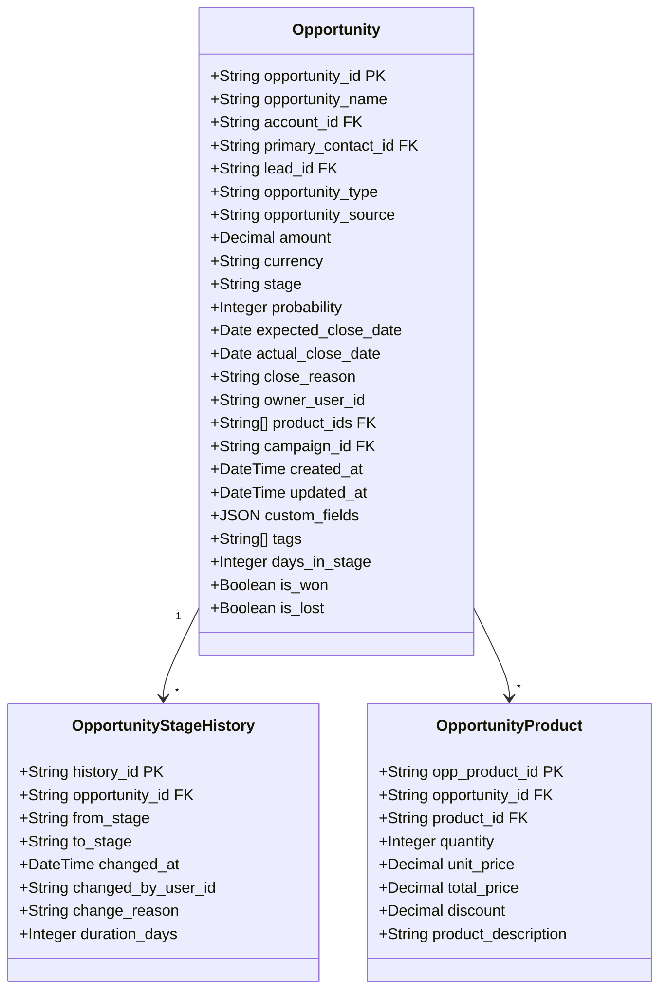

**字段说明：**
- `stage`: 阶段（线索/需求确认/方案设计/商务谈判/合同签订/已赢单/已输单）
- `probability`: 赢单概率（0-100）
- `opportunity_type`: 商机类型（新客户/追加销售/续约/交叉销售）

---

### 5. Channel（渠道）- 核心实体

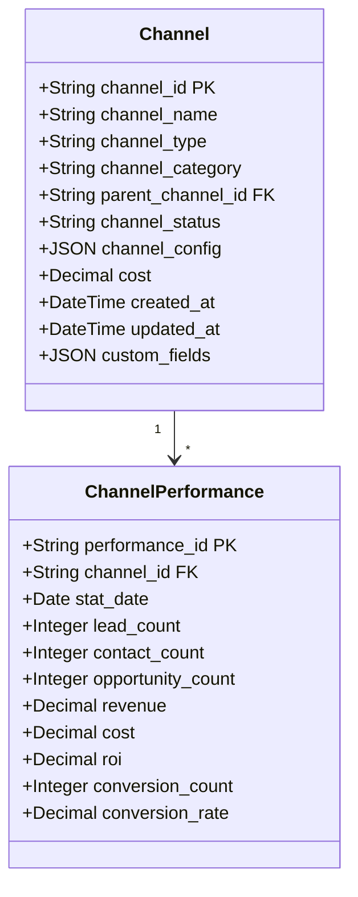

**渠道类型枚举：**
- 线上渠道：官网、SEO、SEM、社交媒体、内容营销
- 社交渠道：微信、企业微信、抖音、快手、小红书
- 线下渠道：展会、研讨会、地推活动
- 合作渠道：合作伙伴、代理商、分销商
- 直销渠道：电话、邮件、销售拜访

---

### 6. Campaign（营销活动）- 核心实体

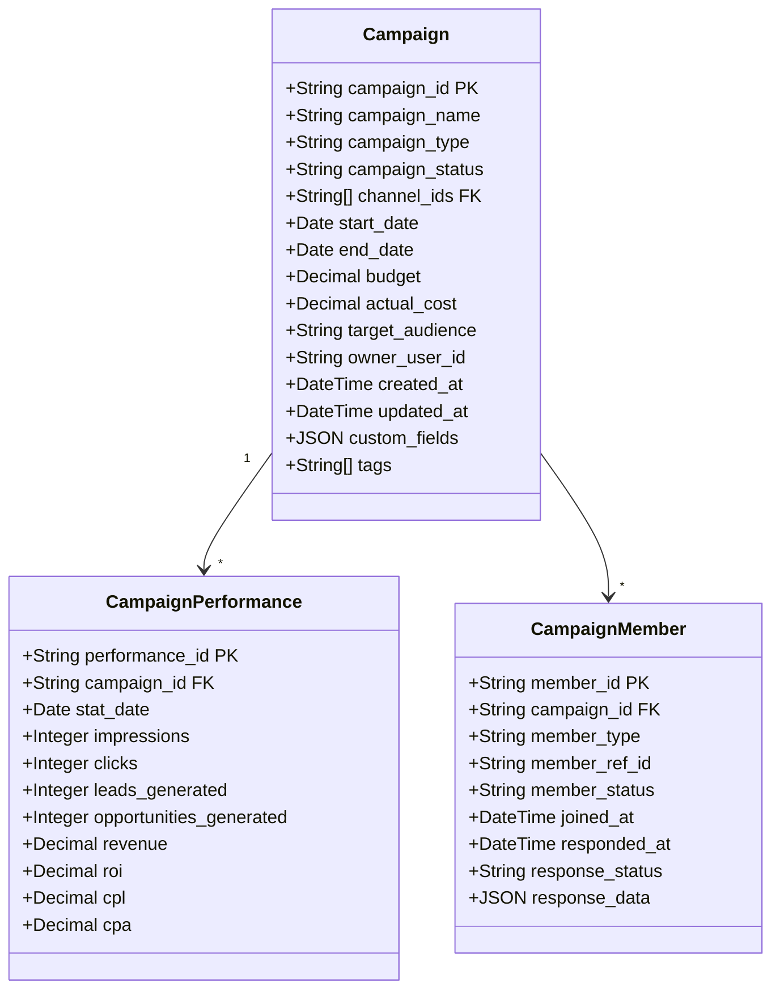

**活动类型：**
- 网络研讨会（Webinar）
- 线下会议/展会
- 邮件营销
- 内容营销（白皮书、案例分享）
- 产品试用活动
- 行业峰会

---

### 7. Touchpoint（触点/互动记录）- 核心实体

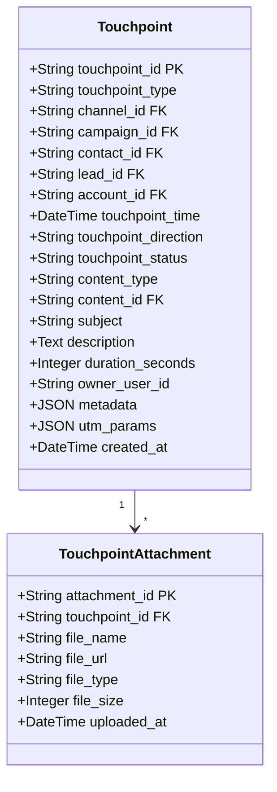

**触点类型：**
- 网站浏览
- 表单提交
- 内容下载
- 邮件互动（打开/点击）
- 电话沟通
- 会议/拜访
- 在线聊天
- 社交媒体互动

---

### 8. Event（行为事件）- 核心实体

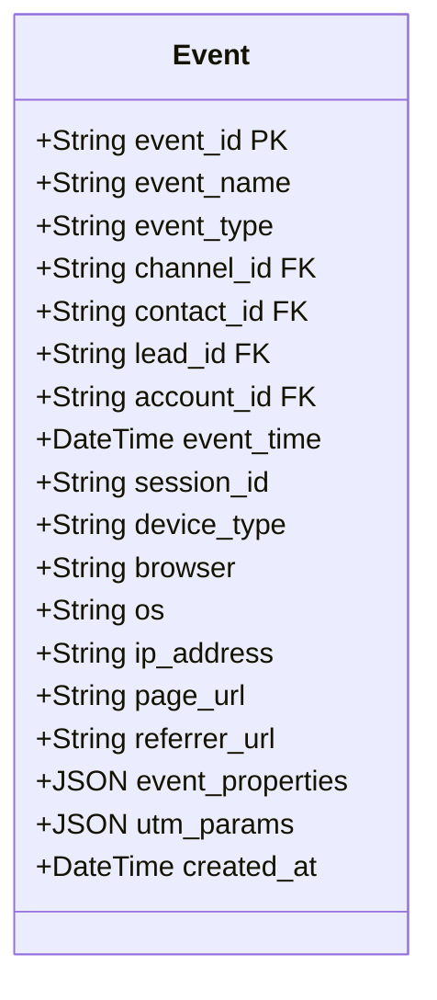

**事件类型：**
- 页面浏览（page_view）
- 按钮点击（button_click）
- 表单开始（form_start）
- 表单提交（form_submit）
- 文件下载（file_download）
- 视频播放（video_play）
- 产品试用（product_trial）
- 搜索（search）

---

### 9. Product（产品/解决方案）- 核心实体

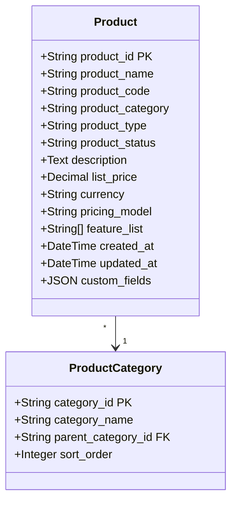

---

### 10. Tag（标签）- 核心实体

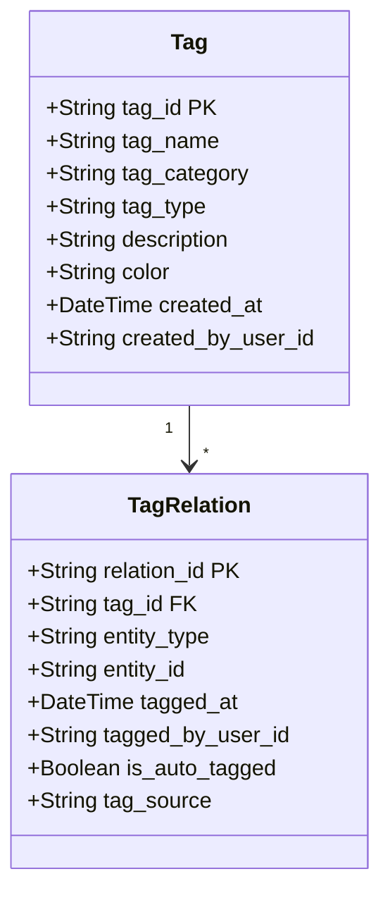

**标签类型：**
- 行为标签（高活跃度、近期浏览过产品A）
- 画像标签（互联网行业、大型企业、决策者）
- 业务标签（重点客户、流失风险、高价值）
- 兴趣标签（关注AI、关注云计算）

---

### 11. Segment（客户分群）- 核心实体

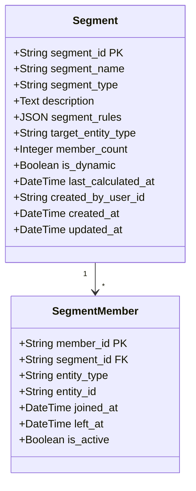

---

### 12. Score（评分模型）- 核心实体

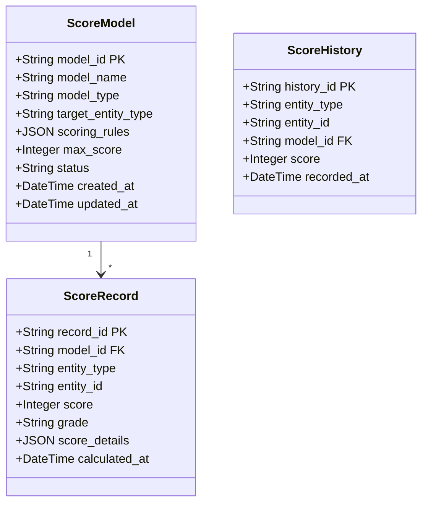

**评分类型：**
- Lead评分：基于行为和画像的线索评分
- Account评分：企业健康度评分
- Contact评分：联系人参与度评分

---

### 13. Industry（行业）- 核心实体

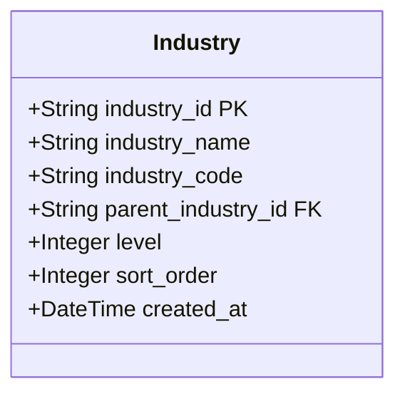

---

### 14. Attribution（归因）- 核心实体

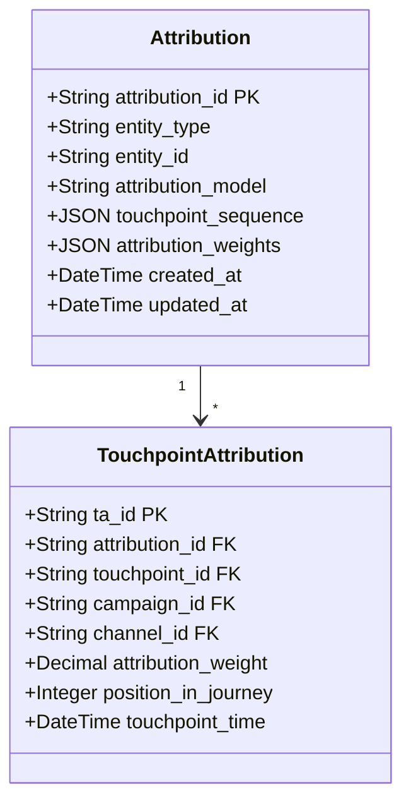

**归因模型：**
- 首次触点归因
- 末次触点归因
- 线性归因
- 时间衰减归因
- U型归因
- W型归因

---

### 15. CustomerJourney（客户旅程）- 核心实体

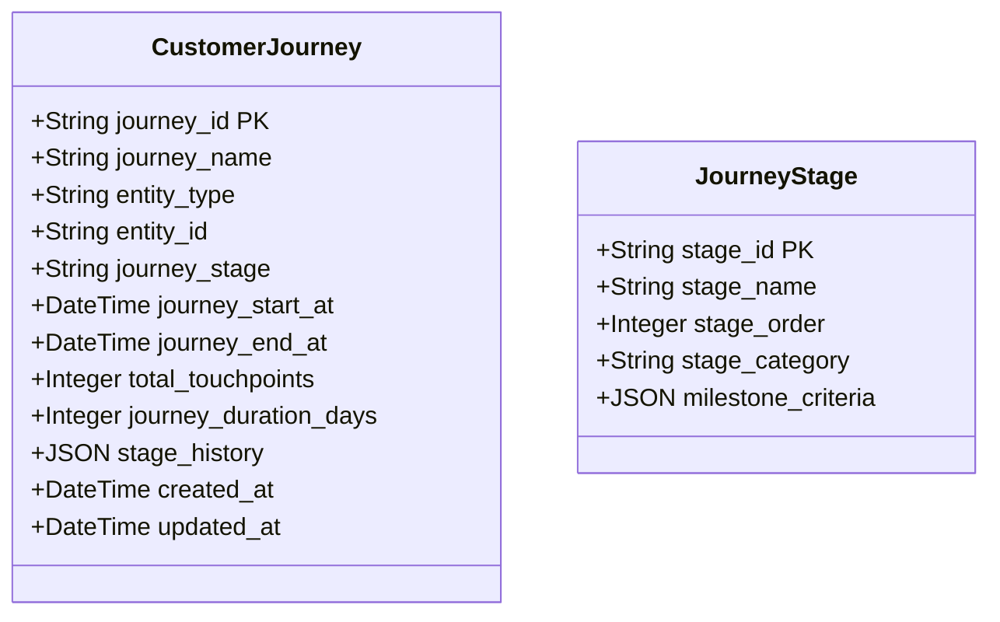

---

## 实体关系图

### 核心实体关系总览

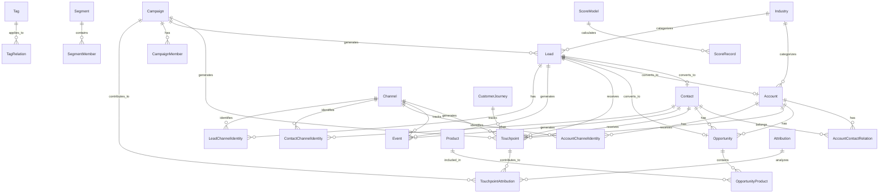

---

### 全渠道身份关联图

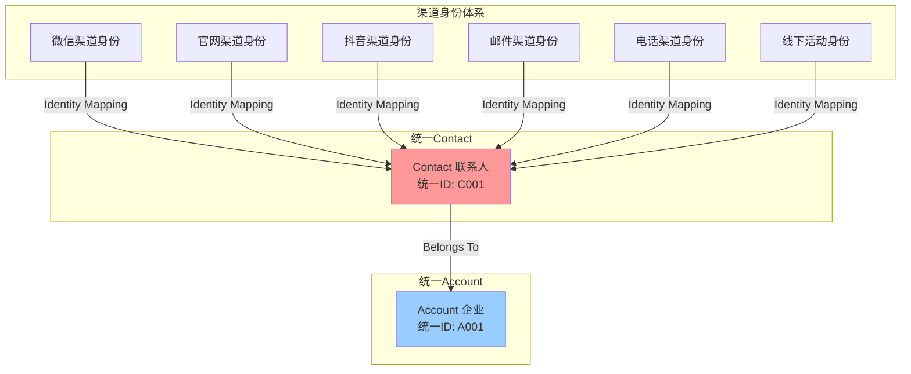

---

## 业务流程

### 线索到商机转化流程

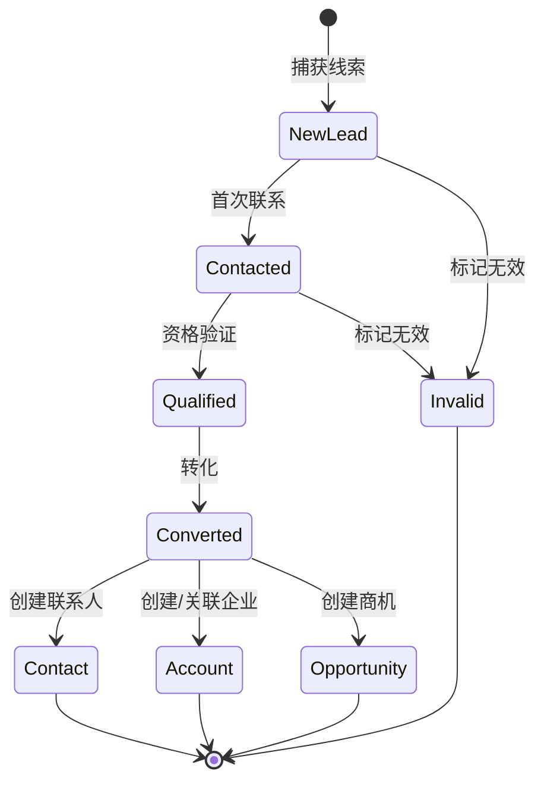

---

### 商机阶段流转流程

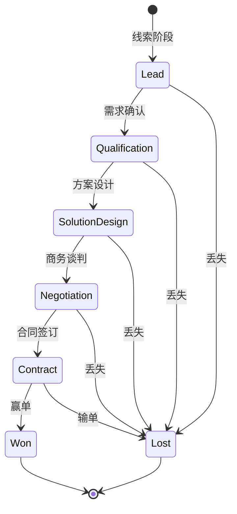

---

### 客户生命周期流程

```mermaid
stateDiagram-v2
    [*] --> Awareness: 认知阶段
    Awareness --> Consideration: 考虑阶段
    Consideration --> Decision: 决策阶段
    Decision --> Retention: 留存阶段
    Retention --> Expansion: 扩展阶段
    
    Retention --> Churn: 流失
    Expansion --> Churn: 流失
    
    Churn --> Winback: 召回
    Winback --> Retention: 成功召回
    Winback --> [*]: 永久流失
    
    Expansion --> [*]: 持续合作
```

---

### 全渠道数据流转流程

```mermaid
sequenceDiagram
    participant User as 用户
    participant Channel as 渠道
    participant Event as 事件系统
    participant Identity as 身份识别
    participant CDP as CDP核心
    participant Lead as Lead管理
    participant Contact as Contact管理
    participant Account as Account管理
    
    User->>Channel: 1. 访问/互动
    Channel->>Event: 2. 记录事件
    Event->>Identity: 3. 身份识别
    
    alt 新用户
        Identity->>Lead: 4a. 创建Lead
        Lead->>CDP: 5a. 保存Lead数据
    else 已识别用户
        Identity->>Contact: 4b. 关联Contact
        Contact->>Account: 5b. 关联Account
    end
    
    CDP->>Event: 6. 触发规则引擎
    Event->>Channel: 7. 个性化响应
    Channel->>User: 8. 返回内容
```

---

## 数据模型详细设计

### Account 详细字段设计

| 字段名 | 类型 | 长度 | 必填 | 说明 | 示例 |
|--------|------|------|------|------|------|
| account_id | VARCHAR | 64 | ✓ | 账户唯一ID（PK） | ACC_20231105001 |
| account_name | VARCHAR | 200 | ✓ | 企业名称 | 阿里巴巴网络技术有限公司 |
| unified_social_credit_code | VARCHAR | 18 |  | 统一社会信用代码 | 91330000MA27XYZ123 |
| account_type | VARCHAR | 50 | ✓ | 客户类型 | CUSTOMER（客户）/PARTNER（合作伙伴）/COMPETITOR（竞争对手）/PROSPECT（潜在客户） |
| industry_id | VARCHAR | 64 |  | 行业ID（FK） | IND_001 |
| account_status | VARCHAR | 50 | ✓ | 账户状态 | ACTIVE（活跃）/DORMANT（休眠）/CHURNED（流失）/BLACKLIST（黑名单） |
| account_level | VARCHAR | 50 |  | 客户等级 | STRATEGIC（战略级）/IMPORTANT（重要级）/NORMAL（普通级） |
| annual_revenue | DECIMAL | (18,2) |  | 年营收（万元） | 50000.00 |
| employee_count | INT |  |  | 员工人数 | 5000 |
| company_website | VARCHAR | 500 |  | 公司网站 | https://www.alibaba.com |
| company_address | VARCHAR | 500 |  | 公司地址 | 浙江省杭州市余杭区文一西路969号 |
| province | VARCHAR | 50 |  | 省份 | 浙江省 |
| city | VARCHAR | 50 |  | 城市 | 杭州市 |
| district | VARCHAR | 50 |  | 区县 | 余杭区 |
| account_source | VARCHAR | 100 |  | 来源 | WEBSITE/EXHIBITION/PARTNER/COLD_CALL |
| primary_channel_id | VARCHAR | 64 |  | 主渠道ID（FK） | CH_001 |
| owner_user_id | VARCHAR | 64 |  | 负责人ID | USER_001 |
| created_at | DATETIME |  | ✓ | 创建时间 | 2023-11-05 10:30:00 |
| updated_at | DATETIME |  | ✓ | 更新时间 | 2023-11-05 10:30:00 |
| custom_fields | JSON |  |  | 自定义字段 | {"crm_id": "CRM001"} |
| tags | JSON |  |  | 标签数组 | ["高价值客户","AI行业"] |
| health_score | INT |  |  | 健康度评分（0-100） | 85 |
| lifecycle_stage | VARCHAR | 50 |  | 生命周期阶段 | AWARENESS/CONSIDERATION/DECISION/RETENTION/EXPANSION |

---

### Contact 详细字段设计

| 字段名 | 类型 | 长度 | 必填 | 说明 | 示例 |
|--------|------|------|------|------|------|
| contact_id | VARCHAR | 64 | ✓ | 联系人唯一ID（PK） | CNT_20231105001 |
| contact_name | VARCHAR | 100 | ✓ | 联系人姓名 | 张伟 |
| mobile_phone | VARCHAR | 20 |  | 手机号 | 13800138000 |
| email | VARCHAR | 200 |  | 邮箱 | zhangwei@company.com |
| wechat_id | VARCHAR | 100 |  | 微信ID | wx_zhangwei |
| job_title | VARCHAR | 100 |  | 职位 | CTO |
| department | VARCHAR | 100 |  | 部门 | 技术部 |
| contact_status | VARCHAR | 50 | ✓ | 联系人状态 | ACTIVE（活跃）/INACTIVE（不活跃）/BOUNCED（退订）/UNSUBSCRIBED（取消订阅） |
| primary_account_id | VARCHAR | 64 |  | 主要关联企业ID（FK） | ACC_20231105001 |
| contact_source | VARCHAR | 100 |  | 来源 | WEBSITE/FORM/IMPORT/API |
| primary_channel_id | VARCHAR | 64 |  | 主渠道ID（FK） | CH_001 |
| owner_user_id | VARCHAR | 64 |  | 负责人ID | USER_001 |
| created_at | DATETIME |  | ✓ | 创建时间 | 2023-11-05 10:30:00 |
| updated_at | DATETIME |  | ✓ | 更新时间 | 2023-11-05 10:30:00 |
| custom_fields | JSON |  |  | 自定义字段 | {"birthday": "1985-01-01"} |
| tags | JSON |  |  | 标签数组 | ["决策者","技术背景"] |
| engagement_score | INT |  |  | 参与度评分（0-100） | 75 |
| lifecycle_stage | VARCHAR | 50 |  | 生命周期阶段 | SUBSCRIBER/LEAD/MQL/SQL/OPPORTUNITY/CUSTOMER |
| is_decision_maker | BOOLEAN |  |  | 是否决策者 | true |
| is_verified | BOOLEAN |  |  | 是否已验证 | true |

---

### Lead 详细字段设计

| 字段名 | 类型 | 长度 | 必填 | 说明 | 示例 |
|--------|------|------|------|------|------|
| lead_id | VARCHAR | 64 | ✓ | 线索唯一ID（PK） | LEAD_20231105001 |
| lead_name | VARCHAR | 100 | ✓ | 线索姓名 | 李明 |
| company_name | VARCHAR | 200 |  | 公司名称 | XX科技有限公司 |
| mobile_phone | VARCHAR | 20 |  | 手机号 | 13900139000 |
| email | VARCHAR | 200 |  | 邮箱 | liming@company.com |
| wechat_id | VARCHAR | 100 |  | 微信ID | wx_liming |
| job_title | VARCHAR | 100 |  | 职位 | 产品经理 |
| lead_source | VARCHAR | 100 | ✓ | 线索来源 | WEBSITE/FORM/CAMPAIGN/COLD_CALL/REFERRAL |
| channel_id | VARCHAR | 64 |  | 渠道ID（FK） | CH_001 |
| campaign_id | VARCHAR | 64 |  | 营销活动ID（FK） | CMP_001 |
| lead_status | VARCHAR | 50 | ✓ | 线索状态 | NEW（新建）/CONTACTED（已联系）/QUALIFIED（已限定）/CONVERTED（已转化）/DISQUALIFIED（无效） |
| lead_score | INT |  |  | 线索评分（0-100） | 80 |
| lead_grade | VARCHAR | 10 |  | 线索等级 | A/B/C/D |
| industry_id | VARCHAR | 64 |  | 行业ID（FK） | IND_001 |
| province | VARCHAR | 50 |  | 省份 | 广东省 |
| city | VARCHAR | 50 |  | 城市 | 深圳市 |
| owner_user_id | VARCHAR | 64 |  | 负责人ID | USER_001 |
| created_at | DATETIME |  | ✓ | 创建时间 | 2023-11-05 10:30:00 |
| updated_at | DATETIME |  | ✓ | 更新时间 | 2023-11-05 10:30:00 |
| last_contacted_at | DATETIME |  |  | 最后联系时间 | 2023-11-05 14:00:00 |
| converted_at | DATETIME |  |  | 转化时间 | 2023-11-10 09:00:00 |
| converted_contact_id | VARCHAR | 64 |  | 转化后联系人ID（FK） | CNT_20231110001 |
| converted_account_id | VARCHAR | 64 |  | 转化后企业ID（FK） | ACC_20231110001 |
| converted_opportunity_id | VARCHAR | 64 |  | 转化后商机ID（FK） | OPP_20231110001 |
| custom_fields | JSON |  |  | 自定义字段 | {"product_interest": "AI"} |
| tags | JSON |  |  | 标签数组 | ["高意向","下载过白皮书"] |
| is_qualified | BOOLEAN |  |  | 是否为合格线索 | true |

---

### Opportunity 详细字段设计

| 字段名 | 类型 | 长度 | 必填 | 说明 | 示例 |
|--------|------|------|------|------|------|
| opportunity_id | VARCHAR | 64 | ✓ | 商机唯一ID（PK） | OPP_20231105001 |
| opportunity_name | VARCHAR | 200 | ✓ | 商机名称 | XX公司-AI平台采购项目 |
| account_id | VARCHAR | 64 | ✓ | 关联企业ID（FK） | ACC_20231105001 |
| primary_contact_id | VARCHAR | 64 |  | 主要联系人ID（FK） | CNT_20231105001 |
| lead_id | VARCHAR | 64 |  | 来源线索ID（FK） | LEAD_20231105001 |
| opportunity_type | VARCHAR | 50 |  | 商机类型 | NEW_BUSINESS（新客户）/UPSELL（追加销售）/RENEWAL（续约）/CROSS_SELL（交叉销售） |
| opportunity_source | VARCHAR | 100 |  | 商机来源 | LEAD_CONVERSION/DIRECT_SALES/PARTNER |
| amount | DECIMAL | (18,2) |  | 金额 | 1000000.00 |
| currency | VARCHAR | 10 |  | 货币 | CNY |
| stage | VARCHAR | 50 | ✓ | 阶段 | QUALIFICATION/NEEDS_ANALYSIS/PROPOSAL/NEGOTIATION/CLOSED_WON/CLOSED_LOST |
| probability | INT |  |  | 赢单概率（0-100） | 60 |
| expected_close_date | DATE |  |  | 预计成交日期 | 2023-12-31 |
| actual_close_date | DATE |  |  | 实际成交日期 | 2023-12-25 |
| close_reason | VARCHAR | 200 |  | 关闭原因 | 价格因素/竞争对手/预算不足/成功签约 |
| owner_user_id | VARCHAR | 64 |  | 负责人ID | USER_001 |
| product_ids | JSON |  |  | 产品ID数组 | ["PRD_001", "PRD_002"] |
| campaign_id | VARCHAR | 64 |  | 来源活动ID（FK） | CMP_001 |
| created_at | DATETIME |  | ✓ | 创建时间 | 2023-11-05 10:30:00 |
| updated_at | DATETIME |  | ✓ | 更新时间 | 2023-11-05 10:30:00 |
| custom_fields | JSON |  |  | 自定义字段 | {"contract_type": "annual"} |
| tags | JSON |  |  | 标签数组 | ["重点项目","Q4目标"] |
| days_in_stage | INT |  |  | 当前阶段停留天数 | 15 |
| is_won | BOOLEAN |  |  | 是否赢单 | false |
| is_lost | BOOLEAN |  |  | 是否输单 | false |

---

### Channel 详细字段设计

| 字段名 | 类型 | 长度 | 必填 | 说明 | 示例 |
|--------|------|------|------|------|------|
| channel_id | VARCHAR | 64 | ✓ | 渠道唯一ID（PK） | CH_001 |
| channel_name | VARCHAR | 100 | ✓ | 渠道名称 | 官网-产品页 |
| channel_type | VARCHAR | 50 | ✓ | 渠道类型 | WEBSITE/WECHAT/DOUYIN/EMAIL/PHONE/OFFLINE/PARTNER |
| channel_category | VARCHAR | 50 |  | 渠道分类 | ONLINE（线上）/OFFLINE（线下）/SOCIAL（社交）/DIRECT（直销） |
| parent_channel_id | VARCHAR | 64 |  | 父渠道ID（FK） | CH_PARENT_001 |
| channel_status | VARCHAR | 50 | ✓ | 渠道状态 | ACTIVE（活跃）/INACTIVE（停用）/TESTING（测试中） |
| channel_config | JSON |  |  | 渠道配置 | {"api_key": "xxx", "webhook_url": "xxx"} |
| cost | DECIMAL | (18,2) |  | 成本 | 50000.00 |
| created_at | DATETIME |  | ✓ | 创建时间 | 2023-11-05 10:30:00 |
| updated_at | DATETIME |  | ✓ | 更新时间 | 2023-11-05 10:30:00 |
| custom_fields | JSON |  |  | 自定义字段 | {"partner_name": "XX合作伙伴"} |

---

### Touchpoint 详细字段设计

| 字段名 | 类型 | 长度 | 必填 | 说明 | 示例 |
|--------|------|------|------|------|------|
| touchpoint_id | VARCHAR | 64 | ✓ | 触点唯一ID（PK） | TP_20231105001 |
| touchpoint_type | VARCHAR | 50 | ✓ | 触点类型 | PAGE_VIEW/FORM_SUBMIT/DOWNLOAD/EMAIL/CALL/MEETING/CHAT/SOCIAL |
| channel_id | VARCHAR | 64 |  | 渠道ID（FK） | CH_001 |
| campaign_id | VARCHAR | 64 |  | 活动ID（FK） | CMP_001 |
| contact_id | VARCHAR | 64 |  | 联系人ID（FK） | CNT_20231105001 |
| lead_id | VARCHAR | 64 |  | 线索ID（FK） | LEAD_20231105001 |
| account_id | VARCHAR | 64 |  | 企业ID（FK） | ACC_20231105001 |
| touchpoint_time | DATETIME | ✓ | ✓ | 触点时间 | 2023-11-05 14:30:00 |
| touchpoint_direction | VARCHAR | 20 |  | 触点方向 | INBOUND（入站）/OUTBOUND（出站） |
| touchpoint_status | VARCHAR | 50 |  | 触点状态 | COMPLETED（完成）/SCHEDULED（已安排）/CANCELLED（取消） |
| content_type | VARCHAR | 50 |  | 内容类型 | WHITEPAPER/CASE_STUDY/WEBINAR/DEMO/PROPOSAL |
| content_id | VARCHAR | 64 |  | 内容ID（FK） | CONTENT_001 |
| subject | VARCHAR | 200 |  | 主题 | 产品演示会议 |
| description | TEXT |  |  | 描述 | 讨论了AI平台的技术架构... |
| duration_seconds | INT |  |  | 持续时长（秒） | 3600 |
| owner_user_id | VARCHAR | 64 |  | 负责人ID | USER_001 |
| metadata | JSON |  |  | 元数据 | {"device": "mobile", "location": "Beijing"} |
| utm_params | JSON |  |  | UTM参数 | {"utm_source": "baidu", "utm_medium": "cpc"} |
| created_at | DATETIME |  | ✓ | 创建时间 | 2023-11-05 14:30:00 |

---

### Event 详细字段设计

| 字段名 | 类型 | 长度 | 必填 | 说明 | 示例 |
|--------|------|------|------|------|------|
| event_id | VARCHAR | 64 | ✓ | 事件唯一ID（PK） | EVT_20231105001 |
| event_name | VARCHAR | 100 | ✓ | 事件名称 | page_view |
| event_type | VARCHAR | 50 | ✓ | 事件类型 | PAGE_VIEW/CLICK/FORM_START/FORM_SUBMIT/DOWNLOAD/VIDEO_PLAY/SEARCH |
| channel_id | VARCHAR | 64 |  | 渠道ID（FK） | CH_001 |
| contact_id | VARCHAR | 64 |  | 联系人ID（FK） | CNT_20231105001 |
| lead_id | VARCHAR | 64 |  | 线索ID（FK） | LEAD_20231105001 |
| account_id | VARCHAR | 64 |  | 企业ID（FK） | ACC_20231105001 |
| event_time | DATETIME |  | ✓ | 事件时间 | 2023-11-05 14:35:20 |
| session_id | VARCHAR | 64 |  | 会话ID | SESSION_20231105001 |
| device_type | VARCHAR | 50 |  | 设备类型 | DESKTOP/MOBILE/TABLET |
| browser | VARCHAR | 50 |  | 浏览器 | Chrome |
| os | VARCHAR | 50 |  | 操作系统 | Windows 10 |
| ip_address | VARCHAR | 50 |  | IP地址 | 192.168.1.1 |
| page_url | VARCHAR | 1000 |  | 页面URL | https://www.example.com/product/ai-platform |
| referrer_url | VARCHAR | 1000 |  | 来源URL | https://www.baidu.com/s?wd=AI平台 |
| event_properties | JSON |  |  | 事件属性 | {"button_text": "申请试用", "form_id": "trial_form"} |
| utm_params | JSON |  |  | UTM参数 | {"utm_source": "baidu", "utm_campaign": "Q4_campaign"} |
| created_at | DATETIME |  | ✓ | 创建时间 | 2023-11-05 14:35:20 |

---

## 全渠道身份映射方案

### 身份识别优先级

```mermaid
graph LR
    A[多渠道数据] --> B{身份识别}
    B --> C[1. 手机号匹配]
    B --> D[2. 邮箱匹配]
    B --> E[3. 企业微信ID]
    B --> F[4. 统一社会信用代码]
    B --> G[5. 自定义ID]
    
    C --> H[合并至统一Contact]
    D --> H
    E --> H
    F --> I[合并至统一Account]
    G --> H
    
    H --> J[建立ChannelIdentity关联]
    I --> K[建立AccountChannelIdentity关联]
```

### 身份合并规则

```mermaid
flowchart TD
    Start[接收新数据] --> Check{是否存在标识符}
    Check -->|有手机号| Phone[手机号匹配]
    Check -->|有邮箱| Email[邮箱匹配]
    Check -->|有微信ID| WeChat[微信ID匹配]
    
    Phone --> Match{找到匹配?}
    Email --> Match
    WeChat --> Match
    
    Match -->|是| Merge[合并到现有Contact]
    Match -->|否| Create[创建新Contact]
    
    Merge --> AddIdentity[添加渠道身份]
    Create --> AddIdentity
    
    AddIdentity --> UpdateScore[更新评分]
    UpdateScore --> End[完成]
```

---

## 数据字典总结

### 核心实体数量统计

| 实体类型 | 实体数量 | 说明 |
|---------|---------|------|
| 客户主体实体 | 3 | Account, Contact, Lead |
| 业务实体 | 2 | Opportunity, Product |
| 营销实体 | 2 | Campaign, Channel |
| 交互实体 | 2 | Touchpoint, Event |
| 关系实体 | 6 | AccountContactRelation, AccountRelation, OpportunityProduct, CampaignMember, TagRelation, SegmentMember |
| 身份实体 | 3 | AccountChannelIdentity, ContactChannelIdentity, LeadChannelIdentity |
| 分析实体 | 5 | Segment, Tag, Score, Attribution, CustomerJourney |
| 支撑实体 | 2 | Industry, ProductCategory |
| **合计** | **25** | 覆盖B2B CDP核心业务场景 |

---

## 扩展建议

### 可选扩展实体（根据业务需要）

1. **Content（内容资产）**
   - 营销内容管理
   - 内容效果追踪

2. **Order（订单）**
   - 如需管理订单详情
   - 支持电商场景

3. **Contract（合同）**
   - 合同管理
   - 续约提醒

4. **Partner（合作伙伴）**
   - 渠道伙伴管理
   - 分销体系

5. **Competitor（竞争对手）**
   - 竞争对手分析
   - 竞品情报

6. **Task（任务）**
   - 销售任务管理
   - 跟进提醒

7. **Note（备注）**
   - 客户备注
   - 沟通记录

---

## 技术实现建议

### 数据库选型建议

```mermaid
graph TB
    subgraph "主数据存储"
        PG[PostgreSQL<br/>关系型数据<br/>Account/Contact/Lead/Opportunity]
    end
    
    subgraph "行为数据存储"
        CH[ClickHouse<br/>海量事件数据<br/>Event/Touchpoint]
    end
    
    subgraph "搜索引擎"
        ES[Elasticsearch<br/>全文搜索<br/>客户搜索/标签搜索]
    end
    
    subgraph "缓存层"
        Redis[Redis<br/>热数据缓存<br/>评分/标签]
    end
    
    subgraph "数据仓库"
        DW[数据仓库<br/>分析报表<br/>BI分析]
    end
    
    PG --> ES
    PG --> Redis
    CH --> DW
    PG --> DW
```

### 关键索引建议

**Account表索引：**
```sql
-- 主键索引
PRIMARY KEY (account_id)

-- 业务索引
CREATE INDEX idx_account_name ON Account(account_name);
CREATE INDEX idx_unified_code ON Account(unified_social_credit_code);
CREATE INDEX idx_account_status ON Account(account_status);
CREATE INDEX idx_account_owner ON Account(owner_user_id);
CREATE INDEX idx_account_created ON Account(created_at);

-- 组合索引
CREATE INDEX idx_account_type_status ON Account(account_type, account_status);
CREATE INDEX idx_account_city ON Account(province, city);
```

**Contact表索引：**
```sql
-- 主键索引
PRIMARY KEY (contact_id)

-- 业务索引
CREATE INDEX idx_contact_phone ON Contact(mobile_phone);
CREATE INDEX idx_contact_email ON Contact(email);
CREATE INDEX idx_contact_wechat ON Contact(wechat_id);
CREATE INDEX idx_contact_account ON Contact(primary_account_id);
CREATE INDEX idx_contact_status ON Contact(contact_status);

-- 组合索引
CREATE INDEX idx_contact_phone_email ON Contact(mobile_phone, email);
```

**Event表索引（ClickHouse）：**
```sql
-- 主排序键
ORDER BY (event_time, contact_id, event_type)

-- 分区键
PARTITION BY toYYYYMM(event_time)
```

---

## 总结

本实体设计方案包含：

✅ **25个核心实体**，覆盖B2B CDP全业务场景  
✅ **全渠道身份映射**方案，支持跨渠道客户识别  
✅ **完整的客户生命周期**管理  
✅ **从线索到商机**的完整转化流程  
✅ **灵活的标签和分群**能力  
✅ **多维度的归因分析**能力  
✅ **详细的字段设计**和数据字典  

该方案可以支撑：
- 全渠道客户数据整合
- 客户360度画像
- 精准营销和客户分群
- 销售线索管理和转化
- 客户旅程分析
- 营销归因分析
- 客户价值评估

根据实际业务需要，可以选择性实现部分实体，并在后续迭代中逐步完善。
