# B2B CDP 实体设计详细方案

## 目录
- [整体架构](#整体架构)
- [核心实体设计](#核心实体设计)
- [实体关系图](#实体关系图)
- [业务流程](#业务流程)
- [数据模型详细设计](#数据模型详细设计)

---

## 整体架构

### 实体分层架构图

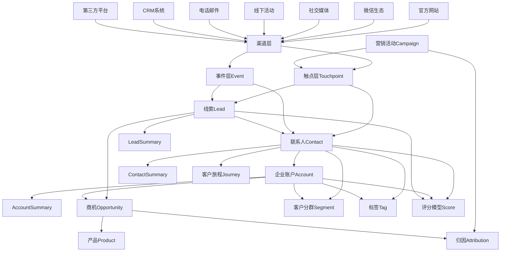

---

### 技术架构图

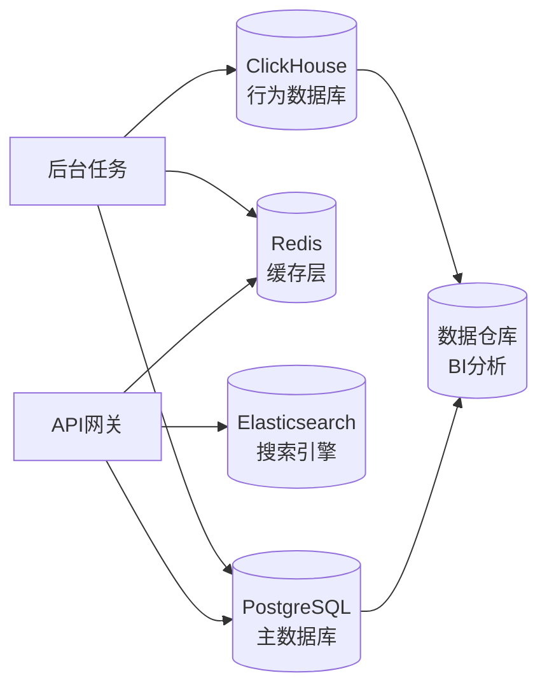

---

## 核心实体设计

### 1. Account 企业账户实体

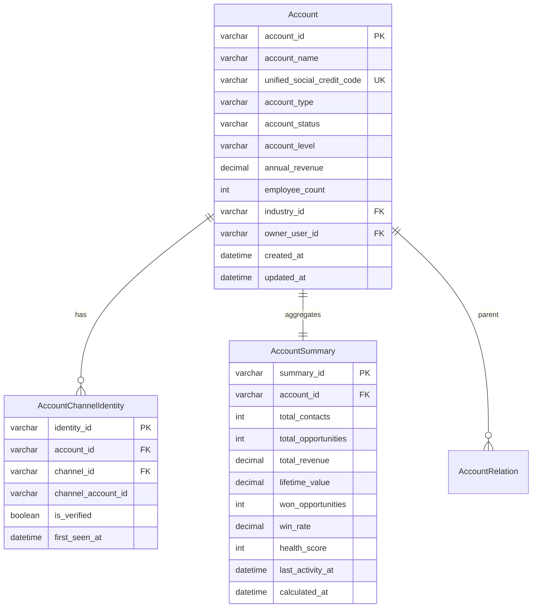

**核心字段说明：**
- `account_id` - 账户唯一标识
- `unified_social_credit_code` - 统一社会信用代码（企业唯一标识）
- `account_type` - 客户类型（CUSTOMER客户、PARTNER合作伙伴、COMPETITOR竞争对手、PROSPECT潜在客户）
- `account_status` - 账户状态（ACTIVE活跃、DORMANT休眠、CHURNED流失、BLACKLIST黑名单）
- `account_level` - 客户等级（STRATEGIC战略级、IMPORTANT重要级、NORMAL普通级）

**AccountSummary 汇总指标：**
- `total_contacts` - 关联联系人总数
- `total_revenue` - 累计收入金额
- `lifetime_value` - 客户生命周期价值
- `win_rate` - 赢单率百分比
- `health_score` - 健康度评分（0-100）

---

### 2. Contact 联系人实体

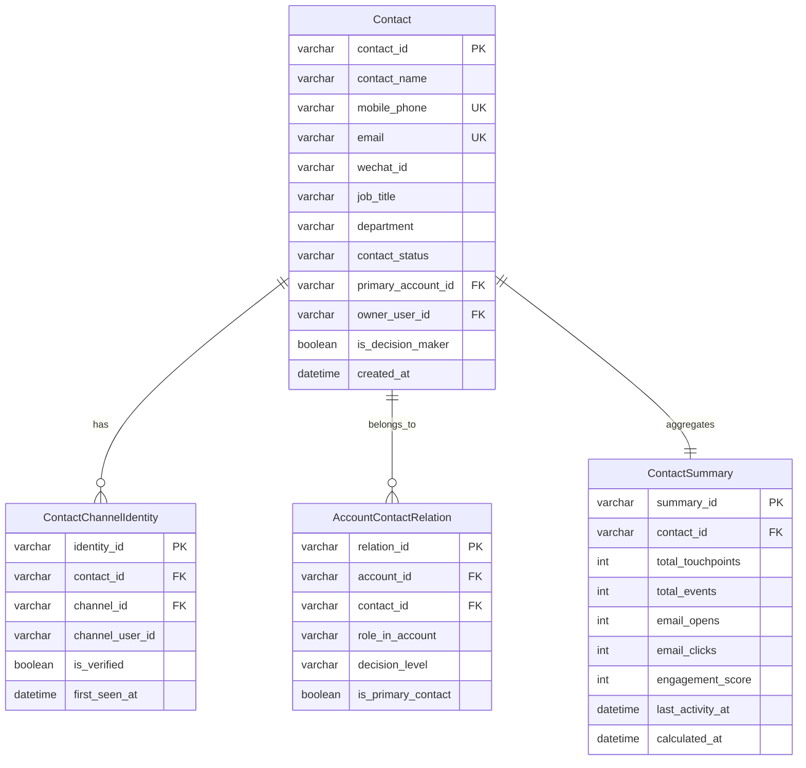

**核心字段说明：**
- `decision_level` - 决策层级（DECISION_MAKER决策者、INFLUENCER影响者、USER使用者、GATEKEEPER把关者）
- `lifecycle_stage` - 生命周期阶段（SUBSCRIBER订阅者、LEAD线索、MQL市场合格线索、SQL销售合格线索、OPPORTUNITY商机、CUSTOMER客户）

**ContactSummary 汇总指标：**
- `engagement_score` - 参与度评分（0-100）
- `email_opens` - 邮件打开次数
- `days_since_last_activity` - 距上次活跃天数

---

### 3. Lead 线索实体

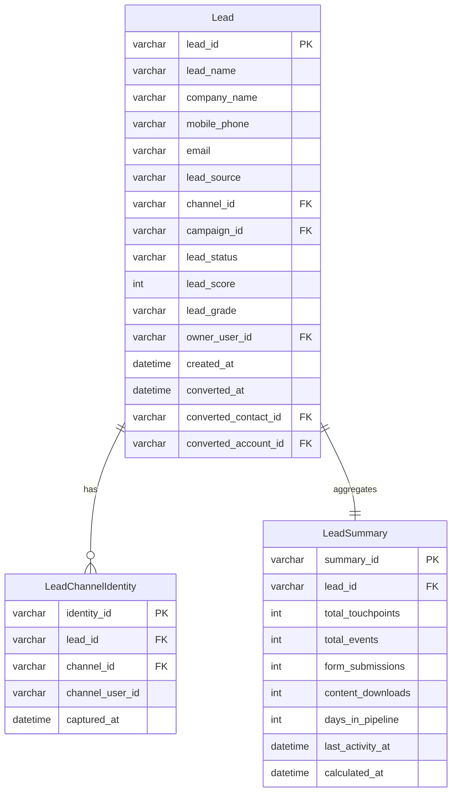

**核心字段说明：**
- `lead_status` - 线索状态（NEW新建、CONTACTED已联系、QUALIFIED已限定、CONVERTED已转化、DISQUALIFIED无效）
- `lead_score` - 线索评分（0-100）
- `lead_grade` - 线索等级（A、B、C、D）
- `is_qualified` - 是否为合格线索（MQL市场合格线索/SQL销售合格线索）

---

### 4. Opportunity 商机实体

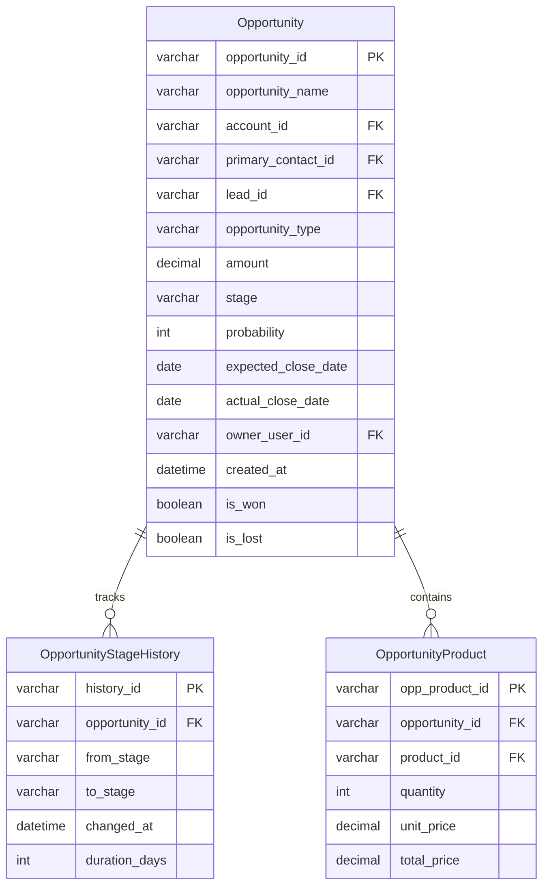

**核心字段说明：**
- `stage` - 商机阶段（LEAD线索、QUALIFICATION资格确认、NEEDS_ANALYSIS需求分析、PROPOSAL方案提议、NEGOTIATION商务谈判、CONTRACT合同签订、CLOSED_WON赢单、CLOSED_LOST输单）
- `probability` - 赢单概率（0-100）
- `opportunity_type` - 商机类型（NEW_BUSINESS新客户、UPSELL追加销售、RENEWAL续约、CROSS_SELL交叉销售）

---

### 5. Channel 渠道实体

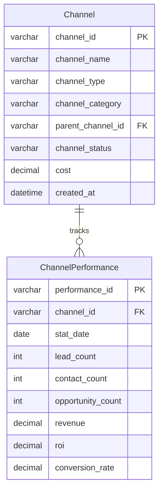

**渠道类型：**
- WEBSITE官方网站、SEO搜索引擎优化、SEM搜索引擎营销
- WECHAT微信、ENTERPRISE_WECHAT企业微信、DOUYIN抖音
- EMAIL邮件营销、PHONE电话
- OFFLINE_EVENT线下活动、EXHIBITION展会、PARTNER合作伙伴

---

### 6. Campaign 营销活动实体

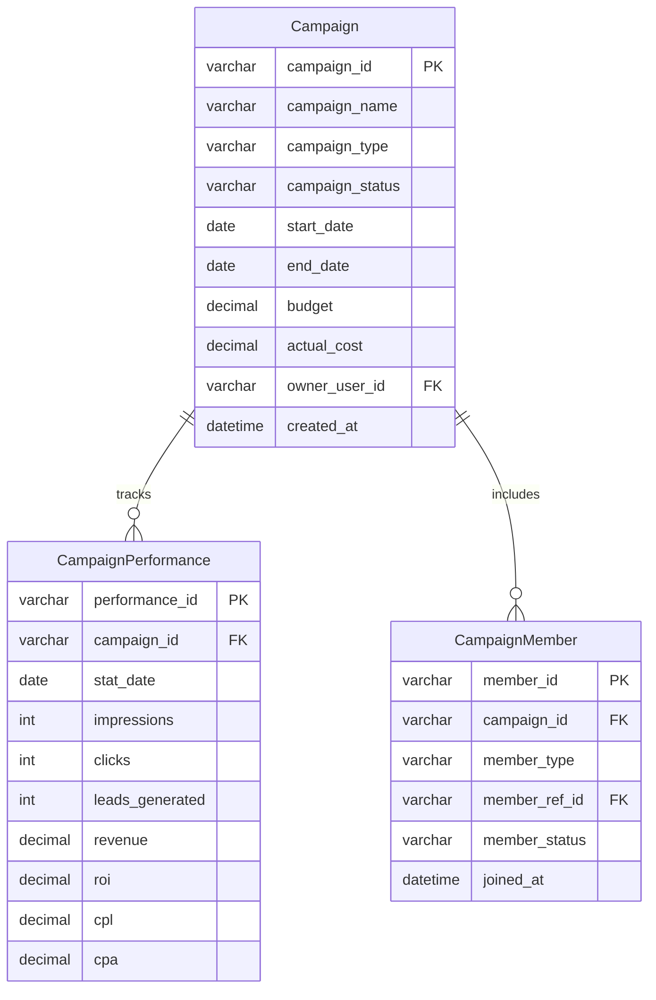

**活动类型：**
- WEBINAR网络研讨会
- CONFERENCE线下会议
- EXHIBITION展会
- EMAIL_MARKETING邮件营销
- CONTENT_MARKETING内容营销
- PRODUCT_TRIAL产品试用

---

### 7. Touchpoint 触点实体

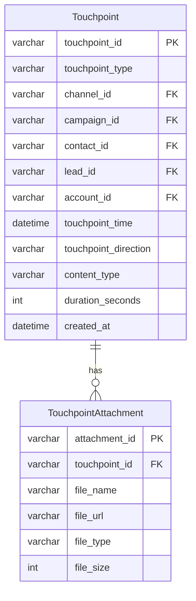

**触点类型：**
- PAGE_VIEW页面浏览、FORM_SUBMIT表单提交、DOWNLOAD下载
- EMAIL_OPEN邮件打开、EMAIL_CLICK邮件点击
- CALL电话、MEETING会议、CHAT聊天

---

### 8. Event 行为事件实体

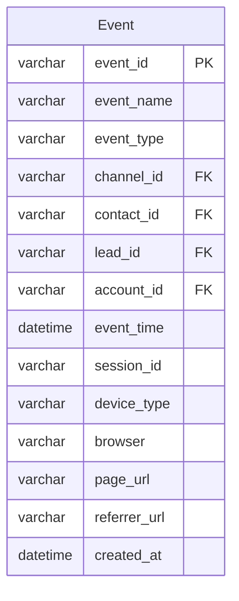

**事件类型：**
- PAGE_VIEW页面浏览、BUTTON_CLICK按钮点击
- FORM_START表单开始、FORM_SUBMIT表单提交
- FILE_DOWNLOAD文件下载、VIDEO_PLAY视频播放
- PRODUCT_TRIAL产品试用、SEARCH搜索

---

### 9. Product 产品实体

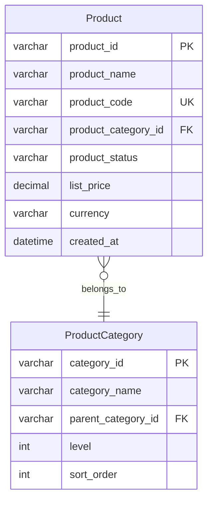

---

### 10. Tag 标签实体

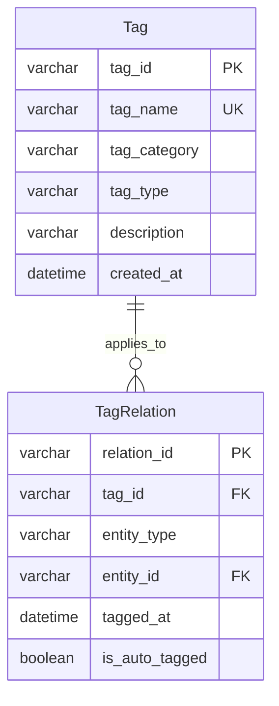

**标签类型：**
- BEHAVIOR行为标签
- PROFILE画像标签
- BUSINESS业务标签
- INTEREST兴趣标签

---

### 11. Segment 客户分群实体

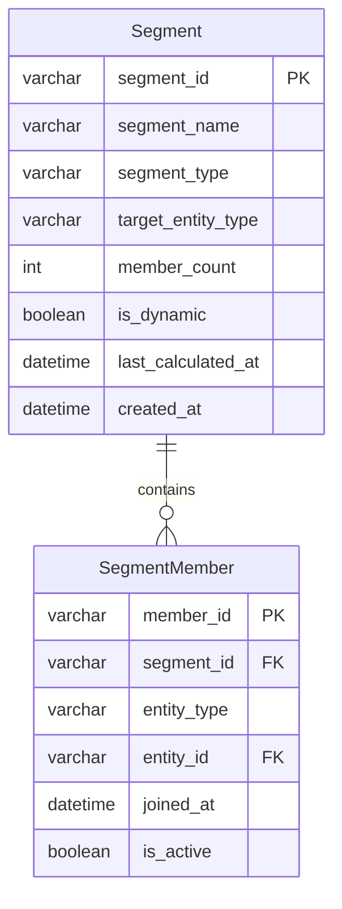

---

### 12. Score 评分实体

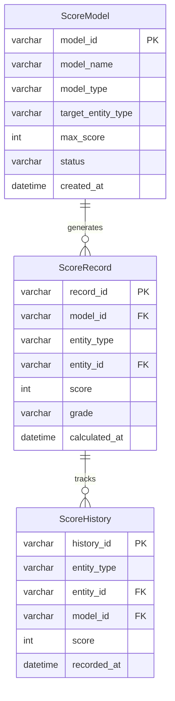

**评分类型：**
- LEAD_SCORING线索评分
- ACCOUNT_HEALTH企业健康度评分
- CONTACT_ENGAGEMENT联系人参与度评分

---

### 13. Industry 行业实体

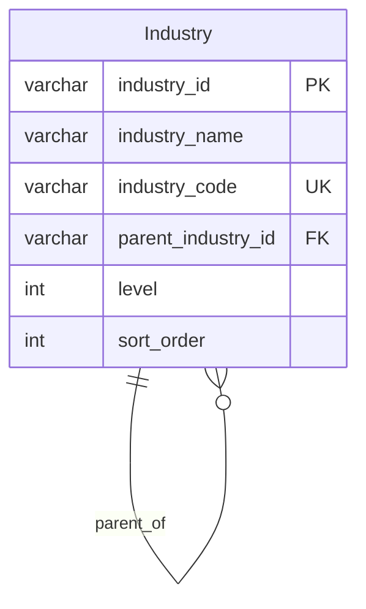

---

### 14. Attribution 归因实体

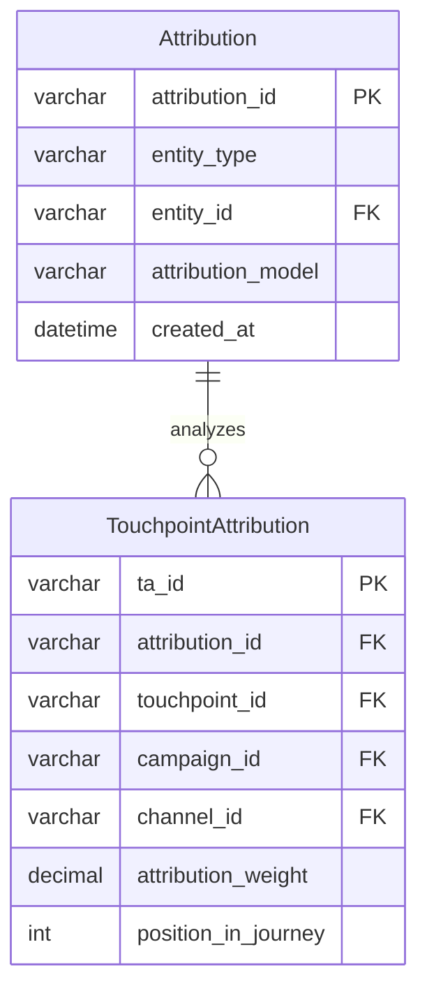

**归因模型：**
- FIRST_TOUCH首次触点归因
- LAST_TOUCH末次触点归因
- LINEAR线性归因
- TIME_DECAY时间衰减归因
- U_SHAPED U型归因
- W_SHAPED W型归因

---

### 15. CustomerJourney 客户旅程实体

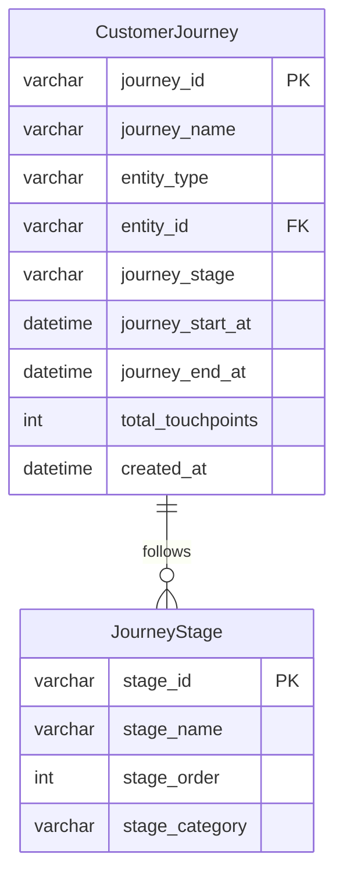

---

## 实体关系图

### 核心实体关系总览

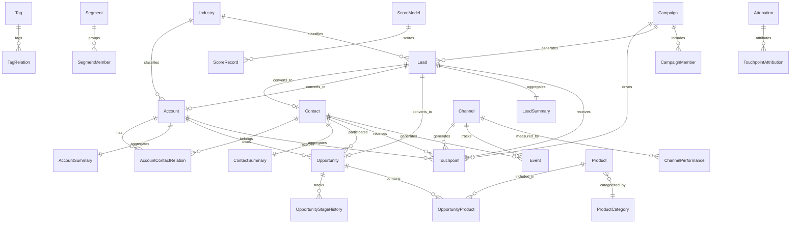

---

### 全渠道身份统一架构

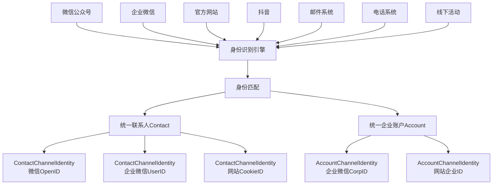

---

## 业务流程

### 线索到商机转化流程

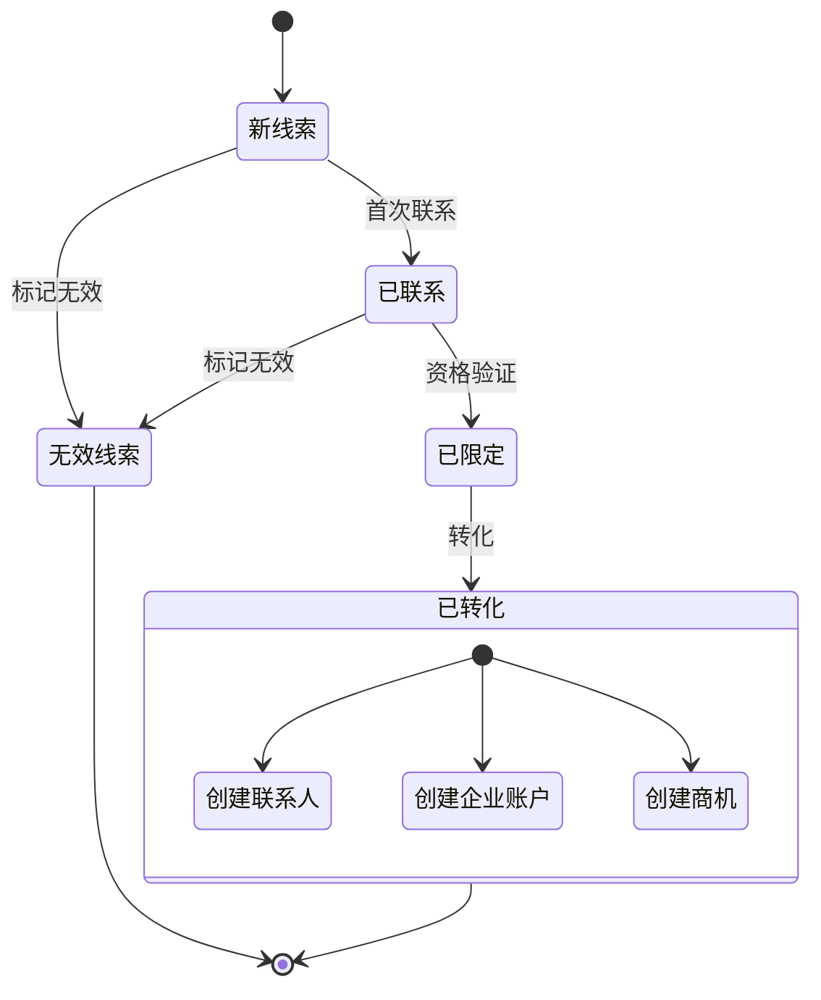

---

### 商机阶段流转流程

```mermaid
stateDiagram-v2
    [*] --> 线索阶段
    
    线索阶段 --> 需求确认: 需求分析
    线索阶段 --> 输单: 丢失
    
    需求确认 --> 方案设计: 方案输出
    需求确认 --> 输单: 丢失
    
    方案设计 --> 商务谈判: 开始谈判
    方案设计 --> 输单: 丢失
    
    商务谈判 --> 合同签订: 签订合同
    商务谈判 --> 输单: 丢失
    
    合同签订 --> 赢单: 成功签约
    合同签订 --> 输单: 失败
    
    赢单 --> [*]
    输单 --> [*]
```

---

### 客户生命周期管理

```mermaid
stateDiagram-v2
    [*] --> 认知阶段
    
    认知阶段 --> 考虑阶段: 产生兴趣
    考虑阶段 --> 决策阶段: 深度评估
    决策阶段 --> 留存阶段: 成交购买
    留存阶段 --> 扩展阶段: 追加购买
    
    留存阶段 --> 流失: 停止使用
    扩展阶段 --> 流失: 停止使用
    
    流失 --> 召回: 召回营销
    召回 --> 留存阶段: 成功召回
    召回 --> [*]: 永久流失
    
    扩展阶段 --> [*]: 持续合作
```

---

### 全渠道数据流转流程

```mermaid
sequenceDiagram
    participant 用户
    participant 渠道
    participant 事件系统
    participant 身份识别
    participant 线索管理
    participant 联系人管理
    participant 企业账户管理
    participant 汇总计算
    
    用户->>渠道: 1.访问互动
    渠道->>事件系统: 2.记录事件
    事件系统->>身份识别: 3.身份识别
    
    alt 新用户
        身份识别->>线索管理: 4a.创建Lead
        线索管理->>汇总计算: 5a.更新LeadSummary
    else 已识别用户
        身份识别->>联系人管理: 4b.关联Contact
        联系人管理->>企业账户管理: 5b.关联Account
        企业账户管理->>汇总计算: 6b.更新Summary
    end
    
    汇总计算->>渠道: 7.触发规则引擎
    渠道->>用户: 8.个性化响应
```

---

### 身份识别匹配流程

```mermaid
flowchart TD
    开始[接收多渠道数据] --> 提取[提取身份标识符]
    
    提取 --> 手机{有手机号?}
    提取 --> 邮箱{有邮箱?}
    提取 --> 微信{有微信ID?}
    
    手机 -->|是| 手机匹配[按手机号匹配<br/>优先级1]
    邮箱 -->|是| 邮箱匹配[按邮箱匹配<br/>优先级2]
    微信 -->|是| 微信匹配[按微信ID匹配<br/>优先级3]
    
    手机匹配 --> 找到{找到匹配?}
    邮箱匹配 --> 找到
    微信匹配 --> 找到
    
    找到 -->|是| 合并[合并到现有Contact]
    找到 -->|否| 创建[创建新Contact]
    
    合并 --> 添加身份[添加更新<br/>ContactChannelIdentity]
    创建 --> 添加身份
    
    添加身份 --> 更新汇总[更新ContactSummary]
    更新汇总 --> 完成[完成]
```

---

### 汇总数据更新策略

```mermaid
flowchart LR
    定时任务[定时任务<br/>每小时执行] --> 计算引擎[计算引擎]
    实时触发[实时触发<br/>关键事件] --> 计算引擎
    手动刷新[手动刷新<br/>按需执行] --> 计算引擎
    
    计算引擎 --> 企业汇总[AccountSummary]
    计算引擎 --> 联系人汇总[ContactSummary]
    计算引擎 --> 线索汇总[LeadSummary]
```

---

## 数据模型详细设计

### Account 详细字段设计

| 字段名 | 类型 | 长度 | 约束 | 说明 | 示例值 |
|--------|------|------|------|------|--------|
| account_id | VARCHAR | 64 | PK, NOT NULL | 账户唯一标识 | ACC_20231105001 |
| account_name | VARCHAR | 200 | NOT NULL | 企业名称 | 阿里巴巴网络技术有限公司 |
| unified_social_credit_code | VARCHAR | 18 | UNIQUE | 统一社会信用代码 | 91330000MA27XYZ123 |
| account_type | VARCHAR | 50 | NOT NULL | 客户类型 | CUSTOMER、PARTNER、PROSPECT |
| industry_id | VARCHAR | 64 | FK | 行业分类外键 | IND_001 |
| account_status | VARCHAR | 50 | NOT NULL | 账户状态 | ACTIVE、DORMANT、CHURNED |
| account_level | VARCHAR | 50 |  | 客户等级 | STRATEGIC、IMPORTANT、NORMAL |
| annual_revenue | DECIMAL | 18,2 |  | 年营收（万元） | 50000.00 |
| employee_count | INT |  |  | 员工人数 | 5000 |
| company_website | VARCHAR | 500 |  | 公司网站 | https://www.alibaba.com |
| province | VARCHAR | 50 |  | 省份 | 浙江省 |
| city | VARCHAR | 50 |  | 城市 | 杭州市 |
| account_source | VARCHAR | 100 |  | 来源渠道 | WEBSITE、EXHIBITION、PARTNER |
| primary_channel_id | VARCHAR | 64 | FK | 主渠道ID | CH_001 |
| owner_user_id | VARCHAR | 64 | FK | 负责人ID | USER_001 |
| created_at | DATETIME |  | NOT NULL | 创建时间 | 2023-11-05 10:30:00 |
| updated_at | DATETIME |  | NOT NULL | 更新时间 | 2023-11-05 15:20:00 |
| lifecycle_stage | VARCHAR | 50 |  | 生命周期阶段 | AWARENESS、RETENTION、EXPANSION |

---

### AccountSummary 详细字段设计

| 字段名 | 类型 | 长度 | 约束 | 说明 | 示例值 |
|--------|------|------|------|------|--------|
| summary_id | VARCHAR | 64 | PK, NOT NULL | 汇总记录唯一标识 | ACCS_20231105001 |
| account_id | VARCHAR | 64 | FK, UNIQUE | 账户ID | ACC_20231105001 |
| total_contacts | INT |  | DEFAULT 0 | 关联联系人总数 | 25 |
| total_opportunities | INT |  | DEFAULT 0 | 商机总数 | 8 |
| total_leads | INT |  | DEFAULT 0 | 线索总数 | 45 |
| total_revenue | DECIMAL | 18,2 | DEFAULT 0 | 累计收入（元） | 5000000.00 |
| lifetime_value | DECIMAL | 18,2 | DEFAULT 0 | 生命周期价值（元） | 8000000.00 |
| won_opportunities | INT |  | DEFAULT 0 | 赢单数量 | 5 |
| lost_opportunities | INT |  | DEFAULT 0 | 输单数量 | 2 |
| win_rate | DECIMAL | 5,2 | DEFAULT 0 | 赢单率（%） | 71.43 |
| total_touchpoints | INT |  | DEFAULT 0 | 总触点数 | 156 |
| health_score | INT |  | DEFAULT 0 | 健康度评分（0-100） | 85 |
| last_activity_at | DATETIME |  |  | 最后活跃时间 | 2023-11-05 14:30:00 |
| calculated_at | DATETIME |  | NOT NULL | 计算时间 | 2023-11-05 16:00:00 |
| updated_at | DATETIME |  | NOT NULL | 更新时间 | 2023-11-05 16:00:00 |

---

### Contact 详细字段设计

| 字段名 | 类型 | 长度 | 约束 | 说明 | 示例值 |
|--------|------|------|------|------|--------|
| contact_id | VARCHAR | 64 | PK, NOT NULL | 联系人唯一标识 | CNT_20231105001 |
| contact_name | VARCHAR | 100 | NOT NULL | 联系人姓名 | 张伟 |
| mobile_phone | VARCHAR | 20 | UNIQUE | 手机号 | 13800138000 |
| email | VARCHAR | 200 | UNIQUE | 邮箱地址 | zhangwei@company.com |
| wechat_id | VARCHAR | 100 |  | 微信ID | wx_zhangwei |
| job_title | VARCHAR | 100 |  | 职位 | 首席技术官 |
| department | VARCHAR | 100 |  | 部门 | 技术部 |
| contact_status | VARCHAR | 50 | NOT NULL | 联系人状态 | ACTIVE、INACTIVE、UNSUBSCRIBED |
| primary_account_id | VARCHAR | 64 | FK | 主要关联企业ID | ACC_20231105001 |
| contact_source | VARCHAR | 100 |  | 来源 | WEBSITE、FORM、IMPORT |
| primary_channel_id | VARCHAR | 64 | FK | 主渠道ID | CH_001 |
| owner_user_id | VARCHAR | 64 | FK | 负责人ID | USER_001 |
| created_at | DATETIME |  | NOT NULL | 创建时间 | 2023-11-05 10:30:00 |
| updated_at | DATETIME |  | NOT NULL | 更新时间 | 2023-11-05 15:20:00 |
| lifecycle_stage | VARCHAR | 50 |  | 生命周期阶段 | LEAD、MQL、SQL、CUSTOMER |
| is_decision_maker | BOOLEAN |  | DEFAULT FALSE | 是否决策者 | true |
| is_verified | BOOLEAN |  | DEFAULT FALSE | 是否已验证 | true |

---

### ContactSummary 详细字段设计

| 字段名 | 类型 | 长度 | 约束 | 说明 | 示例值 |
|--------|------|------|------|------|--------|
| summary_id | VARCHAR | 64 | PK, NOT NULL | 汇总记录唯一标识 | CNTS_20231105001 |
| contact_id | VARCHAR | 64 | FK, UNIQUE | 联系人ID | CNT_20231105001 |
| total_touchpoints | INT |  | DEFAULT 0 | 总触点数 | 87 |
| total_events | INT |  | DEFAULT 0 | 总事件数 | 234 |
| email_opens | INT |  | DEFAULT 0 | 邮件打开次数 | 45 |
| email_clicks | INT |  | DEFAULT 0 | 邮件点击次数 | 23 |
| form_submissions | INT |  | DEFAULT 0 | 表单提交次数 | 12 |
| content_downloads | INT |  | DEFAULT 0 | 内容下载次数 | 8 |
| engagement_score | INT |  | DEFAULT 0 | 参与度评分（0-100） | 78 |
| last_activity_at | DATETIME |  |  | 最后活跃时间 | 2023-11-05 14:30:00 |
| days_since_last_activity | INT |  | DEFAULT 0 | 距上次活跃天数 | 1 |
| calculated_at | DATETIME |  | NOT NULL | 计算时间 | 2023-11-05 16:00:00 |
| updated_at | DATETIME |  | NOT NULL | 更新时间 | 2023-11-05 16:00:00 |

---

### Lead 详细字段设计

| 字段名 | 类型 | 长度 | 约束 | 说明 | 示例值 |
|--------|------|------|------|------|--------|
| lead_id | VARCHAR | 64 | PK, NOT NULL | 线索唯一标识 | LEAD_20231105001 |
| lead_name | VARCHAR | 100 | NOT NULL | 线索姓名 | 李明 |
| company_name | VARCHAR | 200 |  | 公司名称 | 腾讯科技有限公司 |
| mobile_phone | VARCHAR | 20 |  | 手机号 | 13900139000 |
| email | VARCHAR | 200 |  | 邮箱地址 | liming@company.com |
| wechat_id | VARCHAR | 100 |  | 微信ID | wx_liming |
| job_title | VARCHAR | 100 |  | 职位 | 产品经理 |
| lead_source | VARCHAR | 100 | NOT NULL | 线索来源 | WEBSITE、FORM、CAMPAIGN |
| channel_id | VARCHAR | 64 | FK | 渠道ID | CH_001 |
| campaign_id | VARCHAR | 64 | FK | 营销活动ID | CMP_001 |
| lead_status | VARCHAR | 50 | NOT NULL | 线索状态 | NEW、CONTACTED、QUALIFIED |
| lead_score | INT |  | DEFAULT 0 | 线索评分（0-100） | 80 |
| lead_grade | VARCHAR | 10 |  | 线索等级 | A、B、C、D |
| industry_id | VARCHAR | 64 | FK | 行业ID | IND_001 |
| province | VARCHAR | 50 |  | 省份 | 广东省 |
| city | VARCHAR | 50 |  | 城市 | 深圳市 |
| owner_user_id | VARCHAR | 64 | FK | 负责人ID | USER_001 |
| created_at | DATETIME |  | NOT NULL | 创建时间 | 2023-11-05 10:30:00 |
| updated_at | DATETIME |  | NOT NULL | 更新时间 | 2023-11-05 15:20:00 |
| last_contacted_at | DATETIME |  |  | 最后联系时间 | 2023-11-05 14:00:00 |
| converted_at | DATETIME |  |  | 转化时间 | 2023-11-10 09:00:00 |
| converted_contact_id | VARCHAR | 64 | FK | 转化后联系人ID | CNT_20231110001 |
| converted_account_id | VARCHAR | 64 | FK | 转化后企业ID | ACC_20231110001 |
| converted_opportunity_id | VARCHAR | 64 | FK | 转化后商机ID | OPP_20231110001 |
| is_qualified | BOOLEAN |  | DEFAULT FALSE | 是否为合格线索 | true |

---

### LeadSummary 详细字段设计

| 字段名 | 类型 | 长度 | 约束 | 说明 | 示例值 |
|--------|------|------|------|------|--------|
| summary_id | VARCHAR | 64 | PK, NOT NULL | 汇总记录唯一标识 | LEADS_20231105001 |
| lead_id | VARCHAR | 64 | FK, UNIQUE | 线索ID | LEAD_20231105001 |
| total_touchpoints | INT |  | DEFAULT 0 | 总触点数 | 12 |
| total_events | INT |  | DEFAULT 0 | 总事件数 | 45 |
| form_submissions | INT |  | DEFAULT 0 | 表单提交次数 | 3 |
| content_downloads | INT |  | DEFAULT 0 | 内容下载次数 | 2 |
| page_views | INT |  | DEFAULT 0 | 页面浏览次数 | 28 |
| days_in_pipeline | INT |  | DEFAULT 0 | 在管道中天数 | 7 |
| contact_attempts | INT |  | DEFAULT 0 | 联系尝试次数 | 4 |
| last_activity_at | DATETIME |  |  | 最后活跃时间 | 2023-11-05 14:30:00 |
| last_contact_attempt_at | DATETIME |  |  | 最后联系尝试时间 | 2023-11-05 11:00:00 |
| calculated_at | DATETIME |  | NOT NULL | 计算时间 | 2023-11-05 16:00:00 |
| updated_at | DATETIME |  | NOT NULL | 更新时间 | 2023-11-05 16:00:00 |

---

### Opportunity 详细字段设计

| 字段名 | 类型 | 长度 | 约束 | 说明 | 示例值 |
|--------|------|------|------|------|--------|
| opportunity_id | VARCHAR | 64 | PK, NOT NULL | 商机唯一标识 | OPP_20231105001 |
| opportunity_name | VARCHAR | 200 | NOT NULL | 商机名称 | 腾讯科技AI平台采购项目 |
| account_id | VARCHAR | 64 | FK, NOT NULL | 关联企业ID | ACC_20231105001 |
| primary_contact_id | VARCHAR | 64 | FK | 主要联系人ID | CNT_20231105001 |
| lead_id | VARCHAR | 64 | FK | 来源线索ID | LEAD_20231105001 |
| opportunity_type | VARCHAR | 50 |  | 商机类型 | NEW_BUSINESS、UPSELL、RENEWAL |
| opportunity_source | VARCHAR | 100 |  | 商机来源 | LEAD_CONVERSION、DIRECT_SALES |
| amount | DECIMAL | 18,2 |  | 预计金额（元） | 1000000.00 |
| currency | VARCHAR | 10 |  | 货币单位 | CNY、USD、EUR |
| stage | VARCHAR | 50 | NOT NULL | 当前阶段 | QUALIFICATION、PROPOSAL、CONTRACT |
| probability | INT |  | DEFAULT 0 | 赢单概率（0-100） | 60 |
| expected_close_date | DATE |  |  | 预计成交日期 | 2023-12-31 |
| actual_close_date | DATE |  |  | 实际成交日期 | 2023-12-25 |
| close_reason | VARCHAR | 200 |  | 关闭原因 | 价格、竞争对手、预算、成功 |
| owner_user_id | VARCHAR | 64 | FK | 负责人ID | USER_001 |
| campaign_id | VARCHAR | 64 | FK | 来源活动ID | CMP_001 |
| created_at | DATETIME |  | NOT NULL | 创建时间 | 2023-11-05 10:30:00 |
| updated_at | DATETIME |  | NOT NULL | 更新时间 | 2023-11-05 15:20:00 |
| days_in_stage | INT |  | DEFAULT 0 | 当前阶段停留天数 | 15 |
| is_won | BOOLEAN |  | DEFAULT FALSE | 是否赢单 | false |
| is_lost | BOOLEAN |  | DEFAULT FALSE | 是否输单 | false |

---

### Channel 详细字段设计

| 字段名 | 类型 | 长度 | 约束 | 说明 | 示例值 |
|--------|------|------|------|------|--------|
| channel_id | VARCHAR | 64 | PK, NOT NULL | 渠道唯一标识 | CH_001 |
| channel_name | VARCHAR | 100 | NOT NULL | 渠道名称 | 官网产品页 |
| channel_type | VARCHAR | 50 | NOT NULL | 渠道类型 | WEBSITE、WECHAT、EMAIL、PHONE |
| channel_category | VARCHAR | 50 |  | 渠道分类 | ONLINE、OFFLINE、SOCIAL |
| parent_channel_id | VARCHAR | 64 | FK | 父渠道ID | CH_PARENT_001 |
| channel_status | VARCHAR | 50 | NOT NULL | 渠道状态 | ACTIVE、INACTIVE、TESTING |
| cost | DECIMAL | 18,2 |  | 渠道成本（元/月） | 50000.00 |
| created_at | DATETIME |  | NOT NULL | 创建时间 | 2023-11-05 10:30:00 |
| updated_at | DATETIME |  | NOT NULL | 更新时间 | 2023-11-05 15:20:00 |

---

### Touchpoint 详细字段设计

| 字段名 | 类型 | 长度 | 约束 | 说明 | 示例值 |
|--------|------|------|------|------|--------|
| touchpoint_id | VARCHAR | 64 | PK, NOT NULL | 触点唯一标识 | TP_20231105001 |
| touchpoint_type | VARCHAR | 50 | NOT NULL | 触点类型 | PAGE_VIEW、FORM_SUBMIT、EMAIL |
| channel_id | VARCHAR | 64 | FK | 渠道ID | CH_001 |
| campaign_id | VARCHAR | 64 | FK | 营销活动ID | CMP_001 |
| contact_id | VARCHAR | 64 | FK | 联系人ID | CNT_20231105001 |
| lead_id | VARCHAR | 64 | FK | 线索ID | LEAD_20231105001 |
| account_id | VARCHAR | 64 | FK | 企业ID | ACC_20231105001 |
| touchpoint_time | DATETIME |  | NOT NULL | 触点发生时间 | 2023-11-05 14:30:00 |
| touchpoint_direction | VARCHAR | 20 |  | 触点方向 | INBOUND、OUTBOUND |
| touchpoint_status | VARCHAR | 50 |  | 触点状态 | COMPLETED、SCHEDULED、CANCELLED |
| content_type | VARCHAR | 50 |  | 内容类型 | WHITEPAPER、WEBINAR、DEMO |
| content_id | VARCHAR | 64 | FK | 内容ID | CONTENT_001 |
| subject | VARCHAR | 200 |  | 主题 | 产品演示会议 |
| duration_seconds | INT |  |  | 持续时长（秒） | 3600 |
| owner_user_id | VARCHAR | 64 | FK | 负责人ID | USER_001 |
| created_at | DATETIME |  | NOT NULL | 创建时间 | 2023-11-05 14:30:00 |

---

### Event 详细字段设计

| 字段名 | 类型 | 长度 | 约束 | 说明 | 示例值 |
|--------|------|------|------|------|--------|
| event_id | VARCHAR | 64 | PK, NOT NULL | 事件唯一标识 | EVT_20231105001 |
| event_name | VARCHAR | 100 | NOT NULL | 事件名称 | page_view |
| event_type | VARCHAR | 50 | NOT NULL | 事件类型 | PAGE_VIEW、CLICK、FORM_SUBMIT |
| channel_id | VARCHAR | 64 | FK | 渠道ID | CH_001 |
| contact_id | VARCHAR | 64 | FK | 联系人ID | CNT_20231105001 |
| lead_id | VARCHAR | 64 | FK | 线索ID | LEAD_20231105001 |
| account_id | VARCHAR | 64 | FK | 企业ID | ACC_20231105001 |
| event_time | DATETIME |  | NOT NULL | 事件发生时间 | 2023-11-05 14:35:20 |
| session_id | VARCHAR | 64 |  | 会话ID | SESSION_20231105001 |
| device_type | VARCHAR | 50 |  | 设备类型 | DESKTOP、MOBILE、TABLET |
| browser | VARCHAR | 50 |  | 浏览器 | Chrome、Safari、Firefox |
| os | VARCHAR | 50 |  | 操作系统 | Windows 10、iOS 16 |
| ip_address | VARCHAR | 50 |  | IP地址 | 192.168.1.1 |
| page_url | VARCHAR | 1000 |  | 页面URL | https://example.com/product |
| referrer_url | VARCHAR | 1000 |  | 来源URL | https://baidu.com/search |
| created_at | DATETIME |  | NOT NULL | 创建时间 | 2023-11-05 14:35:20 |

---

## 实体统计汇总

### 实体分类统计

| 实体分类 | 实体名称 | 数量 | 说明 |
|---------|---------|------|------|
| 客户主体实体 | Account、Contact、Lead | 3 | 核心客户数据 |
| 汇总数据实体 | AccountSummary、ContactSummary、LeadSummary | 3 | 统计汇总数据 |
| 业务实体 | Opportunity、Product、ProductCategory | 3 | 业务交易数据 |
| 营销实体 | Campaign、Channel | 2 | 营销活动管理 |
| 交互实体 | Touchpoint、Event | 2 | 客户互动数据 |
| 关系实体 | AccountContactRelation、AccountRelation、OpportunityProduct、CampaignMember、TagRelation、SegmentMember | 6 | 实体关系映射 |
| 身份实体 | AccountChannelIdentity、ContactChannelIdentity、LeadChannelIdentity | 3 | 全渠道身份映射 |
| 分析实体 | Segment、Tag、ScoreModel、ScoreRecord、ScoreHistory、Attribution、TouchpointAttribution、CustomerJourney、JourneyStage | 9 | 数据分析洞察 |
| 性能实体 | ChannelPerformance、CampaignPerformance | 2 | 绩效统计 |
| 历史实体 | OpportunityStageHistory | 1 | 变更历史追踪 |
| 支撑实体 | Industry、TouchpointAttachment | 2 | 基础支撑数据 |
| 合计 |  | 36 | 完整覆盖B2B CDP业务场景 |

---

## 汇总表设计说明

### 设计原则

**性能优化**
- 避免频繁的多表JOIN和聚合计算
- 提升客户360度视图的查询速度
- 降低数据库负载

**业务需求**
- 快速展示客户健康度评分
- 实时显示客户价值指标
- 支持客户预警和监控

**数据一致性**
- 统一的计算口径
- 定时批量更新保证数据准确性
- 避免实时计算的结果不一致

### 更新机制

**更新触发条件：**
- 定时任务：每小时执行一次全量更新
- 实时触发：关键业务事件发生时立即更新（如商机赢单、联系人新增）
- 手动刷新：管理员按需触发更新

**更新策略：**
- 增量更新：仅更新有变化的记录
- 全量更新：定期执行完整重算
- 异步更新：使用消息队列避免阻塞主业务流程

---

## 索引设计建议

### Account表索引

```sql
-- 主键索引
PRIMARY KEY (account_id);

-- 唯一索引
CREATE UNIQUE INDEX uk_account_credit_code ON Account(unified_social_credit_code) 
WHERE unified_social_credit_code IS NOT NULL;

-- 业务查询索引
CREATE INDEX idx_account_name ON Account(account_name);
CREATE INDEX idx_account_status ON Account(account_status);
CREATE INDEX idx_account_owner ON Account(owner_user_id);
CREATE INDEX idx_account_created ON Account(created_at DESC);
CREATE INDEX idx_account_industry ON Account(industry_id);

-- 组合索引
CREATE INDEX idx_account_type_status ON Account(account_type, account_status);
CREATE INDEX idx_account_location ON Account(province, city);
```

### AccountSummary表索引

```sql
-- 主键和唯一索引
PRIMARY KEY (summary_id);
CREATE UNIQUE INDEX uk_summary_account ON AccountSummary(account_id);

-- 查询索引
CREATE INDEX idx_summary_health_score ON AccountSummary(health_score DESC);
CREATE INDEX idx_summary_last_activity ON AccountSummary(last_activity_at DESC);
CREATE INDEX idx_summary_total_revenue ON AccountSummary(total_revenue DESC);
CREATE INDEX idx_summary_win_rate ON AccountSummary(win_rate DESC);
```

### Contact表索引

```sql
-- 主键索引
PRIMARY KEY (contact_id);

-- 唯一索引
CREATE UNIQUE INDEX uk_contact_phone ON Contact(mobile_phone) 
WHERE mobile_phone IS NOT NULL;
CREATE UNIQUE INDEX uk_contact_email ON Contact(email) 
WHERE email IS NOT NULL;

-- 业务查询索引
CREATE INDEX idx_contact_name ON Contact(contact_name);
CREATE INDEX idx_contact_account ON Contact(primary_account_id);
CREATE INDEX idx_contact_status ON Contact(contact_status);
CREATE INDEX idx_contact_wechat ON Contact(wechat_id);

-- 组合索引
CREATE INDEX idx_contact_phone_email ON Contact(mobile_phone, email);
```

### Event表索引（ClickHouse）

```sql
-- 排序键设计
ORDER BY (channel_id, event_time, contact_id, event_type);

-- 分区键设计
PARTITION BY toYYYYMM(event_time);

-- 采样表达式
SAMPLE BY cityHash64(event_id);
```

### Touchpoint表索引

```sql
-- 主键索引
PRIMARY KEY (touchpoint_id);

-- 查询索引
CREATE INDEX idx_touchpoint_contact ON Touchpoint(contact_id, touchpoint_time DESC);
CREATE INDEX idx_touchpoint_lead ON Touchpoint(lead_id, touchpoint_time DESC);
CREATE INDEX idx_touchpoint_account ON Touchpoint(account_id, touchpoint_time DESC);
CREATE INDEX idx_touchpoint_channel ON Touchpoint(channel_id, touchpoint_time DESC);
CREATE INDEX idx_touchpoint_campaign ON Touchpoint(campaign_id, touchpoint_time DESC);
CREATE INDEX idx_touchpoint_time ON Touchpoint(touchpoint_time DESC);
CREATE INDEX idx_touchpoint_type ON Touchpoint(touchpoint_type, touchpoint_time DESC);
```

---

## 总结

本B2B CDP实体设计方案提供：

**核心能力**
- 36个实体，完整覆盖B2B CDP业务场景
- 全渠道身份映射方案，支持跨渠道客户识别
- 汇总数据表设计，优化查询性能
- 完整的客户生命周期管理
- 从线索到商机的完整转化流程

**关键特性**
- 灵活的标签和分群能力
- 多维度的归因分析能力
- 详细的字段设计和数据字典
- 专业的数据库架构建议
- 完整的索引优化方案

**适用场景**
- 全渠道客户数据整合
- 客户360度画像分析
- 精准营销和客户分群
- 销售线索管理和转化
- 客户旅程分析
- 营销归因分析
- 客户价值评估
- 客户健康度监控

根据实际业务需要，可以选择性实现部分实体，并在后续迭代中逐步完善。
