# B2B CDP 实体设计详细方案

## 目录
- [整体架构](#整体架构)
- [核心实体设计](#核心实体设计)
- [实体关系图](#实体关系图)
- [业务流程](#业务流程)
- [数据模型详细设计](#数据模型详细设计)

---

## 整体架构

### 实体分层架构图

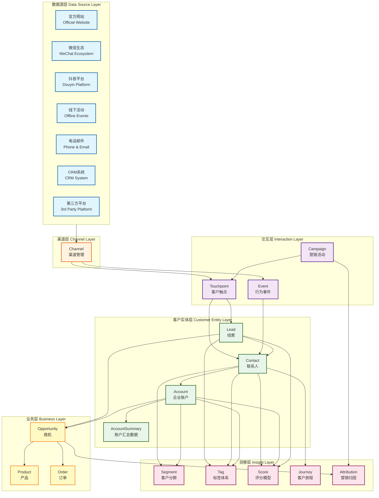

---

## 核心实体设计

### 1. Account (企业账户) - 核心实体

```mermaid
erDiagram
    Account ||--o{ AccountChannelIdentity : "has"
    Account ||--|| AccountSummary : "aggregates to"
    Account ||--o{ AccountRelation : "parent of"
    Account ||--o{ AccountRelation : "child of"
    
    Account {
        varchar(64) account_id PK
        varchar(200) account_name
        varchar(18) unified_social_credit_code UK
        varchar(50) account_type
        varchar(64) industry_id FK
        varchar(50) account_status
        varchar(50) account_level
        decimal(18_2) annual_revenue
        int employee_count
        varchar(500) company_website
        varchar(500) company_address
        varchar(50) province
        varchar(50) city
        varchar(50) district
        varchar(100) account_source
        varchar(64) primary_channel_id FK
        varchar(64) owner_user_id FK
        datetime created_at
        datetime updated_at
        json custom_fields
        varchar(50) lifecycle_stage
    }
    
    AccountChannelIdentity {
        varchar(64) identity_id PK
        varchar(64) account_id FK
        varchar(64) channel_id FK
        varchar(200) channel_account_id
        varchar(50) identity_type
        boolean is_verified
        datetime first_seen_at
        datetime last_seen_at
        json additional_info
    }
    
    AccountSummary {
        varchar(64) summary_id PK
        varchar(64) account_id FK UK
        int total_contacts
        int total_opportunities
        int total_leads
        decimal(18_2) total_revenue
        decimal(18_2) lifetime_value
        int won_opportunities
        int lost_opportunities
        decimal(5_2) win_rate
        int total_touchpoints
        int active_campaigns
        int health_score
        datetime last_activity_at
        datetime last_purchase_at
        date first_purchase_date
        date latest_opportunity_date
        int days_since_last_contact
        datetime calculated_at
        datetime updated_at
    }
    
    AccountRelation {
        varchar(64) relation_id PK
        varchar(64) parent_account_id FK
        varchar(64) child_account_id FK
        varchar(50) relation_type
        datetime created_at
    }
```

**Account 字段说明:**
- `account_id`: 全局唯一账户ID
- `unified_social_credit_code`: 统一社会信用代码（企业唯一标识）
- `account_type`: 客户类型（CUSTOMER/PARTNER/COMPETITOR/PROSPECT）
- `account_status`: 账户状态（ACTIVE/DORMANT/CHURNED/BLACKLIST）
- `account_level`: 客户等级（STRATEGIC/IMPORTANT/NORMAL）
- `lifecycle_stage`: 生命周期阶段（AWARENESS/CONSIDERATION/DECISION/RETENTION/EXPANSION）

**AccountSummary 字段说明:**
- `total_contacts`: 关联的联系人总数
- `total_opportunities`: 商机总数
- `total_revenue`: 累计收入
- `lifetime_value`: 客户生命周期价值
- `win_rate`: 赢单率
- `health_score`: 健康度评分（0-100）
- `last_activity_at`: 最后活跃时间
- `days_since_last_contact`: 距离上次联系天数

---

### 2. Contact (联系人) - 核心实体

```mermaid
erDiagram
    Contact ||--o{ ContactChannelIdentity : "has"
    Contact ||--o{ AccountContactRelation : "belongs to"
    Contact ||--|| ContactSummary : "aggregates to"
    
    Contact {
        varchar(64) contact_id PK
        varchar(100) contact_name
        varchar(20) mobile_phone UK
        varchar(200) email UK
        varchar(100) wechat_id
        varchar(100) job_title
        varchar(100) department
        varchar(50) contact_status
        varchar(64) primary_account_id FK
        varchar(100) contact_source
        varchar(64) primary_channel_id FK
        varchar(64) owner_user_id FK
        datetime created_at
        datetime updated_at
        json custom_fields
        varchar(50) lifecycle_stage
        boolean is_decision_maker
        boolean is_verified
    }
    
    ContactChannelIdentity {
        varchar(64) identity_id PK
        varchar(64) contact_id FK
        varchar(64) channel_id FK
        varchar(200) channel_user_id
        varchar(50) identity_type
        boolean is_primary
        boolean is_verified
        datetime first_seen_at
        datetime last_seen_at
        json additional_info
    }
    
    ContactSummary {
        varchar(64) summary_id PK
        varchar(64) contact_id FK UK
        int total_touchpoints
        int total_events
        int email_opens
        int email_clicks
        int form_submissions
        int content_downloads
        int engagement_score
        datetime last_activity_at
        datetime last_email_sent_at
        datetime last_email_opened_at
        int days_since_last_activity
        int campaign_responses
        datetime calculated_at
        datetime updated_at
    }
    
    AccountContactRelation {
        varchar(64) relation_id PK
        varchar(64) account_id FK
        varchar(64) contact_id FK
        varchar(100) role_in_account
        varchar(50) decision_level
        boolean is_primary_contact
        varchar(50) relationship_status
        date relation_start_date
        date relation_end_date
        datetime created_at
        datetime updated_at
    }
```

**Contact 字段说明:**
- `decision_level`: 决策层级（DECISION_MAKER/INFLUENCER/USER/GATEKEEPER）
- `lifecycle_stage`: 生命周期阶段（SUBSCRIBER/LEAD/MQL/SQL/OPPORTUNITY/CUSTOMER）

**ContactSummary 字段说明:**
- `total_touchpoints`: 总触点数
- `engagement_score`: 参与度评分（0-100）
- `email_opens`: 邮件打开次数
- `email_clicks`: 邮件点击次数
- `days_since_last_activity`: 距离上次活跃天数

---

### 3. Lead (线索) - 核心实体

```mermaid
erDiagram
    Lead ||--o{ LeadChannelIdentity : "has"
    Lead ||--|| LeadSummary : "aggregates to"
    
    Lead {
        varchar(64) lead_id PK
        varchar(100) lead_name
        varchar(200) company_name
        varchar(20) mobile_phone
        varchar(200) email
        varchar(100) wechat_id
        varchar(100) job_title
        varchar(100) lead_source
        varchar(64) channel_id FK
        varchar(64) campaign_id FK
        varchar(50) lead_status
        int lead_score
        varchar(10) lead_grade
        varchar(64) industry_id FK
        varchar(50) province
        varchar(50) city
        varchar(64) owner_user_id FK
        datetime created_at
        datetime updated_at
        datetime last_contacted_at
        datetime converted_at
        varchar(64) converted_contact_id FK
        varchar(64) converted_account_id FK
        varchar(64) converted_opportunity_id FK
        json custom_fields
        boolean is_qualified
    }
    
    LeadChannelIdentity {
        varchar(64) identity_id PK
        varchar(64) lead_id FK
        varchar(64) channel_id FK
        varchar(200) channel_user_id
        datetime captured_at
        json utm_params
        json additional_info
    }
    
    LeadSummary {
        varchar(64) summary_id PK
        varchar(64) lead_id FK UK
        int total_touchpoints
        int total_events
        int form_submissions
        int content_downloads
        int page_views
        int days_in_pipeline
        int contact_attempts
        datetime last_activity_at
        datetime last_contact_attempt_at
        datetime calculated_at
        datetime updated_at
    }
```

**Lead 字段说明:**
- `lead_status`: 线索状态（NEW/CONTACTED/QUALIFIED/CONVERTED/DISQUALIFIED）
- `lead_score`: 线索评分（0-100）
- `lead_grade`: 线索等级（A/B/C/D）
- `is_qualified`: 是否为合格线索（MQL/SQL）

---

### 4. Opportunity (商机) - 核心实体

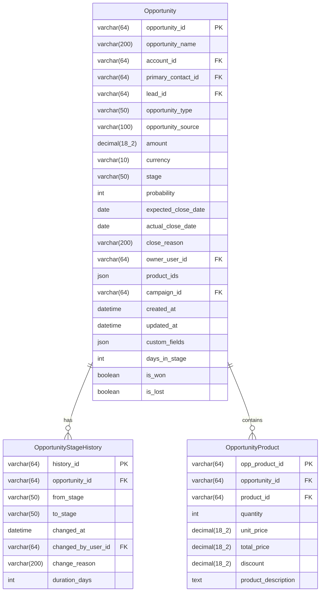

**Opportunity 字段说明:**
- `stage`: 阶段（LEAD/QUALIFICATION/NEEDS_ANALYSIS/PROPOSAL/NEGOTIATION/CONTRACT/CLOSED_WON/CLOSED_LOST）
- `probability`: 赢单概率（0-100）
- `opportunity_type`: 商机类型（NEW_BUSINESS/UPSELL/RENEWAL/CROSS_SELL）

---

### 5. Channel (渠道) - 核心实体

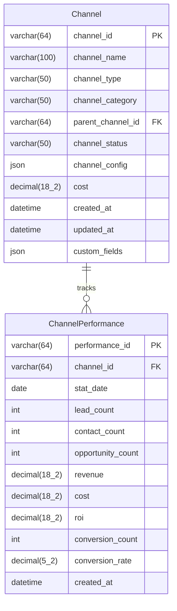

**渠道类型 (channel_type):**
- WEBSITE - 官方网站
- SEO - 搜索引擎优化
- SEM - 搜索引擎营销
- WECHAT - 微信
- ENTERPRISE_WECHAT - 企业微信
- DOUYIN - 抖音
- EMAIL - 邮件营销
- PHONE - 电话
- OFFLINE_EVENT - 线下活动
- EXHIBITION - 展会
- PARTNER - 合作伙伴

---

### 6. Campaign (营销活动) - 核心实体

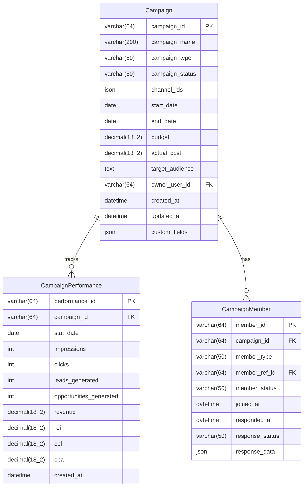

**活动类型 (campaign_type):**
- WEBINAR - 网络研讨会
- CONFERENCE - 线下会议
- EXHIBITION - 展会
- EMAIL_MARKETING - 邮件营销
- CONTENT_MARKETING - 内容营销
- PRODUCT_TRIAL - 产品试用
- SUMMIT - 行业峰会

---

### 7. Touchpoint (触点) - 核心实体

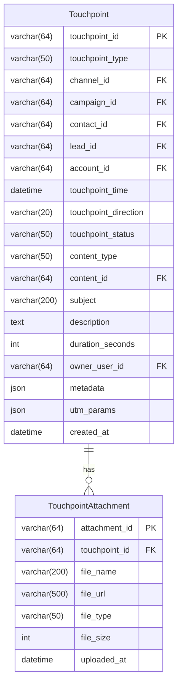

**触点类型 (touchpoint_type):**
- PAGE_VIEW - 网站浏览
- FORM_SUBMIT - 表单提交
- DOWNLOAD - 内容下载
- EMAIL_OPEN - 邮件打开
- EMAIL_CLICK - 邮件点击
- CALL - 电话沟通
- MEETING - 会议拜访
- CHAT - 在线聊天
- SOCIAL_INTERACTION - 社交媒体互动

---

### 8. Event (行为事件) - 核心实体

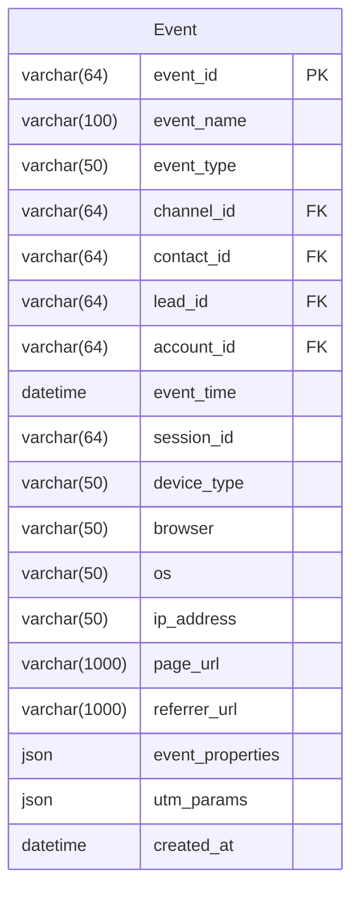

**事件类型 (event_type):**
- PAGE_VIEW - 页面浏览
- BUTTON_CLICK - 按钮点击
- FORM_START - 表单开始
- FORM_SUBMIT - 表单提交
- FILE_DOWNLOAD - 文件下载
- VIDEO_PLAY - 视频播放
- PRODUCT_TRIAL - 产品试用
- SEARCH - 搜索行为

---

### 9. Product (产品) - 核心实体

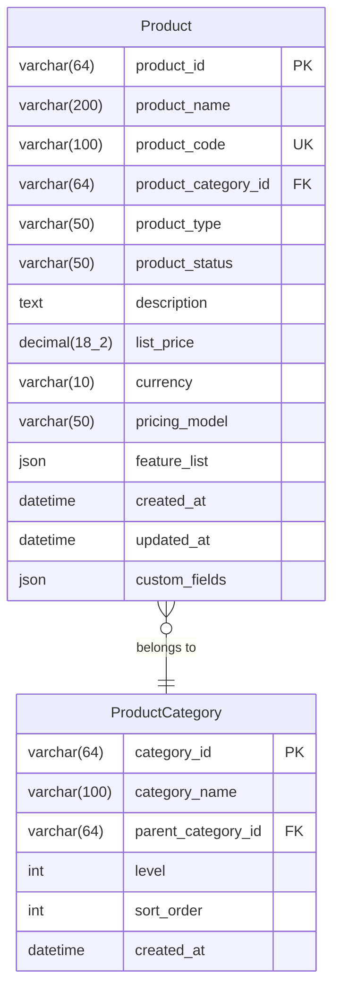

---

### 10. Tag (标签) - 核心实体

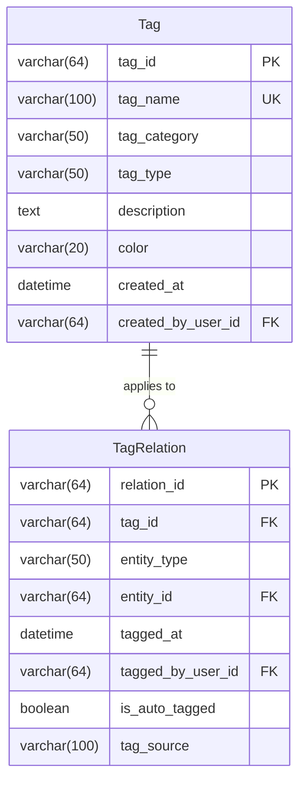

**标签类型 (tag_type):**
- BEHAVIOR - 行为标签
- PROFILE - 画像标签
- BUSINESS - 业务标签
- INTEREST - 兴趣标签

---

### 11. Segment (客户分群) - 核心实体

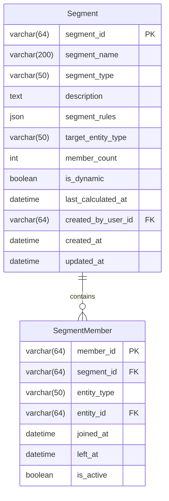

---

### 12. Score (评分模型) - 核心实体

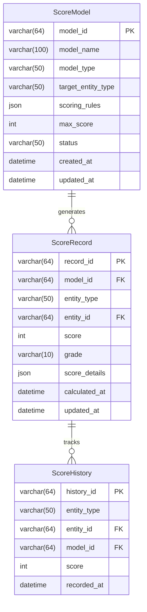

**评分类型 (model_type):**
- LEAD_SCORING - 线索评分
- ACCOUNT_HEALTH - 企业健康度评分
- CONTACT_ENGAGEMENT - 联系人参与度评分

---

### 13. Industry (行业) - 核心实体

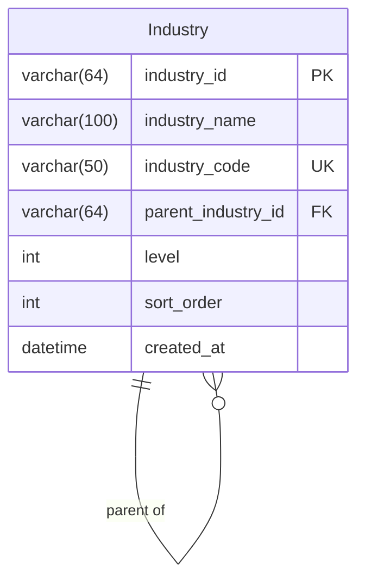

---

### 14. Attribution (归因) - 核心实体

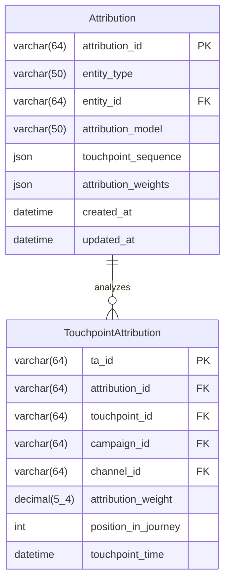

**归因模型 (attribution_model):**
- FIRST_TOUCH - 首次触点归因
- LAST_TOUCH - 末次触点归因
- LINEAR - 线性归因
- TIME_DECAY - 时间衰减归因
- U_SHAPED - U型归因
- W_SHAPED - W型归因

---

### 15. CustomerJourney (客户旅程) - 核心实体

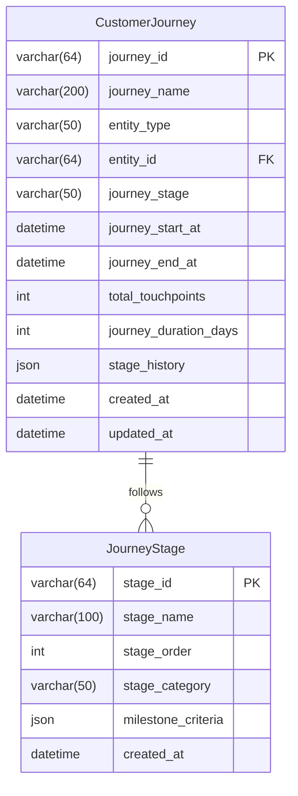

---

## 实体关系图

### 核心实体关系总览


---

### 全渠道身份统一架构

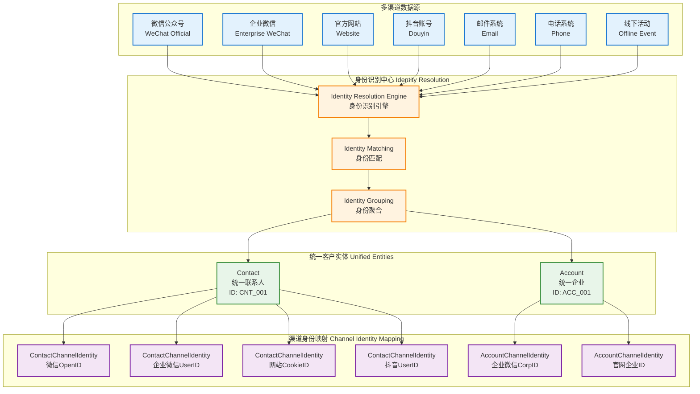

---

## 业务流程

### 线索到商机转化流程

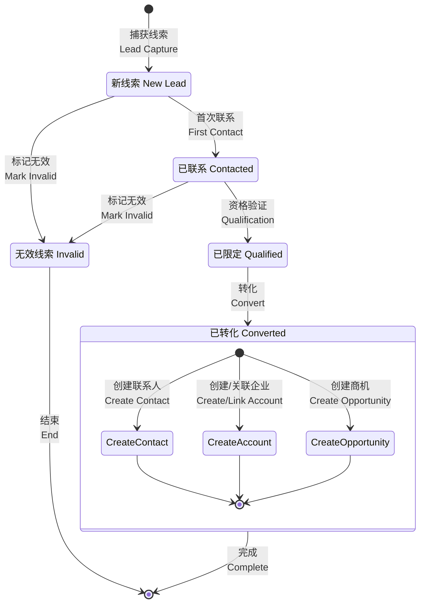

---

### 商机阶段流转流程

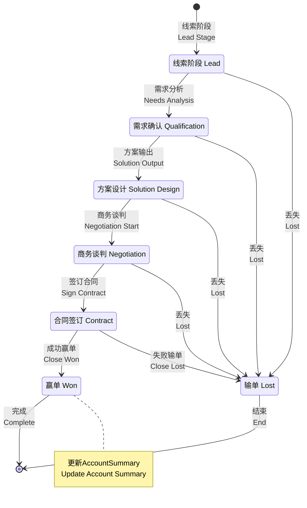

---

### 客户生命周期管理

```mermaid
stateDiagram-v2
    [*] --> Awareness: 认知阶段<br/>Awareness
    
    state "认知阶段 Awareness" as Awareness
    state "考虑阶段 Consideration" as Consideration
    state "决策阶段 Decision" as Decision
    state "留存阶段 Retention" as Retention
    state "扩展阶段 Expansion" as Expansion
    state "流失 Churn" as Churn
    state "召回 Winback" as Winback
    
    Awareness --> Consideration: 产生兴趣<br/>Show Interest
    Consideration --> Decision: 深度评估<br/>Deep Evaluation
    Decision --> Retention: 成交购买<br/>Purchase
    Retention --> Expansion: 追加购买<br/>Upsell/Cross-sell
    
    Retention --> Churn: 停止使用<br/>Stop Using
    Expansion --> Churn: 停止使用<br/>Stop Using
    
    Churn --> Winback: 召回营销<br/>Winback Campaign
    Winback --> Retention: 成功召回<br/>Successfully Winback
    Winback --> [*]: 永久流失<br/>Permanent Loss
    
    Expansion --> [*]: 持续合作<br/>Ongoing Partnership
    
    note right of Retention
        health_score > 70
        健康客户
    end note
    
    note right of Churn
        health_score < 30
        预警流失
    end note
```

---

### 全渠道数据流转流程

```mermaid
sequenceDiagram
    actor User as 用户<br/>User
    participant CH as 渠道<br/>Channel
    participant EV as 事件系统<br/>Event System
    participant ID as 身份识别<br/>Identity Resolution
    participant CDP as CDP核心<br/>CDP Core
    participant LD as Lead管理<br/>Lead Management
    participant CT as Contact管理<br/>Contact Management
    participant AC as Account管理<br/>Account Management
    participant SM as 汇总计算<br/>Summary Calculation
    
    User->>CH: 1. 访问互动<br/>Visit/Interact
    CH->>EV: 2. 记录事件<br/>Log Event
    EV->>ID: 3. 身份识别<br/>Identify
    
    alt 新用户 New User
        ID->>LD: 4a. 创建Lead<br/>Create Lead
        LD->>CDP: 5a. 保存数据<br/>Save Data
        CDP->>SM: 6a. 更新LeadSummary<br/>Update Summary
    else 已识别用户 Identified User
        ID->>CT: 4b. 关联Contact<br/>Link Contact
        CT->>AC: 5b. 关联Account<br/>Link Account
        AC->>CDP: 6b. 保存数据<br/>Save Data
        CDP->>SM: 7b. 更新Summary<br/>Update Summary
    end
    
    SM->>CDP: 8. 触发规则引擎<br/>Trigger Rules
    CDP->>CH: 9. 个性化响应<br/>Personalized Response
    CH->>User: 10. 返回内容<br/>Return Content
    
    Note over SM: ContactSummary<br/>AccountSummary<br/>LeadSummary
```

---

## 数据模型详细设计

### Account 详细字段设计

| 字段名 | 类型 | 长度 | 约束 | 说明 | 示例值 |
|--------|------|------|------|------|--------|
| account_id | VARCHAR | 64 | PK, NOT NULL | 账户唯一标识 | ACC_20231105001 |
| account_name | VARCHAR | 200 | NOT NULL | 企业名称 | 阿里巴巴网络技术有限公司 |
| unified_social_credit_code | VARCHAR | 18 | UNIQUE | 统一社会信用代码 | 91330000MA27XYZ123 |
| account_type | VARCHAR | 50 | NOT NULL | 客户类型 | CUSTOMER / PARTNER / COMPETITOR / PROSPECT |
| industry_id | VARCHAR | 64 | FK | 行业分类外键 | IND_001 |
| account_status | VARCHAR | 50 | NOT NULL | 账户状态 | ACTIVE / DORMANT / CHURNED / BLACKLIST |
| account_level | VARCHAR | 50 |  | 客户等级 | STRATEGIC / IMPORTANT / NORMAL |
| annual_revenue | DECIMAL | 18,2 |  | 年营收(万元) | 50000.00 |
| employee_count | INT |  |  | 员工人数 | 5000 |
| company_website | VARCHAR | 500 |  | 公司网站 | https://www.alibaba.com |
| company_address | VARCHAR | 500 |  | 公司地址 | 浙江省杭州市余杭区文一西路969号 |
| province | VARCHAR | 50 |  | 省份 | 浙江省 |
| city | VARCHAR | 50 |  | 城市 | 杭州市 |
| district | VARCHAR | 50 |  | 区县 | 余杭区 |
| account_source | VARCHAR | 100 |  | 来源渠道 | WEBSITE / EXHIBITION / PARTNER / COLD_CALL |
| primary_channel_id | VARCHAR | 64 | FK | 主渠道ID | CH_001 |
| owner_user_id | VARCHAR | 64 | FK | 负责人ID | USER_001 |
| created_at | DATETIME |  | NOT NULL | 创建时间 | 2023-11-05 10:30:00 |
| updated_at | DATETIME |  | NOT NULL | 更新时间 | 2023-11-05 15:20:00 |
| custom_fields | JSON |  |  | 自定义扩展字段 | {"crm_id": "CRM001", "region": "east"} |
| lifecycle_stage | VARCHAR | 50 |  | 生命周期阶段 | AWARENESS / CONSIDERATION / DECISION / RETENTION / EXPANSION |

---

### AccountSummary 详细字段设计

| 字段名 | 类型 | 长度 | 约束 | 说明 | 示例值 |
|--------|------|------|------|------|--------|
| summary_id | VARCHAR | 64 | PK, NOT NULL | 汇总记录唯一标识 | ACCS_20231105001 |
| account_id | VARCHAR | 64 | FK, UNIQUE, NOT NULL | 账户ID | ACC_20231105001 |
| total_contacts | INT |  | DEFAULT 0 | 关联联系人总数 | 25 |
| total_opportunities | INT |  | DEFAULT 0 | 商机总数 | 8 |
| total_leads | INT |  | DEFAULT 0 | 线索总数 | 45 |
| total_revenue | DECIMAL | 18,2 | DEFAULT 0 | 累计收入(元) | 5000000.00 |
| lifetime_value | DECIMAL | 18,2 | DEFAULT 0 | 生命周期价值(元) | 8000000.00 |
| won_opportunities | INT |  | DEFAULT 0 | 赢单数量 | 5 |
| lost_opportunities | INT |  | DEFAULT 0 | 输单数量 | 2 |
| win_rate | DECIMAL | 5,2 | DEFAULT 0 | 赢单率(%) | 71.43 |
| total_touchpoints | INT |  | DEFAULT 0 | 总触点数 | 156 |
| active_campaigns | INT |  | DEFAULT 0 | 活跃营销活动数 | 3 |
| health_score | INT |  | DEFAULT 0 | 健康度评分(0-100) | 85 |
| last_activity_at | DATETIME |  |  | 最后活跃时间 | 2023-11-05 14:30:00 |
| last_purchase_at | DATETIME |  |  | 最后购买时间 | 2023-10-15 09:00:00 |
| first_purchase_date | DATE |  |  | 首次购买日期 | 2022-03-20 |
| latest_opportunity_date | DATE |  |  | 最新商机日期 | 2023-11-01 |
| days_since_last_contact | INT |  | DEFAULT 0 | 距上次联系天数 | 5 |
| calculated_at | DATETIME |  | NOT NULL | 计算时间 | 2023-11-05 16:00:00 |
| updated_at | DATETIME |  | NOT NULL | 更新时间 | 2023-11-05 16:00:00 |

**AccountSummary 设计说明:**
1. 该表用于存储Account的所有汇总统计数据，避免频繁实时计算
2. 建议通过定时任务(如每小时)或触发器更新
3. 用于快速查询和展示客户360度视图
4. 支持客户健康度监控和预警

---

### Contact 详细字段设计

| 字段名 | 类型 | 长度 | 约束 | 说明 | 示例值 |
|--------|------|------|------|------|--------|
| contact_id | VARCHAR | 64 | PK, NOT NULL | 联系人唯一标识 | CNT_20231105001 |
| contact_name | VARCHAR | 100 | NOT NULL | 联系人姓名 | 张伟 |
| mobile_phone | VARCHAR | 20 | UNIQUE | 手机号 | 13800138000 |
| email | VARCHAR | 200 | UNIQUE | 邮箱地址 | zhangwei@company.com |
| wechat_id | VARCHAR | 100 |  | 微信ID | wx_zhangwei |
| job_title | VARCHAR | 100 |  | 职位 | 首席技术官 CTO |
| department | VARCHAR | 100 |  | 部门 | 技术部 |
| contact_status | VARCHAR | 50 | NOT NULL | 联系人状态 | ACTIVE / INACTIVE / BOUNCED / UNSUBSCRIBED |
| primary_account_id | VARCHAR | 64 | FK | 主要关联企业ID | ACC_20231105001 |
| contact_source | VARCHAR | 100 |  | 来源 | WEBSITE / FORM / IMPORT / API / REFERRAL |
| primary_channel_id | VARCHAR | 64 | FK | 主渠道ID | CH_001 |
| owner_user_id | VARCHAR | 64 | FK | 负责人ID | USER_001 |
| created_at | DATETIME |  | NOT NULL | 创建时间 | 2023-11-05 10:30:00 |
| updated_at | DATETIME |  | NOT NULL | 更新时间 | 2023-11-05 15:20:00 |
| custom_fields | JSON |  |  | 自定义字段 | {"birthday": "1985-01-01", "hobby": "reading"} |
| lifecycle_stage | VARCHAR | 50 |  | 生命周期阶段 | SUBSCRIBER / LEAD / MQL / SQL / OPPORTUNITY / CUSTOMER |
| is_decision_maker | BOOLEAN |  | DEFAULT FALSE | 是否决策者 | true |
| is_verified | BOOLEAN |  | DEFAULT FALSE | 是否已验证 | true |

---

### ContactSummary 详细字段设计

| 字段名 | 类型 | 长度 | 约束 | 说明 | 示例值 |
|--------|------|------|------|------|--------|
| summary_id | VARCHAR | 64 | PK, NOT NULL | 汇总记录唯一标识 | CNTS_20231105001 |
| contact_id | VARCHAR | 64 | FK, UNIQUE, NOT NULL | 联系人ID | CNT_20231105001 |
| total_touchpoints | INT |  | DEFAULT 0 | 总触点数 | 87 |
| total_events | INT |  | DEFAULT 0 | 总事件数 | 234 |
| email_opens | INT |  | DEFAULT 0 | 邮件打开次数 | 45 |
| email_clicks | INT |  | DEFAULT 0 | 邮件点击次数 | 23 |
| form_submissions | INT |  | DEFAULT 0 | 表单提交次数 | 12 |
| content_downloads | INT |  | DEFAULT 0 | 内容下载次数 | 8 |
| engagement_score | INT |  | DEFAULT 0 | 参与度评分(0-100) | 78 |
| last_activity_at | DATETIME |  |  | 最后活跃时间 | 2023-11-05 14:30:00 |
| last_email_sent_at | DATETIME |  |  | 最后邮件发送时间 | 2023-11-04 10:00:00 |
| last_email_opened_at | DATETIME |  |  | 最后邮件打开时间 | 2023-11-04 15:30:00 |
| days_since_last_activity | INT |  | DEFAULT 0 | 距上次活跃天数 | 1 |
| campaign_responses | INT |  | DEFAULT 0 | 营销活动响应次数 | 5 |
| calculated_at | DATETIME |  | NOT NULL | 计算时间 | 2023-11-05 16:00:00 |
| updated_at | DATETIME |  | NOT NULL | 更新时间 | 2023-11-05 16:00:00 |

---

### Lead 详细字段设计

| 字段名 | 类型 | 长度 | 约束 | 说明 | 示例值 |
|--------|------|------|------|------|--------|
| lead_id | VARCHAR | 64 | PK, NOT NULL | 线索唯一标识 | LEAD_20231105001 |
| lead_name | VARCHAR | 100 | NOT NULL | 线索姓名 | 李明 |
| company_name | VARCHAR | 200 |  | 公司名称 | 腾讯科技有限公司 |
| mobile_phone | VARCHAR | 20 |  | 手机号 | 13900139000 |
| email | VARCHAR | 200 |  | 邮箱地址 | liming@company.com |
| wechat_id | VARCHAR | 100 |  | 微信ID | wx_liming |
| job_title | VARCHAR | 100 |  | 职位 | 产品经理 |
| lead_source | VARCHAR | 100 | NOT NULL | 线索来源 | WEBSITE / FORM / CAMPAIGN / COLD_CALL / REFERRAL |
| channel_id | VARCHAR | 64 | FK | 渠道ID | CH_001 |
| campaign_id | VARCHAR | 64 | FK | 营销活动ID | CMP_001 |
| lead_status | VARCHAR | 50 | NOT NULL | 线索状态 | NEW / CONTACTED / QUALIFIED / CONVERTED / DISQUALIFIED |
| lead_score | INT |  | DEFAULT 0 | 线索评分(0-100) | 80 |
| lead_grade | VARCHAR | 10 |  | 线索等级 | A / B / C / D |
| industry_id | VARCHAR | 64 | FK | 行业ID | IND_001 |
| province | VARCHAR | 50 |  | 省份 | 广东省 |
| city | VARCHAR | 50 |  | 城市 | 深圳市 |
| owner_user_id | VARCHAR | 64 | FK | 负责人ID | USER_001 |
| created_at | DATETIME |  | NOT NULL | 创建时间 | 2023-11-05 10:30:00 |
| updated_at | DATETIME |  | NOT NULL | 更新时间 | 2023-11-05 15:20:00 |
| last_contacted_at | DATETIME |  |  | 最后联系时间 | 2023-11-05 14:00:00 |
| converted_at | DATETIME |  |  | 转化时间 | 2023-11-10 09:00:00 |
| converted_contact_id | VARCHAR | 64 | FK | 转化后联系人ID | CNT_20231110001 |
| converted_account_id | VARCHAR | 64 | FK | 转化后企业ID | ACC_20231110001 |
| converted_opportunity_id | VARCHAR | 64 | FK | 转化后商机ID | OPP_20231110001 |
| custom_fields | JSON |  |  | 自定义字段 | {"product_interest": "AI", "budget": "100K"} |
| is_qualified | BOOLEAN |  | DEFAULT FALSE | 是否为合格线索 | true |

---

### LeadSummary 详细字段设计

| 字段名 | 类型 | 长度 | 约束 | 说明 | 示例值 |
|--------|------|------|------|------|--------|
| summary_id | VARCHAR | 64 | PK, NOT NULL | 汇总记录唯一标识 | LEADS_20231105001 |
| lead_id | VARCHAR | 64 | FK, UNIQUE, NOT NULL | 线索ID | LEAD_20231105001 |
| total_touchpoints | INT |  | DEFAULT 0 | 总触点数 | 12 |
| total_events | INT |  | DEFAULT 0 | 总事件数 | 45 |
| form_submissions | INT |  | DEFAULT 0 | 表单提交次数 | 3 |
| content_downloads | INT |  | DEFAULT 0 | 内容下载次数 | 2 |
| page_views | INT |  | DEFAULT 0 | 页面浏览次数 | 28 |
| days_in_pipeline | INT |  | DEFAULT 0 | 在管道中天数 | 7 |
| contact_attempts | INT |  | DEFAULT 0 | 联系尝试次数 | 4 |
| last_activity_at | DATETIME |  |  | 最后活跃时间 | 2023-11-05 14:30:00 |
| last_contact_attempt_at | DATETIME |  |  | 最后联系尝试时间 | 2023-11-05 11:00:00 |
| calculated_at | DATETIME |  | NOT NULL | 计算时间 | 2023-11-05 16:00:00 |
| updated_at | DATETIME |  | NOT NULL | 更新时间 | 2023-11-05 16:00:00 |

---

### Opportunity 详细字段设计

| 字段名 | 类型 | 长度 | 约束 | 说明 | 示例值 |
|--------|------|------|------|------|--------|
| opportunity_id | VARCHAR | 64 | PK, NOT NULL | 商机唯一标识 | OPP_20231105001 |
| opportunity_name | VARCHAR | 200 | NOT NULL | 商机名称 | 腾讯科技-AI平台采购项目 |
| account_id | VARCHAR | 64 | FK, NOT NULL | 关联企业ID | ACC_20231105001 |
| primary_contact_id | VARCHAR | 64 | FK | 主要联系人ID | CNT_20231105001 |
| lead_id | VARCHAR | 64 | FK | 来源线索ID | LEAD_20231105001 |
| opportunity_type | VARCHAR | 50 |  | 商机类型 | NEW_BUSINESS / UPSELL / RENEWAL / CROSS_SELL |
| opportunity_source | VARCHAR | 100 |  | 商机来源 | LEAD_CONVERSION / DIRECT_SALES / PARTNER |
| amount | DECIMAL | 18,2 |  | 预计金额(元) | 1000000.00 |
| currency | VARCHAR | 10 |  | 货币单位 | CNY / USD / EUR |
| stage | VARCHAR | 50 | NOT NULL | 当前阶段 | QUALIFICATION / NEEDS_ANALYSIS / PROPOSAL / NEGOTIATION / CLOSED_WON / CLOSED_LOST |
| probability | INT |  | DEFAULT 0 | 赢单概率(0-100) | 60 |
| expected_close_date | DATE |  |  | 预计成交日期 | 2023-12-31 |
| actual_close_date | DATE |  |  | 实际成交日期 | 2023-12-25 |
| close_reason | VARCHAR | 200 |  | 关闭原因 | 价格因素 / 竞争对手 / 预算不足 / 成功签约 |
| owner_user_id | VARCHAR | 64 | FK | 负责人ID | USER_001 |
| product_ids | JSON |  |  | 关联产品ID数组 | ["PRD_001", "PRD_002"] |
| campaign_id | VARCHAR | 64 | FK | 来源活动ID | CMP_001 |
| created_at | DATETIME |  | NOT NULL | 创建时间 | 2023-11-05 10:30:00 |
| updated_at | DATETIME |  | NOT NULL | 更新时间 | 2023-11-05 15:20:00 |
| custom_fields | JSON |  |  | 自定义字段 | {"contract_type": "annual", "payment_terms": "quarterly"} |
| days_in_stage | INT |  | DEFAULT 0 | 当前阶段停留天数 | 15 |
| is_won | BOOLEAN |  | DEFAULT FALSE | 是否赢单 | false |
| is_lost | BOOLEAN |  | DEFAULT FALSE | 是否输单 | false |

---

### Channel 详细字段设计

| 字段名 | 类型 | 长度 | 约束 | 说明 | 示例值 |
|--------|------|------|------|------|--------|
| channel_id | VARCHAR | 64 | PK, NOT NULL | 渠道唯一标识 | CH_001 |
| channel_name | VARCHAR | 100 | NOT NULL | 渠道名称 | 官网-产品页 |
| channel_type | VARCHAR | 50 | NOT NULL | 渠道类型 | WEBSITE / WECHAT / DOUYIN / EMAIL / PHONE / OFFLINE / PARTNER |
| channel_category | VARCHAR | 50 |  | 渠道分类 | ONLINE / OFFLINE / SOCIAL / DIRECT |
| parent_channel_id | VARCHAR | 64 | FK | 父渠道ID | CH_PARENT_001 |
| channel_status | VARCHAR | 50 | NOT NULL | 渠道状态 | ACTIVE / INACTIVE / TESTING |
| channel_config | JSON |  |  | 渠道配置信息 | {"api_key": "xxx", "webhook_url": "xxx", "app_id": "xxx"} |
| cost | DECIMAL | 18,2 |  | 渠道成本(元/月) | 50000.00 |
| created_at | DATETIME |  | NOT NULL | 创建时间 | 2023-11-05 10:30:00 |
| updated_at | DATETIME |  | NOT NULL | 更新时间 | 2023-11-05 15:20:00 |
| custom_fields | JSON |  |  | 自定义字段 | {"partner_name": "某某合作伙伴", "contract_end": "2024-12-31"} |

---

### Touchpoint 详细字段设计

| 字段名 | 类型 | 长度 | 约束 | 说明 | 示例值 |
|--------|------|------|------|------|--------|
| touchpoint_id | VARCHAR | 64 | PK, NOT NULL | 触点唯一标识 | TP_20231105001 |
| touchpoint_type | VARCHAR | 50 | NOT NULL | 触点类型 | PAGE_VIEW / FORM_SUBMIT / DOWNLOAD / EMAIL / CALL / MEETING / CHAT |
| channel_id | VARCHAR | 64 | FK | 渠道ID | CH_001 |
| campaign_id | VARCHAR | 64 | FK | 营销活动ID | CMP_001 |
| contact_id | VARCHAR | 64 | FK | 联系人ID | CNT_20231105001 |
| lead_id | VARCHAR | 64 | FK | 线索ID | LEAD_20231105001 |
| account_id | VARCHAR | 64 | FK | 企业ID | ACC_20231105001 |
| touchpoint_time | DATETIME |  | NOT NULL | 触点发生时间 | 2023-11-05 14:30:00 |
| touchpoint_direction | VARCHAR | 20 |  | 触点方向 | INBOUND / OUTBOUND |
| touchpoint_status | VARCHAR | 50 |  | 触点状态 | COMPLETED / SCHEDULED / CANCELLED |
| content_type | VARCHAR | 50 |  | 内容类型 | WHITEPAPER / CASE_STUDY / WEBINAR / DEMO / PROPOSAL |
| content_id | VARCHAR | 64 | FK | 内容ID | CONTENT_001 |
| subject | VARCHAR | 200 |  | 主题 | 产品演示会议 |
| description | TEXT |  |  | 描述详情 | 讨论了AI平台的技术架构和实施方案 |
| duration_seconds | INT |  |  | 持续时长(秒) | 3600 |
| owner_user_id | VARCHAR | 64 | FK | 负责人ID | USER_001 |
| metadata | JSON |  |  | 元数据 | {"device": "mobile", "location": "Beijing", "ip": "192.168.1.1"} |
| utm_params | JSON |  |  | UTM追踪参数 | {"utm_source": "baidu", "utm_medium": "cpc", "utm_campaign": "Q4"} |
| created_at | DATETIME |  | NOT NULL | 创建时间 | 2023-11-05 14:30:00 |

---

### Event 详细字段设计

| 字段名 | 类型 | 长度 | 约束 | 说明 | 示例值 |
|--------|------|------|------|------|--------|
| event_id | VARCHAR | 64 | PK, NOT NULL | 事件唯一标识 | EVT_20231105001 |
| event_name | VARCHAR | 100 | NOT NULL | 事件名称 | page_view |
| event_type | VARCHAR | 50 | NOT NULL | 事件类型 | PAGE_VIEW / CLICK / FORM_START / FORM_SUBMIT / DOWNLOAD / VIDEO_PLAY |
| channel_id | VARCHAR | 64 | FK | 渠道ID | CH_001 |
| contact_id | VARCHAR | 64 | FK | 联系人ID | CNT_20231105001 |
| lead_id | VARCHAR | 64 | FK | 线索ID | LEAD_20231105001 |
| account_id | VARCHAR | 64 | FK | 企业ID | ACC_20231105001 |
| event_time | DATETIME |  | NOT NULL | 事件发生时间 | 2023-11-05 14:35:20 |
| session_id | VARCHAR | 64 |  | 会话ID | SESSION_20231105001 |
| device_type | VARCHAR | 50 |  | 设备类型 | DESKTOP / MOBILE / TABLET |
| browser | VARCHAR | 50 |  | 浏览器 | Chrome / Safari / Firefox / Edge |
| os | VARCHAR | 50 |  | 操作系统 | Windows 10 / iOS 16 / Android 13 |
| ip_address | VARCHAR | 50 |  | IP地址 | 192.168.1.1 |
| page_url | VARCHAR | 1000 |  | 页面URL | https://www.example.com/product/ai-platform |
| referrer_url | VARCHAR | 1000 |  | 来源URL | https://www.baidu.com/s?wd=AI平台 |
| event_properties | JSON |  |  | 事件属性 | {"button_text": "申请试用", "form_id": "trial_form", "product": "AI平台"} |
| utm_params | JSON |  |  | UTM追踪参数 | {"utm_source": "baidu", "utm_campaign": "Q4_campaign", "utm_content": "ad1"} |
| created_at | DATETIME |  | NOT NULL | 创建时间 | 2023-11-05 14:35:20 |

---

## 全渠道身份映射方案

### 身份识别匹配规则

```mermaid
flowchart TD
    Start([接收多渠道数据]) --> ExtractID[提取身份标识符]
    
    ExtractID --> CheckPhone{是否有<br/>手机号?}
    ExtractID --> CheckEmail{是否有<br/>邮箱?}
    ExtractID --> CheckWechat{是否有<br/>微信ID?}
    ExtractID --> CheckCorpID{是否有<br/>企业信用代码?}
    
    CheckPhone -->|是| MatchPhone[手机号匹配<br/>优先级: 1]
    CheckEmail -->|是| MatchEmail[邮箱匹配<br/>优先级: 2]
    CheckWechat -->|是| MatchWechat[微信ID匹配<br/>优先级: 3]
    CheckCorpID -->|是| MatchCorpID[企业信用代码匹配<br/>优先级: 1]
    
    MatchPhone --> FoundContact{找到匹配<br/>Contact?}
    MatchEmail --> FoundContact
    MatchWechat --> FoundContact
    
    MatchCorpID --> FoundAccount{找到匹配<br/>Account?}
    
    FoundContact -->|是| MergeContact[合并到现有Contact]
    FoundContact -->|否| CreateContact[创建新Contact]
    
    FoundAccount -->|是| MergeAccount[合并到现有Account]
    FoundAccount -->|否| CreateAccount[创建新Account]
    
    MergeContact --> AddChannelIdentity[添加/更新<br/>ContactChannelIdentity]
    CreateContact --> AddChannelIdentity
    
    MergeAccount --> AddAccountIdentity[添加/更新<br/>AccountChannelIdentity]
    CreateAccount --> AddAccountIdentity
    
    AddChannelIdentity --> UpdateSummary[更新ContactSummary]
    AddAccountIdentity --> UpdateAccountSummary[更新AccountSummary]
    
    UpdateSummary --> End([完成])
    UpdateAccountSummary --> End
    
    style Start fill:#e1f5ff
    style End fill:#e8f5e9
    style MergeContact fill:#fff9c4
    style MergeAccount fill:#fff9c4
    style CreateContact fill:#ffe0b2
    style CreateAccount fill:#ffe0b2
```

### 身份聚合优先级

```mermaid
graph LR
    subgraph Priority["身份匹配优先级 Identity Matching Priority"]
        direction TB
        P1["优先级1: 手机号<br/>Priority 1: Mobile Phone<br/>唯一性: 高<br/>准确性: 95%"]
        P2["优先级2: 邮箱<br/>Priority 2: Email<br/>唯一性: 高<br/>准确性: 90%"]
        P3["优先级3: 企业微信ID<br/>Priority 3: Enterprise WeChat<br/>唯一性: 中<br/>准确性: 85%"]
        P4["优先级4: 统一社会信用代码<br/>Priority 4: Unified Credit Code<br/>唯一性: 极高<br/>准确性: 99%"]
        P5["优先级5: 自定义ID<br/>Priority 5: Custom ID<br/>唯一性: 中<br/>准确性: 70%"]
    end
    
    subgraph Result["匹配结果 Matching Result"]
        direction TB
        R1["Contact统一身份<br/>Unified Contact"]
        R2["Account统一身份<br/>Unified Account"]
    end
    
    P1 & P2 & P3 & P5 --> R1
    P4 --> R2
    
    style P1 fill:#c8e6c9
    style P2 fill:#c8e6c9
    style P4 fill:#c8e6c9
    style P3 fill:#fff9c4
    style P5 fill:#ffccbc
    style R1 fill:#e1f5ff
    style R2 fill:#e1f5ff
```

---

## 数据字典总结

### 核心实体统计

| 实体分类 | 实体名称 | 数量 | 说明 |
|---------|---------|------|------|
| 客户主体实体 | Account, Contact, Lead | 3 | 核心客户数据 |
| 汇总数据实体 | AccountSummary, ContactSummary, LeadSummary | 3 | 统计汇总数据 |
| 业务实体 | Opportunity, Product, ProductCategory | 3 | 业务交易数据 |
| 营销实体 | Campaign, Channel | 2 | 营销活动管理 |
| 交互实体 | Touchpoint, Event | 2 | 客户互动行为 |
| 关系实体 | AccountContactRelation, AccountRelation, OpportunityProduct, CampaignMember, TagRelation, SegmentMember | 6 | 实体关系映射 |
| 身份实体 | AccountChannelIdentity, ContactChannelIdentity, LeadChannelIdentity | 3 | 全渠道身份映射 |
| 分析实体 | Segment, Tag, ScoreModel, ScoreRecord, ScoreHistory, Attribution, TouchpointAttribution, CustomerJourney, JourneyStage | 9 | 数据分析洞察 |
| 性能实体 | ChannelPerformance, CampaignPerformance | 2 | 绩效统计 |
| 历史实体 | OpportunityStageHistory | 1 | 变更历史追踪 |
| 支撑实体 | Industry, TouchpointAttachment | 2 | 基础支撑数据 |
| **合计** | | **36** | 完整覆盖B2B CDP业务场景 |

---

## 汇总数据表设计说明

### 为什么需要汇总数据表

1. **性能优化**
   - 避免频繁的多表JOIN和聚合计算
   - 提升客户360度视图的查询速度
   - 降低数据库负载

2. **业务需求**
   - 快速展示客户健康度评分
   - 实时显示客户价值指标
   - 支持客户预警和监控

3. **数据一致性**
   - 统一的计算口径
   - 定时批量更新保证数据准确性
   - 避免实时计算的结果不一致

### 汇总数据更新策略

```mermaid
flowchart LR
    subgraph Trigger["触发更新 Update Triggers"]
        T1[定时任务<br/>Scheduled Job<br/>每小时]
        T2[实时触发<br/>Real-time Trigger<br/>关键事件]
        T3[手动刷新<br/>Manual Refresh<br/>按需执行]
    end
    
    subgraph Calculation["计算引擎 Calculation Engine"]
        C1[聚合计算<br/>Aggregation]
        C2[评分计算<br/>Scoring]
        C3[规则引擎<br/>Rule Engine]
    end
    
    subgraph Summary["汇总表 Summary Tables"]
        S1[AccountSummary<br/>企业汇总]
        S2[ContactSummary<br/>联系人汇总]
        S3[LeadSummary<br/>线索汇总]
    end
    
    T1 --> C1
    T2 --> C2
    T3 --> C3
    
    C1 & C2 & C3 --> S1 & S2 & S3
    
    style T1 fill:#e3f2fd
    style T2 fill:#fff3e0
    style T3 fill:#f3e5f5
    style S1 fill:#e8f5e9
    style S2 fill:#e8f5e9
    style S3 fill:#e8f5e9
```

---

## 技术实现建议

### 数据库架构

```mermaid
flowchart TB
    subgraph AppLayer["应用层 Application Layer"]
        API[API服务<br/>API Service]
        Worker[后台任务<br/>Background Worker]
    end
    
    subgraph DataLayer["数据层 Data Layer"]
        direction TB
        
        subgraph OLTP["OLTP 在线事务处理"]
            PG[(PostgreSQL<br/>主数据存储<br/>Account/Contact/Lead<br/>Opportunity)]
        end
        
        subgraph BigData["大数据存储 Big Data Storage"]
            CH[(ClickHouse<br/>行为数据<br/>Event/Touchpoint<br/>10亿+记录)]
        end
        
        subgraph Cache["缓存层 Cache Layer"]
            Redis[(Redis<br/>热数据缓存<br/>Summary/Score/Tag)]
        end
        
        subgraph Search["搜索引擎 Search Engine"]
            ES[(Elasticsearch<br/>全文检索<br/>客户搜索/内容搜索)]
        end
        
        subgraph Analytics["分析层 Analytics Layer"]
            DW[(数据仓库<br/>Data Warehouse<br/>BI报表/数据分析)]
        end
    end
    
    API --> PG
    API --> Redis
    API --> ES
    
    Worker --> PG
    Worker --> CH
    Worker --> Redis
    
    PG -.同步.-> ES
    PG -.同步.-> Redis
    PG -.ETL.-> DW
    CH -.ETL.-> DW
    
    classDef oltp fill:#e8f5e9,stroke:#388e3c,stroke-width:2px
    classDef bigdata fill:#fff3e0,stroke:#f57c00,stroke-width:2px
    classDef cache fill:#fce4ec,stroke:#c2185b,stroke-width:2px
    classDef search fill:#e1f5ff,stroke:#0277bd,stroke-width:2px
    classDef analytics fill:#f3e5f5,stroke:#7b1fa2,stroke-width:2px
    
    class PG oltp
    class CH bigdata
    class Redis cache
    class ES search
    class DW analytics
```

### 索引设计建议

**Account表索引:**
```sql
-- 主键索引
PRIMARY KEY (account_id);

-- 唯一索引
CREATE UNIQUE INDEX uk_account_credit_code ON Account(unified_social_credit_code) WHERE unified_social_credit_code IS NOT NULL;

-- 业务查询索引
CREATE INDEX idx_account_name ON Account(account_name);
CREATE INDEX idx_account_status ON Account(account_status);
CREATE INDEX idx_account_owner ON Account(owner_user_id);
CREATE INDEX idx_account_created ON Account(created_at DESC);
CREATE INDEX idx_account_industry ON Account(industry_id);

-- 组合索引
CREATE INDEX idx_account_type_status ON Account(account_type, account_status);
CREATE INDEX idx_account_location ON Account(province, city);
CREATE INDEX idx_account_lifecycle ON Account(lifecycle_stage, account_status);
```

**AccountSummary表索引:**
```sql
-- 主键和唯一索引
PRIMARY KEY (summary_id);
CREATE UNIQUE INDEX uk_summary_account ON AccountSummary(account_id);

-- 查询索引
CREATE INDEX idx_summary_health_score ON AccountSummary(health_score DESC);
CREATE INDEX idx_summary_last_activity ON AccountSummary(last_activity_at DESC);
CREATE INDEX idx_summary_total_revenue ON AccountSummary(total_revenue DESC);
CREATE INDEX idx_summary_win_rate ON AccountSummary(win_rate DESC);
```

**Contact表索引:**
```sql
-- 主键索引
PRIMARY KEY (contact_id);

-- 唯一索引
CREATE UNIQUE INDEX uk_contact_phone ON Contact(mobile_phone) WHERE mobile_phone IS NOT NULL;
CREATE UNIQUE INDEX uk_contact_email ON Contact(email) WHERE email IS NOT NULL;

-- 业务查询索引
CREATE INDEX idx_contact_name ON Contact(contact_name);
CREATE INDEX idx_contact_account ON Contact(primary_account_id);
CREATE INDEX idx_contact_status ON Contact(contact_status);
CREATE INDEX idx_contact_wechat ON Contact(wechat_id);

-- 组合索引
CREATE INDEX idx_contact_phone_email ON Contact(mobile_phone, email);
CREATE INDEX idx_contact_lifecycle ON Contact(lifecycle_stage, contact_status);
```

**Event表索引 (ClickHouse):**
```sql
-- 排序键设计
ORDER BY (channel_id, event_time, contact_id, event_type);

-- 分区键设计
PARTITION BY toYYYYMM(event_time);

-- 采样表达式
SAMPLE BY cityHash64(event_id);
```

**Touchpoint表索引:**
```sql
-- 主键索引
PRIMARY KEY (touchpoint_id);

-- 查询索引
CREATE INDEX idx_touchpoint_contact ON Touchpoint(contact_id, touchpoint_time DESC);
CREATE INDEX idx_touchpoint_lead ON Touchpoint(lead_id, touchpoint_time DESC);
CREATE INDEX idx_touchpoint_account ON Touchpoint(account_id, touchpoint_time DESC);
CREATE INDEX idx_touchpoint_channel ON Touchpoint(channel_id, touchpoint_time DESC);
CREATE INDEX idx_touchpoint_campaign ON Touchpoint(campaign_id, touchpoint_time DESC);
CREATE INDEX idx_touchpoint_time ON Touchpoint(touchpoint_time DESC);
CREATE INDEX idx_touchpoint_type ON Touchpoint(touchpoint_type, touchpoint_time DESC);
```

---

## 总结

本B2B CDP实体设计方案提供:

**核心能力**
- 36个实体，完整覆盖B2B CDP业务场景
- 全渠道身份映射方案，支持跨渠道客户识别
- 汇总数据表设计，优化查询性能
- 完整的客户生命周期管理
- 从线索到商机的完整转化流程

**关键特性**
- 灵活的标签和分群能力
- 多维度的归因分析能力
- 详细的字段设计和数据字典
- 专业的数据库架构建议
- 完整的索引优化方案

**适用场景**
- 全渠道客户数据整合
- 客户360度画像分析
- 精准营销和客户分群
- 销售线索管理和转化
- 客户旅程分析
- 营销归因分析
- 客户价值评估
- 客户健康度监控

根据实际业务需要，可以选择性实现部分实体，并在后续迭代中逐步完善。
