# B2B CDP 实体设计详细方案

## 目录
- [整体架构](#整体架构)
- [核心实体设计](#核心实体设计)
- [实体关系图](#实体关系图)
- [业务流程](#业务流程)
- [数据模型详细设计](#数据模型详细设计)

---

## 整体架构

### 实体分层架构图

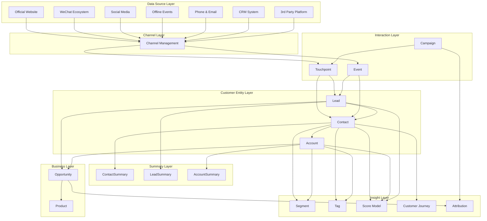

---

### 数据库架构设计

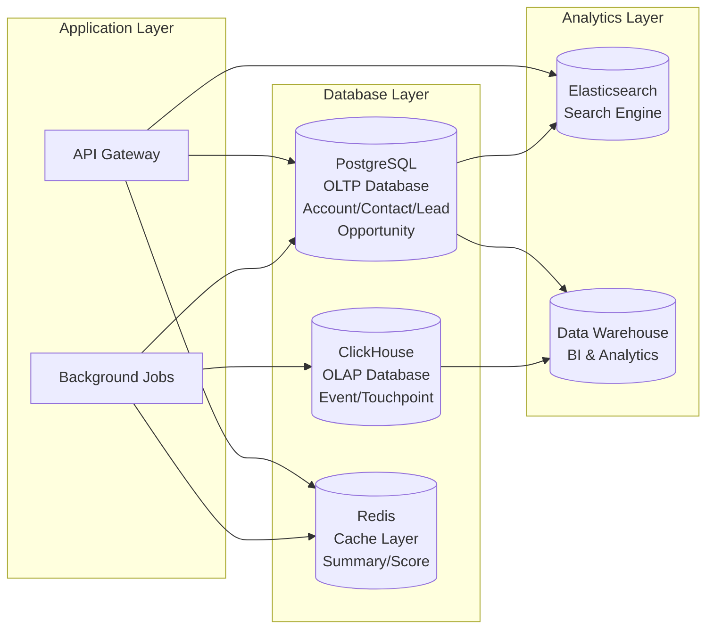

---

## 核心实体设计

### 1. Account Entity

```mermaid
erDiagram
    Account ||--o{ AccountChannelIdentity : has
    Account ||--|| AccountSummary : aggregates
    Account ||--o{ AccountRelation : parent
    Account ||--o{ AccountRelation : child
    
    Account {
        varchar account_id PK
        varchar account_name
        varchar unified_social_credit_code UK
        varchar account_type
        varchar industry_id FK
        varchar account_status
        varchar account_level
        decimal annual_revenue
        int employee_count
        varchar company_website
        varchar province
        varchar city
        varchar account_source
        varchar primary_channel_id FK
        varchar owner_user_id FK
        datetime created_at
        datetime updated_at
        varchar lifecycle_stage
    }
    
    AccountChannelIdentity {
        varchar identity_id PK
        varchar account_id FK
        varchar channel_id FK
        varchar channel_account_id
        varchar identity_type
        boolean is_verified
        datetime first_seen_at
        datetime last_seen_at
    }
    
    AccountSummary {
        varchar summary_id PK
        varchar account_id FK UK
        int total_contacts
        int total_opportunities
        int total_leads
        decimal total_revenue
        decimal lifetime_value
        int won_opportunities
        int lost_opportunities
        decimal win_rate
        int total_touchpoints
        int health_score
        datetime last_activity_at
        datetime calculated_at
    }
    
    AccountRelation {
        varchar relation_id PK
        varchar parent_account_id FK
        varchar child_account_id FK
        varchar relation_type
        datetime created_at
    }
```

**Account 核心字段说明:**
- `account_id`: 全局唯一账户标识
- `unified_social_credit_code`: 统一社会信用代码（企业唯一标识）
- `account_type`: 客户类型（CUSTOMER, PARTNER, COMPETITOR, PROSPECT）
- `account_status`: 账户状态（ACTIVE, DORMANT, CHURNED, BLACKLIST）
- `account_level`: 客户等级（STRATEGIC, IMPORTANT, NORMAL）
- `lifecycle_stage`: 生命周期阶段（AWARENESS, CONSIDERATION, DECISION, RETENTION, EXPANSION）

**AccountSummary 核心指标:**
- `total_contacts`: 关联联系人总数
- `total_revenue`: 累计收入金额
- `lifetime_value`: 客户生命周期价值
- `win_rate`: 赢单率（百分比）
- `health_score`: 健康度评分（0-100）

---

### 2. Contact Entity

```mermaid
erDiagram
    Contact ||--o{ ContactChannelIdentity : has
    Contact ||--o{ AccountContactRelation : belongs_to
    Contact ||--|| ContactSummary : aggregates
    
    Contact {
        varchar contact_id PK
        varchar contact_name
        varchar mobile_phone UK
        varchar email UK
        varchar wechat_id
        varchar job_title
        varchar department
        varchar contact_status
        varchar primary_account_id FK
        varchar contact_source
        varchar primary_channel_id FK
        varchar owner_user_id FK
        datetime created_at
        datetime updated_at
        varchar lifecycle_stage
        boolean is_decision_maker
        boolean is_verified
    }
    
    ContactChannelIdentity {
        varchar identity_id PK
        varchar contact_id FK
        varchar channel_id FK
        varchar channel_user_id
        varchar identity_type
        boolean is_primary
        boolean is_verified
        datetime first_seen_at
        datetime last_seen_at
    }
    
    ContactSummary {
        varchar summary_id PK
        varchar contact_id FK UK
        int total_touchpoints
        int total_events
        int email_opens
        int email_clicks
        int form_submissions
        int content_downloads
        int engagement_score
        datetime last_activity_at
        int days_since_last_activity
        datetime calculated_at
    }
    
    AccountContactRelation {
        varchar relation_id PK
        varchar account_id FK
        varchar contact_id FK
        varchar role_in_account
        varchar decision_level
        boolean is_primary_contact
        varchar relationship_status
        date relation_start_date
        datetime created_at
    }
```

**Contact 核心字段说明:**
- `decision_level`: 决策层级（DECISION_MAKER, INFLUENCER, USER, GATEKEEPER）
- `lifecycle_stage`: 生命周期阶段（SUBSCRIBER, LEAD, MQL, SQL, OPPORTUNITY, CUSTOMER）

**ContactSummary 核心指标:**
- `engagement_score`: 参与度评分（0-100）
- `email_opens`: 邮件打开次数
- `days_since_last_activity`: 距上次活跃天数

---

### 3. Lead Entity

```mermaid
erDiagram
    Lead ||--o{ LeadChannelIdentity : has
    Lead ||--|| LeadSummary : aggregates
    
    Lead {
        varchar lead_id PK
        varchar lead_name
        varchar company_name
        varchar mobile_phone
        varchar email
        varchar wechat_id
        varchar job_title
        varchar lead_source
        varchar channel_id FK
        varchar campaign_id FK
        varchar lead_status
        int lead_score
        varchar lead_grade
        varchar industry_id FK
        varchar province
        varchar city
        varchar owner_user_id FK
        datetime created_at
        datetime updated_at
        datetime last_contacted_at
        datetime converted_at
        varchar converted_contact_id FK
        varchar converted_account_id FK
        varchar converted_opportunity_id FK
        boolean is_qualified
    }
    
    LeadChannelIdentity {
        varchar identity_id PK
        varchar lead_id FK
        varchar channel_id FK
        varchar channel_user_id
        datetime captured_at
    }
    
    LeadSummary {
        varchar summary_id PK
        varchar lead_id FK UK
        int total_touchpoints
        int total_events
        int form_submissions
        int content_downloads
        int page_views
        int days_in_pipeline
        int contact_attempts
        datetime last_activity_at
        datetime calculated_at
    }
```

**Lead 核心字段说明:**
- `lead_status`: 线索状态（NEW, CONTACTED, QUALIFIED, CONVERTED, DISQUALIFIED）
- `lead_score`: 线索评分（0-100）
- `lead_grade`: 线索等级（A, B, C, D）
- `is_qualified`: 是否为合格线索（MQL/SQL）

---

### 4. Opportunity Entity

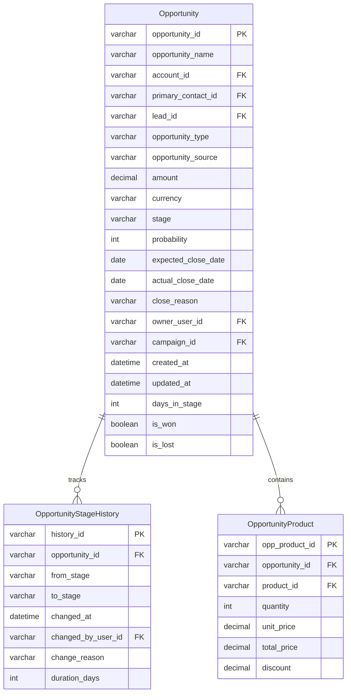

**Opportunity 核心字段说明:**
- `stage`: 商机阶段（LEAD, QUALIFICATION, NEEDS_ANALYSIS, PROPOSAL, NEGOTIATION, CONTRACT, CLOSED_WON, CLOSED_LOST）
- `probability`: 赢单概率（0-100）
- `opportunity_type`: 商机类型（NEW_BUSINESS, UPSELL, RENEWAL, CROSS_SELL）

---

### 5. Channel Entity

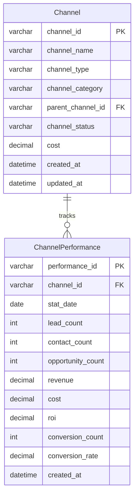

**渠道类型 (channel_type):**
- WEBSITE, SEO, SEM
- WECHAT, ENTERPRISE_WECHAT, DOUYIN
- EMAIL, PHONE
- OFFLINE_EVENT, EXHIBITION
- PARTNER

---

### 6. Campaign Entity

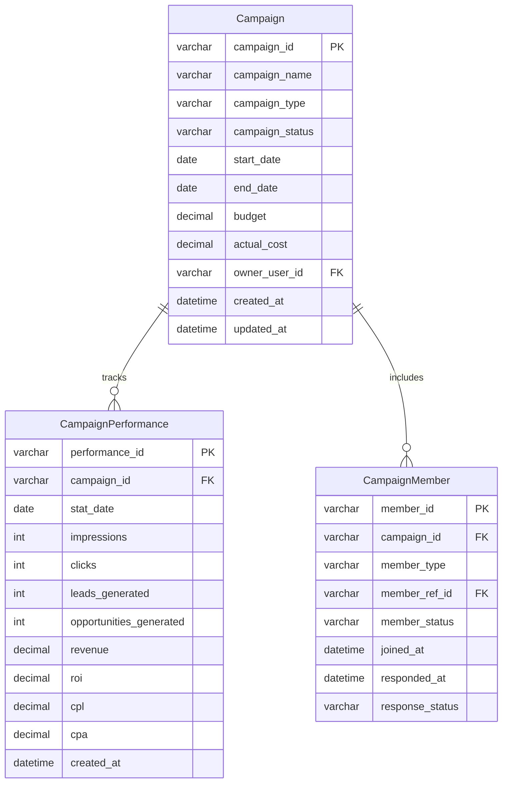

**活动类型 (campaign_type):**
- WEBINAR - 网络研讨会
- CONFERENCE - 线下会议
- EXHIBITION - 展会
- EMAIL_MARKETING - 邮件营销
- CONTENT_MARKETING - 内容营销
- PRODUCT_TRIAL - 产品试用

---

### 7. Touchpoint Entity

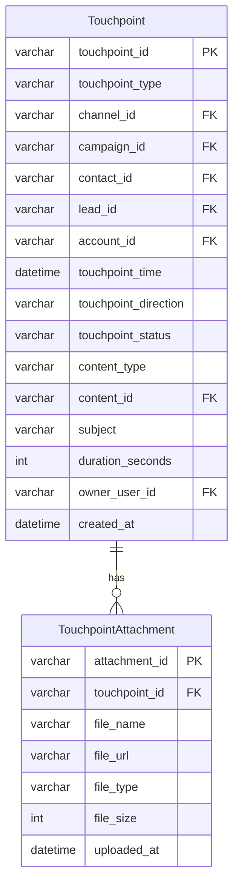

**触点类型 (touchpoint_type):**
- PAGE_VIEW, FORM_SUBMIT, DOWNLOAD
- EMAIL_OPEN, EMAIL_CLICK
- CALL, MEETING, CHAT
- SOCIAL_INTERACTION

---

### 8. Event Entity

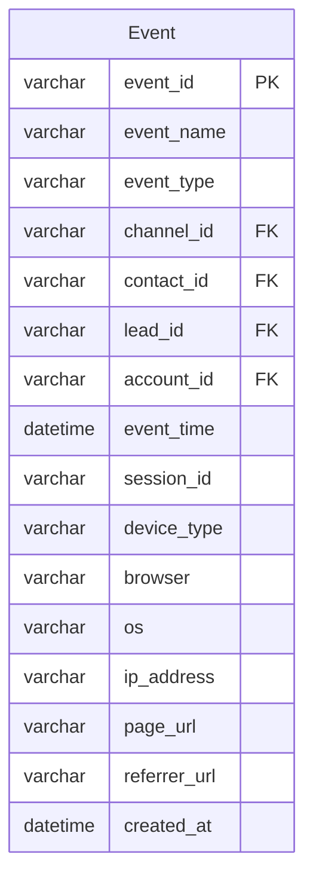

**事件类型 (event_type):**
- PAGE_VIEW, BUTTON_CLICK
- FORM_START, FORM_SUBMIT
- FILE_DOWNLOAD, VIDEO_PLAY
- PRODUCT_TRIAL, SEARCH

---

### 9. Product Entity

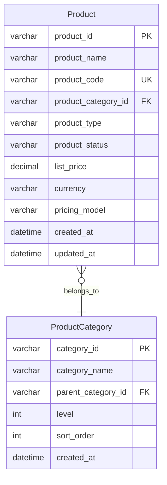

---

### 10. Tag Entity

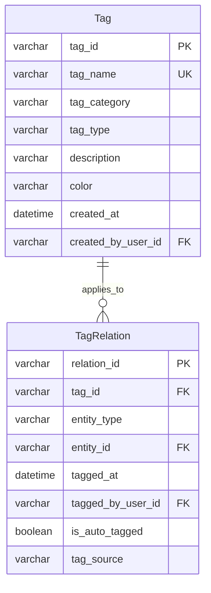

**标签类型 (tag_type):**
- BEHAVIOR - 行为标签
- PROFILE - 画像标签
- BUSINESS - 业务标签
- INTEREST - 兴趣标签

---

### 11. Segment Entity

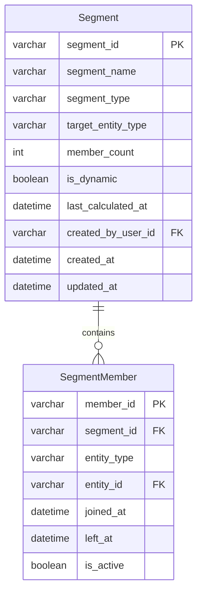

---

### 12. Score Entity

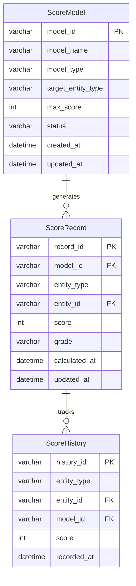

**评分类型 (model_type):**
- LEAD_SCORING - 线索评分
- ACCOUNT_HEALTH - 企业健康度评分
- CONTACT_ENGAGEMENT - 联系人参与度评分

---

### 13. Industry Entity

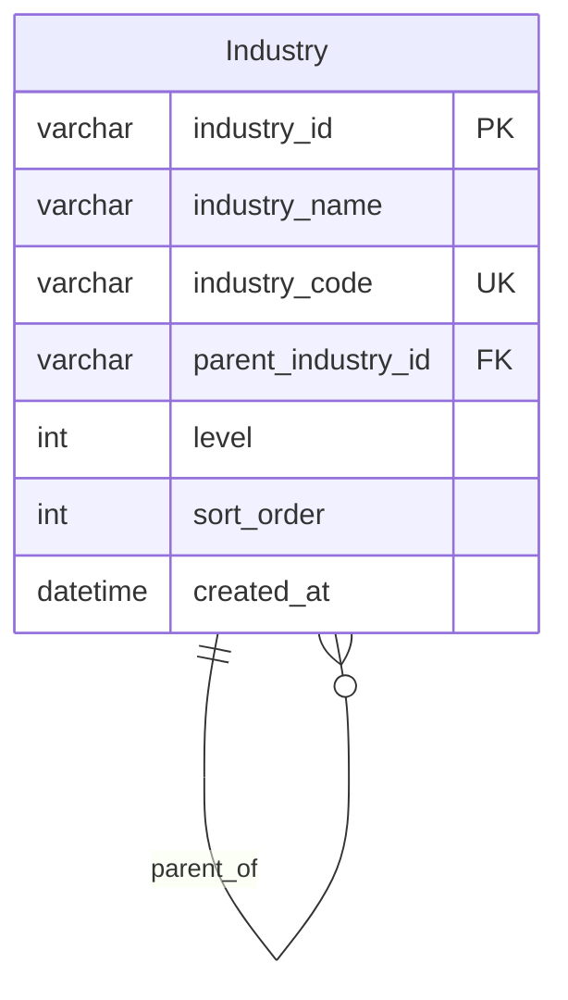

---

### 14. Attribution Entity

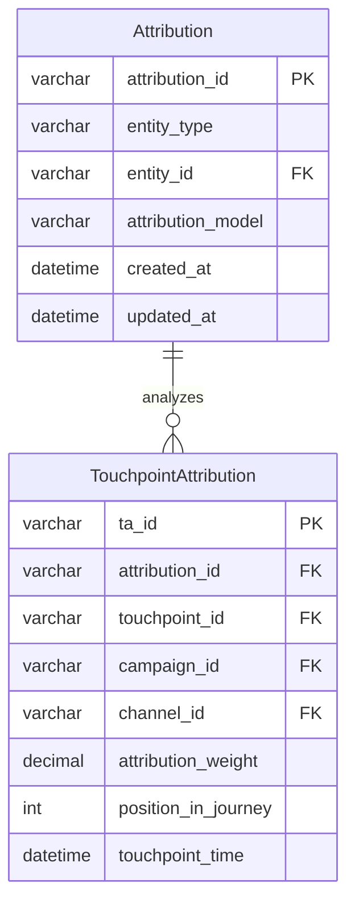

**归因模型 (attribution_model):**
- FIRST_TOUCH - 首次触点归因
- LAST_TOUCH - 末次触点归因
- LINEAR - 线性归因
- TIME_DECAY - 时间衰减归因
- U_SHAPED - U型归因
- W_SHAPED - W型归因

---

### 15. CustomerJourney Entity

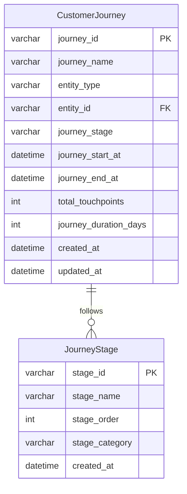

---

## 实体关系图

### 核心实体关系总览

```mermaid
erDiagram
    Account ||--o{ AccountContactRelation : has
    Account ||--|| AccountSummary : aggregates
    Account ||--o{ Opportunity : owns
    Account ||--o{ Touchpoint : receives
    Account ||--o{ AccountChannelIdentity : identified_by
    
    Contact ||--o{ AccountContactRelation : belongs_to
    Contact ||--|| ContactSummary : aggregates
    Contact ||--o{ Opportunity : participates
    Contact ||--o{ Touchpoint : receives
    Contact ||--o{ Event : generates
    Contact ||--o{ ContactChannelIdentity : identified_by
    
    Lead ||--o| Contact : converts_to
    Lead ||--o| Account : converts_to
    Lead ||--o| Opportunity : converts_to
    Lead ||--|| LeadSummary : aggregates
    Lead ||--o{ Touchpoint : receives
    Lead ||--o{ Event : generates
    Lead ||--o{ LeadChannelIdentity : identified_by
    
    Opportunity ||--o{ OpportunityStageHistory : tracks
    Opportunity ||--o{ OpportunityProduct : contains
    
    Product ||--o{ OpportunityProduct : included_in
    Product }o--|| ProductCategory : categorized_by
    
    Channel ||--o{ Touchpoint : generates
    Channel ||--o{ Event : tracks
    Channel ||--o{ ChannelPerformance : measured_by
    Channel ||--o{ AccountChannelIdentity : identifies
    Channel ||--o{ ContactChannelIdentity : identifies
    Channel ||--o{ LeadChannelIdentity : identifies
    
    Campaign ||--o{ Touchpoint : drives
    Campaign ||--o{ Lead : generates
    Campaign ||--o{ CampaignMember : includes
    Campaign ||--o{ CampaignPerformance : measured_by
    
    Tag ||--o{ TagRelation : tags
    Segment ||--o{ SegmentMember : groups
    
    ScoreModel ||--o{ ScoreRecord : scores
    ScoreRecord ||--o{ ScoreHistory : tracks
    
    Industry ||--o{ Account : classifies
    Industry ||--o{ Lead : classifies
    Industry ||--o{ Industry : parent_of
    
    Attribution ||--o{ TouchpointAttribution : attributes
    Touchpoint ||--o{ TouchpointAttribution : contributes
    
    CustomerJourney ||--o{ JourneyStage : progresses
```

---

### 全渠道身份统一架构

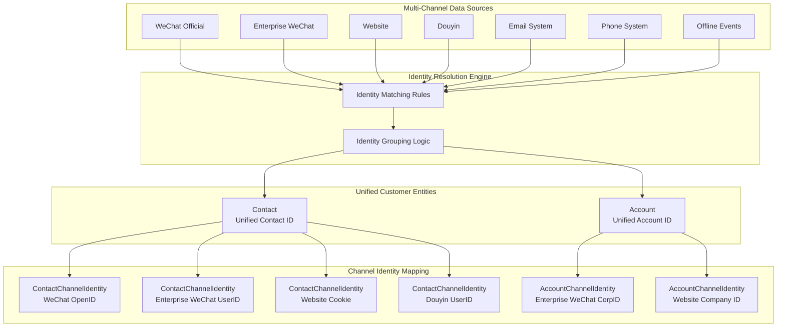

---

## 业务流程

### 线索到商机转化流程

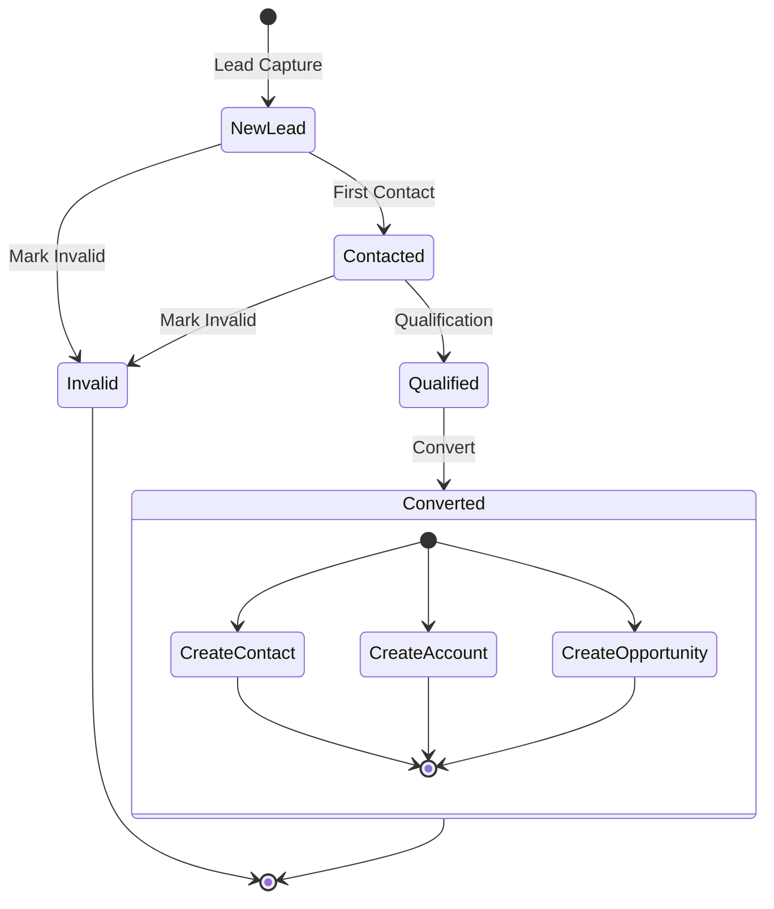

---

### 商机阶段流转流程

```mermaid
stateDiagram-v2
    [*] --> Lead: Lead Stage
    
    Lead --> Qualification: Needs Analysis
    Lead --> Lost: Lost
    
    Qualification --> SolutionDesign: Solution Design
    Qualification --> Lost: Lost
    
    SolutionDesign --> Negotiation: Negotiation
    SolutionDesign --> Lost: Lost
    
    Negotiation --> Contract: Sign Contract
    Negotiation --> Lost: Lost
    
    Contract --> Won: Close Won
    Contract --> Lost: Close Lost
    
    Won --> [*]
    Lost --> [*]
    
    note right of Won
        Update AccountSummary
        - total_revenue
        - won_opportunities
        - win_rate
        - health_score
    end note
```

---

### 客户生命周期管理

```mermaid
stateDiagram-v2
    [*] --> Awareness: Awareness Stage
    
    Awareness --> Consideration: Show Interest
    Consideration --> Decision: Evaluation
    Decision --> Retention: Purchase
    Retention --> Expansion: Upsell/Cross-sell
    
    Retention --> Churn: Inactivity
    Expansion --> Churn: Inactivity
    
    Churn --> Winback: Winback Campaign
    Winback --> Retention: Success
    Winback --> [*]: Permanent Loss
    
    Expansion --> [*]: Ongoing
```

---

### 全渠道数据流转流程

```mermaid
sequenceDiagram
    participant User
    participant Channel
    participant Event
    participant Identity
    participant CDP
    participant Lead
    participant Contact
    participant Account
    participant Summary
    
    User->>Channel: 1. Interaction
    Channel->>Event: 2. Log Event
    Event->>Identity: 3. Identity Resolution
    
    alt New User
        Identity->>Lead: 4a. Create Lead
        Lead->>CDP: 5a. Save Data
        CDP->>Summary: 6a. Update LeadSummary
    else Identified User
        Identity->>Contact: 4b. Link Contact
        Contact->>Account: 5b. Link Account
        Account->>CDP: 6b. Save Data
        CDP->>Summary: 7b. Update Summary
    end
    
    Summary->>CDP: 8. Trigger Rules
    CDP->>Channel: 9. Personalized Response
    Channel->>User: 10. Return Content
```

---

### 身份识别匹配流程

```mermaid
flowchart TD
    Start[Receive Multi-Channel Data] --> Extract[Extract Identity Identifiers]
    
    Extract --> Phone{Has<br/>Phone?}
    Extract --> Email{Has<br/>Email?}
    Extract --> Wechat{Has<br/>WeChat ID?}
    Extract --> Corp{Has<br/>Corp Code?}
    
    Phone -->|Yes| MatchPhone[Match by Phone<br/>Priority: 1]
    Email -->|Yes| MatchEmail[Match by Email<br/>Priority: 2]
    Wechat -->|Yes| MatchWechat[Match by WeChat<br/>Priority: 3]
    Corp -->|Yes| MatchCorp[Match by Corp Code<br/>Priority: 1]
    
    MatchPhone --> FoundContact{Found<br/>Contact?}
    MatchEmail --> FoundContact
    MatchWechat --> FoundContact
    
    MatchCorp --> FoundAccount{Found<br/>Account?}
    
    FoundContact -->|Yes| MergeContact[Merge to Existing Contact]
    FoundContact -->|No| CreateContact[Create New Contact]
    
    FoundAccount -->|Yes| MergeAccount[Merge to Existing Account]
    FoundAccount -->|No| CreateAccount[Create New Account]
    
    MergeContact --> AddIdentity[Add/Update<br/>ContactChannelIdentity]
    CreateContact --> AddIdentity
    
    MergeAccount --> AddAccountIdentity[Add/Update<br/>AccountChannelIdentity]
    CreateAccount --> AddAccountIdentity
    
    AddIdentity --> UpdateSummary[Update ContactSummary]
    AddAccountIdentity --> UpdateAccountSummary[Update AccountSummary]
    
    UpdateSummary --> End[Complete]
    UpdateAccountSummary --> End
```

---

### 汇总数据更新策略

```mermaid
flowchart LR
    subgraph Triggers[Update Triggers]
        T1[Scheduled Job<br/>Hourly]
        T2[Real-time Trigger<br/>Critical Events]
        T3[Manual Refresh<br/>On Demand]
    end
    
    subgraph Engine[Calculation Engine]
        C1[Aggregation]
        C2[Scoring]
        C3[Rule Engine]
    end
    
    subgraph Summary[Summary Tables]
        S1[AccountSummary]
        S2[ContactSummary]
        S3[LeadSummary]
    end
    
    T1 --> C1
    T2 --> C2
    T3 --> C3
    
    C1 --> S1
    C1 --> S2
    C1 --> S3
    C2 --> S1
    C2 --> S2
    C2 --> S3
    C3 --> S1
    C3 --> S2
    C3 --> S3
```

---

## 数据模型详细设计

### Account 详细字段设计

| 字段名 | 类型 | 长度 | 约束 | 说明 | 示例值 |
|--------|------|------|------|------|--------|
| account_id | VARCHAR | 64 | PK, NOT NULL | 账户唯一标识 | ACC_20231105001 |
| account_name | VARCHAR | 200 | NOT NULL | 企业名称 | 阿里巴巴网络技术有限公司 |
| unified_social_credit_code | VARCHAR | 18 | UNIQUE | 统一社会信用代码 | 91330000MA27XYZ123 |
| account_type | VARCHAR | 50 | NOT NULL | 客户类型 | CUSTOMER, PARTNER, COMPETITOR, PROSPECT |
| industry_id | VARCHAR | 64 | FK | 行业分类外键 | IND_001 |
| account_status | VARCHAR | 50 | NOT NULL | 账户状态 | ACTIVE, DORMANT, CHURNED, BLACKLIST |
| account_level | VARCHAR | 50 |  | 客户等级 | STRATEGIC, IMPORTANT, NORMAL |
| annual_revenue | DECIMAL | 18,2 |  | 年营收(万元) | 50000.00 |
| employee_count | INT |  |  | 员工人数 | 5000 |
| company_website | VARCHAR | 500 |  | 公司网站 | https://www.alibaba.com |
| province | VARCHAR | 50 |  | 省份 | 浙江省 |
| city | VARCHAR | 50 |  | 城市 | 杭州市 |
| account_source | VARCHAR | 100 |  | 来源渠道 | WEBSITE, EXHIBITION, PARTNER, COLD_CALL |
| primary_channel_id | VARCHAR | 64 | FK | 主渠道ID | CH_001 |
| owner_user_id | VARCHAR | 64 | FK | 负责人ID | USER_001 |
| created_at | DATETIME |  | NOT NULL | 创建时间 | 2023-11-05 10:30:00 |
| updated_at | DATETIME |  | NOT NULL | 更新时间 | 2023-11-05 15:20:00 |
| lifecycle_stage | VARCHAR | 50 |  | 生命周期阶段 | AWARENESS, CONSIDERATION, DECISION, RETENTION, EXPANSION |

---

### AccountSummary 详细字段设计

| 字段名 | 类型 | 长度 | 约束 | 说明 | 示例值 |
|--------|------|------|------|------|--------|
| summary_id | VARCHAR | 64 | PK, NOT NULL | 汇总记录唯一标识 | ACCS_20231105001 |
| account_id | VARCHAR | 64 | FK, UNIQUE, NOT NULL | 账户ID | ACC_20231105001 |
| total_contacts | INT |  | DEFAULT 0 | 关联联系人总数 | 25 |
| total_opportunities | INT |  | DEFAULT 0 | 商机总数 | 8 |
| total_leads | INT |  | DEFAULT 0 | 线索总数 | 45 |
| total_revenue | DECIMAL | 18,2 | DEFAULT 0 | 累计收入(元) | 5000000.00 |
| lifetime_value | DECIMAL | 18,2 | DEFAULT 0 | 生命周期价值(元) | 8000000.00 |
| won_opportunities | INT |  | DEFAULT 0 | 赢单数量 | 5 |
| lost_opportunities | INT |  | DEFAULT 0 | 输单数量 | 2 |
| win_rate | DECIMAL | 5,2 | DEFAULT 0 | 赢单率(%) | 71.43 |
| total_touchpoints | INT |  | DEFAULT 0 | 总触点数 | 156 |
| health_score | INT |  | DEFAULT 0 | 健康度评分(0-100) | 85 |
| last_activity_at | DATETIME |  |  | 最后活跃时间 | 2023-11-05 14:30:00 |
| calculated_at | DATETIME |  | NOT NULL | 计算时间 | 2023-11-05 16:00:00 |
| updated_at | DATETIME |  | NOT NULL | 更新时间 | 2023-11-05 16:00:00 |

---

### Contact 详细字段设计

| 字段名 | 类型 | 长度 | 约束 | 说明 | 示例值 |
|--------|------|------|------|------|--------|
| contact_id | VARCHAR | 64 | PK, NOT NULL | 联系人唯一标识 | CNT_20231105001 |
| contact_name | VARCHAR | 100 | NOT NULL | 联系人姓名 | 张伟 |
| mobile_phone | VARCHAR | 20 | UNIQUE | 手机号 | 13800138000 |
| email | VARCHAR | 200 | UNIQUE | 邮箱地址 | zhangwei@company.com |
| wechat_id | VARCHAR | 100 |  | 微信ID | wx_zhangwei |
| job_title | VARCHAR | 100 |  | 职位 | 首席技术官 CTO |
| department | VARCHAR | 100 |  | 部门 | 技术部 |
| contact_status | VARCHAR | 50 | NOT NULL | 联系人状态 | ACTIVE, INACTIVE, BOUNCED, UNSUBSCRIBED |
| primary_account_id | VARCHAR | 64 | FK | 主要关联企业ID | ACC_20231105001 |
| contact_source | VARCHAR | 100 |  | 来源 | WEBSITE, FORM, IMPORT, API, REFERRAL |
| primary_channel_id | VARCHAR | 64 | FK | 主渠道ID | CH_001 |
| owner_user_id | VARCHAR | 64 | FK | 负责人ID | USER_001 |
| created_at | DATETIME |  | NOT NULL | 创建时间 | 2023-11-05 10:30:00 |
| updated_at | DATETIME |  | NOT NULL | 更新时间 | 2023-11-05 15:20:00 |
| lifecycle_stage | VARCHAR | 50 |  | 生命周期阶段 | SUBSCRIBER, LEAD, MQL, SQL, OPPORTUNITY, CUSTOMER |
| is_decision_maker | BOOLEAN |  | DEFAULT FALSE | 是否决策者 | true |
| is_verified | BOOLEAN |  | DEFAULT FALSE | 是否已验证 | true |

---

### ContactSummary 详细字段设计

| 字段名 | 类型 | 长度 | 约束 | 说明 | 示例值 |
|--------|------|------|------|------|--------|
| summary_id | VARCHAR | 64 | PK, NOT NULL | 汇总记录唯一标识 | CNTS_20231105001 |
| contact_id | VARCHAR | 64 | FK, UNIQUE, NOT NULL | 联系人ID | CNT_20231105001 |
| total_touchpoints | INT |  | DEFAULT 0 | 总触点数 | 87 |
| total_events | INT |  | DEFAULT 0 | 总事件数 | 234 |
| email_opens | INT |  | DEFAULT 0 | 邮件打开次数 | 45 |
| email_clicks | INT |  | DEFAULT 0 | 邮件点击次数 | 23 |
| form_submissions | INT |  | DEFAULT 0 | 表单提交次数 | 12 |
| content_downloads | INT |  | DEFAULT 0 | 内容下载次数 | 8 |
| engagement_score | INT |  | DEFAULT 0 | 参与度评分(0-100) | 78 |
| last_activity_at | DATETIME |  |  | 最后活跃时间 | 2023-11-05 14:30:00 |
| days_since_last_activity | INT |  | DEFAULT 0 | 距上次活跃天数 | 1 |
| calculated_at | DATETIME |  | NOT NULL | 计算时间 | 2023-11-05 16:00:00 |
| updated_at | DATETIME |  | NOT NULL | 更新时间 | 2023-11-05 16:00:00 |

---

### Lead 详细字段设计

| 字段名 | 类型 | 长度 | 约束 | 说明 | 示例值 |
|--------|------|------|------|------|--------|
| lead_id | VARCHAR | 64 | PK, NOT NULL | 线索唯一标识 | LEAD_20231105001 |
| lead_name | VARCHAR | 100 | NOT NULL | 线索姓名 | 李明 |
| company_name | VARCHAR | 200 |  | 公司名称 | 腾讯科技有限公司 |
| mobile_phone | VARCHAR | 20 |  | 手机号 | 13900139000 |
| email | VARCHAR | 200 |  | 邮箱地址 | liming@company.com |
| wechat_id | VARCHAR | 100 |  | 微信ID | wx_liming |
| job_title | VARCHAR | 100 |  | 职位 | 产品经理 |
| lead_source | VARCHAR | 100 | NOT NULL | 线索来源 | WEBSITE, FORM, CAMPAIGN, COLD_CALL, REFERRAL |
| channel_id | VARCHAR | 64 | FK | 渠道ID | CH_001 |
| campaign_id | VARCHAR | 64 | FK | 营销活动ID | CMP_001 |
| lead_status | VARCHAR | 50 | NOT NULL | 线索状态 | NEW, CONTACTED, QUALIFIED, CONVERTED, DISQUALIFIED |
| lead_score | INT |  | DEFAULT 0 | 线索评分(0-100) | 80 |
| lead_grade | VARCHAR | 10 |  | 线索等级 | A, B, C, D |
| industry_id | VARCHAR | 64 | FK | 行业ID | IND_001 |
| province | VARCHAR | 50 |  | 省份 | 广东省 |
| city | VARCHAR | 50 |  | 城市 | 深圳市 |
| owner_user_id | VARCHAR | 64 | FK | 负责人ID | USER_001 |
| created_at | DATETIME |  | NOT NULL | 创建时间 | 2023-11-05 10:30:00 |
| updated_at | DATETIME |  | NOT NULL | 更新时间 | 2023-11-05 15:20:00 |
| last_contacted_at | DATETIME |  |  | 最后联系时间 | 2023-11-05 14:00:00 |
| converted_at | DATETIME |  |  | 转化时间 | 2023-11-10 09:00:00 |
| converted_contact_id | VARCHAR | 64 | FK | 转化后联系人ID | CNT_20231110001 |
| converted_account_id | VARCHAR | 64 | FK | 转化后企业ID | ACC_20231110001 |
| converted_opportunity_id | VARCHAR | 64 | FK | 转化后商机ID | OPP_20231110001 |
| is_qualified | BOOLEAN |  | DEFAULT FALSE | 是否为合格线索 | true |

---

### LeadSummary 详细字段设计

| 字段名 | 类型 | 长度 | 约束 | 说明 | 示例值 |
|--------|------|------|------|------|--------|
| summary_id | VARCHAR | 64 | PK, NOT NULL | 汇总记录唯一标识 | LEADS_20231105001 |
| lead_id | VARCHAR | 64 | FK, UNIQUE, NOT NULL | 线索ID | LEAD_20231105001 |
| total_touchpoints | INT |  | DEFAULT 0 | 总触点数 | 12 |
| total_events | INT |  | DEFAULT 0 | 总事件数 | 45 |
| form_submissions | INT |  | DEFAULT 0 | 表单提交次数 | 3 |
| content_downloads | INT |  | DEFAULT 0 | 内容下载次数 | 2 |
| page_views | INT |  | DEFAULT 0 | 页面浏览次数 | 28 |
| days_in_pipeline | INT |  | DEFAULT 0 | 在管道中天数 | 7 |
| contact_attempts | INT |  | DEFAULT 0 | 联系尝试次数 | 4 |
| last_activity_at | DATETIME |  |  | 最后活跃时间 | 2023-11-05 14:30:00 |
| last_contact_attempt_at | DATETIME |  |  | 最后联系尝试时间 | 2023-11-05 11:00:00 |
| calculated_at | DATETIME |  | NOT NULL | 计算时间 | 2023-11-05 16:00:00 |
| updated_at | DATETIME |  | NOT NULL | 更新时间 | 2023-11-05 16:00:00 |

---

### Opportunity 详细字段设计

| 字段名 | 类型 | 长度 | 约束 | 说明 | 示例值 |
|--------|------|------|------|------|--------|
| opportunity_id | VARCHAR | 64 | PK, NOT NULL | 商机唯一标识 | OPP_20231105001 |
| opportunity_name | VARCHAR | 200 | NOT NULL | 商机名称 | 腾讯科技-AI平台采购项目 |
| account_id | VARCHAR | 64 | FK, NOT NULL | 关联企业ID | ACC_20231105001 |
| primary_contact_id | VARCHAR | 64 | FK | 主要联系人ID | CNT_20231105001 |
| lead_id | VARCHAR | 64 | FK | 来源线索ID | LEAD_20231105001 |
| opportunity_type | VARCHAR | 50 |  | 商机类型 | NEW_BUSINESS, UPSELL, RENEWAL, CROSS_SELL |
| opportunity_source | VARCHAR | 100 |  | 商机来源 | LEAD_CONVERSION, DIRECT_SALES, PARTNER |
| amount | DECIMAL | 18,2 |  | 预计金额(元) | 1000000.00 |
| currency | VARCHAR | 10 |  | 货币单位 | CNY, USD, EUR |
| stage | VARCHAR | 50 | NOT NULL | 当前阶段 | QUALIFICATION, NEEDS_ANALYSIS, PROPOSAL, NEGOTIATION, CLOSED_WON, CLOSED_LOST |
| probability | INT |  | DEFAULT 0 | 赢单概率(0-100) | 60 |
| expected_close_date | DATE |  |  | 预计成交日期 | 2023-12-31 |
| actual_close_date | DATE |  |  | 实际成交日期 | 2023-12-25 |
| close_reason | VARCHAR | 200 |  | 关闭原因 | 价格因素, 竞争对手, 预算不足, 成功签约 |
| owner_user_id | VARCHAR | 64 | FK | 负责人ID | USER_001 |
| campaign_id | VARCHAR | 64 | FK | 来源活动ID | CMP_001 |
| created_at | DATETIME |  | NOT NULL | 创建时间 | 2023-11-05 10:30:00 |
| updated_at | DATETIME |  | NOT NULL | 更新时间 | 2023-11-05 15:20:00 |
| days_in_stage | INT |  | DEFAULT 0 | 当前阶段停留天数 | 15 |
| is_won | BOOLEAN |  | DEFAULT FALSE | 是否赢单 | false |
| is_lost | BOOLEAN |  | DEFAULT FALSE | 是否输单 | false |

---

### Channel 详细字段设计

| 字段名 | 类型 | 长度 | 约束 | 说明 | 示例值 |
|--------|------|------|------|------|--------|
| channel_id | VARCHAR | 64 | PK, NOT NULL | 渠道唯一标识 | CH_001 |
| channel_name | VARCHAR | 100 | NOT NULL | 渠道名称 | 官网-产品页 |
| channel_type | VARCHAR | 50 | NOT NULL | 渠道类型 | WEBSITE, WECHAT, DOUYIN, EMAIL, PHONE, OFFLINE, PARTNER |
| channel_category | VARCHAR | 50 |  | 渠道分类 | ONLINE, OFFLINE, SOCIAL, DIRECT |
| parent_channel_id | VARCHAR | 64 | FK | 父渠道ID | CH_PARENT_001 |
| channel_status | VARCHAR | 50 | NOT NULL | 渠道状态 | ACTIVE, INACTIVE, TESTING |
| cost | DECIMAL | 18,2 |  | 渠道成本(元/月) | 50000.00 |
| created_at | DATETIME |  | NOT NULL | 创建时间 | 2023-11-05 10:30:00 |
| updated_at | DATETIME |  | NOT NULL | 更新时间 | 2023-11-05 15:20:00 |

---

### Touchpoint 详细字段设计

| 字段名 | 类型 | 长度 | 约束 | 说明 | 示例值 |
|--------|------|------|------|------|--------|
| touchpoint_id | VARCHAR | 64 | PK, NOT NULL | 触点唯一标识 | TP_20231105001 |
| touchpoint_type | VARCHAR | 50 | NOT NULL | 触点类型 | PAGE_VIEW, FORM_SUBMIT, DOWNLOAD, EMAIL, CALL, MEETING, CHAT |
| channel_id | VARCHAR | 64 | FK | 渠道ID | CH_001 |
| campaign_id | VARCHAR | 64 | FK | 营销活动ID | CMP_001 |
| contact_id | VARCHAR | 64 | FK | 联系人ID | CNT_20231105001 |
| lead_id | VARCHAR | 64 | FK | 线索ID | LEAD_20231105001 |
| account_id | VARCHAR | 64 | FK | 企业ID | ACC_20231105001 |
| touchpoint_time | DATETIME |  | NOT NULL | 触点发生时间 | 2023-11-05 14:30:00 |
| touchpoint_direction | VARCHAR | 20 |  | 触点方向 | INBOUND, OUTBOUND |
| touchpoint_status | VARCHAR | 50 |  | 触点状态 | COMPLETED, SCHEDULED, CANCELLED |
| content_type | VARCHAR | 50 |  | 内容类型 | WHITEPAPER, CASE_STUDY, WEBINAR, DEMO, PROPOSAL |
| content_id | VARCHAR | 64 | FK | 内容ID | CONTENT_001 |
| subject | VARCHAR | 200 |  | 主题 | 产品演示会议 |
| duration_seconds | INT |  |  | 持续时长(秒) | 3600 |
| owner_user_id | VARCHAR | 64 | FK | 负责人ID | USER_001 |
| created_at | DATETIME |  | NOT NULL | 创建时间 | 2023-11-05 14:30:00 |

---

### Event 详细字段设计

| 字段名 | 类型 | 长度 | 约束 | 说明 | 示例值 |
|--------|------|------|------|------|--------|
| event_id | VARCHAR | 64 | PK, NOT NULL | 事件唯一标识 | EVT_20231105001 |
| event_name | VARCHAR | 100 | NOT NULL | 事件名称 | page_view |
| event_type | VARCHAR | 50 | NOT NULL | 事件类型 | PAGE_VIEW, CLICK, FORM_START, FORM_SUBMIT, DOWNLOAD, VIDEO_PLAY |
| channel_id | VARCHAR | 64 | FK | 渠道ID | CH_001 |
| contact_id | VARCHAR | 64 | FK | 联系人ID | CNT_20231105001 |
| lead_id | VARCHAR | 64 | FK | 线索ID | LEAD_20231105001 |
| account_id | VARCHAR | 64 | FK | 企业ID | ACC_20231105001 |
| event_time | DATETIME |  | NOT NULL | 事件发生时间 | 2023-11-05 14:35:20 |
| session_id | VARCHAR | 64 |  | 会话ID | SESSION_20231105001 |
| device_type | VARCHAR | 50 |  | 设备类型 | DESKTOP, MOBILE, TABLET |
| browser | VARCHAR | 50 |  | 浏览器 | Chrome, Safari, Firefox, Edge |
| os | VARCHAR | 50 |  | 操作系统 | Windows 10, iOS 16, Android 13 |
| ip_address | VARCHAR | 50 |  | IP地址 | 192.168.1.1 |
| page_url | VARCHAR | 1000 |  | 页面URL | https://www.example.com/product/ai-platform |
| referrer_url | VARCHAR | 1000 |  | 来源URL | https://www.baidu.com/s?wd=AI平台 |
| created_at | DATETIME |  | NOT NULL | 创建时间 | 2023-11-05 14:35:20 |

---

## 数据字典总结

### 核心实体统计

| 实体分类 | 实体名称 | 数量 | 说明 |
|---------|---------|------|------|
| 客户主体实体 | Account, Contact, Lead | 3 | 核心客户数据 |
| 汇总数据实体 | AccountSummary, ContactSummary, LeadSummary | 3 | 统计汇总数据 |
| 业务实体 | Opportunity, Product, ProductCategory | 3 | 业务交易数据 |
| 营销实体 | Campaign, Channel | 2 | 营销活动管理 |
| 交互实体 | Touchpoint, Event | 2 | 客户互动行为 |
| 关系实体 | AccountContactRelation, AccountRelation, OpportunityProduct, CampaignMember, TagRelation, SegmentMember | 6 | 实体关系映射 |
| 身份实体 | AccountChannelIdentity, ContactChannelIdentity, LeadChannelIdentity | 3 | 全渠道身份映射 |
| 分析实体 | Segment, Tag, ScoreModel, ScoreRecord, ScoreHistory, Attribution, TouchpointAttribution, CustomerJourney, JourneyStage | 9 | 数据分析洞察 |
| 性能实体 | ChannelPerformance, CampaignPerformance | 2 | 绩效统计 |
| 历史实体 | OpportunityStageHistory | 1 | 变更历史追踪 |
| 支撑实体 | Industry, TouchpointAttachment | 2 | 基础支撑数据 |
| 合计 | | 36 | 完整覆盖B2B CDP业务场景 |

---

## 汇总数据表设计说明

### 汇总表的设计原则

1. **性能优化**
   - 避免频繁的多表JOIN和聚合计算
   - 提升客户360度视图的查询速度
   - 降低数据库负载

2. **业务需求**
   - 快速展示客户健康度评分
   - 实时显示客户价值指标
   - 支持客户预警和监控

3. **数据一致性**
   - 统一的计算口径
   - 定时批量更新保证数据准确性
   - 避免实时计算的结果不一致

### 汇总表更新机制

**更新触发条件:**
- 定时任务：每小时执行一次全量更新
- 实时触发：关键业务事件发生时立即更新（如商机赢单、联系人新增）
- 手动刷新：管理员按需触发更新

**更新策略:**
- 增量更新：仅更新有变化的记录
- 全量更新：定期执行完整重算
- 异步更新：使用消息队列避免阻塞主业务流程

---

## 技术实现建议

### 索引设计建议

**Account表索引:**
```sql
-- 主键索引
PRIMARY KEY (account_id);

-- 唯一索引
CREATE UNIQUE INDEX uk_account_credit_code ON Account(unified_social_credit_code) 
WHERE unified_social_credit_code IS NOT NULL;

-- 业务查询索引
CREATE INDEX idx_account_name ON Account(account_name);
CREATE INDEX idx_account_status ON Account(account_status);
CREATE INDEX idx_account_owner ON Account(owner_user_id);
CREATE INDEX idx_account_created ON Account(created_at DESC);
CREATE INDEX idx_account_industry ON Account(industry_id);

-- 组合索引
CREATE INDEX idx_account_type_status ON Account(account_type, account_status);
CREATE INDEX idx_account_location ON Account(province, city);
CREATE INDEX idx_account_lifecycle ON Account(lifecycle_stage, account_status);
```

**AccountSummary表索引:**
```sql
-- 主键和唯一索引
PRIMARY KEY (summary_id);
CREATE UNIQUE INDEX uk_summary_account ON AccountSummary(account_id);

-- 查询索引
CREATE INDEX idx_summary_health_score ON AccountSummary(health_score DESC);
CREATE INDEX idx_summary_last_activity ON AccountSummary(last_activity_at DESC);
CREATE INDEX idx_summary_total_revenue ON AccountSummary(total_revenue DESC);
CREATE INDEX idx_summary_win_rate ON AccountSummary(win_rate DESC);
```

**Contact表索引:**
```sql
-- 主键索引
PRIMARY KEY (contact_id);

-- 唯一索引
CREATE UNIQUE INDEX uk_contact_phone ON Contact(mobile_phone) 
WHERE mobile_phone IS NOT NULL;
CREATE UNIQUE INDEX uk_contact_email ON Contact(email) 
WHERE email IS NOT NULL;

-- 业务查询索引
CREATE INDEX idx_contact_name ON Contact(contact_name);
CREATE INDEX idx_contact_account ON Contact(primary_account_id);
CREATE INDEX idx_contact_status ON Contact(contact_status);
CREATE INDEX idx_contact_wechat ON Contact(wechat_id);

-- 组合索引
CREATE INDEX idx_contact_phone_email ON Contact(mobile_phone, email);
CREATE INDEX idx_contact_lifecycle ON Contact(lifecycle_stage, contact_status);
```

**Event表索引 (ClickHouse):**
```sql
-- 排序键设计
ORDER BY (channel_id, event_time, contact_id, event_type);

-- 分区键设计
PARTITION BY toYYYYMM(event_time);

-- 采样表达式
SAMPLE BY cityHash64(event_id);
```

**Touchpoint表索引:**
```sql
-- 主键索引
PRIMARY KEY (touchpoint_id);

-- 查询索引
CREATE INDEX idx_touchpoint_contact ON Touchpoint(contact_id, touchpoint_time DESC);
CREATE INDEX idx_touchpoint_lead ON Touchpoint(lead_id, touchpoint_time DESC);
CREATE INDEX idx_touchpoint_account ON Touchpoint(account_id, touchpoint_time DESC);
CREATE INDEX idx_touchpoint_channel ON Touchpoint(channel_id, touchpoint_time DESC);
CREATE INDEX idx_touchpoint_campaign ON Touchpoint(campaign_id, touchpoint_time DESC);
CREATE INDEX idx_touchpoint_time ON Touchpoint(touchpoint_time DESC);
CREATE INDEX idx_touchpoint_type ON Touchpoint(touchpoint_type, touchpoint_time DESC);
```

---

## 总结

本B2B CDP实体设计方案提供:

**核心能力**
- 36个实体，完整覆盖B2B CDP业务场景
- 全渠道身份映射方案，支持跨渠道客户识别
- 汇总数据表设计，优化查询性能
- 完整的客户生命周期管理
- 从线索到商机的完整转化流程

**关键特性**
- 灵活的标签和分群能力
- 多维度的归因分析能力
- 详细的字段设计和数据字典
- 专业的数据库架构建议
- 完整的索引优化方案

**适用场景**
- 全渠道客户数据整合
- 客户360度画像分析
- 精准营销和客户分群
- 销售线索管理和转化
- 客户旅程分析
- 营销归因分析
- 客户价值评估
- 客户健康度监控

根据实际业务需要，可以选择性实现部分实体，并在后续迭代中逐步完善。
