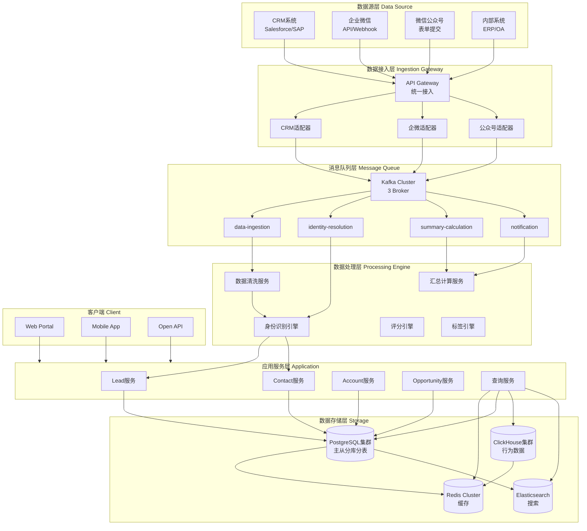
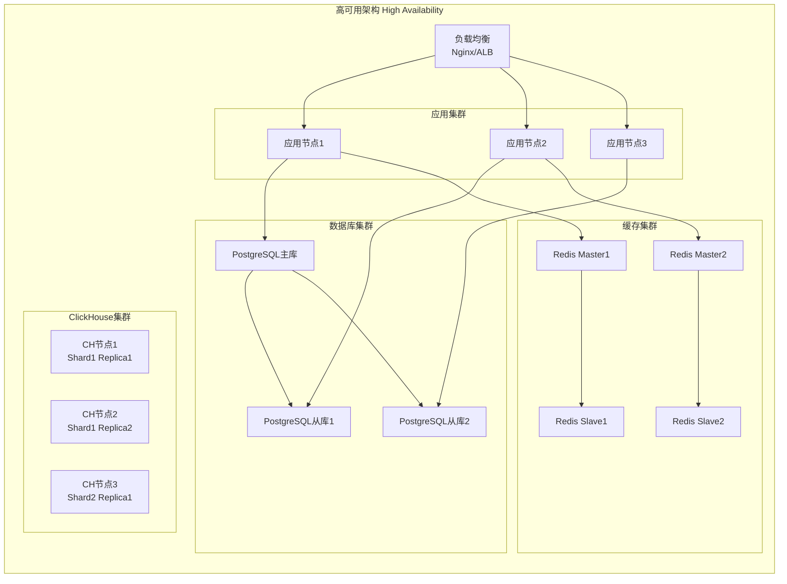
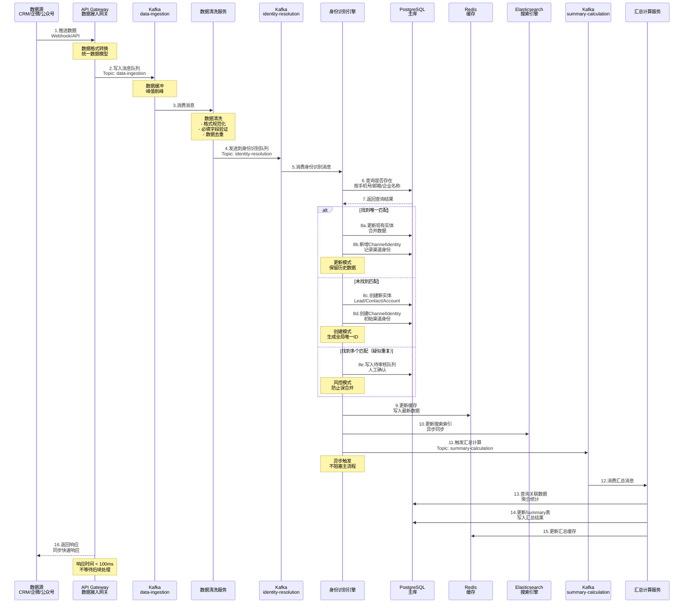
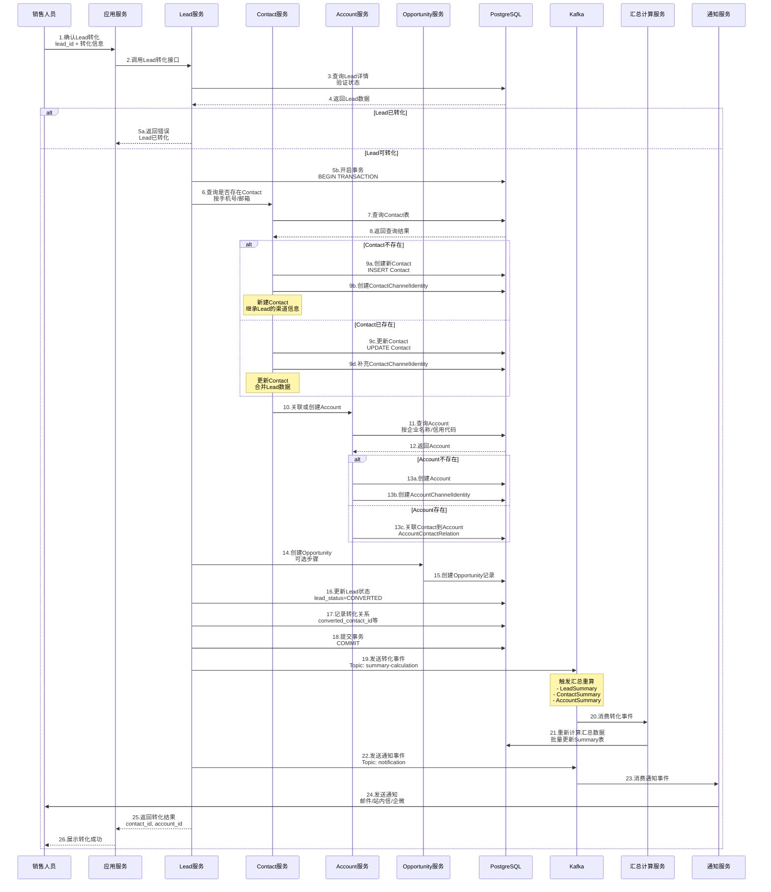
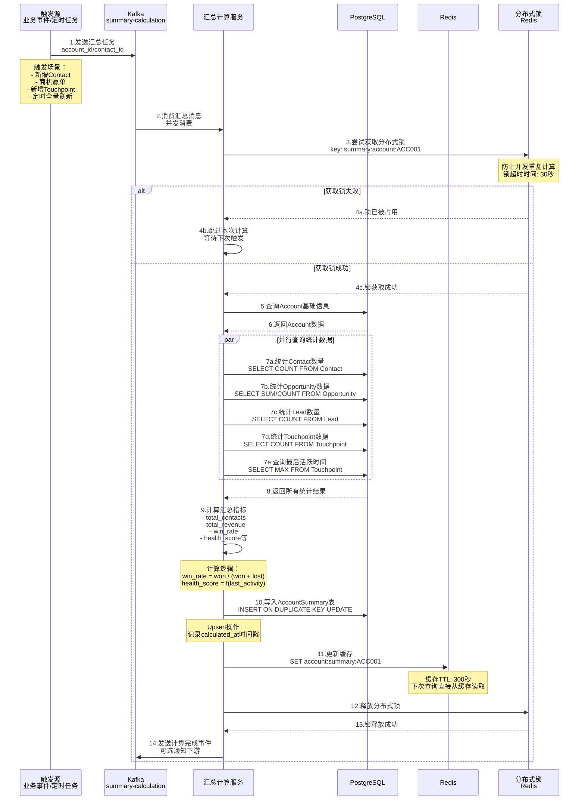
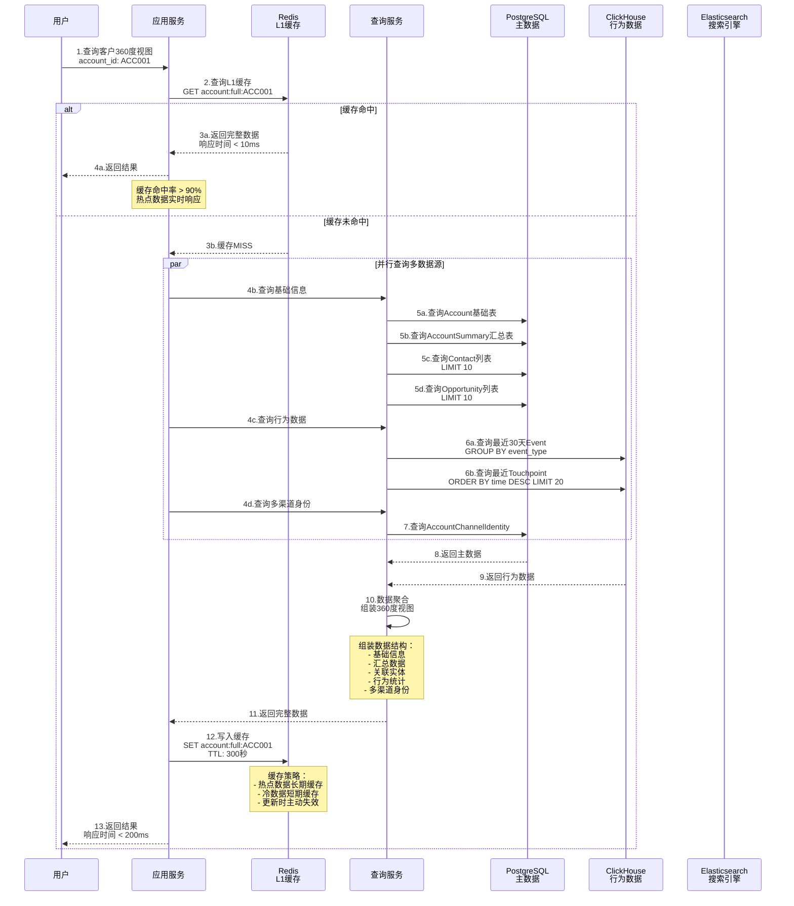
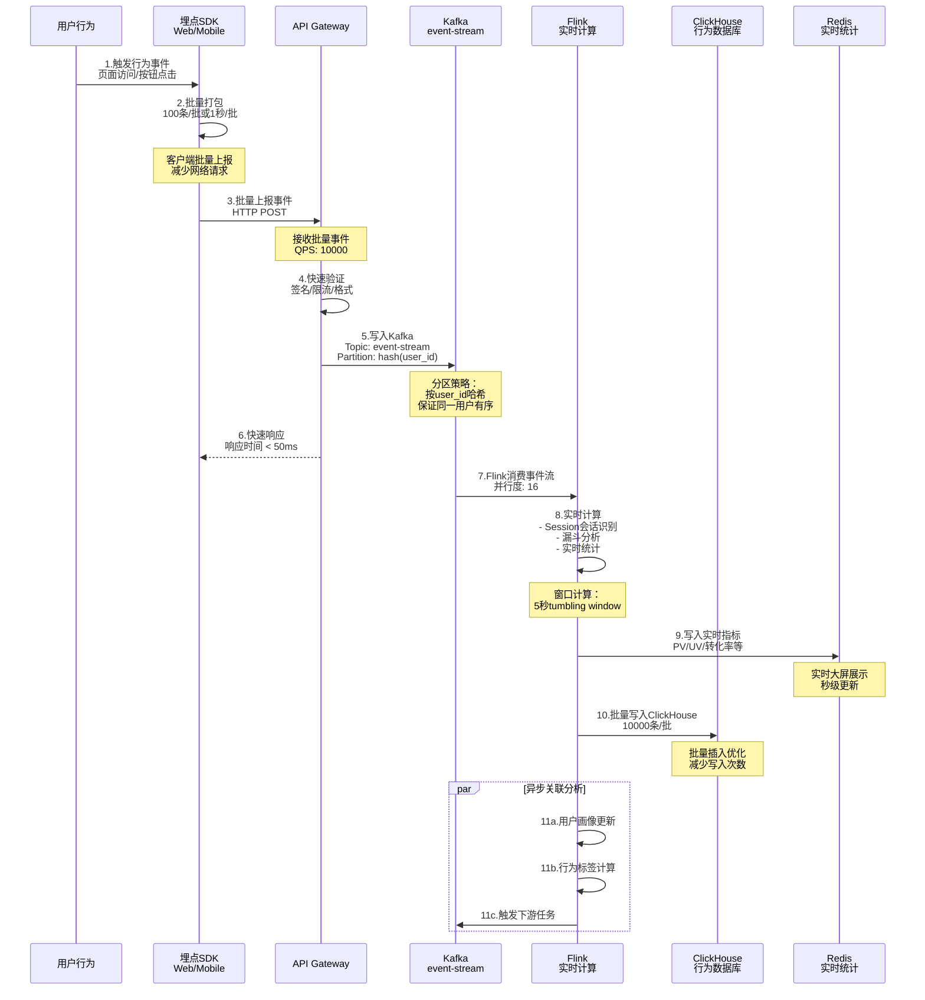
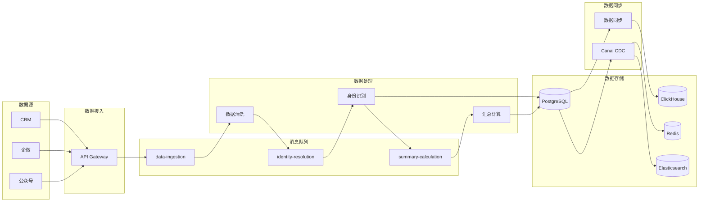
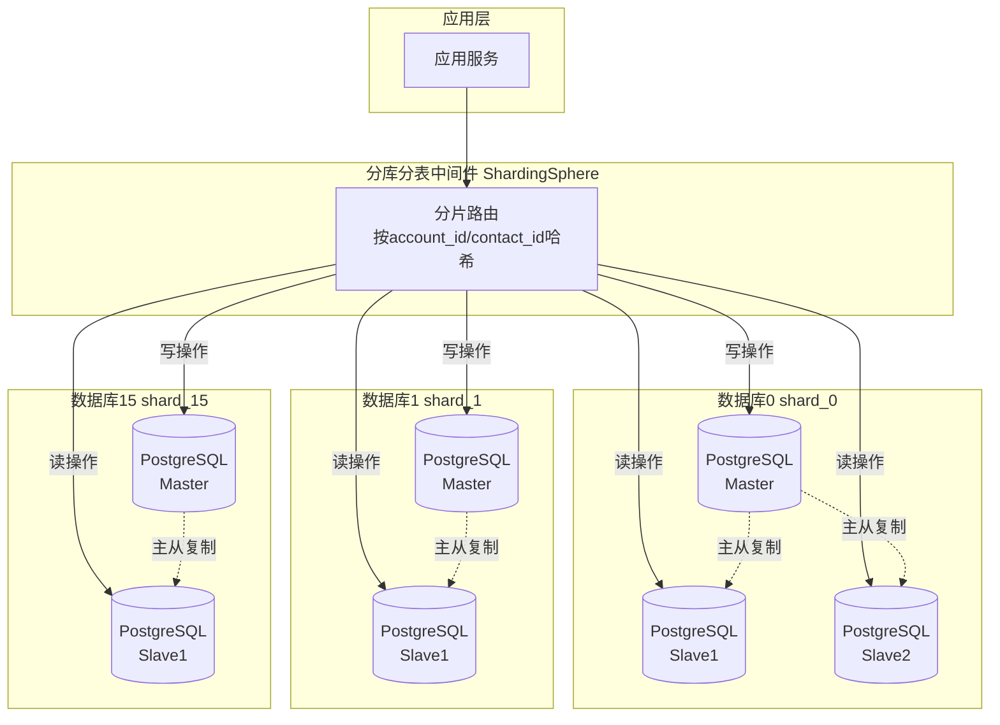

# B2B CDP 生产级系统架构设计

## 目录
- [系统整体架构](#系统整体架构)
- [核心实体设计](#核心实体设计)
- [关键时序流程](#关键时序流程)
- [数据流转架构](#数据流转架构)
- [技术实现方案](#技术实现方案)

---

## 系统整体架构

### 整体架构分层图



---

### 技术架构详图



---

## 核心实体设计

### Account实体ER图（完整版）

```mermaid
erDiagram
    Account ||--|| AccountSummary : aggregates
    Account ||--o{ AccountChannelIdentity : has
    Account ||--o{ Contact : owns
    Account ||--o{ Opportunity : has
    
    Account {
        varchar account_id PK "分片键"
        varchar account_name "企业名称"
        varchar unified_social_credit_code UK "信用代码"
        varchar account_type "类型"
        varchar account_status "状态"
        int shard_id "分片ID"
        datetime created_at "创建时间"
        datetime updated_at "更新时间"
    }
    
    AccountSummary {
        varchar summary_id PK
        varchar account_id FK UK "关联账户"
        int total_contacts "联系人数"
        int total_opportunities "商机数"
        decimal total_revenue "累计收入"
        int health_score "健康度"
        datetime calculated_at "计算时间"
    }
    
    AccountChannelIdentity {
        varchar identity_id PK
        varchar account_id FK "关联账户"
        varchar channel_id FK "渠道"
        varchar channel_account_id "渠道ID"
        boolean is_verified "已验证"
        datetime first_seen_at "首次发现"
        datetime last_seen_at "最后活跃"
    }
    
    Contact {
        varchar contact_id PK "分片键"
        varchar contact_name "姓名"
        varchar mobile_phone UK "手机号"
        varchar email UK "邮箱"
        varchar primary_account_id FK "主账户"
        int shard_id "分片ID"
        datetime created_at "创建时间"
    }
    
    Opportunity {
        varchar opportunity_id PK
        varchar account_id FK "关联账户"
        decimal amount "金额"
        varchar stage "阶段"
        boolean is_won "已赢单"
        datetime created_at "创建时间"
    }
```

---

### Contact实体ER图（完整版）

```mermaid
erDiagram
    Contact ||--|| ContactSummary : aggregates
    Contact ||--o{ ContactChannelIdentity : has
    Contact ||--o{ AccountContactRelation : belongs_to
    Contact ||--o{ Touchpoint : receives
    
    Contact {
        varchar contact_id PK "分片键"
        varchar contact_name "姓名"
        varchar mobile_phone UK "手机号"
        varchar email UK "邮箱"
        varchar wechat_id "微信ID"
        varchar primary_account_id FK "主账户"
        int shard_id "分片ID-hash(mobile_phone)"
        datetime created_at "创建时间"
    }
    
    ContactSummary {
        varchar summary_id PK
        varchar contact_id FK UK "关联联系人"
        int total_touchpoints "触点数"
        int email_opens "邮件打开"
        int engagement_score "参与度"
        datetime last_activity_at "最后活跃"
        datetime calculated_at "计算时间"
    }
    
    ContactChannelIdentity {
        varchar identity_id PK
        varchar contact_id FK "关联联系人"
        varchar channel_id FK "渠道"
        varchar channel_user_id "渠道用户ID"
        varchar identity_type "身份类型"
        boolean is_verified "已验证"
        datetime first_seen_at "首次发现"
    }
    
    AccountContactRelation {
        varchar relation_id PK
        varchar account_id FK "企业"
        varchar contact_id FK "联系人"
        varchar role_in_account "角色"
        varchar decision_level "决策级别"
        boolean is_primary_contact "主联系人"
    }
    
    Touchpoint {
        varchar touchpoint_id PK
        varchar contact_id FK "联系人"
        varchar channel_id FK "渠道"
        datetime touchpoint_time "触点时间"
        varchar touchpoint_type "类型"
    }
```

---

### Lead实体ER图（完整版）

```mermaid
erDiagram
    Lead ||--|| LeadSummary : aggregates
    Lead ||--o{ LeadChannelIdentity : has
    Lead ||--o| Contact : converts_to
    Lead ||--o| Opportunity : converts_to
    
    Lead {
        varchar lead_id PK "分片键"
        varchar lead_name "姓名"
        varchar company_name "公司"
        varchar mobile_phone "手机号"
        varchar email "邮箱"
        varchar channel_id FK "来源渠道"
        varchar campaign_id FK "来源活动"
        varchar lead_status "状态"
        int lead_score "评分"
        varchar lead_grade "等级"
        int shard_id "分片ID"
        datetime created_at "创建时间"
        datetime converted_at "转化时间"
        varchar converted_contact_id FK "转化联系人"
    }
    
    LeadSummary {
        varchar summary_id PK
        varchar lead_id FK UK "关联线索"
        int total_touchpoints "触点数"
        int total_events "事件数"
        int form_submissions "表单提交"
        int days_in_pipeline "管道天数"
        datetime last_activity_at "最后活跃"
        datetime calculated_at "计算时间"
    }
    
    LeadChannelIdentity {
        varchar identity_id PK
        varchar lead_id FK "关联线索"
        varchar channel_id FK "渠道"
        varchar channel_user_id "渠道用户ID"
        datetime captured_at "捕获时间"
        varchar utm_source "UTM来源"
        varchar utm_campaign "UTM活动"
    }
```

---

## 关键时序流程

### 1. 多渠道数据采集与身份识别流程



**关键设计说明：**

1. **同步响应快速返回**：API Gateway在写入Kafka后立即返回，响应时间 < 100ms
2. **异步处理解耦**：身份识别、汇总计算都是异步处理，互不影响
3. **消息队列削峰**：Kafka缓冲高峰流量，保护下游服务
4. **多级缓存**：Redis缓存热点数据，减少数据库压力
5. **最终一致性**：汇总数据允许30秒内延迟，保证高可用

---

### 2. Lead转化为Contact/Opportunity流程



**关键设计说明：**

1. **事务保证一致性**：Lead转化涉及多表操作，使用数据库事务保证原子性
2. **幂等性设计**：检查Lead状态，防止重复转化
3. **异步汇总计算**：转化完成后，异步触发汇总重算，不阻塞主流程
4. **通知解耦**：通过消息队列发送通知，失败可重试

---

### 3. 实时汇总数据计算流程



**关键设计说明：**

1. **分布式锁防重**：使用Redis分布式锁，防止同一Account并发重复计算
2. **并行查询优化**：统计数据可以并行查询，提升性能
3. **Upsert操作**：使用`INSERT ON DUPLICATE KEY UPDATE`，支持增量更新
4. **缓存策略**：计算完成后立即更新缓存，保证数据新鲜度
5. **异步非阻塞**：整个计算过程异步进行，不影响主业务

---

### 4. 客户360度查询流程（高性能）



**关键设计说明：**

1. **多级缓存**：Redis L1缓存 + 应用内存缓存（可选），缓存命中率 > 90%
2. **并行查询**：同时查询PostgreSQL、ClickHouse、ES，减少总响应时间
3. **查询优化**：
   - Contact/Opportunity只查前10条，避免大结果集
   - ClickHouse查询带时间范围，利用分区裁剪
4. **缓存失效策略**：
   - 写操作主动失效缓存（Cache Aside模式）
   - 设置合理的TTL（5分钟）
5. **降级策略**：
   - Redis宕机 → 直接查数据库
   - ClickHouse超时 → 降级返回部分数据

---

### 5. Event事件采集流程（高吞吐）



**关键设计说明：**

1. **客户端批量上报**：SDK端批量打包，减少HTTP请求数
2. **API快速响应**：写入Kafka后立即返回，响应时间 < 50ms
3. **Kafka分区策略**：按user_id哈希分区，保证同一用户事件有序
4. **Flink实时计算**：
   - Session会话识别
   - 滑动窗口统计
   - 实时漏斗分析
5. **批量写入ClickHouse**：累积10000条或10秒批量插入，优化写入性能

---

## 数据流转架构

### 数据同步与流转总览



---

### PostgreSQL分库分表策略



**分片策略：**

```sql
-- Account表分片键：account_id
-- 分片规则：hash(account_id) % 16
-- 分片数：16个库

-- Contact表分片键：contact_id（由mobile_phone生成）
-- 分片规则：hash(mobile_phone) % 16
-- 保证同一手机号的Contact在同一分片

-- 关联查询优化：
-- AccountContactRelation表按account_id分片
-- 保证Account与其Contact在同一分片，避免跨库JOIN
```

---

## 技术实现方案

### 1. 身份识别引擎实现

**身份匹配规则（优先级从高到低）：**

```python
class IdentityResolutionEngine:
    """身份识别引擎"""
    
    def resolve_account(self, data: dict) -> str:
        """Account身份识别"""
        # 1. 优先级1：统一社会信用代码精确匹配
        if data.get('unified_social_credit_code'):
            account = self.find_by_credit_code(data['unified_social_credit_code'])
            if account:
                return account.account_id
        
        # 2. 优先级2：企业全称精确匹配
        if data.get('account_name'):
            account = self.find_by_exact_name(data['account_name'])
            if account:
                return account.account_id
        
        # 3. 优先级3：企业简称+城市模糊匹配
        if data.get('account_name') and data.get('city'):
            candidates = self.fuzzy_match_by_name_and_city(
                data['account_name'], 
                data['city']
            )
            if len(candidates) == 1:
                return candidates[0].account_id
            elif len(candidates) > 1:
                # 多个匹配，进入人工审核
                self.send_to_manual_review(data, candidates)
                return None
        
        # 4. 未找到匹配，创建新Account
        return self.create_new_account(data)
    
    def resolve_contact(self, data: dict) -> str:
        """Contact身份识别"""
        # 1. 优先级1：手机号精确匹配
        if data.get('mobile_phone'):
            contact = self.find_by_phone(data['mobile_phone'])
            if contact:
                return contact.contact_id
        
        # 2. 优先级2：邮箱精确匹配
        if data.get('email'):
            contact = self.find_by_email(data['email'])
            if contact:
                return contact.contact_id
        
        # 3. 优先级3：企业微信UserID
        if data.get('wework_user_id'):
            contact = self.find_by_wework_id(data['wework_user_id'])
            if contact:
                return contact.contact_id
        
        # 4. 未找到匹配，创建新Contact
        return self.create_new_contact(data)
```

---

### 2. 汇总计算优化方案

**增量计算 vs 全量计算：**

```python
class SummaryCalculationService:
    """汇总计算服务"""
    
    def calculate_account_summary(self, account_id: str, mode: str = 'incremental'):
        """计算Account汇总数据"""
        if mode == 'incremental':
            # 增量计算：只计算变化的部分
            return self._incremental_calculate(account_id)
        else:
            # 全量计算：重新统计所有数据
            return self._full_calculate(account_id)
    
    def _incremental_calculate(self, account_id: str):
        """增量计算（推荐）"""
        # 1. 获取上次计算结果
        last_summary = self.get_last_summary(account_id)
        
        # 2. 只统计增量数据（自上次计算后的新增数据）
        last_calc_time = last_summary.calculated_at
        
        # 3. 统计增量
        new_contacts = self.count_new_contacts(account_id, since=last_calc_time)
        new_opportunities = self.count_new_opportunities(account_id, since=last_calc_time)
        new_revenue = self.sum_new_revenue(account_id, since=last_calc_time)
        
        # 4. 累加到原有数据
        new_summary = AccountSummary(
            account_id=account_id,
            total_contacts=last_summary.total_contacts + new_contacts,
            total_opportunities=last_summary.total_opportunities + new_opportunities,
            total_revenue=last_summary.total_revenue + new_revenue,
            # ... 其他字段
            calculated_at=datetime.now()
        )
        
        return new_summary
    
    def _full_calculate(self, account_id: str):
        """全量计算（定时任务使用）"""
        # 重新统计所有数据
        return self._calculate_from_scratch(account_id)
```

---

### 3. 缓存策略实现

**多级缓存架构：**

```python
class CacheManager:
    """缓存管理器"""
    
    def get_account_full(self, account_id: str) -> dict:
        """获取Account完整数据（多级缓存）"""
        # L1: 本地内存缓存（可选，使用LRU）
        # data = self.local_cache.get(f'account:{account_id}')
        # if data:
        #     return data
        
        # L2: Redis缓存
        cache_key = f'account:full:{account_id}'
        cached = self.redis.get(cache_key)
        if cached:
            return json.loads(cached)
        
        # L3: 数据库查询
        account = self.db.query_account_with_summary(account_id)
        
        # 写入缓存
        self.redis.setex(
            cache_key, 
            300,  # TTL: 5分钟
            json.dumps(account)
        )
        
        return account
    
    def invalidate_account_cache(self, account_id: str):
        """使Account缓存失效"""
        # 删除所有相关缓存
        self.redis.delete(f'account:full:{account_id}')
        self.redis.delete(f'account:basic:{account_id}')
        self.redis.delete(f'account:summary:{account_id}')
```

**缓存更新策略（Cache Aside模式）：**

```python
# 写操作：先更新数据库，再删除缓存
def update_account(account_id: str, data: dict):
    # 1. 更新数据库
    db.update(account_id, data)
    
    # 2. 删除缓存（让下次读取时重新加载）
    cache.delete(f'account:full:{account_id}')

# 读操作：先查缓存，缓存miss则查数据库并写缓存
def get_account(account_id: str):
    # 1. 查缓存
    data = cache.get(f'account:full:{account_id}')
    if data:
        return data
    
    # 2. 查数据库
    data = db.query(account_id)
    
    # 3. 写缓存
    cache.set(f'account:full:{account_id}', data, ttl=300)
    
    return data
```

---

### 4. 消息队列Topic设计

```yaml
Kafka Topic设计:

1. data-ingestion (数据采集)
   - Partition: 16个分区
   - Replication: 3副本
   - Retention: 7天
   - 用途: 接收所有渠道的原始数据
   
2. identity-resolution (身份识别)
   - Partition: 16个分区
   - Replication: 3副本
   - Retention: 3天
   - 用途: 身份识别任务队列
   
3. summary-calculation (汇总计算)
   - Partition: 16个分区
   - Replication: 3副本
   - Retention: 3天
   - 用途: 汇总计算任务队列
   
4. notification (通知事件)
   - Partition: 8个分区
   - Replication: 3副本
   - Retention: 7天
   - 用途: 通知任务（邮件、短信、企微）
   
5. event-stream (事件流)
   - Partition: 32个分区
   - Replication: 3副本
   - Retention: 30天
   - 用途: 用户行为事件流（高吞吐）
```

---

### 5. 监控与告警

**核心监控指标：**

```yaml
业务指标:
  - 数据采集QPS
  - 身份识别成功率
  - 汇总计算延迟
  - 查询P99响应时间
  - 缓存命中率

技术指标:
  - Kafka消息积压
  - PostgreSQL慢查询
  - Redis内存使用率
  - ClickHouse查询延迟
  - 服务健康检查

告警规则:
  - Kafka消息积压 > 100万 → P1告警
  - 数据采集失败率 > 1% → P2告警
  - 汇总计算延迟 > 5分钟 → P2告警
  - 查询P99 > 1秒 → P3告警
  - 服务不可用 → P0告警
```

---

## 总结

### 核心技术特点

1. **高可用架构**
   - PostgreSQL主从复制 + 读写分离
   - Redis Cluster 3主3从
   - ClickHouse 3副本
   - Kafka 3 broker集群

2. **高性能设计**
   - PostgreSQL分库分表（16分片）
   - 多级缓存（Redis + 本地）
   - 异步处理（Kafka解耦）
   - 批量写入优化

3. **实时性保障**
   - 数据采集响应 < 100ms
   - 身份识别延迟 < 5秒
   - 汇总计算延迟 < 30秒
   - 查询P99 < 200ms

4. **数据一致性**
   - 事务保证原子性
   - 消息队列保证可靠性
   - 分布式锁防重复
   - 最终一致性设计

5. **扩展性**
   - 水平扩展（加节点）
   - 垂直扩展（加资源）
   - 服务解耦（微服务）
   - 存储分离（冷热分离）

### 容量评估

```
数据规模：
- Account: 1000万
- Contact: 5000万
- Lead: 2000万/年
- Event: 10亿/年
- Touchpoint: 5000万/年

存储容量：
- PostgreSQL: 2TB (SSD)
- ClickHouse: 10TB (SSD)
- Redis: 256GB (内存)

服务器配置：
- 应用服务器: 8核16G * 5台
- PostgreSQL: 16核64G * 16台（主） + 32台（从）
- ClickHouse: 32核128G * 3台
- Redis: 16核64G * 6台
- Kafka: 16核32G * 3台
```

### 后续优化方向

1. **短期优化（3个月内）**
   - 完善监控告警
   - 优化慢查询
   - 调整缓存策略
   - 压测验证性能

2. **中期优化（6个月内）**
   - 引入本地缓存（Caffeine）
   - 实现数据归档
   - 优化分库分表策略
   - 引入ES辅助查询

3. **长期优化（1年内）**
   - 冷热数据分离
   - 引入数据湖
   - AI/ML模型集成
   - 实时OLAP分析
