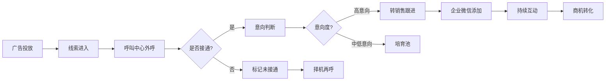
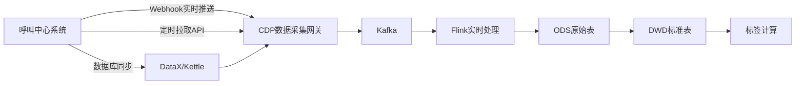
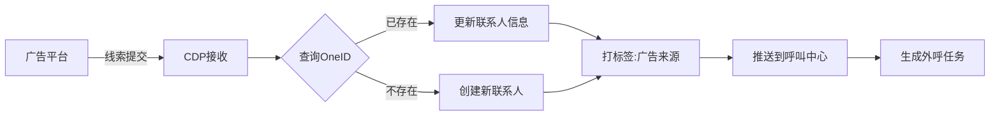

# 呼叫中心+金融行业CDP实施方案

## 目录
- [一、业务场景分析](#一业务场景分析)
- [二、数据源对接方案](#二数据源对接方案)
- [三、实施路线图](#三实施路线图)
- [四、Quick Start方案](#四quick-start方案)

---

## 一、业务场景分析

### 1.1 典型业务流程



### 1.2 核心痛点

| 痛点 | 说明 | CDP解决方案 |
|-----|------|-----------|
| **线索重复** | 同一客户从多个渠道进来 | OneID去重 |
| **信息孤岛** | 呼叫中心和企微数据不通 | 统一客户视图 |
| **外呼盲目** | 不知道客户最佳接听时段 | 通话行为分析标签 |
| **跟进混乱** | 不知道客户企业的组织架构 | 组织关系图谱 |
| **价值不明** | 不知道哪些客户价值高 | 客户价值评分标签 |

---

## 二、数据源对接方案

### 2.1 呼叫中心系统对接

#### 2.1.1 常见呼叫中心系统

| 系统名称 | 对接方式 | 数据获取 |
|---------|---------|---------|
| 云呼叫中心(阿里云/腾讯云) | API对接 | 实时webhook + 定时拉取 |
| Avaya | 数据库同步 | 读取MySQL/Oracle |
| Genesys | API对接 | REST API |
| 自建系统 | 数据库同步或API | 需定制开发 |

#### 2.1.2 呼叫中心数据采集架构



#### 2.1.3 对接数据清单

**必须采集的数据**：
- ✅ 通话记录(call_record)
- ✅ 客户信息(customer)
- ✅ 坐席信息(agent)
- ✅ 通话录音URL(可选)

**数据采集频率**：
- 🔄 实时推送：通话结束后立即推送
- 🔄 定时同步：每小时增量同步一次
- 🔄 全量同步：每天凌晨全量同步一次(补数)

### 2.2 企业微信对接

#### 2.2.1 需要的API权限

| API类别 | 具体接口 | 用途 |
|--------|---------|------|
| 通讯录管理 | 获取部门列表、成员列表 | 同步销售团队信息 |
| 客户联系 | 获取客户列表、客户详情 | 同步外部联系人 |
| 客户联系 | 获取客户群列表 | 同步客户群信息 |
| 会话内容存档 | 获取会话内容(需单独申请) | 采集聊天记录 |
| 客户朋友圈 | 获取客户朋友圈互动 | 采集互动行为 |

#### 2.2.2 企业微信数据采集流程

```sql
-- Step 1: 采集外部联系人
-- API: GET https://qyapi.weixin.qq.com/cgi-bin/externalcontact/list
-- 写入 ods_wework_external_contact

-- Step 2: OneID匹配
-- 根据手机号/unionid匹配或创建CDP ID

-- Step 3: 绑定到企业
-- 根据企业名称匹配或创建account_id

-- Step 4: 采集聊天记录
-- API: 会话内容存档接口
-- 写入 ods_wework_chat_event

-- Step 5: 转换为标准事件
-- 从ods层转换到dwd_contact_event
```

### 2.3 广告平台对接

#### 2.3.1 广告平台API对接

| 平台 | API文档 | 主要数据 |
|-----|---------|---------|
| 腾讯广告 | marketing.qq.com | 投放数据、线索数据 |
| 百度推广 | dev.baidu.com | 关键词数据、转化数据 |
| 巨量引擎(字节) | open.oceanengine.com | 创意数据、落地页数据 |

#### 2.3.2 广告线索处理流程



---

## 三、实施路线图

### 3.1 Phase 1: 基础MVP (2-3周)

**目标**：快速上线,打通呼叫中心→企微的数据流

#### Week 1-2: 数据采集

```yaml
任务:
  - 对接呼叫中心API,采集通话记录
  - 对接企业微信API,采集外部联系人
  - 建立ODS原始表
  - 实现定时同步任务

交付物:
  - ods_callcenter_call_record (通话记录表)
  - ods_wework_external_contact (企微联系人表)
  - 数据同步脚本

验收标准:
  - 每天能采集到前一天的通话记录
  - 每小时能同步企微联系人变更
```

#### Week 3: OneID + 标准化

```yaml
任务:
  - 实现OneID匹配逻辑(基于手机号)
  - 将ODS数据转换为DWD标准模型
  - 建立联系人主表和行为事件表

交付物:
  - dwd_contact (联系人主表)
  - dwd_contact_event (行为事件表)
  - dwd_id_mapping (ID映射表)
  - ETL数据转换脚本

验收标准:
  - 能将呼叫中心和企微的同一个人识别出来
  - 能看到联系人的通话记录和企微聊天记录
```

### 3.2 Phase 2: 标签体系 (2-3周)

#### Week 4: 基础标签

```yaml
实现标签:
  联系人标签:
    - 高接通率 (近30次外呼接通率>70%)
    - 通话时长长 (平均通话>5分钟)
    - 高意向客户 (意向度=高)
    - 近7天活跃 (近7天有互动)
    - 已添加企微 (企微状态=已添加)
  
  企业标签:
    - 金融行业
    - 高价值客户 (预估年度价值>10万)
    - 商机阶段 (线索/商机/成交)

交付物:
  - dwd_tag_config (标签配置表)
  - dwd_tag_result (标签结果表)
  - 标签计算脚本(SQL/Python)
```

#### Week 5-6: 标签管理平台

```yaml
功能:
  - 标签列表查看
  - 标签详情(覆盖人数、最近更新时间)
  - 手动刷新标签
  - 查看某个联系人的所有标签

技术实现:
  - 后端: Spring Boot
  - 前端: React + Ant Design
  - 数据库: MySQL
```

### 3.3 Phase 3: 圈人能力 (2周)

#### Week 7-8: 圈人功能

```yaml
实现场景:
  场景1: 基础圈人
    - 按标签圈人 (勾选标签即可)
    - 按属性圈人 (职位、行业等)
    - 圈人结果预览
    - 导出Excel

  场景2: 高级圈人
    - 企业维度过滤 (先选企业,再选人)
    - 多条件组合 (AND/OR逻辑)
    - 圈人结果推送到呼叫中心

交付物:
  - 圈人规则引擎
  - 圈人结果管理
  - 导出功能
  - 推送功能
```

### 3.4 Phase 4: 统一视图 (2周)

#### Week 9-10: 客户360视图

```yaml
功能模块:
  - 企业基本信息卡片
  - 企业标签展示
  - 关键联系人列表
  - 联系人标签展示
  - 近期互动时间轴
  - 组织架构图(简版)

页面结构:
  /customer/360/:accountId
    ├─ 企业信息区
    ├─ 联系人列表区
    ├─ 互动记录区
    └─ 商机信息区
```

---

## 四、Quick Start方案

### 4.1 30分钟快速演示方案

如果你需要快速验证可行性,可以用这个最小化方案:

#### Step 1: 准备测试数据 (5分钟)

```sql
-- 创建简化的测试表
CREATE TABLE test_contact (
    cdp_id VARCHAR(64) PRIMARY KEY,
    name VARCHAR(128),
    mobile VARCHAR(32),
    company VARCHAR(256),
    job_title VARCHAR(128),
    source VARCHAR(32)
);

-- 插入测试数据
INSERT INTO test_contact VALUES
('CDP_001', '张三', '13800138001', 'XX金融公司', 'CFO', 'CALLCENTER'),
('CDP_001', '张三', '13800138001', 'XX金融公司', 'CFO', 'WEWORK'),  -- 同一个人
('CDP_002', '李四', '13800138002', 'XX金融公司', '财务经理', 'CALLCENTER');

-- OneID去重查询
SELECT 
    mobile,
    name,
    company,
    GROUP_CONCAT(source) AS sources,
    COUNT(DISTINCT source) AS source_count
FROM test_contact
GROUP BY mobile, name, company
HAVING COUNT(DISTINCT source) > 1;  -- 找到多源数据的同一个人
```

#### Step 2: 模拟标签计算 (10分钟)

```sql
-- 创建标签表
CREATE TABLE test_tag (
    cdp_id VARCHAR(64),
    tag_name VARCHAR(128),
    tag_value VARCHAR(128),
    PRIMARY KEY (cdp_id, tag_name)
);

-- 模拟打标签
INSERT INTO test_tag VALUES
('CDP_001', '高接通率', 'true'),
('CDP_001', '高意向', 'true'),
('CDP_001', 'CXO级别', 'true'),
('CDP_002', '中意向', 'true');

-- 圈人查询: 找到"高接通率"且"高意向"的CXO
SELECT 
    c.cdp_id,
    c.name,
    c.mobile,
    c.company,
    c.job_title,
    GROUP_CONCAT(t.tag_name) AS tags
FROM test_contact c
INNER JOIN test_tag t ON c.cdp_id = t.cdp_id
WHERE t.tag_name IN ('高接通率', '高意向', 'CXO级别')
GROUP BY c.cdp_id
HAVING COUNT(DISTINCT t.tag_name) = 3;  -- 3个标签都满足
```

#### Step 3: 模拟360视图 (15分钟)

```sql
-- 创建互动记录表
CREATE TABLE test_event (
    event_id VARCHAR(64) PRIMARY KEY,
    cdp_id VARCHAR(64),
    event_type VARCHAR(32),
    event_time DATETIME,
    event_desc VARCHAR(256)
);

-- 插入测试数据
INSERT INTO test_event VALUES
('E001', 'CDP_001', 'call', '2024-10-29 10:30:00', '外呼接通,通话15分钟'),
('E002', 'CDP_001', 'wework_chat', '2024-10-29 14:20:00', '企微咨询产品价格'),
('E003', 'CDP_001', 'call', '2024-10-28 16:00:00', '外呼接通,预约下周拜访');

-- 查询360视图
SELECT 
    -- 联系人信息
    c.cdp_id,
    c.name,
    c.mobile,
    c.company,
    c.job_title,
    
    -- 标签
    (SELECT GROUP_CONCAT(tag_name) FROM test_tag WHERE cdp_id = c.cdp_id) AS tags,
    
    -- 近期互动
    (SELECT COUNT(*) FROM test_event WHERE cdp_id = c.cdp_id 
     AND event_time >= DATE_SUB(NOW(), INTERVAL 7 DAY)) AS interaction_l7d,
    
    -- 最近互动时间
    (SELECT MAX(event_time) FROM test_event WHERE cdp_id = c.cdp_id) AS last_interaction
FROM test_contact c
WHERE c.cdp_id = 'CDP_001'
LIMIT 1;
```

### 4.2 演示效果

运行上面的SQL后,你会得到:

```
CDP_001的360视图:
├─ 基本信息: 张三 | CFO | XX金融公司 | 138****8001
├─ 数据来源: 呼叫中心、企业微信 (已打通)
├─ 标签: 高接通率、高意向、CXO级别
├─ 近7天互动: 3次
├─ 最近互动: 2024-10-29 14:20:00 (企微咨询)
└─ 互动明细:
   • 2024-10-29 10:30 外呼接通,通话15分钟
   • 2024-10-29 14:20 企微咨询产品价格
   • 2024-10-28 16:00 外呼接通,预约下周拜访
```

---

## 五、关键技术决策

### 5.1 OneID匹配优先级(金融+呼叫中心场景)

```python
# OneID匹配优先级
MATCH_RULES = [
    {
        'priority': 1,
        'field': 'mobile',
        'weight': 1.0,
        'description': '手机号精确匹配(最高优先级)'
    },
    {
        'priority': 2,
        'field': 'email',
        'weight': 0.9,
        'description': '邮箱精确匹配'
    },
    {
        'priority': 3,
        'field': 'wework_unionid',
        'weight': 0.95,
        'description': '企微unionid匹配'
    },
    {
        'priority': 4,
        'field': 'name_company',
        'weight': 0.7,
        'description': '姓名+企业名称模糊匹配'
    }
]

# 匹配逻辑
def match_or_create_cdp_id(contact_data):
    # 1. 先用手机号查询
    if contact_data.get('mobile'):
        cdp_id = query_by_mobile(contact_data['mobile'])
        if cdp_id:
            return cdp_id, 'MOBILE', 1.0
    
    # 2. 再用邮箱查询
    if contact_data.get('email'):
        cdp_id = query_by_email(contact_data['email'])
        if cdp_id:
            return cdp_id, 'EMAIL', 0.9
    
    # 3. 再用unionid查询
    if contact_data.get('unionid'):
        cdp_id = query_by_unionid(contact_data['unionid'])
        if cdp_id:
            return cdp_id, 'UNIONID', 0.95
    
    # 4. 都没匹配到,创建新CDP ID
    new_cdp_id = generate_cdp_id()
    return new_cdp_id, 'NEW', 1.0
```

### 5.2 数据同步频率建议

| 数据类型 | 实时性要求 | 同步频率 | 同步方式 |
|---------|----------|---------|---------|
| 通话记录 | 高 | 准实时(5分钟) | Webhook推送 + 补偿拉取 |
| 企微聊天 | 高 | 准实时(10分钟) | 订阅事件 + 定时拉取 |
| 外部联系人 | 中 | 每小时 | 增量同步 |
| 广告线索 | 高 | 准实时(5分钟) | API拉取 |
| 标签计算 | 低 | 每天凌晨 | 定时任务 |

### 5.3 性能优化建议

#### 5.3.1 数据库设计

```sql
-- 重要索引
ALTER TABLE dwd_contact 
ADD INDEX idx_mobile_hash (mobile_hash),
ADD INDEX idx_account_id (account_id),
ADD INDEX idx_update_time (update_time);

ALTER TABLE dwd_contact_event
ADD INDEX idx_cdp_date (cdp_id, event_date),
ADD INDEX idx_event_type_date (event_type, event_date);

-- 分区表(事件表按月分区)
ALTER TABLE dwd_contact_event 
PARTITION BY RANGE (TO_DAYS(event_date)) (
    PARTITION p_202410 VALUES LESS THAN (TO_DAYS('2024-11-01')),
    PARTITION p_202411 VALUES LESS THAN (TO_DAYS('2024-12-01')),
    PARTITION p_202412 VALUES LESS THAN (TO_DAYS('2025-01-01')),
    PARTITION p_future VALUES LESS THAN MAXVALUE
);
```

#### 5.3.2 Redis缓存策略

```python
# 缓存联系人基本信息(TTL 1小时)
CACHE_KEY_CONTACT = "cdp:contact:{cdp_id}"
CACHE_TTL_CONTACT = 3600

# 缓存联系人标签(TTL 10分钟)
CACHE_KEY_TAGS = "cdp:tags:{cdp_id}"
CACHE_TTL_TAGS = 600

# 缓存客户360视图(TTL 5分钟)
CACHE_KEY_360 = "cdp:360:{account_id}"
CACHE_TTL_360 = 300

# 查询逻辑
def get_contact_info(cdp_id):
    # 1. 先查Redis
    cache_key = f"cdp:contact:{cdp_id}"
    cached_data = redis.get(cache_key)
    if cached_data:
        return json.loads(cached_data)
    
    # 2. 查数据库
    contact = db.query("SELECT * FROM dwd_contact WHERE cdp_id = %s", cdp_id)
    
    # 3. 写入Redis
    redis.setex(cache_key, CACHE_TTL_CONTACT, json.dumps(contact))
    
    return contact
```

---

## 六、常见问题FAQ

### Q1: 呼叫中心的通话记录没有企业名称,如何关联到企业?

**A**: 分步骤处理:

```sql
-- Step 1: 先根据手机号找到联系人
SELECT cdp_id, account_id 
FROM dwd_contact 
WHERE mobile_hash = SHA256('13800138001');

-- Step 2: 如果没找到,尝试根据客户名称模糊匹配
SELECT account_id 
FROM dwd_customer_account 
WHERE account_name LIKE '%客户名称%';

-- Step 3: 实在匹配不到,先创建"未分配"企业,后续人工分配
INSERT INTO dwd_customer_account (account_id, account_name, customer_type)
VALUES (generate_account_id(), '待确认-' + customer_name, 'LEAD');
```

### Q2: 一个手机号对应多个人怎么办?(例如公司前台电话)

**A**: 这是数据质量问题,需要特殊处理:

1. **检测**: 如果一个手机号对应多个不同姓名,标记为"共享号码"
2. **拆分**: 引入"座机"字段,区分手机号和座机
3. **优先级**: OneID匹配时,手机号+姓名一起匹配

```sql
-- 检测共享号码
SELECT mobile_hash, COUNT(DISTINCT contact_name) AS name_count
FROM dwd_contact
GROUP BY mobile_hash
HAVING COUNT(DISTINCT contact_name) > 1;

-- 标记为共享号码
UPDATE dwd_contact 
SET extra_attributes = JSON_SET(extra_attributes, '$.is_shared_mobile', true)
WHERE mobile_hash IN (共享号码列表);
```

### Q3: 企业微信和呼叫中心的联系人信息不一致怎么办?

**A**: 数据冲突处理策略:

| 字段 | 冲突处理策略 |
|-----|------------|
| 姓名 | 以最近更新的为准 |
| 职位 | 以企微为准(更新更及时) |
| 手机号 | 以呼叫中心为准(更准确) |
| 企业名称 | 人工审核后合并 |

```sql
-- 数据合并逻辑(以最近更新为准)
UPDATE dwd_contact c1
INNER JOIN (
    SELECT cdp_id, MAX(update_time) AS latest_time
    FROM dwd_id_mapping
    GROUP BY cdp_id
) latest ON c1.cdp_id = latest.cdp_id
SET c1.contact_name = (
    SELECT contact_name FROM dwd_id_mapping 
    WHERE cdp_id = c1.cdp_id 
    ORDER BY update_time DESC LIMIT 1
);
```

---

**文档版本**: v1.0  
**最后更新**: 2024-10-30  
**适用场景**: 呼叫中心+金融行业CDP实施
