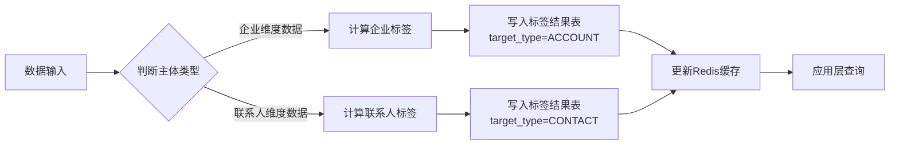

# CDP打标签与圈人实战指南

## 目录
- [一、标签体系设计](#一标签体系设计)
- [二、圈人场景与策略](#二圈人场景与策略)
- [三、统一视图设计](#三统一视图设计)
- [四、呼叫中心场景适配](#四呼叫中心场景适配)
- [五、金融行业扩展](#五金融行业扩展)

---

## 一、标签体系设计

### 1.1 标签体系的双层模型

在B2B场景下，标签体系必须是**双层结构**：

```
标签体系
├─ 企业标签(Account Tag)
│   ├─ 作用对象：客户企业
│   ├─ 存储位置：tag_result表(target_type=ACCOUNT)
│   └─ 使用场景：企业筛选、行业分析、客户分层
│
└─ 联系人标签(Contact Tag)
    ├─ 作用对象：联系人(决策人、影响者等)
    ├─ 存储位置：tag_result表(target_type=CONTACT)
    └─ 使用场景：精准触达、组织穿透、个性化沟通
```

### 1.2 标签结果表设计(统一存储)

```sql
CREATE TABLE dwd_tag_result (
    -- 主键
    result_id VARCHAR(64) PRIMARY KEY,
    
    -- 目标主体(核心字段)
    target_type VARCHAR(32) NOT NULL COMMENT '目标类型: ACCOUNT(企业)/CONTACT(联系人)',
    target_id VARCHAR(64) NOT NULL COMMENT '目标ID: account_id或cdp_id',
    
    -- 标签信息
    tag_id VARCHAR(64) NOT NULL COMMENT '标签ID',
    tag_name VARCHAR(128) NOT NULL COMMENT '标签名称',
    tag_category VARCHAR(64) COMMENT '标签分类',
    
    -- 标签值
    tag_value_type VARCHAR(32) COMMENT '值类型: BOOLEAN/STRING/NUMBER',
    tag_value TEXT COMMENT '标签值',
    
    -- 标签元数据
    tag_source VARCHAR(32) COMMENT '标签来源: RULE(规则)/MANUAL(人工)/ML(模型)',
    confidence DECIMAL(5,2) DEFAULT 1.00 COMMENT '置信度(0-1)',
    
    -- 有效期
    start_time DATETIME COMMENT '生效时间',
    end_time DATETIME COMMENT '失效时间(NULL表示永久有效)',
    is_valid TINYINT DEFAULT 1 COMMENT '是否有效',
    
    -- 审计
    created_by VARCHAR(64) COMMENT '创建人',
    create_time DATETIME DEFAULT CURRENT_TIMESTAMP,
    update_time DATETIME DEFAULT CURRENT_TIMESTAMP ON UPDATE CURRENT_TIMESTAMP,
    
    UNIQUE KEY uk_target_tag (target_type, target_id, tag_id),
    INDEX idx_target (target_type, target_id),
    INDEX idx_tag (tag_id),
    INDEX idx_category (tag_category)
) COMMENT='标签结果统一存储表';
```

### 1.3 金融行业标签体系示例

#### 1.3.1 企业标签(ACCOUNT)

| 标签类别 | 标签示例 | 业务价值 |
|---------|---------|---------|
| **基础属性** | 金融科技/传统银行/保险公司/证券公司 | 行业细分 |
| **规模特征** | 注册资本1亿+/员工500+ | 客户分层 |
| **业务阶段** | 潜在客户/试用客户/付费客户/流失客户 | 生命周期管理 |
| **意向度** | 高意向/中意向/低意向/无意向 | 销售优先级 |
| **产品偏好** | 关注合规产品/关注风控产品/关注贷款产品 | 精准推荐 |
| **活跃度** | 7天活跃/30天沉默/90天流失 | 客户激活 |
| **风险评估** | 低风险/中风险/高风险 | 金融合规 |
| **价值评估** | S级客户/A级客户/B级客户 | 资源分配 |

#### 1.3.2 联系人标签(CONTACT)

| 标签类别 | 标签示例 | 业务价值 |
|---------|---------|---------|
| **决策角色** | 决策者/影响者/使用者/把关者 | 组织穿透 |
| **职级标签** | CXO/VP/总监/经理/员工 | 触达优先级 |
| **部门标签** | 财务部/IT部/风控部/业务部 | 精准营销 |
| **活跃度** | 高频互动/正常互动/低频互动/沉默用户 | 客户关怀 |
| **兴趣偏好** | 关注产品功能/关注价格/关注案例/关注服务 | 个性化沟通 |
| **渠道偏好** | 企微活跃/电话活跃/邮件活跃 | 渠道选择 |
| **通话特征** | 通话时长长/接通率高/回拨率高 | 呼叫中心专用 |
| **关系强度** | 强关系/弱关系/未建联 | 关系维护 |

### 1.4 标签打标流程



**核心原则：数据属于谁，标签就打给谁**

---

## 二、圈人场景与策略

### 2.1 圈人的本质是"圈联系人"

在B2B场景下，**最终要触达的是"人"**，所以：

> **圈人 = 圈选符合条件的联系人(cdp_id列表)**

但是，你可以用**企业维度作为过滤条件**。

### 2.2 圈人条件的组合模式

#### 模式1：纯联系人维度圈人

**场景**：找到所有金融行业的CFO，推送新产品

```json
{
  "target_type": "CONTACT",
  "conditions": {
    "and": [
      {
        "field": "job_title",
        "operator": "CONTAINS",
        "value": "CFO"
      },
      {
        "field": "job_level",
        "operator": "IN",
        "value": ["CXO", "VP"]
      },
      {
        "tag": "近30天活跃",
        "value": true
      }
    ]
  }
}
```

**SQL实现**：

```sql
SELECT DISTINCT c.cdp_id, c.contact_name, c.job_title, c.account_id
FROM dwd_contact c
WHERE c.job_title LIKE '%CFO%'
  AND c.job_level IN ('CXO', 'VP')
  AND EXISTS (
    SELECT 1 FROM dwd_tag_result t
    WHERE t.target_type = 'CONTACT'
      AND t.target_id = c.cdp_id
      AND t.tag_name = '近30天活跃'
      AND t.is_valid = 1
  );
```

#### 模式2：企业维度过滤 + 联系人筛选

**场景**：找到所有"高意向"金融企业中的"决策者"联系人

```json
{
  "target_type": "CONTACT",
  "conditions": {
    "and": [
      {
        "account_filter": {
          "industry": "金融",
          "account_tag": "高意向客户"
        }
      },
      {
        "contact_filter": {
          "job_level": ["CXO", "VP", "DIRECTOR"],
          "contact_tag": "决策者"
        }
      }
    ]
  }
}
```

**SQL实现**：

```sql
-- Step 1: 先圈出符合条件的企业
WITH target_accounts AS (
    SELECT DISTINCT a.account_id
    FROM dwd_customer_account a
    WHERE a.industry = '金融'
      AND EXISTS (
        SELECT 1 FROM dwd_tag_result t
        WHERE t.target_type = 'ACCOUNT'
          AND t.target_id = a.account_id
          AND t.tag_name = '高意向客户'
          AND t.is_valid = 1
      )
)
-- Step 2: 再从这些企业中找符合条件的联系人
SELECT DISTINCT c.cdp_id, c.contact_name, c.job_title, c.account_id
FROM dwd_contact c
INNER JOIN target_accounts ta ON c.account_id = ta.account_id
WHERE c.job_level IN ('CXO', 'VP', 'DIRECTOR')
  AND EXISTS (
    SELECT 1 FROM dwd_tag_result t
    WHERE t.target_type = 'CONTACT'
      AND t.target_id = c.cdp_id
      AND t.tag_name = '决策者'
      AND t.is_valid = 1
  );
```

#### 模式3：组织关系圈人(企业级CDP的杀手锏)

**场景**：某金融企业已经触达了财务经理，现在要找到他的上级(CFO)

```json
{
  "target_type": "CONTACT",
  "conditions": {
    "account_id": "ACCT_000001",
    "org_relation": {
      "base_contact": "CDP_123456",
      "relation_type": "MANAGER",
      "relation_direction": "UP",
      "max_level": 2
    }
  }
}
```

**Neo4j查询**：

```cypher
// 向上查询2级上级
MATCH (c:Contact {cdp_id: 'CDP_123456'})-[:REPORT_TO*1..2]->(manager:Contact)
WHERE manager.account_id = 'ACCT_000001'
RETURN manager.cdp_id, manager.name, manager.job_title
```

### 2.3 圈人结果的应用

圈人的最终输出是**联系人列表**，可以：

1. **导出Excel**：给销售团队线下跟进
2. **推送企业微信**：批量发送消息
3. **呼叫中心外呼**：生成外呼任务列表
4. **广告投放**：上传到广告平台做Lookalike
5. **自动化流程**：触发自动化营销动作

---

## 三、统一视图设计

### 3.1 问题的本质

你担心"主体有多个不好做"，核心原因是：

> **存储层是分离的(企业表 + 联系人表)，但应用层需要统一视图**

### 3.2 解决方案：360度客户视图

在应用层(前端/API)提供**统一的360度视图**，把企业和联系人整合展示。

#### 3.2.1 客户360视图API设计

```json
// API: GET /api/v1/customer/360/{account_id}

{
  "account_info": {
    "account_id": "ACCT_000001",
    "account_name": "XX金融科技公司",
    "industry": "金融科技",
    "customer_type": "OPPORTUNITY",
    "customer_level": "A",
    "tags": [
      {"tag_name": "高意向客户", "tag_value": true},
      {"tag_name": "B轮融资", "tag_value": true},
      {"tag_name": "近30天活跃", "tag_value": true}
    ],
    "metrics": {
      "total_contacts": 5,
      "decision_maker_count": 2,
      "interaction_count_l30d": 28,
      "last_contact_date": "2024-10-29"
    }
  },
  "contacts": [
    {
      "cdp_id": "CDP_000001",
      "contact_name": "张三",
      "job_title": "CFO",
      "job_level": "CXO",
      "decision_role": "DECISION_MAKER",
      "mobile": "138****1234",
      "tags": [
        {"tag_name": "决策者", "tag_value": true},
        {"tag_name": "高频互动", "tag_value": true},
        {"tag_name": "关注产品功能", "tag_value": true}
      ],
      "recent_activities": [
        {
          "event_type": "wework_chat",
          "event_time": "2024-10-29 14:30:00",
          "event_desc": "咨询产品定价"
        },
        {
          "event_type": "call",
          "event_time": "2024-10-28 10:15:00",
          "event_desc": "电话沟通30分钟"
        }
      ]
    },
    {
      "cdp_id": "CDP_000002",
      "contact_name": "李四",
      "job_title": "财务经理",
      "job_level": "MANAGER",
      "decision_role": "USER",
      "report_to": {
        "cdp_id": "CDP_000001",
        "name": "张三"
      },
      "tags": [
        {"tag_name": "使用者", "tag_value": true},
        {"tag_name": "关注价格", "tag_value": true}
      ]
    }
  ],
  "org_chart": {
    "chart_data": "组织架构图数据(JSON格式)"
  },
  "opportunity": {
    "opportunity_count": 2,
    "total_amount": 500000,
    "latest_stage": "方案阶段"
  }
}
```

#### 3.2.2 前端展示结构

```
┌─────────────────────────────────────────────────────┐
│  XX金融科技公司 [A级客户] [高意向] [B轮]             │
│  行业: 金融科技 | 规模: 500-2000人 | 负责人: 王销售   │
├─────────────────────────────────────────────────────┤
│  [企业标签]                                          │
│  🏷️ 高意向客户  🏷️ B轮融资  🏷️ 近30天活跃          │
├─────────────────────────────────────────────────────┤
│  [关键联系人]                                        │
│  👤 张三 - CFO [决策者]                              │
│     📞 138****1234  💬 近7天互动5次                 │
│     🏷️ 高频互动  🏷️ 关注产品功能                    │
│                                                     │
│  👤 李四 - 财务经理 [使用者] (向张三汇报)            │
│     📞 139****5678  💬 近7天互动2次                 │
│     🏷️ 关注价格                                     │
├─────────────────────────────────────────────────────┤
│  [组织架构]                                          │
│  [查看组织架构图]                                    │
├─────────────────────────────────────────────────────┤
│  [近期互动]                                          │
│  • 2024-10-29 14:30 张三通过企微咨询产品定价         │
│  • 2024-10-28 10:15 与张三电话沟通30分钟            │
│  • 2024-10-27 16:20 李四浏览了产品方案页面          │
└─────────────────────────────────────────────────────┘
```

### 3.3 关键点总结

| 层面 | 如何处理 |
|-----|---------|
| **存储层** | 企业表和联系人表分离存储 |
| **标签层** | 标签结果表用target_type区分 |
| **查询层** | SQL关联查询或Redis缓存 |
| **应用层** | API整合返回统一视图 |
| **展示层** | 前端组件化展示，用户无感知 |

---

## 四、呼叫中心场景适配

### 4.1 呼叫中心特有Schema扩展

#### 4.1.1 通话记录表 (ods_callcenter_call_record)

```sql
CREATE TABLE ods_callcenter_call_record (
    -- 主键
    call_id VARCHAR(64) PRIMARY KEY COMMENT '通话ID',
    
    -- 通话基本信息
    call_type VARCHAR(32) COMMENT '通话类型: OUTBOUND(外呼)/INBOUND(呼入)/CALLBACK(回拨)',
    call_direction VARCHAR(16) COMMENT '呼叫方向: IN/OUT',
    call_time DATETIME NOT NULL COMMENT '通话时间',
    call_date DATE NOT NULL COMMENT '通话日期',
    
    -- 客户信息
    customer_mobile VARCHAR(32) COMMENT '客户手机号',
    customer_name VARCHAR(128) COMMENT '客户姓名',
    customer_company VARCHAR(256) COMMENT '客户企业',
    
    -- 坐席信息
    agent_id VARCHAR(64) COMMENT '坐席ID',
    agent_name VARCHAR(128) COMMENT '坐席姓名',
    agent_dept VARCHAR(128) COMMENT '坐席部门',
    
    -- 通话状态
    call_status VARCHAR(32) COMMENT '通话状态: CONNECTED(接通)/NO_ANSWER(未接)/BUSY(占线)/REJECTED(拒接)',
    ring_duration INT COMMENT '振铃时长(秒)',
    talk_duration INT COMMENT '通话时长(秒)',
    
    -- 通话内容
    call_subject VARCHAR(256) COMMENT '通话主题',
    call_summary TEXT COMMENT '通话小结',
    call_intention VARCHAR(32) COMMENT '客户意向: HIGH(高)/MEDIUM(中)/LOW(低)/NONE(无)',
    call_result VARCHAR(32) COMMENT '通话结果: 成功预约/需要跟进/暂无需求/拒绝',
    next_follow_time DATETIME COMMENT '下次跟进时间',
    
    -- 录音信息
    record_file_url VARCHAR(512) COMMENT '录音文件URL',
    record_duration INT COMMENT '录音时长(秒)',
    
    -- 质检信息
    quality_score DECIMAL(5,2) COMMENT '质检分数',
    quality_tags TEXT COMMENT '质检标签(JSON)',
    
    -- 原始数据
    raw_data TEXT COMMENT '原始JSON',
    
    -- 系统字段
    create_time DATETIME DEFAULT CURRENT_TIMESTAMP,
    
    INDEX idx_customer_mobile (customer_mobile, call_date),
    INDEX idx_agent (agent_id, call_date),
    INDEX idx_call_time (call_time),
    INDEX idx_status (call_status, call_date)
) COMMENT='呼叫中心通话记录表'
PARTITION BY RANGE (TO_DAYS(call_date)) (
    PARTITION p_202410 VALUES LESS THAN (TO_DAYS('2024-11-01')),
    PARTITION p_future VALUES LESS THAN MAXVALUE
);
```

#### 4.1.2 通话记录→行为事件映射

```sql
-- 将通话记录转换为标准的行为事件
INSERT INTO dwd_contact_event (
    event_id,
    event_type,
    event_time,
    event_date,
    cdp_id,
    account_id,
    channel,
    event_properties,
    source_type,
    source_id,
    create_time
)
SELECT
    call_id AS event_id,
    CASE 
        WHEN call_type = 'OUTBOUND' THEN 'call_outbound'
        WHEN call_type = 'INBOUND' THEN 'call_inbound'
        WHEN call_type = 'CALLBACK' THEN 'call_callback'
    END AS event_type,
    call_time AS event_time,
    call_date AS event_date,
    -- 根据手机号查询CDP ID
    (SELECT cdp_id FROM dwd_id_mapping 
     WHERE source_type='CALLCENTER' 
       AND match_field='MOBILE' 
       AND match_value_hash=SHA256(customer_mobile) 
     LIMIT 1) AS cdp_id,
    -- 根据企业名查询account_id
    (SELECT account_id FROM dwd_customer_account 
     WHERE account_name=customer_company 
     LIMIT 1) AS account_id,
    'PHONE' AS channel,
    -- 组装事件属性
    JSON_OBJECT(
        'call_type', call_type,
        'call_status', call_status,
        'talk_duration', talk_duration,
        'call_intention', call_intention,
        'call_result', call_result,
        'call_summary', call_summary,
        'agent_id', agent_id,
        'agent_name', agent_name
    ) AS event_properties,
    'CALLCENTER' AS source_type,
    call_id AS source_id,
    NOW() AS create_time
FROM ods_callcenter_call_record
WHERE call_date >= CURDATE() - INTERVAL 1 DAY
  AND call_status = 'CONNECTED'; -- 只转换接通的电话
```

### 4.2 呼叫中心专用标签

#### 4.2.1 联系人通话特征标签

| 标签名称 | 标签逻辑 | 业务价值 |
|---------|---------|---------|
| 高接通率 | 近30次外呼接通率>70% | 优先外呼 |
| 通话时长长 | 平均通话时长>5分钟 | 意向度高 |
| 高回拨率 | 主动回拨率>30% | 关系强 |
| 最佳接听时段 | 统计接通率最高的时段 | 精准触达 |
| 拒接用户 | 连续3次拒接 | 暂停外呼 |
| 空号/停机 | 呼叫状态为空号 | 清洗数据 |

**标签计算SQL示例**：

```sql
-- 高接通率标签
INSERT INTO dwd_tag_result (target_type, target_id, tag_id, tag_name, tag_value)
SELECT 
    'CONTACT' AS target_type,
    cdp_id AS target_id,
    'TAG_HIGH_ANSWER_RATE' AS tag_id,
    '高接通率' AS tag_name,
    'true' AS tag_value
FROM (
    SELECT 
        cdp_id,
        COUNT(*) AS total_calls,
        SUM(CASE WHEN call_status='CONNECTED' THEN 1 ELSE 0 END) AS connected_calls,
        SUM(CASE WHEN call_status='CONNECTED' THEN 1 ELSE 0 END) * 1.0 / COUNT(*) AS answer_rate
    FROM dwd_contact_event
    WHERE event_type LIKE 'call_%'
      AND event_date >= CURDATE() - INTERVAL 30 DAY
    GROUP BY cdp_id
    HAVING total_calls >= 10  -- 至少呼叫10次
) t
WHERE answer_rate > 0.7;
```

### 4.3 呼叫中心圈人场景

**场景1：找到"高意向+高接通率"的客户进行外呼**

```sql
SELECT 
    c.cdp_id,
    c.contact_name,
    c.mobile_encrypted,
    c.account_id,
    a.account_name,
    GROUP_CONCAT(t.tag_name) AS tags
FROM dwd_contact c
INNER JOIN dwd_customer_account a ON c.account_id = a.account_id
INNER JOIN dwd_tag_result t ON t.target_id = c.cdp_id AND t.target_type = 'CONTACT'
WHERE t.tag_name IN ('高意向', '高接通率')
  AND c.relationship_status = 'CONNECTED'
  AND c.is_deleted = 0
GROUP BY c.cdp_id
HAVING COUNT(DISTINCT t.tag_name) = 2; -- 两个标签都满足
```

**场景2：找到"已外呼但未接通"的客户，选择最佳时段回拨**

```sql
-- 统计每个联系人的最佳接听时段
WITH best_time AS (
    SELECT 
        cdp_id,
        HOUR(event_time) AS call_hour,
        COUNT(*) AS total_calls,
        SUM(CASE WHEN JSON_EXTRACT(event_properties, '$.call_status')='CONNECTED' 
            THEN 1 ELSE 0 END) AS connected_calls
    FROM dwd_contact_event
    WHERE event_type = 'call_outbound'
      AND event_date >= CURDATE() - INTERVAL 60 DAY
    GROUP BY cdp_id, HOUR(event_time)
)
SELECT 
    c.cdp_id,
    c.contact_name,
    c.mobile_encrypted,
    bt.call_hour AS best_hour,
    MAX(bt.connected_calls * 1.0 / bt.total_calls) AS best_answer_rate
FROM dwd_contact c
INNER JOIN best_time bt ON c.cdp_id = bt.cdp_id
WHERE EXISTS (
    -- 近7天有外呼但未接通
    SELECT 1 FROM dwd_contact_event e
    WHERE e.cdp_id = c.cdp_id
      AND e.event_type = 'call_outbound'
      AND e.event_date >= CURDATE() - INTERVAL 7 DAY
      AND JSON_EXTRACT(e.event_properties, '$.call_status') != 'CONNECTED'
)
GROUP BY c.cdp_id, bt.call_hour
ORDER BY best_answer_rate DESC;
```

---

## 五、金融行业扩展

### 5.1 金融行业特有字段

#### 5.1.1 客户企业表扩展(金融)

```sql
ALTER TABLE dwd_customer_account 
ADD COLUMN financial_license VARCHAR(128) COMMENT '金融牌照类型',
ADD COLUMN risk_level VARCHAR(32) COMMENT '风险等级: LOW/MEDIUM/HIGH',
ADD COLUMN kyc_status VARCHAR(32) COMMENT 'KYC状态: NOT_STARTED/IN_PROGRESS/PASSED/FAILED',
ADD COLUMN aml_status VARCHAR(32) COMMENT '反洗钱状态: PASS/RISK/BLOCK',
ADD COLUMN credit_rating VARCHAR(32) COMMENT '信用评级: AAA/AA/A/BBB/BB/B/CCC',
ADD COLUMN blacklist_status TINYINT DEFAULT 0 COMMENT '是否黑名单: 0=否/1=是';

-- 或者使用extra_attributes存储
UPDATE dwd_customer_account
SET extra_attributes = JSON_SET(
    COALESCE(extra_attributes, '{}'),
    '$.financial_info.license', '小贷牌照',
    '$.financial_info.risk_level', 'LOW',
    '$.financial_info.kyc_status', 'PASSED',
    '$.financial_info.credit_rating', 'AA'
)
WHERE account_id = 'ACCT_000001';
```

#### 5.1.2 联系人表扩展(金融)

```sql
ALTER TABLE dwd_contact
ADD COLUMN risk_preference VARCHAR(32) COMMENT '风险偏好: CONSERVATIVE/BALANCED/AGGRESSIVE',
ADD COLUMN investment_experience VARCHAR(32) COMMENT '投资经验: NOVICE/EXPERIENCED/PROFESSIONAL',
ADD COLUMN aum BIGINT COMMENT '资产管理规模(分)',
ADD COLUMN credit_score INT COMMENT '信用分数(0-1000)';
```

### 5.2 金融行业合规要求

#### 5.2.1 敏感字段访问控制

```sql
-- 创建敏感数据访问日志表
CREATE TABLE dwd_sensitive_data_access_log (
    log_id VARCHAR(64) PRIMARY KEY,
    user_id VARCHAR(64) NOT NULL COMMENT '访问用户ID',
    user_name VARCHAR(128) COMMENT '用户姓名',
    access_type VARCHAR(32) COMMENT '访问类型: VIEW/EXPORT/EDIT',
    target_type VARCHAR(32) COMMENT '目标类型: CONTACT/ACCOUNT',
    target_id VARCHAR(64) COMMENT '目标ID',
    sensitive_fields TEXT COMMENT '访问的敏感字段(JSON)',
    access_reason VARCHAR(256) COMMENT '访问原因',
    ip_address VARCHAR(64) COMMENT 'IP地址',
    access_time DATETIME DEFAULT CURRENT_TIMESTAMP COMMENT '访问时间',
    
    INDEX idx_user (user_id, access_time),
    INDEX idx_target (target_type, target_id, access_time)
) COMMENT='敏感数据访问日志';
```

#### 5.2.2 数据脱敏规则(金融)

| 字段类型 | 脱敏规则 | 示例 |
|---------|---------|------|
| 手机号 | 中间4位打码 | 138****1234 |
| 身份证 | 只保留前6后4位 | 110101********1234 |
| 银行卡号 | 只保留后4位 | **** **** **** 1234 |
| 姓名 | 姓氏保留+打码 | 张** |
| 金额 | 按角色显示 | 普通用户看不到 |

### 5.3 金融行业标签示例

```sql
-- 插入金融行业专用标签定义
INSERT INTO dwd_tag_config (tag_id, tag_name, tag_category, target_type, calculation_rule) 
VALUES 
-- 企业标签
('TAG_FIN_LICENSE', '持有金融牌照', '金融合规', 'ACCOUNT', 
 'SELECT account_id FROM dwd_customer_account WHERE financial_license IS NOT NULL'),
 
('TAG_HIGH_RISK', '高风险企业', '风险评估', 'ACCOUNT',
 'SELECT account_id FROM dwd_customer_account WHERE risk_level = "HIGH"'),
 
('TAG_KYC_PASSED', 'KYC已通过', '合规认证', 'ACCOUNT',
 'SELECT account_id FROM dwd_customer_account WHERE kyc_status = "PASSED"'),

-- 联系人标签
('TAG_HIGH_NET_WORTH', '高净值客户', '客户分层', 'CONTACT',
 'SELECT cdp_id FROM dwd_contact WHERE aum >= 100000000'), -- 1000万以上
 
('TAG_RISK_AVERSE', '风险厌恶型', '投资偏好', 'CONTACT',
 'SELECT cdp_id FROM dwd_contact WHERE risk_preference = "CONSERVATIVE"'),
 
('TAG_QUALIFIED_INVESTOR', '合格投资者', '合规认证', 'CONTACT',
 'SELECT cdp_id FROM dwd_contact WHERE credit_score >= 700 AND investment_experience != "NOVICE"');
```

---

## 六、总结与最佳实践

### 6.1 核心原则

| 原则 | 说明 |
|-----|------|
| **存储分离** | 企业和联系人分表存储 |
| **标签双层** | 标签体系分为企业标签和联系人标签 |
| **圈人统一** | 圈人的输出统一为联系人列表 |
| **视图整合** | 应用层提供360度统一视图 |
| **数据溯源** | 所有数据记录来源系统 |

### 6.2 常见误区

❌ **误区1**：把企业和联系人合并成一张表
- 问题：一个企业有多个联系人，数据冗余严重

❌ **误区2**：只给企业打标签，不给联系人打标签
- 问题：无法区分同一企业不同联系人的特征

❌ **误区3**：圈人时既圈企业又圈联系人，搞不清主体
- 问题：最终要触达的是"人"，所以圈人输出必须是联系人列表

### 6.3 实施建议

1. **Phase 1**: 先实现基础的企业和联系人管理
2. **Phase 2**: 建立OneID体系，打通多源数据
3. **Phase 3**: 建立标签体系(先企业标签，再联系人标签)
4. **Phase 4**: 实现圈人能力(先简单条件，再复杂组合)
5. **Phase 5**: 优化统一视图，提升用户体验

---

**文档版本**: v1.0  
**最后更新**: 2024-10-30  
**适用场景**: B2B企业级CDP(金融行业/呼叫中心)
