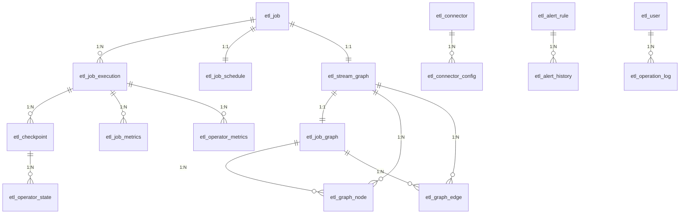

# 响应式ETL框架 - 数据库设计文档

## 1. 概述

本文档描述了响应式ETL框架的数据库表结构设计，涵盖任务管理、图结构、连接器配置、检查点、监控指标、系统配置等核心功能模块。

### 1.1 数据库选型

- **主数据库**: MySQL 8.0+
- **字符集**: utf8mb4
- **存储引擎**: InnoDB

### 1.2 表分类

```mermaid
graph TB
    DB[ETL Database]
    
    DB --> JOB[任务管理]
    DB --> GRAPH[图结构]
    DB --> CONN[连接器]
    DB --> CP[检查点]
    DB --> METRICS[监控指标]
    DB --> SYS[系统配置]
    DB --> USER[用户权限]
    
    JOB --> J1[etl_job]
    JOB --> J2[etl_job_execution]
    JOB --> J3[etl_job_schedule]
    
    GRAPH --> G1[etl_stream_graph]
    GRAPH --> G2[etl_job_graph]
    GRAPH --> G3[etl_graph_node]
    GRAPH --> G4[etl_graph_edge]
    
    CONN --> C1[etl_connector]
    CONN --> C2[etl_connector_config]
    
    CP --> CP1[etl_checkpoint]
    CP --> CP2[etl_operator_state]
    
    METRICS --> M1[etl_job_metrics]
    METRICS --> M2[etl_operator_metrics]
    
    SYS --> S1[etl_system_config]
    SYS --> S2[etl_alert_rule]
    SYS --> S3[etl_alert_history]
    
    USER --> U1[etl_user]
    USER --> U2[etl_operation_log]
```



## 2. 任务管理相关表

### 2.1 etl_job - 任务定义表

**用途**: 存储ETL任务的基本信息和配置

**关键字段说明**:
- `job_id`: 任务唯一标识，建议使用UUID
- `job_type`: STREAMING(流式任务) / BATCH(批处理任务)
- `job_status`: 任务状态流转
  - CREATED → SCHEDULED → RUNNING → COMPLETED/FAILED/CANCELLED
- `job_graph_id`: 关联的JobGraph ID
- `config`: JSON格式存储任务配置，包括Source、Operator、Sink配置
- `restart_strategy`: 重启策略（FIXED_DELAY/EXPONENTIAL_BACKOFF/FAILURE_RATE）

**设计考虑**:
- 使用软删除（is_deleted）保留历史任务
- JSON字段存储灵活配置，支持动态扩展
- 索引优化：job_id、job_status、create_time

### 2.2 etl_job_execution - 任务执行历史表

**用途**: 记录每次任务执行的详细信息和指标

**关键字段说明**:
- `execution_id`: 每次执行的唯一标识
- `execution_status`: 执行状态
- `records_*`: 各类记录数统计（读取、处理、写入、过滤、失败）
- `duration_ms`: 执行耗时
- `last_checkpoint_id`: 最后一次成功的检查点ID，用于故障恢复
- `metrics`: JSON格式存储详细指标

**设计考虑**:
- 用于任务执行历史追溯和问题排查
- 支持按时间范围查询执行记录
- 大数据量场景建议按时间分区

### 2.3 etl_job_schedule - 任务调度配置表

**用途**: 管理任务的调度策略和触发规则

**关键字段说明**:
- `schedule_type`: 调度类型
  - IMMEDIATE: 立即执行
  - CRON: 定时调度
  - DEPENDENCY: 依赖触发
  - EVENT: 事件触发
- `cron_expression`: Cron表达式，如 "0 0 * * * ?" 表示每小时执行
- `dependency_job_ids`: 依赖的上游任务ID列表
- `priority`: 任务优先级，数字越大优先级越高
- `max_concurrent_runs`: 最大并发执行数，防止任务堆积

**设计考虑**:
- 支持多种调度策略，满足不同场景需求
- next_fire_time索引优化调度器查询性能
- 记录触发历史（fire_count）用于统计分析

## 3. 图结构相关表

### 3.1 etl_stream_graph - StreamGraph逻辑图表

**用途**: 存储用户定义的逻辑执行图

**关键字段说明**:
- `graph_id`: 图的唯一标识
- `graph_json`: 完整的图结构，包括所有节点和边的定义
- `node_count` / `edge_count`: 节点和边的数量

**设计考虑**:
- StreamGraph是用户API直接生成的逻辑图
- JSON存储完整图结构，便于可视化展示
- 一个Job对应一个StreamGraph

### 3.2 etl_job_graph - JobGraph物理图表

**用途**: 存储优化后的物理执行图

**关键字段说明**:
- `stream_graph_id`: 对应的StreamGraph ID
- `vertex_count`: 顶点数量（经过算子链合并后）
- `optimization_info`: 优化信息，记录哪些算子被链接

**设计考虑**:
- JobGraph是StreamGraph经过优化后的物理执行图
- 包含算子链合并、资源分配等优化信息
- 用于实际任务执行

### 3.3 etl_graph_node - 图节点表

**用途**: 存储图中的每个节点详细信息

**关键字段说明**:
- `node_type`: SOURCE / OPERATOR / SINK
- `operator_type`: 具体算子类型（MAP/FILTER/FLATMAP/AGGREGATE/WINDOW等）
- `is_chained`: 是否已被链接到算子链
- `chain_head_id`: 所属算子链的头节点ID
- `chain_position`: 在算子链中的位置

**设计考虑**:
- 支持算子链优化
- 每个节点可单独配置并行度
- config字段存储节点特定配置

### 3.4 etl_graph_edge - 图边表

**用途**: 存储图中节点之间的连接关系

**关键字段说明**:
- `edge_type`: 数据传输类型
  - FORWARD: 一对一转发
  - SHUFFLE: 打乱重分区
  - BROADCAST: 广播
- `partition_strategy`: 分区策略（HASH/ROUND_ROBIN/CUSTOM）

**设计考虑**:
- 描述数据在节点间的流转方式
- 影响数据分发和并行度

## 4. 连接器配置相关表

### 4.1 etl_connector - 连接器定义表

**用途**: 注册系统支持的所有连接器

**关键字段说明**:
- `connector_type`: JDBC/KAFKA/HTTP/FILE/CUSTOM
- `connector_class`: 连接器实现类的全限定名
- `support_source` / `support_sink`: 标识该连接器支持的功能
- `config_schema`: JSON Schema格式的配置描述
- `is_builtin`: 区分内置连接器和自定义连接器

**设计考虑**:
- 支持SPI机制动态加载连接器
- config_schema用于配置验证和UI生成
- 内置连接器随系统初始化

### 4.2 etl_connector_config - 连接器配置实例表

**用途**: 存储具体的连接器配置实例

**关键字段说明**:
- `usage_type`: SOURCE / SINK
- `connection_config`: 连接配置（如数据库URL、Kafka地址等）
- `extra_config`: 扩展配置（如批量大小、超时时间等）

**设计考虑**:
- 一个连接器可以有多个配置实例
- 配置可以在多个任务间共享
- 敏感信息（如密码）需要加密存储

## 5. 检查点相关表

### 5.1 etl_checkpoint - 检查点元数据表

**用途**: 记录检查点的元数据和状态

**关键字段说明**:
- `checkpoint_type`: 
  - PERIODIC: 周期性检查点
  - SAVEPOINT: 手动保存点
- `checkpoint_status`: IN_PROGRESS / COMPLETED / FAILED
- `state_size_bytes`: 状态总大小
- `checkpoint_path`: 存储路径（文件系统/HDFS/S3等）

**设计考虑**:
- 用于故障恢复
- 记录检查点创建耗时，用于性能分析
- 定期清理过期检查点

### 5.2 etl_operator_state - 算子状态表

**用途**: 记录每个算子的状态信息

**关键字段说明**:
- `state_type`: VALUE / LIST / MAP
- `state_name`: 状态名称
- `state_path`: 状态数据存储路径

**设计考虑**:
- 每个算子可以有多个命名状态
- 支持不同类型的状态存储
- 与checkpoint_id关联，用于恢复

## 6. 监控指标相关表

### 6.1 etl_job_metrics - 任务指标表

**用途**: 记录任务级别的监控指标

**关键字段说明**:
- `records_*_total`: 累计指标
- `records_*_rate`: 速率指标（记录/秒）
- `backpressure_count`: 背压事件次数
- `cpu_usage_percent` / `memory_usage_bytes`: 资源使用情况

**设计考虑**:
- 按固定时间间隔（如1分钟）采集指标
- 用于实时监控和历史趋势分析
- 大数据量建议按月分区

### 6.2 etl_operator_metrics - 算子指标表

**用途**: 记录算子级别的监控指标

**关键字段说明**:
- `records_in` / `records_out`: 输入输出记录数
- `processing_time_ms`: 处理耗时
- `backpressure_time_ms`: 背压时间

**设计考虑**:
- 用于定位性能瓶颈
- 可以识别慢算子
- 支持算子级别的性能分析

## 7. 系统配置相关表

### 7.1 etl_system_config - 系统配置表

**用途**: 存储系统全局配置

**关键字段说明**:
- `config_type`: STRING / INT / BOOLEAN / JSON
- `config_group`: 配置分组（executor/checkpoint/metrics等）
- `is_encrypted`: 敏感配置需要加密
- `is_readonly`: 只读配置不允许修改

**设计考虑**:
- 支持动态配置更新
- 配置变更记录在update_time
- 按分组查询提高效率

### 7.2 etl_alert_rule - 告警规则表

**用途**: 定义监控告警规则

**关键字段说明**:
- `rule_type`: 告警类型
  - JOB_FAILED: 任务失败
  - HIGH_LATENCY: 高延迟
  - BACKPRESSURE: 背压
  - CHECKPOINT_FAILED: 检查点失败
- `condition_operator`: 条件运算符（> / < / = / >= / <=）
- `threshold_value`: 告警阈值
- `alert_level`: INFO / WARNING / ERROR / CRITICAL

**设计考虑**:
- 支持多种告警类型
- 灵活的条件配置
- 多种通知渠道（EMAIL/SMS/WEBHOOK）

### 7.3 etl_alert_history - 告警历史表

**用途**: 记录触发的告警

**关键字段说明**:
- `current_value` / `threshold_value`: 当前值与阈值对比
- `is_resolved`: 告警是否已解决
- `notification_status`: 通知发送状态

**设计考虑**:
- 告警历史追溯
- 支持告警收敛和聚合
- 定期归档历史告警

## 8. 用户和权限相关表

### 8.1 etl_user - 用户表

**用途**: 存储用户基本信息

**关键字段说明**:
- `role`: ADMIN / DEVELOPER / USER
- `status`: ACTIVE / INACTIVE / LOCKED

**设计考虑**:
- 密码使用BCrypt等算法加密
- 支持多种认证方式
- 记录最后登录时间

### 8.2 etl_operation_log - 操作日志表

**用途**: 记录所有用户操作

**关键字段说明**:
- `operation_type`: 操作类型（CREATE_JOB/UPDATE_JOB/DELETE_JOB等）
- `resource_type` / `resource_id`: 操作的资源
- `request_params`: 请求参数
- `operation_status`: 操作是否成功

**设计考虑**:
- 审计追踪
- 问题排查
- 安全合规

## 9. 表关系ER图



## 10. 索引策略

### 10.1 主键索引
所有表都使用自增主键`id`，提供快速行定位。

### 10.2 唯一索引
- 业务唯一标识字段（如job_id、execution_id等）
- 保证数据唯一性

### 10.3 普通索引
- 高频查询字段（如job_status、create_time等）
- 外键关联字段（如job_id、graph_id等）

### 10.4 组合索引（根据实际查询优化）
```sql
-- 任务执行历史查询
ALTER TABLE etl_job_execution 
ADD INDEX idx_job_status_time (job_id, execution_status, start_time);

-- 指标时间范围查询
ALTER TABLE etl_job_metrics 
ADD INDEX idx_job_exec_time (job_id, execution_id, metric_time);

-- 检查点状态查询
ALTER TABLE etl_checkpoint 
ADD INDEX idx_job_status_trigger (job_id, checkpoint_status, trigger_time);
```

## 11. 分区策略

对于数据量大的表，建议使用分区提高查询性能：

### 11.1 按时间分区（推荐）

```sql
-- 任务指标表按月分区
ALTER TABLE etl_job_metrics PARTITION BY RANGE (TO_DAYS(metric_time)) (
    PARTITION p202501 VALUES LESS THAN (TO_DAYS('2025-02-01')),
    PARTITION p202502 VALUES LESS THAN (TO_DAYS('2025-03-01')),
    PARTITION p202503 VALUES LESS THAN (TO_DAYS('2025-04-01')),
    PARTITION p_future VALUES LESS THAN MAXVALUE
);

-- 算子指标表按月分区
ALTER TABLE etl_operator_metrics PARTITION BY RANGE (TO_DAYS(metric_time)) (
    PARTITION p202501 VALUES LESS THAN (TO_DAYS('2025-02-01')),
    PARTITION p202502 VALUES LESS THAN (TO_DAYS('2025-03-01')),
    PARTITION p202503 VALUES LESS THAN (TO_DAYS('2025-04-01')),
    PARTITION p_future VALUES LESS THAN MAXVALUE
);

-- 操作日志表按月分区
ALTER TABLE etl_operation_log PARTITION BY RANGE (TO_DAYS(operation_time)) (
    PARTITION p202501 VALUES LESS THAN (TO_DAYS('2025-02-01')),
    PARTITION p202502 VALUES LESS THAN (TO_DAYS('2025-03-01')),
    PARTITION p202503 VALUES LESS THAN (TO_DAYS('2025-04-01')),
    PARTITION p_future VALUES LESS THAN MAXVALUE
);
```

### 11.2 分区维护

定期添加新分区和删除旧分区：

```sql
-- 添加新分区
ALTER TABLE etl_job_metrics 
ADD PARTITION (PARTITION p202504 VALUES LESS THAN (TO_DAYS('2025-05-01')));

-- 删除旧分区（保留6个月数据）
ALTER TABLE etl_job_metrics DROP PARTITION p202410;
```

## 12. 数据保留策略

### 12.1 短期保留（7-30天）
- etl_job_metrics: 详细指标，保留30天
- etl_operator_metrics: 算子指标，保留30天

### 12.2 中期保留（3-6个月）
- etl_job_execution: 执行历史，保留6个月
- etl_checkpoint: 检查点元数据，保留3个月
- etl_alert_history: 告警历史，保留6个月

### 12.3 长期保留
- etl_job: 任务定义，软删除保留
- etl_connector: 连接器定义，永久保留
- etl_operation_log: 操作日志，保留1年

### 12.4 归档策略

```sql
-- 创建归档表
CREATE TABLE etl_job_metrics_archive LIKE etl_job_metrics;

-- 归档旧数据
INSERT INTO etl_job_metrics_archive 
SELECT * FROM etl_job_metrics 
WHERE metric_time < DATE_SUB(NOW(), INTERVAL 6 MONTH);

-- 删除已归档数据
DELETE FROM etl_job_metrics 
WHERE metric_time < DATE_SUB(NOW(), INTERVAL 6 MONTH);
```

## 13. 性能优化建议

### 13.1 查询优化
- 避免SELECT *，只查询需要的字段
- 使用LIMIT限制返回结果集大小
- 合理使用索引，避免全表扫描
- 大表JOIN使用索引字段

### 13.2 写入优化
- 批量插入代替单条插入
- 使用LOAD DATA INFILE导入大量数据
- 适当调整innodb_buffer_pool_size
- 监控慢查询日志

### 13.3 存储优化
- JSON字段压缩存储
- 大TEXT字段考虑分离存储
- 定期OPTIMIZE TABLE整理碎片
- 监控磁盘空间使用

## 14. 安全考虑

### 14.1 敏感数据加密
- 密码字段使用BCrypt加密
- 连接配置中的密码加密存储
- 使用AES加密敏感配置

### 14.2 访问控制
- 最小权限原则
- 应用层使用专用数据库账号
- 限制远程访问
- 启用审计日志

### 14.3 备份恢复
- 每日全量备份
- 实时binlog备份
- 定期恢复演练
- 备份数据加密存储

## 15. 初始化脚本使用说明

### 15.1 创建数据库

```sql
CREATE DATABASE etl_framework DEFAULT CHARACTER SET utf8mb4 COLLATE utf8mb4_unicode_ci;
USE etl_framework;
```

### 15.2 执行建表脚本

```bash
mysql -u root -p etl_framework < database-schema.sql
```

### 15.3 验证表创建

```sql
-- 查看所有表
SHOW TABLES;

-- 查看表结构
DESC etl_job;

-- 查看初始化数据
SELECT * FROM etl_connector;
SELECT * FROM etl_system_config;
```

## 16. 常见问题

### Q1: 为什么使用JSON字段存储配置？
**A**: JSON提供灵活性，支持动态配置扩展，避免频繁修改表结构。但需要注意JSON字段不能建索引，复杂查询性能较差。

### Q2: 如何处理大数据量指标表？
**A**: 
1. 使用分区按月或按周分割数据
2. 定期归档历史数据
3. 考虑使用时序数据库（InfluxDB、Prometheus）

### Q3: 检查点数据存储在哪里？
**A**: 检查点元数据存储在数据库，实际状态数据存储在文件系统（本地/HDFS/S3），通过checkpoint_path引用。

### Q4: 如何保证分布式环境下的数据一致性？
**A**: 
1. 使用数据库事务
2. 乐观锁（version字段）
3. 分布式锁（Redis/Zookeeper）

---

**文档版本**: v1.0  
**最后更新**: 2025-11-09  
**维护者**: ETL Framework Team
