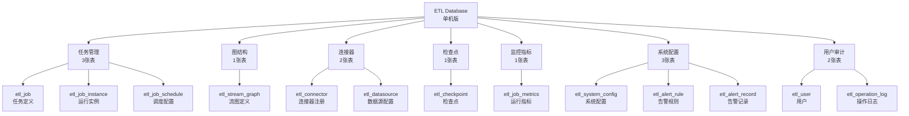
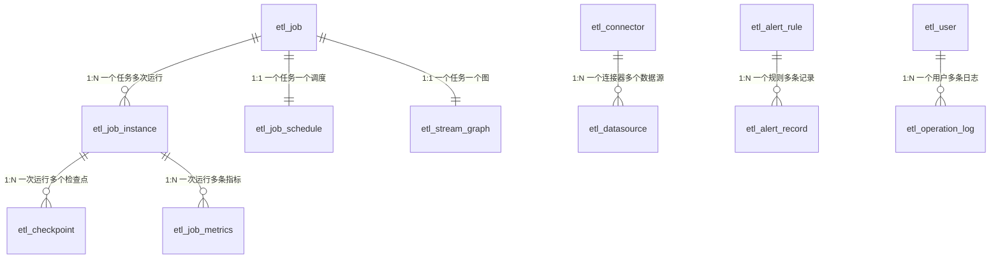

# 响应式ETL框架 - 数据库设计文档（单机版）

## 1. 概述

本文档描述了响应式ETL框架的数据库表结构设计。该框架采用**单机执行模式**，即一个Job作为最小执行单元，在单个实例上完整运行，不涉及分布式算子调度。

### 1.1 设计原则

- **单机执行**: 每个Job在一个实例上完整执行，不会将算子分散到不同节点
- **简洁高效**: 去除分布式相关的复杂设计，保持表结构简洁
- **易于管理**: 降低运维复杂度，适合中小规模数据处理
- **完整功能**: 支持任务调度、检查点、监控告警等核心功能

### 1.2 数据库选型

- **数据库**: MySQL 8.0+
- **字符集**: utf8mb4
- **存储引擎**: InnoDB
- **时区**: 统一使用UTC或Asia/Shanghai

### 1.3 表分类概览



## 2. 任务管理相关表

### 2.1 etl_job - 任务定义表

**用途**: 存储ETL任务的定义信息和配置

**核心设计**:
- 一个Job包含完整的Source → Operators → Sink处理链
- 使用JSON字段存储Source、Operators、Sink配置，灵活且易于扩展
- 不需要并行度、分区等分布式概念

**关键字段说明**:

| 字段 | 类型 | 说明 |
| --- | --- | --- |
| job_id | VARCHAR(64) | 任务唯一标识，建议UUID |
| job_type | VARCHAR(32) | STREAMING(流式)/BATCH(批处理) |
| job_status | VARCHAR(32) | CREATED/SCHEDULED/RUNNING/PAUSED/COMPLETED/FAILED/CANCELLED |
| stream_graph_id | VARCHAR(64) | 关联的StreamGraph ID |
| source_config | JSON | Source配置，包含连接器类型、数据源ID、读取参数等 |
| operators_config | JSON | Operators配置数组，按顺序执行 |
| sink_config | JSON | Sink配置，包含连接器类型、目标数据源、写入参数等 |
| restart_strategy | VARCHAR(32) | 重启策略: FIXED_DELAY/EXPONENTIAL_BACKOFF/NO_RESTART |
| checkpoint_enabled | TINYINT | 是否启用检查点 |

**配置示例**:

```json
{
  "source_config": {
    "connector_type": "kafka",
    "datasource_id": "kafka-prod",
    "topics": ["user-events"],
    "group_id": "etl-consumer",
    "poll_timeout_ms": 1000
  },
  "operators_config": [
    {
      "operator_type": "MAP",
      "name": "parse-json",
      "function": "com.example.ParseJsonFunction"
    },
    {
      "operator_type": "FILTER",
      "name": "filter-active",
      "predicate": "user.isActive == true"
    },
    {
      "operator_type": "AGGREGATE",
      "name": "count-by-city",
      "window_size": "5m",
      "group_by": "city"
    }
  ],
  "sink_config": {
    "connector_type": "jdbc",
    "datasource_id": "mysql-warehouse",
    "table": "user_stats",
    "batch_size": 100,
    "flush_interval_ms": 5000
  }
}
```

### 2.2 etl_job_instance - 任务实例表

**用途**: 记录每次Job运行的实例信息

**核心设计**:
- 一个Job可以有多次运行实例
- 记录运行主机、进程ID等信息，便于定位问题
- 记录核心指标：读取、处理、写入记录数

**关键字段说明**:

| 字段 | 类型 | 说明 |
| --- | --- | --- |
| instance_id | VARCHAR(64) | 实例唯一标识 |
| job_id | VARCHAR(64) | 所属任务ID |
| instance_status | VARCHAR(32) | RUNNING/COMPLETED/FAILED/CANCELLED |
| host_address | VARCHAR(128) | 运行主机地址，如 192.168.1.100 |
| process_id | VARCHAR(64) | 进程PID |
| start_time | DATETIME | 开始时间 |
| end_time | DATETIME | 结束时间 |
| duration_ms | BIGINT | 执行时长(毫秒) |
| records_read | BIGINT | 读取记录数 |
| records_processed | BIGINT | 处理记录数 |
| records_written | BIGINT | 写入记录数 |
| last_checkpoint_id | VARCHAR(64) | 最后检查点ID，用于故障恢复 |

**使用场景**:
- 任务执行历史查询
- 故障排查和问题定位
- 性能分析和统计报表

### 2.3 etl_job_schedule - 任务调度配置表

**用途**: 管理任务的调度策略

**核心设计**:
- 支持立即执行、定时执行、手动执行三种模式
- 一个Job对应一个调度配置（1:1关系）
- 简化了依赖调度和事件触发（可在应用层实现）

**关键字段说明**:

| 字段 | 类型 | 说明 |
| --- | --- | --- |
| schedule_type | VARCHAR(32) | IMMEDIATE(立即)/CRON(定时)/MANUAL(手动) |
| cron_expression | VARCHAR(128) | Cron表达式，如 "0 0 * * * ?" |
| next_fire_time | DATETIME | 下次触发时间 |
| fire_count | BIGINT | 已触发次数 |

**Cron表达式示例**:
- `0 0 * * * ?` - 每小时执行
- `0 0 1 * * ?` - 每天凌晨1点执行
- `0 */5 * * * ?` - 每5分钟执行

## 3. 图结构相关表

### 3.1 etl_stream_graph - StreamGraph定义表

**用途**: 存储任务的数据流图定义

**核心设计**:
- StreamGraph是逻辑执行图，描述Source → Operators → Sink的数据流向
- 使用JSON完整存储图结构，包括节点和边
- 单机模式下不需要JobGraph优化，直接使用StreamGraph执行

**关键字段说明**:

| 字段 | 类型 | 说明 |
| --- | --- | --- |
| graph_id | VARCHAR(64) | 图唯一标识 |
| job_id | VARCHAR(64) | 关联的任务ID |
| graph_definition | JSON | 完整的图定义 |

**图定义JSON结构**:

```json
{
  "nodes": [
    {
      "node_id": "source-1",
      "node_type": "SOURCE",
      "operator_type": "KAFKA_SOURCE",
      "config": {...}
    },
    {
      "node_id": "map-1",
      "node_type": "OPERATOR",
      "operator_type": "MAP",
      "config": {...}
    },
    {
      "node_id": "sink-1",
      "node_type": "SINK",
      "operator_type": "JDBC_SINK",
      "config": {...}
    }
  ],
  "edges": [
    {
      "source": "source-1",
      "target": "map-1"
    },
    {
      "source": "map-1",
      "target": "sink-1"
    }
  ]
}
```

**设计简化**:
- 去除了并行度、分区策略等分布式概念
- 不需要算子链优化（Operator Chain）
- 不需要资源分配和调度

## 4. 连接器配置相关表

### 4.1 etl_connector - 连接器注册表

**用途**: 注册系统支持的所有连接器

**核心设计**:
- 内置连接器随系统初始化
- 支持自定义连接器通过SPI机制注册
- 一个连接器可以同时支持Source和Sink

**内置连接器**:

| 连接器类型 | 支持Source | 支持Sink | 说明 |
| --- | --- | --- | --- |
| JDBC | ✓ | ✓ | 关系型数据库 |
| KAFKA | ✓ | ✓ | 消息队列 |
| HTTP | ✓ | ✓ | REST API |
| FILE | ✓ | ✓ | 文件系统 |
| REDIS | ✓ | ✓ | 缓存 |
| ELASTICSEARCH | ✓ | ✓ | 搜索引擎 |

### 4.2 etl_datasource - 数据源配置表

**用途**: 存储具体的数据源连接配置

**核心设计**:
- 一个连接器可以配置多个数据源实例
- 数据源配置可以在多个Job间共享
- 敏感信息（密码）需要加密存储

**配置示例**:

```json
{
  "connection_config": {
    "url": "jdbc:mysql://localhost:3306/test",
    "username": "root",
    "password": "encrypted_password",
    "driver": "com.mysql.cj.jdbc.Driver",
    "pool": {
      "maxSize": 20,
      "maxIdleTime": "30m"
    }
  }
}
```

## 5. 检查点相关表

### 5.1 etl_checkpoint - 检查点表

**用途**: 记录检查点信息，用于故障恢复

**核心设计**:
- 周期性自动创建检查点或手动触发
- 小状态直接存储在数据库（state_snapshot字段）
- 大状态存储在文件系统，数据库记录路径

**关键字段说明**:

| 字段 | 类型 | 说明 |
| --- | --- | --- |
| checkpoint_id | VARCHAR(64) | 检查点唯一标识 |
| instance_id | VARCHAR(64) | 所属实例ID |
| checkpoint_type | VARCHAR(32) | AUTO(自动)/MANUAL(手动) |
| state_size_bytes | BIGINT | 状态大小 |
| storage_path | VARCHAR(512) | 大状态存储路径 |
| state_snapshot | JSON | 小状态直接存储 |

**使用场景**:
- Job失败后从最近的检查点恢复
- 手动保存点用于版本升级
- 状态迁移和备份

**保留策略**:
- 默认保留最近5个检查点
- 定期清理过期检查点

## 6. 监控指标相关表

### 6.1 etl_job_metrics - 任务运行指标表

**用途**: 记录任务运行时的监控指标

**核心设计**:
- 单机模式只需要Job级别指标，不需要算子级别指标
- 定期采集（如每10秒）存储一条记录
- 用于实时监控和历史趋势分析

**关键指标**:

| 指标类别 | 字段 | 说明 |
| --- | --- | --- |
| 吞吐量 | records_read_rate | 读取速率(记录/秒) |
| 吞吐量 | records_write_rate | 写入速率(记录/秒) |
| 延迟 | processing_latency_ms | 处理延迟(毫秒) |
| 错误 | error_count | 错误次数 |
| 背压 | backpressure_count | 背压次数 |
| 资源 | jvm_heap_used_mb | JVM堆内存使用 |
| 资源 | cpu_usage_percent | CPU使用率 |
| 资源 | thread_count | 线程数 |

**数据保留**:
- 详细指标保留30天
- 可以聚合后长期保存

## 7. 系统配置和告警

### 7.1 etl_system_config - 系统配置表

**用途**: 存储系统全局配置

**配置分组**:

| 分组 | 配置项 | 说明 |
| --- | --- | --- |
| EXECUTOR | thread.pool.core.size | 线程池核心大小 |
| EXECUTOR | thread.pool.max.size | 线程池最大大小 |
| CHECKPOINT | checkpoint.interval.seconds | 检查点间隔 |
| CHECKPOINT | checkpoint.retention.count | 保留检查点数量 |
| METRICS | metrics.collect.interval.seconds | 指标采集间隔 |

### 7.2 etl_alert_rule - 告警规则表

**用途**: 定义监控告警规则

**支持的告警类型**:

| 告警类型 | 说明 | 条件示例 |
| --- | --- | --- |
| JOB_FAILED | 任务失败 | instance_status == FAILED |
| JOB_TIMEOUT | 任务超时 | duration_ms > 3600000 |
| HIGH_ERROR_RATE | 高错误率 | error_count / records_read_total > 0.01 |
| CHECKPOINT_FAILED | 检查点失败 | checkpoint_status == FAILED |

**通知渠道**:
- EMAIL: 邮件通知
- SMS: 短信通知
- WEBHOOK: Webhook回调
- DINGTALK: 钉钉机器人

### 7.3 etl_alert_record - 告警记录表

**用途**: 记录触发的告警

**核心功能**:
- 告警历史追溯
- 告警状态管理（已解决/未解决）
- 通知发送状态跟踪

## 8. 表关系ER图



## 9. 核心视图

### 9.1 v_job_instance_stats - 任务实例统计视图

**用途**: 快速查询任务的执行统计信息

```sql
SELECT * FROM v_job_instance_stats WHERE job_id = 'xxx';
```

**返回字段**:
- total_runs: 总运行次数
- success_runs: 成功次数
- failed_runs: 失败次数
- avg_duration_ms: 平均执行时长
- last_run_time: 最后运行时间

### 9.2 v_running_jobs - 当前运行任务视图

**用途**: 查看当前正在运行的任务

```sql
SELECT * FROM v_running_jobs ORDER BY start_time DESC;
```

**返回字段**:
- instance_id: 实例ID
- job_name: 任务名称
- running_seconds: 已运行秒数
- records_read/processed/written: 实时统计

## 10. 索引策略

### 10.1 主键索引
所有表使用自增主键`id`，提供快速行定位。

### 10.2 唯一索引
业务唯一标识字段：
- job_id, instance_id, checkpoint_id等
- 保证数据唯一性，避免重复

### 10.3 查询索引

**高频查询字段**:
```sql
-- 任务状态查询
KEY `idx_job_status` (`job_status`)

-- 时间范围查询
KEY `idx_start_time` (`start_time`)

-- 关联查询
KEY `idx_job_id` (`job_id`)
```

**组合索引**（根据实际查询优化）:
```sql
-- 任务实例查询
ALTER TABLE etl_job_instance 
ADD INDEX idx_job_status_time (job_id, instance_status, start_time);

-- 指标查询
ALTER TABLE etl_job_metrics 
ADD INDEX idx_instance_metric_time (instance_id, metric_time);
```

## 11. 分区策略

对于数据量大的表，建议按时间分区：

### 11.1 指标表分区

```sql
ALTER TABLE etl_job_metrics 
PARTITION BY RANGE (TO_DAYS(metric_time)) (
    PARTITION p202501 VALUES LESS THAN (TO_DAYS('2025-02-01')),
    PARTITION p202502 VALUES LESS THAN (TO_DAYS('2025-03-01')),
    PARTITION p202503 VALUES LESS THAN (TO_DAYS('2025-04-01')),
    PARTITION p_future VALUES LESS THAN MAXVALUE
);
```

### 11.2 日志表分区

```sql
ALTER TABLE etl_operation_log 
PARTITION BY RANGE (TO_DAYS(operation_time)) (
    PARTITION p202501 VALUES LESS THAN (TO_DAYS('2025-02-01')),
    PARTITION p202502 VALUES LESS THAN (TO_DAYS('2025-03-01')),
    PARTITION p_future VALUES LESS THAN MAXVALUE
);
```

### 11.3 分区维护

```sql
-- 添加新分区
ALTER TABLE etl_job_metrics 
ADD PARTITION (PARTITION p202504 VALUES LESS THAN (TO_DAYS('2025-05-01')));

-- 删除旧分区（保留6个月）
ALTER TABLE etl_job_metrics DROP PARTITION p202410;
```

## 12. 数据保留策略

| 表名 | 保留时长 | 清理策略 |
| --- | --- | --- |
| etl_job | 永久（软删除） | 定期归档已删除任务 |
| etl_job_instance | 6个月 | 归档旧数据或删除 |
| etl_checkpoint | 最近5个 | 自动清理旧检查点 |
| etl_job_metrics | 30天 | 删除或聚合存储 |
| etl_alert_record | 6个月 | 归档历史告警 |
| etl_operation_log | 1年 | 归档审计日志 |

## 13. 性能优化建议

### 13.1 查询优化
- 避免SELECT *，只查询需要的字段
- 合理使用LIMIT限制结果集
- 索引覆盖查询，避免回表
- 大表JOIN使用索引字段

### 13.2 写入优化
- 批量插入代替单条插入
- 使用LOAD DATA INFILE导入大量数据
- 异步写入指标和日志
- 定期执行OPTIMIZE TABLE

### 13.3 JSON字段使用
- 不要在JSON字段上建索引
- 避免在WHERE条件中使用JSON函数
- 考虑将高频查询字段提取为独立列

### 13.4 连接池配置
```properties
# HikariCP推荐配置
maximumPoolSize=20
minimumIdle=5
connectionTimeout=30000
idleTimeout=600000
maxLifetime=1800000
```

## 14. 安全考虑

### 14.1 敏感数据加密
```java
// 密码加密示例
String encrypted = AESUtil.encrypt(password, secretKey);

// BCrypt密码哈希
String hashed = BCrypt.hashpw(password, BCrypt.gensalt());
```

### 14.2 SQL注入防护
- 使用PreparedStatement
- 参数化查询
- 输入验证和过滤

### 14.3 访问控制
- 应用层使用专用数据库账号
- 最小权限原则
- 定期审计数据库访问日志

## 15. 备份恢复

### 15.1 备份策略

**全量备份（每日）**:
```bash
mysqldump -u root -p --single-transaction \
  --master-data=2 \
  etl_framework > backup_$(date +%Y%m%d).sql
```

**增量备份（实时）**:
```bash
# 开启binlog
[mysqld]
log-bin=mysql-bin
binlog_format=ROW
expire_logs_days=7
```

### 15.2 恢复演练

**恢复全量备份**:
```bash
mysql -u root -p etl_framework < backup_20250109.sql
```

**恢复到指定时间点**:
```bash
mysqlbinlog --start-datetime="2025-01-09 10:00:00" \
  --stop-datetime="2025-01-09 11:00:00" \
  mysql-bin.000001 | mysql -u root -p etl_framework
```

## 16. 初始化步骤

### 步骤1: 创建数据库

```sql
CREATE DATABASE etl_framework 
DEFAULT CHARACTER SET utf8mb4 
COLLATE utf8mb4_unicode_ci;
```

### 步骤2: 执行建表脚本

```bash
mysql -u root -p etl_framework < docs/database-schema.sql
```

### 步骤3: 验证初始化

```sql
-- 查看表数量（应该是13张表）
SELECT COUNT(*) FROM information_schema.tables 
WHERE table_schema = 'etl_framework';

-- 查看内置连接器
SELECT connector_id, connector_name, connector_type 
FROM etl_connector WHERE is_builtin = 1;

-- 查看系统配置
SELECT config_key, config_value, config_group 
FROM etl_system_config;
```

## 17. 常见问题

### Q1: 为什么不使用分布式架构？
**A**: 单机架构更简单，适合中小规模数据处理。降低了系统复杂度，更容易运维和调试。对于大规模数据处理，可以通过水平扩展多个独立实例实现。

### Q2: 如何实现Job的水平扩展？
**A**: 可以部署多个ETL实例，每个实例运行不同的Job。通过调度器分配Job到不同实例，实现简单的负载均衡。

### Q3: 检查点数据存储在哪里？
**A**: 
- 小状态（<1MB）: 直接存储在数据库的state_snapshot字段
- 大状态（>1MB）: 存储在文件系统，数据库记录路径

### Q4: 如何处理Job失败？
**A**: 
1. 根据restart_strategy自动重启
2. 从最后一个成功的checkpoint恢复
3. 触发告警通知相关人员
4. 记录详细的错误信息和堆栈

### Q5: 表结构如何升级？
**A**: 
1. 使用版本控制管理SQL脚本
2. 使用Flyway或Liquibase进行数据库迁移
3. 保持向后兼容，使用ALTER TABLE而非DROP TABLE
4. 在测试环境充分验证后再上生产

---

**文档版本**: v2.0（单机版）  
**最后更新**: 2025-11-09  
**维护者**: ETL Framework Team
