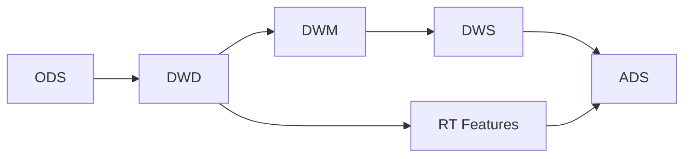

### 数据中台分层（示例/预留）
- ODS → DWD → DWM → DWS → ADS；实时特征旁路至 ES/Redis。
- 引擎：MySQL/Oracle（主数据），ES（检索/人群），CH/DR/SR（可选OLAP）。

```mermaid
flowchart LR
  RAW[ODS] --> DWD[DWD]
  DWD --> DWM[DWM]
  DWM --> DWS[DWS]
  DWS --> ADS[ADS]
  DWD --> RT[RT Features]
  RT --> ADS
```

