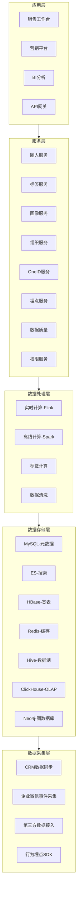
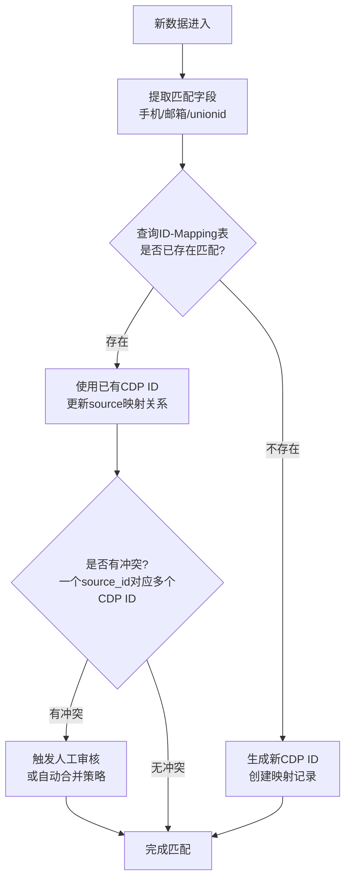
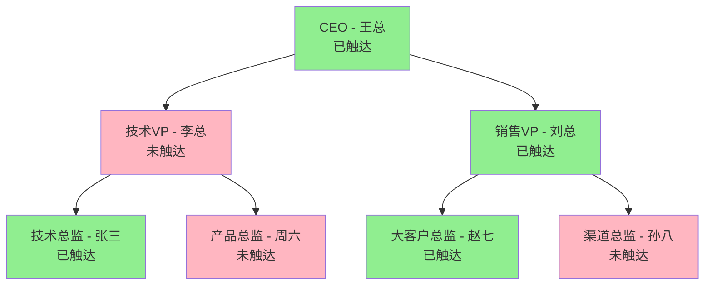
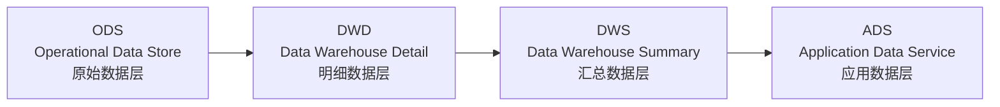
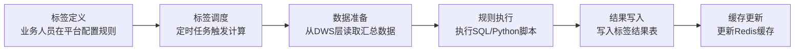
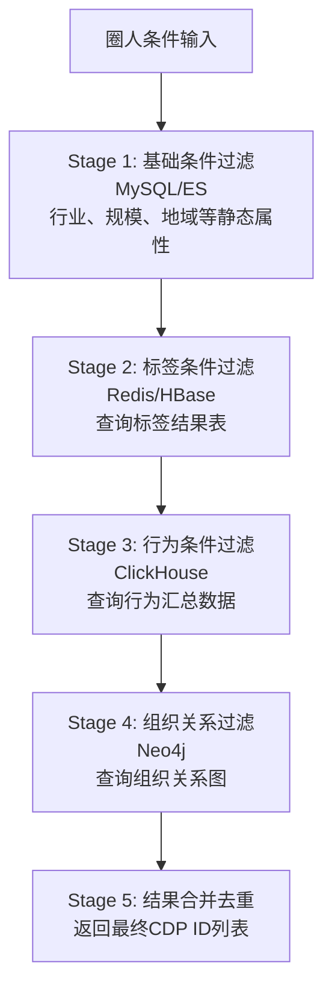
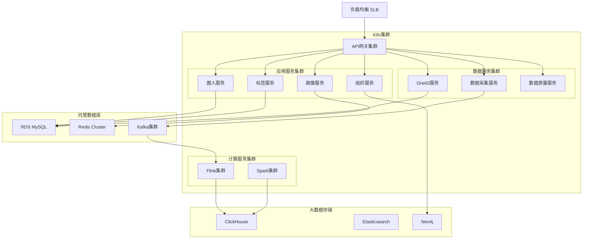
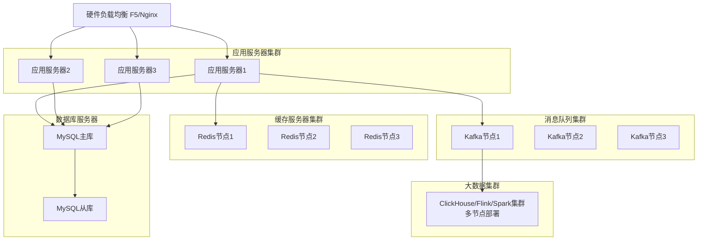

# 企业级CDP（客户数据平台）设计方案

## 目录

- [一、方案概述](#一方案概述)
  - [1.1 背景与目标](#11-背景与目标)
  - [1.2 核心能力](#12-核心能力)
- [二、整体架构设计](#二整体架构设计)
  - [2.1 架构分层](#21-架构分层)
  - [2.2 核心数据流](#22-核心数据流)
- [三、数据采集平台](#三数据采集平台)
  - [3.1 数据源接入](#31-数据源接入)
    - [3.1.1 CRM系统接入](#311-crm系统接入)
    - [3.1.2 企业微信接入](#312-企业微信接入)
    - [3.1.3 第三方数据接入](#313-第三方数据接入)
  - [3.2 数据采集架构](#32-数据采集架构)
  - [3.3 数据采集SDK设计](#33-数据采集sdk设计)
- [四、OneID服务（统一身份识别）](#四oneid服务统一身份识别)
  - [4.1 核心挑战](#41-核心挑战)
  - [4.2 ID-Mapping策略](#42-id-mapping策略)
    - [4.2.1 匹配规则](#421-匹配规则)
    - [4.2.2 匹配算法流程](#422-匹配算法流程)
  - [4.3 OneID数据模型](#43-oneid数据模型)
  - [4.4 OneID服务能力](#44-oneid服务能力)
- [五、组织架构模型设计](#五组织架构模型设计)
  - [5.1 数据模型](#51-数据模型)
    - [5.1.1 客户企业层级模型](#511-客户企业层级模型)
    - [5.1.2 联系人组织关系模型](#512-联系人组织关系模型)
  - [5.2 组织关系查询能力](#52-组织关系查询能力)
    - [5.2.1 核心查询场景](#521-核心查询场景)
    - [5.2.2 图数据库优化](#522-图数据库优化)
  - [5.3 组织架构可视化](#53-组织架构可视化)
- [六、数据建模与存储](#六数据建模与存储)
  - [6.1 数据分层架构](#61-数据分层架构)
  - [6.2 核心数据模型](#62-核心数据模型)
    - [6.2.1 客户企业主题](#621-客户企业主题)
    - [6.2.2 联系人主题](#622-联系人主题)
    - [6.2.3 行为事件主题](#623-行为事件主题)
  - [6.3 存储选型](#63-存储选型)
- [七、标签体系设计](#七标签体系设计)
  - [7.1 标签分类](#71-标签分类)
    - [7.1.1 客户企业标签](#711-客户企业标签)
    - [7.1.2 联系人标签](#712-联系人标签)
    - [7.1.3 组织关系标签](#713-组织关系标签)
  - [7.2 标签计算引擎](#72-标签计算引擎)
    - [7.2.1 标签类型](#721-标签类型)
    - [7.2.2 标签计算流程](#722-标签计算流程)
  - [7.3 标签存储方案](#73-标签存储方案)
- [八、圈人能力设计](#八圈人能力设计)
  - [8.1 圈人场景](#81-圈人场景)
  - [8.2 圈人条件](#82-圈人条件)
    - [8.2.1 基础条件](#821-基础条件)
    - [8.2.2 组织关系条件](#822-组织关系条件)
  - [8.3 圈人引擎](#83-圈人引擎)
    - [8.3.1 查询优化](#831-查询优化)
    - [8.3.2 圈人服务能力](#832-圈人服务能力)
  - [8.4 圈人结果应用](#84-圈人结果应用)
- [九、数据安全与合规](#九数据安全与合规)
  - [9.1 合规要求](#91-合规要求)
  - [9.2 数据脱敏策略](#92-数据脱敏策略)
    - [9.2.1 脱敏字段](#921-脱敏字段)
    - [9.2.2 加密存储](#922-加密存储)
  - [9.3 权限控制](#93-权限控制)
    - [9.3.1 RBAC模型](#931-rbac模型)
    - [9.3.2 数据权限](#932-数据权限)
  - [9.4 审计日志](#94-审计日志)
- [十、技术选型与架构](#十技术选型与架构)
  - [10.1 技术栈选型](#101-技术栈选型)
    - [10.1.1 后端技术栈](#1011-后端技术栈)
    - [10.1.2 前端技术栈](#1012-前端技术栈)
  - [10.2 部署架构](#102-部署架构)
    - [10.2.1 云上部署(推荐)](#1021-云上部署推荐)
    - [10.2.2 私有化部署](#1022-私有化部署)
  - [10.3 核心服务设计](#103-核心服务设计)
    - [10.3.1 服务拆分](#1031-服务拆分)
    - [10.3.2 服务通信](#1032-服务通信)
- [十一、系统实施路线图](#十一系统实施路线图)
  - [11.1 Phase 1: MVP版本 (2-3个月)](#111-phase-1-mvp版本-2-3个月)
  - [11.2 Phase 2: 增强版本 (3-4个月)](#112-phase-2-增强版本-3-4个月)
  - [11.3 Phase 3: 智能版本 (4-6个月)](#113-phase-3-智能版本-4-6个月)
- [十二、成功案例参考](#十二成功案例参考)
  - [12.1 客户画像场景](#121-客户画像场景)
  - [12.2 组织穿透场景](#122-组织穿透场景)
  - [12.3 精准营销场景](#123-精准营销场景)
- [十三、总结与展望](#十三总结与展望)
  - [13.1 企业级CDP与C端CDP的核心差异](#131-企业级cdp与c端cdp的核心差异)
  - [13.2 关键成功要素](#132-关键成功要素)
  - [13.3 未来演进方向](#133-未来演进方向)
- [附录](#附录)
  - [附录A：关键指标定义](#附录a关键指标定义)
  - [附录B：核心服务接口](#附录b核心服务接口)

---

## 一、方案概述

[返回目录](#目录)

### 1.1 背景与目标

本方案针对B2B场景下的企业级客户数据平台（CDP），核心特点是：
- **客户主体是企业**：不同于C端CDP，需要管理企业客户及其内部联系人
- **组织架构关系**：支持企业客户的组织架构管理，可追溯上下级、同事等关系
- **销售场景驱动**：销售人员通过企业微信等渠道与客户互动，需要完整的客户画像支持

### 1.2 核心能力

- **全渠道数据采集**：整合CRM、企业微信、第三方数据等多源数据
- **OneID统一身份**：打通多渠道的客户身份，形成360度客户视图
- **组织架构管理**：支持企业客户的组织层级关系，快速定位关键决策人
- **智能标签体系**：基于行为、属性、组织关系的多维标签
- **精准圈人能力**：支持基于标签、组织关系的客户筛选
- **数据安全合规**：符合个人信息保护法、数据安全法等监管要求

---

## 二、整体架构设计

[返回目录](#目录)

### 2.1 架构分层

整体架构采用经典的五层架构模式，从下至上分别为：数据采集层、数据存储层、数据处理层、服务层、应用层。



### 2.2 核心数据流

系统的核心数据流转包括以下四个主要流程：

1. **数据采集流程**：CRM/企微/第三方 → 消息队列(Kafka) → 数据清洗 → 存储
2. **OneID流程**：多源数据 → ID-Mapping → 统一客户视图
3. **标签计算流程**：原始数据 → 规则引擎 → 标签生成 → 标签存储
4. **圈人查询流程**：条件输入 → 查询引擎 → 结果集 → 导出/推送

---

## 三、数据采集平台

[返回目录](#目录)

### 3.1 数据源接入

#### 3.1.1 CRM系统接入

**接入方式**：
- **全量同步**：定时任务(如每日凌晨)，同步客户主数据、联系人、商机等
- **增量同步**：实时或准实时(5-15分钟)，基于时间戳或CDC(Change Data Capture)
- **API接口**：提供双向API，支持CRM系统实时推送数据变更

**数据内容**：
- **客户企业信息**：企业名称、行业、规模、年营收、地址、成立时间等
- **联系人信息**：姓名、职位、部门、手机、邮箱、汇报关系等
- **商机信息**：商机阶段、金额、预计成交时间、负责销售等
- **活动记录**：拜访记录、通话记录、邮件往来等

#### 3.1.2 企业微信接入

**接入方式**：
- **企微API对接**：基于企业微信官方API，获取通讯录、客户、聊天记录等
- **事件订阅**：订阅企微事件(添加客户、聊天、标签变更等)，实时推送
- **侧边栏应用**：在企微侧边栏嵌入CDP能力，销售可直接查看客户画像

**采集数据类型**：
- **通讯录数据**：企业组织架构、员工信息
- **客户数据**：外部联系人、添加时间、添加来源
- **互动数据**：聊天记录(需客户授权)、会话次数、回复时长
- **群聊数据**：客户群信息、群成员、群消息
- **雷达数据**：客户浏览行为(如浏览官网链接、产品手册)

**数据示例**：
企业微信事件数据通常包含事件类型（如添加外部联系人）、事件时间、员工信息、外部联系人信息、添加方式、来源渠道等维度信息。

#### 3.1.3 第三方数据接入

**数据类型**：
- **企业征信数据**：企查查、天眼查等，企业工商信息、风险信息
- **行业数据**：行业报告、竞品信息
- **公开数据**：企业官网、招聘信息、新闻舆情

**接入方式**：
- **API调用**：定时或触发式调用第三方API
- **文件导入**：Excel/CSV批量导入
- **爬虫采集**：合规前提下的数据抓取

### 3.2 数据采集架构

数据采集架构采用分层设计，确保数据从源系统到存储层的可靠传输和处理。

```mermaid
graph TB
    subgraph 数据源层
        DS1[CRM系统]
        DS2[企业微信]
        DS3[第三方API]
        DS4[行为埋点]
    end
    
    subgraph 数据采集网关
        GW1[CRM Connector]
        GW2[企微 Connector]
        GW3[API Gateway]
        GW4[SDK Collector]
    end
    
    subgraph 消息队列
        MQ[Kafka Topics<br/>crm-data | wework-event | 3rd-data | track]
    end
    
    subgraph 数据预处理层
        FL[Flink Stream Processing<br/>- 数据格式标准化<br/>- 数据清洗去重<br/>- 数据脱敏<br/>- 数据校验]
    end
    
    subgraph 数据落地层
        DL[ODS原始数据 → DWD明细数据 → DWS汇总数据]
    end
    
    DS1 --> GW1
    DS2 --> GW2
    DS3 --> GW3
    DS4 --> GW4
    GW1 --> MQ
    GW2 --> MQ
    GW3 --> MQ
    GW4 --> MQ
    MQ --> FL
    FL --> DL
```

**架构说明**：

1. **数据采集网关**：负责数据格式转换、协议适配、限流熔断
2. **消息队列Kafka**：作为数据缓冲层，支持高吞吐量的数据接入
3. **数据预处理Flink**：实时流处理，完成数据标准化、清洗、脱敏、校验
4. **数据落地**：按照数仓分层架构存储到不同层级

### 3.3 数据采集SDK设计

对于官网、营销页面等场景，提供JavaScript埋点SDK，支持以下核心能力：

**SDK核心功能**：
- **初始化配置**：配置AppKey、服务端URL、自动埋点开关
- **用户识别**：识别用户身份（userId、accountId）和基本属性
- **事件追踪**：追踪页面浏览、按钮点击、表单提交等行为事件
- **企业信息追踪**：追踪企业级别的属性信息

**SDK设计要点**：
- 采用异步上报，不阻塞页面渲染
- 本地缓冲队列，批量上报提升性能
- 断点续传，网络异常时自动重试
- 数据加密传输，保障安全性

---

## 四、OneID服务（统一身份识别）

[返回目录](#目录)

### 4.1 核心挑战

在企业级CDP中，同一个联系人可能在多个系统中有不同的标识：
- CRM中有联系人ID
- 企业微信中有external_user_id
- 官网浏览时通过cookie识别
- 第三方数据中通过手机号或邮箱标识

**OneID的目标**：将这些碎片化的身份统一为唯一的CDP ID，构建完整客户视图。

### 4.2 ID-Mapping策略

#### 4.2.1 匹配规则

**强匹配规则**（优先级从高到低）：
1. **手机号**：中国手机号唯一性强，作为首要匹配字段
2. **邮箱**：企业邮箱唯一性较强
3. **证件号**：如身份证（需脱敏处理）
4. **企业微信unionid**：跨应用唯一标识

**弱匹配规则**：
- 姓名 + 公司名称
- 姓名 + 部门 + 职位
- 设备ID（移动端）

#### 4.2.2 匹配算法流程

OneID匹配采用基于规则的算法流程：



**ID-Mapping表设计要点**：
- 记录CDP统一ID与各来源系统ID的映射关系
- 记录匹配字段（mobile/email/unionid）和匹配值
- 记录匹配置信度（0.00-1.00）
- 支持按来源类型、来源ID、匹配字段索引查询

### 4.3 OneID数据模型

#### 统一客户视图

统一客户视图整合了来自多个数据源的客户信息，形成360度客户画像：

**客户企业信息**：
- 基本信息：企业ID、企业名称、行业、规模、状态等
- 经营信息：年营收、融资轮次、成立时间等

**联系人信息**：
- 基本信息：姓名、职位、部门、职级等
- 联系方式：手机号(脱敏)、邮箱(脱敏)
- 决策角色：决策者、影响者、使用者等

**组织关系**：
- 汇报关系：直属上级CDP ID、上级姓名
- 下属关系：直接下属列表
- 组织路径：部门层级路径

**来源系统ID映射**：
- CRM联系人ID
- 企业微信external_user_id
- 第三方系统ID

**客户标签**：
- 行为标签、属性标签、预测标签等

**活跃信息**：
- 最后活跃时间、创建时间等

### 4.4 OneID服务能力

OneID服务对外提供以下核心能力：

**服务接口清单**：

1. **根据来源ID获取CDP ID**：输入来源系统类型和来源ID，返回统一的CDP ID
2. **ID绑定/合并**：将新的来源ID与已有CDP ID进行绑定
3. **获取统一客户视图**：根据CDP ID获取完整的客户360度视图
4. **ID合并**：当发现多个CDP ID实际是同一人时，执行ID合并操作

**服务调用方式**：
- REST API：同步调用，适用于实时查询场景
- Kafka消息：异步调用，适用于批量ID绑定场景

---

## 五、组织架构模型设计

[返回目录](#目录)

### 5.1 数据模型

企业级CDP的核心特色在于**组织架构关系**，需要建立两层模型：

#### 5.1.1 客户企业层级模型

**客户企业表**：
- 存储客户企业基本信息
- 支持集团型企业的母子公司关系（parent_account_id）
- 区分企业层级：集团、子公司、分公司
- 记录企业所属行业、规模、年营收等关键属性
- 记录客户状态：潜在客户、商机、成交客户、流失
- 记录客户负责人（owner_staff_id）

**客户企业组织架构表**：
- 存储客户企业内部的组织架构信息
- 支持多级组织结构（parent_org_id）
- 记录组织类型：部门、中心、小组等
- 记录组织路径（如：/某公司/技术部/研发中心）
- 记录组织负责人的CDP ID

#### 5.1.2 联系人组织关系模型

**联系人主表**：
- 存储联系人基本信息：姓名、职位、职级、资历等
- 敏感信息加密存储：手机号、邮箱
- 关联所属客户企业（account_id）
- 记录职级：员工/主管/经理/总监/VP/CXO
- 记录资历：初级/中级/高级/专家

**联系人组织关系表**：
- 存储联系人与组织的关联关系
- 支持一个人在多个组织中（兼职、虚线汇报）
- 记录直属上级（report_to_cdp_id）
- 区分主要职位和兼职
- 记录岗位类型：正式、兼职、虚线汇报
- 支持时间有效性（start_date、end_date）

### 5.2 组织关系查询能力

基于上述模型，提供强大的组织关系查询能力：

#### 5.2.1 核心查询场景

组织服务对外提供以下核心查询能力：

**向上查询**：
- **查询直属上级**：查询某人的直接汇报上级
- **查询所有上级**：向上递归查询到CEO/总经理

**向下查询**：
- **查询直属下属**：查询某人的直接下属
- **查询所有下属**：向下递归查询所有层级的下属

**平级查询**：
- **查询部门成员**：查询某个部门的所有成员
- **支持级联查询**：可选择是否包含子部门

**关系查询**：
- **查询共同上级**：找到两个人的最近共同上级（LCA算法）
- **查询决策链**：找到某个部门的决策层人员

#### 5.2.2 图数据库优化

对于复杂的组织关系查询，建议使用**Neo4j图数据库**进行优化：

**图数据库优势**：
- 天然适合处理关系数据
- 支持多层级递归查询
- 查询性能优于关系型数据库（尤其是深层递归）
- 支持复杂的路径查询和图算法

**节点设计**：
- **联系人节点(Contact)**：存储联系人基本信息
- **组织节点(Organization)**：存储部门/团队信息

**关系设计**：
- **汇报关系(REPORT_TO)**：建立上下级关系
- **所属关系(BELONG_TO)**：建立联系人与部门的关系

**典型查询场景**：
- 向上追溯所有上级
- 向下追溯所有下属
- 查询两人的共同上级（最短路径）
- 查询某人的同事（共同上级的下属）

### 5.3 组织架构可视化

在销售工作台中，提供组织架构图可视化能力，帮助销售快速了解客户企业的组织结构。

**组织架构图示例**：



**可视化功能要点**：

1. **节点信息展示**：
   - 姓名、职位、部门
   - 联系方式（有权限时显示）
   - 标签信息（如"决策者"、"高意向"）

2. **触达状态标识**：
   - 已触达：绿色节点
   - 未触达：红色节点
   - 触达方式：企微、邮件、电话等

3. **交互功能**：
   - 点击节点查看详细画像
   - 展开/收起子节点
   - 高亮显示某条汇报链路
   - 导出组织架构图

4. **前端技术选型**：
   - **图可视化库**：AntV G6、D3.js、Cytoscape.js
   - **布局算法**：树形布局、层次布局
   - **响应式设计**：支持大屏展示和移动端

---

## 六、数据建模与存储

[返回目录](#目录)

### 6.1 数据分层架构

采用标准的数仓分层架构，确保数据质量和查询性能：



**各层职责说明**：

| 数据层 | 说明 | 数据处理 | 存储周期 |
|-------|------|---------|---------|
| **ODS** | 原始数据层 | 数据直接从源系统同步，保持原始格式 | 30-90天 |
| **DWD** | 明细数据层 | 数据清洗、标准化、关联OneID | 1-2年 |
| **DWS** | 汇总数据层 | 按天/周/月汇总统计 | 2-3年 |
| **ADS** | 应用数据层 | 面向具体业务场景的宽表 | 长期保存 |

### 6.2 核心数据模型

#### 6.2.1 客户企业主题

**DWD: 客户企业明细表**

存储客户企业的明细信息，包括：
- 企业基本信息：企业ID、企业名称、行业、规模、年营收
- 客户状态：潜在客户、商机、成交客户、流失
- 负责人信息：客户负责人（销售）
- 时间信息：首次接触日期、最近接触日期
- 业务指标：商机总数、营收总额
- 扩展字段：JSON格式存储灵活的扩展属性

**DWS: 客户企业汇总表**

按天统计客户企业的行为汇总数据：
- 联系人数量
- 互动次数（总计、企微聊天、邮件、会议）
- 商机数量和金额
- 活跃度指标（近7天活跃天数、近30天活跃天数）

#### 6.2.2 联系人主题

**DWD: 联系人明细表**

存储联系人的明细信息：
- 基本信息：CDP ID、姓名、职位、部门、职级
- 组织关系：所属企业、直属上级
- 敏感信息：手机号（加密）、邮箱（加密）
- 来源系统ID：企业微信external_id等
- 时间信息：首次添加时间、最后活跃时间

**DWS: 联系人行为汇总表**

按天统计联系人的行为汇总数据：
- 浏览行为：页面浏览次数
- 互动行为：企微聊天次数、回复次数、平均回复时长
- 邮件行为：邮件打开次数、点击次数
- 会议行为：会议参与次数
- 文档行为：文档查看次数
- 总互动次数和最后互动时间

#### 6.2.3 行为事件主题

**DWD: 行为事件明细表**

存储用户的所有行为事件明细：
- 事件基本信息：事件ID、事件类型、事件时间
- 事件主体：联系人CDP ID、客户企业ID
- 事件属性：JSON格式存储事件的详细属性
- 数据来源：WEWORK/CRM/WEB等
- 支持按日期分区，便于历史数据归档

**常见事件类型**：
- page_view：页面浏览
- wework_chat：企微聊天
- email_open：邮件打开
- email_click：邮件点击
- meeting_attend：会议参加
- document_view：文档查看
- form_submit：表单提交

### 6.3 存储选型

根据不同数据特点和访问模式，选择合适的存储方案：

| 数据类型 | 存储方案 | 说明 | 典型应用场景 |
|---------|---------|------|-------------|
| **元数据** | MySQL | 账户信息、联系人信息、标签配置等 | 事务性查询、配置管理 |
| **行为事件** | ClickHouse | 海量事件数据，支持OLAP分析 | 用户行为分析、漏斗分析 |
| **实时画像** | HBase/Redis | 宽表存储，支持快速查询 | 客户360视图、实时标签查询 |
| **组织关系** | Neo4j | 图数据库，支持复杂关系查询 | 组织架构查询、关系路径分析 |
| **搜索** | Elasticsearch | 联系人搜索、企业搜索 | 全文检索、模糊搜索、聚合统计 |
| **数据湖** | Hive/Iceberg | 原始数据长期存储 | 历史数据归档、数据回溯 |
| **缓存** | Redis | 热点数据缓存，提升查询性能 | 高频访问数据、会话数据 |

**存储选型原则**：
- **元数据用MySQL**：事务性强、数据量小、需要ACID保证
- **行为数据用ClickHouse**：写多读少、列式存储、支持OLAP分析
- **实时数据用Redis/HBase**：读多写多、低延迟、高并发
- **关系数据用Neo4j**：复杂关系查询、图算法、路径分析
- **搜索用ES**：全文检索、模糊匹配、聚合统计
- **冷数据用Hive/Iceberg**：长期归档、成本优化、支持数据湖

---

## 七、标签体系设计

[返回目录](#目录)

### 7.1 标签分类

企业级CDP的标签体系分为三大类：

#### 7.1.1 客户企业标签

| 类别 | 标签示例 |
|-----|---------|
| **基础属性** | 行业、规模、地域、上市状态、成立时间 |
| **商业属性** | 年营收、融资轮次、客户生命周期阶段 |
| **业务状态** | 潜在客户、商机阶段、成交客户、流失客户 |
| **行为特征** | 活跃度、互动频次、决策周期 |
| **意向度** | 高意向、中意向、低意向、无意向 |
| **产品偏好** | 关注AI产品、关注SaaS产品、关注定制化服务 |

#### 7.1.2 联系人标签

| 类别 | 标签示例 |
|-----|---------|
| **基础属性** | 姓名、职位、部门、职级、工作年限 |
| **决策角色** | 决策者、影响者、使用者、把关者 |
| **组织关系** | 部门负责人、核心团队成员、关键决策人 |
| **行为特征** | 活跃用户、沉默用户、高频互动、快速回复 |
| **兴趣偏好** | 关注技术细节、关注价格、关注案例、关注服务 |
| **互动渠道** | 企微活跃、邮件活跃、会议活跃 |

#### 7.1.3 组织关系标签

| 类别 | 标签示例 |
|-----|---------|
| **层级标签** | 高层领导、中层管理、基层员工 |
| **影响力标签** | 核心决策人、部门话事人、意见领袖 |
| **关系标签** | 已触达高层、已触达决策人、仅触达执行层 |
| **团队标签** | 完整决策链、缺失决策人、单点联系 |

### 7.2 标签计算引擎

#### 7.2.1 标签类型

标签按照计算方式分为三大类：

**1. 规则类标签**（基于条件判断）

通过SQL规则定义标签计算逻辑，适用于明确的业务规则场景。

**示例**：高意向客户
- **规则定义**：近30天互动次数>=10次 AND 近7天有高层互动
- **计算方式**：从DWS汇总表中查询符合条件的联系人
- **更新频率**：每日计算

**2. 统计类标签**（基于聚合计算）

通过统计聚合计算得出的标签，适用于需要汇总统计的场景。

**示例**：互动频次标签
- **L7D_互动次数**：近7天的总互动次数
- **L30D_互动次数**：近30天的总互动次数
- **计算方式**：从行为汇总表中按时间范围聚合
- **更新频率**：每日计算

**3. 预测类标签**（基于机器学习模型）

通过机器学习模型预测得出的标签，适用于复杂的预测场景。

**示例**：成交概率预测
- **特征工程**：
  - 近30天互动次数
  - 决策人触达数量
  - 是否触达CXO
  - 回复响应率
  - 会议参与次数
  - 文档查看次数
- **模型算法**：随机森林、GBDT、神经网络等
- **输出结果**：成交概率分数（0-1）
- **更新频率**：每周/每月重新训练模型

#### 7.2.2 标签计算流程

标签计算采用统一的流程框架：



**流程说明**：

1. **标签定义**：业务人员在标签管理平台配置标签规则
2. **标签调度**：通过DolphinScheduler等调度工具，按照设定的频率（每日/每小时/实时）触发计算
3. **数据准备**：从DWS汇总层读取所需的数据
4. **规则执行**：根据标签类型，执行对应的计算逻辑（SQL查询、Python脚本、ML模型推理）
5. **结果写入**：将计算结果写入标签结果表（MySQL）
6. **缓存更新**：将热点标签数据更新到Redis，供实时查询使用

### 7.3 标签存储方案

标签系统需要两张核心表：

**标签配置表**：
- 存储标签的元数据信息
- 字段包括：标签ID、标签名称、标签分类、标签类型（RULE/STAT/ML）
- 记录目标类型：ACCOUNT（企业）/CONTACT（联系人）
- 记录计算逻辑：SQL语句或规则描述
- 记录计算频率：DAILY/HOURLY/REALTIME
- 记录标签状态：是否启用

**标签结果表**：
- 存储标签的计算结果
- 字段包括：目标ID（account_id或cdp_id）、目标类型、标签ID、标签值
- 记录置信度：仅预测类标签需要（0.00-1.00）
- 记录有效期：start_time、end_time
- 支持标签的时效性管理
- 按目标ID和标签ID建立联合主键

**查询优化**：
- 为标签结果表建立覆盖索引：(target_id, tag_id)
- 热点标签数据缓存到Redis，key格式：`tag:result:{target_id}`
- 支持批量查询某个客户的所有标签

---

## 八、圈人能力设计

[返回目录](#目录)

### 8.1 圈人场景

基于标签和组织关系的客户筛选，典型场景：

1. **精准营销**：圈选高意向的决策人，推送产品方案
2. **销售分配**：圈选新增商机客户，分配给销售跟进
3. **客户关怀**：圈选长期未互动的老客户，进行激活
4. **交叉销售**：圈选已购买A产品的客户，推荐B产品
5. **组织穿透**：圈选某客户企业的所有高层决策人

### 8.2 圈人条件

#### 8.2.1 基础条件

圈人条件支持多维度组合查询：

**企业维度条件**：
- 行业：IN（互联网、金融、制造等）
- 规模：IN（500人以上、1000人以上等）
- 地域：IN（北京、上海、深圳等）
- 客户状态：IN（商机、成交客户等）

**联系人维度条件**：
- 职级：IN（VP、CXO、总监等）
- 部门：IN（技术部、产品部等）
- 决策角色：IN（决策者、影响者等）

**标签条件**：
- 标签存在性：HAS标签（如"高意向"）
- 标签值：标签值等于/大于/小于某个值

**行为条件**：
- 互动次数：近30天互动次数 >= 10
- 最后互动时间：在某个时间范围内
- 页面浏览：浏览过特定页面

**逻辑关系**：
- 支持AND、OR组合
- 支持条件分组

#### 8.2.2 组织关系条件

除了基础条件，还支持基于组织关系的圈人：

**层级条件**：
- 职级：总监及以上
- 层级：高层、中层、基层

**部门条件**：
- 所属部门：IN（技术部、产品部）
- 包含子部门：是/否

**汇报关系条件**：
- 某人的所有下属：向下N级
- 某人的所有上级：向上到顶
- 某人的同事：共同上级的下属

**组合查询示例**：
圈选某客户企业（A001）中，技术部或产品部的总监及以上人员，且是张三（CDP_000001）的下属（向下2级）。

### 8.3 圈人引擎

#### 8.3.1 查询优化

对于复杂的圈人条件，采用多阶段查询策略，逐步缩小候选集：



**查询优化策略**：

1. **先过滤后关联**：先用过滤性强的条件缩小候选集
2. **分阶段查询**：按数据源特点分阶段查询，避免全表扫描
3. **索引优化**：为常用查询字段建立合适的索引
4. **缓存结果**：对热点圈人条件缓存查询结果
5. **异步计算**：复杂圈人任务异步执行，避免超时

#### 8.3.2 圈人服务能力

圈人服务对外提供以下核心能力：

**服务接口清单**：

1. **创建圈人任务**：提交圈人条件，创建圈人任务，返回任务ID
2. **查询圈人结果**：根据任务ID分页查询圈人结果
3. **导出圈人结果**：将圈人结果导出为Excel/CSV文件
4. **推送圈人结果**：将圈人结果推送到外部系统（企微、邮件、广告平台等）

**任务状态管理**：
- 待执行：任务已创建，等待调度
- 执行中：任务正在计算
- 执行成功：任务完成，结果可查询
- 执行失败：任务失败，记录错误信息

### 8.4 圈人结果应用

圈选结果可以应用到多种场景：

1. **导出**：导出为Excel/CSV，提供给业务团队线下使用
2. **推送**：
   - 推送到企业微信：通过企微消息触达客户
   - 推送到邮件系统：批量发送营销邮件
   - 推送到短信平台：发送短信通知
3. **广告投放**：同步到广告平台(如腾讯广告、字节广告)，用于Lookalike扩量
4. **任务分配**：自动创建销售任务，分配给对应销售跟进
5. **实时触发**：基于用户行为实时触发营销动作（如自动化营销流程）

---

## 九、数据安全与合规

[返回目录](#目录)

### 9.1 合规要求

根据《个人信息保护法》、《数据安全法》等法规，CDP需要满足：

1. **数据最小化**：只采集业务必需的数据，避免过度采集
2. **明示同意**：用户明确授权后才能采集和使用个人信息
3. **数据脱敏**：敏感数据加密存储和传输
4. **访问控制**：基于角色的权限管理，最小权限原则
5. **审计日志**：记录所有数据访问和操作，可追溯
6. **数据删除**：用户有权要求删除个人数据，需提供删除机制
7. **数据导出**：用户有权导出个人数据，需提供导出功能
8. **安全评估**：定期进行数据安全风险评估

### 9.2 数据脱敏策略

#### 9.2.1 脱敏字段

针对不同类型的敏感信息，采用不同的脱敏策略：

| 字段类型 | 脱敏方式 | 示例 | 适用场景 |
|---------|---------|------|---------|
| 手机号 | 中间4位打码 | 138****8000 | 列表展示、报表导出 |
| 邮箱 | 用户名部分打码 | zha***@example.com | 列表展示、报表导出 |
| 身份证 | 中间部分打码 | 110***********1234 | 身份验证场景 |
| 姓名 | 姓氏保留 | 张** | 低敏感场景 |
| 地址 | 详细地址模糊化 | 北京市朝阳区*** | 区域统计分析 |

#### 9.2.2 加密存储

敏感字段采用AES加密存储：

**加密方案**：
- 使用AES-256加密算法
- 密钥管理：采用密钥管理系统（KMS），支持密钥轮转
- 版本管理：记录加密密钥版本，支持密钥升级
- 应用层解密：数据在应用层解密后使用，数据库层保持加密状态

**敏感字段表设计要点**：
- 单独存储敏感字段，与业务表分离
- 使用VARBINARY类型存储加密后的数据
- 记录加密密钥版本，便于密钥轮转
- 严格控制解密权限，最小化明文暴露

### 9.3 权限控制

#### 9.3.1 RBAC模型

采用基于角色的访问控制（RBAC）模型：

**核心概念**：
- **用户(User)**：系统使用者
- **角色(Role)**：权限的集合，如"销售主管"、"数据分析师"
- **权限(Permission)**：具体的操作权限，如"查看客户信息"、"导出数据"

**权限表设计要点**：

**角色表**：
- 存储角色基本信息：角色ID、角色名称、角色描述
- 支持角色的启用/禁用

**权限表**：
- 存储权限定义：权限ID、权限名称
- 资源类型：ACCOUNT（企业）、CONTACT（联系人）、TAG（标签）
- 操作类型：READ（查看）、WRITE（编辑）、DELETE（删除）、EXPORT（导出）

**角色权限关联表**：
- 建立角色与权限的多对多关系

**用户角色关联表**：
- 建立用户与角色的多对多关系
- 一个用户可以拥有多个角色

**典型角色定义**：
- **销售**：查看自己负责的客户、编辑客户信息、圈人导出
- **销售主管**：查看团队客户、分配客户、审批导出
- **数据分析师**：查看所有数据、BI分析、无导出权限
- **系统管理员**：全部权限

#### 9.3.2 数据权限

除了功能权限，还需要控制数据范围权限（行级权限）：

**数据权限表设计要点**：
- 用户ID：权限归属用户
- 数据类型：ACCOUNT（企业）、CONTACT（联系人）
- 过滤条件：JSON格式存储数据过滤规则

**典型数据权限规则**：

**示例1：销售只能看到自己负责的客户**
- 过滤条件：owner_staff_id = 当前用户ID

**示例2：区域经理可以看到整个区域的客户**
- 过滤条件：region = '华北区'

**示例3：销售VP可以看到所有客户**
- 过滤条件：无（全量数据）

**数据权限实现方式**：
- 在应用层查询时自动拼接过滤条件
- 使用数据库视图限制数据访问范围
- 使用中间件拦截器统一处理数据权限

### 9.4 审计日志

完善的审计日志是数据安全合规的重要保障：

**操作审计表设计要点**：
- 记录用户操作：用户ID、用户名
- 记录操作类型：QUERY（查询）、EXPORT（导出）、UPDATE（更新）、DELETE（删除）
- 记录资源信息：资源类型、资源ID
- 记录操作详情：JSON格式存储详细操作内容
- 记录访问信息：IP地址、User-Agent
- 记录操作时间：精确到秒
- 支持按时间分区，便于历史数据归档

**审计日志应用场景**：
- **合规审计**：满足监管要求，提供操作记录
- **安全分析**：检测异常操作，如批量导出、越权访问
- **问题排查**：追溯数据变更历史，定位问题根源
- **行为分析**：分析用户使用习惯，优化产品体验

**审计日志查询能力**：
- 按用户查询：查询某个用户的所有操作记录
- 按时间查询：查询某个时间范围内的操作记录
- 按操作类型查询：查询所有导出操作、删除操作等
- 按资源查询：查询某个客户的所有操作历史

---

## 十、技术选型与架构

[返回目录](#目录)

### 10.1 技术栈选型

#### 10.1.1 后端技术栈

| 技术领域 | 选型方案 | 说明 |
|---------|---------|------|
| 开发语言 | Java 11+ / Spring Boot | 成熟稳定，生态丰富 |
| 微服务框架 | Spring Cloud Alibaba | 国内主流，社区活跃 |
| API网关 | Spring Cloud Gateway | 统一入口，流量控制 |
| 注册中心 | Nacos | 服务注册与配置管理 |
| 消息队列 | Kafka | 高吞吐，支持流式处理 |
| 缓存 | Redis Cluster | 高性能缓存 |
| 关系数据库 | MySQL 8.0 | 元数据存储 |
| OLAP数据库 | ClickHouse | 行为事件分析 |
| 图数据库 | Neo4j | 组织关系查询 |
| 搜索引擎 | Elasticsearch | 全文搜索 |
| 实时计算 | Flink | 实时数据处理 |
| 离线计算 | Spark | 批量数据处理 |
| 任务调度 | DolphinScheduler | 数据任务编排 |
| 监控告警 | Prometheus + Grafana | 系统监控 |

#### 10.1.2 前端技术栈

| 技术领域 | 选型方案 |
|---------|---------|
| 框架 | React / Vue 3 |
| UI组件库 | Ant Design / Element Plus |
| 图表库 | ECharts / AntV |
| 图可视化 | AntV G6 |
| 状态管理 | Redux / Pinia |
| 请求库 | Axios |
| 构建工具 | Vite / Webpack |

### 10.2 部署架构

#### 10.2.1 云上部署(推荐)

云上部署架构充分利用云平台的弹性伸缩、高可用、托管服务等优势：



**云上部署优势**：
- **弹性伸缩**：根据负载自动调整资源，按需付费
- **高可用**：跨可用区容灾，自动故障切换
- **托管服务**：RDS、Kafka等托管服务，减少运维成本
- **安全隔离**：VPC网络隔离，安全组访问控制
- **监控告警**：云平台提供完善的监控和告警能力

**推荐云平台**：
- 阿里云：完整的大数据产品线，适合国内客户
- 腾讯云：企微生态整合，适合重度使用企微的场景
- AWS：全球部署，适合海外业务

#### 10.2.2 私有化部署

适用于对数据安全要求极高、需要数据主权的客户：



**私有化部署特点**：
- **数据主权**：数据完全掌控在客户手中
- **网络隔离**：部署在客户内网，与外网物理隔离
- **定制化强**：可根据客户需求深度定制
- **运维成本高**：需要客户自行运维，或提供驻场服务

**硬件配置建议**：
- **应用服务器**：16核32G内存，至少3台
- **数据库服务器**：32核64G内存，SSD存储，主从架构
- **缓存服务器**：16核32G内存，至少3台组成集群
- **消息队列**：16核32G内存，至少3台组成集群
- **大数据集群**：根据数据量规划，至少5台起步

### 10.3 核心服务设计

#### 10.3.1 服务拆分

基于微服务架构，按照业务领域拆分服务：

**服务清单**：

| 服务名称 | 职责说明 |
|---------|---------|
| cdp-gateway-service | API网关，统一入口，路由转发、鉴权、限流 |
| cdp-user-service | 用户权限服务，用户管理、角色管理、权限控制 |
| cdp-collection-service | 数据采集服务，多源数据接入、数据清洗 |
| cdp-oneid-service | OneID服务，身份识别、ID-Mapping、客户视图 |
| cdp-organization-service | 组织架构服务，组织关系管理、关系查询 |
| cdp-tag-service | 标签服务，标签配置、标签计算、标签查询 |
| cdp-audience-service | 圈人服务，圈人条件解析、圈人执行、结果导出 |
| cdp-profile-service | 画像服务，客户360画像、画像查询 |
| cdp-data-quality-service | 数据质量服务，数据质量监控、数据清洗规则 |
| cdp-export-service | 数据导出服务，数据导出、推送到外部系统 |

**服务拆分原则**：
- **高内聚低耦合**：同一业务领域的功能在一个服务内
- **独立部署**：每个服务可以独立部署、独立扩展
- **数据隔离**：每个服务有独立的数据库/Schema
- **接口稳定**：服务间通过稳定的API通信

#### 10.3.2 服务通信

服务间通信采用同步+异步结合的方式：

**同步调用**：
- **协议**：HTTP/REST
- **框架**：OpenFeign
- **适用场景**：实时查询、事务性操作
- **超时控制**：设置合理的超时时间（如3秒）
- **重试策略**：幂等接口支持重试

**异步调用**：
- **消息队列**：Kafka
- **适用场景**：数据同步、事件通知、批量处理
- **消息格式**：JSON，包含消息ID、时间戳、业务数据
- **消费模式**：支持广播和点对点

**服务降级**：
- **限流**：集成Sentinel，防止服务过载
- **熔断**：快速失败，避免雪崩
- **降级**：返回默认值或缓存数据

**链路追踪**：
- **APM工具**：SkyWalking
- **功能**：请求链路追踪、性能分析、异常排查
- **Trace ID**：全链路跟踪请求

---

## 十一、系统实施路线图

[返回目录](#目录)

### 11.1 Phase 1: MVP版本 (2-3个月)

**核心目标**：快速上线基础功能，验证业务价值

**功能范围**：
- **数据采集**：CRM同步、企业微信接入
- **OneID**：基本的ID-Mapping能力
- **客户管理**：客户企业、联系人基础信息管理
- **组织架构**：基础的上下级关系查询
- **标签体系**：10-20个核心业务标签
- **圈人能力**：基于标签的简单圈人
- **销售工作台**：客户列表、客户详情、组织架构图

**技术实现**：
- 关系型数据库为主（MySQL）
- 简单的组织关系查询（SQL递归查询）
- 前端单体应用

**交付成果**：
- 可用的销售工作台
- 基础的客户360画像
- 简单的圈人导出功能

### 11.2 Phase 2: 增强版本 (3-4个月)

**核心目标**：完善核心能力，支持更复杂的业务场景

**功能范围**：
- **数据采集**：第三方数据接入、Web埋点SDK
- **OneID**：多源数据深度打通、ID合并策略
- **组织架构**：矩阵式组织、复杂关系查询(图数据库)
- **标签体系**：50+标签、自定义标签平台、标签自动更新
- **圈人能力**：组织关系圈人、复杂条件圈人、圈人结果推送
- **数据分析**：客户分析报表、销售漏斗、客户健康度

**技术升级**：
- 引入Neo4j图数据库，优化组织关系查询
- 引入ClickHouse，支持海量行为数据分析
- 引入Flink，支持实时数据处理
- 微服务化改造

**交付成果**：
- 完整的标签平台
- 强大的圈人能力
- 组织穿透场景落地

### 11.3 Phase 3: 智能版本 (4-6个月)

**核心目标**：引入AI能力,提升智能化水平

**功能范围**：
- **预测类标签**：成交概率、流失风险、客户价值评分
- **智能推荐**：下一步行动建议、推荐联系人、推荐话术
- **自然语言查询**：通过自然语言描述圈人条件
- **异常检测**：数据质量监控、异常行为识别
- **自动化营销**：基于触发条件的自动化流程

**技术升级**：
- 引入机器学习平台（如MLflow）
- 引入NLP模型（如BERT）
- 引入知识图谱

**交付成果**：
- 智能化的销售辅助能力
- 自动化营销能力
- 从"被动查询"到"主动洞察"

---

## 十二、成功案例参考

[返回目录](#目录)

### 12.1 客户画像场景

**业务场景**：销售拜访某客户前，快速了解客户全貌

**解决方案**：
1. 销售在企微侧边栏打开CDP客户画像
2. 展示客户企业基本信息(行业、规模、经营状况)
3. 展示组织架构图，标注已触达联系人
4. 展示关键决策人(CEO、CTO等)，提示是否已触达
5. 展示近期互动记录(聊天、邮件、会议)
6. 展示客户意向度、成交概率等智能标签
7. 推荐下一步行动(如"建议约见技术VP李总")

**业务价值**：
- 销售拜访准备时间从2小时缩短到30分钟
- 触达关键决策人的概率提升40%
- 商机转化率提升25%

### 12.2 组织穿透场景

**业务场景**：已经触达某客户的技术经理，希望触达其上级技术VP

**解决方案**：
1. 在CDP中查询该技术经理的组织关系
2. 系统自动展示其直属上级"技术VP-李总"
3. 展示李总的画像：职位、联系方式、近期活跃情况
4. 展示李总的关注点：曾查看过产品方案、参加过线上会议
5. 推荐触达策略：通过现有联系人引荐、或发送定向内容

**业务价值**：
- 决策链触达完整度从30%提升到70%
- 大单成交周期缩短20%

### 12.3 精准营销场景

**业务场景**：新产品发布,需要圈选目标客户进行推广

**圈人条件**：
- 行业：互联网、金融
- 规模：500人以上
- 客户阶段：商机阶段
- 联系人层级：VP/CXO
- 意向度：高意向
- 互动情况：近30天有互动
- 组织关系：已触达技术部门

**执行动作**：
- 圈选出500个目标联系人
- 通过企业微信推送产品介绍
- 邀请参加线上产品发布会
- 销售跟进重点客户

**业务价值**：
- 营销触达精准度提升60%
- 产品发布会参会率提升3倍
- 新产品试用转化率提升50%

---

## 十三、总结与展望

[返回目录](#目录)

### 13.1 企业级CDP与C端CDP的核心差异

| 维度 | C端CDP | 企业级CDP |
|-----|--------|-----------|
| 客户主体 | 个人消费者 | 企业+联系人 |
| 数据规模 | 千万-亿级用户 | 万-百万级企业 |
| 核心关系 | 用户画像 | 组织架构关系 |
| 决策模式 | 个人决策 | 多人协同决策 |
| 生命周期 | 较短(数月) | 较长(数年) |
| 典型场景 | 精准投放、个性化推荐 | 销售赋能、组织穿透 |

### 13.2 关键成功要素

1. **数据质量**：GIGO(Garbage In, Garbage Out)，数据质量是CDP的生命线
2. **组织关系**：这是企业级CDP的核心竞争力，必须重点投入
3. **OneID精准度**：直接影响客户画像的准确性
4. **业务深度结合**：CDP不是数据仓库，必须与业务场景深度结合
5. **数据安全合规**：红线问题，必须严格遵守

### 13.3 未来演进方向

1. **实时化**：从T+1向实时CDP演进，支持秒级的数据更新
2. **智能化**：引入更多AI能力，从被动查询到主动洞察
3. **开放化**：通过API、SDK开放CDP能力，构建数据生态
4. **私有化**：支持私有化部署，满足大型企业的数据主权诉求
5. **行业化**：针对不同行业(金融、教育、制造)提供行业解决方案

---

## 附录

[返回目录](#目录)

### 附录A：关键指标定义

| 指标名称 | 定义 | 计算公式 |
|---------|------|---------|
| 客户覆盖率 | 已录入CDP的客户占总客户的比例 | CDP客户数 / 总客户数 |
| OneID准确率 | OneID匹配正确的比例 | 正确匹配数 / 总匹配数 |
| 标签覆盖率 | 有标签的客户占总客户的比例 | 有标签客户数 / 总客户数 |
| 标签平均数 | 每个客户平均拥有的标签数 | 总标签数 / 客户数 |
| 组织完整度 | 组织架构信息完整的客户比例 | 有组织信息客户数 / 总客户数 |
| 数据新鲜度 | 数据最近更新的时间 | 当前时间 - 最后更新时间 |

### 附录B：核心服务接口

**OneID服务接口**：
- GET `/api/v1/oneid/customer/{cdpId}` - 获取客户画像
- POST `/api/v1/oneid/bind` - 绑定ID
- POST `/api/v1/oneid/merge` - 合并ID

**组织架构服务接口**：
- GET `/api/v1/org/manager/{cdpId}` - 查询上级
- GET `/api/v1/org/reports/{cdpId}` - 查询下属
- GET `/api/v1/org/tree/{accountId}` - 查询组织树

**标签服务接口**：
- GET `/api/v1/tag/list` - 标签列表
- POST `/api/v1/tag/calculate` - 计算标签
- GET `/api/v1/tag/customer/{cdpId}` - 查询客户标签

**圈人服务接口**：
- POST `/api/v1/audience/create` - 创建圈人任务
- GET `/api/v1/audience/{audienceId}/result` - 查询圈人结果
- POST `/api/v1/audience/{audienceId}/export` - 导出圈人结果

---

**文档版本**：v2.0  
**最后更新**：2024-10-28  
**作者**：CDP项目组  

---

## 问题讨论与反馈

如您对本设计方案有任何疑问或建议，请联系项目组进行讨论。

**关键待确认事项**：
1. 数据源系统的详细对接规范（CRM系统接口文档、企微API权限）
2. 组织架构的复杂度（是否存在矩阵式管理、虚线汇报等特殊情况）
3. 性能要求（并发用户数、查询响应时间SLA）
4. 预算与人力资源（开发团队规模、预算范围）
5. 上线时间要求（是否有硬性deadline）

[返回目录](#目录)
