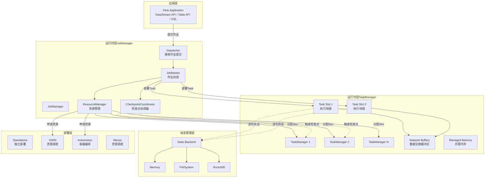
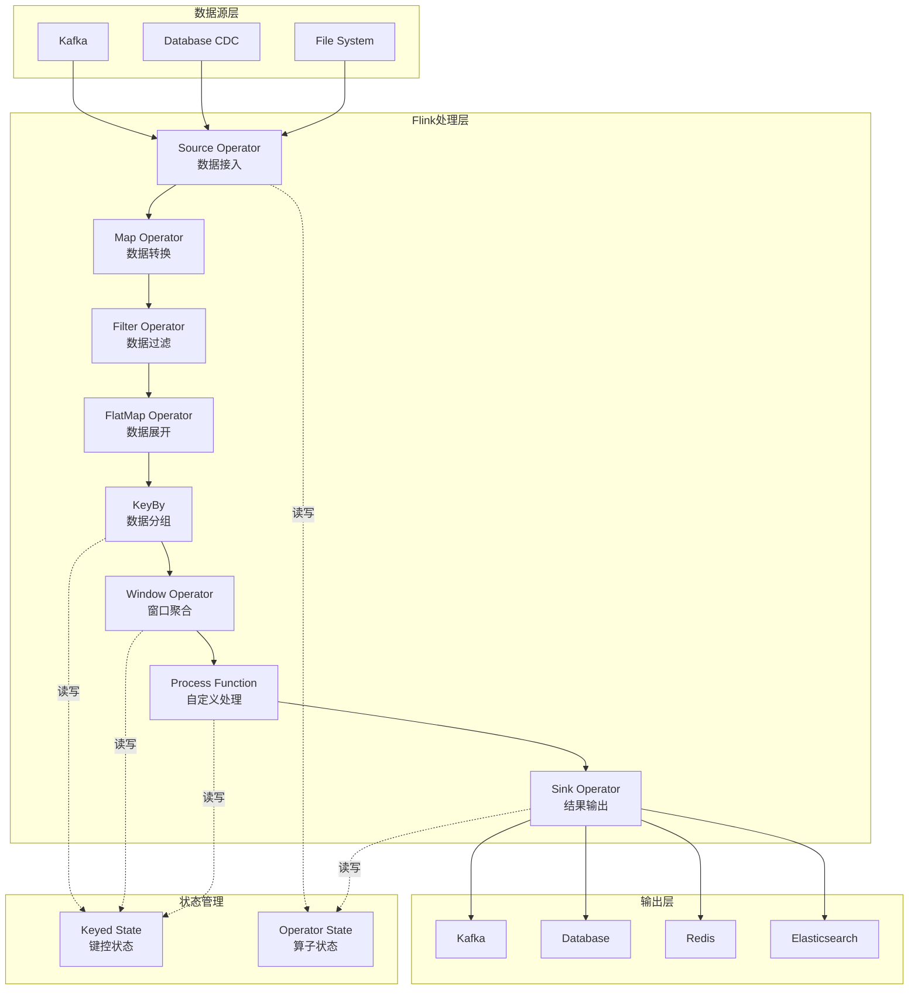
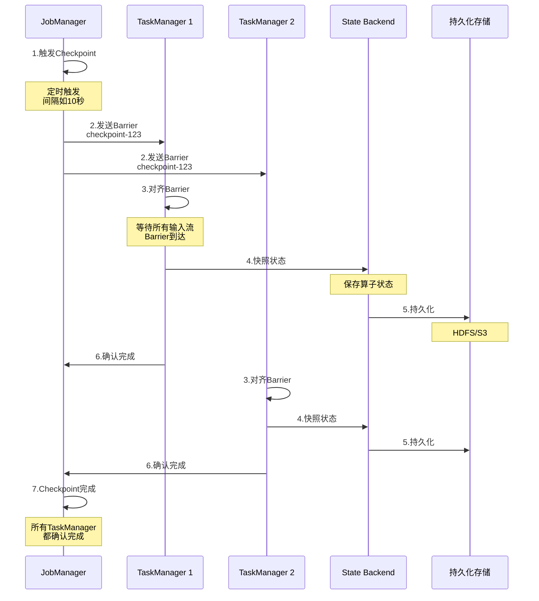

# Flink 系统架构图

## Flink 完整系统架构

## Flink 核心组件说明

### 1. JobManager（主节点）
- **Dispatcher**: 接收客户端提交的作业
- **ResourceManager**: 管理TaskManager资源和Slot分配
- **JobMaster**: 每个作业一个，负责作业执行协调
- **CheckpointCoordinator**: 协调分布式快照

### 2. TaskManager（工作节点）
- **Task Slot**: 任务执行槽位，隔离CPU和内存
- **Network Buffers**: 任务间数据交换缓冲区
- **Managed Memory**: 排序、哈希表等操作的托管内存

### 3. State Backend（状态后端）
- **MemoryStateBackend**: 内存存储（开发测试）
- **FsStateBackend**: 文件系统存储（HDFS/S3）
- **RocksDBStateBackend**: RocksDB存储（大状态场景）

### 4. 部署模式
- **Standalone**: 独立集群部署
- **YARN**: Hadoop资源调度
- **Kubernetes**: 容器化部署
- **Mesos**: 资源调度框架

## Flink 数据流处理架构

## Flink Checkpoint 机制

## Checkpoint 机制说明

### Barrier对齐
- Source算子接收到Checkpoint触发信号后插入Barrier
- Barrier随数据流向下游传播
- 算子等待所有输入流的Barrier都到达后才执行快照

### 状态快照
- 保存Keyed State（键控状态）
- 保存Operator State（算子状态）
- 异步写入持久化存储

### 故障恢复
- 从最近成功的Checkpoint恢复
- 重放Checkpoint之后的数据
- 保证Exactly-Once语义
