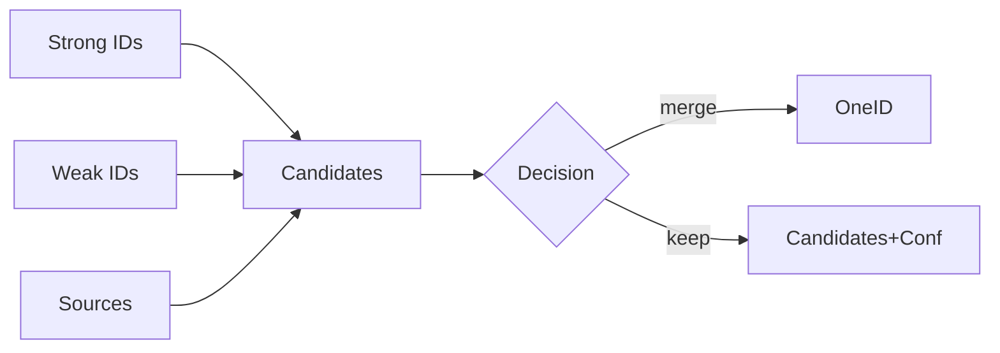

### OneID与主数据（示例/预留）
- 实体：EnterpriseAccount/Contact/Lead/UserAccount/Device 等。
- 强标识：信用代码/手机号/企业邮箱/企微ID/CRM主键；弱标识：Cookie/设备指纹/AdID。
- 合并：优先强标识；弱标识作关联增强；人工校对流（待配置）。
- 存储：ES 文档+边索引或图数据库（可选）。

```mermaid
flowchart LR
  A1[Strong IDs] --> B[Candidates]
  A2[Weak IDs] --> B
  A3[Sources] --> B
  B --> C{Decision}
  C -->|merge| D[OneID]
  C -->|keep| E[Candidates+Conf]
```

