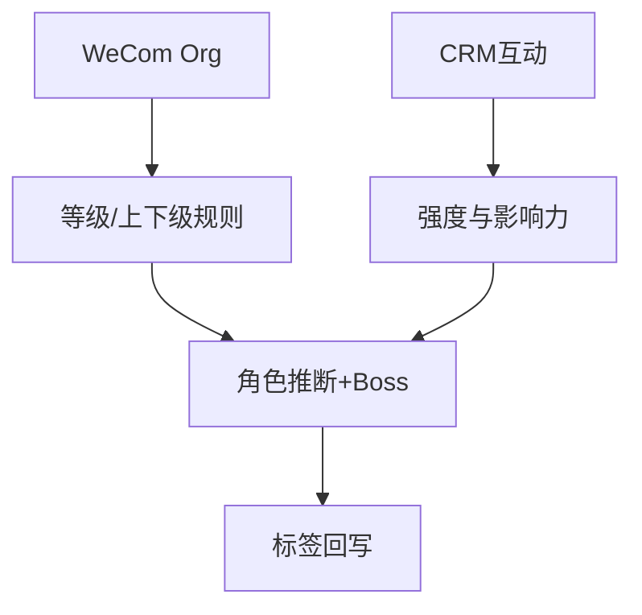

### 组织与Boss定位（示例/预留）
- 企微组织同步（字段与频率待确认）；Buying Committee 角色字典待补充。
- 示例公式：`boss_score = grade_weight × interaction_freq × decision_score`（待确认权重）。
- 产出：`decision_maker_level`, `reports_to_one_id`, 推荐Boss与触达窗口。

