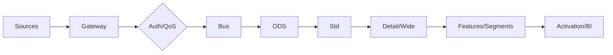

{toc}

### 概述
- 金融行业 ToB CDP，覆盖“采集 → OneID → 中台 → 分析 → 应用”。
- 多租户隔离，支持组织视图与跨组织聚合（受权限控制）。
- 现有引擎：MySQL/ES/Oracle；后续可接 Kafka/Flink/CH。

```mermaid
flowchart LR
  A[Sources] --> B[Gateway]
  B --> C{Auth/QoS}
  C --> D[Bus]
  D --> E[ODS]
  E --> F[Std]
  F --> G[Detail/Wide]
  G --> H[Features/Segments]
  H --> I[Activation/BI]
```

