# 响应式ETL框架设计文档

## 1. 概述

### 1.1 项目背景

本项目旨在设计并实现一个基于响应式编程模型的轻量级ETL（Extract-Transform-Load）数据采集框架。该框架借鉴Apache Flink的设计理念，采用Source、Operator、Sink的经典数据处理模型，并基于Project Reactor实现完全响应式的数据流处理。

### 1.2 设计目标

- **响应式流处理**：基于Reactor实现非阻塞、背压支持的数据流处理
- **模块化设计**：清晰的任务调度、图转换、执行引擎分层架构
- **高性能**：充分利用响应式编程的优势，支持高吞吐量数据处理
- **易用性**：提供简洁的API，支持声明式任务定义
- **可观测性**：内置监控指标和日志，方便运维调试
- **可扩展性**：基于Connectors的插件化扩展机制

### 1.3 核心特性

- 声明式任务定义（StreamGraph → JobGraph转换）
- 灵活的任务调度机制（Job Scheduler）
- 高效的执行引擎（Job Executor）
- 丰富的连接器生态（Connectors）
- 内置背压机制，防止内存溢出
- 支持有状态计算和检查点容错

## 2. 系统架构

### 2.1 整体架构图

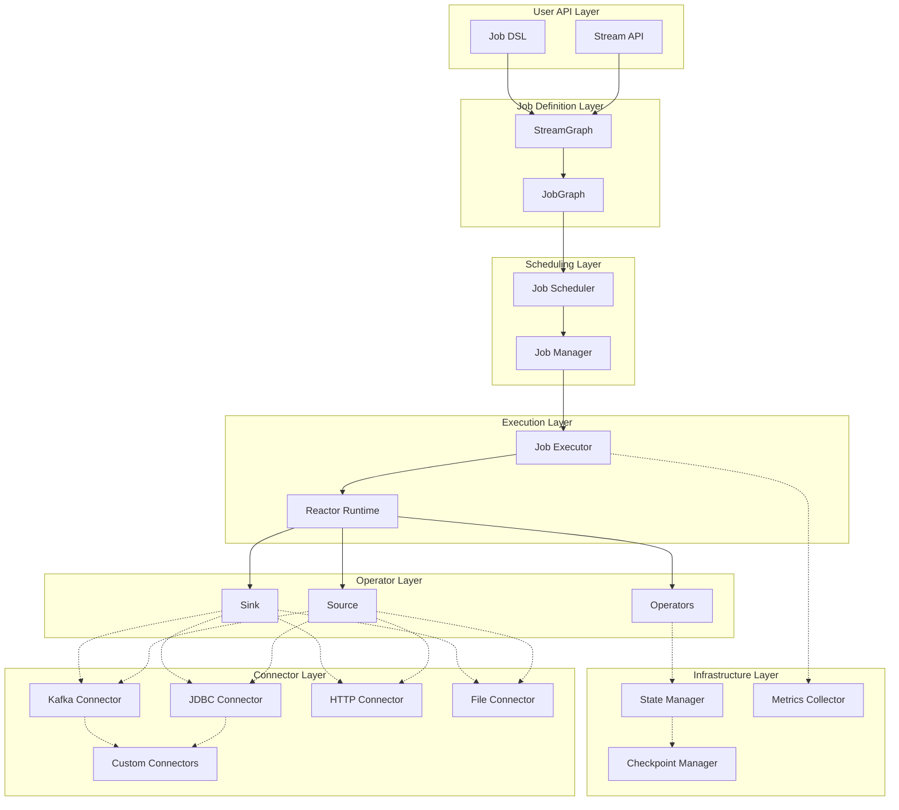

### 2.2 架构分层说明

#### 2.2.1 用户API层（User API Layer）
提供友好的编程接口，允许用户通过流式API或DSL定义ETL任务。

#### 2.2.2 任务定义层（Job Definition Layer）
- **StreamGraph**：用户定义的逻辑执行图，描述数据流转换关系
- **JobGraph**：优化后的物理执行图，可实际调度执行

#### 2.2.3 调度层（Scheduling Layer）
- **Job Scheduler**：负责任务的调度策略（立即执行、定时执行、依赖触发等）
- **Job Manager**：管理任务的生命周期（创建、启动、停止、重启）

#### 2.2.4 执行层（Execution Layer）
- **Job Executor**：任务的实际执行引擎
- **Reactor Runtime**：响应式运行时环境

#### 2.2.5 算子层（Operator Layer）
核心的数据处理组件，包括Source、Operator、Sink。

#### 2.2.6 连接器层（Connector Layer）
提供与各种外部系统交互的能力，采用插件化设计。

#### 2.2.7 基础设施层（Infrastructure Layer）
提供状态管理、检查点、监控等基础能力。

### 2.3 模块依赖关系图

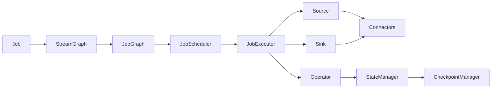

## 3. 核心模块设计

### 3.1 Job模块

#### 3.1.1 设计理念

Job是ETL任务的最小执行单元，封装了完整的数据处理逻辑。每个Job包含唯一标识、配置信息、执行状态等元数据。

#### 3.1.2 Job生命周期

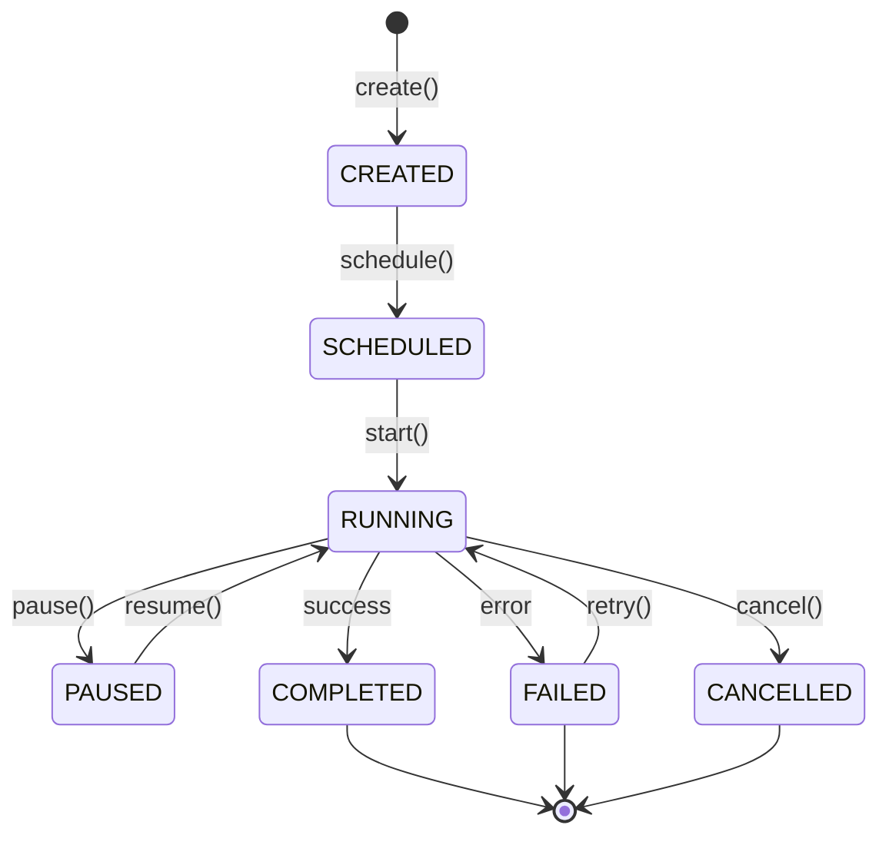

#### 3.1.3 Job元数据结构

```java
public class Job {
    private String jobId;              // 任务唯一标识
    private String jobName;            // 任务名称
    private JobType jobType;           // 任务类型：STREAMING/BATCH
    private JobStatus status;          // 任务状态
    private JobConfig config;          // 任务配置
    private JobGraph jobGraph;         // 执行图
    private Instant createTime;        // 创建时间
    private Instant startTime;         // 启动时间
    private Instant endTime;           // 结束时间
    private Map<String, Object> metadata; // 扩展元数据
}
```

### 3.2 StreamGraph模块

#### 3.2.1 设计理念

StreamGraph是用户定义的逻辑执行图，直接映射用户的API调用。它是一个有向无环图（DAG），节点代表算子，边代表数据流向。

#### 3.2.2 StreamGraph结构

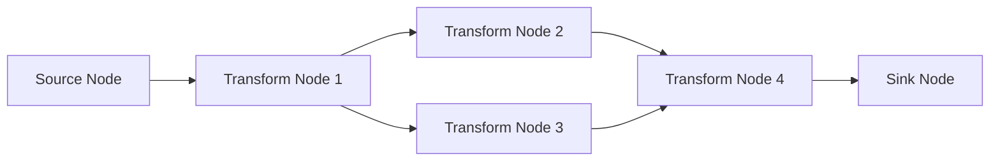

#### 3.2.3 StreamNode定义

```java
public class StreamNode {
    private int nodeId;                    // 节点ID
    private String operatorName;           // 算子名称
    private OperatorType operatorType;     // 算子类型
    private List<StreamEdge> inEdges;      // 输入边
    private List<StreamEdge> outEdges;     // 输出边
    private int parallelism;               // 并行度
    private Map<String, Object> config;    // 节点配置
}
```

#### 3.2.4 StreamGraph构建

用户通过流式API构建StreamGraph：

```java
StreamGraph graph = StreamGraph.builder()
    .addSource("source-1", new KafkaSource(config))
    .addOperator("map-1", new MapOperator(mapper))
    .addOperator("filter-1", new FilterOperator(predicate))
    .addSink("sink-1", new JdbcSink(config))
    .connect("source-1", "map-1")
    .connect("map-1", "filter-1")
    .connect("filter-1", "sink-1")
    .build();
```

### 3.3 JobGraph模块

#### 3.3.1 设计理念

JobGraph是StreamGraph经过优化后的物理执行图。它将可以链接的算子进行合并（Operator Chain），减少序列化开销，并确定资源分配策略。

#### 3.3.2 StreamGraph到JobGraph的转换

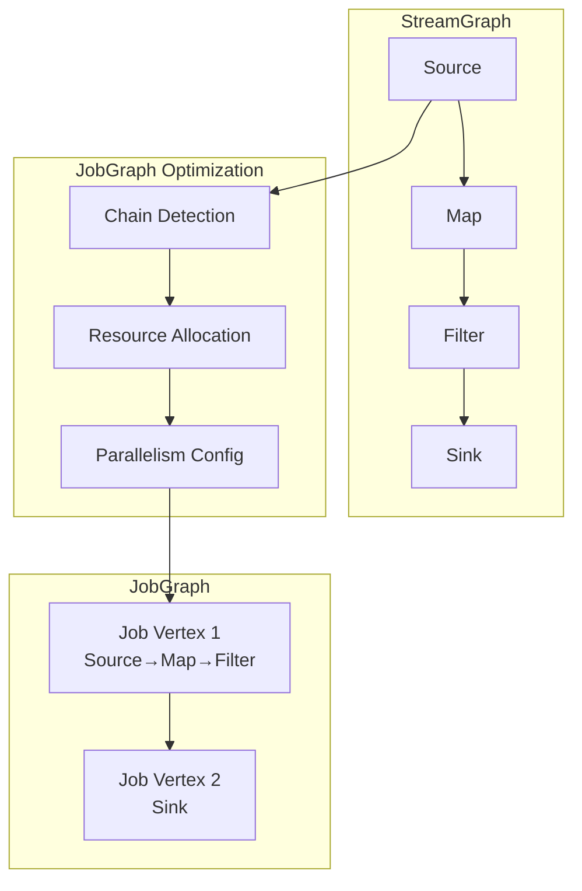

#### 3.3.3 Operator Chain优化

将满足以下条件的算子链接成一个执行单元：
- 上下游算子的并行度相同
- 下游算子只有一个输入
- 上游算子只有一个输出
- 两个算子的数据传输策略为FORWARD

#### 3.3.4 JobVertex定义

```java
public class JobVertex {
    private int vertexId;                      // 顶点ID
    private String vertexName;                 // 顶点名称
    private List<StreamNode> chainedNodes;     // 链接的节点列表
    private List<JobEdge> inputs;              // 输入边
    private List<JobEdge> outputs;             // 输出边
    private int parallelism;                   // 并行度
    private ResourceProfile resourceProfile;   // 资源配置
}
```

### 3.4 Job Scheduler模块

#### 3.4.1 设计理念

Job Scheduler负责任务的调度策略，支持多种触发方式：
- **立即执行**：任务创建后立即执行
- **定时执行**：按照Cron表达式定时触发
- **依赖触发**：上游任务完成后触发
- **事件触发**：外部事件触发

#### 3.4.2 调度策略

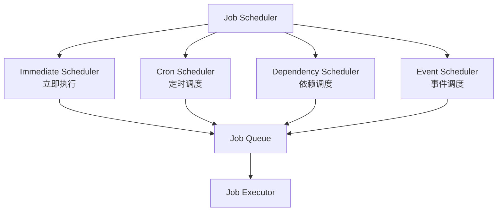

#### 3.4.3 调度器接口

```java
public interface JobScheduler {
    // 提交任务
    ScheduleResult schedule(Job job, SchedulePolicy policy);
    
    // 取消调度
    void cancel(String jobId);
    
    // 暂停调度
    void pause(String jobId);
    
    // 恢复调度
    void resume(String jobId);
    
    // 获取调度状态
    ScheduleStatus getStatus(String jobId);
}
```

#### 3.4.4 调度策略配置

```java
// 立即执行
SchedulePolicy.immediate()

// 每小时执行
SchedulePolicy.cron("0 0 * * * ?")

// 依赖上游任务
SchedulePolicy.dependsOn("upstream-job-id")

// 事件触发
SchedulePolicy.onEvent("data-arrived")
```

### 3.5 Job Executor模块

#### 3.5.1 设计理念

Job Executor是任务的实际执行引擎，负责将JobGraph转换为可执行的Reactor流，并管理执行过程。

#### 3.5.2 执行流程

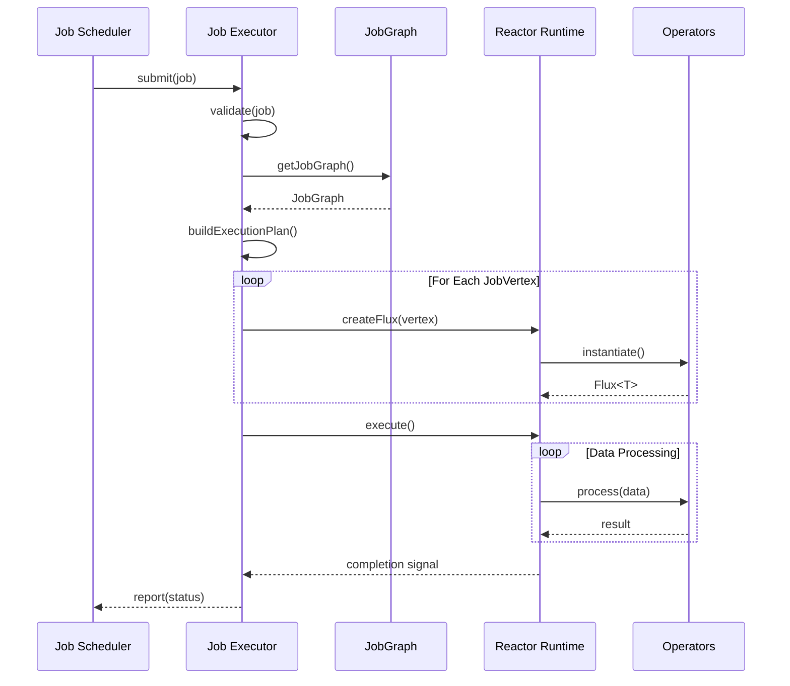

#### 3.5.3 执行器接口

```java
public interface JobExecutor {
    // 执行任务
    Mono<JobResult> execute(Job job);
    
    // 停止任务
    Mono<Void> stop(String jobId);
    
    // 获取执行状态
    ExecutionStatus getStatus(String jobId);
    
    // 获取执行指标
    ExecutionMetrics getMetrics(String jobId);
}
```

#### 3.5.4 执行模式

**单机执行模式**
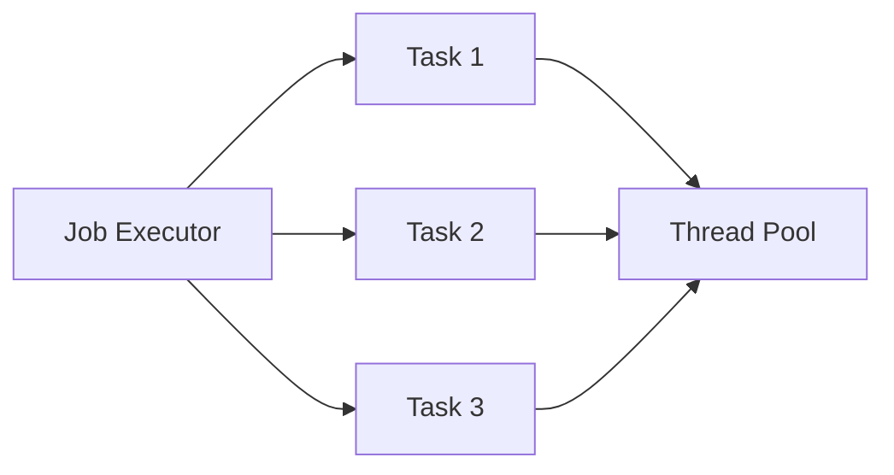

**分布式执行模式（未来扩展）**
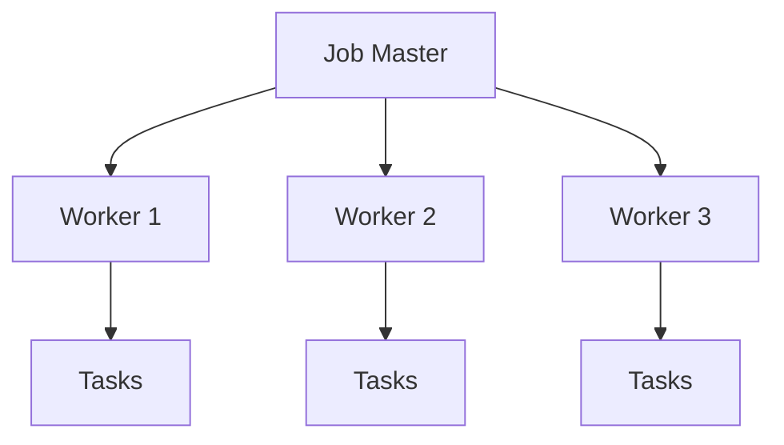

### 3.6 Source模块

#### 3.6.1 设计理念

Source是数据的入口，负责从外部系统读取数据并转换为响应式流。所有Source实现都必须支持背压机制。

#### 3.6.2 Source类型

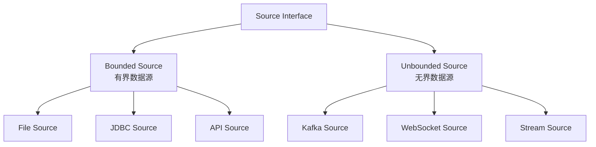

#### 3.6.3 Source接口定义

```java
public interface DataSource<T> {
    // 获取数据流
    Flux<T> getDataStream();
    
    // Source类型（有界/无界）
    SourceType getSourceType();
    
    // 是否支持并行读取
    boolean isParallel();
    
    // 生命周期管理
    void start();
    void stop();
}
```

### 3.7 Operator模块

#### 3.7.1 设计理念

Operator负责数据转换，分为无状态算子和有状态算子。算子可以链接成算子链，提高执行效率。

#### 3.7.2 Operator分类

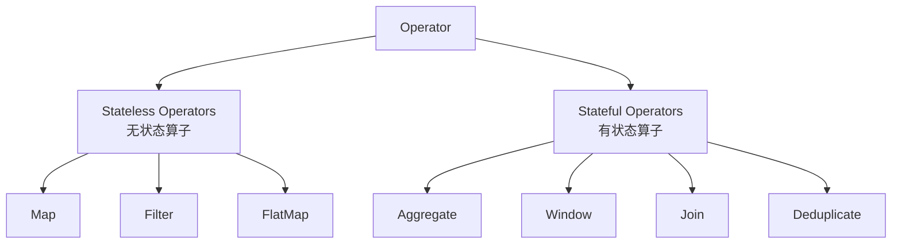

#### 3.7.3 Operator接口

```java
public interface Operator<IN, OUT> {
    // 应用转换
    Flux<OUT> apply(Flux<IN> input);
    
    // 是否有状态
    boolean isStateful();
    
    // 获取算子类型
    OperatorType getType();
}
```

#### 3.7.4 Operator Chain

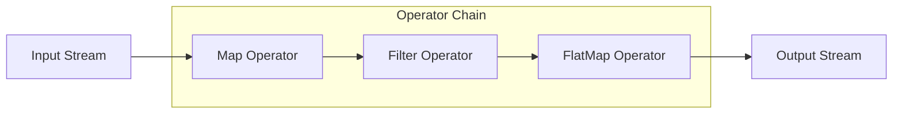

### 3.8 Sink模块

#### 3.8.1 设计理念

Sink是数据的出口，负责将处理后的数据写入外部系统。支持批量写入以提高效率。

#### 3.8.2 Sink类型

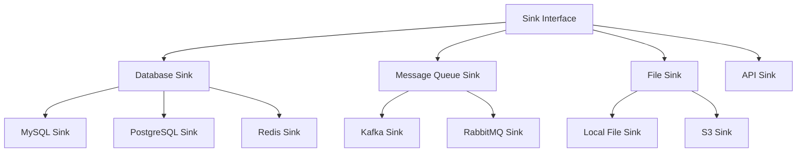

#### 3.8.3 Sink接口

```java
public interface DataSink<T> {
    // 写入数据
    Mono<Void> write(Flux<T> dataStream);
    
    // 是否支持批量写入
    boolean supportsBatch();
    
    // 是否支持事务
    boolean supportsTransaction();
    
    // 生命周期管理
    void start();
    void stop();
}
```

### 3.9 Connectors模块

#### 3.9.1 设计理念

Connectors提供统一的外部系统连接抽象，采用SPI机制实现插件化扩展。每个Connector可以提供Source和Sink实现。

#### 3.9.2 Connector架构

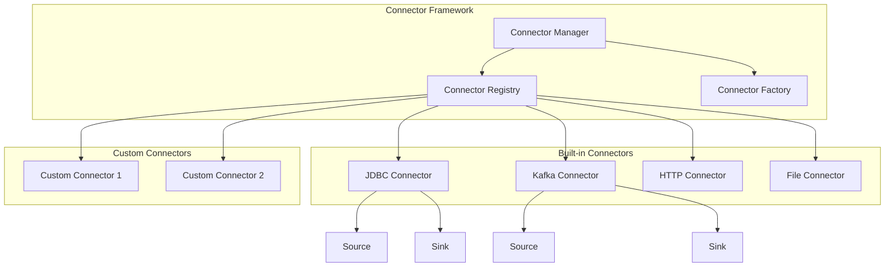

#### 3.9.3 Connector接口

```java
public interface Connector {
    // Connector标识
    String getType();
    
    // 创建Source
    <T> DataSource<T> createSource(SourceConfig config);
    
    // 创建Sink
    <T> DataSink<T> createSink(SinkConfig config);
    
    // 验证配置
    void validateConfig(ConnectorConfig config);
    
    // 获取配置描述
    ConfigDescriptor getConfigDescriptor();
}
```

#### 3.9.4 Connector配置示例

```yaml
# JDBC Connector配置
connectors:
  jdbc:
    type: jdbc
    driver: com.mysql.cj.jdbc.Driver
    url: jdbc:mysql://localhost:3306/db
    username: user
    password: password
    pool:
      maxSize: 20
      maxIdleTime: 30m
      
# Kafka Connector配置
  kafka:
    type: kafka
    bootstrapServers: localhost:9092
    consumerGroup: etl-consumer
    topics:
      - user-events
      - order-events
    properties:
      enable.auto.commit: false
      max.poll.records: 500
```

## 4. 模块交互流程

### 4.1 任务提交与执行流程

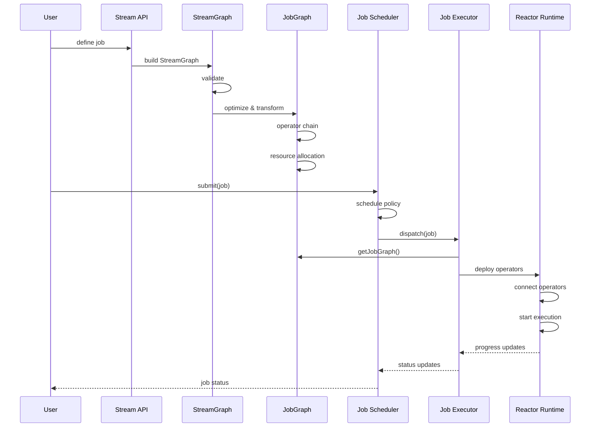

### 4.2 StreamGraph到JobGraph转换流程

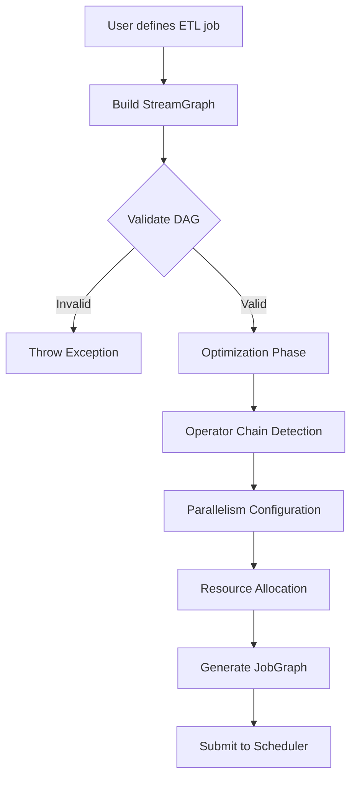

### 4.3 任务调度流程

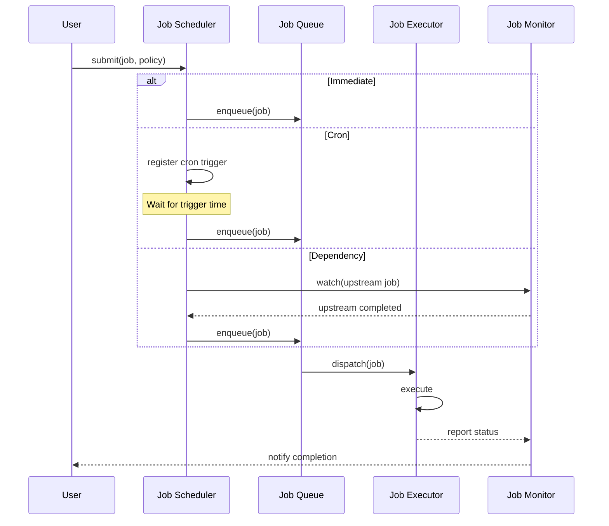

### 4.4 数据流执行流程

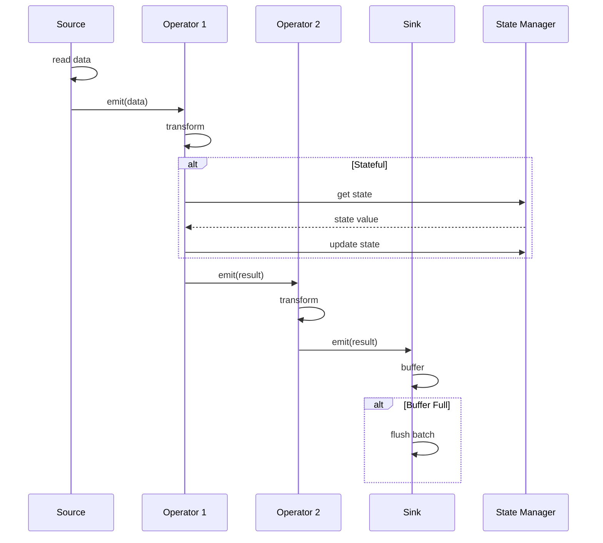

### 4.5 检查点协调流程

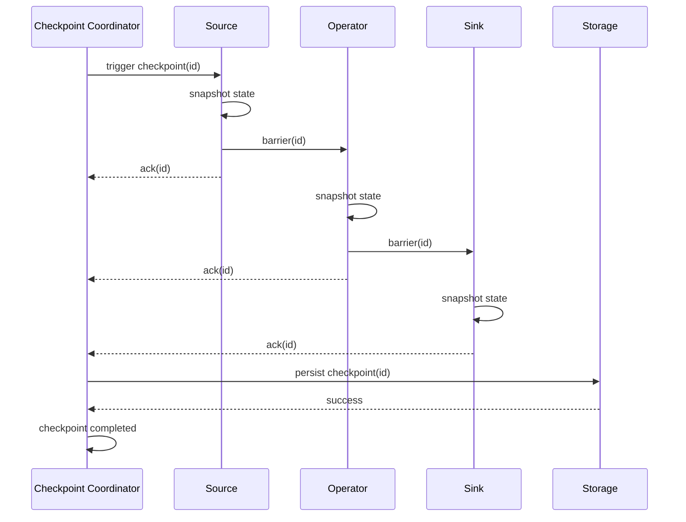

## 5. 关键设计决策

### 5.1 为什么需要StreamGraph和JobGraph两层抽象？

**StreamGraph（逻辑图）**
- 直接映射用户API，保持代码的清晰性
- 方便调试和问题定位
- 支持多种优化策略

**JobGraph（物理图）**
- 优化后的执行计划，提高运行效率
- 算子链合并，减少序列化开销
- 资源分配和并行度配置

### 5.2 Job Scheduler的设计考虑

**多种调度策略支持**
- 满足不同场景需求（实时、定时、依赖）
- 支持复杂的工作流编排

**任务优先级**
- 支持任务优先级设置
- 避免低优先级任务饥饿

**资源感知调度**
- 根据资源使用情况调度任务
- 避免资源竞争

### 5.3 响应式设计的优势

**背压机制**
- 自动调节数据流速
- 防止内存溢出

**非阻塞IO**
- 高效利用系统资源
- 支持高并发

**组合性**
- 算子可自由组合
- 代码简洁清晰

### 5.4 Connector插件化设计

**SPI机制**
- 支持第三方扩展
- 无需修改核心代码

**统一抽象**
- 降低学习成本
- 代码可复用

**配置驱动**
- 无需编译
- 灵活配置

## 6. 配置管理

### 6.1 系统配置

```yaml
# 系统全局配置
system:
  name: reactive-etl-framework
  version: 1.0.0
  
  # 执行器配置
  executor:
    type: single-node  # single-node / distributed
    parallelism: 4     # 默认并行度
    threadPool:
      coreSize: 10
      maxSize: 50
      queueCapacity: 1000
      
  # 调度器配置
  scheduler:
    type: quartz
    threadPoolSize: 20
    jobQueueSize: 1000
    
  # 检查点配置
  checkpoint:
    enabled: true
    interval: 60s
    timeout: 10s
    storage:
      type: filesystem
      path: /data/checkpoints
      
  # 状态后端配置
  state:
    backend: memory  # memory / rocksdb
    rocksdb:
      path: /data/state
      blockCacheSize: 256m
      
  # 监控配置
  metrics:
    enabled: true
    reporters:
      - type: prometheus
        port: 9090
      - type: slf4j
        interval: 60s
```

### 6.2 任务配置

```yaml
# ETL任务配置示例
job:
  id: user-etl-job
  name: User Data ETL
  type: streaming
  
  # 调度配置
  schedule:
    policy: cron
    expression: "0 0 * * * ?"
    timezone: Asia/Shanghai
    
  # 资源配置
  resources:
    parallelism: 8
    memory: 4g
    
  # Source配置
  source:
    connector: kafka
    type: kafka
    config:
      bootstrapServers: localhost:9092
      topics: [user-events]
      groupId: etl-consumer
      
  # Operator配置
  operators:
    - name: parse
      type: map
      parallelism: 8
      
    - name: filter
      type: filter
      parallelism: 8
      
    - name: aggregate
      type: window-aggregate
      parallelism: 4
      window:
        type: tumbling
        size: 5m
        
  # Sink配置
  sink:
    connector: jdbc
    type: jdbc
    config:
      url: jdbc:mysql://localhost:3306/warehouse
      table: user_stats
      batchSize: 100
      flushInterval: 5s
```

## 7. 监控与运维

### 7.1 监控指标体系

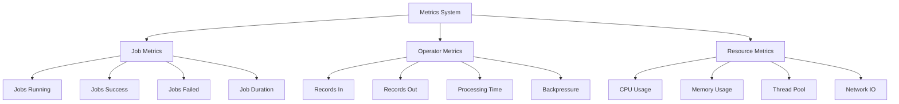

### 7.2 关键监控指标

| 指标类别 | 指标名称 | 说明 |
| --- | --- | --- |
| 任务指标 | job.running | 运行中的任务数 |
| 任务指标 | job.completed | 已完成的任务数 |
| 任务指标 | job.failed | 失败的任务数 |
| 任务指标 | job.duration | 任务执行时长 |
| 算子指标 | operator.records.in | 算子输入记录数 |
| 算子指标 | operator.records.out | 算子输出记录数 |
| 算子指标 | operator.processing.time | 处理时间 |
| 算子指标 | operator.backpressure | 背压事件 |
| 资源指标 | system.cpu.usage | CPU使用率 |
| 资源指标 | system.memory.usage | 内存使用率 |
| 资源指标 | threadpool.active | 活跃线程数 |
| 资源指标 | threadpool.queue.size | 队列大小 |

### 7.3 健康检查机制

```mermaid
flowchart TD
    HC[Health Check] --> JS[Job Scheduler Status]
    HC --> JE[Job Executor Status]
    HC --> CN[Connectors Status]
    
    JS --> JS1{Scheduler Running?}
    JS1 -->|Yes| JS2[Check Job Queue]
    JS1 -->|No| FAIL1[Health: DOWN]
    JS2 --> JS3{Queue Size Normal?}
    JS3 -->|Yes| OK1[Health: UP]
    JS3 -->|No| WARN1[Health: DEGRADED]
    
    JE --> JE1{Jobs Running?}
    JE1 -->|Yes| JE2[Check Backpressure]
    JE1 -->|No| OK2[Health: UP]
    JE2 --> JE3{Backpressure High?}
    JE3 -->|No| OK3[Health: UP]
    JE3 -->|Yes| WARN2[Health: DEGRADED]
    
    CN --> CN1{All Connectors Connected?}
    CN1 -->|Yes| OK4[Health: UP]
    CN1 -->|No| FAIL2[Health: DOWN]
```

### 7.4 日志规范

**日志级别使用规范**
- **TRACE**: 详细的执行追踪信息（生产环境关闭）
- **DEBUG**: 调试信息，帮助定位问题
- **INFO**: 关键业务事件（任务启动、完成、检查点等）
- **WARN**: 警告信息（重试、降级等）
- **ERROR**: 错误信息（任务失败、异常等）

**结构化日志示例**
```json
{
  "timestamp": "2025-11-09T10:30:00.000Z",
  "level": "INFO",
  "logger": "JobExecutor",
  "jobId": "job-123",
  "jobName": "user-etl",
  "event": "JOB_STARTED",
  "message": "Job started successfully",
  "metadata": {
    "parallelism": 8,
    "operators": 5
  }
}
```

## 8. 扩展性设计

### 8.1 自定义Connector开发

**步骤1：实现Connector接口**
```java
public class CustomConnector implements Connector {
    @Override
    public String getType() {
        return "custom";
    }
    
    @Override
    public <T> DataSource<T> createSource(SourceConfig config) {
        return new CustomSource<>(config);
    }
    
    @Override
    public <T> DataSink<T> createSink(SinkConfig config) {
        return new CustomSink<>(config);
    }
}
```

**步骤2：实现Source和Sink**
```java
public class CustomSource<T> implements DataSource<T> {
    @Override
    public Flux<T> getDataStream() {
        // 实现数据读取逻辑
    }
}

public class CustomSink<T> implements DataSink<T> {
    @Override
    public Mono<Void> write(Flux<T> dataStream) {
        // 实现数据写入逻辑
    }
}
```

**步骤3：注册Connector**
在`META-INF/services/com.framework.etl.Connector`文件中添加：
```
com.example.CustomConnector
```

### 8.2 自定义Operator开发

```java
public class CustomOperator<IN, OUT> implements Operator<IN, OUT> {
    
    @Override
    public Flux<OUT> apply(Flux<IN> input) {
        return input
            .map(this::transform)
            .filter(this::shouldKeep);
    }
    
    @Override
    public boolean isStateful() {
        return false;
    }
    
    private OUT transform(IN input) {
        // 转换逻辑
    }
    
    private boolean shouldKeep(OUT output) {
        // 过滤逻辑
    }
}
```

### 8.3 自定义调度策略

```java
public class CustomSchedulePolicy implements SchedulePolicy {
    
    @Override
    public Flux<Trigger> getTriggers() {
        // 返回触发信号流
        return Flux.interval(Duration.ofMinutes(30))
            .map(tick -> new Trigger(triggerTime));
    }
    
    @Override
    public boolean shouldExecute(Job job) {
        // 判断是否应该执行
        return checkConditions(job);
    }
}
```

## 9. 使用示例

### 9.1 快速开始：简单ETL任务

```java
// 创建Job
Job job = Job.builder()
    .name("simple-etl")
    .source(Connectors.kafka()
        .topic("user-events")
        .groupId("etl-consumer")
        .build())
    .transform(Operators.map(event -> parseUser(event)))
    .transform(Operators.filter(user -> user.isActive()))
    .sink(Connectors.jdbc()
        .table("users")
        .batchSize(100)
        .build())
    .build();

// 提交任务
jobScheduler.schedule(job, SchedulePolicy.immediate());
```

### 9.2 定时调度任务

```java
Job job = Job.builder()
    .name("daily-report")
    .source(Connectors.jdbc()
        .query("SELECT * FROM orders WHERE date = ?")
        .build())
    .transform(Operators.aggregate(
        Orders::getRegion,
        Orders::getAmount,
        Double::sum
    ))
    .sink(Connectors.file()
        .path("/reports/daily-{date}.csv")
        .build())
    .build();

// 每天凌晨1点执行
jobScheduler.schedule(job, SchedulePolicy.cron("0 0 1 * * ?"));
```

### 9.3 复杂的流处理任务

```java
StreamGraph graph = StreamGraph.builder()
    // Source
    .addSource("kafka-source", Connectors.kafka()
        .topics("events")
        .build())
    
    // Parse
    .addOperator("parse", Operators.map(msg -> parseEvent(msg)))
    
    // Branch 1: User events
    .addOperator("filter-user", Operators.filter(e -> e.isUserEvent()))
    .addOperator("user-aggregate", Operators.windowAggregate(
        Duration.ofMinutes(5),
        Events::getUserId,
        Collectors.counting()
    ))
    .addSink("user-sink", Connectors.jdbc().table("user_stats").build())
    
    // Branch 2: Order events
    .addOperator("filter-order", Operators.filter(e -> e.isOrderEvent()))
    .addOperator("order-aggregate", Operators.windowAggregate(
        Duration.ofMinutes(5),
        Events::getOrderId,
        Collectors.summingDouble(Events::getAmount)
    ))
    .addSink("order-sink", Connectors.jdbc().table("order_stats").build())
    
    // Connect edges
    .connect("kafka-source", "parse")
    .connect("parse", "filter-user")
    .connect("parse", "filter-order")
    .connect("filter-user", "user-aggregate")
    .connect("user-aggregate", "user-sink")
    .connect("filter-order", "order-aggregate")
    .connect("order-aggregate", "order-sink")
    
    .build();

// 转换为JobGraph并提交
JobGraph jobGraph = graph.toJobGraph();
Job job = new Job(jobGraph);
jobScheduler.schedule(job, SchedulePolicy.immediate());
```

## 10. 性能优化指南

### 10.1 并行度配置

```mermaid
graph LR
    subgraph "Low Parallelism"
        T1[Task 1] --> R1[Result]
    end
    
    subgraph "High Parallelism"
        T2[Task 1] --> R2[Result]
        T3[Task 2] --> R2
        T4[Task 3] --> R2
        T5[Task 4] --> R2
    end
```

**配置建议**
- CPU密集型：并行度 = CPU核心数
- IO密集型：并行度 = 2 * CPU核心数
- 根据数据量动态调整

### 10.2 批处理优化

```yaml
sink:
  batchSize: 100        # 批次大小
  flushInterval: 5s     # 刷新间隔
```

**权衡考虑**
- 批次越大，吞吐量越高，但延迟增加
- 批次越小，延迟越低，但吞吐量降低

### 10.3 背压控制策略

| 策略 | 说明 | 适用场景 |
| --- | --- | --- |
| BUFFER | 缓冲数据 | 临时性的速度不匹配 |
| DROP | 丢弃新数据 | 允许丢失部分数据 |
| LATEST | 保留最新数据 | 只关心最新状态 |
| ERROR | 抛出异常 | 不允许数据丢失 |

### 10.4 资源配置建议

```yaml
resources:
  # JVM配置
  jvm:
    heap: 4g
    metaspace: 512m
    gc: G1GC
    
  # 线程池配置
  threadPool:
    io:
      coreSize: 20
      maxSize: 100
    compute:
      coreSize: 8
      maxSize: 16
      
  # 缓冲区配置
  buffer:
    sourceBuffer: 1000
    sinkBuffer: 500
```

## 11. 容错与恢复

### 11.1 故障类型

```mermaid
graph TB
    Failures[Failure Types]
    
    Failures --> TF[Task Failures<br/>任务失败]
    Failures --> NF[Node Failures<br/>节点故障]
    Failures --> EF[External Failures<br/>外部系统故障]
    
    TF --> TF1[Data Error<br/>数据错误]
    TF --> TF2[Logic Error<br/>逻辑错误]
    
    NF --> NF1[Process Crash<br/>进程崩溃]
    NF --> NF2[Network Partition<br/>网络分区]
    
    EF --> EF1[Source Unavailable<br/>数据源不可用]
    EF --> EF2[Sink Unavailable<br/>目标系统不可用]
```

### 11.2 重启策略

```yaml
restart:
  # 固定延迟重启
  strategy: fixed-delay
  attempts: 3
  delay: 10s
  
  # 指数退避重启
  # strategy: exponential-backoff
  # initialDelay: 1s
  # maxDelay: 5m
  # multiplier: 2
  
  # 失败率重启
  # strategy: failure-rate
  # maxFailuresPerInterval: 3
  # failureRateInterval: 5m
  # delay: 10s
```

### 11.3 检查点恢复流程

```mermaid
sequenceDiagram
    participant Job
    participant Scheduler
    participant Executor
    participant Checkpoint
    participant State
    
    Note over Job: Job Failed
    
    Job->>Scheduler: report failure
    Scheduler->>Scheduler: apply restart strategy
    
    alt Should Restart
        Scheduler->>Checkpoint: get latest checkpoint
        Checkpoint-->>Scheduler: checkpoint-id
        
        Scheduler->>Executor: restart(job, checkpoint-id)
        Executor->>Checkpoint: load(checkpoint-id)
        Checkpoint->>State: restore state
        State-->>Executor: state restored
        
        Executor->>Executor: resume from checkpoint
        Executor-->>Scheduler: job restarted
    else Max Retries Exceeded
        Scheduler->>Scheduler: mark job as failed
        Scheduler-->>Job: job terminated
    end
```

## 12. 最佳实践

### 12.1 任务设计原则

1. **单一职责**：每个Job只负责一个业务逻辑
2. **幂等性**：确保任务可以安全重试
3. **可观测性**：添加足够的监控指标和日志
4. **容错性**：合理配置重试和检查点策略

### 12.2 性能优化建议

1. **合理设置并行度**：根据资源和数据量调整
2. **启用算子链**：减少序列化开销
3. **批量处理**：使用批量写入提高吞吐量
4. **状态管理**：大状态使用RocksDB后端

### 12.3 运维建议

1. **监控告警**：设置关键指标告警阈值
2. **定期备份**：定期备份检查点数据
3. **资源隔离**：不同优先级任务使用不同资源池
4. **灰度发布**：新版本先小流量验证

## 13. 未来规划

### 13.1 短期规划（3-6个月）

- 完善Connector生态（MongoDB、ClickHouse、HBase）
- 实现分布式执行模式
- 提供Web管理界面
- 支持SQL API

### 13.2 中期规划（6-12个月）

- 实现Exactly-Once语义
- 支持动态扩缩容
- 机器学习特征工程集成
- 流批一体架构

### 13.3 长期规划（1-2年）

- 云原生支持（Kubernetes Operator）
- 多租户隔离
- 实时数据质量监控
- 智能资源调度

## 14. 参考资料

### 14.1 技术栈

- **响应式编程**: Project Reactor 3.5+
- **任务调度**: Quartz Scheduler
- **状态存储**: RocksDB
- **监控**: Micrometer + Prometheus
- **序列化**: Protobuf / Avro

### 14.2 设计参考

- Apache Flink架构设计
- Apache Kafka Streams
- Spring Cloud Data Flow
- Reactive Streams规范

### 14.3 相关文档

- [Project Reactor官方文档](https://projectreactor.io/docs)
- [Reactive Streams规范](https://www.reactive-streams.org/)
- [Apache Flink文档](https://flink.apache.org/)

## 15. 术语表

| 术语 | 英文 | 说明 |
| --- | --- | --- |
| 任务 | Job | 完整的ETL处理流程 |
| 流图 | StreamGraph | 用户定义的逻辑执行图 |
| 任务图 | JobGraph | 优化后的物理执行图 |
| 调度器 | Scheduler | 任务调度组件 |
| 执行器 | Executor | 任务执行引擎 |
| 数据源 | Source | 数据输入 |
| 算子 | Operator | 数据转换 |
| 输出 | Sink | 数据输出 |
| 连接器 | Connector | 外部系统连接 |
| 背压 | Backpressure | 流量控制机制 |
| 检查点 | Checkpoint | 状态快照 |
| 算子链 | Operator Chain | 算子优化合并 |

---

**文档版本**: v2.0  
**最后更新**: 2025-11-09  
**维护者**: ETL Framework Team
