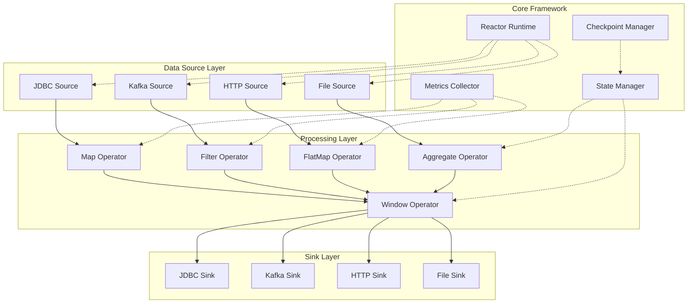
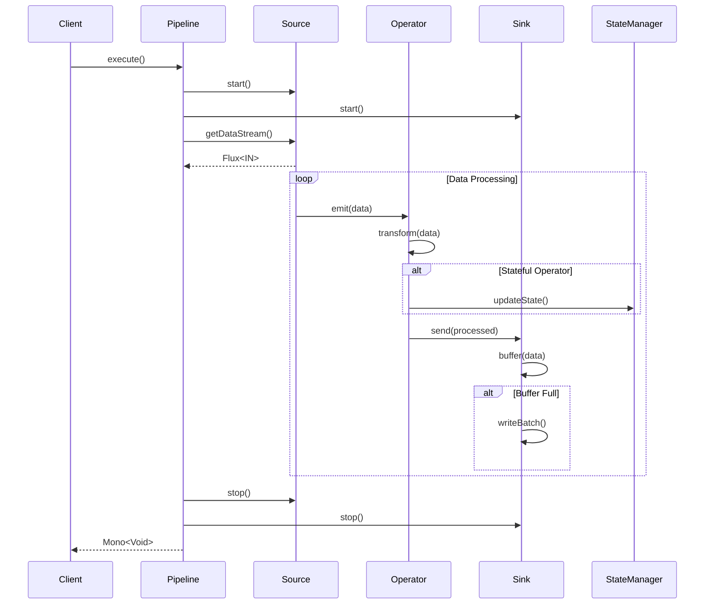
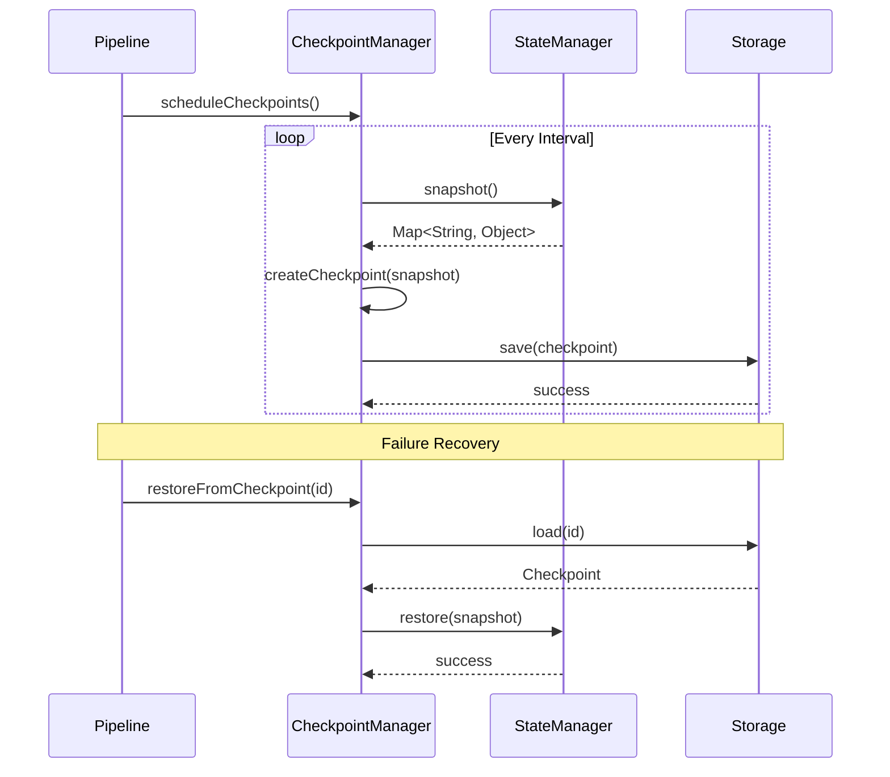
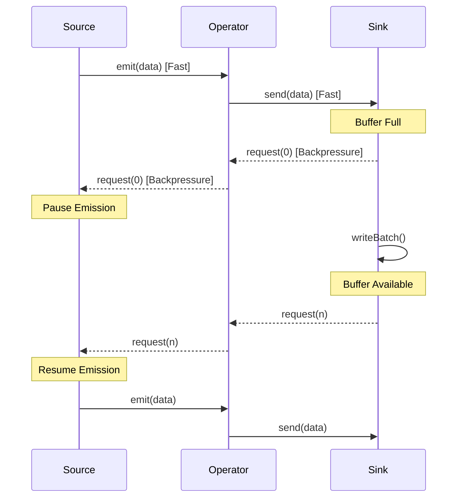
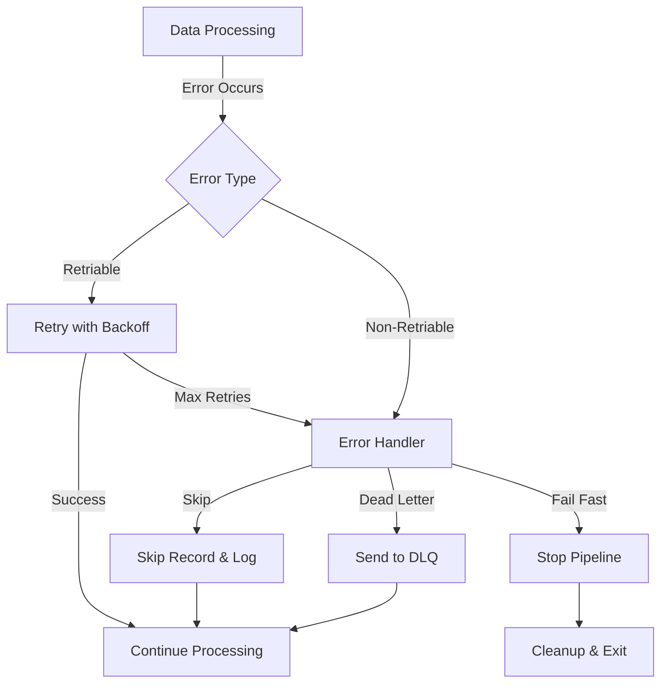

# 响应式ETL框架设计文档

## 1. 概述

### 1.1 项目背景

本项目旨在设计并实现一个基于响应式编程模型的轻量级ETL（Extract-Transform-Load）数据采集框架。该框架借鉴Apache Flink的设计理念，采用Source、Operator、Sink的经典数据处理模型，并基于Project Reactor实现完全响应式的数据流处理。

### 1.2 设计目标

- **响应式流处理**：基于Reactor实现非阻塞、背压支持的数据流处理
- **模块化设计**：清晰的Source、Operator、Sink三层架构，易于扩展
- **高性能**：充分利用响应式编程的优势，支持高吞吐量数据处理
- **易用性**：提供简洁的API，降低开发门槛
- **可观测性**：内置监控指标和日志，方便运维调试

### 1.3 核心特性

- 支持多种数据源接入（JDBC、Kafka、HTTP、File等）
- 丰富的数据转换算子（Map、Filter、FlatMap、Aggregate等）
- 灵活的数据输出（Database、MQ、File、API等）
- 内置背压机制，防止内存溢出
- 支持有状态计算和窗口操作
- 支持Checkpoint容错机制

## 2. 系统架构

### 2.1 整体架构图



### 2.2 架构分层说明

#### 2.2.1 数据源层（Source Layer）
负责从各种外部系统采集数据，将数据转换为响应式流（Flux/Mono）。每个Source都需要实现背压支持，避免生产速度过快导致下游处理不及。

#### 2.2.2 处理层（Processing Layer）
核心数据转换层，包含各种Operator算子。每个算子都是无状态或有状态的转换操作，可以链式组合。

#### 2.2.3 输出层（Sink Layer）
将处理后的数据输出到目标系统，支持批量写入和流式写入。

#### 2.2.4 框架核心（Core Framework）
- **Reactor Runtime**：响应式运行时，管理整个数据流的执行
- **State Manager**：状态管理器，支持有状态计算
- **Checkpoint Manager**：检查点管理，实现容错恢复
- **Metrics Collector**：指标收集器，收集运行时指标

## 3. 核心模块设计

### 3.1 Source模块

#### 3.1.1 接口设计

```java
/**
 * 数据源接口
 * 所有数据源必须实现此接口
 */
public interface DataSource<T> {
    
    /**
     * 获取数据流
     * @return 响应式数据流
     */
    Flux<T> getDataStream();
    
    /**
     * 获取Source配置
     */
    SourceConfig getConfig();
    
    /**
     * 启动数据源
     */
    void start();
    
    /**
     * 停止数据源
     */
    void stop();
    
    /**
     * 获取Source名称
     */
    String getName();
}
```

#### 3.1.2 核心实现类

**AbstractDataSource**：提供通用的Source基础实现
```java
public abstract class AbstractDataSource<T> implements DataSource<T> {
    protected final SourceConfig config;
    protected final MetricsCollector metrics;
    protected volatile boolean running;
    
    // 提供通用的启动、停止、指标收集等功能
    // 子类只需实现具体的数据读取逻辑
}
```

**JdbcSource**：从数据库读取数据
```java
public class JdbcSource extends AbstractDataSource<Row> {
    @Override
    public Flux<Row> getDataStream() {
        return Flux.defer(() -> {
            // 使用r2dbc-pool进行响应式数据库查询
            return connectionFactory.create()
                .flatMapMany(conn -> conn.createStatement(sql)
                    .execute())
                .flatMap(result -> result.map((row, metadata) -> 
                    convertToRow(row)));
        })
        .doOnNext(row -> metrics.recordRead())
        .onBackpressureBuffer(config.getBufferSize());
    }
}
```

**KafkaSource**：从Kafka读取数据
```java
public class KafkaSource extends AbstractDataSource<Message> {
    @Override
    public Flux<Message> getDataStream() {
        return KafkaReceiver.create(receiverOptions)
            .receive()
            .map(record -> new Message(record))
            .doOnNext(msg -> metrics.recordRead());
    }
}
```

#### 3.1.3 设计要点

1. **背压支持**：使用`onBackpressureBuffer`或`onBackpressureDrop`控制数据流速
2. **资源管理**：在stop方法中释放连接、文件句柄等资源
3. **可配置性**：通过SourceConfig统一管理配置项
4. **监控指标**：记录读取速率、错误率等关键指标

### 3.2 Operator模块

#### 3.2.1 接口设计

```java
/**
 * 算子接口
 * 负责对数据流进行转换操作
 */
public interface Operator<IN, OUT> {
    
    /**
     * 应用转换操作
     * @param input 输入数据流
     * @return 输出数据流
     */
    Flux<OUT> apply(Flux<IN> input);
    
    /**
     * 获取算子名称
     */
    String getName();
    
    /**
     * 是否为有状态算子
     */
    boolean isStateful();
}
```

#### 3.2.2 核心算子实现

**MapOperator**：映射转换
```java
public class MapOperator<IN, OUT> implements Operator<IN, OUT> {
    private final Function<IN, OUT> mapper;
    
    @Override
    public Flux<OUT> apply(Flux<IN> input) {
        return input.map(mapper)
            .doOnNext(item -> metrics.recordProcess());
    }
}
```

**FilterOperator**：数据过滤
```java
public class FilterOperator<T> implements Operator<T, T> {
    private final Predicate<T> predicate;
    
    @Override
    public Flux<T> apply(Flux<T> input) {
        return input.filter(predicate)
            .doOnDiscard(Object.class, 
                item -> metrics.recordFiltered());
    }
}
```

**FlatMapOperator**：一对多转换
```java
public class FlatMapOperator<IN, OUT> implements Operator<IN, OUT> {
    private final Function<IN, Publisher<OUT>> mapper;
    
    @Override
    public Flux<OUT> apply(Flux<IN> input) {
        return input.flatMap(mapper, 
            config.getConcurrency())
            .doOnNext(item -> metrics.recordProcess());
    }
}
```

**AggregateOperator**：聚合计算（有状态）
```java
public class AggregateOperator<T, ACC> implements Operator<T, ACC> {
    private final Supplier<ACC> initialState;
    private final BiFunction<ACC, T, ACC> accumulator;
    private final StateManager stateManager;
    
    @Override
    public Flux<ACC> apply(Flux<T> input) {
        return input
            .scan(initialState.get(), accumulator)
            .doOnNext(acc -> stateManager.updateState(acc));
    }
    
    @Override
    public boolean isStateful() {
        return true;
    }
}
```

**WindowOperator**：窗口计算（有状态）
```java
public class WindowOperator<T> implements Operator<T, Flux<T>> {
    private final Duration windowSize;
    private final Duration windowSlide;
    
    @Override
    public Flux<Flux<T>> apply(Flux<T> input) {
        return input.window(windowSize)
            .doOnNext(window -> metrics.recordWindow());
    }
}
```

#### 3.2.3 算子链（Operator Chain）

```java
/**
 * 算子链，将多个算子组合成一个处理链路
 */
public class OperatorChain<IN, OUT> {
    private final List<Operator<?, ?>> operators;
    
    public Flux<OUT> execute(Flux<IN> input) {
        Flux<?> current = input;
        for (Operator<?, ?> operator : operators) {
            current = ((Operator) operator).apply(current);
        }
        return (Flux<OUT>) current;
    }
    
    public OperatorChain<IN, OUT> addOperator(Operator<?, ?> operator) {
        operators.add(operator);
        return this;
    }
}
```

#### 3.2.4 设计要点

1. **无状态优先**：尽量设计无状态算子，便于水平扩展
2. **状态管理**：有状态算子需要配合StateManager使用
3. **异常处理**：使用`onErrorResume`或`retry`处理异常
4. **性能优化**：使用`publishOn`和`subscribeOn`控制执行线程

### 3.3 Sink模块

#### 3.3.1 接口设计

```java
/**
 * 数据输出接口
 */
public interface DataSink<T> {
    
    /**
     * 写入数据
     * @param dataStream 数据流
     * @return 完成信号
     */
    Mono<Void> write(Flux<T> dataStream);
    
    /**
     * 获取Sink配置
     */
    SinkConfig getConfig();
    
    /**
     * 启动Sink
     */
    void start();
    
    /**
     * 停止Sink
     */
    void stop();
    
    /**
     * 获取Sink名称
     */
    String getName();
}
```

#### 3.3.2 核心实现类

**AbstractDataSink**：提供通用的Sink基础实现
```java
public abstract class AbstractDataSink<T> implements DataSink<T> {
    protected final SinkConfig config;
    protected final MetricsCollector metrics;
    
    @Override
    public Mono<Void> write(Flux<T> dataStream) {
        return dataStream
            .buffer(config.getBatchSize(), 
                Duration.ofSeconds(config.getBatchTimeout()))
            .flatMap(batch -> writeBatch(batch))
            .then();
    }
    
    /**
     * 批量写入
     */
    protected abstract Mono<Void> writeBatch(List<T> batch);
}
```

**JdbcSink**：写入数据库
```java
public class JdbcSink extends AbstractDataSink<Row> {
    
    @Override
    protected Mono<Void> writeBatch(List<Row> batch) {
        return connectionFactory.create()
            .flatMap(conn -> {
                Statement statement = conn.createStatement(insertSql);
                batch.forEach(row -> bindParameters(statement, row));
                return Flux.from(statement.execute())
                    .flatMap(Result::getRowsUpdated)
                    .reduce(0L, Long::sum)
                    .doOnNext(count -> metrics.recordWrite(count));
            })
            .then();
    }
}
```

**KafkaSink**：写入Kafka
```java
public class KafkaSink extends AbstractDataSink<Message> {
    
    @Override
    protected Mono<Void> writeBatch(List<Message> batch) {
        return kafkaSender.send(
            Flux.fromIterable(batch)
                .map(msg -> SenderRecord.create(
                    new ProducerRecord<>(topic, msg.getKey(), msg.getValue()),
                    msg.getId()
                ))
        )
        .doOnNext(result -> metrics.recordWrite())
        .then();
    }
}
```

#### 3.3.3 设计要点

1. **批量写入**：使用buffer聚合批量数据，提高写入效率
2. **错误重试**：实现重试机制，保证数据不丢失
3. **事务支持**：对于数据库Sink，支持事务写入
4. **背压处理**：当写入速度跟不上时，利用背压机制通知上游

### 3.4 Pipeline模块

Pipeline是整个ETL任务的编排器，负责将Source、Operator、Sink组合成完整的数据处理流程。

```java
/**
 * ETL Pipeline
 */
public class DataPipeline<IN, OUT> {
    private final DataSource<IN> source;
    private final OperatorChain<IN, OUT> operatorChain;
    private final DataSink<OUT> sink;
    private final PipelineConfig config;
    
    /**
     * 执行Pipeline
     */
    public Mono<Void> execute() {
        return Mono.defer(() -> {
            // 启动各个组件
            source.start();
            sink.start();
            
            // 构建数据流
            Flux<IN> sourceStream = source.getDataStream();
            Flux<OUT> processedStream = operatorChain.execute(sourceStream);
            
            // 写入Sink
            return sink.write(processedStream)
                .doFinally(signal -> cleanup());
        });
    }
    
    private void cleanup() {
        source.stop();
        sink.stop();
    }
}
```

### 3.5 状态管理模块

#### 3.5.1 State接口

```java
/**
 * 状态接口
 */
public interface State<T> {
    
    /**
     * 获取状态值
     */
    T get();
    
    /**
     * 更新状态值
     */
    void update(T value);
    
    /**
     * 清空状态
     */
    void clear();
}
```

#### 3.5.2 StateManager

```java
/**
 * 状态管理器
 */
public class StateManager {
    private final Map<String, State<?>> states = new ConcurrentHashMap<>();
    private final CheckpointManager checkpointManager;
    
    /**
     * 注册状态
     */
    public <T> State<T> registerState(String name, Class<T> type) {
        State<T> state = new InMemoryState<>();
        states.put(name, state);
        return state;
    }
    
    /**
     * 获取状态
     */
    public <T> State<T> getState(String name) {
        return (State<T>) states.get(name);
    }
    
    /**
     * 创建快照
     */
    public Map<String, Object> snapshot() {
        return states.entrySet().stream()
            .collect(Collectors.toMap(
                Map.Entry::getKey,
                e -> e.getValue().get()
            ));
    }
    
    /**
     * 恢复快照
     */
    public void restore(Map<String, Object> snapshot) {
        snapshot.forEach((key, value) -> {
            State state = states.get(key);
            if (state != null) {
                state.update(value);
            }
        });
    }
}
```

### 3.6 检查点模块

```java
/**
 * 检查点管理器
 */
public class CheckpointManager {
    private final Duration checkpointInterval;
    private final StateManager stateManager;
    private final CheckpointStorage storage;
    
    /**
     * 定期执行检查点
     */
    public Flux<Checkpoint> scheduleCheckpoints() {
        return Flux.interval(checkpointInterval)
            .flatMap(tick -> createCheckpoint());
    }
    
    /**
     * 创建检查点
     */
    private Mono<Checkpoint> createCheckpoint() {
        return Mono.fromCallable(() -> {
            long checkpointId = System.currentTimeMillis();
            Map<String, Object> snapshot = stateManager.snapshot();
            
            Checkpoint checkpoint = new Checkpoint(checkpointId, snapshot);
            storage.save(checkpoint);
            
            return checkpoint;
        });
    }
    
    /**
     * 从检查点恢复
     */
    public Mono<Void> restoreFromCheckpoint(long checkpointId) {
        return storage.load(checkpointId)
            .doOnNext(checkpoint -> 
                stateManager.restore(checkpoint.getSnapshot()))
            .then();
    }
}
```

### 3.7 指标收集模块

```java
/**
 * 指标收集器
 */
public class MetricsCollector {
    private final MeterRegistry registry;
    
    // 计数器
    private final Counter recordsRead;
    private final Counter recordsProcessed;
    private final Counter recordsWritten;
    private final Counter recordsFiltered;
    private final Counter errors;
    
    // 计时器
    private final Timer processingTime;
    
    // 仪表盘
    private final Gauge backpressure;
    
    /**
     * 记录读取
     */
    public void recordRead() {
        recordsRead.increment();
    }
    
    /**
     * 记录处理
     */
    public void recordProcess() {
        recordsProcessed.increment();
    }
    
    /**
     * 记录写入
     */
    public void recordWrite(long count) {
        recordsWritten.increment(count);
    }
    
    /**
     * 记录耗时
     */
    public void recordProcessingTime(Duration duration) {
        processingTime.record(duration);
    }
}
```

## 4. 关键流程设计

### 4.1 数据流执行流程



### 4.2 检查点流程



### 4.3 背压处理流程



### 4.4 错误处理流程



## 5. 使用示例

### 5.1 简单的ETL任务

```java
/**
 * 从MySQL读取数据，过滤后写入Kafka
 */
public class SimpleETLJob {
    
    public static void main(String[] args) {
        // 1. 配置Source
        JdbcSourceConfig sourceConfig = JdbcSourceConfig.builder()
            .url("jdbc:mysql://localhost:3306/db")
            .username("user")
            .password("password")
            .query("SELECT * FROM users WHERE updated_at > ?")
            .build();
        
        DataSource<Row> source = new JdbcSource(sourceConfig);
        
        // 2. 配置Operator
        OperatorChain<Row, UserEvent> chain = new OperatorChain<>();
        chain.addOperator(new MapOperator<>(row -> convertToUser(row)))
            .addOperator(new FilterOperator<>(user -> user.getAge() > 18))
            .addOperator(new MapOperator<>(user -> new UserEvent(user)));
        
        // 3. 配置Sink
        KafkaSinkConfig sinkConfig = KafkaSinkConfig.builder()
            .bootstrapServers("localhost:9092")
            .topic("user-events")
            .batchSize(100)
            .build();
        
        DataSink<UserEvent> sink = new KafkaSink(sinkConfig);
        
        // 4. 创建Pipeline
        DataPipeline<Row, UserEvent> pipeline = DataPipeline.builder()
            .source(source)
            .operatorChain(chain)
            .sink(sink)
            .build();
        
        // 5. 执行
        pipeline.execute()
            .doOnError(e -> log.error("Pipeline failed", e))
            .doOnSuccess(v -> log.info("Pipeline completed"))
            .block();
    }
}
```

### 5.2 有状态的聚合任务

```java
/**
 * 实时统计每个用户的访问次数
 */
public class AggregationJob {
    
    public static void main(String[] args) {
        // Source: Kafka
        KafkaSource source = new KafkaSource(kafkaConfig);
        
        // Operator Chain
        OperatorChain<Message, UserStats> chain = new OperatorChain<>();
        
        // 1. 解析消息
        chain.addOperator(new MapOperator<>(msg -> parseEvent(msg)));
        
        // 2. 按用户ID分组窗口聚合
        chain.addOperator(new WindowOperator<>(
            Duration.ofMinutes(5),
            Duration.ofMinutes(1)
        ));
        
        // 3. 聚合计算
        chain.addOperator(new AggregateOperator<>(
            () -> new HashMap<String, Long>(),
            (map, event) -> {
                map.merge(event.getUserId(), 1L, Long::sum);
                return map;
            }
        ));
        
        // 4. 转换为输出格式
        chain.addOperator(new FlatMapOperator<>(map -> 
            Flux.fromIterable(map.entrySet())
                .map(entry -> new UserStats(entry.getKey(), entry.getValue()))
        ));
        
        // Sink: Redis
        RedisSink sink = new RedisSink(redisConfig);
        
        // Pipeline配置
        PipelineConfig config = PipelineConfig.builder()
            .checkpointInterval(Duration.ofMinutes(1))
            .enableMetrics(true)
            .build();
        
        DataPipeline<Message, UserStats> pipeline = DataPipeline.builder()
            .source(source)
            .operatorChain(chain)
            .sink(sink)
            .config(config)
            .build();
        
        // 执行
        pipeline.execute().block();
    }
}
```

### 5.3 使用Fluent API

```java
/**
 * 使用链式API构建Pipeline
 */
public class FluentAPIExample {
    
    public static void main(String[] args) {
        Pipeline.create()
            // Source
            .fromJdbc(jdbcConfig)
            
            // Operators
            .map(row -> convertToUser(row))
            .filter(user -> user.isActive())
            .flatMap(user -> enrichUserData(user))
            
            // Window & Aggregate
            .window(Duration.ofMinutes(5))
            .reduce(new HashMap<>(), (map, user) -> {
                map.merge(user.getCity(), 1L, Long::sum);
                return map;
            })
            
            // Sink
            .toKafka(kafkaConfig)
            
            // Execute
            .execute()
            .subscribe(
                null,
                error -> log.error("Error", error),
                () -> log.info("Completed")
            );
    }
}
```

## 6. 开发指南

### 6.1 开发环境准备

#### 6.1.1 依赖管理

Maven依赖配置：

```xml
<dependencies>
    <!-- Reactor Core -->
    <dependency>
        <groupId>io.projectreactor</groupId>
        <artifactId>reactor-core</artifactId>
        <version>3.5.0</version>
    </dependency>
    
    <!-- Reactor Kafka -->
    <dependency>
        <groupId>io.projectreactor.kafka</groupId>
        <artifactId>reactor-kafka</artifactId>
        <version>1.3.12</version>
    </dependency>
    
    <!-- R2DBC for reactive database access -->
    <dependency>
        <groupId>io.r2dbc</groupId>
        <artifactId>r2dbc-pool</artifactId>
        <version>1.0.0.RELEASE</version>
    </dependency>
    
    <!-- Micrometer for metrics -->
    <dependency>
        <groupId>io.micrometer</groupId>
        <artifactId>micrometer-core</artifactId>
        <version>1.10.0</version>
    </dependency>
    
    <!-- Testing -->
    <dependency>
        <groupId>io.projectreactor</groupId>
        <artifactId>reactor-test</artifactId>
        <version>3.5.0</version>
        <scope>test</scope>
    </dependency>
</dependencies>
```

#### 6.1.2 项目结构

```
reactive-etl-framework/
├── etl-core/                    # 核心框架
│   ├── api/                     # API接口定义
│   ├── runtime/                 # 运行时实现
│   ├── state/                   # 状态管理
│   └── checkpoint/              # 检查点
├── etl-connectors/              # 连接器
│   ├── jdbc/                    # JDBC连接器
│   ├── kafka/                   # Kafka连接器
│   ├── http/                    # HTTP连接器
│   └── file/                    # 文件连接器
├── etl-operators/               # 算子库
│   ├── transform/               # 转换算子
│   ├── aggregate/               # 聚合算子
│   └── window/                  # 窗口算子
├── etl-metrics/                 # 监控指标
├── etl-examples/                # 示例代码
└── etl-tests/                   # 集成测试
```

### 6.2 自定义Source开发

实现自定义Source的步骤：

```java
/**
 * 自定义HTTP Source示例
 */
public class CustomHttpSource extends AbstractDataSource<HttpResponse> {
    
    private final WebClient webClient;
    private final String url;
    private final Duration pollingInterval;
    
    public CustomHttpSource(HttpSourceConfig config) {
        super(config);
        this.url = config.getUrl();
        this.pollingInterval = config.getPollingInterval();
        this.webClient = WebClient.builder()
            .baseUrl(url)
            .build();
    }
    
    @Override
    public Flux<HttpResponse> getDataStream() {
        return Flux.interval(pollingInterval)
            .flatMap(tick -> fetchData())
            .doOnNext(response -> metrics.recordRead())
            .onBackpressureBuffer(config.getBufferSize())
            .doOnError(e -> log.error("Error fetching data", e))
            .retry(3);
    }
    
    private Mono<HttpResponse> fetchData() {
        return webClient.get()
            .retrieve()
            .bodyToMono(HttpResponse.class)
            .timeout(Duration.ofSeconds(30));
    }
    
    @Override
    public void start() {
        log.info("Starting HTTP Source: {}", url);
        running = true;
    }
    
    @Override
    public void stop() {
        log.info("Stopping HTTP Source: {}", url);
        running = false;
    }
}
```

**开发要点**：
1. 继承`AbstractDataSource`复用通用逻辑
2. 实现`getDataStream()`方法返回响应式流
3. 正确处理背压（使用buffer或drop策略）
4. 添加错误处理和重试机制
5. 记录监控指标

### 6.3 自定义Operator开发

```java
/**
 * 自定义去重算子
 */
public class DeduplicateOperator<T> implements Operator<T, T> {
    
    private final Function<T, String> keyExtractor;
    private final Duration windowDuration;
    private final StateManager stateManager;
    
    public DeduplicateOperator(Function<T, String> keyExtractor, 
                               Duration windowDuration) {
        this.keyExtractor = keyExtractor;
        this.windowDuration = windowDuration;
        this.stateManager = new StateManager();
    }
    
    @Override
    public Flux<T> apply(Flux<T> input) {
        State<Set<String>> seenKeys = stateManager.registerState(
            "seen-keys", 
            (Class<Set<String>>) (Class<?>) Set.class
        );
        
        return input
            .filter(item -> {
                String key = keyExtractor.apply(item);
                Set<String> seen = seenKeys.get();
                
                if (seen == null) {
                    seen = ConcurrentHashMap.newKeySet();
                    seenKeys.update(seen);
                }
                
                boolean isNew = seen.add(key);
                if (!isNew) {
                    metrics.recordDuplicate();
                }
                return isNew;
            })
            .doOnNext(item -> metrics.recordProcess());
    }
    
    @Override
    public String getName() {
        return "deduplicate";
    }
    
    @Override
    public boolean isStateful() {
        return true;
    }
}
```

**开发要点**：
1. 实现`Operator`接口
2. 无状态算子直接使用Reactor的操作符
3. 有状态算子需要使用StateManager管理状态
4. 注意线程安全（使用ConcurrentHashMap等）
5. 正确标识算子是否有状态

### 6.4 自定义Sink开发

```java
/**
 * 自定义ElasticSearch Sink
 */
public class ElasticsearchSink extends AbstractDataSink<Document> {
    
    private final RestClient esClient;
    private final String indexName;
    
    public ElasticsearchSink(EsSinkConfig config) {
        super(config);
        this.indexName = config.getIndexName();
        this.esClient = RestClient.builder(
            new HttpHost(config.getHost(), config.getPort())
        ).build();
    }
    
    @Override
    protected Mono<Void> writeBatch(List<Document> batch) {
        return Mono.fromCallable(() -> {
            BulkRequest bulkRequest = new BulkRequest();
            
            batch.forEach(doc -> {
                IndexRequest request = new IndexRequest(indexName)
                    .id(doc.getId())
                    .source(doc.toMap());
                bulkRequest.add(request);
            });
            
            BulkResponse response = esClient.bulk(bulkRequest);
            
            if (response.hasFailures()) {
                log.error("Bulk write failed: {}", 
                    response.buildFailureMessage());
                throw new RuntimeException("ES write failed");
            }
            
            metrics.recordWrite(batch.size());
            return null;
        })
        .subscribeOn(Schedulers.boundedElastic())
        .then();
    }
    
    @Override
    public void stop() {
        try {
            esClient.close();
        } catch (IOException e) {
            log.error("Error closing ES client", e);
        }
    }
}
```

**开发要点**：
1. 继承`AbstractDataSink`自动获得批处理能力
2. 实现`writeBatch()`方法执行批量写入
3. 对于阻塞IO，使用`subscribeOn(Schedulers.boundedElastic())`
4. 实现错误处理和重试逻辑
5. 在stop方法中释放资源

### 6.5 单元测试

```java
/**
 * 使用Reactor Test进行单元测试
 */
public class OperatorTest {
    
    @Test
    public void testMapOperator() {
        MapOperator<Integer, String> operator = 
            new MapOperator<>(i -> "value-" + i);
        
        Flux<Integer> input = Flux.just(1, 2, 3);
        
        StepVerifier.create(operator.apply(input))
            .expectNext("value-1")
            .expectNext("value-2")
            .expectNext("value-3")
            .verifyComplete();
    }
    
    @Test
    public void testFilterOperator() {
        FilterOperator<Integer> operator = 
            new FilterOperator<>(i -> i % 2 == 0);
        
        Flux<Integer> input = Flux.just(1, 2, 3, 4, 5);
        
        StepVerifier.create(operator.apply(input))
            .expectNext(2, 4)
            .verifyComplete();
    }
    
    @Test
    public void testBackpressure() {
        Flux<Integer> source = Flux.range(1, 100)
            .onBackpressureBuffer(10);
        
        StepVerifier.create(source, 5)
            .expectNext(1, 2, 3, 4, 5)
            .thenRequest(5)
            .expectNext(6, 7, 8, 9, 10)
            .thenCancel()
            .verify();
    }
}
```

### 6.6 性能调优建议

#### 6.6.1 并发控制

```java
// 使用flatMap的并发参数控制并行度
flux.flatMap(item -> processAsync(item), 
    16,  // 最大并发数
    1    // prefetch
);

// 使用parallel进行并行处理
flux.parallel(Runtime.getRuntime().availableProcessors())
    .runOn(Schedulers.parallel())
    .map(item -> process(item))
    .sequential();
```

#### 6.6.2 线程模型

```java
// Source在IO线程池执行
source.getDataStream()
    .subscribeOn(Schedulers.boundedElastic())
    
// CPU密集型操作在parallel线程池执行
    .publishOn(Schedulers.parallel())
    .map(item -> cpuIntensiveProcess(item))
    
// Sink在IO线程池执行
    .publishOn(Schedulers.boundedElastic())
    .flatMap(item -> sink.write(item));
```

#### 6.6.3 批处理优化

```java
// 使用buffer提高批量处理效率
flux.buffer(100, Duration.ofSeconds(5))
    .flatMap(batch -> sink.writeBatch(batch));

// 使用bufferTimeout兼顾延迟和吞吐
flux.bufferTimeout(100, Duration.ofSeconds(1))
    .flatMap(batch -> processBatch(batch));
```

#### 6.6.4 内存管理

```java
// 限制内存中的元素数量
flux.onBackpressureBuffer(
    1000,  // 最大buffer大小
    BufferOverflowStrategy.DROP_OLDEST
);

// 使用limitRate控制请求速率
flux.limitRate(100);
```

## 7. 监控和运维

### 7.1 监控指标

框架内置了以下监控指标：

| 指标名称 | 类型 | 说明 |
| --- | --- | --- |
| records.read | Counter | 读取的记录数 |
| records.processed | Counter | 处理的记录数 |
| records.written | Counter | 写入的记录数 |
| records.filtered | Counter | 过滤掉的记录数 |
| records.error | Counter | 错误记录数 |
| processing.time | Timer | 处理耗时 |
| backpressure.events | Counter | 背压事件次数 |
| checkpoint.count | Counter | 检查点次数 |
| checkpoint.duration | Timer | 检查点耗时 |

### 7.2 日志规范

```java
// 使用结构化日志
log.info("Pipeline started", 
    kv("pipelineId", pipelineId),
    kv("source", source.getName()),
    kv("sink", sink.getName())
);

// 记录关键事件
log.info("Checkpoint created",
    kv("checkpointId", checkpointId),
    kv("stateSize", stateSize),
    kv("duration", duration)
);

// 错误日志包含上下文
log.error("Failed to process record",
    kv("recordId", record.getId()),
    kv("attempt", retryCount),
    e
);
```

### 7.3 健康检查

```java
/**
 * 健康检查接口
 */
public class PipelineHealthCheck {
    
    public HealthStatus check() {
        HealthStatus status = new HealthStatus();
        
        // 检查Source状态
        status.addComponent("source", 
            source.isRunning() ? "UP" : "DOWN");
        
        // 检查Sink状态
        status.addComponent("sink", 
            sink.isRunning() ? "UP" : "DOWN");
        
        // 检查背压情况
        long backpressureCount = metrics.getBackpressureCount();
        status.addMetric("backpressure", backpressureCount);
        
        // 检查最后一次检查点时间
        long lastCheckpoint = checkpointManager.getLastCheckpointTime();
        long timeSinceCheckpoint = System.currentTimeMillis() - lastCheckpoint;
        status.addMetric("timeSinceLastCheckpoint", timeSinceCheckpoint);
        
        return status;
    }
}
```

## 8. 最佳实践

### 8.1 错误处理最佳实践

```java
// 1. 使用retry处理临时性错误
flux.retry(3, e -> e instanceof TemporaryException);

// 2. 使用onErrorResume提供降级方案
flux.onErrorResume(e -> {
    log.error("Error occurred, using fallback", e);
    return Flux.just(fallbackValue);
});

// 3. 使用onErrorContinue跳过错误记录
flux.onErrorContinue((e, item) -> {
    log.error("Failed to process item: {}", item, e);
    metrics.recordError();
});

// 4. Dead Letter Queue模式
flux.onErrorResume(e -> {
    deadLetterQueue.send(item);
    return Mono.empty();
});
```

### 8.2 性能优化最佳实践

```java
// 1. 合理设置buffer大小
source.getDataStream()
    .onBackpressureBuffer(
        1000,  // 根据内存和延迟要求调整
        BufferOverflowStrategy.ERROR
    );

// 2. 批量处理
flux.bufferTimeout(100, Duration.ofSeconds(1))
    .flatMap(batch -> sink.writeBatch(batch));

// 3. 并行处理
flux.parallel(parallelism)
    .runOn(Schedulers.parallel())
    .map(item -> process(item))
    .sequential();

// 4. 资源池化
// 使用连接池避免频繁创建连接
ConnectionFactory factory = ConnectionFactories.get(
    ConnectionFactoryOptions.builder()
        .option(POOL_MAX_SIZE, 20)
        .build()
);
```

### 8.3 状态管理最佳实践

```java
// 1. 状态尽量小
// 只保留必要的状态信息，避免OOM

// 2. 定期清理状态
stateManager.scheduleCleanup(Duration.ofHours(1));

// 3. 状态持久化
checkpointManager.enablePersistence(storageConfig);

// 4. 状态分区
// 对于大状态，按key分区管理
StatePartitioner<String> partitioner = 
    new HashStatePartitioner<>(16);
```

### 8.4 测试最佳实践

```java
// 1. 使用TestPublisher模拟Source
TestPublisher<Integer> testSource = TestPublisher.create();
operator.apply(testSource.flux())
    .subscribe(testSubscriber);

testSource.next(1, 2, 3);
testSource.complete();

// 2. 使用StepVerifier验证输出
StepVerifier.create(pipeline.execute())
    .expectNext(expected1, expected2)
    .expectComplete()
    .verify(Duration.ofSeconds(10));

// 3. 测试背压行为
StepVerifier.create(source.getDataStream(), 0)
    .expectSubscription()
    .thenRequest(10)
    .expectNextCount(10)
    .thenCancel()
    .verify();

// 4. 测试错误处理
StepVerifier.create(operator.apply(errorFlux))
    .expectError(ExpectedException.class)
    .verify();
```

## 9. 扩展性设计

### 9.1 SPI机制

框架支持通过SPI机制扩展Source、Operator、Sink。

```java
// 定义SPI接口
public interface SourceProvider {
    String getType();
    DataSource<?> createSource(Config config);
}

// 实现Provider
public class JdbcSourceProvider implements SourceProvider {
    @Override
    public String getType() {
        return "jdbc";
    }
    
    @Override
    public DataSource<?> createSource(Config config) {
        return new JdbcSource(config);
    }
}

// 在META-INF/services中注册
// META-INF/services/com.example.etl.spi.SourceProvider
com.example.etl.jdbc.JdbcSourceProvider
```

### 9.2 插件系统

```java
/**
 * 插件接口
 */
public interface Plugin {
    void initialize(PluginContext context);
    void destroy();
}

/**
 * 插件管理器
 */
public class PluginManager {
    private final List<Plugin> plugins = new ArrayList<>();
    
    public void loadPlugin(Class<? extends Plugin> pluginClass) {
        Plugin plugin = pluginClass.getDeclaredConstructor().newInstance();
        plugin.initialize(context);
        plugins.add(plugin);
    }
    
    public void destroyAll() {
        plugins.forEach(Plugin::destroy);
    }
}
```

## 10. 未来规划

### 10.1 近期规划

1. **完善连接器生态**
   - 支持更多数据源（MongoDB、ClickHouse、HBase等）
   - 实现常用的Sink（Redis、ElasticSearch、S3等）

2. **增强状态管理**
   - 支持RocksDB作为状态后端
   - 实现增量Checkpoint

3. **监控和告警**
   - 集成Prometheus
   - 提供Grafana Dashboard模板

### 10.2 中期规划

1. **分布式执行**
   - 支持任务分布式部署
   - 实现动态负载均衡

2. **SQL支持**
   - 提供SQL API
   - 实现常用的SQL算子

3. **可视化管理**
   - Web UI管理界面
   - 可视化Pipeline构建

### 10.3 长期规划

1. **流批一体**
   - 统一流处理和批处理API
   - 支持Lambda架构和Kappa架构

2. **机器学习集成**
   - 支持在线特征工程
   - 集成常用ML框架

3. **云原生**
   - Kubernetes Operator
   - 云原生存储集成

## 11. 参考资料

### 11.1 相关技术

- [Project Reactor官方文档](https://projectreactor.io/docs)
- [Apache Flink架构设计](https://flink.apache.org/)
- [Reactive Streams规范](https://www.reactive-streams.org/)
- [R2DBC规范](https://r2dbc.io/)

### 11.2 设计模式

- Pipeline模式
- Chain of Responsibility模式
- Strategy模式
- Factory模式

### 11.3 性能调优

- [Reactor性能调优指南](https://projectreactor.io/docs/core/release/reference/#advanced)
- [JVM性能调优](https://docs.oracle.com/javase/8/docs/technotes/guides/vm/gctuning/)

## 12. 附录

### 12.1 术语表

| 术语 | 英文 | 说明 |
| --- | --- | --- |
| 数据源 | Source | 数据的来源，如数据库、消息队列等 |
| 算子 | Operator | 对数据进行转换的操作 |
| 输出 | Sink | 数据的目的地 |
| 背压 | Backpressure | 下游处理速度慢于上游时的流量控制机制 |
| 检查点 | Checkpoint | 状态快照，用于故障恢复 |
| 水位线 | Watermark | 事件时间进度标记 |
| 窗口 | Window | 将无界流切分为有界数据集 |

### 12.2 配置参数说明

```yaml
# Pipeline配置示例
pipeline:
  name: user-etl-job
  parallelism: 4
  
  # 检查点配置
  checkpoint:
    enabled: true
    interval: 60s
    timeout: 10s
    storage: filesystem
    path: /data/checkpoints
    
  # 重启策略
  restart:
    strategy: fixed-delay
    attempts: 3
    delay: 10s
    
  # 背压配置
  backpressure:
    buffer-size: 1000
    overflow-strategy: error
    
  # 监控配置
  metrics:
    enabled: true
    reporters:
      - type: prometheus
        port: 9090
      - type: slf4j
        interval: 60s
```

### 12.3 常见问题FAQ

**Q1: 如何处理大状态？**
A: 使用RocksDB作为状态后端，支持状态溢出到磁盘。

**Q2: 如何保证Exactly-Once语义？**
A: 结合Checkpoint和两阶段提交协议实现。

**Q3: 如何进行性能调优？**
A: 调整并行度、buffer大小、批处理大小等参数，使用profiling工具分析瓶颈。

**Q4: 如何监控Pipeline运行状态？**
A: 使用内置的Metrics系统，配合Prometheus和Grafana。

**Q5: 如何处理数据倾斜？**
A: 使用自定义分区策略，增加热点key的并行度。

---

**文档版本**: v1.0  
**最后更新**: 2025-11-09  
**维护者**: ETL Framework Team
