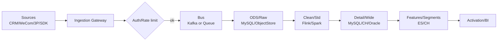
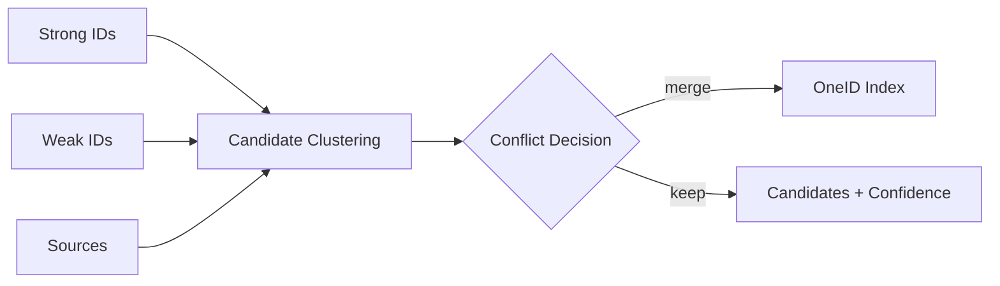
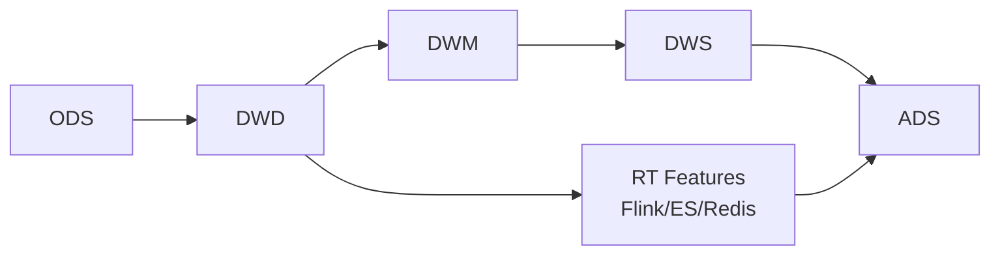
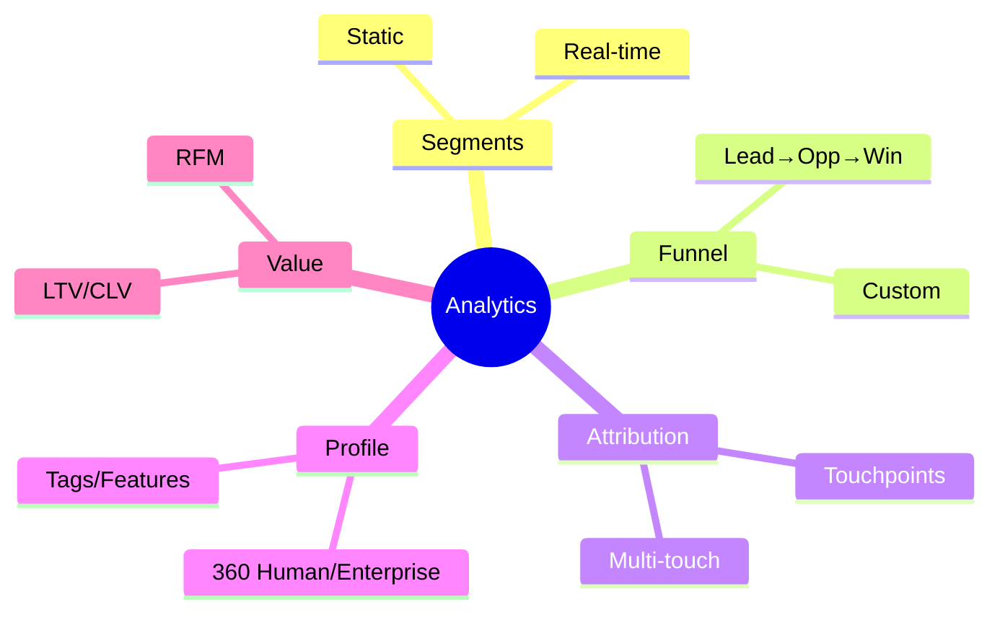
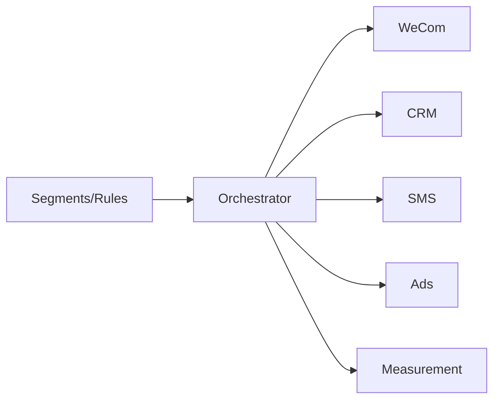

{toc}

### Overview {anchor:overview}
- Purpose: Build a finance-grade, multi-tenant CDP covering end-to-end: Ingestion → OneID → Data Mid-layer → Analytics → Activation. Compliance-first, near-real-time + batch.
- Highlights:
  - Multi-tenant isolation and cross-org views with strict access control.
  - Enterprise Buying Committee modeling (decision maker/Boss identification) based on WeCom org plus external data.
  - Current engines: MySQL, Elasticsearch, Oracle; future-ready for Kafka/Flink/ClickHouse/Spark.
- Sources: CRM (call-center-like), WeCom; future third-party integrations (ads, leads, business registry, behavior, payment, risk, etc.).

### Multi-tenant & Isolation {anchor:multi-tenant}
- Model: `Tenant` → `Organization` → `User/Account/Contact/Lead/Device`
- Isolation:
  - Data: DB/Schema level priority; row/column level for fine-grained control.
  - ES: index prefix per tenant; auditable cross-tenant queries.
  - Compute: quota and throttling per tenant.
- Governance: row/column masking, audit trails, per-tenant retention/deletion.

### Ingestion {anchor:ingestion}
- Server-side: API, Webhook, CDC (MySQL/Oracle), files.
- Client-side: Web/MiniApp/App SDK with standard events.
- Buffering: Prefer Kafka; fallback to MySQL/ES queue with ordering/idempotency.
- Quality: global `event_id` + `source_id` dedupe; retries/DLQ; schema registry.



### OneID & Entity Resolution (Sample/Placeholder) {anchor:oneid}
- Entities (sample): `EnterpriseAccount`, `Contact`, `Lead`, `UserAccount`, `Device`, `ChannelID`, `CookieID`.
- Identifiers: Strong (credit code, phone, corporate email, WeCom userId, CRM pk); Weak (cookie, device fp, adId, session).
- Merge policy (placeholder): rule priority (credit_code > phone > email/WeCom), weak-link association (session/time/behavior), human review flow.
- Storage: ES doc + edge index or graph DB.



Config placeholders:
- `oneid_confidence_threshold` (e.g. 0.8)
- `oneid_merge_rules` (JSON with priority/weights)

### Data Mid-layer {anchor:datamart}
- Layers: ODS → DWD → DWM → DWS → ADS; real-time feature path to ES/Redis.
- Engines: MySQL/Oracle for MDM/config; ES for search/segments; CH/Doris/StarRocks optional for heavy analytics.



### Analytics {anchor:analytics}
- Capabilities: search, segmentation, funnel, path, attribution, RFM, LTV/CLV, lifecycle.
- Multi-tenant views; BI dashboards; metric dictionary & versioning.



### Activation {anchor:activation}
- Channels: WeCom messages, CRM tasks/calls, SMS/Email (opt), Ads (opt).
- Real-time rules; A/B hooks; visual orchestration.



### Org & Decision Maker (Boss) {anchor:org-boss}
- WeCom org sync (dept/member/grade/reporting) [confirm frequency/mapping].
- Buying Committee roles (sample): Economic buyer, Tech decision, User, Influencer, Signer.
- Boss scoring (placeholder): `boss_score = grade_weight × interaction_freq × decision_score`.
- Outputs: `decision_maker_level`, `reports_to_one_id`, recommended boss/contact window.

### Security & Compliance {anchor:security}
- Finance-grade compliance (placeholder); PII encryption/masking/KMS; RBAC+ABAC; consent center.
- Audit, export approval, anomaly alerts; retention/TTL/archive.

### Governance & Quality {anchor:governance}
- Metadata/lineage/versions; data quality rules (required/enums/range/uniqueness); SLA/alerts (TBD).

### SRE & SLA {anchor:sla}
- Targets (TBD): RT P95 1–5m, 99.9%+, batch T+1.
- HA (multi-replica/DR); cost (hot/cold, partitions, TTL, delta refresh).

### Roadmap {anchor:roadmap}
- Phase 1 (4–6w): multi-tenant, ingestion, ODS, base profile, WeCom sync, basic segments, WeCom activation.
- Phase 2 (6–10w): OneID v1, funnel/path/attribution, ES accel, orchestration canvas.
- Phase 3 (10–16w): RT segments, A/B, Boss model v1, governance & audit.

### Standards (Sample/Placeholder) {anchor:standards}
- Event naming: `<domain>.<action>.<object>`; common fields: `tenant_id`, `org_id`, `one_id`, `event_id`, `occurred_at`, `source`, `ip`, `ua`.

```json
{
  "event_id": "evt_xxx",
  "tenant_id": "t001",
  "org_id": "org_xxx",
  "one_id": "cid_xxx",
  "occurred_at": "2024-01-01T10:00:00Z",
  "source": "crm",
  "type": "call.outbound.started",
  "payload": {"...": "..."}
}
```

### Intake & Plan {anchor:intake}
```markdown
| Source | Method | Freshness | Owner | Status |
|--------|--------|-----------|-------|--------|
| CRM | API | Minutes | TBA | Pending |
| WeCom | Webhook | RT | TBA | Pending |
| Ads | File/API | T+1 | TBA | Pending |
```


