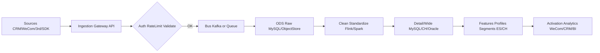
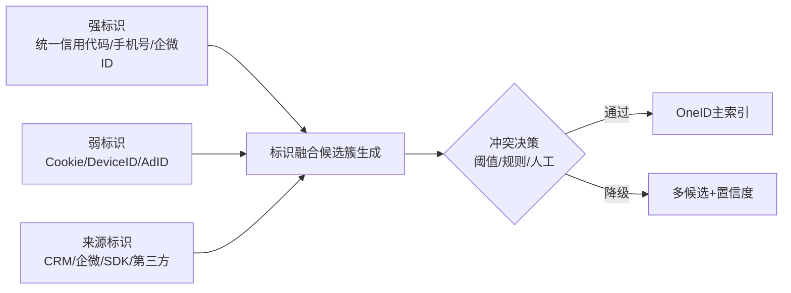
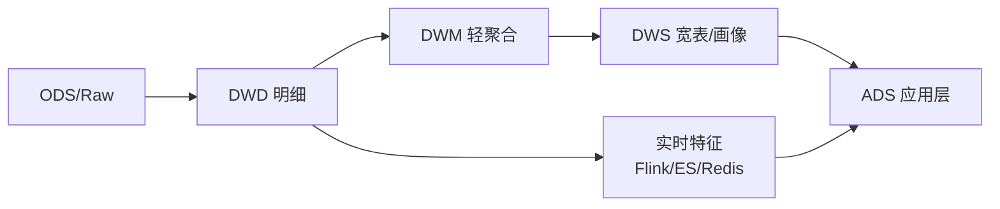
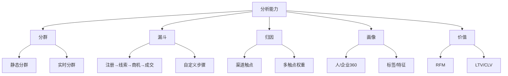
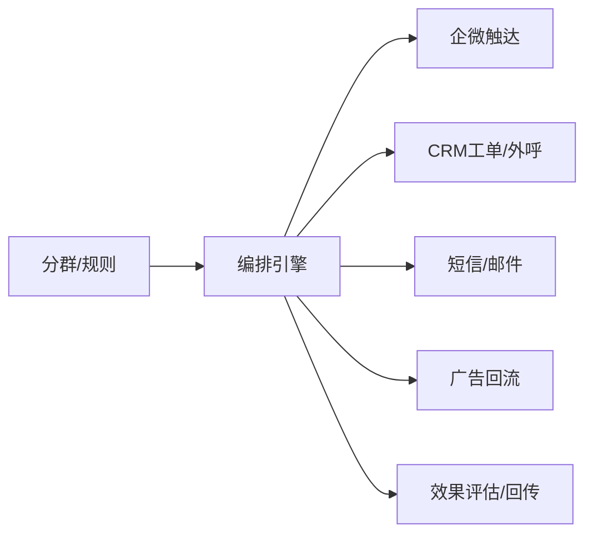
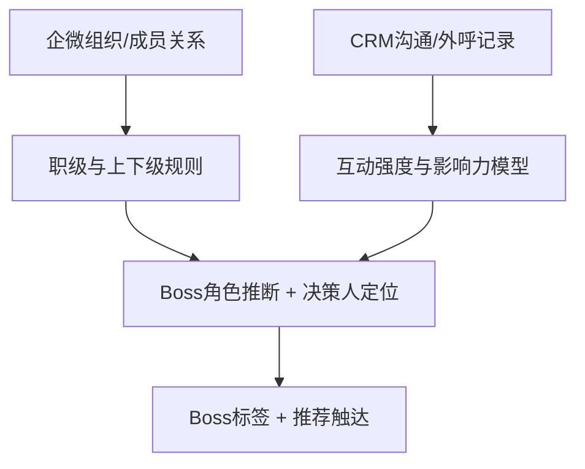
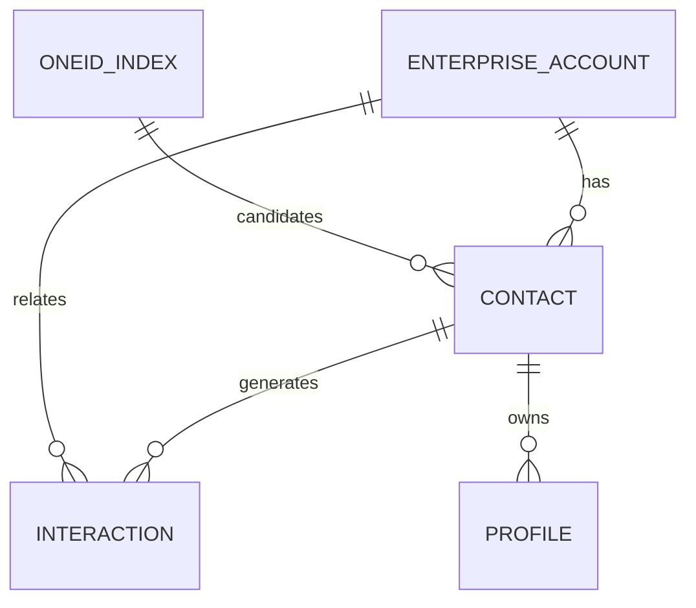

{toc}

### 快速导航
- [概述](#overview)
- [多租户与隔离模型](#multi-tenant)
- [数据采集平台](#ingestion)
- [OneID 与实体解析](#oneid)
- [数据中台架构](#datamart)
- [数据分析平台](#analytics)
- [数据应用平台与触达](#activation)
- [组织架构与上级决策人定位](#org-boss)
- [安全与合规](#security)
- [数据治理与质量](#governance)
- [运维与SLA](#sla)
- [技术栈与落地建议](#stack)
- [里程碑与路线图](#roadmap)
- [标准与规范](#standards)
- [接入清单与实施计划](#intake)
- [权限矩阵](#rbac)
- [数据保留与删除](#retention)
- [附录：核心数据模型](#models)
- [附录：占位与待确认事项](#placeholders)

### 概述 {anchor:overview} {anchor:ov}
- **目标**：建设面向金融行业的 ToB CDP，覆盖“数据采集 → OneID → 数据中台 → 数据分析 → 数据应用”的全链路，满足多租户隔离、企业级合规与实时-离线混合场景。
- **特点**：
  - 多租户架构，租户/组织隔离与跨组织视图兼容。
  - 面向企业客户的组织架构与 Buying Committee（上级决策人/Boss）定位，基于企微组织与第三方企业信息扩展。
  - 现阶段以 MySQL、Elasticsearch、Oracle 为主，支持后续横向扩展（Kafka/Flink/ClickHouse/Spark 可按路线图演进）。
- **数据源现状**：CRM（类呼叫中心）、企微；后续陆续接入第三方数据（广告、线索、工商、行为、支付、风控等）。

### 多租户与隔离模型 {anchor:multi-tenant} {anchor:mt}
- **租户模型**：`Tenant` → `Organization` → `User/Account/Contact/Lead/Device`
- **隔离策略**：
  - 数据层：库/Schema 级隔离优先；行列级策略补充细粒度权限。
  - 索引层（ES）：索引前缀按租户隔离，支持跨租户合规审计。
  - 计算层：任务队列与资源池按租户限流。
- **权限与审计**：
  - 行级/列级权限，字段级敏感数据遮蔽。
  - 操作审计与访问日志按租户汇总。
- **合规**：支持租户级数据保留/删除、跨境与同意管理（后续细化）。

### 数据采集平台（Ingestion） {anchor:ingestion} {anchor:ing}
- **接入方式**：
  - 服务端：CRM/企微/第三方通过 API、Webhook、CDC（MySQL/Oracle）/文件投递。
  - 客户端：Web/小程序/APP 埋点 SDK，标准事件规范。
- **消息与缓冲**：优先选用持久化消息中间件（推荐 Kafka），无 Kafka 场景可先落 MySQL/ES 队列表，配合定序与幂等。
- **幂等与质量**：
  - 全局事件 `event_id`+来源 `source_id` 去重；重试与死信队列。
  - Schema Registry 管控事件演进，灰度字段新增。



### OneID 与实体解析 {anchor:oneid} {anchor:oid}
- **实体对象**（示例结构，待补充）：
  - `EnterpriseAccount`（企业客户）主表，字段包含 `id`, `name`, `credit_code`, `domain`, `wecom_corp_id`
  - `Contact`（联系人）主表，字段包含 `id`, `name`, `phone_hash`, `email_hash`, `wecom_user_id`, `enterprise_id`
  - `Lead`（线索）、`UserAccount`（登录账号）、`Device`（设备）、`ChannelID`（渠道ID）、`CookieID` 等
- **标识类型**：
  - 强标识：统一社会信用代码、手机号、企业域名邮箱、企微UserID、CRM主键
  - 弱标识：Cookie、设备指纹、广告ID、会话ID
- **合并策略**：
  - 规则匹配（统一信用代码 > 手机号 > 邮箱/企微ID）
  - 弱标识关联（同会话/时空/行为）
  - 人工校对流程
- **OneID图谱与关系存储**：ES 文档型 + 边索引，或独立图数据库（可选，后续演进）



**配置示例**：
- 字段 `oneid_confidence_threshold`（合并置信度阈值，如 0.8）
- 字段 `oneid_merge_rules`（合并规则配置JSON，如 `{"priority": ["credit_code", "phone", "email"], "weights": {}}`）

### 数据中台架构 {anchor:datamart} {anchor:dm}
- **分层设计**：
  - ODS/Raw：原始落地（MySQL/对象存储/Oracle 外表）。
  - DWD 明细层：规范事件与主数据快照。
  - DWM 轻聚合：行为窗转化、漏斗中间层。
  - DWS 宽表：画像/分群/特征宽表（ES/ClickHouse）。
  - ADS 应用层：报表/触达读模型。
- **既有引擎利用**：
  - MySQL/Oracle：主数据、配置、轻量指标存取。
  - ES：行为检索、人群反查、近实时画像。
  - 可选 OLAP：ClickHouse/Doris/StarRocks，用于重型明细分析与分群。
- **实时与离线**：
  - 实时：Flink（或轻量自研）+ ES/Redis 人群；分钟级 SLA。
  - 离线：Spark/SQL 周期产出画像宽表；T+1 SLA。



### 数据分析平台 {anchor:analytics} {anchor:ana}
- **分析能力**：全量检索、分群、漏斗、路径、归因、RFM、LTV/CLV、客户流转。
- **多租户视图**：租户隔离 + 跨组织汇总（需权限）。
- **BI/报表**：对接内部 BI 或内置看板；指标字典与口径版本化。



### 数据应用平台与触达 {anchor:activation} {anchor:act}
- **触达渠道**：企微消息、CRM任务/工单、短信/邮件（可选）、广告平台回流（可选）。
- **实时决策**：规则引擎支持人群实时匹配与限流；A/B 实验预留接口。
- **编排**：可视化画布编排（触发 → 规则 → 分群 → 触达 → 评估）。



### 组织架构与上级决策人定位 {anchor:org-boss} {anchor:org}
- **基础来源**：企微组织架构同步（部门/成员/职级/上级关系）
- **Buying Committee 建模**（角色示例：经济买家/Boss、技术决策、使用者、影响者、签署人等）
- **Boss定位算法**：
  - 示例公式：`boss_score = 职级权重 × 互动频次 × 决策行为得分`
- **图谱存储**：`(Contact)-[BelongsTo]->(EnterpriseAccount)` `(Contact)-[ReportsTo]->(Contact)` `(Contact)-[WorksWith]->(SalesRep)`
- **产出物**：标签 `decision_maker_level`（决策层级标签）、`reports_to_one_id`（汇报链）、推荐Boss与建议触达时间



**配置示例**：
- 配置项 `org_hierarchy_levels`（职级字典，如 `["CEO", "VP", "Director", "Manager"]`）
- 配置项 `boss_detection_thresholds`（判定阈值，如 `{"high": 0.8, "medium": 0.5}`）
- 配置项 `interaction_weights`（互动类型权重JSON，如 `{"call": 3, "message": 1, "meeting": 5}`）

### 安全与合规 {anchor:security} {anchor:sec}
- **合规要求**：等保/数据分级分域/跨境/金融行业合规条例
- **PII加密/脱敏/密钥管理（KMS/双钥）**
- **访问控制**（RBAC + ABAC，字段级权限，审批流，审计日志）
- **同意与偏好中心**（Consent & Preference Center，精细化授权，撤回与数据删除）

**合规要点示例**：
- 敏感字段脱敏展示（手机号掩码、邮箱部分遮蔽、身份证号Hash）
- 访问审计（操作记录、导出审批、异常告警）
- 数据保留策略（TTL自动清理、冷归档、合规留存）

### 数据治理与质量 {anchor:governance} {anchor:gov}
- **元数据/血缘/版本**（Schema Registry、指标字典、口径版本化、可视化血缘）
- **数据质量**：
  - 示例校验项：必填字段、枚举值、数值范围、唯一性
- **成本与性能**（冷热分层、TTL、分区策略、性能监控与调优）

**治理示例**：
- 数据血缘：采集 → 清洗 → 分群 → 触达
- 质量规则：必填字段校验、枚举值校验、数值范围校验
- 成本策略：热数据3个月保留、冷数据归档OSS、TTL自动清理

### 运维与SLA {anchor:sla} {anchor:sre}
- **SLA示例**：实时链路P95延迟 < 1-5分钟、可用性 99.9%+、离线T+1、关键链路告警与自动补数
- **高可用**（多副本/跨区/灾备）
- **成本优化**（冷热分层、分区/TTL、差量更新）

**SLA示例**：
- 实时标签更新：P95延迟 < 1分钟，可用性 ≥ 99.9%
- 离线画像产出：T+1 8:00前完成，延迟告警阈值 1小时

### 技术栈与落地建议 {anchor:stack}
- **当前可用**：MySQL/Oracle（主数据与配置）、ES（近实时检索与人群反查）。
- **建议增配（按优先级）**：
  - 消息总线：Kafka（或云托管）+ Schema Registry。
  - 实时计算：Flink（或轻量替代）产出实时标签与人群。
  - OLAP：ClickHouse/StarRocks（重型明细分析与分群）。
  - 编排与实验：先内置规则编排，A/B 平台对接留接口。
- **开源 vs 自研**：优先“可落地”与“易运维”，逐步替换重型组件。

### 里程碑与路线图 {anchor:roadmap} {anchor:road}
**第一阶段（4-6周，核心能力）**：
- 多租户底座 ✅
- 采集网关（CRM/企微）✅  
- ODS + 基础画像 ✅
- 企微组织同步 ✅
- Boss定位基础版（示例算法）
- 实时分群
- 企微触达 ✅

**第二阶段（6-10周，分析与应用）**：
- OneID v1（规则优先）
- 漏斗/路径/归因
- Flink实时计算（或轻量替代）
- OLAP引入（可选）
- A/B实验（可选）

**第三阶段（10-16周，智能化）**：
- 特征平台/MLOps
- 预测建模（Churn/Next Best Action）
- 跨渠道自动化
- 闭环评估与优化

### 标准与规范 {anchor:standards} {anchor:std}
- **事件命名规范**：`<domain>.<action>.<object>`，如 `call.outbound.started`
- **公共字段**（必须字段清单）：`tenant_id`, `org_id`, `one_id`, `event_id`, `occurred_at`, `source`, `ip`, `ua`
- **主数据必填与校验规则**（Schema Registry）

**示例事件结构（预留）**：
```json
{
  "event_id": "evt_xxx",
  "tenant_id": "t001",
  "org_id": "org_xxx",
  "one_id": "cid_xxx",
  "occurred_at": "2024-01-01T10:00:00Z",
  "source": "crm",
  "type": "call.outbound.started",
  "payload": {"...": "..."}
}
```

**事件清单示例**：
- CRM事件：`call.outbound.started`, `call.inbound.received`, `lead.created`, `opportunity.won` 等
- 企微事件：`wecom.message.received`, `wecom.member.joined`, `wecom.dept.updated` 等
- SDK事件：`page.view`, `button.click`, `form.submitted` 等

### 接入清单与实施计划 {anchor:intake}
- **接口定义**：REST API标准（鉴权、限流、幂等、错误码）
- **接入清单**：
  - CRM：API调用，每分钟拉取一次通话记录
  - 企微：Webhook监听，实时接收消息与组织变更
  - 第三方广告：每天T+1导入前一天的点击/转化数据
- **测试与上线流程**（沙箱环境、灰度发布、回滚预案）

**接入清单示例（预留）**：
```markdown
| 数据源 | 接入方式 | 预期时效 | 负责人 | 状态 |
|--------|----------|----------|--------|------|
| CRM | API | 分钟级 | 待定 | 待接入 |
| 企微 | Webhook | 实时 | 待定 | 待接入 |
| 第三方广告 | 文件/API | T+1 | 待定 | 待接入 |
```

### 权限矩阵 {anchor:rbac}
**角色与数据权限定义**（Admin / 数据工程 / 分析师 / 销售 / 客服，读写权限、数据域权限、审计与审批）

**权限示例**：
- Admin：全租户数据查看与配置
- 数据工程：本租户技术域读写，排除敏感字段
- 分析师：本组织数据读取，标签分析
- 销售：本组客户数据，最少必要字段

**其他角色**：运营、客服、第三方接入（API Key）

### 数据保留与删除 {anchor:retention}
- **TTL配置**（行为明细/画像/原始日志的保留期与冷归档策略）
  - 示例：行为明细保留13个月，画像长期保留，原始日志归档到对象存储
- **用户撤回与删除**（PII删除请求、级联删除、软删除与审计记录）
  - 需补充：删除API、级联规则、审计记录格式

### 附录：核心数据模型（简化） {anchor:models}
- 主索引：`one_id_index(one_id, candidate_ids, confidence, updated_at)`
- 企业：`enterprise_account(id, name, credit_code, domain, tenant_id, ... )`
- 联系人：`contact(id, name, phone_hash, email_hash, wecom_user_id, enterprise_id, ...)`
- 企微组织：`wecom_org(dept_id, parent_dept_id, level, manager_id, ...)`
- 互动：`interaction(id, type, channel, from_id, to_id, occurred_at, ... )`
- 画像：`profile(one_id, tags(json), features(json), updated_at)`



### 可配置项与下一步 {anchor:next}
- OneID 合并策略细化：强/弱标识权重、冲突阈值、人工校对流。
- 实时链路选型：是否引入 Kafka/Flink 与 OLAP，引擎预算与SLA目标。
- Buying Committee 标签口径：Boss 定位阈值、角色字典与回写字段。
- 合规落地：PII 字段清单、脱敏方案、同意与审计流程。

### 附录：占位与待确认事项 {anchor:placeholders} {anchor:ph}
- OneID 权重与阈值、弱标识关联规则、人工校对权限/界面。
- 企微组织同步频率与字段映射、角色字典与边属性定义、Boss 算法权重。
- 合规范围细节、脱敏字段清单、TTL 配置、审计范围与告警阈值。
- 数据质量规则清单与SLA告警策略。
- 分群规则、业务漏斗定义、A/B 实验需求与评估指标。


