# Pipeline Framework 设计文档

## 目录

- [1. 项目概述](#1-项目概述)
- [2. 核心模块总览](#2-核心模块总览)
- [3. 模块详细设计](#3-模块详细设计)
- [4. 数据库设计](#4-数据库设计)
- [5. 开发指南](#5-开发指南)

---

## 1. 项目概述

### 1.1 项目定位

Pipeline Framework 是一个基于 Spring Project Reactor 的响应式数据处理框架，支持流式和批量数据处理。

**核心理念**：
- 一个 Job = Source (数据源) → Flow (数据处理) → Sink (数据输出)
- 每个 Job 在单个实例内完整执行，不跨实例传输数据
- 使用 Reactor 的响应式编程模型，天然支持背压控制

**技术栈**：Spring Boot 3.x + Project Reactor 3.x + Spring Data JPA + PostgreSQL + RocksDB

### 1.2 三种执行模式

| 模式 | 数据源 | 特点 | 使用场景 |
|------|--------|------|----------|
| **STREAMING** | Kafka/MQ | 无限流、持续运行、支持水印 | 实时流处理、实时告警 |
| **BATCH_ROLLER** | HTTP API/分页查询 | 自动翻页、读完结束、可断点续传 | 数据同步、历史数据迁移 |
| **SQL_TASK** | SQL 查询 | 执行复杂 SQL、流式读取结果集 | 数据分析、报表生成 |

---

## 2. 核心模块总览

### 2.1 模块架构

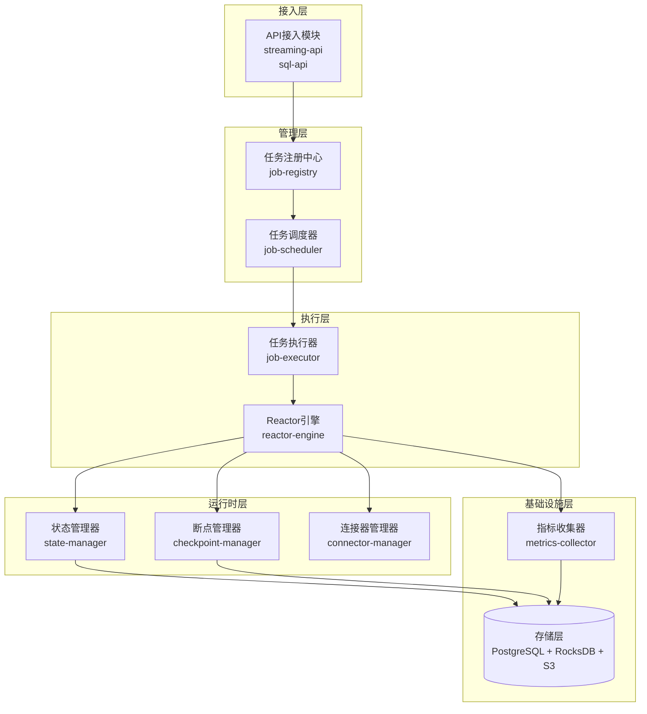

### 2.2 所有核心模块列表

#### 模块 1: streaming-api (流式 API 模块)

**功能**：提供用户编写流式数据处理任务的 API 接口

**意义**：
- 让用户可以用声明式的方式定义数据处理流程
- 屏蔽底层 Reactor 的复杂性
- 提供链式调用的友好 API

**难点**：
- 如何设计简洁易用的 API，同时保留足够的灵活性
- 如何将用户定义的算子转换为 Reactor 的 Flux 操作
- 如何处理类型推断和泛型

**核心接口**：
```java
public interface DataStream<T> {
    <R> DataStream<R> map(Function<T, R> mapper);
    DataStream<T> filter(Predicate<T> predicate);
    <R> DataStream<R> flatMap(Function<T, Publisher<R>> mapper);
    DataStream<T> window(Duration size);
    DataStream<T> keyBy(Function<T, ?> keySelector);
    void addSink(ReactorSink<T> sink);
}
```

---

#### 模块 2: sql-api (SQL API 模块)

**功能**：支持用户通过 SQL 定义数据处理任务

**意义**：
- 降低使用门槛，SQL 开发者可以直接上手
- 复杂的多表 Join、聚合可以用 SQL 简洁表达
- 可以复用现有的 SQL 查询逻辑

**难点**：
- SQL 解析和优化（需要集成 Apache Calcite）
- 如何将 SQL 转换为 Reactor 流式处理
- 大结果集的流式读取，避免 OOM

**核心接口**：
```java
public interface SqlJob {
    SqlJob sql(String sqlQuery);
    SqlJob dataSource(DataSource dataSource);
    SqlJob sink(ReactorSink<?> sink);
    SqlJob fetchSize(int size);
    SqlJob queryTimeout(Duration timeout);
}
```

---

#### 模块 3: job-registry (任务注册中心)

**功能**：管理所有 Job 的定义、版本和配置

**意义**：
- 集中管理所有 Job，方便查询和维护
- 支持 Job 的版本管理，可以回滚到历史版本
- 提供 Job 的启用/禁用功能

**难点**：
- Job 定义的序列化和反序列化（如何将代码定义存储到数据库）
- 版本管理策略（如何处理版本冲突）
- 如何支持动态修改 Job 定义而不重启服务

**核心数据结构**：
```java
public class JobDefinition {
    private Long id;
    private String jobName;              // Job 唯一名称
    private JobType jobType;             // STREAMING/BATCH_ROLLER/SQL_TASK
    private int version;                 // 版本号
    private String dagDefinition;        // DAG 定义（JSON）
    private Map<String, Object> config;  // 配置参数
    private boolean enabled;             // 是否启用
}
```

**关键难点详解**：
1. **Job 定义序列化**：用户用 Java 代码定义 Job，但需要存储到数据库，如何序列化？
   - 解决方案：将 Job 定义转换为 JSON DSL 格式存储
   - 包含 Source 类型、配置、Transform 算子链、Sink 配置等

2. **版本管理**：如何在不影响运行中 Job 的情况下更新定义？
   - 解决方案：每次更新创建新版本，运行中的 Job 仍使用旧版本，新启动的 Job 使用新版本

---

#### 模块 4: job-scheduler (任务调度器)

**功能**：根据触发条件调度 Job 的执行

**意义**：
- 支持多种触发方式（定时、手动、事件、依赖）
- 管理 Job 的执行计划和调度策略
- 处理 Job 的重试和失败转移

**难点**：
- 分布式环境下如何避免重复调度
- 如何处理 Job 之间的依赖关系
- 如何实现高效的定时调度

**触发方式设计**：

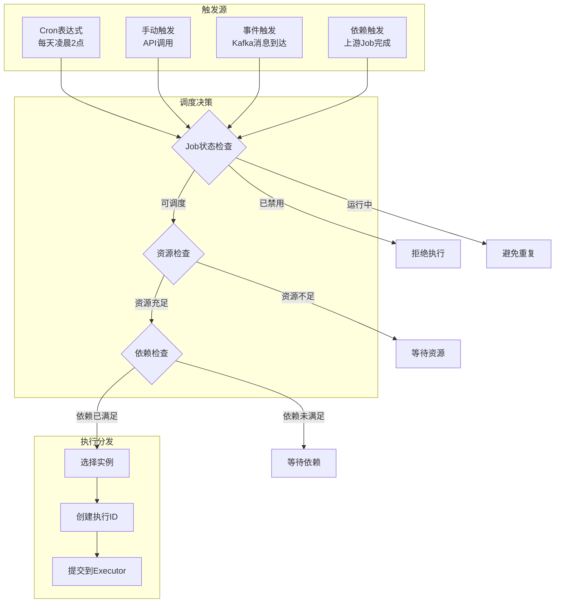

**关键难点详解**：
1. **避免重复调度**：分布式环境下多个实例都可能触发同一个 Job
   - 解决方案：使用数据库行锁或分布式锁（Redis/Zookeeper）
   
2. **依赖关系处理**：Job A 依赖 Job B，如何确保顺序？
   - 解决方案：维护依赖 DAG，使用事件总线通知依赖完成

---

#### 模块 5: job-executor (任务执行器)

**功能**：执行具体的 Job，管理 Job 的运行时生命周期

**意义**：
- 负责 Job 的初始化、启动、监控、停止
- 管理 Job 的资源隔离（线程池、内存）
- 处理 Job 执行过程中的异常和重试

**难点**：
- 如何实现不同 Job 之间的资源隔离
- 如何优雅地停止一个运行中的 Job
- 如何从 Checkpoint 恢复 Job 状态

**Job 生命周期状态机**：

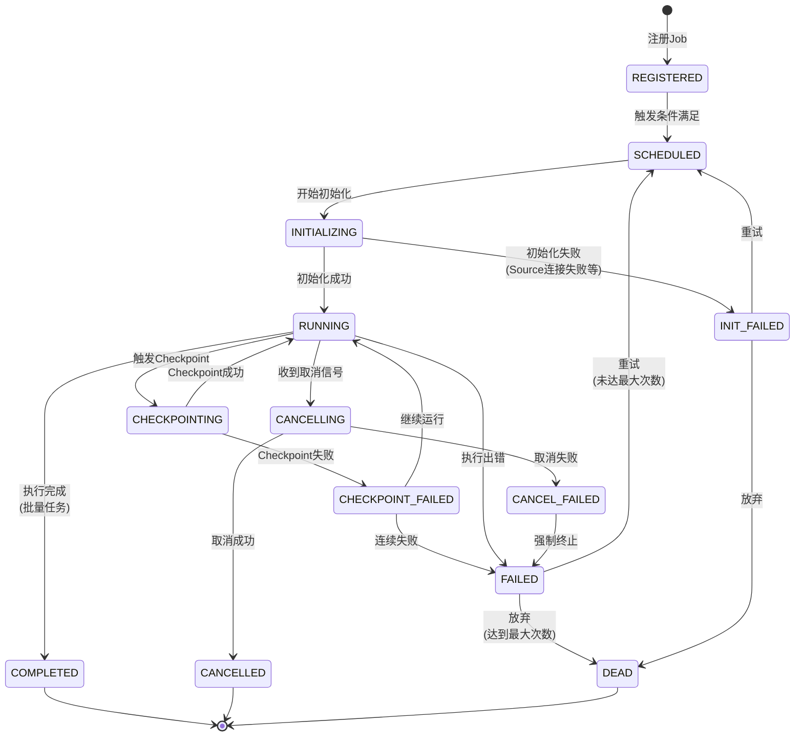

**关键难点详解**：
1. **资源隔离**：不同 Job 不能互相影响
   - 解决方案：每个 Job 使用独立的线程池和 Reactor Scheduler
   - 每个 Job 有内存配额限制

2. **优雅停止**：如何中断一个运行中的 Reactor Flux？
   - 解决方案：使用 `Flux.takeUntilOther()` 监听停止信号
   - 给 Job 一个宽限期（如 30 秒），超时强制终止

3. **状态恢复**：从 Checkpoint 恢复时如何确保一致性？
   - 解决方案：使用两阶段提交，先恢复状态，再继续处理

---

#### 模块 6: reactor-engine (Reactor 引擎)

**功能**：封装 Project Reactor 的能力，提供响应式流处理

**意义**：
- 利用 Reactor 的天然背压支持，无需手动实现
- 提供统一的 Source 和 Sink 抽象
- 管理 Scheduler（线程池）和背压策略

**难点**：
- 如何合理配置 Scheduler，平衡性能和资源占用
- 如何选择合适的背压策略
- 如何监控 Reactor 流的运行状态

**背压策略详解**：

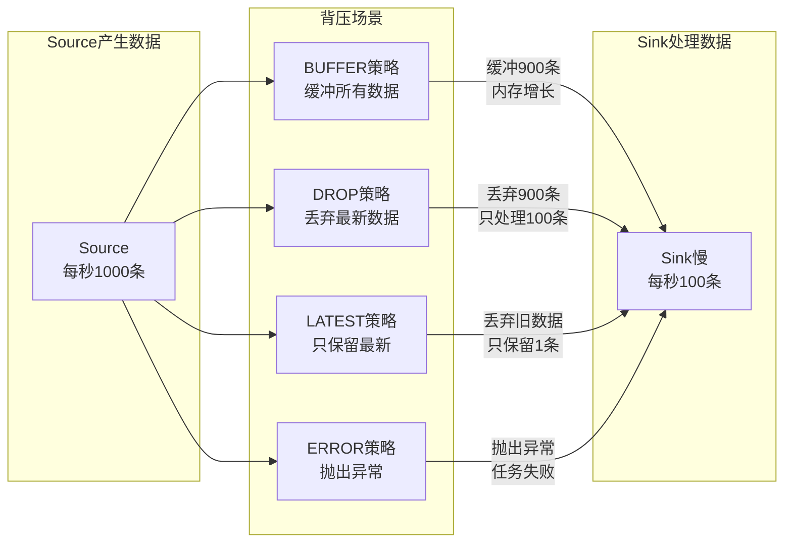

**策略选择指南**：

| 策略 | 适用场景 | 优点 | 缺点 |
|------|---------|------|------|
| **BUFFER** | 数据不能丢、内存充足 | 数据不丢失 | 可能 OOM |
| **DROP** | 实时性高、允许丢数据 | 内存稳定 | 数据丢失 |
| **LATEST** | 只关心最新状态 | 内存稳定 | 只保留最新 |
| **ERROR** | 严格要求数据完整性 | 发现问题 | 任务失败 |

**关键难点详解**：
1. **Scheduler 选择**：不同类型的操作应该用不同的 Scheduler
   - IO 密集：使用 `Schedulers.boundedElastic()`
   - CPU 密集：使用 `Schedulers.parallel()`
   - 简单操作：使用 `Schedulers.immediate()`

2. **背压监控**：如何知道当前是否发生了背压？
   - 解决方案：使用 Micrometer 监控缓冲区大小、丢弃计数

---

#### 模块 7: state-manager (状态管理器)

**功能**：管理 Job 运行时的状态数据

**意义**：
- 支持有状态的算子（如窗口聚合、去重等）
- 提供不同类型的状态存储（Value、List、Map）
- 配合 Checkpoint 机制实现状态持久化

**难点**：
- 如何高效地存储和查询状态
- 如何处理大状态（内存放不下）
- 如何保证状态的线程安全

**状态类型和存储后端**：

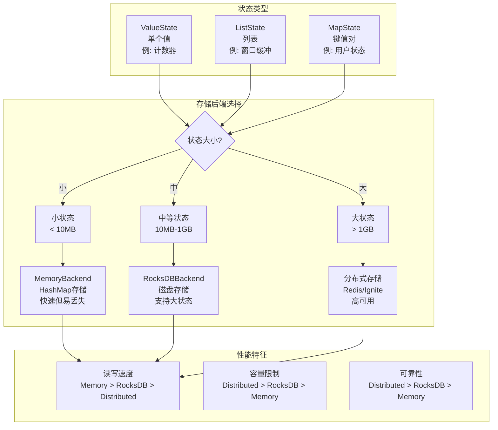

**关键难点详解**：
1. **线程安全**：多个线程可能同时访问状态
   - 解决方案：使用 ThreadLocal 隔离不同 Job 的状态
   - 使用 ConcurrentHashMap 或 RocksDB 的原子操作

2. **大状态处理**：状态超过内存怎么办？
   - 解决方案：使用 RocksDB 作为状态后端，自动溢写到磁盘
   - 配置 RocksDB 的 block cache 和 write buffer

3. **状态清理**：如何清理过期状态？
   - 解决方案：使用 TTL（Time To Live），自动清理过期数据
   - 定期触发 Compaction，回收空间

---

#### 模块 8: checkpoint-manager (断点管理器)

**功能**：实现 Checkpoint 机制，支持故障恢复和断点续传

**意义**：
- 让 Job 可以从失败点恢复，避免从头开始
- 实现 Exactly-Once 语义
- 支持 Job 的暂停和恢复

**难点**：
- 如何保证 Checkpoint 的一致性（Source、算子状态、Sink 要同步）
- 如何高效地持久化状态（大状态序列化很慢）
- 如何管理 Checkpoint 的生命周期（清理旧的）

**Checkpoint 一致性保证机制**：

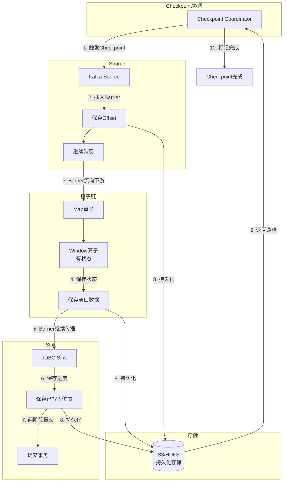

**关键难点详解**：
1. **一致性保证**：如何保证 Source、算子、Sink 的状态是同一时刻的？
   - 解决方案：使用 Barrier 机制（借鉴 Flink 的 Chandy-Lamport 算法）
   - Barrier 像一个分隔符，标记 Checkpoint 的边界

2. **两阶段提交**：如何保证 Sink 的 Exactly-Once？
   - 解决方案：Checkpoint 时先预提交，等所有状态都保存成功后再真正提交
   - 失败时可以回滚

3. **异步 Checkpoint**：如何避免 Checkpoint 阻塞数据处理？
   - 解决方案：使用异步序列化和上传，不阻塞主流程

---

#### 模块 9: connector-manager (连接器管理器)

**功能**：管理所有的 Source 和 Sink 连接器

**意义**：
- 提供插件化的连接器扩展机制
- 统一管理连接器的生命周期
- 复用连接池，提高效率

**难点**：
- 如何设计通用的连接器接口
- 如何支持连接器的动态加载和卸载
- 如何管理连接池（JDBC、HTTP）

**连接器类型和配置**：

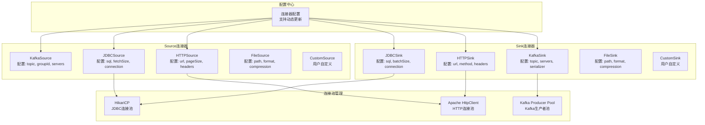

**关键难点详解**：
1. **插件化设计**：如何让用户自定义连接器？
   - 解决方案：使用 Java SPI 机制，自动发现 classpath 中的连接器
   - 提供 `@ConnectorType` 注解标记连接器类型

2. **连接池管理**：如何避免连接泄漏？
   - 解决方案：使用 Try-with-resources 自动关闭连接
   - 定期检查连接池状态，清理失效连接

3. **配置热更新**：如何不重启更新连接器配置？
   - 解决方案：使用 Spring Cloud Config 监听配置变化
   - 连接器使用 `@RefreshScope` 支持热刷新

---

#### 模块 10: metrics-collector (指标收集器)

**功能**：收集 Job 的运行指标，对接监控系统

**意义**：
- 实时监控 Job 的运行状态
- 提供性能分析数据
- 支持告警和自动化运维

**难点**：
- 如何高效采集指标，避免影响性能
- 如何设计合理的指标体系
- 如何对接不同的监控系统（Prometheus、Grafana）

**指标体系设计**：

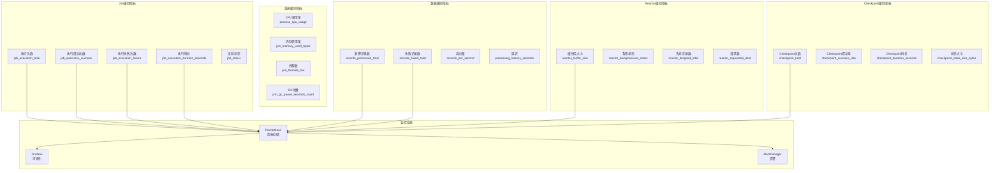

**关键难点详解**：
1. **性能开销**：采集指标会影响 Job 性能吗？
   - 解决方案：使用 Micrometer 的高性能计数器
   - 批量上报指标，避免频繁网络请求

2. **指标命名规范**：如何设计易于理解和查询的指标名？
   - 解决方案：遵循 Prometheus 命名规范
   - 使用标签（label）区分不同维度

---

## 3. 模块详细设计

### 3.1 job-executor 执行流程详解

**完整的 Job 执行流程**：

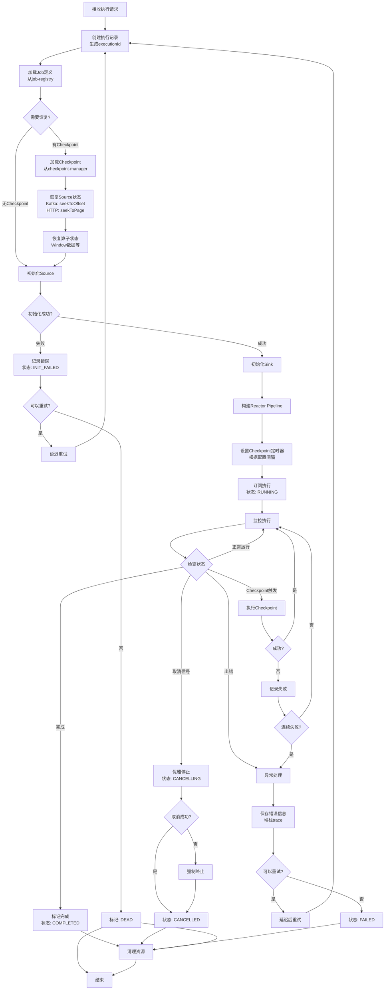

**关键步骤说明**：

1. **初始化阶段**：
   - 加载 Job 定义，解析配置
   - 检查是否有 Checkpoint 需要恢复
   - 创建 Source、Sink、算子实例

2. **执行阶段**：
   - 构建 Reactor Pipeline
   - 订阅并开始处理数据
   - 定期执行 Checkpoint
   - 监控执行状态

3. **异常处理**：
   - 捕获异常，记录详细信息
   - 根据重试策略决定是否重试
   - 超过最大重试次数后标记为 DEAD

---

### 3.2 checkpoint-manager 详细设计

#### 3.2.1 Checkpoint 触发策略

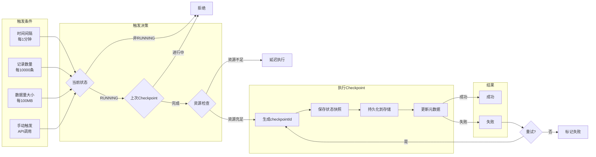

#### 3.2.2 三种模式的 Checkpoint 数据

**STREAMING 模式**：
```json
{
  "checkpoint_id": 123,
  "timestamp": "2024-01-01T10:00:00",
  "source_state": {
    "type": "kafka",
    "offsets": {
      "events-topic": {
        "partition-0": 12345,
        "partition-1": 23456,
        "partition-2": 34567
      }
    }
  },
  "operator_state": {
    "window_operator_1": {
      "windows": [
        {
          "key": "user_123",
          "start": "2024-01-01T09:55:00",
          "end": "2024-01-01T10:00:00",
          "data": {"count": 100, "sum": 5000}
        }
      ]
    },
    "dedup_operator_1": {
      "seen_ids": ["id1", "id2", "id3"]
    }
  },
  "sink_state": {
    "type": "kafka",
    "transaction_id": "txn-123",
    "committed_offset": 12000
  }
}
```

**BATCH_ROLLER 模式**：
```json
{
  "checkpoint_id": 45,
  "timestamp": "2024-01-01T10:00:00",
  "source_state": {
    "type": "http_api",
    "current_page": 123,
    "page_size": 1000,
    "total_pages": 500,
    "last_processed_item_id": "item_123000"
  },
  "operator_state": {},
  "sink_state": {
    "type": "jdbc",
    "last_committed_batch": 123,
    "rows_written": 123000
  }
}
```

**SQL_TASK 模式**：
```json
{
  "checkpoint_id": 10,
  "timestamp": "2024-01-01T10:00:00",
  "source_state": {
    "type": "sql_query",
    "processed_rows": 1000000,
    "last_processed_id": 999999,
    "result_set_position": 1000000
  },
  "operator_state": {},
  "sink_state": {
    "type": "file",
    "file_path": "/output/report.csv",
    "bytes_written": 52428800
  }
}
```

#### 3.2.3 故障恢复流程

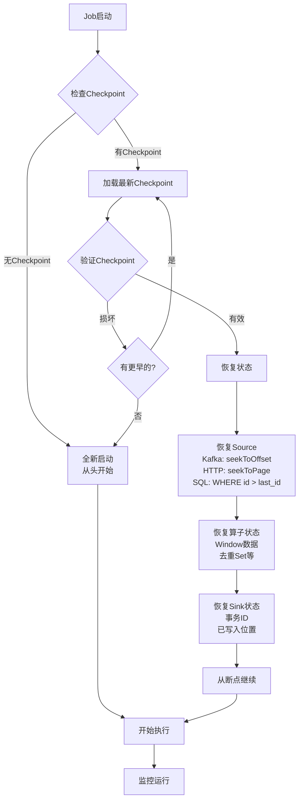

---

## 4. 数据库设计

### 4.1 表结构设计

#### 表 1: pipeline_job_definition

```sql
CREATE TABLE pipeline_job_definition (
    id                  BIGSERIAL PRIMARY KEY,
    job_name            VARCHAR(200) NOT NULL UNIQUE,
    job_type            VARCHAR(50) NOT NULL,
    version             INTEGER NOT NULL DEFAULT 1,
    dag_definition      TEXT NOT NULL,
    description         TEXT,
    enabled             BOOLEAN NOT NULL DEFAULT true,
    parallelism         INTEGER DEFAULT 1,
    max_retry_times     INTEGER DEFAULT 3,
    create_time         TIMESTAMP NOT NULL DEFAULT CURRENT_TIMESTAMP,
    update_time         TIMESTAMP NOT NULL DEFAULT CURRENT_TIMESTAMP,
    created_by          VARCHAR(100),
    updated_by          VARCHAR(100),
    
    CONSTRAINT chk_parallelism CHECK (parallelism > 0),
    CONSTRAINT chk_max_retry CHECK (max_retry_times >= 0)
);

CREATE INDEX idx_job_name ON pipeline_job_definition(job_name);
CREATE INDEX idx_job_type ON pipeline_job_definition(job_type);
CREATE INDEX idx_enabled ON pipeline_job_definition(enabled);
CREATE INDEX idx_update_time ON pipeline_job_definition(update_time DESC);

COMMENT ON TABLE pipeline_job_definition IS 'Job定义表，存储所有Job的元数据';
COMMENT ON COLUMN pipeline_job_definition.dag_definition IS 'Job的DAG定义，JSON格式';
COMMENT ON COLUMN pipeline_job_definition.parallelism IS 'Job的并行度，同时运行的实例数';
```

#### 表 2: pipeline_job_execution

```sql
CREATE TABLE pipeline_job_execution (
    id                  BIGSERIAL PRIMARY KEY,
    execution_id        VARCHAR(100) NOT NULL UNIQUE,
    job_id              BIGINT NOT NULL,
    job_name            VARCHAR(200) NOT NULL,
    status              VARCHAR(50) NOT NULL,
    start_time          TIMESTAMP NOT NULL,
    end_time            TIMESTAMP,
    duration_ms         BIGINT,
    processed_records   BIGINT DEFAULT 0,
    failed_records      BIGINT DEFAULT 0,
    throughput          DECIMAL(10, 2),
    error_message       TEXT,
    error_stack_trace   TEXT,
    checkpoint_path     VARCHAR(500),
    retry_count         INTEGER DEFAULT 0,
    triggered_by        VARCHAR(100),
    instance_id         VARCHAR(100),
    
    FOREIGN KEY (job_id) REFERENCES pipeline_job_definition(id) ON DELETE CASCADE,
    CONSTRAINT chk_retry_count CHECK (retry_count >= 0)
);

CREATE INDEX idx_execution_id ON pipeline_job_execution(execution_id);
CREATE INDEX idx_job_id_start_time ON pipeline_job_execution(job_id, start_time DESC);
CREATE INDEX idx_status ON pipeline_job_execution(status);
CREATE INDEX idx_start_time ON pipeline_job_execution(start_time DESC);
CREATE INDEX idx_instance_id ON pipeline_job_execution(instance_id);

COMMENT ON TABLE pipeline_job_execution IS 'Job执行记录表';
COMMENT ON COLUMN pipeline_job_execution.throughput IS '吞吐量，记录/秒';
COMMENT ON COLUMN pipeline_job_execution.instance_id IS '执行该Job的实例ID';
```

#### 表 3: pipeline_checkpoint

```sql
CREATE TABLE pipeline_checkpoint (
    id                  BIGSERIAL PRIMARY KEY,
    execution_id        VARCHAR(100) NOT NULL,
    checkpoint_id       BIGINT NOT NULL,
    checkpoint_type     VARCHAR(50) NOT NULL,
    status              VARCHAR(50) NOT NULL,
    state_data          JSONB NOT NULL,
    storage_path        VARCHAR(500),
    storage_size_bytes  BIGINT,
    create_time         TIMESTAMP NOT NULL DEFAULT CURRENT_TIMESTAMP,
    complete_time       TIMESTAMP,
    duration_ms         INTEGER,
    is_savepoint        BOOLEAN DEFAULT false,
    
    FOREIGN KEY (execution_id) REFERENCES pipeline_job_execution(execution_id) ON DELETE CASCADE,
    UNIQUE (execution_id, checkpoint_id),
    CONSTRAINT chk_storage_size CHECK (storage_size_bytes >= 0)
);

CREATE INDEX idx_execution_checkpoint ON pipeline_checkpoint(execution_id, checkpoint_id DESC);
CREATE INDEX idx_create_time ON pipeline_checkpoint(create_time DESC);
CREATE INDEX idx_savepoint ON pipeline_checkpoint(is_savepoint) WHERE is_savepoint = true;
CREATE INDEX idx_status ON pipeline_checkpoint(status);

COMMENT ON TABLE pipeline_checkpoint IS 'Checkpoint记录表';
COMMENT ON COLUMN pipeline_checkpoint.state_data IS '状态数据，JSONB格式，支持查询';
COMMENT ON COLUMN pipeline_checkpoint.is_savepoint IS '是否为手动保存点，Savepoint不会被自动清理';
```

#### 表 4: pipeline_job_config

```sql
CREATE TABLE pipeline_job_config (
    id              BIGSERIAL PRIMARY KEY,
    job_id          BIGINT NOT NULL,
    config_key      VARCHAR(200) NOT NULL,
    config_value    TEXT NOT NULL,
    config_type     VARCHAR(50) NOT NULL,
    description     TEXT,
    is_sensitive    BOOLEAN DEFAULT false,
    create_time     TIMESTAMP NOT NULL DEFAULT CURRENT_TIMESTAMP,
    update_time     TIMESTAMP NOT NULL DEFAULT CURRENT_TIMESTAMP,
    
    FOREIGN KEY (job_id) REFERENCES pipeline_job_definition(id) ON DELETE CASCADE,
    UNIQUE (job_id, config_key)
);

CREATE INDEX idx_job_config ON pipeline_job_config(job_id);
CREATE INDEX idx_config_key ON pipeline_job_config(config_key);

COMMENT ON TABLE pipeline_job_config IS 'Job配置表，存储Job的运行时配置';
COMMENT ON COLUMN pipeline_job_config.is_sensitive IS '是否为敏感配置（如密码），敏感配置需要加密存储';
```

#### 表 5: pipeline_job_schedule

```sql
CREATE TABLE pipeline_job_schedule (
    id                  BIGSERIAL PRIMARY KEY,
    job_id              BIGINT NOT NULL,
    schedule_type       VARCHAR(50) NOT NULL,
    cron_expression     VARCHAR(100),
    event_topic         VARCHAR(200),
    dependencies        JSONB,
    enabled             BOOLEAN NOT NULL DEFAULT true,
    last_trigger_time   TIMESTAMP,
    next_trigger_time   TIMESTAMP,
    trigger_count       BIGINT DEFAULT 0,
    create_time         TIMESTAMP NOT NULL DEFAULT CURRENT_TIMESTAMP,
    update_time         TIMESTAMP NOT NULL DEFAULT CURRENT_TIMESTAMP,
    
    FOREIGN KEY (job_id) REFERENCES pipeline_job_definition(id) ON DELETE CASCADE,
    UNIQUE (job_id)
);

CREATE INDEX idx_schedule_job ON pipeline_job_schedule(job_id);
CREATE INDEX idx_next_trigger ON pipeline_job_schedule(next_trigger_time) WHERE enabled = true;
CREATE INDEX idx_schedule_type ON pipeline_job_schedule(schedule_type);

COMMENT ON TABLE pipeline_job_schedule IS 'Job调度配置表';
COMMENT ON COLUMN pipeline_job_schedule.dependencies IS '依赖的Job列表，JSON数组格式';
```

### 4.2 数据库 ER 图

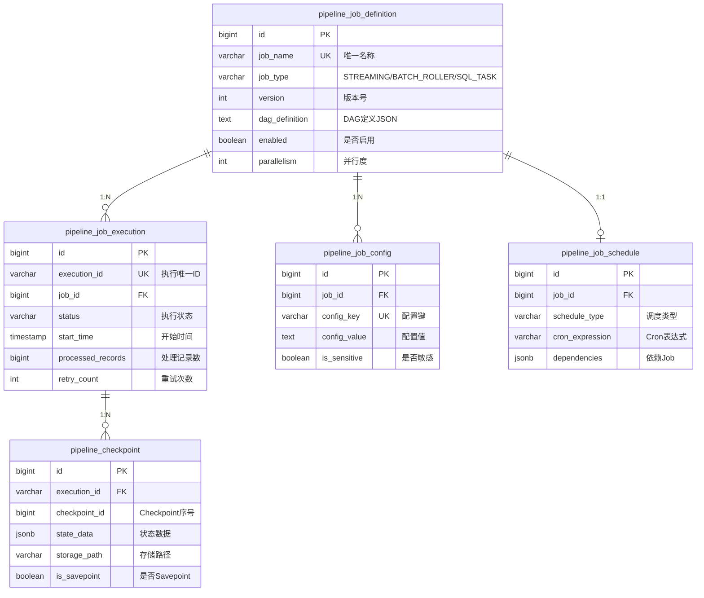

---

## 5. 开发指南

### 5.1 开发自定义 Source Connector

**步骤 1：实现 ReactorSource 接口**

```java
@ConnectorType("custom-api")
public class CustomApiSource implements ReactorSource<CustomData> {
    
    private String apiUrl;
    private String apiKey;
    private int batchSize;
    private int rateLimit;  // 每秒请求数限制
    
    @Override
    public Flux<CustomData> flux() {
        return Flux.create(sink -> {
            // 1. 初始化 HTTP 客户端
            WebClient client = WebClient.builder()
                .baseUrl(apiUrl)
                .defaultHeader("Authorization", "Bearer " + apiKey)
                .build();
            
            AtomicLong offset = new AtomicLong(0);
            
            // 2. 响应下游请求
            sink.onRequest(n -> {
                try {
                    // 限流控制
                    rateLimiter.acquire();
                    
                    // 拉取数据
                    CustomResponse response = client.get()
                        .uri(uriBuilder -> uriBuilder
                            .queryParam("offset", offset.get())
                            .queryParam("limit", batchSize)
                            .build())
                        .retrieve()
                        .bodyToMono(CustomResponse.class)
                        .block();
                    
                    if (response == null || response.getData().isEmpty()) {
                        sink.complete();
                        return;
                    }
                    
                    // 发射数据
                    response.getData().forEach(sink::next);
                    offset.addAndGet(response.getData().size());
                    
                } catch (Exception e) {
                    sink.error(e);
                }
            });
            
            // 3. 清理资源
            sink.onDispose(() -> {
                // 关闭客户端
            });
            
        }, FluxSink.OverflowStrategy.BUFFER);
    }
    
    @Override
    public void restore(Checkpoint checkpoint) {
        if (checkpoint != null) {
            Map<String, Object> state = checkpoint.getStateData();
            Long savedOffset = (Long) state.get("offset");
            if (savedOffset != null) {
                // 从保存的位置继续
            }
        }
    }
    
    // Getter/Setter 用于配置注入
    public void setApiUrl(String apiUrl) { this.apiUrl = apiUrl; }
    public void setApiKey(String apiKey) { this.apiKey = apiKey; }
    public void setBatchSize(int batchSize) { this.batchSize = batchSize; }
}
```

**步骤 2：注册连接器（SPI）**

创建文件：`src/main/resources/META-INF/services/com.pipeline.connector.ReactorSource`

```
com.example.connector.CustomApiSource
```

**步骤 3：使用连接器**

```java
@Bean
public PipelineJob customJob() {
    return PipelineJob.builder()
        .name("custom-api-job")
        .source(CustomApiSource.builder()
            .apiUrl("https://api.example.com/data")
            .apiKey("your-api-key")
            .batchSize(100)
            .build())
        .transform(flux -> flux
            .map(this::process)
            .filter(this::validate)
        )
        .sink(jdbcSink())
        .build();
}
```

### 5.2 本地开发环境

**docker-compose.yml**：

```yaml
version: '3.8'
services:
  postgres:
    image: postgres:14
    container_name: pipeline-postgres
    ports:
      - "5432:5432"
    environment:
      POSTGRES_DB: pipeline
      POSTGRES_USER: pipeline
      POSTGRES_PASSWORD: pipeline123
    volumes:
      - postgres_data:/var/lib/postgresql/data
  
  kafka:
    image: confluentinc/cp-kafka:7.5.0
    container_name: pipeline-kafka
    ports:
      - "9092:9092"
    environment:
      KAFKA_BROKER_ID: 1
      KAFKA_ZOOKEEPER_CONNECT: zookeeper:2181
      KAFKA_ADVERTISED_LISTENERS: PLAINTEXT://localhost:9092
      KAFKA_OFFSETS_TOPIC_REPLICATION_FACTOR: 1
    depends_on:
      - zookeeper
  
  zookeeper:
    image: confluentinc/cp-zookeeper:7.5.0
    container_name: pipeline-zookeeper
    ports:
      - "2181:2181"
    environment:
      ZOOKEEPER_CLIENT_PORT: 2181
  
  minio:
    image: minio/minio:latest
    container_name: pipeline-minio
    ports:
      - "9000:9000"
      - "9001:9001"
    environment:
      MINIO_ROOT_USER: minioadmin
      MINIO_ROOT_PASSWORD: minioadmin
    command: server /data --console-address ":9001"
    volumes:
      - minio_data:/data

volumes:
  postgres_data:
  minio_data:
```

**启动命令**：

```bash
# 1. 启动依赖服务
docker-compose up -d

# 2. 等待服务就绪
sleep 10

# 3. 初始化数据库
psql -h localhost -U pipeline -d pipeline -f schema.sql

# 4. 启动应用
mvn spring-boot:run
```

---

**文档版本**：v4.0
**最后更新**：2025-11-07
**适用人员**：新加入团队的开发人员
