# Pipeline Framework 架构设计文档

## 目录

- [1. 项目概述](#1-项目概述)
- [2. 核心概念](#2-核心概念)
- [3. 核心抽象设计](#3-核心抽象设计)
- [4. 执行流程设计](#4-执行流程设计)
- [5. 背压机制设计](#5-背压机制设计)
- [6. 数据库设计](#6-数据库设计)
- [7. 部署架构](#7-部署架构)

---

## 1. 项目概述

### 1.1 设计理念

Pipeline Framework 借鉴 **Flink 的设计思想**，基于 **Source → Operator → Sink** 的模式构建数据处理流程，但底层使用 **Project Reactor** 实现响应式流处理。

**核心设计原则**：
- **上层抽象**：采用 Flink 的 Source、Operator、Sink 概念模型
- **底层实现**：使用 Reactor 提供响应式能力和天然背压支持
- **单实例执行**：每个 Job 在单个实例内完整执行，不跨实例传输数据
- **状态管理**：借鉴 Flink 的 State Backend 和 Checkpoint 机制

### 1.2 架构分层

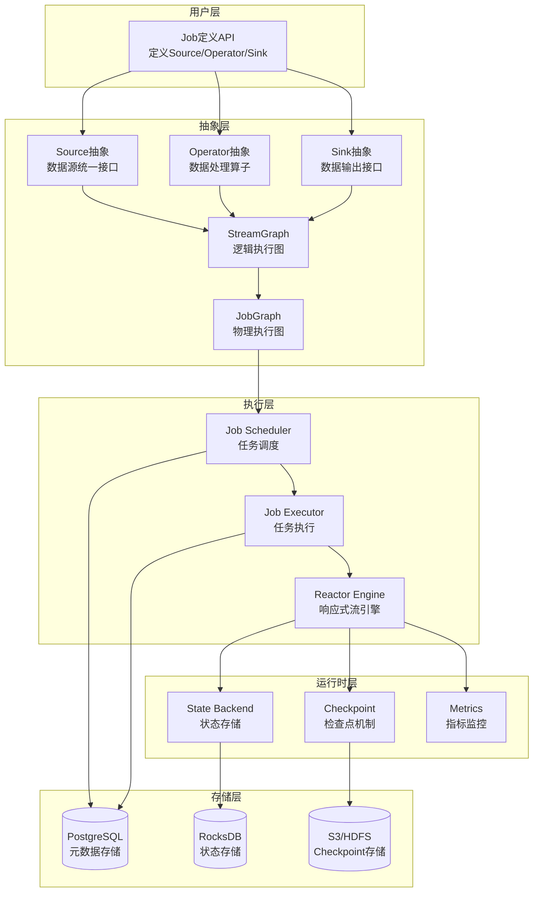
```mermaid
graph TB
    subgraph "用户层"
        API[Job定义API<br/>定义Source/Operator/Sink]
    end
    
    subgraph "抽象层"
        Source[Source抽象<br/>数据源统一接口]
        Operator[Operator抽象<br/>数据处理算子]
        Sink[Sink抽象<br/>数据输出接口]
        StreamGraph[StreamGraph<br/>逻辑执行图]
        JobGraph[JobGraph<br/>物理执行图]
    end
    
    subgraph "执行层"
        Scheduler[Job Scheduler<br/>任务调度]
        Executor[Job Executor<br/>任务执行]
        ReactorEngine[Reactor Engine<br/>响应式流引擎]
    end
    
    subgraph "运行时层"
        State[State Backend<br/>状态存储]
        Checkpoint[Checkpoint<br/>检查点机制]
        Metrics[Metrics<br/>指标监控]
    end
    
    subgraph "存储层"
        PostgreSQL[(PostgreSQL<br/>元数据存储)]
        RocksDB[(RocksDB<br/>状态存储)]
        S3[(S3/HDFS<br/>Checkpoint存储)]
    end
    
    API --> Source
    API --> Operator
    API --> Sink
    
    Source --> StreamGraph
    Operator --> StreamGraph
    Sink --> StreamGraph
    
    StreamGraph --> JobGraph
    JobGraph --> Scheduler
    Scheduler --> Executor
    Executor --> ReactorEngine
    
    ReactorEngine --> State
    ReactorEngine --> Checkpoint
    ReactorEngine --> Metrics
    
    State --> RocksDB
    Checkpoint --> S3
    Scheduler --> PostgreSQL
    Executor --> PostgreSQL
```

### 1.3 三种执行模式

| 模式 | 数据源特征 | 执行特点 | 使用场景 |
|------|-----------|---------|----------|
| **STREAMING** | 无限流（Kafka/MQ） | 持续运行、支持水印、必须Checkpoint | 实时流处理、实时告警 |
| **BATCH_ROLLER** | 有界数据（HTTP API分页） | 自动翻页、读完结束、可选Checkpoint | 数据同步、历史数据迁移 |
| **SQL_TASK** | SQL查询结果 | 执行SQL、流式读取、完成后结束 | 多表Join、数据分析、报表生成 |

---

## 2. 核心概念

### 2.1 八大核心抽象

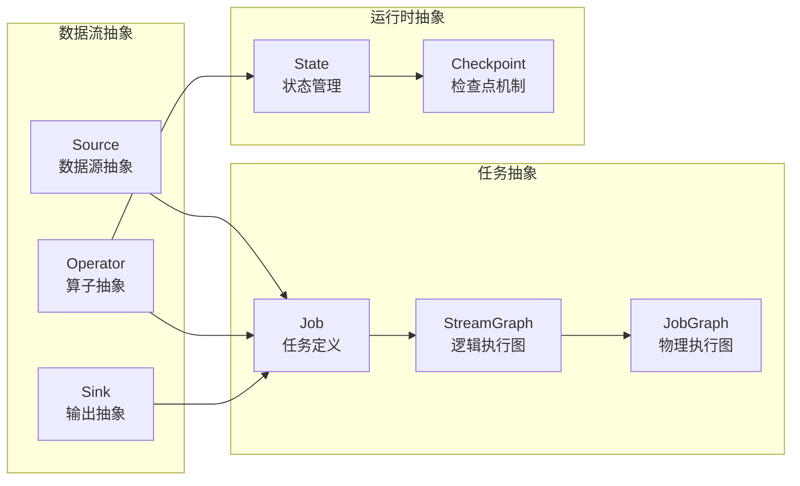
```mermaid
graph LR
    subgraph "数据流抽象"
        Source[Source<br/>数据源抽象]
        Operator[Operator<br/>算子抽象]
        Sink[Sink<br/>输出抽象]
    end
    
    subgraph "任务抽象"
        Job[Job<br/>任务定义]
        StreamGraph[StreamGraph<br/>逻辑执行图]
        JobGraph[JobGraph<br/>物理执行图]
    end
    
    subgraph "运行时抽象"
        State[State<br/>状态管理]
        Checkpoint[Checkpoint<br/>检查点机制]
    end
    
    Source --> Job
    Operator --> Job
    Sink --> Job
    
    Job --> StreamGraph
    StreamGraph --> JobGraph
    
    Operator --> State
    State --> Checkpoint
```

### 2.2 核心概念对照表

| 概念 | 定义 | Flink对应 | 关键能力 |
|------|------|-----------|---------|
| **Source** | 数据源抽象 | SourceFunction | run()发射数据、snapshotState()保存状态、restoreState()恢复 |
| **Operator** | 算子抽象 | StreamOperator | processElement()处理数据、支持有状态/无状态 |
| **Sink** | 输出抽象 | SinkFunction | invoke()写入数据、支持两阶段提交 |
| **Job** | 任务定义 | StreamGraph | 包含Source、Operator链、Sink的完整定义 |
| **StreamGraph** | 逻辑执行图 | StreamGraph | 用户定义的算子拓扑，一对一映射 |
| **JobGraph** | 物理执行图 | JobGraph | 优化后的执行计划，应用算子链 |
| **State** | 状态管理 | State/StateBackend | ValueState、MapState、ListState |
| **Checkpoint** | 检查点 | Checkpoint | Barrier机制、一致性快照 |

---

## 3. 核心抽象设计

### 3.1 Source（数据源抽象）

#### 3.1.1 设计目标

**为什么需要 Source 抽象**：
- 统一不同数据源的接口（Kafka、HTTP、JDBC、文件等）
- 支持 Checkpoint 和状态恢复
- 集成到 Reactor 的响应式流

**设计难点**：
- 如何设计通用接口适配各种数据源？
- 如何在发射数据的同时支持 Checkpoint？
- 如何处理背压（Source 产生速度 > 下游处理速度）？

#### 3.1.2 接口设计

**核心接口**：

```java
public interface Source<T, CheckpointState> {
    // 运行Source，通过SourceContext发射数据
    void run(SourceContext<T> ctx) throws Exception;
    
    // 取消Source
    void cancel();
    
    // 保存Checkpoint状态（如Kafka offset、HTTP页码）
    CheckpointState snapshotState() throws Exception;
    
    // 从Checkpoint恢复状态
    void restoreState(CheckpointState state) throws Exception;
}
```

**设计要点**：
- 使用 `SourceContext` 作为数据发射接口，隔离 Source 和框架
- `snapshotState()` 返回可序列化的状态对象
- `restoreState()` 在启动时恢复到之前的位置

#### 3.1.3 三种 Source 模式设计

**模式 1：流式 Source（STREAMING）**

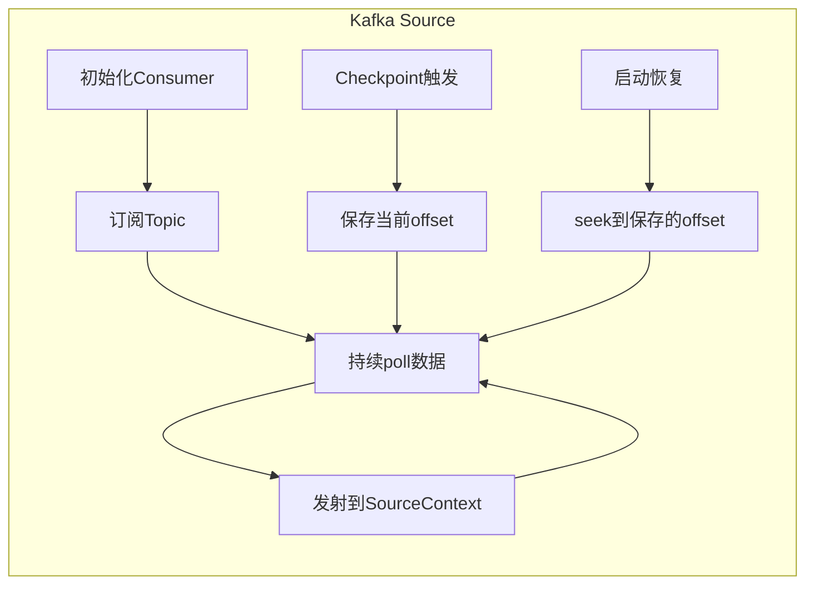
```mermaid
graph LR
    subgraph "Kafka Source"
        Init[初始化Consumer] --> Subscribe[订阅Topic]
        Subscribe --> Poll[持续poll数据]
        Poll --> Emit[发射到SourceContext]
        Emit --> Poll
        
        Checkpoint[Checkpoint触发] --> SaveOffset[保存当前offset]
        SaveOffset --> Poll
        
        Recover[启动恢复] --> SeekOffset[seek到保存的offset]
        SeekOffset --> Poll
    end
```

**特点**：
- 无限流，持续运行
- 保存消费位置（Kafka offset、RabbitMQ delivery tag）
- 恢复时从上次位置继续

**状态内容**：
```json
{
  "source_type": "kafka",
  "offsets": {
    "topic-1": {"partition-0": 12345, "partition-1": 23456}
  }
}
```

**模式 2：滚动翻页 Source（BATCH_ROLLER）**

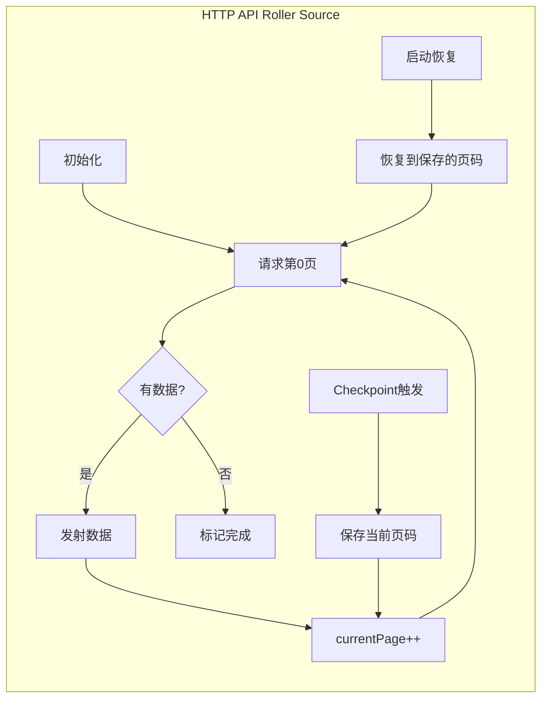
```mermaid
graph LR
    subgraph "HTTP API Roller Source"
        Init[初始化] --> Page0[请求第0页]
        Page0 --> Check1{有数据?}
        Check1 -->|是| Emit1[发射数据]
        Check1 -->|否| Finish[标记完成]
        
        Emit1 --> Next[currentPage++]
        Next --> Page0
        
        Checkpoint[Checkpoint触发] --> SavePage[保存当前页码]
        SavePage --> Next
        
        Recover[启动恢复] --> RestorePage[恢复到保存的页码]
        RestorePage --> Page0
    end
```

**特点**：
- 有界流，自动翻页直到没有数据
- 保存当前页码和页内偏移量
- 恢复时从上次页码继续

**状态内容**：
```json
{
  "source_type": "http_api_roller",
  "current_page": 123,
  "page_size": 1000,
  "last_item_id": "item_123456"
}
```

**模式 3：SQL 任务 Source（SQL_TASK）**

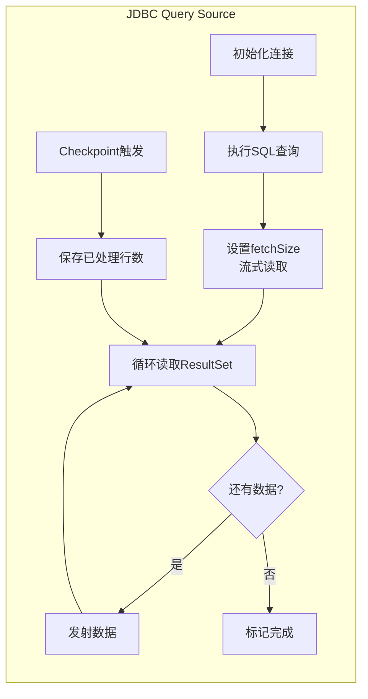
```mermaid
graph LR
    subgraph "JDBC Query Source"
        Init[初始化连接] --> Execute[执行SQL查询]
        Execute --> SetFetch[设置fetchSize<br/>流式读取]
        SetFetch --> Loop[循环读取ResultSet]
        Loop --> Check{还有数据?}
        Check -->|是| Emit[发射数据]
        Check -->|否| Finish[标记完成]
        Emit --> Loop
        
        Checkpoint[Checkpoint触发] --> SaveRows[保存已处理行数]
        SaveRows --> Loop
    end
```

**特点**：
- 执行复杂 SQL（多表 Join、聚合、分析）
- 流式读取 ResultSet，避免 OOM
- 查询完成后自动结束

**设计难点**：
- SQL 查询无法暂停和恢复（不像 Kafka 的 offset）
- 解决方案：使用增量查询 `WHERE id > lastProcessedId`

**状态内容**：
```json
{
  "source_type": "jdbc_query",
  "sql": "SELECT * FROM orders WHERE ...",
  "processed_rows": 1000000,
  "last_processed_id": 999999
}
```

#### 3.1.4 Source 集成到 Reactor

**转换策略**：

```
Source.run() → Flux.create()
```

**关键点**：
- Source 在独立线程中运行
- 通过 SourceContext 发射数据到 FluxSink
- 支持背压：FluxSink 的 request(n) 控制 Source 拉取速度

---

### 3.2 Operator（算子抽象）

#### 3.2.1 设计目标

**为什么需要 Operator 抽象**：
- 统一数据转换接口
- 支持算子链优化（多个算子合并执行）
- 支持有状态算子（窗口、聚合、去重）

**算子分类**：

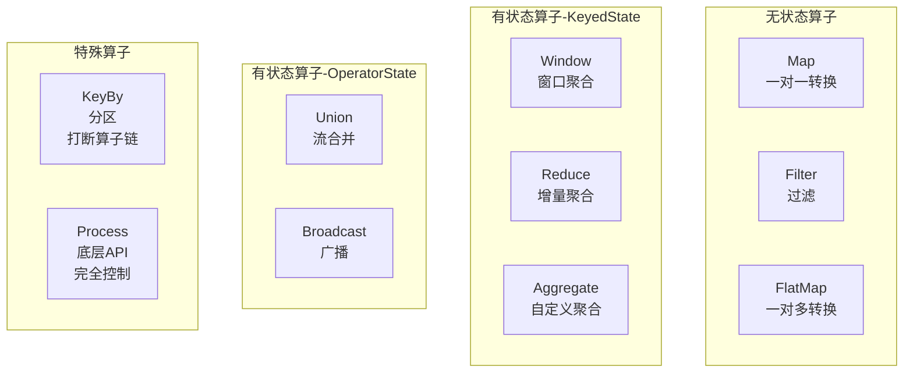
```mermaid
graph TB
    subgraph "无状态算子"
        Map[Map<br/>一对一转换]
        Filter[Filter<br/>过滤]
        FlatMap[FlatMap<br/>一对多转换]
    end
    
    subgraph "有状态算子-KeyedState"
        Window[Window<br/>窗口聚合]
        Reduce[Reduce<br/>增量聚合]
        Aggregate[Aggregate<br/>自定义聚合]
    end
    
    subgraph "有状态算子-OperatorState"
        Union[Union<br/>流合并]
        Broadcast[Broadcast<br/>广播]
    end
    
    subgraph "特殊算子"
        KeyBy[KeyBy<br/>分区<br/>打断算子链]
        Process[Process<br/>底层API<br/>完全控制]
    end
```

#### 3.2.2 接口设计

**核心接口**：

```java
public interface StreamOperator<IN, OUT> {
    // 处理一条数据
    void processElement(IN value, OperatorContext<OUT> ctx);
    
    // 初始化算子（创建状态等）
    void open() throws Exception;
    
    // 关闭算子（清理资源）
    void close() throws Exception;
    
    // 保存状态快照
    void snapshotState(StateSnapshotContext context);
    
    // 恢复状态
    void initializeState(StateInitializationContext context);
}
```

#### 3.2.3 算子链优化

**什么是算子链**：

将多个算子合并到一个执行任务中，避免数据序列化和线程切换开销。

**算子链条件**：

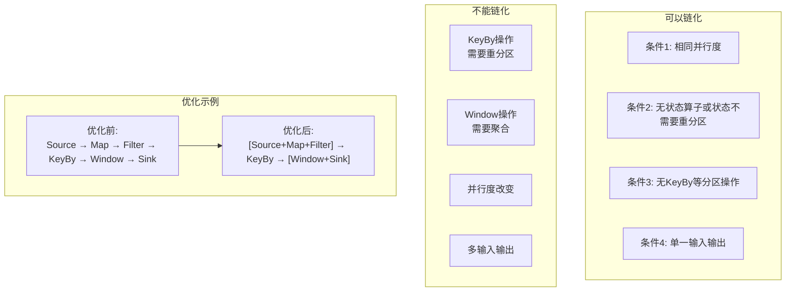
```mermaid
graph TB
    subgraph "可以链化"
        C1[条件1: 相同并行度]
        C2[条件2: 无状态算子或状态不需要重分区]
        C3[条件3: 无KeyBy等分区操作]
        C4[条件4: 单一输入输出]
    end
    
    subgraph "不能链化"
        N1[KeyBy操作<br/>需要重分区]
        N2[Window操作<br/>需要聚合]
        N3[并行度改变]
        N4[多输入输出]
    end
    
    subgraph "优化示例"
        Before["优化前:<br/>Source → Map → Filter → KeyBy → Window → Sink"]
        After["优化后:<br/>[Source+Map+Filter] → KeyBy → [Window+Sink]"]
        
        Before --> After
    end
```

**性能提升**：
- 减少数据序列化：0 次（算子链内直接方法调用）
- 减少线程切换：0 次（单线程执行）
- 提升吞吐量：3-5 倍

---

### 3.3 Sink（输出抽象）

#### 3.3.1 设计目标

**为什么需要 Sink 抽象**：
- 统一不同输出目标的接口
- 支持批量写入优化
- 支持 Exactly-Once 语义（两阶段提交）

#### 3.3.2 接口设计

**基础接口**：

```java
public interface SinkFunction<T> {
    // 写入一条数据
    void invoke(T value, SinkContext context) throws Exception;
    
    // 批量刷新
    void flush() throws Exception;
}
```

**两阶段提交接口（支持 Exactly-Once）**：

```java
public interface TwoPhaseCommitSinkFunction<T, TXN> extends SinkFunction<T> {
    // 开始新事务
    TXN beginTransaction();
    
    // 在事务中写入数据
    void invoke(TXN transaction, T value);
    
    // 预提交（Checkpoint时调用）
    void preCommit(TXN transaction);
    
    // 提交事务（Checkpoint完成后调用）
    void commit(TXN transaction);
    
    // 回滚事务（Checkpoint失败时调用）
    void abort(TXN transaction);
}
```

#### 3.3.3 两阶段提交流程

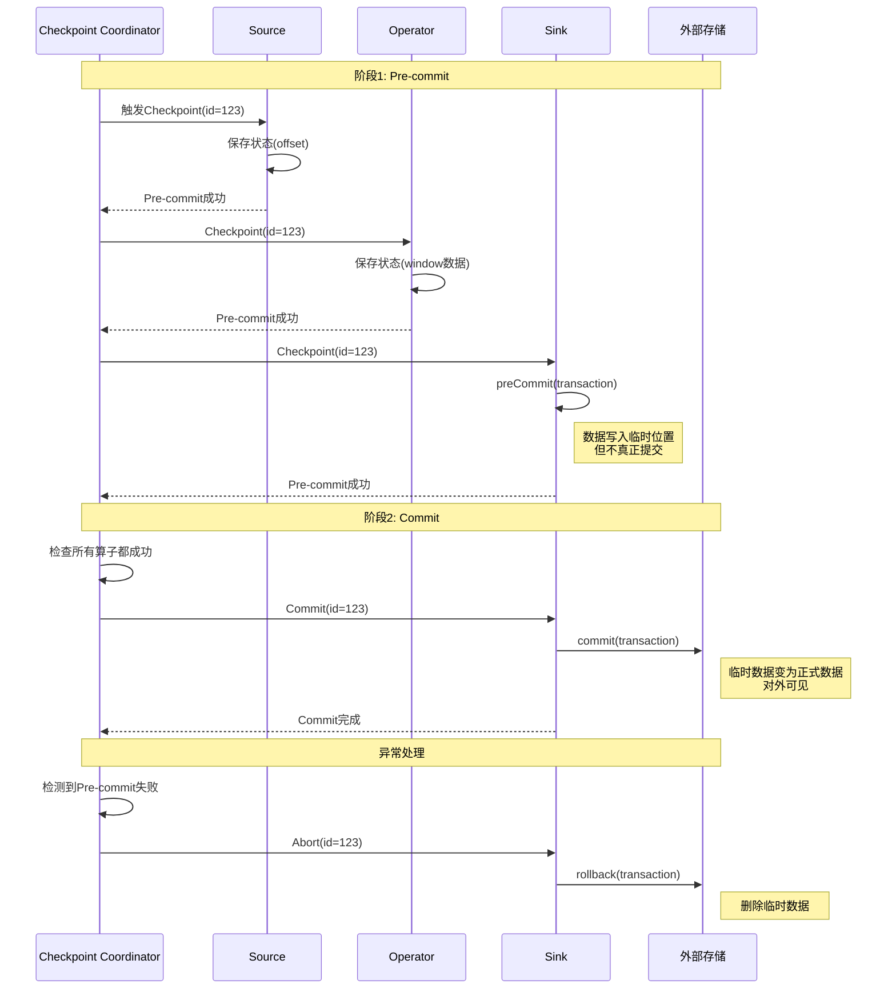
```mermaid
sequenceDiagram
    participant Coordinator as Checkpoint Coordinator
    participant Source as Source
    participant Operator as Operator
    participant Sink as Sink
    participant Storage as 外部存储
    
    Note over Coordinator,Storage: 阶段1: Pre-commit
    
    Coordinator->>Source: 触发Checkpoint(id=123)
    Source->>Source: 保存状态(offset)
    Source-->>Coordinator: Pre-commit成功
    
    Coordinator->>Operator: Checkpoint(id=123)
    Operator->>Operator: 保存状态(window数据)
    Operator-->>Coordinator: Pre-commit成功
    
    Coordinator->>Sink: Checkpoint(id=123)
    Sink->>Sink: preCommit(transaction)
    Note right of Sink: 数据写入临时位置<br/>但不真正提交
    Sink-->>Coordinator: Pre-commit成功
    
    Note over Coordinator,Storage: 阶段2: Commit
    
    Coordinator->>Coordinator: 检查所有算子都成功
    Coordinator->>Sink: Commit(id=123)
    Sink->>Storage: commit(transaction)
    Note right of Storage: 临时数据变为正式数据<br/>对外可见
    Sink-->>Coordinator: Commit完成
    
    Note over Coordinator,Storage: 异常处理
    
    Coordinator->>Coordinator: 检测到Pre-commit失败
    Coordinator->>Sink: Abort(id=123)
    Sink->>Storage: rollback(transaction)
    Note right of Storage: 删除临时数据
```

**Exactly-Once 保证**：
- 所有算子的状态快照对应同一时刻
- 只有所有算子都 Pre-commit 成功，才真正 Commit
- 任何一个失败，全部 Abort

---

### 3.4 Job（任务定义）

#### 3.4.1 Job 组成

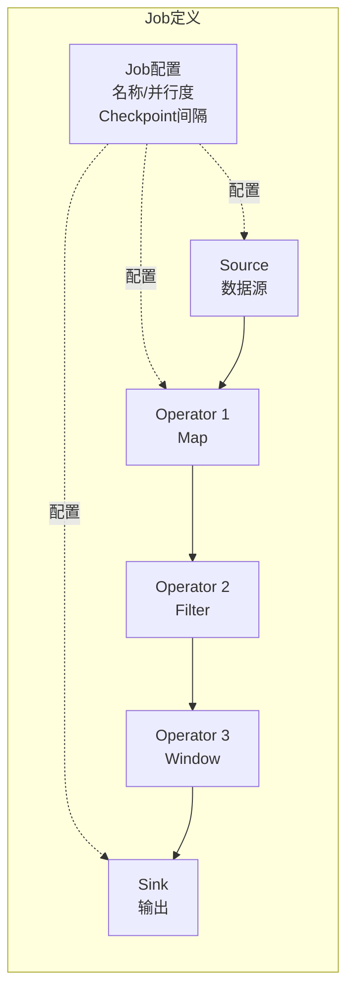
```mermaid
graph LR
    subgraph "Job定义"
        Config[Job配置<br/>名称/并行度<br/>Checkpoint间隔]
        Source[Source<br/>数据源]
        Op1[Operator 1<br/>Map]
        Op2[Operator 2<br/>Filter]
        Op3[Operator 3<br/>Window]
        Sink[Sink<br/>输出]
    end
    
    Config -.配置.-> Source
    Config -.配置.-> Op1
    Config -.配置.-> Sink
    
    Source --> Op1 --> Op2 --> Op3 --> Sink
```

#### 3.4.2 API 设计示例

**流式任务**：
```java
StreamJob.builder()
    .name("realtime-alert")
    .source(new KafkaSource<>("events"))
    .map(event -> parse(event))
    .filter(event -> event.isValid())
    .keyBy(event -> event.getUserId())
    .window(TumblingTimeWindows.of(Duration.ofMinutes(5)))
    .reduce((a, b) -> merge(a, b))
    .sink(new KafkaSink<>("alerts"))
    .config(checkpointInterval(Duration.ofMinutes(1)))
    .build();
```

**滚动翻页任务**：
```java
StreamJob.builder()
    .name("user-sync")
    .source(new HttpApiRollerSource<>("https://api/users", pageSize=1000))
    .map(user -> enrich(user))
    .filter(user -> user.isActive())
    .sink(new JdbcBatchSink<>("INSERT INTO users..."))
    .build();
```

**SQL 任务**：
```java
StreamJob.builder()
    .name("order-report")
    .source(new JdbcQuerySource<>("""
        SELECT u.user_id, COUNT(*) as cnt, SUM(o.amount) as total
        FROM users u JOIN orders o ON u.id = o.user_id
        WHERE u.create_time >= '2024-01-01'
        GROUP BY u.user_id
        """))
    .map(row -> format(row))
    .sink(new FileSink<>("/output/report.csv"))
    .build();
```

---

### 3.5 StreamGraph 和 JobGraph

#### 3.5.1 StreamGraph（逻辑执行图）

**定义**：用户定义的算子拓扑的直接映射

**示例**：
```
用户代码: source.map().filter().keyBy().window().reduce().sink()

StreamGraph:
Node[1]: KafkaSource
  ↓
Node[2]: MapOperator
  ↓
Node[3]: FilterOperator
  ↓
Node[4]: KeyByOperator
  ↓
Node[5]: WindowOperator
  ↓
Node[6]: ReduceOperator
  ↓
Node[7]: KafkaSink
```

#### 3.5.2 JobGraph（物理执行图）

**定义**：应用算子链优化后的执行计划

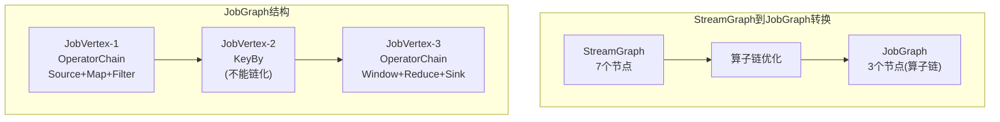
```mermaid
graph TB
    subgraph "StreamGraph到JobGraph转换"
        SG["StreamGraph<br/>7个节点"]
        JG["JobGraph<br/>3个节点(算子链)"]
        
        SG --> Optimize[算子链优化]
        Optimize --> JG
    end
    
    subgraph "JobGraph结构"
        Chain1["JobVertex-1<br/>OperatorChain<br/>Source+Map+Filter"]
        Vertex2["JobVertex-2<br/>KeyBy<br/>(不能链化)"]
        Chain2["JobVertex-3<br/>OperatorChain<br/>Window+Reduce+Sink"]
        
        Chain1 --> Vertex2
        Vertex2 --> Chain2
    end
```

**优化效果**：
- 节点数：7 → 3
- 数据传输次数：6 → 2
- 性能提升：3-5 倍

---

### 3.6 State（状态管理）

#### 3.6.1 状态类型

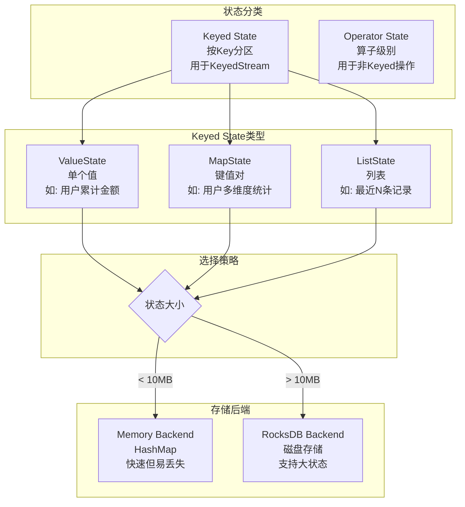
```mermaid
graph TB
    subgraph "状态分类"
        KeyedState[Keyed State<br/>按Key分区<br/>用于KeyedStream]
        OperatorState[Operator State<br/>算子级别<br/>用于非Keyed操作]
    end
    
    subgraph "Keyed State类型"
        ValueState[ValueState<br/>单个值<br/>如: 用户累计金额]
        MapState[MapState<br/>键值对<br/>如: 用户多维度统计]
        ListState[ListState<br/>列表<br/>如: 最近N条记录]
    end
    
    subgraph "存储后端"
        Memory[Memory Backend<br/>HashMap<br/>快速但易丢失]
        RocksDB[RocksDB Backend<br/>磁盘存储<br/>支持大状态]
    end
    
    subgraph "选择策略"
        Decision{状态大小}
        Decision -->|< 10MB| Memory
        Decision -->|> 10MB| RocksDB
    end
    
    KeyedState --> ValueState
    KeyedState --> MapState
    KeyedState --> ListState
    
    ValueState --> Decision
    MapState --> Decision
    ListState --> Decision
```

#### 3.6.2 接口设计

**ValueState**：
```java
public interface ValueState<T> {
    T value();                  // 获取值
    void update(T value);       // 更新值
    void clear();              // 清除
}
```

**MapState**：
```java
public interface MapState<K, V> {
    V get(K key);                        // 获取
    void put(K key, V value);            // 放入
    void remove(K key);                  // 删除
    Iterable<Entry<K, V>> entries();     // 遍历
}
```

---

### 3.7 Checkpoint（检查点机制）

#### 3.7.1 Barrier 机制

**核心思想**：在数据流中插入 Barrier 标记，标记 Checkpoint 的边界


```mermaid
graph TB
    subgraph "Barrier流动"
        S1[Source收到触发] --> S2[保存状态<br/>Kafka offset]
        S2 --> S3[插入Barrier到数据流]
        S3 --> O1[Operator收到Barrier]
        O1 --> O2[保存状态<br/>Window数据]
        O2 --> O3[向下游传播Barrier]
        O3 --> K1[Sink收到Barrier]
        K1 --> K2[保存状态<br/>已写入位置]
        K2 --> K3[通知Checkpoint完成]
    end
    
    subgraph "数据流"
        Data1[数据...] --> B1[Barrier-123]
        B1 --> Data2[数据...]
        Data2 --> B2[Barrier-124]
        B2 --> Data3[数据...]
    end
```

#### 3.7.2 一致性保证

**Checkpoint 的一致性**：

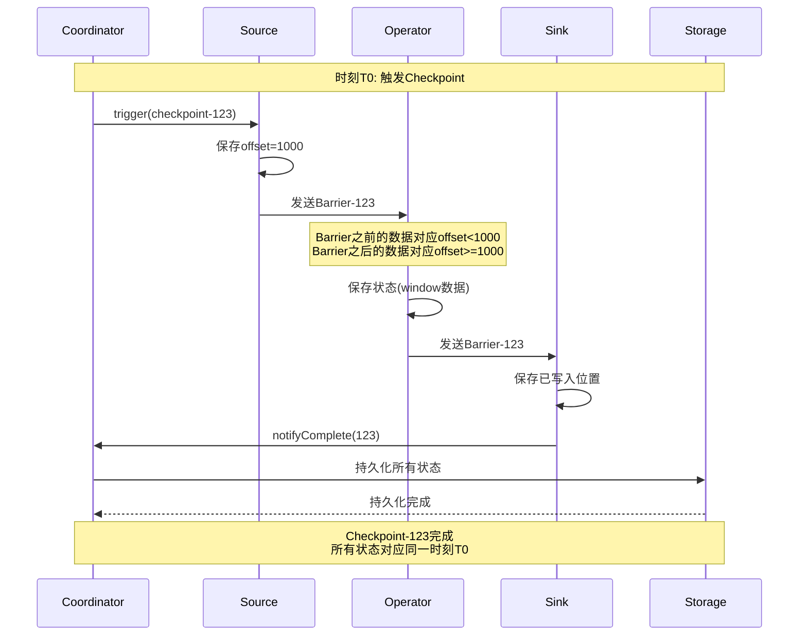
```mermaid
sequenceDiagram
    participant Coordinator
    participant Source
    participant Operator
    participant Sink
    participant Storage
    
    Note over Coordinator,Storage: 时刻T0: 触发Checkpoint
    
    Coordinator->>Source: trigger(checkpoint-123)
    Source->>Source: 保存offset=1000
    Source->>Operator: 发送Barrier-123
    
    Note over Operator: Barrier之前的数据对应offset<1000<br/>Barrier之后的数据对应offset>=1000
    
    Operator->>Operator: 保存状态(window数据)
    Operator->>Sink: 发送Barrier-123
    
    Sink->>Sink: 保存已写入位置
    Sink->>Coordinator: notifyComplete(123)
    
    Coordinator->>Storage: 持久化所有状态
    Storage-->>Coordinator: 持久化完成
    
    Note over Coordinator,Storage: Checkpoint-123完成<br/>所有状态对应同一时刻T0
```

**故障恢复**：

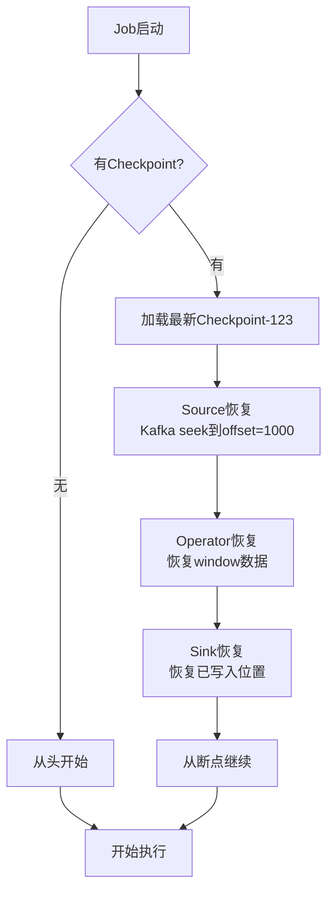
```mermaid
graph TB
    Start[Job启动] --> Check{有Checkpoint?}
    Check -->|无| Fresh[从头开始]
    Check -->|有| Load[加载最新Checkpoint-123]
    
    Load --> RestoreSource[Source恢复<br/>Kafka seek到offset=1000]
    RestoreSource --> RestoreOp[Operator恢复<br/>恢复window数据]
    RestoreOp --> RestoreSink[Sink恢复<br/>恢复已写入位置]
    
    RestoreSink --> Resume[从断点继续]
    Fresh --> Run[开始执行]
    Resume --> Run
```

---

## 4. 执行流程设计

### 4.1 Job 状态机

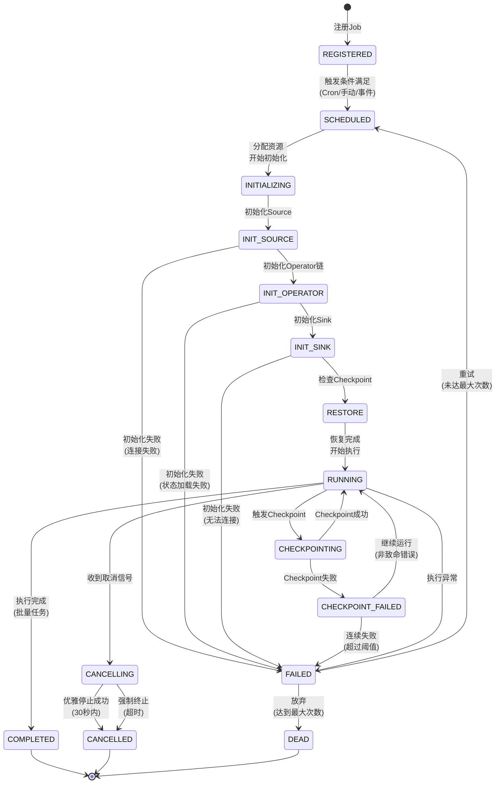
```mermaid
stateDiagram-v2
    [*] --> REGISTERED: 注册Job
    
    REGISTERED --> SCHEDULED: 触发条件满足<br/>(Cron/手动/事件)
    
    SCHEDULED --> INITIALIZING: 分配资源<br/>开始初始化
    
    INITIALIZING --> INIT_SOURCE: 初始化Source
    INIT_SOURCE --> INIT_OPERATOR: 初始化Operator链
    INIT_OPERATOR --> INIT_SINK: 初始化Sink
    INIT_SINK --> RESTORE: 检查Checkpoint
    
    RESTORE --> RUNNING: 恢复完成<br/>开始执行
    INIT_SOURCE --> FAILED: 初始化失败<br/>(连接失败)
    INIT_OPERATOR --> FAILED: 初始化失败<br/>(状态加载失败)
    INIT_SINK --> FAILED: 初始化失败<br/>(无法连接)
    
    RUNNING --> CHECKPOINTING: 触发Checkpoint
    CHECKPOINTING --> RUNNING: Checkpoint成功
    CHECKPOINTING --> CHECKPOINT_FAILED: Checkpoint失败
    CHECKPOINT_FAILED --> RUNNING: 继续运行<br/>(非致命错误)
    CHECKPOINT_FAILED --> FAILED: 连续失败<br/>(超过阈值)
    
    RUNNING --> COMPLETED: 执行完成<br/>(批量任务)
    RUNNING --> FAILED: 执行异常
    RUNNING --> CANCELLING: 收到取消信号
    
    CANCELLING --> CANCELLED: 优雅停止成功<br/>(30秒内)
    CANCELLING --> CANCELLED: 强制终止<br/>(超时)
    
    FAILED --> SCHEDULED: 重试<br/>(未达最大次数)
    FAILED --> DEAD: 放弃<br/>(达到最大次数)
    
    COMPLETED --> [*]
    CANCELLED --> [*]
    DEAD --> [*]
```

**状态说明**：

| 状态 | 说明 | 可转换状态 |
|------|------|-----------|
| REGISTERED | Job已注册但未调度 | SCHEDULED |
| SCHEDULED | Job已调度，等待执行 | INITIALIZING |
| INITIALIZING | 正在初始化组件 | RUNNING, FAILED |
| RUNNING | Job正在执行 | CHECKPOINTING, COMPLETED, FAILED, CANCELLING |
| CHECKPOINTING | 正在执行Checkpoint | RUNNING, CHECKPOINT_FAILED |
| CHECKPOINT_FAILED | Checkpoint失败 | RUNNING, FAILED |
| COMPLETED | 执行完成 | 终态 |
| FAILED | 执行失败 | SCHEDULED, DEAD |
| CANCELLING | 正在取消 | CANCELLED |
| CANCELLED | 已取消 | 终态 |
| DEAD | 彻底失败 | 终态 |

### 4.2 Job 执行时序图

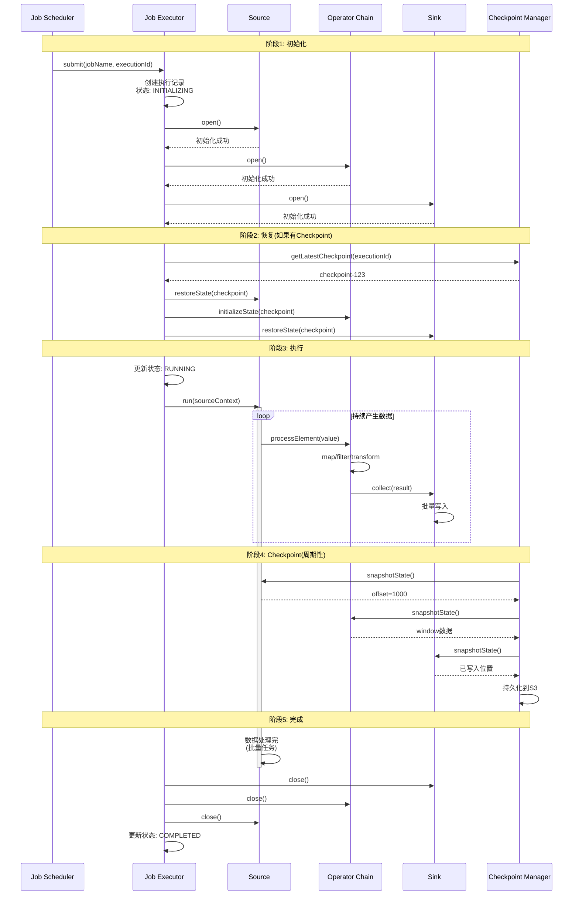
```mermaid
sequenceDiagram
    participant Scheduler as Job Scheduler
    participant Executor as Job Executor
    participant Source as Source
    participant Operator as Operator Chain
    participant Sink as Sink
    participant Checkpoint as Checkpoint Manager
    
    Note over Scheduler,Checkpoint: 阶段1: 初始化
    
    Scheduler->>Executor: submit(jobName, executionId)
    Executor->>Executor: 创建执行记录<br/>状态: INITIALIZING
    
    Executor->>Source: open()
    Source-->>Executor: 初始化成功
    
    Executor->>Operator: open()
    Operator-->>Executor: 初始化成功
    
    Executor->>Sink: open()
    Sink-->>Executor: 初始化成功
    
    Note over Scheduler,Checkpoint: 阶段2: 恢复(如果有Checkpoint)
    
    Executor->>Checkpoint: getLatestCheckpoint(executionId)
    Checkpoint-->>Executor: checkpoint-123
    
    Executor->>Source: restoreState(checkpoint)
    Executor->>Operator: initializeState(checkpoint)
    Executor->>Sink: restoreState(checkpoint)
    
    Note over Scheduler,Checkpoint: 阶段3: 执行
    
    Executor->>Executor: 更新状态: RUNNING
    
    Executor->>Source: run(sourceContext)
    activate Source
    
    loop 持续产生数据
        Source->>Operator: processElement(value)
        Operator->>Operator: map/filter/transform
        Operator->>Sink: collect(result)
        Sink->>Sink: 批量写入
    end
    
    Note over Scheduler,Checkpoint: 阶段4: Checkpoint(周期性)
    
    Checkpoint->>Source: snapshotState()
    Source-->>Checkpoint: offset=1000
    
    Checkpoint->>Operator: snapshotState()
    Operator-->>Checkpoint: window数据
    
    Checkpoint->>Sink: snapshotState()
    Sink-->>Checkpoint: 已写入位置
    
    Checkpoint->>Checkpoint: 持久化到S3
    
    Note over Scheduler,Checkpoint: 阶段5: 完成
    
    Source->>Source: 数据处理完<br/>(批量任务)
    deactivate Source
    
    Executor->>Sink: close()
    Executor->>Operator: close()
    Executor->>Source: close()
    
    Executor->>Executor: 更新状态: COMPLETED
```

### 4.3 三种模式的执行差异

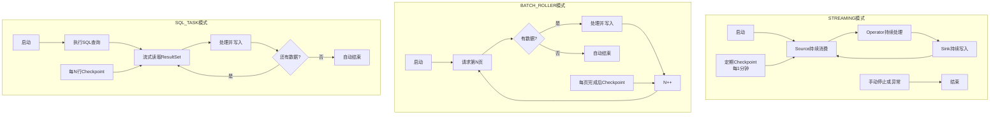
```mermaid
graph TB
    subgraph "STREAMING模式"
        S1[启动] --> S2[Source持续消费]
        S2 --> S3[Operator持续处理]
        S3 --> S4[Sink持续写入]
        S4 --> S2
        
        S5[定期Checkpoint<br/>每1分钟] --> S2
        
        S6[手动停止或异常] --> S7[结束]
    end
    
    subgraph "BATCH_ROLLER模式"
        B1[启动] --> B2[请求第N页]
        B2 --> B3{有数据?}
        B3 -->|是| B4[处理并写入]
        B4 --> B5[N++]
        B5 --> B2
        B3 -->|否| B6[自动结束]
        
        B7[每页完成后Checkpoint] --> B5
    end
    
    subgraph "SQL_TASK模式"
        Q1[启动] --> Q2[执行SQL查询]
        Q2 --> Q3[流式读取ResultSet]
        Q3 --> Q4[处理并写入]
        Q4 --> Q5{还有数据?}
        Q5 -->|是| Q3
        Q5 -->|否| Q6[自动结束]
        
        Q7[每N行Checkpoint] --> Q3
    end
```

---

## 5. 背压机制设计

### 5.1 背压问题

**问题描述**：

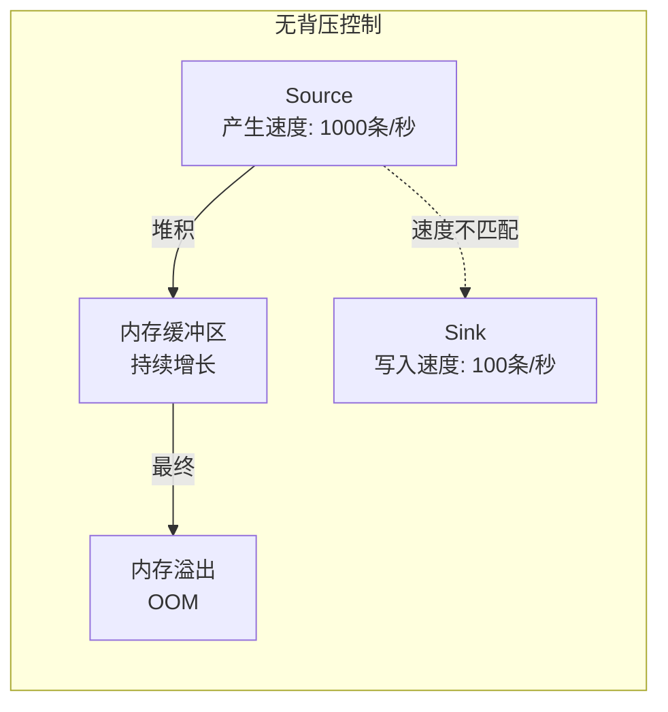
```mermaid
graph LR
    subgraph "无背压控制"
        FastSource[Source<br/>产生速度: 1000条/秒]
        SlowSink[Sink<br/>写入速度: 100条/秒]
        
        FastSource -->|堆积| Buffer[内存缓冲区<br/>持续增长]
        Buffer -->|最终| OOM[内存溢出<br/>OOM]
        
        FastSource -.速度不匹配.-> SlowSink
    end
```

**传统解决方案的问题**：
- 手动实现队列和信号量：复杂、容易出错
- 固定大小缓冲区：要么溢出要么阻塞
- 丢弃数据：不能保证数据完整性

### 5.2 Reactor 背压优势

**Reactor 的天然背压支持**：

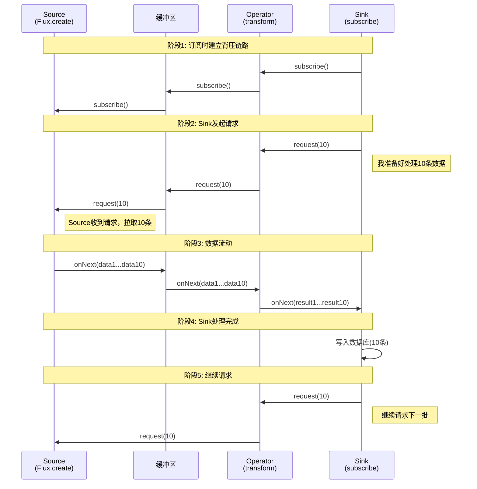
```mermaid
sequenceDiagram
    participant Source as Source<br/>(Flux.create)
    participant Buffer as 缓冲区
    participant Operator as Operator<br/>(transform)
    participant Sink as Sink<br/>(subscribe)
    
    Note over Source,Sink: 阶段1: 订阅时建立背压链路
    
    Sink->>Operator: subscribe()
    Operator->>Buffer: subscribe()
    Buffer->>Source: subscribe()
    
    Note over Source,Sink: 阶段2: Sink发起请求
    
    Sink->>Operator: request(10)
    Note right of Sink: 我准备好处理10条数据
    
    Operator->>Buffer: request(10)
    Buffer->>Source: request(10)
    Note right of Source: Source收到请求，拉取10条
    
    Note over Source,Sink: 阶段3: 数据流动
    
    Source->>Buffer: onNext(data1...data10)
    Buffer->>Operator: onNext(data1...data10)
    Operator->>Sink: onNext(result1...result10)
    
    Note over Source,Sink: 阶段4: Sink处理完成
    
    Sink->>Sink: 写入数据库(10条)
    
    Note over Source,Sink: 阶段5: 继续请求
    
    Sink->>Operator: request(10)
    Note right of Sink: 继续请求下一批
    
    Operator->>Source: request(10)
```

**关键优势**：

| 特性 | 手动实现 | Reactor 背压 |
|------|---------|-------------|
| 实现复杂度 | 需要手动管理队列、锁、信号量 | 开箱即用 |
| 代码量 | 500+ 行 | 0 行（框架提供） |
| 内存控制 | 需要手动限制缓冲区大小 | 自动控制，按需拉取 |
| 性能 | 取决于实现质量 | 高度优化 |
| 错误处理 | 容易出现死锁、内存泄漏 | 框架保证正确性 |

### 5.3 背压策略对比

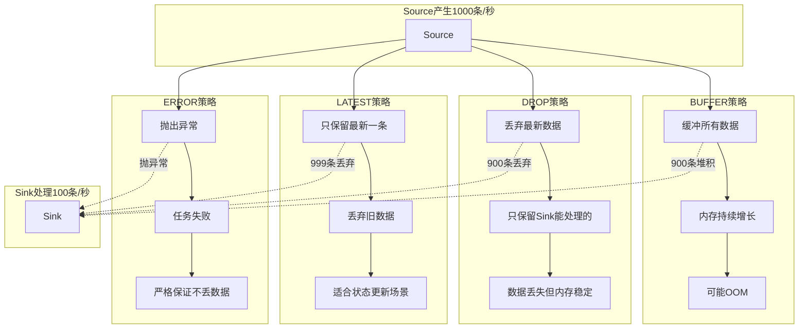
```mermaid
graph TB
    subgraph "Source产生1000条/秒"
        Source[Source]
    end
    
    subgraph "BUFFER策略"
        B1[缓冲所有数据]
        B2[内存持续增长]
        B3[可能OOM]
        B1 --> B2 --> B3
    end
    
    subgraph "DROP策略"
        D1[丢弃最新数据]
        D2[只保留Sink能处理的]
        D3[数据丢失但内存稳定]
        D1 --> D2 --> D3
    end
    
    subgraph "LATEST策略"
        L1[只保留最新一条]
        L2[丢弃旧数据]
        L3[适合状态更新场景]
        L1 --> L2 --> L3
    end
    
    subgraph "ERROR策略"
        E1[抛出异常]
        E2[任务失败]
        E3[严格保证不丢数据]
        E1 --> E2 --> E3
    end
    
    subgraph "Sink处理100条/秒"
        Sink[Sink]
    end
    
    Source --> B1
    Source --> D1
    Source --> L1
    Source --> E1
    
    B1 -.900条堆积.-> Sink
    D1 -.900条丢弃.-> Sink
    L1 -.999条丢弃.-> Sink
    E1 -.抛异常.-> Sink
```

**策略选择指南**：

| 场景 | 推荐策略 | 理由 |
|------|---------|------|
| 实时告警 | DROP | 允许丢失部分数据，保证实时性 |
| 数据同步 | BUFFER | 不能丢数据，配合充足内存 |
| 状态更新 | LATEST | 只关心最新状态 |
| 金融交易 | ERROR | 严格保证数据完整性，失败重试 |

### 5.4 背压监控指标

```mermaid
graph LR
    subgraph "监控指标"
        M1[缓冲区大小<br/>buffer_size]
        M2[丢弃计数<br/>dropped_count]
        M3[背压状态<br/>backpressure_active]
        M4[请求速率<br/>request_rate]
    end
    
    subgraph "告警规则"
        A1[缓冲区 > 90%<br/>警告]
        A2[持续背压 > 5分钟<br/>严重]
        A3[丢弃率 > 10%<br/>警告]
    end
    
    M1 --> A1
    M3 --> A2
    M2 --> A3
```

---

## 6. 数据库设计

### 6.1 pipeline_job_definition（Job定义表）

**表结构**：

```sql
CREATE TABLE pipeline_job_definition (
    id                  BIGSERIAL PRIMARY KEY,
    job_name            VARCHAR(200) NOT NULL UNIQUE,
    job_type            VARCHAR(50) NOT NULL,
    version             INTEGER NOT NULL DEFAULT 1,
    dag_definition      TEXT NOT NULL,
    description         TEXT,
    enabled             BOOLEAN NOT NULL DEFAULT true,
    parallelism         INTEGER DEFAULT 1,
    max_retry_times     INTEGER DEFAULT 3,
    create_time         TIMESTAMP NOT NULL DEFAULT CURRENT_TIMESTAMP,
    update_time         TIMESTAMP NOT NULL DEFAULT CURRENT_TIMESTAMP,
    created_by          VARCHAR(100),
    updated_by          VARCHAR(100),
    
    CONSTRAINT chk_parallelism CHECK (parallelism > 0),
    CONSTRAINT chk_max_retry CHECK (max_retry_times >= 0)
);

CREATE INDEX idx_job_name ON pipeline_job_definition(job_name);
CREATE INDEX idx_job_type ON pipeline_job_definition(job_type);
CREATE INDEX idx_enabled ON pipeline_job_definition(enabled);
CREATE INDEX idx_update_time ON pipeline_job_definition(update_time DESC);

COMMENT ON TABLE pipeline_job_definition IS 'Job定义表，存储Job的元数据';
COMMENT ON COLUMN pipeline_job_definition.job_type IS 'STREAMING/BATCH_ROLLER/SQL_TASK';
COMMENT ON COLUMN pipeline_job_definition.dag_definition IS 'Job的DAG定义，JSON格式';
COMMENT ON COLUMN pipeline_job_definition.version IS '版本号，每次更新自增';
```

**dag_definition JSON 示例**：

```json
{
  "job_name": "realtime-alert",
  "job_type": "STREAMING",
  "source": {
    "type": "kafka",
    "config": {
      "topic": "events",
      "bootstrap.servers": "localhost:9092",
      "group.id": "alert-group"
    }
  },
  "operators": [
    {"type": "map", "function": "parseEvent"},
    {"type": "filter", "condition": "event.isValid()"},
    {"type": "keyBy", "keySelector": "event.getUserId()"},
    {"type": "window", "assigner": "tumbling", "size": "5 minutes"},
    {"type": "reduce", "function": "count"}
  ],
  "sink": {
    "type": "kafka",
    "config": {
      "topic": "alerts",
      "bootstrap.servers": "localhost:9092"
    }
  },
  "config": {
    "checkpoint_interval": 60000,
    "backpressure_strategy": "BUFFER"
  }
}
```

### 6.2 pipeline_job_execution（Job执行记录表）

```sql
CREATE TABLE pipeline_job_execution (
    id                  BIGSERIAL PRIMARY KEY,
    execution_id        VARCHAR(100) NOT NULL UNIQUE,
    job_id              BIGINT NOT NULL,
    job_name            VARCHAR(200) NOT NULL,
    status              VARCHAR(50) NOT NULL,
    start_time          TIMESTAMP NOT NULL,
    end_time            TIMESTAMP,
    duration_ms         BIGINT,
    processed_records   BIGINT DEFAULT 0,
    failed_records      BIGINT DEFAULT 0,
    throughput          DECIMAL(10, 2),
    error_message       TEXT,
    error_stack_trace   TEXT,
    checkpoint_path     VARCHAR(500),
    retry_count         INTEGER DEFAULT 0,
    triggered_by        VARCHAR(100),
    instance_id         VARCHAR(100),
    
    FOREIGN KEY (job_id) REFERENCES pipeline_job_definition(id) ON DELETE CASCADE,
    CONSTRAINT chk_retry_count CHECK (retry_count >= 0)
);

CREATE INDEX idx_execution_id ON pipeline_job_execution(execution_id);
CREATE INDEX idx_job_id_start_time ON pipeline_job_execution(job_id, start_time DESC);
CREATE INDEX idx_status ON pipeline_job_execution(status);
CREATE INDEX idx_start_time ON pipeline_job_execution(start_time DESC);
CREATE INDEX idx_instance_id ON pipeline_job_execution(instance_id);

COMMENT ON TABLE pipeline_job_execution IS 'Job执行记录表';
COMMENT ON COLUMN pipeline_job_execution.status IS 'REGISTERED/SCHEDULED/INITIALIZING/RUNNING/CHECKPOINTING/COMPLETED/FAILED/CANCELLING/CANCELLED/DEAD';
COMMENT ON COLUMN pipeline_job_execution.throughput IS '吞吐量，记录/秒';
COMMENT ON COLUMN pipeline_job_execution.instance_id IS '执行该Job的实例ID';
```

### 6.3 pipeline_checkpoint（Checkpoint记录表）

```sql
CREATE TABLE pipeline_checkpoint (
    id                  BIGSERIAL PRIMARY KEY,
    execution_id        VARCHAR(100) NOT NULL,
    checkpoint_id       BIGINT NOT NULL,
    checkpoint_type     VARCHAR(50) NOT NULL,
    status              VARCHAR(50) NOT NULL,
    state_data          JSONB NOT NULL,
    storage_path        VARCHAR(500),
    storage_size_bytes  BIGINT,
    create_time         TIMESTAMP NOT NULL DEFAULT CURRENT_TIMESTAMP,
    complete_time       TIMESTAMP,
    duration_ms         INTEGER,
    is_savepoint        BOOLEAN DEFAULT false,
    
    FOREIGN KEY (execution_id) REFERENCES pipeline_job_execution(execution_id) ON DELETE CASCADE,
    UNIQUE (execution_id, checkpoint_id),
    CONSTRAINT chk_storage_size CHECK (storage_size_bytes >= 0)
);

CREATE INDEX idx_execution_checkpoint ON pipeline_checkpoint(execution_id, checkpoint_id DESC);
CREATE INDEX idx_create_time ON pipeline_checkpoint(create_time DESC);
CREATE INDEX idx_savepoint ON pipeline_checkpoint(is_savepoint) WHERE is_savepoint = true;
CREATE INDEX idx_status ON pipeline_checkpoint(status);

COMMENT ON TABLE pipeline_checkpoint IS 'Checkpoint记录表';
COMMENT ON COLUMN pipeline_checkpoint.checkpoint_type IS 'STREAMING/BATCH_ROLLER/SQL_TASK';
COMMENT ON COLUMN pipeline_checkpoint.state_data IS '状态数据，JSONB格式，包含Source/Operator/Sink的状态';
COMMENT ON COLUMN pipeline_checkpoint.is_savepoint IS '是否为手动保存点，Savepoint不会被自动清理';
```

**state_data 示例（STREAMING）**：

```json
{
  "checkpoint_id": 123,
  "timestamp": "2024-01-01T10:00:00",
  "source_state": {
    "type": "kafka",
    "offsets": {
      "events-topic": {
        "0": 12345,
        "1": 23456,
        "2": 34567
      }
    }
  },
  "operator_state": {
    "window_operator_1": {
      "windows": [
        {
          "key": "user_123",
          "start": "2024-01-01T09:55:00",
          "end": "2024-01-01T10:00:00",
          "accumulator": {"count": 100, "sum": 5000}
        }
      ]
    }
  },
  "sink_state": {
    "type": "kafka",
    "transaction_id": "txn-123",
    "committed_offset": 12000
  }
}
```

**state_data 示例（BATCH_ROLLER）**：

```json
{
  "checkpoint_id": 45,
  "timestamp": "2024-01-01T10:00:00",
  "source_state": {
    "type": "http_api_roller",
    "current_page": 123,
    "page_size": 1000,
    "total_processed": 123000,
    "last_item_id": "item_123456"
  },
  "sink_state": {
    "type": "jdbc",
    "batch_number": 123,
    "rows_written": 123000
  }
}
```

**state_data 示例（SQL_TASK）**：

```json
{
  "checkpoint_id": 10,
  "timestamp": "2024-01-01T10:00:00",
  "source_state": {
    "type": "jdbc_query",
    "sql": "SELECT * FROM orders WHERE ...",
    "processed_rows": 1000000,
    "last_processed_id": 999999,
    "result_set_position": 1000000
  },
  "sink_state": {
    "type": "file",
    "file_path": "/output/report.csv",
    "bytes_written": 52428800,
    "rows_written": 1000000
  }
}
```

### 6.4 pipeline_job_config（Job配置表）

```sql
CREATE TABLE pipeline_job_config (
    id              BIGSERIAL PRIMARY KEY,
    job_id          BIGINT NOT NULL,
    config_key      VARCHAR(200) NOT NULL,
    config_value    TEXT NOT NULL,
    config_type     VARCHAR(50) NOT NULL,
    description     TEXT,
    is_sensitive    BOOLEAN DEFAULT false,
    create_time     TIMESTAMP NOT NULL DEFAULT CURRENT_TIMESTAMP,
    update_time     TIMESTAMP NOT NULL DEFAULT CURRENT_TIMESTAMP,
    
    FOREIGN KEY (job_id) REFERENCES pipeline_job_definition(id) ON DELETE CASCADE,
    UNIQUE (job_id, config_key)
);

CREATE INDEX idx_job_config ON pipeline_job_config(job_id);
CREATE INDEX idx_config_key ON pipeline_job_config(config_key);

COMMENT ON TABLE pipeline_job_config IS 'Job配置表，存储Job的运行时配置';
COMMENT ON COLUMN pipeline_job_config.config_type IS 'STRING/INT/BOOLEAN/JSON';
COMMENT ON COLUMN pipeline_job_config.is_sensitive IS '是否为敏感配置（如密码），需要加密存储';
```

**常用配置项**：

| config_key | config_type | 说明 | 示例值 |
|-----------|-------------|------|--------|
| parallelism | INT | 并行度 | 4 |
| checkpoint.interval | INT | Checkpoint间隔（毫秒） | 60000 |
| checkpoint.retention | INT | 保留Checkpoint数量 | 10 |
| checkpoint.timeout | INT | Checkpoint超时（毫秒） | 600000 |
| backpressure.strategy | STRING | 背压策略 | BUFFER/DROP/LATEST/ERROR |
| source.batch.size | INT | Source批量大小 | 100 |
| sink.batch.size | INT | Sink批量大小 | 1000 |
| sink.flush.interval | INT | Sink刷新间隔（毫秒） | 5000 |
| max.retry.times | INT | 最大重试次数 | 3 |
| retry.interval | INT | 重试间隔（毫秒） | 5000 |

### 6.5 pipeline_job_schedule（Job调度配置表）

```sql
CREATE TABLE pipeline_job_schedule (
    id                  BIGSERIAL PRIMARY KEY,
    job_id              BIGINT NOT NULL,
    schedule_type       VARCHAR(50) NOT NULL,
    cron_expression     VARCHAR(100),
    event_topic         VARCHAR(200),
    dependencies        JSONB,
    enabled             BOOLEAN NOT NULL DEFAULT true,
    last_trigger_time   TIMESTAMP,
    next_trigger_time   TIMESTAMP,
    trigger_count       BIGINT DEFAULT 0,
    create_time         TIMESTAMP NOT NULL DEFAULT CURRENT_TIMESTAMP,
    update_time         TIMESTAMP NOT NULL DEFAULT CURRENT_TIMESTAMP,
    
    FOREIGN KEY (job_id) REFERENCES pipeline_job_definition(id) ON DELETE CASCADE,
    UNIQUE (job_id)
);

CREATE INDEX idx_schedule_job ON pipeline_job_schedule(job_id);
CREATE INDEX idx_next_trigger ON pipeline_job_schedule(next_trigger_time) WHERE enabled = true;
CREATE INDEX idx_schedule_type ON pipeline_job_schedule(schedule_type);

COMMENT ON TABLE pipeline_job_schedule IS 'Job调度配置表';
COMMENT ON COLUMN pipeline_job_schedule.schedule_type IS 'CRON/MANUAL/EVENT/DEPENDENCY';
COMMENT ON COLUMN pipeline_job_schedule.dependencies IS '依赖的Job列表，JSON数组格式: ["job1", "job2"]';
```

### 6.6 数据库 ER 图

```mermaid
erDiagram
    pipeline_job_definition ||--o{ pipeline_job_execution : "1:N 一个Job多次执行"
    pipeline_job_definition ||--o{ pipeline_job_config : "1:N 一个Job多个配置"
    pipeline_job_definition ||--o| pipeline_job_schedule : "1:1 一个Job一个调度"
    pipeline_job_execution ||--o{ pipeline_checkpoint : "1:N 一次执行多个Checkpoint"
    
    pipeline_job_definition {
        bigint id PK
        varchar job_name UK "唯一名称"
        varchar job_type "STREAMING/BATCH_ROLLER/SQL_TASK"
        int version "版本号"
        text dag_definition "DAG定义JSON"
        boolean enabled "是否启用"
        int parallelism "并行度"
        int max_retry_times "最大重试次数"
    }
    
    pipeline_job_execution {
        bigint id PK
        varchar execution_id UK "执行唯一ID"
        bigint job_id FK
        varchar job_name "Job名称冗余"
        varchar status "执行状态"
        timestamp start_time "开始时间"
        timestamp end_time "结束时间"
        bigint processed_records "处理记录数"
        bigint failed_records "失败记录数"
        decimal throughput "吞吐量"
        varchar instance_id "执行实例"
    }
    
    pipeline_checkpoint {
        bigint id PK
        varchar execution_id FK
        bigint checkpoint_id "Checkpoint序号"
        varchar checkpoint_type "类型"
        varchar status "状态"
        jsonb state_data "状态数据"
        varchar storage_path "存储路径"
        bigint storage_size_bytes "存储大小"
        boolean is_savepoint "是否Savepoint"
    }
    
    pipeline_job_config {
        bigint id PK
        bigint job_id FK
        varchar config_key UK "配置键"
        text config_value "配置值"
        varchar config_type "类型"
        boolean is_sensitive "是否敏感"
    }
    
    pipeline_job_schedule {
        bigint id PK
        bigint job_id FK UK
        varchar schedule_type "调度类型"
        varchar cron_expression "Cron表达式"
        jsonb dependencies "依赖Job"
        timestamp next_trigger_time "下次触发时间"
    }
```

---

## 7. 部署架构

### 7.1 部署拓扑

```mermaid
graph TB
    subgraph "负载均衡层"
        LB[Nginx/HAProxy<br/>负载均衡器]
    end
    
    subgraph "应用层 - Kubernetes集群"
        subgraph "Pipeline Namespace"
            Pod1[Pipeline Instance 1<br/>运行 Job-A, Job-B]
            Pod2[Pipeline Instance 2<br/>运行 Job-C, Job-D]
            Pod3[Pipeline Instance 3<br/>运行 Job-E, Job-F]
        end
        
        Service[Kubernetes Service<br/>服务发现]
        
        Pod1 --> Service
        Pod2 --> Service
        Pod3 --> Service
    end
    
    subgraph "存储层"
        PG[(PostgreSQL<br/>元数据存储<br/>Job定义/执行记录)]
        RDB[(RocksDB<br/>State Backend<br/>算子状态)]
        S3[(S3/MinIO<br/>Checkpoint存储<br/>状态快照)]
    end
    
    subgraph "数据源层"
        Kafka[(Kafka<br/>消息队列)]
        MySQL[(MySQL<br/>关系数据库)]
        API[HTTP APIs<br/>外部接口]
    end
    
    subgraph "监控层"
        Prometheus[Prometheus<br/>指标采集]
        Grafana[Grafana<br/>可视化]
        Alert[Alertmanager<br/>告警]
    end
    
    LB --> Service
    
    Pod1 --> PG
    Pod2 --> PG
    Pod3 --> PG
    
    Pod1 --> RDB
    Pod2 --> RDB
    Pod3 --> RDB
    
    Pod1 --> S3
    Pod2 --> S3
    Pod3 --> S3
    
    Pod1 --> Kafka
    Pod2 --> MySQL
    Pod3 --> API
    
    Pod1 --> Prometheus
    Pod2 --> Prometheus
    Pod3 --> Prometheus
    
    Prometheus --> Grafana
    Prometheus --> Alert
```

### 7.2 监控指标

**关键指标**：

| 指标类别 | 指标名称 | 说明 | 告警阈值 |
|---------|---------|------|---------|
| **Job指标** | job_execution_total | Job执行总次数 | - |
| | job_execution_success | Job成功次数 | - |
| | job_execution_failure | Job失败次数 | - |
| | job_success_rate | Job成功率 | < 95% 告警 |
| | job_duration_seconds | Job执行时长 | > 2倍平均值告警 |
| **数据指标** | records_processed_total | 处理记录总数 | - |
| | records_failed_total | 失败记录总数 | - |
| | throughput | 吞吐量（条/秒） | < 正常值50% 告警 |
| | latency_seconds | 处理延迟 | > 5秒告警 |
| **Checkpoint指标** | checkpoint_total | Checkpoint总次数 | - |
| | checkpoint_success_rate | Checkpoint成功率 | < 95% 告警 |
| | checkpoint_duration_seconds | Checkpoint时长 | > 60秒告警 |
| | checkpoint_state_size_bytes | 状态大小 | > 10GB 警告 |
| **背压指标** | backpressure_active | 是否发生背压 | 持续5分钟告警 |
| | buffer_size | 缓冲区大小 | > 90% 告警 |
| | dropped_records | 丢弃记录数 | > 0 告警 |
| **系统指标** | cpu_usage | CPU使用率 | > 80% 告警 |
| | memory_usage | 内存使用率 | > 85% 告警 |
| | gc_pause_seconds | GC暂停时间 | > 1秒告警 |

---

**文档版本**：v6.0 架构设计版
**最后更新**：2025-11-07
**文档性质**：架构设计文档（非实现文档）
**设计理念**：Flink 抽象 + Reactor 实现
