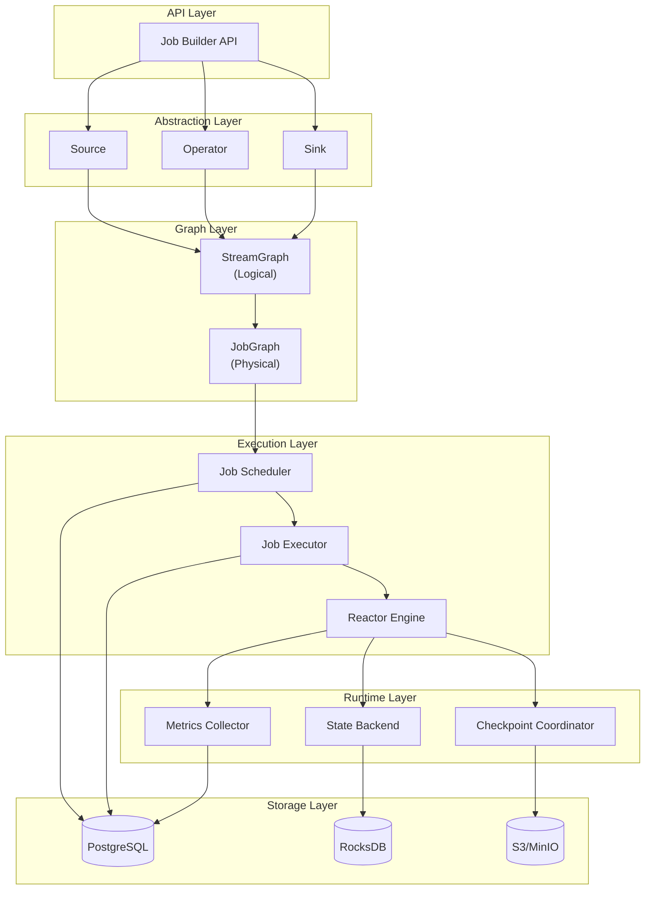
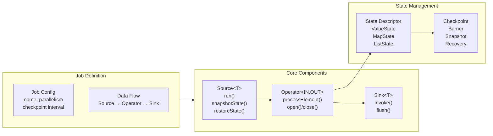
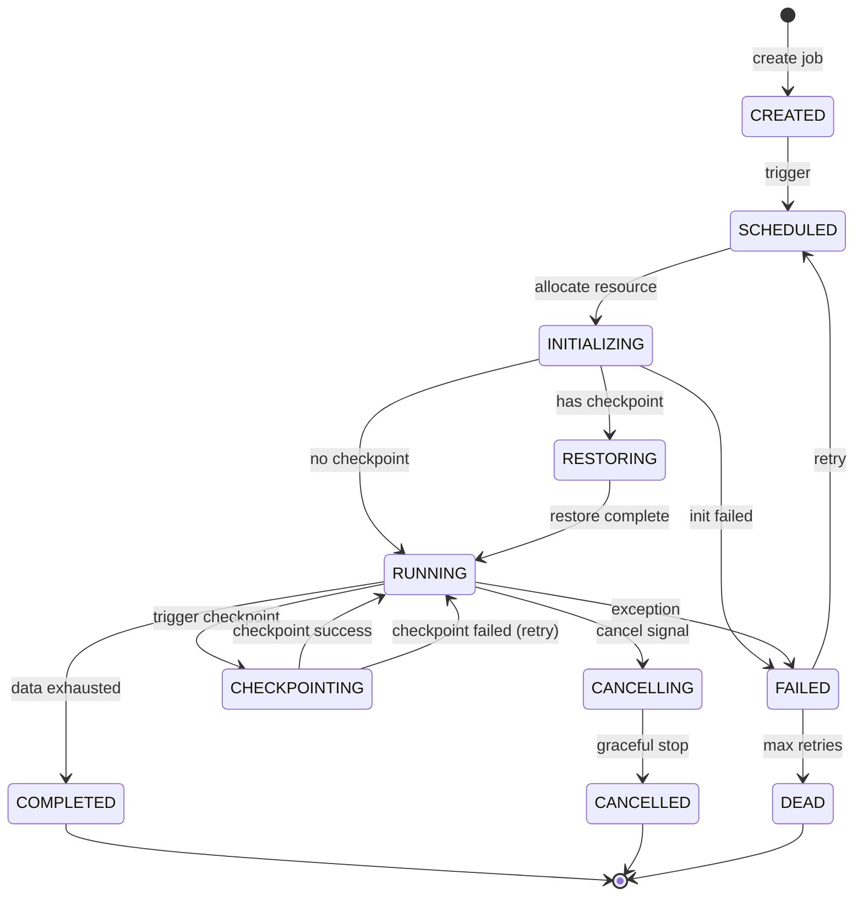
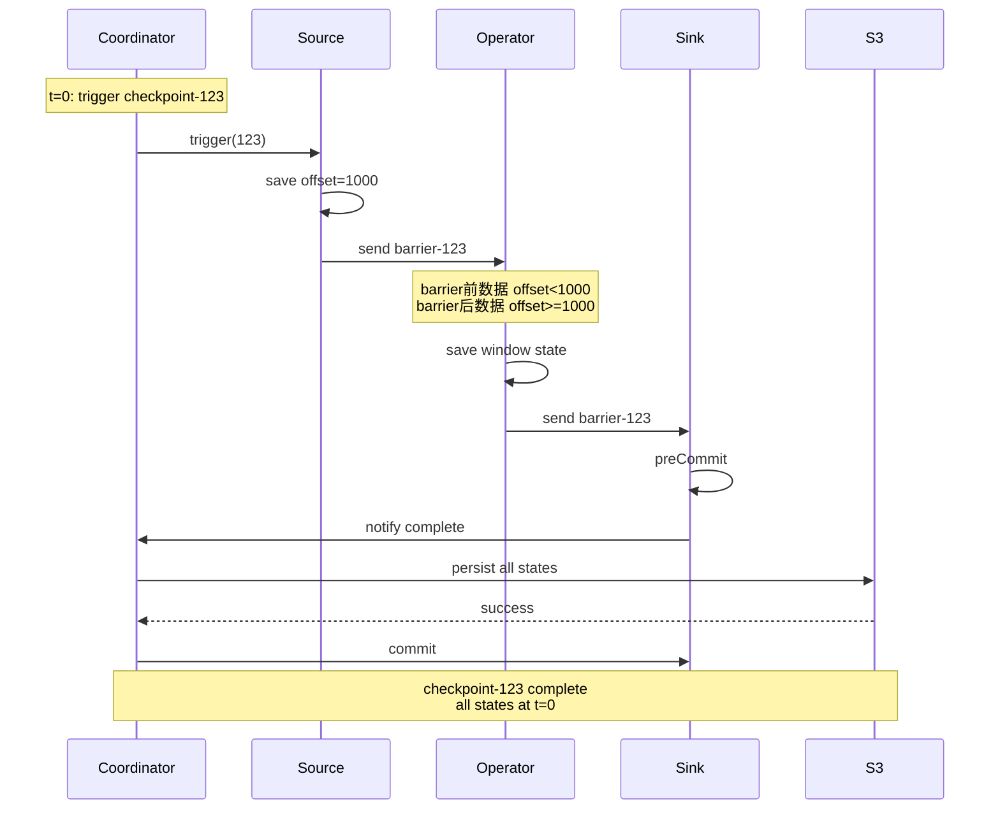
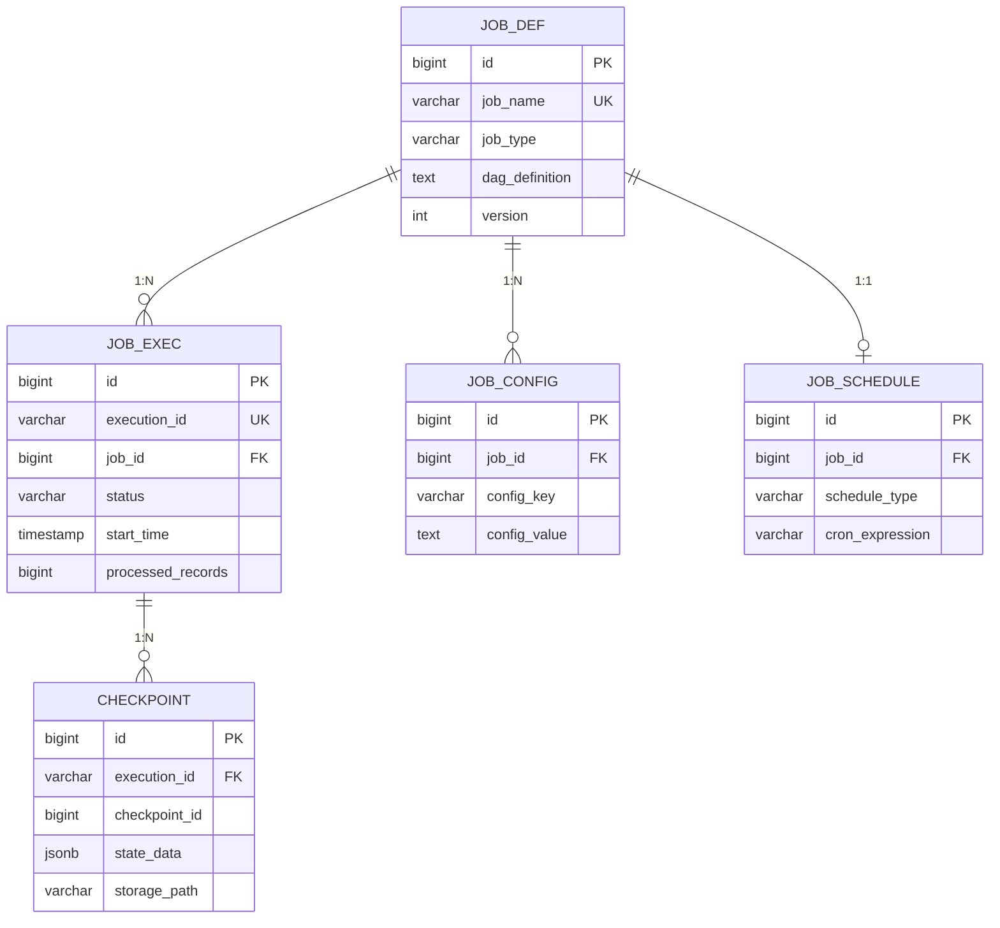
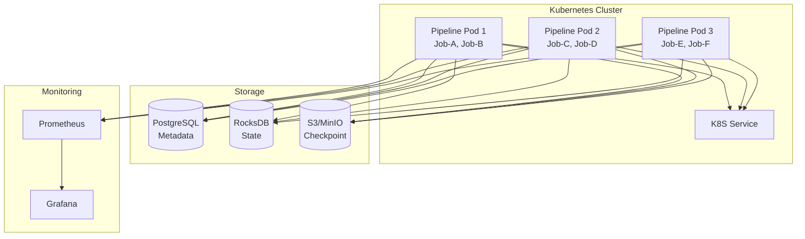

# Pipeline Framework 架构设计文档

## 目录

- [1. 项目概述](#1-项目概述)
- [2. 整体架构](#2-整体架构)
- [3. 核心抽象](#3-核心抽象)
- [4. 执行模型](#4-执行模型)
- [5. 状态与容错](#5-状态与容错)
- [6. 数据库设计](#6-数据库设计)
- [7. 部署方案](#7-部署方案)

---

## 1. 项目概述

### 1.1 设计目标

构建一个**轻量级、响应式、可靠**的数据处理框架，借鉴 Flink 的设计思想，但底层使用 Project Reactor 实现。

**核心特点**：
- **上层抽象**：Source → Operator → Sink，与 Flink 概念对齐
- **底层引擎**：Project Reactor，天然支持背压和响应式流
- **执行模型**：每个 Job 在单实例内完整执行，无跨实例数据传输
- **容错机制**：Checkpoint 机制保证状态一致性和故障恢复

### 1.2 三种执行模式

| 模式 | 场景 | 数据特征 | 执行特点 |
|------|------|---------|---------|
| **STREAMING** | 实时流处理 | 无限流（Kafka/MQ） | 持续运行、定期Checkpoint、支持窗口 |
| **BATCH_ROLLER** | 数据同步 | 分页API | 自动翻页、读完结束、保存页码 |
| **SQL_TASK** | 数据分析 | 复杂SQL结果 | 执行SQL、流式读取、完成后结束 |

### 1.3 技术选型

| 组件 | 选型 | 作用 |
|------|------|------|
| 响应式流引擎 | Project Reactor | 背压控制、异步处理 |
| 元数据存储 | PostgreSQL | Job定义、执行记录、Checkpoint元信息 |
| 状态存储 | RocksDB | 算子状态（窗口数据、聚合值） |
| Checkpoint存储 | S3/MinIO | 状态快照持久化 |
| 任务调度 | Spring Scheduler | Cron表达式、依赖调度 |
| 监控指标 | Micrometer + Prometheus | 吞吐量、延迟、背压 |

---

## 2. 整体架构

### 2.1 系统分层



**架构说明**：

- **API Layer**：提供 Job 定义 API，用户通过 Builder 模式定义 Source、Operator、Sink
- **Abstraction Layer**：核心抽象接口，定义数据源、处理算子、输出目标的统一规范
- **Graph Layer**：将用户定义转换为执行图
  - StreamGraph：逻辑执行图，一对一映射用户定义
  - JobGraph：物理执行图，应用算子链优化
- **Execution Layer**：任务调度和执行
  - Scheduler：根据调度配置触发 Job
  - Executor：管理 Job 生命周期
  - Reactor Engine：基于 Reactor 的流处理引擎
- **Runtime Layer**：运行时支持
  - State Backend：算子状态管理
  - Checkpoint Coordinator：定期触发 Checkpoint
  - Metrics Collector：采集性能指标
- **Storage Layer**：持久化存储
  - PostgreSQL：元数据（Job定义、执行记录、Checkpoint元信息）
  - RocksDB：算子状态（窗口数据、聚合值）
  - S3/MinIO：Checkpoint快照文件

### 2.2 核心模块职责

| 模块 | 职责 | 输入 | 输出 |
|------|------|------|------|
| **Job Builder** | 构建 Job 定义 | Source/Operator/Sink配置 | StreamGraph |
| **Graph Optimizer** | 优化执行图 | StreamGraph | JobGraph |
| **Job Scheduler** | 任务调度 | 调度配置（Cron/依赖） | 触发执行信号 |
| **Job Executor** | 任务执行 | JobGraph | 执行结果 |
| **Reactor Engine** | 流处理引擎 | Source Flux | Sink结果 |
| **State Backend** | 状态管理 | 状态读写请求 | 状态值 |
| **Checkpoint Coordinator** | 检查点协调 | Checkpoint触发信号 | 快照文件 |

---

## 3. 核心抽象

### 3.1 抽象关系图



**关系说明**：

- **Job**：由配置（名称、并行度、Checkpoint间隔）和数据流定义（Source → Operator → Sink）组成
- **Source**：数据源抽象，负责产生数据流，支持状态快照和恢复
- **Operator**：数据处理算子，可以是无状态（Map/Filter）或有状态（Window/Aggregate）
- **Sink**：数据输出抽象，负责将处理结果写入外部系统
- **State**：Operator 可以关联状态，状态通过 Checkpoint 机制持久化

### 3.2 Source 设计

**接口定义**：

```java
public interface Source<T, CheckpointState extends Serializable> {
    void run(SourceContext<T> ctx) throws Exception;
    void cancel();
    CheckpointState snapshotState() throws Exception;
    void restoreState(CheckpointState state) throws Exception;
}
```

**三种模式的 Source 实现**：

**（1）STREAMING - KafkaSource**

- **状态内容**：Topic 各分区的 offset
- **运行机制**：持续 poll 消息，通过 SourceContext 发射数据
- **恢复机制**：从 Checkpoint 保存的 offset 继续消费

```json
{
  "offsets": {
    "topic-1": {"0": 12345, "1": 23456}
  }
}
```

**（2）BATCH_ROLLER - HttpApiRollerSource**

- **状态内容**：当前页码、页内偏移量
- **运行机制**：自动翻页请求，直到返回空数据
- **恢复机制**：从 Checkpoint 保存的页码继续翻页

```json
{
  "current_page": 123,
  "page_size": 1000,
  "last_item_id": "item_123456"
}
```

**（3）SQL_TASK - JdbcQuerySource**

- **状态内容**：已处理行数、最后处理的记录 ID
- **运行机制**：执行 SQL，流式读取 ResultSet（设置 fetchSize 避免 OOM）
- **恢复机制**：使用增量查询 `WHERE id > lastProcessedId`

```json
{
  "sql": "SELECT * FROM orders WHERE ...",
  "processed_rows": 1000000,
  "last_processed_id": 999999
}
```

**设计难点与解决方案**：

| 难点 | 解决方案 |
|------|---------|
| 如何适配不同数据源 | 定义通用接口，由具体实现适配（Kafka/HTTP/JDBC） |
| 如何支持 Checkpoint | 抽象 snapshotState() 方法，由实现类保存必要的位置信息 |
| 如何集成到 Reactor | 使用 Flux.create() 将 Source.run() 转换为 Flux |
| SQL 无法暂停恢复 | 使用增量查询 + 记录最后处理位置的方式实现断点续传 |

### 3.3 Operator 设计

**Operator 分类**：

| 类型 | 算子 | 是否有状态 | 是否打断算子链 |
|------|------|-----------|--------------|
| **转换算子** | Map, FlatMap | 否 | 否 |
| **过滤算子** | Filter | 否 | 否 |
| **分区算子** | KeyBy | 否 | **是**（需要重分区） |
| **窗口算子** | Window | 是 | **是**（需要聚合） |
| **聚合算子** | Reduce, Aggregate | 是 | 否 |

**算子链优化**：

将多个连续的无状态算子合并到一个任务中执行，避免：
- 数据序列化/反序列化开销
- 线程切换开销
- 队列传输开销

**示例**：
```
优化前：Source → Map → Filter → KeyBy → Window → Sink
         (6个任务)

优化后：[Source+Map+Filter] → KeyBy → [Window+Sink]
        (3个任务)
```

**性能提升**：吞吐量提升 3-5 倍

### 3.4 Sink 设计

**基础接口**：

```java
public interface SinkFunction<T> {
    void invoke(T value, SinkContext context) throws Exception;
    void flush() throws Exception;
}
```

**两阶段提交接口（支持 Exactly-Once）**：

```java
public interface TwoPhaseCommitSinkFunction<T, TXN> extends SinkFunction<T> {
    TXN beginTransaction();
    void invoke(TXN transaction, T value);
    void preCommit(TXN transaction);   // Checkpoint 时调用
    void commit(TXN transaction);      // Checkpoint 完成后调用
    void abort(TXN transaction);       // Checkpoint 失败时调用
}
```

**Exactly-Once 语义保证**：

通过两阶段提交协议，确保 Sink 的写入与 Checkpoint 的完成是原子性的：
1. **Pre-commit 阶段**：所有算子保存状态，Sink 将数据写入临时位置
2. **Commit 阶段**：所有算子都成功后，Sink 真正提交数据
3. **Abort 阶段**：任何算子失败，Sink 回滚临时数据

---

## 4. 执行模型

### 4.1 Job 生命周期



**状态说明**：

| 状态 | 含义 | 停留时长 |
|------|------|---------|
| **CREATED** | Job 已定义但未调度 | 长期（等待触发） |
| **SCHEDULED** | 已触发，等待资源分配 | 秒级 |
| **INITIALIZING** | 正在初始化 Source/Operator/Sink | 秒级 |
| **RESTORING** | 正在从 Checkpoint 恢复状态 | 秒级~分钟级 |
| **RUNNING** | 正常运行 | 长期（STREAMING）或短期（BATCH） |
| **CHECKPOINTING** | 正在执行 Checkpoint | 秒级 |
| **COMPLETED** | 执行完成（批量任务） | 终态 |
| **FAILED** | 执行失败 | 中间态（等待重试） |
| **CANCELLING** | 正在取消 | 秒级（30秒超时强制终止） |
| **CANCELLED** | 已取消 | 终态 |
| **DEAD** | 重试次数耗尽，彻底失败 | 终态 |

### 4.2 执行流程

**从 Job 定义到执行的完整流程**：

1. **定义阶段**：用户通过 API 定义 Job（Source/Operator/Sink）
2. **构建 StreamGraph**：一对一映射用户定义的算子
3. **优化 JobGraph**：应用算子链优化，生成物理执行计划
4. **调度触发**：Scheduler 根据调度配置触发执行
5. **初始化**：Executor 创建 Source/Operator/Sink 实例，调用 open() 方法
6. **恢复状态**：如果存在 Checkpoint，调用 restoreState() 恢复
7. **执行**：Reactor Engine 启动数据流处理
   - Source 产生数据 → Flux
   - Operator 处理数据 → transform
   - Sink 写入数据 → subscribe
8. **Checkpoint**：Coordinator 定期触发 Checkpoint
   - 发送 Barrier 标记
   - 各算子保存状态
   - 持久化到 S3
9. **完成/失败**：Job 结束，清理资源

### 4.3 Reactor 集成与背压

**Source → Reactor Flux 转换**：

```java
// Source.run() 在独立线程中运行
Flux<T> flux = Flux.create(sink -> {
    SourceContext<T> ctx = new SourceContext<T>() {
        public void collect(T value) {
            sink.next(value);  // 发射数据到 Flux
        }
    };
    
    // 处理背压：只有下游 request(n) 时才拉取数据
    sink.onRequest(n -> {
        source.run(ctx);
    });
}, FluxSink.OverflowStrategy.BUFFER);
```

**背压策略**：

| 策略 | 行为 | 适用场景 |
|------|------|---------|
| **BUFFER** | 缓冲所有数据 | 短时背压，内存充足 |
| **DROP** | 丢弃最新数据 | 允许丢失，保证实时性 |
| **LATEST** | 只保留最新一条 | 状态更新场景 |
| **ERROR** | 抛出异常 | 严格保证数据完整性 |

**背压优势**：

```
无背压控制：
Source (1000条/秒) → Buffer (持续增长) → Sink (100条/秒) → OOM

Reactor 背压：
Source (100条/秒) ← request(100) ← Sink (100条/秒) → 稳定运行
```

Reactor 的 `request(n)` 机制自动调节 Source 的产生速度，无需手动实现。

---

## 5. 状态与容错

### 5.1 State Backend

**状态类型**：

| 类型 | 使用场景 | 示例 |
|------|---------|------|
| **ValueState** | 存储单个值 | 用户累计金额 |
| **MapState** | 存储键值对 | 用户多维度统计 |
| **ListState** | 存储列表 | 最近N条记录 |

**存储后端选择**：

| 后端 | 实现 | 适用场景 | 优缺点 |
|------|------|---------|--------|
| **Memory** | HashMap | 状态 < 10MB | 快速但易丢失 |
| **RocksDB** | 磁盘存储 | 状态 > 10MB | 支持大状态，略慢 |

### 5.2 Checkpoint 机制



**Checkpoint 流程说明**：

1. **触发**：Coordinator 定期触发 Checkpoint（如每 1 分钟）
2. **Barrier 注入**：在 Source 的数据流中插入 Barrier 标记
3. **状态保存**：
   - Source 保存当前消费位置（Kafka offset）
   - Operator 保存窗口数据、聚合值
   - Sink 调用 preCommit，写入临时位置
4. **持久化**：Coordinator 将所有状态写入 S3
5. **提交**：Coordinator 通知 Sink 调用 commit，数据对外可见

**一致性保证**：

- **Barrier 对齐**：确保 Checkpoint 的状态对应同一时刻
- **原子性**：所有算子都成功才真正提交，任何一个失败则全部回滚
- **恢复**：从最近的成功 Checkpoint 恢复，重放 Barrier 之后的数据

### 5.3 故障恢复

**恢复流程**：

1. 检测到 Job 失败
2. 查询最新的成功 Checkpoint
3. 从 S3 加载状态快照
4. 调用各算子的 restoreState()
5. Source 从 Checkpoint 保存的位置继续（如 Kafka offset）
6. 继续执行

**恢复示例（STREAMING）**：

```
故障前：Kafka offset=1000，已处理到此位置
Checkpoint：保存 offset=1000
故障后：从 Checkpoint 恢复，Kafka seek 到 offset=1000，继续消费
```

**恢复示例（BATCH_ROLLER）**：

```
故障前：已处理 123 页
Checkpoint：保存 current_page=123
故障后：从第 123 页继续翻页
```

**恢复示例（SQL_TASK）**：

```
故障前：已处理 1000000 行，last_processed_id=999999
Checkpoint：保存 last_processed_id=999999
故障后：执行增量查询 WHERE id > 999999，继续处理
```

---

## 6. 数据库设计

### 6.1 表结构

**（1）pipeline_job_definition - Job 定义表**

```sql
CREATE TABLE pipeline_job_definition (
    id                  BIGSERIAL PRIMARY KEY,
    job_name            VARCHAR(200) NOT NULL UNIQUE,
    job_type            VARCHAR(50) NOT NULL,        -- STREAMING/BATCH_ROLLER/SQL_TASK
    version             INTEGER NOT NULL DEFAULT 1,
    dag_definition      TEXT NOT NULL,               -- JSON格式
    description         TEXT,
    enabled             BOOLEAN NOT NULL DEFAULT true,
    parallelism         INTEGER DEFAULT 1,
    max_retry_times     INTEGER DEFAULT 3,
    create_time         TIMESTAMP NOT NULL DEFAULT CURRENT_TIMESTAMP,
    update_time         TIMESTAMP NOT NULL DEFAULT CURRENT_TIMESTAMP
);

CREATE INDEX idx_job_name ON pipeline_job_definition(job_name);
CREATE INDEX idx_job_type ON pipeline_job_definition(job_type);
```

**dag_definition 示例**：

```json
{
  "source": {"type": "kafka", "config": {"topic": "events"}},
  "operators": [
    {"type": "map", "function": "parseEvent"},
    {"type": "filter", "condition": "isValid"}
  ],
  "sink": {"type": "jdbc", "config": {"table": "results"}},
  "checkpoint_interval": 60000
}
```

**（2）pipeline_job_execution - Job 执行记录表**

```sql
CREATE TABLE pipeline_job_execution (
    id                  BIGSERIAL PRIMARY KEY,
    execution_id        VARCHAR(100) NOT NULL UNIQUE,
    job_id              BIGINT NOT NULL REFERENCES pipeline_job_definition(id),
    job_name            VARCHAR(200) NOT NULL,
    status              VARCHAR(50) NOT NULL,        -- CREATED/RUNNING/COMPLETED/FAILED等
    start_time          TIMESTAMP NOT NULL,
    end_time            TIMESTAMP,
    processed_records   BIGINT DEFAULT 0,
    failed_records      BIGINT DEFAULT 0,
    throughput          DECIMAL(10, 2),              -- 吞吐量 (条/秒)
    error_message       TEXT,
    retry_count         INTEGER DEFAULT 0
);

CREATE INDEX idx_execution_id ON pipeline_job_execution(execution_id);
CREATE INDEX idx_job_id_start_time ON pipeline_job_execution(job_id, start_time DESC);
```

**（3）pipeline_checkpoint - Checkpoint 记录表**

```sql
CREATE TABLE pipeline_checkpoint (
    id                  BIGSERIAL PRIMARY KEY,
    execution_id        VARCHAR(100) NOT NULL REFERENCES pipeline_job_execution(execution_id),
    checkpoint_id       BIGINT NOT NULL,
    checkpoint_type     VARCHAR(50) NOT NULL,        -- STREAMING/BATCH_ROLLER/SQL_TASK
    status              VARCHAR(50) NOT NULL,        -- SUCCESS/FAILED
    state_data          JSONB NOT NULL,              -- 状态数据
    storage_path        VARCHAR(500),                -- S3路径
    storage_size_bytes  BIGINT,
    create_time         TIMESTAMP NOT NULL DEFAULT CURRENT_TIMESTAMP,
    complete_time       TIMESTAMP,
    
    UNIQUE (execution_id, checkpoint_id)
);

CREATE INDEX idx_execution_checkpoint ON pipeline_checkpoint(execution_id, checkpoint_id DESC);
```

**state_data 示例（STREAMING）**：

```json
{
  "checkpoint_id": 123,
  "timestamp": "2024-01-01T10:00:00",
  "source_state": {
    "type": "kafka",
    "offsets": {"events-topic": {"0": 12345, "1": 23456}}
  },
  "operator_state": {
    "window_operator": {
      "windows": [{"key": "user_123", "count": 100}]
    }
  },
  "sink_state": {
    "transaction_id": "txn-123"
  }
}
```

**（4）pipeline_job_config - Job 配置表**

```sql
CREATE TABLE pipeline_job_config (
    id              BIGSERIAL PRIMARY KEY,
    job_id          BIGINT NOT NULL REFERENCES pipeline_job_definition(id),
    config_key      VARCHAR(200) NOT NULL,
    config_value    TEXT NOT NULL,
    config_type     VARCHAR(50) NOT NULL,           -- STRING/INT/BOOLEAN/JSON
    is_sensitive    BOOLEAN DEFAULT false,          -- 是否敏感（密码等）
    
    UNIQUE (job_id, config_key)
);
```

**常用配置**：

| config_key | 说明 | 示例值 |
|-----------|------|--------|
| checkpoint.interval | Checkpoint间隔（毫秒） | 60000 |
| checkpoint.retention | 保留Checkpoint数量 | 10 |
| backpressure.strategy | 背压策略 | BUFFER |
| source.batch.size | Source批量大小 | 100 |
| sink.batch.size | Sink批量大小 | 1000 |

**（5）pipeline_job_schedule - Job 调度配置表**

```sql
CREATE TABLE pipeline_job_schedule (
    id                  BIGSERIAL PRIMARY KEY,
    job_id              BIGINT NOT NULL UNIQUE REFERENCES pipeline_job_definition(id),
    schedule_type       VARCHAR(50) NOT NULL,        -- CRON/MANUAL/EVENT
    cron_expression     VARCHAR(100),                -- Cron表达式
    enabled             BOOLEAN NOT NULL DEFAULT true,
    next_trigger_time   TIMESTAMP
);
```

### 6.2 ER 图



**关系说明**：

- 一个 Job 定义可以有多次执行记录（1:N）
- 一个 Job 定义可以有多个配置项（1:N）
- 一个 Job 定义对应一个调度配置（1:1）
- 一次执行可以有多个 Checkpoint（1:N）

---

## 7. 部署方案

### 7.1 部署架构



**部署说明**：

- **Kubernetes 部署**：每个 Pipeline 实例作为一个 Pod 运行
- **Job 分配**：每个 Pod 可以运行多个 Job（通过配置控制）
- **无状态设计**：状态存储在外部（RocksDB/S3），Pod 可以随时重启
- **自动伸缩**：根据 CPU/内存使用率自动扩缩容（HPA）

### 7.2 监控指标

**关键指标**：

| 类别 | 指标 | 说明 | 告警阈值 |
|------|------|------|---------|
| **Job** | job_success_rate | Job成功率 | < 95% |
| | job_duration_seconds | Job执行时长 | > 2倍平均值 |
| **数据** | throughput | 吞吐量（条/秒） | < 50%正常值 |
| | latency_seconds | 处理延迟 | > 5秒 |
| **Checkpoint** | checkpoint_success_rate | Checkpoint成功率 | < 95% |
| | checkpoint_duration | Checkpoint时长 | > 60秒 |
| **背压** | backpressure_active | 是否背压 | 持续5分钟 |
| | buffer_size_ratio | 缓冲区使用率 | > 90% |
| **系统** | cpu_usage | CPU使用率 | > 80% |
| | memory_usage | 内存使用率 | > 85% |

### 7.3 运维要点

**高可用**：
- PostgreSQL 主从复制
- RocksDB 定期备份到 S3
- Checkpoint 异地备份

**故障处理**：
- Job 失败自动重试（最多 3 次）
- Checkpoint 失败不影响 Job 运行
- Pod 崩溃自动拉起，从最近 Checkpoint 恢复

**容量规划**：
- 状态大小 < 10MB：使用 Memory Backend
- 状态大小 > 10MB：使用 RocksDB Backend
- Checkpoint 保留最近 10 个，自动清理旧数据

---

## 附录

### A. 与 Flink 的对比

| 维度 | Flink | Pipeline Framework |
|------|-------|-------------------|
| **执行模型** | 分布式，跨节点数据传输 | 单实例，无跨节点传输 |
| **流引擎** | 自研流处理引擎 | Project Reactor |
| **背压** | Credit-based | Reactor request(n) |
| **状态** | StateBackend | 借鉴 Flink，简化实现 |
| **Checkpoint** | 分布式快照 | 单实例快照 |
| **适用场景** | 大规模分布式计算 | 中小规模数据处理 |

### B. 开发优先级

**Phase 1 - 核心功能**：
- Source/Operator/Sink 抽象接口
- Reactor 集成
- StreamGraph/JobGraph 构建
- 基础 Kafka/JDBC 连接器

**Phase 2 - 容错机制**：
- State Backend（Memory/RocksDB）
- Checkpoint Coordinator
- 故障恢复

**Phase 3 - 调度与监控**：
- Job Scheduler（Cron/依赖调度）
- Metrics 采集
- Web UI

**Phase 4 - 高级特性**：
- 窗口算子
- Exactly-Once 语义（两阶段提交）
- SQL 支持

---

**文档版本**：v7.0  
**最后更新**：2025-11-07  
**文档性质**：架构设计文档
