# Pipeline Framework 设计文档

## 1. 概述

### 1.1 项目定位

Pipeline Framework 是一个基于 **Spring Project Reactor** 的响应式流式/批量数据处理框架。

**核心特点**：
- **响应式编程**：基于 Project Reactor，天然支持背压
- **单实例执行**：每个 Job 在一个实例内完整执行
- **流批一体**：统一的 API，支持三种执行模式
- **无数据 Shuffle**：不跨实例传输数据
- **事件驱动**：基于 Reactor 的异步非阻塞架构

### 1.2 技术栈

| 技术 | 用途 |
|------|------|
| **Spring Boot** | 应用框架 |
| **Project Reactor** | 响应式编程、背压控制 |
| **Spring Data JPA** | 元数据存储 |
| **Apache Calcite** | SQL 解析（可选） |
| **RocksDB** | 状态后端 |
| **Micrometer** | 指标监控 |

---

## 2. 核心架构

### 2.1 整体架构

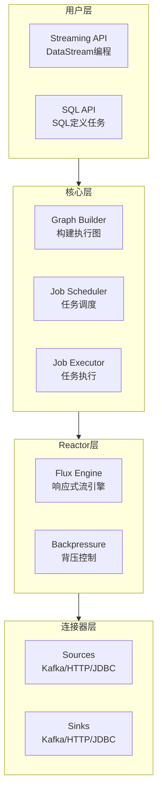

### 2.2 三种执行模式

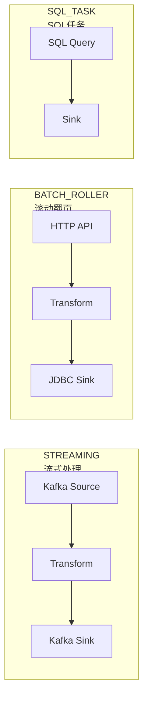

---

## 3. 核心模块设计

### 3.1 graph-builder (图构建模块)

**职责**：将用户 API 转换为可执行的任务图

**核心组件**：

| 组件 | 说明 |
|------|------|
| StreamGraphBuilder | 构建逻辑图，一对一映射用户算子 |
| JobGraphOptimizer | 优化物理图，合并算子链 |
| ExecutionGraphGenerator | 生成执行图，分配资源 |

**工作流程**：

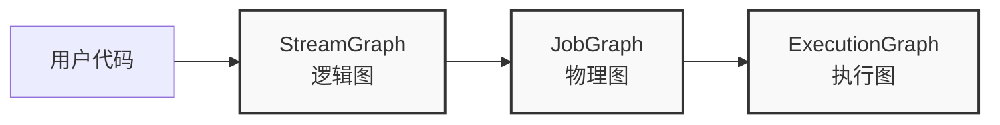

**算子链优化示例**：

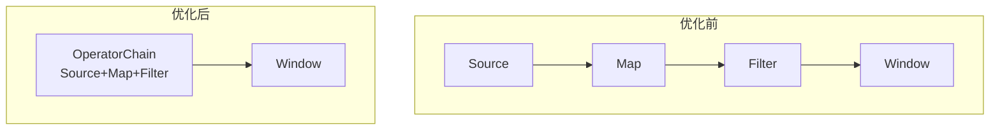

---

### 3.2 scheduler-engine (调度引擎)

**职责**：管理 Job 的生命周期和调度策略

**核心组件**：

| 组件 | 说明 |
|------|------|
| JobScheduler | 任务调度，支持 Cron、事件、依赖触发 |
| ExecutionMode | 执行模式：STREAMING / BATCH_ROLLER / SQL_TASK |
| JobRegistry | Job 定义注册和版本管理 |
| TriggerManager | 触发器管理（定时、事件、手动） |

**Job 状态机**：

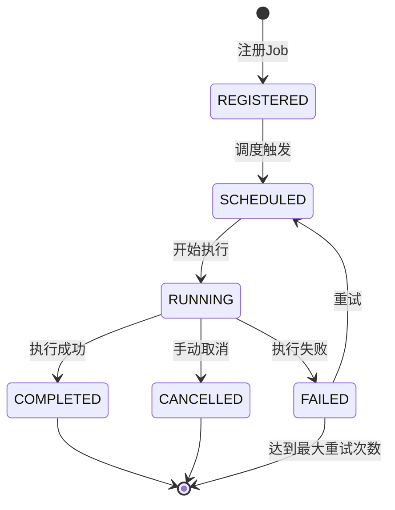

---

### 3.3 reactor-engine (Reactor 执行引擎)

**职责**：基于 Project Reactor 实现响应式流处理

**核心组件**：

| 组件 | 说明 |
|------|------|
| FluxPipeline | 基于 Flux 构建的数据管道 |
| BackpressureStrategy | 背压策略（Buffer/Drop/Latest/Error） |
| SchedulerPool | 调度器线程池管理 |
| OperatorChain | 算子链执行器 |

**Reactor 流处理架构**：

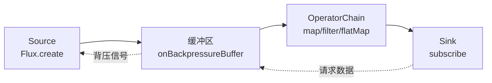

**背压策略对比**：

| 策略 | 说明 | 适用场景 |
|------|------|----------|
| **BUFFER** | 缓冲数据，Sink慢时积压 | 内存充足，不能丢数据 |
| **DROP** | 丢弃最新数据 | 实时性要求高 |
| **LATEST** | 保留最新数据，丢弃旧数据 | 只关心最新状态 |
| **ERROR** | 抛出异常 | 严格的数据完整性要求 |

---

### 3.4 source-connectors (数据源连接器)

**职责**：提供多种数据源的统一接口

**Reactor 实现方式**：

```java
/**
 * 基于 Reactor 的 Source 接口
 */
public interface ReactorSource<T> {
    /**
     * 返回一个 Flux，自动支持背压
     */
    Flux<T> flux();
}
```

**三种 Source 实现**：

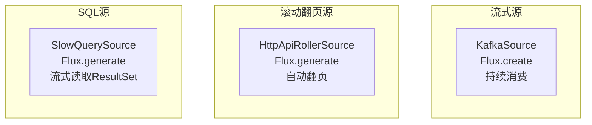

**示例：Kafka Source**

```java
public class KafkaReactorSource<T> implements ReactorSource<T> {
    
    @Override
    public Flux<T> flux() {
        return Flux.create(sink -> {
            KafkaConsumer<String, T> consumer = createConsumer();
            
            // 背压控制：只有下游请求时才拉取
            sink.onRequest(n -> {
                ConsumerRecords<String, T> records = consumer.poll(Duration.ofMillis(100));
                records.forEach(record -> sink.next(record.value()));
            });
            
            sink.onDispose(() -> consumer.close());
        }, FluxSink.OverflowStrategy.BUFFER);
    }
}
```

**示例：HTTP API 滚动翻页 Source**

```java
public class HttpApiRollerSource<T> implements ReactorSource<T> {
    
    @Override
    public Flux<T> flux() {
        return Flux.generate(
            () -> 0,  // 初始页码
            (page, sink) -> {
                List<T> data = fetchPage(page);
                
                if (data.isEmpty()) {
                    sink.complete();  // 没有更多数据
                } else {
                    data.forEach(sink::next);
                }
                
                return page + 1;  // 下一页
            }
        );
    }
}
```

---

### 3.5 sink-connectors (输出连接器)

**职责**：提供多种输出目标的统一接口

**Reactor 实现方式**：

```java
/**
 * 基于 Reactor 的 Sink 接口
 */
public interface ReactorSink<T> {
    /**
     * 订阅上游 Flux，写入数据
     */
    Mono<Void> consume(Flux<T> flux);
}
```

**批量写入示例：JDBC Sink**

```java
public class JdbcBatchSink<T> implements ReactorSink<T> {
    
    @Override
    public Mono<Void> consume(Flux<T> flux) {
        return flux
            .buffer(1000)  // 批量1000条
            .flatMap(batch -> {
                // 批量写入数据库
                return Mono.fromRunnable(() -> {
                    jdbcTemplate.batchUpdate(sql, batch);
                });
            })
            .then();
    }
}
```

---

### 3.6 state-management (状态管理)

**职责**：管理算子状态和 Checkpoint

**状态类型**：

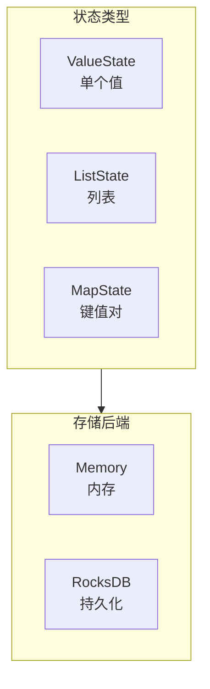

**Checkpoint 机制**：

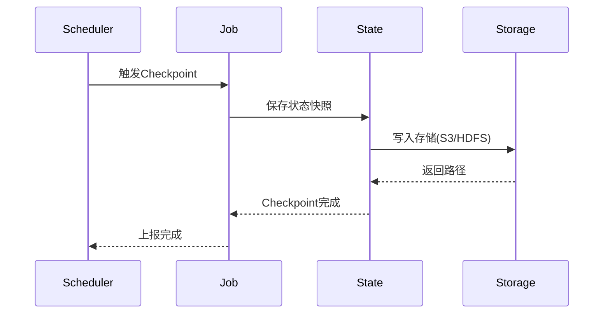

---

### 3.7 operator-core (算子核心)

**职责**：实现各种数据转换算子

**核心算子**：

| 算子 | Reactor API | 说明 |
|------|-------------|------|
| **Map** | `flux.map()` | 一对一转换 |
| **Filter** | `flux.filter()` | 过滤 |
| **FlatMap** | `flux.flatMap()` | 一对多转换 |
| **Window** | `flux.window()` | 窗口聚合 |
| **GroupBy** | `flux.groupBy()` | 分组 |
| **Reduce** | `flux.reduce()` | 聚合 |

**窗口类型**：

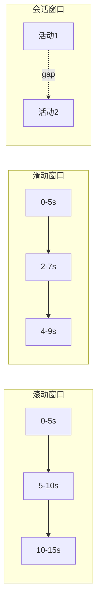

---

## 4. 数据模型设计

### 4.1 Job 定义表

**表名**：`pipeline_job_definition`

| 字段 | 类型 | 说明 |
|------|------|------|
| id | BIGINT | 主键 |
| job_name | VARCHAR(200) | Job名称，唯一 |
| job_type | VARCHAR(50) | STREAMING/BATCH_ROLLER/SQL_TASK |
| dag_definition | TEXT | DAG定义（JSON） |
| version | INT | 版本号 |
| enabled | BOOLEAN | 是否启用 |
| create_time | TIMESTAMP | 创建时间 |
| update_time | TIMESTAMP | 更新时间 |

**索引**：
- `idx_job_name` ON (job_name)
- `idx_enabled` ON (enabled)

---

### 4.2 Job 执行记录表

**表名**：`pipeline_job_execution`

| 字段 | 类型 | 说明 |
|------|------|------|
| id | BIGINT | 主键 |
| job_id | BIGINT | 关联job_definition.id |
| execution_id | VARCHAR(100) | 执行ID，UUID |
| status | VARCHAR(50) | 执行状态 |
| start_time | TIMESTAMP | 开始时间 |
| end_time | TIMESTAMP | 结束时间 |
| processed_records | BIGINT | 处理记录数 |
| failed_records | BIGINT | 失败记录数 |
| error_message | TEXT | 错误信息 |
| checkpoint_path | VARCHAR(500) | Checkpoint路径 |

**状态枚举**：
- `SCHEDULED`：已调度
- `RUNNING`：运行中
- `COMPLETED`：已完成
- `FAILED`：失败
- `CANCELLED`：已取消

**索引**：
- `idx_job_id_start_time` ON (job_id, start_time)
- `idx_status` ON (status)
- `idx_execution_id` ON (execution_id)

---

### 4.3 Checkpoint 记录表

**表名**：`pipeline_checkpoint`

| 字段 | 类型 | 说明 |
|------|------|------|
| id | BIGINT | 主键 |
| execution_id | VARCHAR(100) | 关联job_execution.execution_id |
| checkpoint_id | BIGINT | Checkpoint序号 |
| checkpoint_type | VARCHAR(50) | STREAMING/ROLLER/SQL_TASK |
| state_data | TEXT | 状态数据（JSON） |
| storage_path | VARCHAR(500) | 存储路径 |
| create_time | TIMESTAMP | 创建时间 |

**state_data 结构示例**：

**STREAMING 模式**：
```json
{
  "kafka_offsets": {
    "topic-1": {"partition-0": 12345, "partition-1": 23456}
  },
  "window_state": {
    "user_123": {"count": 100, "sum": 5000}
  }
}
```

**BATCH_ROLLER 模式**：
```json
{
  "current_page": 123,
  "page_offset": 500,
  "total_processed": 123500
}
```

**SQL_TASK 模式**：
```json
{
  "processed_rows": 1000000,
  "last_id": 999999
}
```

---

### 4.4 Job 配置表

**表名**：`pipeline_job_config`

| 字段 | 类型 | 说明 |
|------|------|------|
| id | BIGINT | 主键 |
| job_id | BIGINT | 关联job_definition.id |
| config_key | VARCHAR(200) | 配置键 |
| config_value | TEXT | 配置值 |
| config_type | VARCHAR(50) | STRING/INT/BOOLEAN/JSON |

**常用配置项**：
- `parallelism`：并行度
- `checkpoint.interval`：Checkpoint间隔（毫秒）
- `backpressure.strategy`：背压策略
- `source.batch.size`：Source批量大小
- `sink.batch.size`：Sink批量大小

---

## 5. 核心流程

### 5.1 流式 Job 执行流程

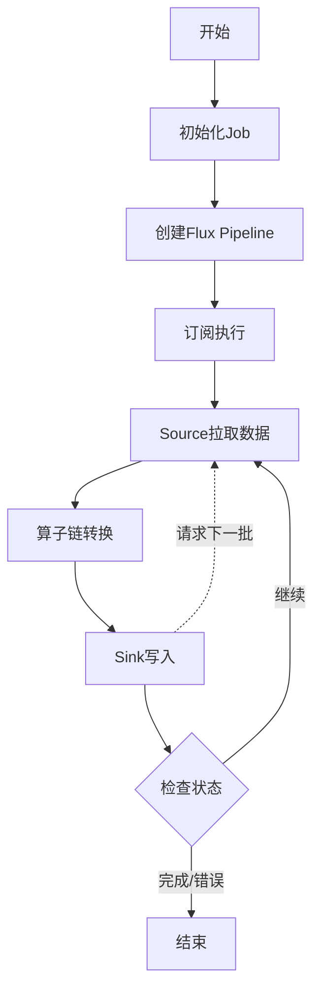

### 5.2 批量翻页 Job 执行流程

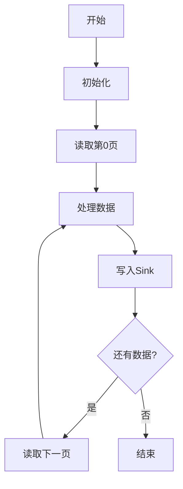

### 5.3 SQL 任务执行流程

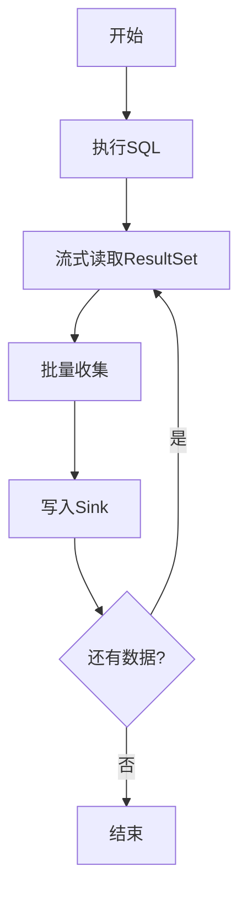

---

## 6. 完整示例

### 6.1 流式处理示例

```java
@Configuration
public class StreamingJobExample {
    
    @Bean
    public Job realtimeAlertJob() {
        return StreamJob.builder()
            .name("realtime-alert")
            .source(kafkaSource())
            .transform(pipeline -> pipeline
                .map(this::parseEvent)
                .filter(event -> event.isValid())
                .window(Duration.ofMinutes(5))
                .reduce(this::aggregate)
                .filter(result -> result.count() > 100)
            )
            .sink(kafkaSink())
            .backpressureStrategy(BackpressureStrategy.BUFFER)
            .build();
    }
    
    private ReactorSource<Event> kafkaSource() {
        return new KafkaReactorSource<>("events", kafka);
    }
    
    private ReactorSink<Alert> kafkaSink() {
        return new KafkaReactorSink<>("alerts", kafka);
    }
}
```

### 6.2 滚动翻页示例

```java
@Configuration
public class RollerJobExample {
    
    @Bean
    public Job userSyncJob() {
        return RollerJob.builder()
            .name("user-sync")
            .source(httpApiSource())
            .transform(pipeline -> pipeline
                .map(this::enrichUser)
                .filter(user -> user.isActive())
            )
            .sink(jdbcSink())
            .pageSize(1000)
            .delayBetweenPages(Duration.ofMillis(100))
            .build();
    }
    
    private RollerSource<User> httpApiSource() {
        return new HttpApiRollerSource<>(
            "https://api.example.com/users",
            httpClient
        );
    }
}
```

### 6.3 SQL 任务示例

```java
@Configuration
public class SqlTaskExample {
    
    @Bean
    public Job reportJob() {
        return SqlJob.builder()
            .name("user-order-report")
            .sql("""
                SELECT 
                    u.user_id,
                    COUNT(o.order_id) as order_count,
                    SUM(o.amount) as total_amount
                FROM users u
                LEFT JOIN orders o ON u.user_id = o.user_id
                WHERE u.create_time >= '2023-01-01'
                GROUP BY u.user_id
                HAVING total_amount > 10000
                """)
            .dataSource(dataSource)
            .sink(jdbcSink())
            .fetchSize(1000)
            .queryTimeout(Duration.ofHours(2))
            .build();
    }
}
```

---

## 7. 项目结构

```
pipeline-framework/
├── pipeline-api/                    # API层
│   ├── streaming-api/              # 流式API
│   └── sql-api/                    # SQL API
│
├── pipeline-core/                   # 核心层
│   ├── graph/                      # 图构建
│   ├── scheduler/                  # 调度引擎
│   ├── reactor/                    # Reactor引擎
│   └── executor/                   # 执行器
│
├── pipeline-connectors/             # 连接器层
│   ├── connector-kafka/            # Kafka连接器
│   ├── connector-jdbc/             # JDBC连接器
│   ├── connector-http/             # HTTP连接器
│   └── connector-file/             # 文件连接器
│
├── pipeline-state/                  # 状态管理
│   ├── backend/                    # 状态后端
│   └── checkpoint/                 # Checkpoint
│
├── pipeline-common/                 # 公共模块
│   ├── config/                     # 配置
│   ├── metrics/                    # 指标
│   └── utils/                      # 工具类
│
└── pipeline-examples/               # 示例
```

---

## 8. 核心优势

### 8.1 为什么选择 Project Reactor？

| 特性 | 说明 | 好处 |
|------|------|------|
| **响应式流规范** | 实现 Reactive Streams 标准 | 天然支持背压，无需手动实现 |
| **丰富的算子** | 100+ 操作符 | 覆盖绝大部分数据处理场景 |
| **高性能** | 低开销的异步处理 | 高吞吐、低延迟 |
| **成熟稳定** | Spring 生态核心组件 | 社区活跃，文档完善 |
| **易于测试** | StepVerifier 测试工具 | 方便编写单元测试 |

### 8.2 背压优势

**传统方式**：
- 需要手动实现队列、信号量
- 复杂的回调逻辑
- 容易出现内存泄漏

**Reactor 方式**：
```java
Flux.create(sink -> {
    // Reactor 自动处理背压
    sink.onRequest(n -> {
        // 只拉取请求的数量
    });
})
```

### 8.3 性能对比

| 指标 | 传统实现 | Reactor实现 |
|------|---------|------------|
| 代码量 | 500行+ | 100行 |
| 背压实现 | 手动管理 | 自动支持 |
| 内存占用 | 高（需要队列） | 低（按需拉取） |
| 可测试性 | 困难 | 简单（StepVerifier） |

---

## 9. 监控指标

### 9.1 核心指标

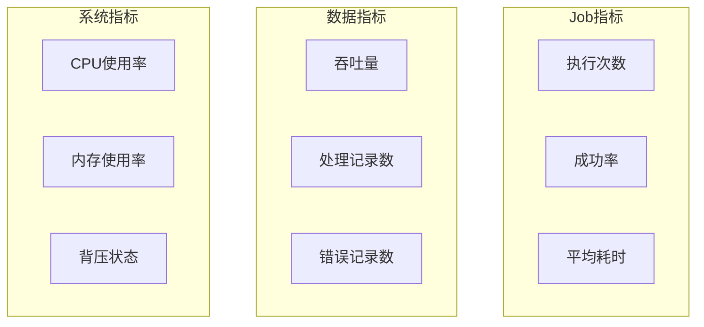

### 9.2 告警规则

| 指标 | 阈值 | 级别 |
|------|------|------|
| Job失败率 | > 5% | 严重 |
| 平均耗时 | > 正常值2倍 | 警告 |
| 背压状态 | 持续1分钟 | 警告 |
| 内存使用 | > 90% | 严重 |

---

## 10. 部署架构

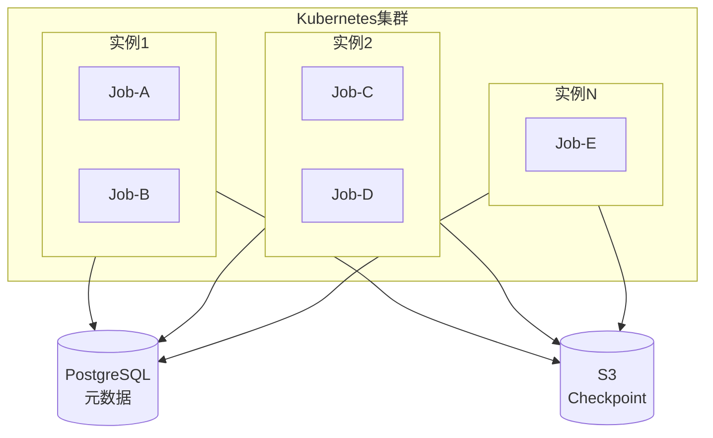

---

## 11. 总结

### 11.1 核心亮点

1. ✅ **基于 Reactor**：响应式编程，天然背压支持
2. ✅ **简单易用**：声明式 API，链式调用
3. ✅ **流批一体**：统一的编程模型
4. ✅ **高性能**：异步非阻塞，低延迟
5. ✅ **易扩展**：插件化连接器设计

### 11.2 技术选型理由

**为什么用 Reactor 而不是手动实现？**

| 方面 | 手动实现 | Reactor |
|------|---------|---------|
| 开发成本 | 高 | 低 |
| 背压实现 | 复杂 | 开箱即用 |
| 可维护性 | 差 | 好 |
| 性能 | 取决于实现 | 经过优化 |
| 测试 | 困难 | 简单 |

---

**文档版本**：v2.0  
**最后更新**：2025-11-07  
**技术栈**：Spring Boot + Project Reactor
