# Pipeline Framework 设计文档

## 目录

- [1. 项目概述](#1-项目概述)
- [2. 快速开始](#2-快速开始)
- [3. 核心概念](#3-核心概念)
- [4. 核心模块详解](#4-核心模块详解)
- [5. 断点机制设计](#5-断点机制设计)
- [6. 数据库设计](#6-数据库设计)
- [7. 开发指南](#7-开发指南)
- [8. 部署运维](#8-部署运维)

---

## 1. 项目概述

### 1.1 什么是 Pipeline Framework？

Pipeline Framework 是一个基于 **Spring Project Reactor** 的响应式数据处理框架，用于构建流式和批量数据处理任务。

**核心理念**：
- 一个 Job = Source（数据源） → Flow（数据处理） → Sink（数据输出）
- 每个 Job 在单个实例内完整执行，不跨实例传输数据
- 使用 Reactor 的响应式编程模型，天然支持背压控制

**适用场景**：
- ✅ 实时数据流处理（Kafka → 转换 → Kafka）
- ✅ API 数据同步（HTTP API 翻页 → 转换 → 数据库）
- ✅ 数据分析报表（复杂 SQL → 转换 → 文件/数据库）

### 1.2 技术栈

| 技术 | 版本 | 用途 |
|------|------|------|
| Spring Boot | 3.x | 应用框架 |
| Project Reactor | 3.x | 响应式编程、背压控制 |
| Spring Data JPA | 3.x | 元数据存储 |
| RocksDB | 7.x | 状态后端 |
| PostgreSQL | 14+ | 元数据数据库 |
| Apache Calcite | 1.x | SQL 解析（可选） |

### 1.3 系统架构

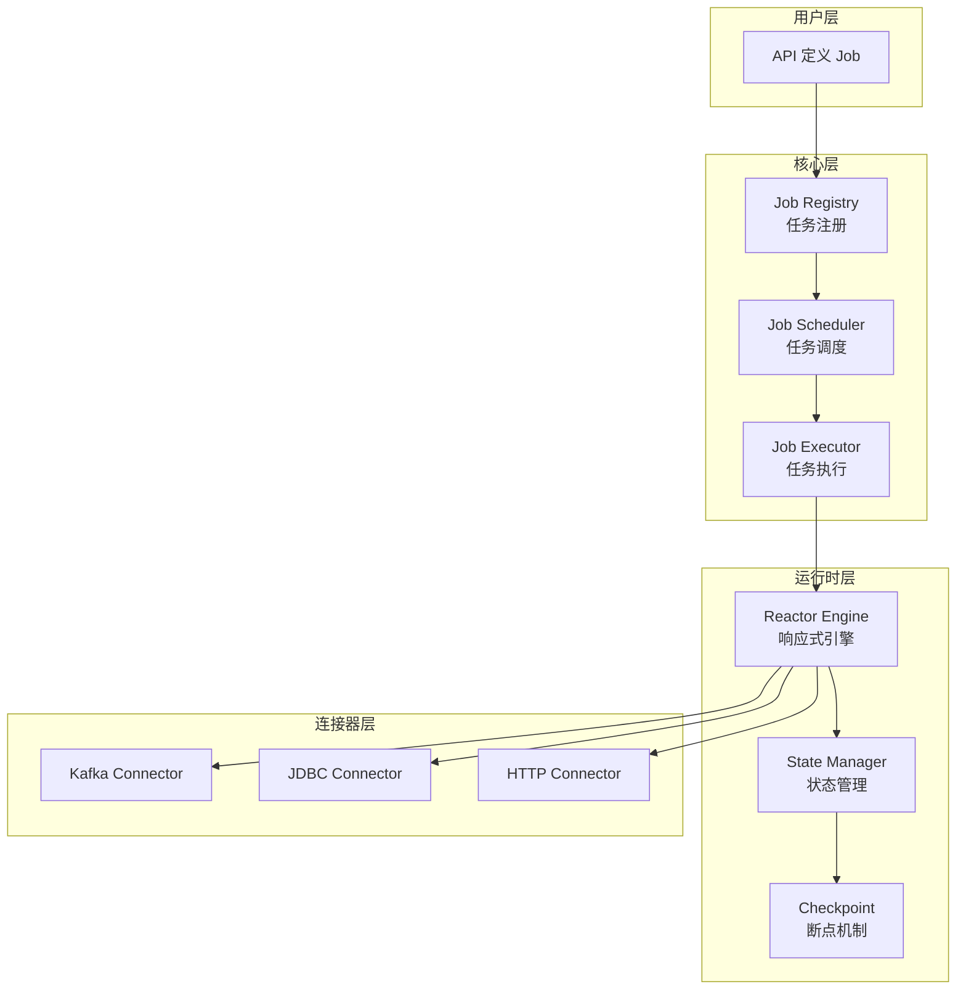

---

## 2. 快速开始

### 2.1 创建一个流式 Job

```java
@Configuration
public class MyFirstJob {
    
    @Bean
    public PipelineJob kafkaToKafkaJob() {
        return PipelineJob.builder()
            .name("my-first-job")
            .description("从 Kafka 读取，转换后写入另一个 Kafka")
            
            // 1. 定义数据源
            .source(KafkaSource.<String>builder()
                .topic("input-topic")
                .groupId("my-group")
                .bootstrapServers("localhost:9092")
                .build())
            
            // 2. 定义数据处理流程
            .transform(flux -> flux
                .map(String::toUpperCase)        // 转大写
                .filter(s -> s.length() > 5)     // 过滤长度 > 5
            )
            
            // 3. 定义数据输出
            .sink(KafkaSink.<String>builder()
                .topic("output-topic")
                .bootstrapServers("localhost:9092")
                .build())
            
            // 4. 配置
            .config(JobConfig.builder()
                .checkpointInterval(Duration.ofMinutes(1))  // 每分钟一次 checkpoint
                .backpressureStrategy(BackpressureStrategy.BUFFER)
                .build())
            
            .build();
    }
}
```

### 2.2 启动应用

```bash
# 1. 启动应用
mvn spring-boot:run

# 2. 查看 Job 状态
curl http://localhost:8080/api/jobs

# 3. 手动触发 Job
curl -X POST http://localhost:8080/api/jobs/my-first-job/start
```

---

## 3. 核心概念

### 3.1 三种执行模式

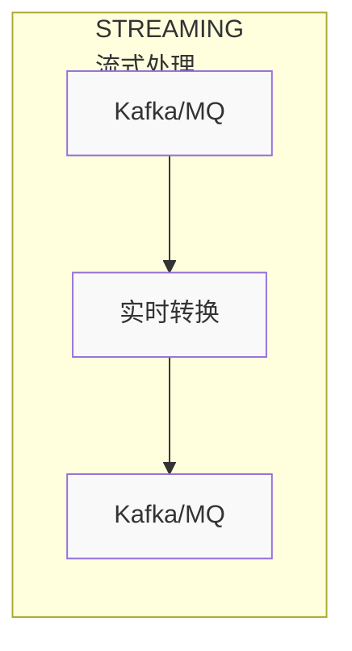

**特点**：
- 数据源是无限流（Kafka、RabbitMQ 等）
- Job 持续运行，不会自动结束
- 支持事件时间和水印
- 必须开启 Checkpoint

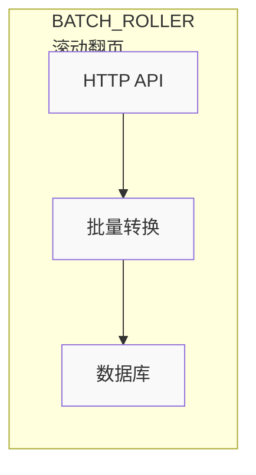

**特点**：
- 数据源支持分页（HTTP API、数据库分页查询）
- 自动翻页，读完所有数据后自动结束
- 可选 Checkpoint（用于断点续传）

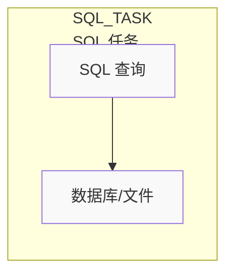

**特点**：
- 执行复杂的 SQL 查询（多表 Join、聚合等）
- 流式读取结果集，避免 OOM
- 查询完成后自动结束

### 3.2 Job 生命周期

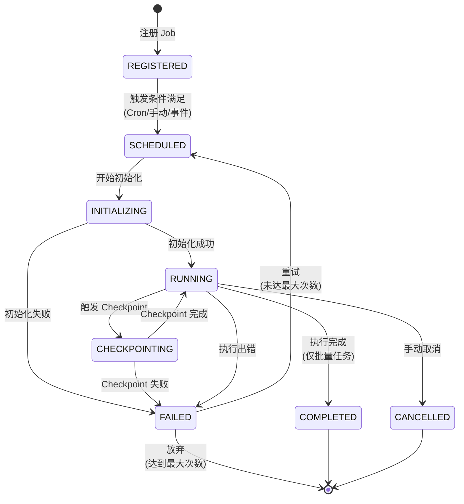

**状态说明**：

| 状态 | 说明 | 下一步 |
|------|------|--------|
| **REGISTERED** | Job 已注册但未调度 | 等待触发条件 |
| **SCHEDULED** | Job 已调度，等待执行 | 分配资源并初始化 |
| **INITIALIZING** | 正在初始化（创建 Source/Sink） | 成功进入 RUNNING |
| **RUNNING** | Job 正在执行 | 持续运行或完成 |
| **CHECKPOINTING** | 正在执行 Checkpoint | 完成后继续运行 |
| **COMPLETED** | Job 执行完成 | 终态（仅批量任务） |
| **FAILED** | Job 执行失败 | 重试或放弃 |
| **CANCELLED** | Job 被手动取消 | 终态 |

---

## 4. 核心模块详解

### 4.1 job-registry (任务注册中心)

**职责**：管理 Job 的定义、版本和配置。

**核心功能**：
- Job 的增删改查
- Job 版本管理（支持多版本并存）
- Job 配置管理（参数、调度策略等）
- Job 依赖关系管理

**核心接口**：

```java
public interface JobRegistry {
    
    /**
     * 注册一个新的 Job
     */
    JobDefinition register(PipelineJob job);
    
    /**
     * 更新 Job 定义（会创建新版本）
     */
    JobDefinition update(String jobName, PipelineJob job);
    
    /**
     * 获取 Job 定义
     */
    JobDefinition get(String jobName);
    
    /**
     * 获取指定版本的 Job 定义
     */
    JobDefinition get(String jobName, int version);
    
    /**
     * 列出所有 Job
     */
    List<JobDefinition> listAll();
    
    /**
     * 启用/禁用 Job
     */
    void enable(String jobName);
    void disable(String jobName);
}
```

**数据结构**：

```java
public class JobDefinition {
    private Long id;
    private String jobName;              // Job 唯一名称
    private JobType jobType;             // STREAMING/BATCH_ROLLER/SQL_TASK
    private int version;                 // 版本号
    private String dagDefinition;        // DAG 定义（JSON）
    private Map<String, Object> config;  // 配置参数
    private boolean enabled;             // 是否启用
    private LocalDateTime createTime;
    private LocalDateTime updateTime;
}
```

**实现要点**：
1. 使用数据库存储 Job 定义（`pipeline_job_definition` 表）
2. 每次更新 Job 时，version 自增，保留历史版本
3. 启用/禁用只影响最新版本
4. 支持从 YAML/JSON 文件导入 Job 定义

**示例**：

```java
@Service
public class JobRegistryService implements JobRegistry {
    
    @Autowired
    private JobDefinitionRepository repository;
    
    @Override
    @Transactional
    public JobDefinition register(PipelineJob job) {
        // 1. 检查是否已存在
        if (repository.existsByJobName(job.getName())) {
            throw new JobAlreadyExistsException(job.getName());
        }
        
        // 2. 转换为数据库实体
        JobDefinitionEntity entity = new JobDefinitionEntity();
        entity.setJobName(job.getName());
        entity.setJobType(job.getType());
        entity.setVersion(1);
        entity.setDagDefinition(serializeToJson(job));
        entity.setEnabled(true);
        
        // 3. 保存到数据库
        repository.save(entity);
        
        return toJobDefinition(entity);
    }
}
```

---

### 4.2 job-scheduler (任务调度器)

**职责**：根据触发条件调度 Job 的执行。

**核心功能**：
- 支持多种触发方式（Cron、手动、事件、依赖）
- 管理 Job 的调度计划
- 分配 Job 到执行器
- 监控 Job 执行状态

**触发方式**：

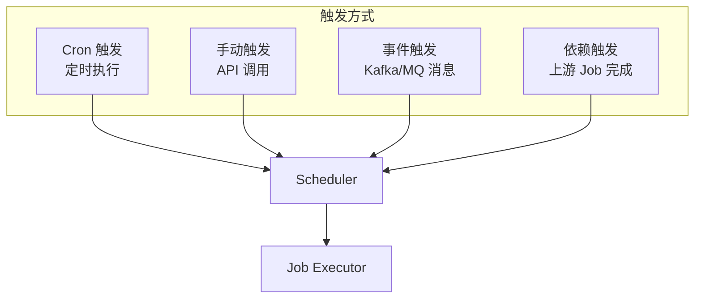

**核心接口**：

```java
public interface JobScheduler {
    
    /**
     * 添加调度计划
     */
    void schedule(String jobName, ScheduleConfig config);
    
    /**
     * 取消调度计划
     */
    void unschedule(String jobName);
    
    /**
     * 手动触发 Job
     */
    String triggerJob(String jobName);
    
    /**
     * 获取下次执行时间
     */
    LocalDateTime getNextExecutionTime(String jobName);
}
```

**调度配置**：

```java
public class ScheduleConfig {
    private ScheduleType type;        // CRON/MANUAL/EVENT/DEPENDENCY
    private String cronExpression;    // Cron 表达式
    private String eventTopic;        // 事件主题
    private List<String> dependencies; // 依赖的 Job
    private int maxRetryTimes;        // 最大重试次数
    private Duration retryInterval;   // 重试间隔
}
```

**实现要点**：
1. 使用 Spring 的 `@Scheduled` 或 Quartz 实现 Cron 调度
2. 事件触发使用 Kafka/RabbitMQ 监听器
3. 依赖触发通过事件总线实现
4. 调度时检查 Job 状态，避免重复执行

**示例**：

```java
@Service
public class JobSchedulerService implements JobScheduler {
    
    @Autowired
    private TaskScheduler taskScheduler;
    
    @Autowired
    private JobExecutor jobExecutor;
    
    private Map<String, ScheduledFuture<?>> scheduledTasks = new ConcurrentHashMap<>();
    
    @Override
    public void schedule(String jobName, ScheduleConfig config) {
        if (config.getType() == ScheduleType.CRON) {
            // Cron 调度
            ScheduledFuture<?> future = taskScheduler.schedule(
                () -> triggerJob(jobName),
                new CronTrigger(config.getCronExpression())
            );
            scheduledTasks.put(jobName, future);
        }
        // 其他触发方式...
    }
    
    @Override
    public String triggerJob(String jobName) {
        // 1. 生成执行 ID
        String executionId = UUID.randomUUID().toString();
        
        // 2. 检查 Job 状态
        JobDefinition job = jobRegistry.get(jobName);
        if (!job.isEnabled()) {
            throw new JobDisabledException(jobName);
        }
        
        // 3. 提交到执行器
        jobExecutor.submit(jobName, executionId);
        
        return executionId;
    }
}
```

---

### 4.3 job-executor (任务执行器)

**职责**：执行具体的 Job，管理 Job 的运行时生命周期。

**核心功能**：
- 初始化 Source、Sink、算子链
- 构建 Reactor 管道
- 启动 Job 执行
- 监控执行状态
- 处理异常和重试

**核心接口**：

```java
public interface JobExecutor {
    
    /**
     * 提交 Job 执行
     */
    void submit(String jobName, String executionId);
    
    /**
     * 取消 Job 执行
     */
    void cancel(String executionId);
    
    /**
     * 获取 Job 执行状态
     */
    JobExecutionStatus getStatus(String executionId);
    
    /**
     * 暂停 Job（仅流式任务）
     */
    void pause(String executionId);
    
    /**
     * 恢复 Job（仅流式任务）
     */
    void resume(String executionId);
}
```

**执行流程**：

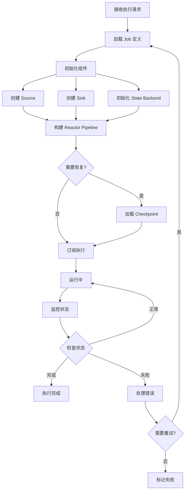

**实现要点**：
1. 使用线程池执行 Job，隔离不同 Job
2. 每个 Job 有独立的 Reactor Scheduler
3. 记录执行日志到 `pipeline_job_execution` 表
4. 异常时触发告警和重试

**示例**：

```java
@Service
public class JobExecutorService implements JobExecutor {
    
    @Autowired
    private JobRegistry jobRegistry;
    
    @Autowired
    private StateManager stateManager;
    
    @Autowired
    private JobExecutionRepository executionRepository;
    
    private ExecutorService executorService = Executors.newCachedThreadPool();
    
    @Override
    public void submit(String jobName, String executionId) {
        executorService.submit(() -> {
            try {
                // 1. 记录执行开始
                JobExecutionEntity execution = new JobExecutionEntity();
                execution.setExecutionId(executionId);
                execution.setJobName(jobName);
                execution.setStatus(JobStatus.INITIALIZING);
                execution.setStartTime(LocalDateTime.now());
                executionRepository.save(execution);
                
                // 2. 加载 Job 定义
                JobDefinition jobDef = jobRegistry.get(jobName);
                PipelineJob job = deserializeJob(jobDef);
                
                // 3. 初始化组件
                ReactorSource<?> source = job.getSource();
                ReactorSink<?> sink = job.getSink();
                
                // 4. 检查是否需要从 Checkpoint 恢复
                Checkpoint checkpoint = stateManager.getLatestCheckpoint(executionId);
                if (checkpoint != null) {
                    source.restore(checkpoint);
                }
                
                // 5. 构建 Reactor Pipeline
                Flux<?> pipeline = source.flux()
                    .transform(job.getTransform())
                    .doOnNext(item -> {
                        // 更新处理计数
                        execution.incrementProcessedRecords();
                    });
                
                // 6. 订阅并执行
                execution.setStatus(JobStatus.RUNNING);
                executionRepository.save(execution);
                
                sink.consume(pipeline)
                    .doOnSuccess(v -> {
                        execution.setStatus(JobStatus.COMPLETED);
                        execution.setEndTime(LocalDateTime.now());
                        executionRepository.save(execution);
                    })
                    .doOnError(e -> {
                        execution.setStatus(JobStatus.FAILED);
                        execution.setErrorMessage(e.getMessage());
                        execution.setEndTime(LocalDateTime.now());
                        executionRepository.save(execution);
                    })
                    .block();
                    
            } catch (Exception e) {
                log.error("Job execution failed", e);
            }
        });
    }
}
```

---

### 4.4 reactor-engine (Reactor 引擎)

**职责**：封装 Project Reactor 的能力，提供统一的响应式编程接口。

**核心功能**：
- 提供 Source、Sink 的 Reactor 抽象
- 管理 Scheduler（线程池）
- 配置背压策略
- 提供常用的 Reactor 算子封装

**核心接口**：

```java
/**
 * Reactor Source 接口
 */
public interface ReactorSource<T> {
    /**
     * 返回一个 Flux，代表数据流
     */
    Flux<T> flux();
    
    /**
     * 从 Checkpoint 恢复
     */
    void restore(Checkpoint checkpoint);
}

/**
 * Reactor Sink 接口
 */
public interface ReactorSink<T> {
    /**
     * 消费 Flux，写入数据
     */
    Mono<Void> consume(Flux<T> flux);
}
```

**背压策略配置**：

```java
public enum BackpressureStrategy {
    /**
     * 缓冲所有数据（内存允许的情况下）
     * 适用：不能丢数据的场景
     */
    BUFFER,
    
    /**
     * 丢弃最新数据
     * 适用：实时性要求高，允许丢数据
     */
    DROP,
    
    /**
     * 保留最新数据，丢弃旧数据
     * 适用：只关心最新状态
     */
    LATEST,
    
    /**
     * 抛出异常
     * 适用：严格的数据完整性要求
     */
    ERROR
}
```

**Scheduler 管理**：

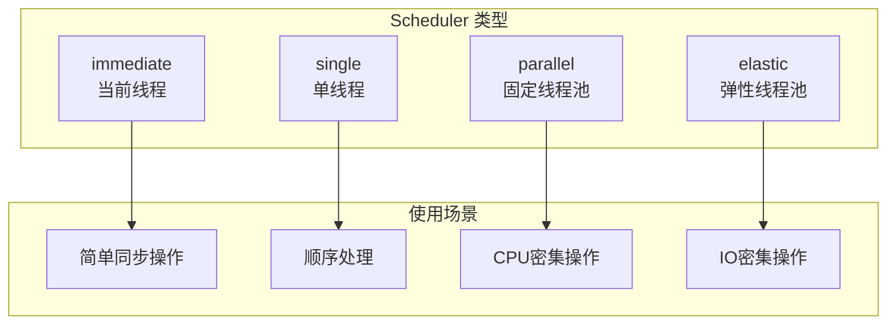

**实现要点**：
1. 为每个 Job 创建独立的 Scheduler
2. 根据 Job 类型选择合适的 Scheduler
3. 实现自定义的背压策略
4. 提供监控指标（缓冲区大小、丢弃计数等）

**示例**：

```java
public class KafkaReactorSource implements ReactorSource<String> {
    
    private final KafkaConsumer<String, String> consumer;
    private final BackpressureStrategy strategy;
    
    @Override
    public Flux<String> flux() {
        return Flux.create(sink -> {
            // 1. 根据策略配置背压
            FluxSink.OverflowStrategy overflowStrategy = switch (strategy) {
                case BUFFER -> FluxSink.OverflowStrategy.BUFFER;
                case DROP -> FluxSink.OverflowStrategy.DROP;
                case LATEST -> FluxSink.OverflowStrategy.LATEST;
                case ERROR -> FluxSink.OverflowStrategy.ERROR;
            };
            
            // 2. 响应下游请求
            sink.onRequest(n -> {
                ConsumerRecords<String, String> records = 
                    consumer.poll(Duration.ofMillis(100));
                    
                records.forEach(record -> {
                    sink.next(record.value());
                });
            });
            
            // 3. 清理资源
            sink.onDispose(() -> consumer.close());
            
        }, overflowStrategy);
    }
}
```

---

### 4.5 state-manager (状态管理器)

**职责**：管理 Job 的状态，支持状态查询和更新。

**核心功能**：
- 管理不同类型的状态（ValueState、ListState、MapState）
- 选择不同的状态后端（Memory、RocksDB）
- 配合 Checkpoint 机制持久化状态

**状态类型**：

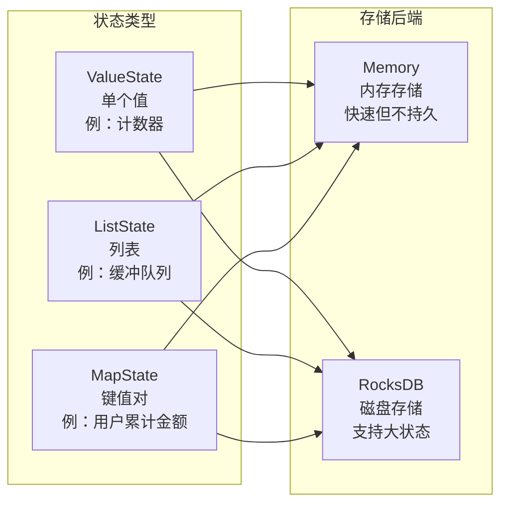

**核心接口**：

```java
/**
 * 状态管理器接口
 */
public interface StateManager {
    
    /**
     * 获取 ValueState
     */
    <T> ValueState<T> getValueState(String name, Class<T> type);
    
    /**
     * 获取 ListState
     */
    <T> ListState<T> getListState(String name, Class<T> type);
    
    /**
     * 获取 MapState
     */
    <K, V> MapState<K, V> getMapState(String name, Class<K> keyType, Class<V> valueType);
    
    /**
     * 创建 Checkpoint
     */
    Checkpoint createCheckpoint(String executionId);
    
    /**
     * 从 Checkpoint 恢复
     */
    void restoreFromCheckpoint(Checkpoint checkpoint);
}

/**
 * ValueState 接口
 */
public interface ValueState<T> {
    T value();
    void update(T value);
    void clear();
}

/**
 * ListState 接口
 */
public interface ListState<T> {
    Iterable<T> get();
    void add(T value);
    void addAll(List<T> values);
    void clear();
}

/**
 * MapState 接口
 */
public interface MapState<K, V> {
    V get(K key);
    void put(K key, V value);
    void remove(K key);
    Iterable<Map.Entry<K, V>> entries();
    void clear();
}
```

**实现要点**：
1. 使用 ThreadLocal 隔离不同 Job 的状态
2. Memory Backend 使用 ConcurrentHashMap
3. RocksDB Backend 使用独立的数据库实例
4. 状态序列化使用高效的序列化框架（Kryo/FST）

**示例**：

```java
@Service
public class StateManagerImpl implements StateManager {
    
    private final StateBackend backend;
    private final ThreadLocal<Map<String, Object>> stateContext = new ThreadLocal<>();
    
    @Override
    public <T> ValueState<T> getValueState(String name, Class<T> type) {
        return new ValueStateImpl<>(name, type, backend);
    }
    
    private static class ValueStateImpl<T> implements ValueState<T> {
        private final String name;
        private final Class<T> type;
        private final StateBackend backend;
        
        @Override
        public T value() {
            return backend.get(name, type);
        }
        
        @Override
        public void update(T value) {
            backend.put(name, value);
        }
        
        @Override
        public void clear() {
            backend.remove(name);
        }
    }
}
```

---

### 4.6 checkpoint-manager (断点管理器)

**职责**：实现 Checkpoint 机制，支持故障恢复和断点续传。

**详细设计见第 5 章**。

---

### 4.7 connector-manager (连接器管理器)

**职责**：管理所有的 Source 和 Sink 连接器，提供插件化扩展。

**核心功能**：
- 连接器的注册和发现
- 连接器的配置管理
- 连接器的生命周期管理
- 连接池管理

**连接器类型**：

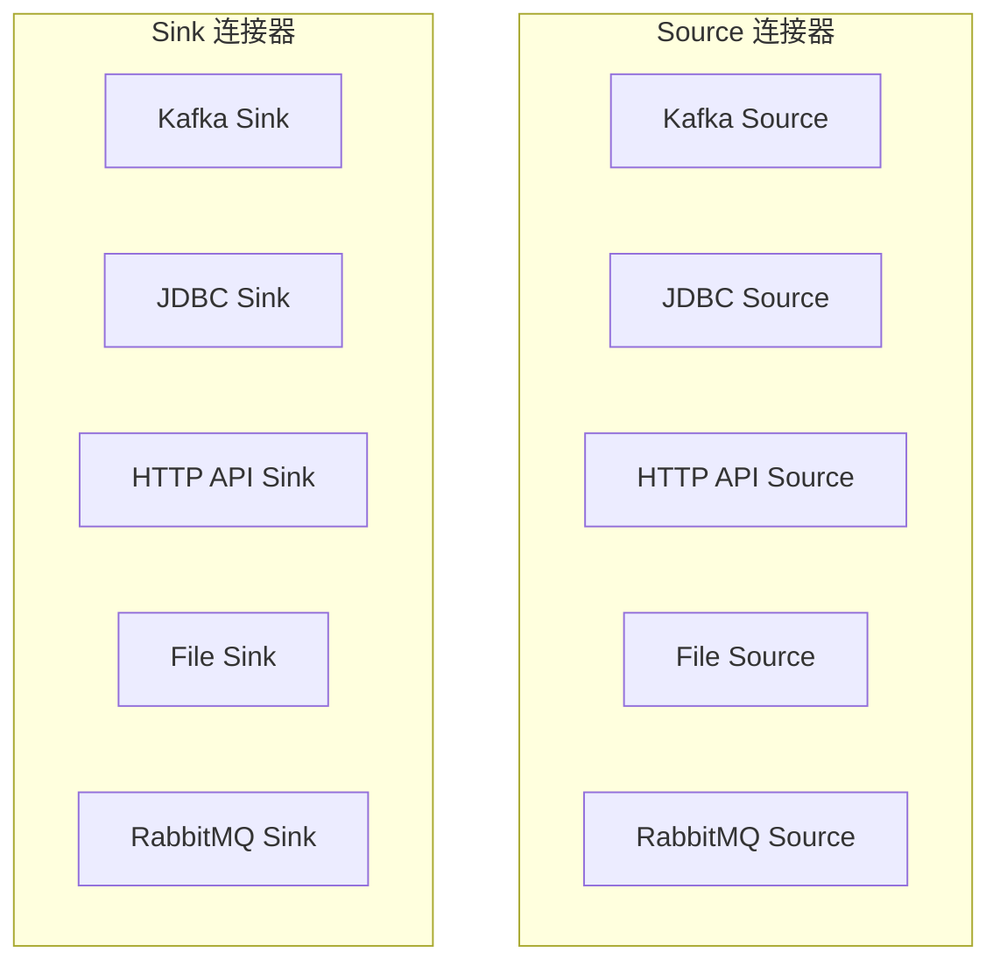

**核心接口**：

```java
/**
 * 连接器管理器
 */
public interface ConnectorManager {
    
    /**
     * 注册 Source 连接器
     */
    void registerSource(String type, Class<? extends ReactorSource> clazz);
    
    /**
     * 注册 Sink 连接器
     */
    void registerSink(String type, Class<? extends ReactorSink> clazz);
    
    /**
     * 创建 Source 实例
     */
    <T> ReactorSource<T> createSource(String type, Map<String, Object> config);
    
    /**
     * 创建 Sink 实例
     */
    <T> ReactorSink<T> createSink(String type, Map<String, Object> config);
}
```

**实现要点**：
1. 使用 SPI（Service Provider Interface）机制自动发现连接器
2. 使用工厂模式创建连接器实例
3. 连接器配置使用 Builder 模式
4. 提供连接池管理（JDBC、HTTP 等）

**示例**：

```java
@Service
public class ConnectorManagerImpl implements ConnectorManager {
    
    private Map<String, Class<? extends ReactorSource>> sourceRegistry = new ConcurrentHashMap<>();
    private Map<String, Class<? extends ReactorSink>> sinkRegistry = new ConcurrentHashMap<>();
    
    @PostConstruct
    public void init() {
        // 自动发现并注册连接器
        ServiceLoader.load(ReactorSource.class).forEach(source -> {
            ConnectorType annotation = source.getClass().getAnnotation(ConnectorType.class);
            if (annotation != null) {
                sourceRegistry.put(annotation.value(), source.getClass());
            }
        });
    }
    
    @Override
    public <T> ReactorSource<T> createSource(String type, Map<String, Object> config) {
        Class<? extends ReactorSource> clazz = sourceRegistry.get(type);
        if (clazz == null) {
            throw new ConnectorNotFoundException("Source: " + type);
        }
        
        // 使用反射创建实例并配置
        try {
            ReactorSource<T> source = (ReactorSource<T>) clazz.getDeclaredConstructor().newInstance();
            // 配置属性注入
            BeanUtils.copyProperties(config, source);
            return source;
        } catch (Exception e) {
            throw new ConnectorCreationException(e);
        }
    }
}
```

---

### 4.8 metrics-collector (指标收集器)

**职责**：收集 Job 的运行指标，对接监控系统。

**核心功能**：
- 收集 Job 执行指标（吞吐量、延迟、错误率等）
- 收集系统指标（CPU、内存、线程等）
- 收集 Reactor 指标（缓冲区大小、背压状态等）
- 对接 Prometheus/Grafana

**核心指标**：

| 指标类别 | 指标名称 | 说明 |
|---------|---------|------|
| **Job 指标** | `job_execution_count` | Job 执行次数 |
| | `job_success_rate` | Job 成功率 |
| | `job_duration` | Job 执行时长 |
| **数据指标** | `records_processed` | 处理记录数 |
| | `records_failed` | 失败记录数 |
| | `throughput` | 吞吐量（条/秒） |
| **系统指标** | `cpu_usage` | CPU 使用率 |
| | `memory_usage` | 内存使用率 |
| | `thread_count` | 线程数 |
| **Reactor 指标** | `buffer_size` | 缓冲区大小 |
| | `backpressure_status` | 背压状态 |
| | `dropped_records` | 丢弃记录数 |

**实现要点**：
1. 使用 Micrometer 作为指标收集框架
2. 集成 Prometheus Pushgateway
3. 指标数据定期上报（每 10 秒）
4. 提供 Grafana Dashboard 模板

---

## 5. 断点机制设计

### 5.1 什么是 Checkpoint？

Checkpoint（检查点）是将 Job 的当前状态保存下来的机制，用于：
- **故障恢复**：Job 失败后可以从最近的 Checkpoint 恢复，避免重头开始
- **断点续传**：批量任务暂停后可以从上次的位置继续执行
- **Exactly-Once 语义**：配合事务 Sink 实现精确一次处理

### 5.2 Checkpoint 架构

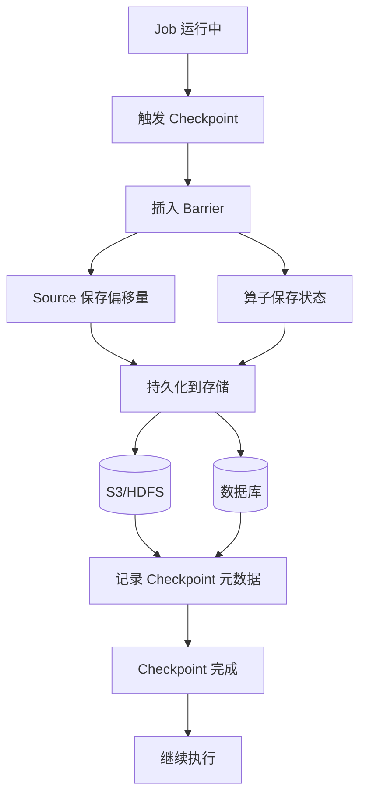

### 5.3 Checkpoint 流程

**流式任务的 Checkpoint 流程**：

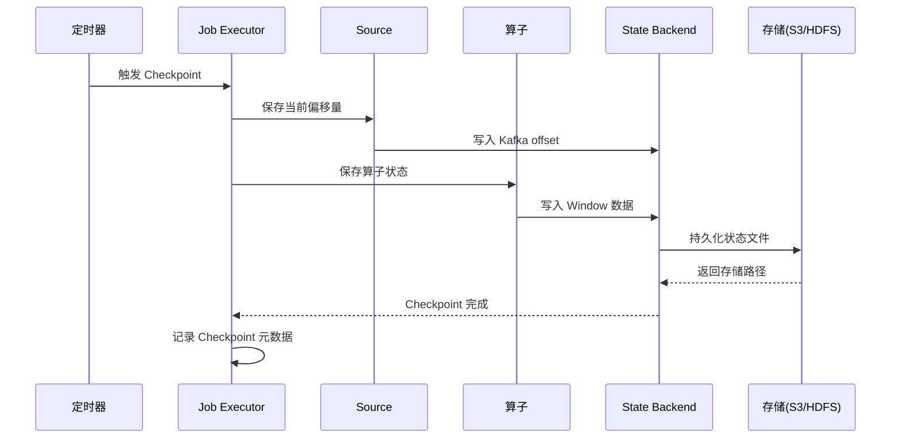

**批量任务的 Checkpoint 流程**：

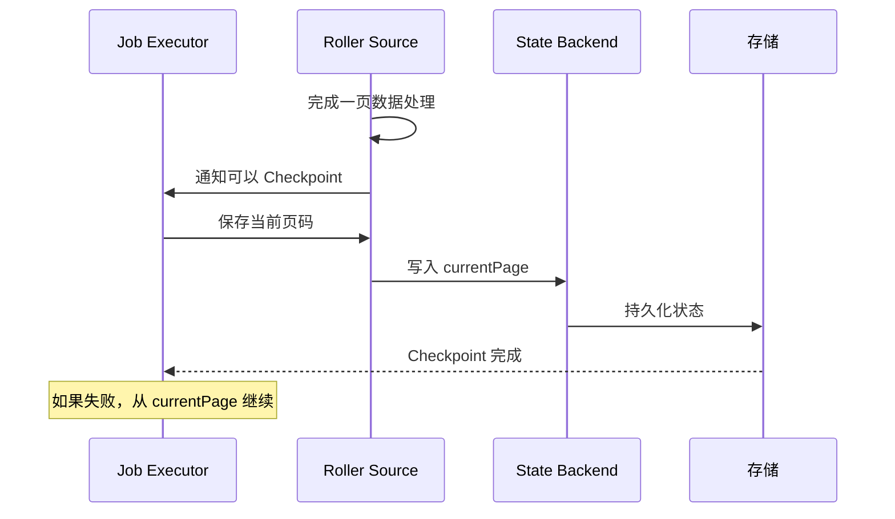

### 5.4 Checkpoint 数据结构

**Checkpoint 元数据**：

```java
public class Checkpoint {
    private String executionId;        // 执行 ID
    private long checkpointId;         // Checkpoint 序号
    private CheckpointType type;       // STREAMING/ROLLER/SQL_TASK
    private LocalDateTime createTime;  // 创建时间
    private String storagePath;        // 存储路径（S3/HDFS）
    private Map<String, Object> stateData;  // 状态数据
    private CheckpointStatus status;   // 状态（PENDING/COMPLETED/FAILED）
}
```

**三种模式的状态数据**：

**STREAMING 模式**：
```json
{
  "checkpoint_id": 123,
  "timestamp": "2024-01-01T10:00:00",
  "source_state": {
    "kafka_offsets": {
      "topic-1": {
        "0": 12345,
        "1": 23456
      }
    }
  },
  "operator_state": {
    "window_operator": {
      "user_123": {"count": 100, "sum": 5000},
      "user_456": {"count": 50, "sum": 2500}
    }
  }
}
```

**BATCH_ROLLER 模式**：
```json
{
  "checkpoint_id": 45,
  "timestamp": "2024-01-01T10:00:00",
  "source_state": {
    "current_page": 123,
    "page_size": 1000,
    "total_processed": 123000
  }
}
```

**SQL_TASK 模式**：
```json
{
  "checkpoint_id": 10,
  "timestamp": "2024-01-01T10:00:00",
  "source_state": {
    "processed_rows": 1000000,
    "last_processed_id": 999999
  }
}
```

### 5.5 Checkpoint 触发策略

| 策略 | 说明 | 适用场景 |
|------|------|----------|
| **时间间隔** | 每隔固定时间触发 | 流式任务（每 1 分钟） |
| **记录数量** | 处理固定数量记录后触发 | 批量任务（每 10000 条） |
| **页面完成** | 每完成一页数据后触发 | 滚动翻页任务 |
| **手动触发** | 通过 API 手动触发 | 调试和测试 |

### 5.6 故障恢复流程

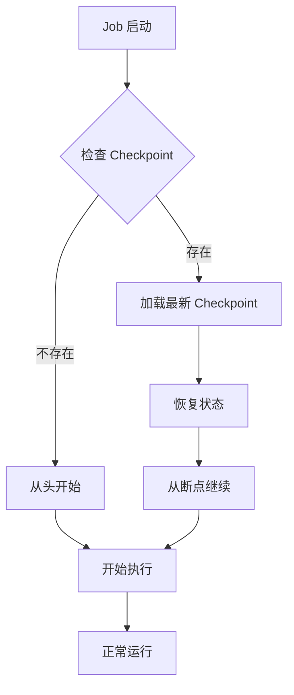

**恢复示例**：

```java
public class CheckpointManager {
    
    /**
     * 恢复 Job 状态
     */
    public void restore(String executionId, ReactorSource<?> source) {
        // 1. 查找最新的 Checkpoint
        Checkpoint checkpoint = findLatestCheckpoint(executionId);
        if (checkpoint == null) {
            log.info("No checkpoint found, starting from beginning");
            return;
        }
        
        // 2. 恢复 Source 状态
        if (source instanceof KafkaReactorSource) {
            Map<String, Object> kafkaOffsets = 
                (Map) checkpoint.getStateData().get("kafka_offsets");
            ((KafkaReactorSource) source).seekToOffsets(kafkaOffsets);
        } else if (source instanceof HttpApiRollerSource) {
            int currentPage = (int) checkpoint.getStateData().get("current_page");
            ((HttpApiRollerSource) source).seekToPage(currentPage);
        }
        
        // 3. 恢复算子状态
        restoreOperatorState(checkpoint);
        
        log.info("Restored from checkpoint: {}", checkpoint.getCheckpointId());
    }
}
```

### 5.7 Checkpoint 清理策略

**保留策略**：
- 默认保留最近 10 个 Checkpoint
- 可配置保留时间（如保留 7 天内的）
- 手动标记的 Checkpoint 永久保留（Savepoint）

**清理流程**：
```java
@Scheduled(cron = "0 0 2 * * ?")  // 每天凌晨 2 点执行
public void cleanOldCheckpoints() {
    List<Checkpoint> checkpoints = checkpointRepository.findAll();
    
    checkpoints.stream()
        .filter(cp -> !cp.isSavepoint())  // 排除 Savepoint
        .sorted(Comparator.comparing(Checkpoint::getCreateTime).reversed())
        .skip(10)  // 保留最新 10 个
        .forEach(cp -> {
            // 删除存储文件
            storage.delete(cp.getStoragePath());
            // 删除元数据
            checkpointRepository.delete(cp);
        });
}
```

---

## 6. 数据库设计

### 6.1 pipeline_job_definition (Job 定义表)

```sql
CREATE TABLE pipeline_job_definition (
    id                  BIGSERIAL PRIMARY KEY,
    job_name            VARCHAR(200) NOT NULL UNIQUE,
    job_type            VARCHAR(50) NOT NULL,  -- STREAMING/BATCH_ROLLER/SQL_TASK
    version             INTEGER NOT NULL DEFAULT 1,
    dag_definition      TEXT NOT NULL,         -- Job 定义的 JSON
    description         TEXT,
    enabled             BOOLEAN NOT NULL DEFAULT true,
    create_time         TIMESTAMP NOT NULL DEFAULT CURRENT_TIMESTAMP,
    update_time         TIMESTAMP NOT NULL DEFAULT CURRENT_TIMESTAMP,
    created_by          VARCHAR(100),
    updated_by          VARCHAR(100)
);

-- 索引
CREATE INDEX idx_job_name ON pipeline_job_definition(job_name);
CREATE INDEX idx_enabled ON pipeline_job_definition(enabled);
CREATE INDEX idx_job_type ON pipeline_job_definition(job_type);
```

**字段说明**：
- `job_name`：Job 唯一名称，不可重复
- `job_type`：Job 类型，决定执行模式
- `version`：版本号，每次更新自增
- `dag_definition`：Job 的完整定义（JSON 格式），包含 Source、Sink、Transform 等
- `enabled`：是否启用，禁用后不会被调度

**dag_definition JSON 示例**：
```json
{
  "name": "user-sync-job",
  "type": "BATCH_ROLLER",
  "source": {
    "type": "http_api",
    "config": {
      "url": "https://api.example.com/users",
      "page_size": 1000
    }
  },
  "transform": [
    {"type": "map", "function": "enrichUser"},
    {"type": "filter", "condition": "user.isActive()"}
  ],
  "sink": {
    "type": "jdbc",
    "config": {
      "url": "jdbc:postgresql://localhost:5432/mydb",
      "table": "users",
      "batch_size": 1000
    }
  },
  "config": {
    "checkpoint_interval": 60000,
    "max_retry_times": 3
  }
}
```

---

### 6.2 pipeline_job_execution (Job 执行记录表)

```sql
CREATE TABLE pipeline_job_execution (
    id                  BIGSERIAL PRIMARY KEY,
    execution_id        VARCHAR(100) NOT NULL UNIQUE,
    job_id              BIGINT NOT NULL,
    job_name            VARCHAR(200) NOT NULL,
    status              VARCHAR(50) NOT NULL,  -- SCHEDULED/INITIALIZING/RUNNING/COMPLETED/FAILED/CANCELLED
    start_time          TIMESTAMP NOT NULL,
    end_time            TIMESTAMP,
    duration_ms         BIGINT,                -- 执行时长（毫秒）
    processed_records   BIGINT DEFAULT 0,      -- 处理记录数
    failed_records      BIGINT DEFAULT 0,      -- 失败记录数
    error_message       TEXT,                  -- 错误信息
    error_stack_trace   TEXT,                  -- 错误堆栈
    checkpoint_path     VARCHAR(500),          -- 最后一次 Checkpoint 路径
    retry_count         INTEGER DEFAULT 0,     -- 重试次数
    triggered_by        VARCHAR(100),          -- 触发方式（CRON/MANUAL/EVENT）
    
    FOREIGN KEY (job_id) REFERENCES pipeline_job_definition(id)
);

-- 索引
CREATE INDEX idx_execution_id ON pipeline_job_execution(execution_id);
CREATE INDEX idx_job_id_start_time ON pipeline_job_execution(job_id, start_time DESC);
CREATE INDEX idx_status ON pipeline_job_execution(status);
CREATE INDEX idx_job_name ON pipeline_job_execution(job_name);
```

**字段说明**：
- `execution_id`：执行唯一 ID，UUID 格式
- `status`：执行状态，见生命周期状态机
- `duration_ms`：执行时长，用于性能分析
- `processed_records`/`failed_records`：统计处理情况
- `retry_count`：重试次数，达到上限后放弃

---

### 6.3 pipeline_checkpoint (Checkpoint 记录表)

```sql
CREATE TABLE pipeline_checkpoint (
    id                  BIGSERIAL PRIMARY KEY,
    execution_id        VARCHAR(100) NOT NULL,
    checkpoint_id       BIGINT NOT NULL,       -- Checkpoint 序号
    checkpoint_type     VARCHAR(50) NOT NULL,  -- STREAMING/ROLLER/SQL_TASK
    status              VARCHAR(50) NOT NULL,  -- PENDING/COMPLETED/FAILED
    state_data          JSONB NOT NULL,        -- 状态数据（JSON）
    storage_path        VARCHAR(500),          -- 存储路径（S3/HDFS）
    storage_size_bytes  BIGINT,                -- 存储大小
    create_time         TIMESTAMP NOT NULL DEFAULT CURRENT_TIMESTAMP,
    complete_time       TIMESTAMP,
    is_savepoint        BOOLEAN DEFAULT false, -- 是否为 Savepoint
    
    FOREIGN KEY (execution_id) REFERENCES pipeline_job_execution(execution_id),
    UNIQUE (execution_id, checkpoint_id)
);

-- 索引
CREATE INDEX idx_execution_checkpoint ON pipeline_checkpoint(execution_id, checkpoint_id DESC);
CREATE INDEX idx_create_time ON pipeline_checkpoint(create_time);
CREATE INDEX idx_savepoint ON pipeline_checkpoint(is_savepoint) WHERE is_savepoint = true;
```

**字段说明**：
- `checkpoint_id`：Checkpoint 序号，从 1 开始递增
- `state_data`：状态数据，使用 JSONB 类型支持查询
- `is_savepoint`：是否为手动保存点，Savepoint 不会被自动清理

---

### 6.4 pipeline_job_config (Job 配置表)

```sql
CREATE TABLE pipeline_job_config (
    id              BIGSERIAL PRIMARY KEY,
    job_id          BIGINT NOT NULL,
    config_key      VARCHAR(200) NOT NULL,
    config_value    TEXT NOT NULL,
    config_type     VARCHAR(50) NOT NULL,  -- STRING/INT/BOOLEAN/JSON
    description     TEXT,
    create_time     TIMESTAMP NOT NULL DEFAULT CURRENT_TIMESTAMP,
    update_time     TIMESTAMP NOT NULL DEFAULT CURRENT_TIMESTAMP,
    
    FOREIGN KEY (job_id) REFERENCES pipeline_job_definition(id),
    UNIQUE (job_id, config_key)
);

-- 索引
CREATE INDEX idx_job_config ON pipeline_job_config(job_id);
```

**常用配置项**：

| config_key | config_type | 说明 | 示例值 |
|-----------|-------------|------|--------|
| `parallelism` | INT | 并行度 | 4 |
| `checkpoint.interval` | INT | Checkpoint 间隔（毫秒） | 60000 |
| `checkpoint.retention` | INT | Checkpoint 保留数量 | 10 |
| `backpressure.strategy` | STRING | 背压策略 | BUFFER |
| `source.batch.size` | INT | Source 批量大小 | 100 |
| `sink.batch.size` | INT | Sink 批量大小 | 1000 |
| `max.retry.times` | INT | 最大重试次数 | 3 |
| `retry.interval` | INT | 重试间隔（毫秒） | 5000 |

---

### 6.5 pipeline_job_schedule (Job 调度配置表)

```sql
CREATE TABLE pipeline_job_schedule (
    id                  BIGSERIAL PRIMARY KEY,
    job_id              BIGINT NOT NULL,
    schedule_type       VARCHAR(50) NOT NULL,  -- CRON/MANUAL/EVENT/DEPENDENCY
    cron_expression     VARCHAR(100),          -- Cron 表达式
    event_topic         VARCHAR(200),          -- 事件主题
    dependencies        TEXT,                  -- 依赖的 Job（JSON 数组）
    enabled             BOOLEAN NOT NULL DEFAULT true,
    last_trigger_time   TIMESTAMP,
    next_trigger_time   TIMESTAMP,
    create_time         TIMESTAMP NOT NULL DEFAULT CURRENT_TIMESTAMP,
    
    FOREIGN KEY (job_id) REFERENCES pipeline_job_definition(id),
    UNIQUE (job_id)
);

-- 索引
CREATE INDEX idx_schedule_job ON pipeline_job_schedule(job_id);
CREATE INDEX idx_next_trigger ON pipeline_job_schedule(next_trigger_time) WHERE enabled = true;
```

---

### 6.6 数据库 ER 图

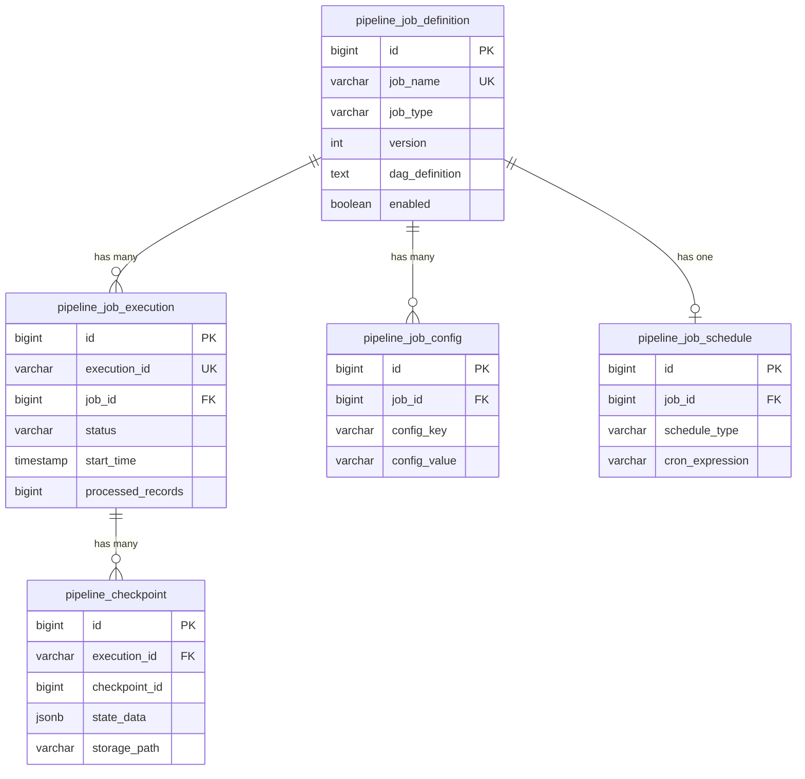

---

## 7. 开发指南

### 7.1 如何开发一个新的 Source Connector？

**步骤**：

1. **实现 ReactorSource 接口**

```java
@ConnectorType("my-source")  // 连接器类型标识
public class MyCustomSource implements ReactorSource<MyData> {
    
    private String url;
    private int batchSize;
    
    @Override
    public Flux<MyData> flux() {
        return Flux.create(sink -> {
            // 1. 初始化资源（连接、客户端等）
            MyClient client = new MyClient(url);
            
            // 2. 响应下游请求
            sink.onRequest(n -> {
                try {
                    // 拉取数据
                    List<MyData> data = client.fetchBatch(batchSize);
                    
                    // 发射数据
                    data.forEach(sink::next);
                    
                    // 如果没有更多数据，结束流
                    if (data.isEmpty()) {
                        sink.complete();
                    }
                } catch (Exception e) {
                    sink.error(e);
                }
            });
            
            // 3. 清理资源
            sink.onDispose(() -> client.close());
            
        }, FluxSink.OverflowStrategy.BUFFER);
    }
    
    @Override
    public void restore(Checkpoint checkpoint) {
        // 从 Checkpoint 恢复状态
        if (checkpoint != null) {
            Map<String, Object> state = checkpoint.getStateData();
            // 恢复到特定位置
        }
    }
    
    // Getter/Setter 用于配置注入
    public void setUrl(String url) { this.url = url; }
    public void setBatchSize(int batchSize) { this.batchSize = batchSize; }
}
```

2. **添加 SPI 配置**

在 `src/main/resources/META-INF/services/` 目录下创建文件：
`com.pipeline.connector.ReactorSource`

```
com.mycompany.connector.MyCustomSource
```

3. **使用自定义 Source**

```java
@Bean
public PipelineJob myJob() {
    return PipelineJob.builder()
        .source(MyCustomSource.builder()
            .url("https://api.example.com")
            .batchSize(100)
            .build())
        // ...
        .build();
}
```

### 7.2 如何开发一个新的 Sink Connector？

**步骤类似**，实现 `ReactorSink` 接口：

```java
@ConnectorType("my-sink")
public class MyCustomSink implements ReactorSink<MyData> {
    
    private String targetUrl;
    private int batchSize;
    
    @Override
    public Mono<Void> consume(Flux<MyData> flux) {
        return flux
            .buffer(batchSize)  // 批量处理
            .flatMap(batch -> {
                // 批量写入
                return Mono.fromRunnable(() -> {
                    MyClient client = new MyClient(targetUrl);
                    client.batchInsert(batch);
                    client.close();
                });
            })
            .then();
    }
}
```

### 7.3 如何添加自定义算子？

```java
public class CustomOperators {
    
    /**
     * 去重算子
     */
    public static <T> Function<Flux<T>, Flux<T>> distinct(Function<T, Object> keyExtractor) {
        return flux -> flux
            .distinct(keyExtractor);
    }
    
    /**
     * 限流算子
     */
    public static <T> Function<Flux<T>, Flux<T>> rateLimit(int permitsPerSecond) {
        return flux -> flux
            .delayElements(Duration.ofMillis(1000 / permitsPerSecond));
    }
}

// 使用
.transform(flux -> flux
    .transform(CustomOperators.distinct(User::getId))
    .transform(CustomOperators.rateLimit(100))
)
```

### 7.4 本地开发环境搭建

**依赖服务**：
```yaml
version: '3'
services:
  postgres:
    image: postgres:14
    ports:
      - "5432:5432"
    environment:
      POSTGRES_DB: pipeline
      POSTGRES_USER: pipeline
      POSTGRES_PASSWORD: pipeline123
  
  kafka:
    image: confluentinc/cp-kafka:latest
    ports:
      - "9092:9092"
    environment:
      KAFKA_ZOOKEEPER_CONNECT: zookeeper:2181
  
  zookeeper:
    image: confluentinc/cp-zookeeper:latest
    ports:
      - "2181:2181"
```

**启动命令**：
```bash
# 1. 启动依赖服务
docker-compose up -d

# 2. 初始化数据库
mvn flyway:migrate

# 3. 启动应用
mvn spring-boot:run
```

---

## 8. 部署运维

### 8.1 部署架构

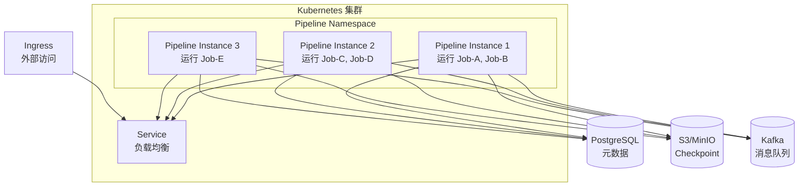

### 8.2 监控大盘

**关键指标**：
- Job 执行成功率
- Job 平均执行时长
- 数据处理吞吐量
- Checkpoint 成功率
- 系统资源使用率

**告警规则**：
- Job 失败率 > 5%：严重告警
- Checkpoint 失败：警告
- 内存使用 > 90%：严重告警
- 背压持续 > 5 分钟：警告

---

**文档版本**：v3.0  
**最后更新**：2025-11-07  
**下一步**：请参考开发指南开始编写代码
