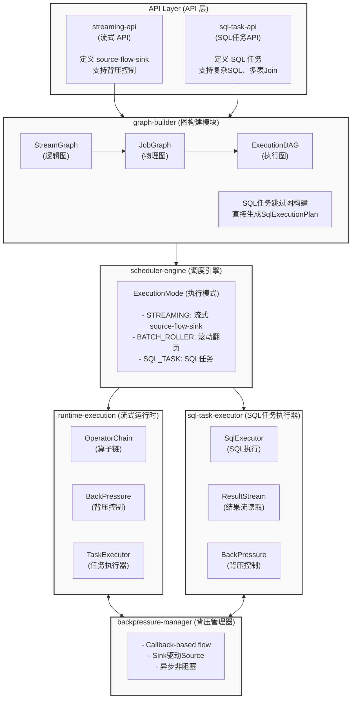
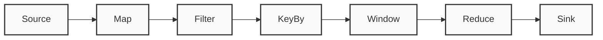
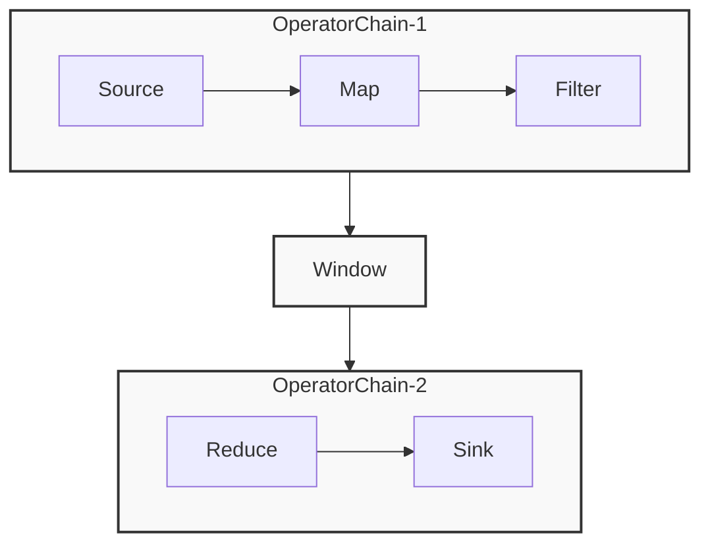
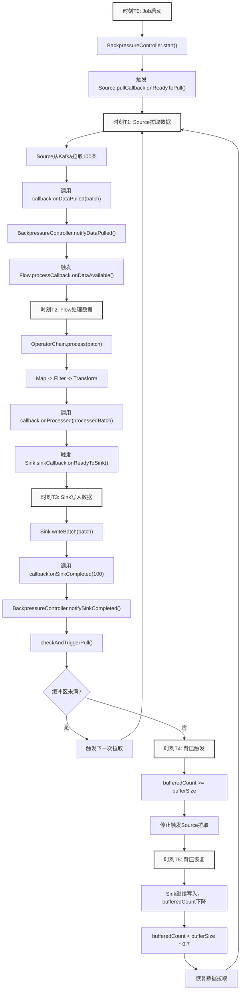
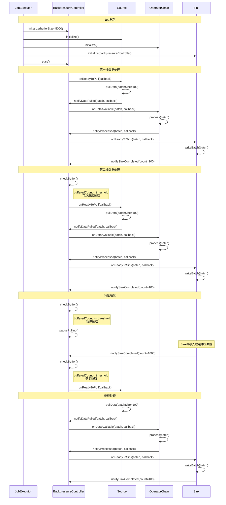
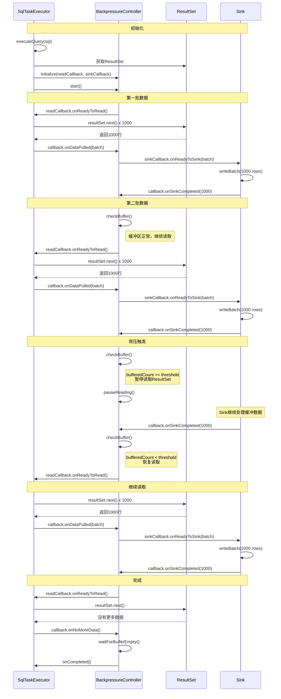

# Pipeline Framework 设计文档

## 1. 概述

### 1.1 项目定位

Pipeline Framework 是一个单机流式/批量数据处理框架，核心特点：

- **分布式部署**：多个实例独立运行
- **Job 独立执行**：每个 Job 在单实例内完整执行 source → flow → sink
- **无数据 Shuffle**：不需要跨实例的数据传输和汇总
- **流批一体**：统一的 API，支持流式和批量处理
- **背压控制**：基于回调的异步背压机制
- **三种执行模式**：STREAMING（流式）、BATCH_ROLLER（滚动翻页）、SQL_TASK（SQL任务）

### 1.2 与 Flink 的区别

| 特性 | Flink | Pipeline Framework |
|------|-------|-------------------|
| 分布式计算 | 支持 | 不支持 |
| 数据 Shuffle | 跨节点重分区 | 不支持 |
| Job 执行单元 | Task（拆分后的子任务） | Job（完整的 pipeline） |
| KeyBy 实现 | 跨节点重分区 | 单实例内存分组 |
| 算子链优化 | 支持 | 支持 |
| 流批一体 | 支持 | 支持 |
| 背压机制 | 网络缓冲区 | 回调驱动 |

---

## 2. 整体架构

### 2.1 架构分层



### 2.2 核心概念

#### 2.2.1 StreamGraph (逻辑图)

用户 API 的直接翻译，保留所有算子细节。

**用户代码**:
```java
source.map().filter().keyBy().window().reduce().sink()
```

**StreamGraph (逻辑图)**:



#### 2.2.2 JobGraph (物理图)

优化后的执行图，应用算子链。



**算子链规则**：
- 可以链化：连续的无状态转换（Map、Filter）
- 不能链化：KeyBy（需要状态）、Window（需要缓存）、并行度改变

#### 2.2.3 ExecutionDAG (执行图)

最终执行的任务图，包含具体的执行策略。

---

## 3. 核心模块设计

### 3.1 streaming-api (流式 API 模块)

**职责**：提供流式处理的编程接口

**核心类**：
- `DataStream<T>`：数据流抽象
- `StreamExecutionEnvironment`：流式执行环境
- `SourceFunction<T>`：数据源接口
- `SinkFunction<T>`：输出接口

**示例**：

```java
StreamExecutionEnvironment env = StreamExecutionEnvironment.getExecutionEnvironment();

// 启用背压
env.enableBackpressure(true);
env.setBackpressureBufferSize(5000);

DataStream<Order> orders = env
    .addSource(new KafkaSourceWithBackpressure<>("orders"))
    .map(new ParseOrderFunction())
    .filter(order -> order.getAmount() > 100)
    .keyBy(Order::getUserId)
    .window(TumblingEventTimeWindows.of(Time.minutes(5)))
    .aggregate(new SumAggregator())
    .addSink(new JdbcBatchSink<>());

env.execute("OrderProcessingJob");
```

---

### 3.2 sql-task-api (SQL任务API)

**职责**：支持 SQL 方式定义数据处理任务

**核心类**：
- `SqlTaskJob`：SQL 任务定义
- `SqlTaskConfig`：SQL 任务配置

**特点**：
- 不是 source-flow-sink 模式
- 直接执行 SQL（可能是复杂的多表 Join、聚合）
- 流式读取 ResultSet
- 支持背压控制

**示例**：

```java
SqlTaskJob job = SqlTaskJob.builder()
    .jobName("UserOrderReport")
    .sql("""
        SELECT 
            u.user_id,
            u.user_name,
            COUNT(DISTINCT o.order_id) as order_count,
            SUM(o.order_amount) as total_amount
        FROM users u
        LEFT JOIN orders o ON u.user_id = o.user_id
        WHERE u.create_time >= '2023-01-01'
        GROUP BY u.user_id, u.user_name
        HAVING total_amount > 10000
        """)
    .dataSource(mysqlDataSource)
    .sink(new JdbcBatchSink<>("target_db", "user_report"))
    .config(SqlTaskConfig.builder()
        .fetchSize(1000)
        .batchSize(1000)
        .queryTimeout(7200)
        .enableBackpressure(true)
        .build())
    .build();

env.execute(job);
```

---

### 3.3 graph-builder (图构建模块)

**职责**：构建和优化执行图

**核心类**：
- `StreamGraphBuilder`：构建逻辑图
- `JobGraphOptimizer`：优化物理图
- `ExecutionGraphGenerator`：生成执行图

**优化策略**：
1. 算子链合并
2. 无用算子消除
3. 谓词下推
4. 资源分配

---

### 3.4 scheduler-engine (调度引擎)

**职责**：任务调度和执行模式管理

**核心类**：
- `JobScheduler`：任务调度器
- `ExecutionMode`：执行模式枚举

**ExecutionMode**：

```java
public enum ExecutionMode {
    /**
     * 流式处理模式
     * 架构：Source → Flow → Sink
     * 特点：持续运行，支持背压，支持Checkpoint
     */
    STREAMING,
    
    /**
     * 批量滚动翻页模式
     * 架构：Source(Roller) → Flow → Sink
     * 特点：自动翻页，背压控制，读完自动结束
     */
    BATCH_ROLLER,
    
    /**
     * SQL任务模式
     * 架构：SQL Engine → Sink
     * 特点：执行SQL，流式读取ResultSet，支持背压
     */
    SQL_TASK
}
```

---

### 3.5 backpressure-manager (背压管理器)

**职责**：实现基于回调的异步背压控制

**核心思想**：
- 事件驱动，非阻塞
- Sink 写完触发 Source 拉取
- 通过回调传递控制流

**核心类**：

```java
/**
 * 背压控制器 - 基于回调的事件驱动模式
 */
public class CallbackBasedBackpressureController {
    
    private final int bufferSize;
    private final AtomicInteger bufferedCount;
    
    // 回调接口
    private PullCallback pullCallback;
    private SinkCallback sinkCallback;
    
    /**
     * 启动：触发第一次拉取
     */
    public void start() {
        triggerPull();
    }
    
    /**
     * Source通知：已拉取数据
     */
    public void notifyDataPulled(DataBatch batch, ProcessCallback callback) {
        bufferedCount.incrementAndGet();
        callback.onDataAvailable(batch, processedBatch -> {
            triggerSink(processedBatch);
        });
    }
    
    /**
     * Sink通知：已完成写入
     */
    public void notifySinkCompleted(int count) {
        bufferedCount.addAndGet(-1);
        checkAndTriggerPull();
    }
    
    /**
     * 触发Source拉取
     */
    private void triggerPull() {
        if (bufferedCount.get() < bufferSize) {
            pullCallback.onReadyToPull(batch -> {
                notifyDataPulled(batch, flowCallback);
            });
        }
    }
    
    /**
     * 触发Sink写入
     */
    private void triggerSink(DataBatch batch) {
        sinkCallback.onReadyToSink(batch, count -> {
            notifySinkCompleted(count);
        });
    }
}
```

**回调接口定义**：

```java
@FunctionalInterface
public interface PullCallback {
    void onReadyToPull(PullResultCallback callback);
}

@FunctionalInterface
public interface PullResultCallback {
    void onDataPulled(DataBatch batch);
    void onNoMoreData();
    void onError(Exception e);
}

@FunctionalInterface
public interface SinkCallback {
    void onReadyToSink(DataBatch batch, SinkResultCallback callback);
}

@FunctionalInterface
public interface SinkResultCallback {
    void onSinkCompleted(int count);
    void onError(Exception e);
}
```

---

### 3.6 runtime-execution (运行时执行)

**职责**：实际的任务执行引擎

**核心类**：
- `OperatorChain`：算子链执行
- `TaskExecutor`：任务执行器
- `ThreadPoolManager`：线程池管理

**算子链执行**：

```java
public class CallbackBasedOperatorChain {
    private List<Operator> operators;
    
    public void process(DataBatch batch, ProcessResultCallback callback) {
        CompletableFuture.runAsync(() -> {
            DataBatch current = batch;
            
            // 依次通过算子链
            for (Operator operator : operators) {
                current = operator.process(current);
            }
            
            // 通知处理完成
            callback.onProcessed(current);
        });
    }
}
```

---

### 3.7 sql-task-executor (SQL任务执行器)

**职责**：执行 SQL 任务并流式读取结果

**核心类**：
- `SqlTaskExecutor`：SQL 执行器
- `ResultStreamReader`：结果流读取器

**执行流程**：

```java
public class CallbackBasedSqlTaskExecutor {
    
    public void execute() throws SQLException {
        // 1. 执行SQL
        Statement stmt = prepareStatement();
        resultSet = stmt.executeQuery(job.getSql());
        
        // 2. 创建背压控制器
        controller = new CallbackBasedBackpressureController(5000);
        
        // 3. 注册回调
        controller.initialize(
            (callback) -> readResultSet(callback),
            (batch, callback) -> job.getSink().writeBatch(batch, callback)
        );
        
        // 4. 启动
        controller.start();
    }
    
    private void readResultSet(PullResultCallback callback) {
        CompletableFuture.runAsync(() -> {
            List<Row> batch = new ArrayList<>();
            int fetchSize = job.getConfig().getFetchSize();
            
            while (batch.size() < fetchSize && resultSet.next()) {
                batch.add(mapRow(resultSet));
            }
            
            if (batch.isEmpty()) {
                callback.onNoMoreData();
            } else {
                callback.onDataPulled(new DataBatch(batch));
            }
        });
    }
}
```

---

### 3.8 source-connectors (数据源连接器)

#### 3.8.1 StreamingSource (流式源)

**场景**：Kafka、RabbitMQ 等无限流

```java
public class CallbackBasedKafkaSource<T> implements SourceFunction<T> {
    private KafkaConsumer<String, T> consumer;
    private int batchSize = 100;
    
    public void open(BackpressureController controller) {
        controller.initialize(
            (callback) -> pullData(callback),
            null
        );
    }
    
    private void pullData(PullResultCallback callback) {
        CompletableFuture.runAsync(() -> {
            ConsumerRecords<String, T> records = consumer.poll(Duration.ofMillis(100));
            
            List<T> batch = new ArrayList<>();
            for (ConsumerRecord<String, T> record : records) {
                batch.add(record.value());
                if (batch.size() >= batchSize) break;
            }
            
            callback.onDataPulled(new DataBatch(batch));
        });
    }
}
```

#### 3.8.2 RollerSource (滚动翻页源)

**场景**：HTTP API 分页、数据库分页查询

```java
public abstract class RollerSourceWithBackpressure<T> implements SourceFunction<T> {
    protected int pageSize = 1000;
    protected int currentPage = 0;
    
    public void open(BackpressureController controller) {
        controller.initialize(
            (callback) -> fetchNextPage(callback),
            null
        );
    }
    
    private void fetchNextPage(PullResultCallback callback) {
        CompletableFuture.runAsync(() -> {
            List<T> pageData = fetchPage(currentPage, pageSize);
            
            if (pageData.isEmpty()) {
                callback.onNoMoreData();
            } else {
                currentPage++;
                callback.onDataPulled(new DataBatch(pageData));
            }
        });
    }
    
    protected abstract List<T> fetchPage(int page, int size);
}
```

**HTTP API 实现**：

```java
public class HttpApiRollerSource<T> extends RollerSourceWithBackpressure<T> {
    private String apiUrl;
    
    @Override
    protected List<T> fetchPage(int page, int size) {
        String url = String.format("%s?page=%d&size=%d", apiUrl, page, size);
        HttpResponse response = httpClient.get(url);
        return parseResponse(response.body());
    }
}
```

**JDBC 实现**：

```java
public class JdbcRollerSource<T> extends RollerSourceWithBackpressure<T> {
    private String sql;
    private Connection connection;
    
    @Override
    protected List<T> fetchPage(int page, int size) {
        int offset = page * size;
        String pagedSql = sql + " LIMIT ? OFFSET ?";
        
        PreparedStatement stmt = connection.prepareStatement(pagedSql);
        stmt.setInt(1, size);
        stmt.setInt(2, offset);
        
        ResultSet rs = stmt.executeQuery();
        List<T> results = new ArrayList<>();
        while (rs.next()) {
            results.add(mapRow(rs));
        }
        return results;
    }
}
```

---

### 3.9 sink-connectors (输出连接器)

```java
public abstract class BackpressureSink<T> implements SinkFunction<T> {
    protected BackpressureController backpressureController;
    protected int batchSize = 1000;
    protected List<T> buffer = new ArrayList<>();
    
    public void open(BackpressureController controller) {
        controller.initialize(
            null,
            (batch, callback) -> writeBatch(batch, callback)
        );
    }
    
    private void writeBatch(DataBatch batch, SinkResultCallback callback) {
        CompletableFuture.runAsync(() -> {
            buffer.addAll(batch.getData());
            
            if (buffer.size() >= batchSize) {
                doInvoke(new ArrayList<>(buffer));
                int count = buffer.size();
                buffer.clear();
                callback.onSinkCompleted(count);
            } else {
                callback.onSinkCompleted(batch.size());
            }
        });
    }
    
    protected abstract void doInvoke(List<T> batch) throws Exception;
}
```

**JDBC Sink**：

```java
public class JdbcBatchSink<T> extends BackpressureSink<T> {
    private Connection connection;
    private String insertSql;
    
    @Override
    protected void doInvoke(List<T> batch) throws SQLException {
        PreparedStatement stmt = connection.prepareStatement(insertSql);
        
        for (T record : batch) {
            setParameters(stmt, record);
            stmt.addBatch();
        }
        
        stmt.executeBatch();
        connection.commit();
    }
}
```

---

### 3.10 state-management (状态管理)

**职责**：管理算子状态和容错

**核心类**：
- `StateBackend`：状态后端接口
- `MemoryStateBackend`：内存状态后端
- `RocksDBStateBackend`：RocksDB 状态后端
- `Checkpoint`：检查点机制
- `Savepoint`：保存点机制

**Checkpoint 内容（三种模式对比）**：

**STREAMING 模式**：
```
Checkpoint 内容:
  - Kafka offset: topic-partition-offset
  - 算子状态: Window 缓存的数据、聚合中间结果
  - 定时触发: 每 1 分钟一次
```

**BATCH_ROLLER 模式**：
```
Checkpoint 内容:
  - 当前页码: currentPage = 123
  - 当前页内的处理进度: currentOffset = 500
```

**SQL_TASK 模式**：
```
Checkpoint 内容:
  - 已处理的行数: processedRows = 1000000
  - 通过 WHERE id > last_processed_id 实现增量查询
```

---

### 3.11 time-watermark (时间水印)

**职责**：时间语义和乱序处理（仅流式模式需要）

**核心类**：
- `TimeService`：时间服务
- `WatermarkGenerator`：水印生成器
- `TimerService`：定时器服务

---

## 4. 背压机制详解

### 4.1 核心思想

- **事件驱动**：基于回调，非阻塞
- **Sink 驱动**：Sink 写完触发 Source 拉取
- **异步执行**：所有操作都是异步的

### 4.2 执行流程



### 4.3 时序图

#### 4.3.1 流式Job执行时序图



#### 4.3.2 SQL任务执行时序图



---

## 5. 三种执行模式对比

| 特性 | STREAMING | BATCH_ROLLER | SQL_TASK |
|------|-----------|--------------|----------|
| **架构** | Source → Flow → Sink | Source(Roller) → Flow → Sink | SQL → Sink |
| **数据源** | Kafka, MQ | HTTP API, DB分页 | SQL查询结果 |
| **数据特点** | 无限流 | 有界，需翻页 | 有界，单次查询 |
| **Job生命周期** | 持续运行 | 自动结束 | 自动结束 |
| **时间语义** | Event Time / Processing Time | Processing Time | Processing Time |
| **Watermark** | 需要 | 不需要 | 不需要 |
| **Checkpoint** | 必需（容错） | 可选（断点续传） | 可选（进度记录） |
| **背压机制** | Sink写完→Source拉取 | Sink写完→翻下一页 | Sink写完→读下一批ResultSet |
| **适用场景** | 实时流处理 | 数据同步、迁移 | 数据分析、复杂ETL |
| **典型场景** | 实时大屏、实时告警 | 数据同步、历史数据迁移 | 数据分析、报表生成 |

---

## 6. 完整示例

### 6.1 流式处理示例（实时告警）

```java
StreamExecutionEnvironment env = StreamExecutionEnvironment.getExecutionEnvironment();

// 启用背压
env.enableBackpressure(true);
env.setBackpressureBufferSize(5000);

DataStream<Alert> alerts = env
    // Source: Kafka 实时消费
    .addSource(new KafkaSourceWithBackpressure<Event>("user-events")
        .setBatchSize(100))
    .assignTimestampsAndWatermarks(
        WatermarkStrategy.<Event>forBoundedOutOfOrderness(Duration.ofSeconds(5))
            .withTimestampAssigner((event, timestamp) -> event.getTimestamp())
    )
    
    // Flow: 数据处理（算子链）
    .map(new ParseEventFunction())
    .filter(event -> event.isValid())
    .keyBy(Event::getUserId)
    .window(TumblingEventTimeWindows.of(Time.minutes(5)))
    .aggregate(new CountAggregator())
    .filter(result -> result.getCount() > 100)
    .map(new CreateAlertFunction())
    
    // Sink: 输出到告警系统
    .addSink(new KafkaBatchSink<Alert>("alerts")
        .setBatchSize(100));

env.execute("RealtimeAlertJob");
```

**执行特点**：
- Job 持续运行
- Kafka 每次拉 100 条
- Sink 每批写 100 条
- Sink 写完后，Kafka 才继续拉取
- 每 1 分钟 Checkpoint

---

### 6.2 滚动翻页示例（数据同步）

```java
StreamExecutionEnvironment env = StreamExecutionEnvironment.getExecutionEnvironment();

env.enableBackpressure(true);

DataStream<User> users = env
    // Source: HTTP API 分页查询
    .addSource(new HttpApiRollerSourceWithBackpressure<User>(
        "https://api.example.com/users",
        1000,  // 每页1000条
        100    // 每页间隔100ms
    ))
    
    // Flow: 数据转换
    .map(new EnrichUserFunction())
    .filter(user -> user.isActive())
    
    // Sink: 写入数据库
    .addSink(new JdbcBatchSink<User>(
        "INSERT INTO users_sync VALUES (?, ?, ?)",
        1000  // 批量插入1000条
    ));

env.execute("UserSyncJob");
```

**执行特点**：
- HTTP API 每页 1000 条
- JDBC 每批写 1000 条
- JDBC 写完后，才拉取下一页 API 数据
- 读完所有数据后 Job 自动结束

---

### 6.3 SQL任务示例（数据分析）

```java
SqlTaskJob job = SqlTaskJob.builder()
    .jobName("ComplexDataIntegration")
    .sql("""
        SELECT 
            u.user_id,
            u.user_name,
            COUNT(DISTINCT o.order_id) as order_count,
            SUM(o.order_amount) as total_amount,
            COUNT(DISTINCT oi.product_id) as product_count,
            AVG(r.rating) as avg_rating
        FROM users u
        LEFT JOIN orders o ON u.user_id = o.user_id
        LEFT JOIN order_items oi ON o.order_id = oi.order_id
        LEFT JOIN reviews r ON oi.product_id = r.product_id
        WHERE u.create_time >= '2023-01-01'
          AND u.status = 'ACTIVE'
        GROUP BY u.user_id, u.user_name
        HAVING total_amount > 10000
        ORDER BY total_amount DESC
        """)
    .dataSource(mysqlDataSource)
    .sink(new JdbcBatchSink<>("target_db", "user_stats")
        .setBatchSize(1000))
    .config(SqlTaskConfig.builder()
        .fetchSize(1000)
        .batchSize(1000)
        .queryTimeout(7200)
        .enableBackpressure(true)
        .sinkBufferSize(5000)
        .build())
    .build();

env.execute(job);
```

**执行特点**：
- SQL 执行（可能很慢，涉及多表 Join）
- ResultSet 流式读取，每次 1000 行
- JDBC 每批写 1000 行
- JDBC 写完后，才从 ResultSet 读取下一批
- SQL 执行完成后 Job 自动结束

---

## 7. 项目目录结构

```
pipeline-framework/
│
├── pipeline-api/                    # API 层
│   ├── streaming-api/              # 流式 API
│   │   ├── DataStream.java
│   │   ├── StreamExecutionEnvironment.java
│   │   ├── SourceFunction.java
│   │   └── SinkFunction.java
│   │
│   └── sql-task-api/               # SQL任务API
│       ├── SqlTaskJob.java
│       ├── SqlTaskConfig.java
│       └── SqlExecutionEnvironment.java
│
├── pipeline-core/                   # 核心模块
│   ├── graph-builder/              # 图构建
│   │   ├── StreamGraph.java
│   │   ├── StreamGraphBuilder.java
│   │   ├── JobGraph.java
│   │   ├── JobGraphOptimizer.java
│   │   ├── ExecutionGraph.java
│   │   └── ExecutionGraphGenerator.java
│   │
│   ├── scheduler-engine/           # 调度引擎
│   │   ├── JobScheduler.java
│   │   ├── ExecutionMode.java
│   │   ├── TaskScheduler.java
│   │   └── TriggerManager.java
│   │
│   ├── runtime-execution/          # 运行时执行
│   │   ├── OperatorChain.java
│   │   ├── CallbackBasedOperatorChain.java
│   │   ├── TaskExecutor.java
│   │   └── ThreadPoolManager.java
│   │
│   ├── sql-task-executor/          # SQL任务执行器
│   │   ├── SqlTaskExecutor.java
│   │   ├── CallbackBasedSqlTaskExecutor.java
│   │   ├── ResultStreamReader.java
│   │   └── SqlTaskCheckpoint.java
│   │
│   ├── backpressure-manager/       # 背压管理器
│   │   ├── BackpressureController.java
│   │   ├── CallbackBasedBackpressureController.java
│   │   ├── BackpressureMetrics.java
│   │   ├── BackpressureStrategy.java
│   │   ├── PullCallback.java
│   │   ├── SinkCallback.java
│   │   └── BackpressureMonitor.java
│   │
│   ├── operator-core/              # 算子核心
│   │   ├── source/
│   │   │   ├── SourceFunction.java
│   │   │   └── SourceContext.java
│   │   ├── transform/
│   │   │   ├── MapFunction.java
│   │   │   ├── FilterFunction.java
│   │   │   ├── KeyByOperator.java
│   │   │   ├── ReduceFunction.java
│   │   │   └── AggregateFunction.java
│   │   ├── window/
│   │   │   ├── WindowOperator.java
│   │   │   ├── WindowAssigner.java
│   │   │   ├── TumblingWindow.java
│   │   │   ├── SlidingWindow.java
│   │   │   └── SessionWindow.java
│   │   └── sink/
│   │       ├── SinkFunction.java
│   │       └── BackpressureSink.java
│   │
│   ├── state-management/           # 状态管理
│   │   ├── StateBackend.java
│   │   ├── MemoryStateBackend.java
│   │   ├── FileSystemStateBackend.java
│   │   ├── RocksDBStateBackend.java
│   │   ├── Checkpoint.java
│   │   └── Savepoint.java
│   │
│   └── time-watermark/             # 时间水印
│       ├── TimeService.java
│       ├── WatermarkGenerator.java
│       ├── WatermarkStrategy.java
│       └── TimerService.java
│
├── pipeline-connectors/             # 连接器
│   ├── connector-core/             # 连接器核心
│   │   ├── SourceConnector.java
│   │   └── SinkConnector.java
│   │
│   ├── source-connectors/          # 数据源连接器
│   │   ├── streaming/              # 流式源
│   │   │   ├── KafkaSource.java
│   │   │   ├── KafkaSourceWithBackpressure.java
│   │   │   ├── RabbitMQSource.java
│   │   │   └── PulsarSource.java
│   │   │
│   │   └── roller/                 # 滚动翻页源
│   │       ├── RollerSource.java
│   │       ├── RollerSourceWithBackpressure.java
│   │       ├── HttpApiRollerSource.java
│   │       ├── JdbcRollerSource.java
│   │       └── FileRollerSource.java
│   │
│   └── sink-connectors/            # 输出连接器
│       ├── BackpressureSink.java
│       ├── KafkaSink.java
│       ├── KafkaBatchSink.java
│       ├── JdbcSink.java
│       ├── JdbcBatchSink.java
│       ├── FileSink.java
│       └── HttpSink.java
│
├── pipeline-common/                 # 公共基础设施
│   ├── serialization/              # 序列化
│   │   ├── Serializer.java
│   │   ├── KryoSerializer.java
│   │   └── AvroSerializer.java
│   │
│   ├── type-system/                # 类型系统
│   │   ├── TypeInformation.java
│   │   ├── TypeExtractor.java
│   │   └── TypeSerializer.java
│   │
│   ├── metrics/                    # 指标监控
│   │   ├── MetricsRegistry.java
│   │   ├── Counter.java
│   │   ├── Gauge.java
│   │   └── Histogram.java
│   │
│   ├── configuration/              # 配置管理
│   │   ├── Configuration.java
│   │   └── ConfigOption.java
│   │
│   ├── logging/                    # 日志系统
│   │   └── Logger.java
│   │
│   └── exception/                  # 异常处理
│       ├── PipelineException.java
│       └── ExceptionHandler.java
│
├── pipeline-examples/               # 示例代码
│   ├── streaming-examples/         # 流式示例
│   │   ├── RealtimeAlertExample.java
│   │   └── StreamingETLExample.java
│   │
│   ├── roller-examples/            # 滚动翻页示例
│   │   ├── DataSyncExample.java
│   │   └── ApiPollingExample.java
│   │
│   └── sql-task-examples/          # SQL任务示例
│       ├── ComplexJoinExample.java
│       └── DataAnalysisExample.java
│
└── pipeline-tests/                  # 测试代码
    ├── unit/                       # 单元测试
    ├── integration/                # 集成测试
    └── performance/                # 性能测试
```

---

## 8. 关键设计决策

### 8.1 为什么分 StreamGraph 和 JobGraph？

**StreamGraph**（逻辑图）：
- 用户 API 的直接翻译
- 一对一映射用户定义的算子
- 方便调试和可视化

**JobGraph**（物理图）：
- 经过优化后的执行图
- 应用了算子链、并行度调整等优化
- 实际执行的任务图

**好处**：
- 关注点分离：用户只需关心业务逻辑
- 可优化空间：可以在中间层做各种优化
- 易于调试：可以分别查看逻辑图和物理图

---

### 8.2 为什么需要算子链？

**不使用算子链**：
- 数据流动：Source线程 → 序列化 → 队列 → 反序列化 → Map线程 → ...
- 开销：多次序列化、线程切换、内存拷贝

**使用算子链**：
- 数据流动：Source+Map+Filter 在同一个线程中执行，直接方法调用
- 优点：零拷贝、无序列化开销、更高吞吐量

**性能差异**：
- 吞吐量提升：4-5 倍
- 延迟降低：4-5 倍
- CPU 使用率降低：20-30%

---

### 8.3 为什么使用回调而不是循环？

**循环模式**（阻塞式）：
```java
while (isRunning) {
    backpressure.waitForSinkReady();  // 阻塞等待
    Data data = source.pull();
    Data processed = flow.process(data);
    sink.write(processed);
}
```

缺点：
- 阻塞等待，资源浪费
- 难以实现真正的异步
- 难以处理复杂的依赖关系

**回调模式**（事件驱动）：
```java
controller.start();  // 启动后完全异步
// Source拉取完成 -> 触发Flow处理
// Flow处理完成 -> 触发Sink写入
// Sink写入完成 -> 触发下一轮Source拉取
```

优点：
- 完全异步，非阻塞
- 资源利用率高
- 易于扩展和组合

---

### 8.4 为什么 SQL 任务不是 source-flow-sink？

**原因**：
- SQL 本身就是完整的数据处理逻辑
- SQL 引擎已经完成了数据的过滤、转换、聚合
- 只需要从 ResultSet 读取结果并输出

**设计**：
```
SQL_TASK: SQL Engine → Sink
而不是: Source(SQL) → Flow → Sink
```

**好处**：
- 避免重复的数据转换
- 充分利用 SQL 引擎的优化能力
- 更简洁的编程模型

---

## 9. 性能优化建议

### 9.1 算子链优化

- 尽量合并无状态的转换算子
- 避免不必要的 KeyBy 操作
- 合理设置并行度

### 9.2 背压配置

- `bufferSize`：根据内存大小调整（建议 5000-10000）
- `batchSize`：根据吞吐量需求调整（建议 100-1000）
- 监控背压指标，及时调整

### 9.3 State Backend 选择

- **MemoryStateBackend**：小状态（< 1GB），快速
- **FileSystemStateBackend**：中等状态（1-10GB）
- **RocksDBStateBackend**：大状态（> 10GB），支持增量 checkpoint

### 9.4 Checkpoint 策略

- **STREAMING**：必须开启，间隔 1-5 分钟
- **BATCH_ROLLER**：可选，用于断点续传
- **SQL_TASK**：可选，用于进度记录

---

## 10. 监控和运维

### 10.1 关键指标

- **吞吐量**：records/sec
- **延迟**：平均处理延迟（毫秒）
- **背压率**：bufferedCount / bufferSize
- **Checkpoint 时长**：checkpoint 完成时间
- **错误率**：失败的记录数 / 总记录数

### 10.2 告警规则

- 背压率 > 90%：Sink 处理慢
- Checkpoint 失败率 > 5%：状态管理问题
- 错误率 > 1%：数据质量问题
- 延迟 > 阈值：性能下降

---

## 11. 后续扩展

### 11.1 短期（3个月）

- [ ] 完善核心框架
- [ ] 实现主要连接器（Kafka、JDBC、HTTP）
- [ ] 实现基本的状态管理
- [ ] 实现背压机制

### 11.2 中期（6个月）

- [ ] 实现完整的 Checkpoint 机制
- [ ] 支持更多连接器
- [ ] 性能优化
- [ ] 监控和可视化

### 11.3 长期（1年）

- [ ] SQL 引擎完善（Calcite 集成）
- [ ] 分布式协调（可选）
- [ ] 机器学习算子支持
- [ ] 实时数仓能力

---

## 12. 参考资料

- Apache Flink 官方文档
- Storm 背压机制设计
- Reactive Streams 规范
- Java CompletableFuture 文档

---

**文档版本**：v1.0
**最后更新**：2025-11-07
**维护人**：Pipeline Framework Team
