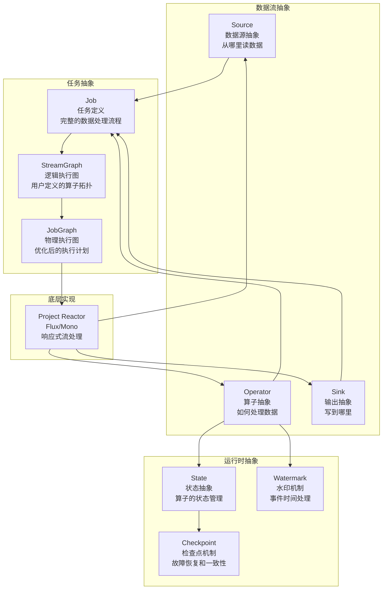
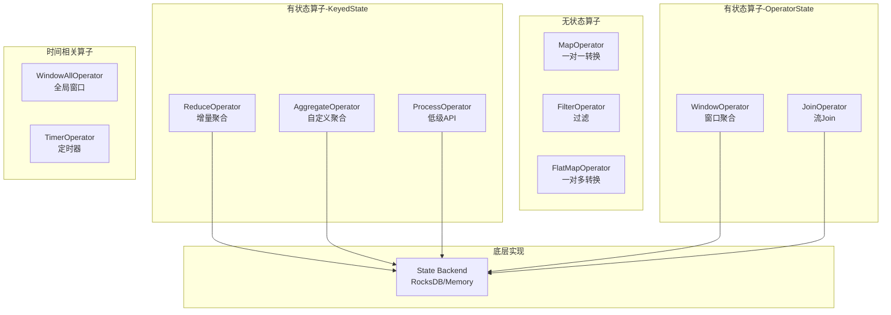
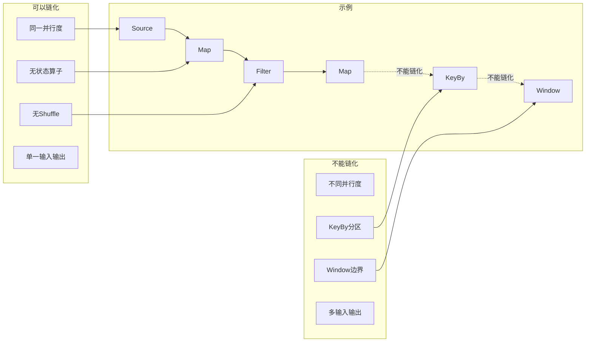
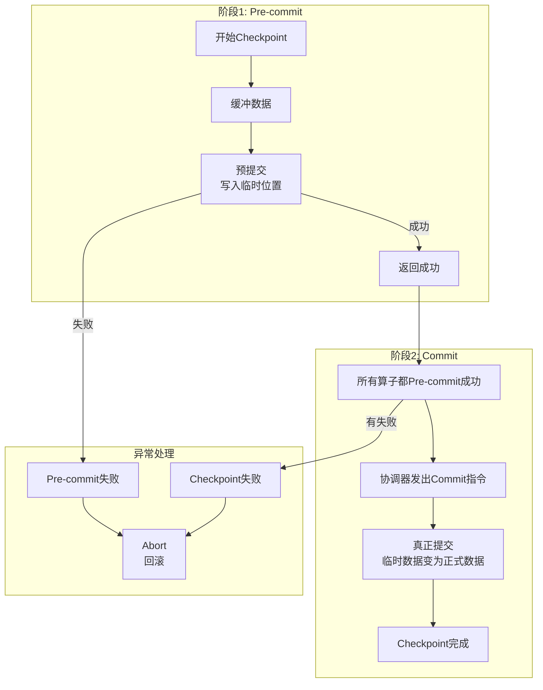
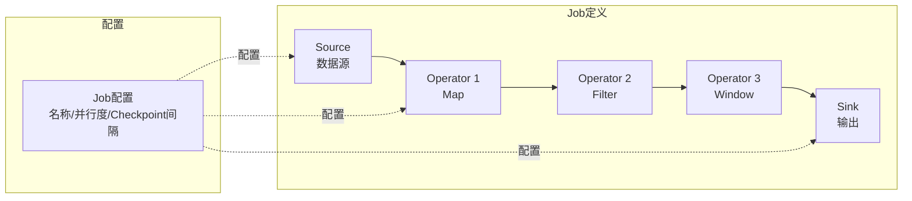
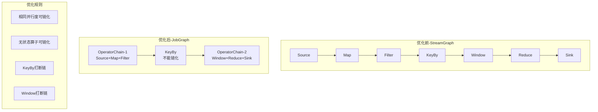
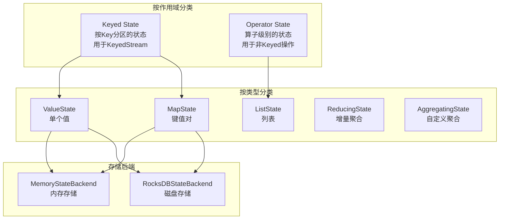
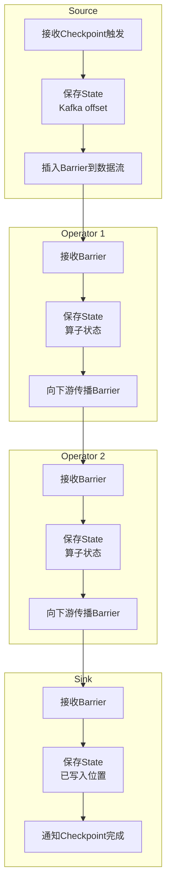

# Pipeline Framework 设计文档

## 目录

- [1. 项目概述](#1-项目概述)
- [2. 核心概念](#2-核心概念)
- [3. 核心抽象设计](#3-核心抽象设计)
- [4. Reactor集成设计](#4-reactor集成设计)
- [5. 数据库设计](#5-数据库设计)
- [6. 开发指南](#6-开发指南)

---

## 1. 项目概述

### 1.1 设计理念

Pipeline Framework 借鉴 Flink 的设计思想，基于 **Source → Operator → Sink** 的模式构建数据处理流程，但底层使用 **Project Reactor** 实现响应式流处理。

**核心思路**：
- 上层抽象：模仿 Flink 的 Source、Operator、Sink 概念
- 底层实现：使用 Reactor 的 Flux/Mono 提供响应式能力
- 状态管理：借鉴 Flink 的 State Backend 和 Checkpoint 机制
- 单实例执行：每个 Job 在单个实例内完整执行

### 1.2 技术栈

| 层次 | 技术 | 用途 |
|------|------|------|
| **用户层** | 自定义 DSL | 定义 Source、Operator、Sink |
| **抽象层** | Flink-like API | StreamGraph、JobGraph |
| **执行层** | Project Reactor | Flux、Mono、Scheduler |
| **存储层** | RocksDB + PostgreSQL | State Backend + 元数据 |

---

## 2. 核心概念

### 2.1 核心概念总览



### 2.2 八大核心概念

| 概念 | 定义 | 在Flink中的对应 | 实现方式 |
|------|------|----------------|----------|
| **Source** | 数据源抽象 | SourceFunction | 自定义接口，集成到Reactor的Flux |
| **Operator** | 算子抽象 | StreamOperator | 自定义接口，包装Reactor的操作符 |
| **Sink** | 输出抽象 | SinkFunction | 自定义接口，使用Reactor的subscribe |
| **Job** | 任务定义 | StreamGraph | 包含Source、Operator、Sink的完整定义 |
| **StreamGraph** | 逻辑执行图 | StreamGraph | 用户API直接翻译的DAG |
| **JobGraph** | 物理执行图 | JobGraph | 优化后的执行计划（算子链等） |
| **State** | 状态管理 | State/StateBackend | 自定义State接口，使用RocksDB |
| **Checkpoint** | 检查点 | Checkpoint | 借鉴Barrier机制 |

---

## 3. 核心抽象设计

### 3.1 Source（数据源抽象）

#### 3.1.1 概念定义

**Source 是什么**：
- Source 是数据处理流程的起点，定义了数据从哪里来
- 抽象了不同数据源的差异（Kafka、HTTP、JDBC等）
- 类似 Flink 的 SourceFunction

**为什么需要 Source 抽象**：
- 统一不同数据源的接口，用户只需关心数据处理逻辑
- 支持可插拔的数据源实现
- 方便实现 Checkpoint 和状态恢复

**设计难点**：
1. 如何设计通用的接口适配各种数据源？
2. 如何集成到 Reactor 的 Flux？
3. 如何支持 Checkpoint 和状态恢复？
4. 如何处理三种执行模式（流式、翻页、SQL）？

#### 3.1.2 接口设计

```java
/**
 * Source 核心接口
 * 
 * @param <T> 数据类型
 * @param <C> Checkpoint 状态类型
 */
public interface Source<T, C extends Serializable> extends Serializable {
    
    /**
     * 返回一个 SourceContext，用于发射数据
     * 类似 Flink 的 SourceFunction.run(SourceContext ctx)
     */
    void run(SourceContext<T> ctx) throws Exception;
    
    /**
     * 取消 Source
     */
    void cancel();
    
    /**
     * 保存 Checkpoint 状态
     * 返回当前的状态快照（如 Kafka offset、HTTP 页码等）
     */
    C snapshotState() throws Exception;
    
    /**
     * 从 Checkpoint 恢复状态
     */
    void restoreState(C state) throws Exception;
}

/**
 * Source 上下文
 * 提供数据发射和状态管理能力
 */
public interface SourceContext<T> {
    
    /**
     * 发射一条数据
     */
    void collect(T element);
    
    /**
     * 发射一条数据，带时间戳（用于事件时间）
     */
    void collectWithTimestamp(T element, long timestamp);
    
    /**
     * 标记 Source 已完成（批量任务）
     */
    void markAsFinished();
    
    /**
     * 获取当前的 Checkpoint Lock
     */
    Object getCheckpointLock();
}
```

#### 3.1.3 三种 Source 实现模式

**模式 1：流式 Source（无限流）**

```java
/**
 * Kafka Source 实现
 */
public class KafkaSource<T> implements Source<T, KafkaSourceState> {
    
    private final String topic;
    private final Properties kafkaProps;
    private transient KafkaConsumer<String, T> consumer;
    private volatile boolean running = true;
    
    @Override
    public void run(SourceContext<T> ctx) throws Exception {
        consumer = new KafkaConsumer<>(kafkaProps);
        consumer.subscribe(Collections.singletonList(topic));
        
        while (running) {
            ConsumerRecords<String, T> records = consumer.poll(Duration.ofMillis(100));
            
            for (ConsumerRecord<String, T> record : records) {
                synchronized (ctx.getCheckpointLock()) {
                    // 在 checkpoint lock 保护下发射数据
                    ctx.collectWithTimestamp(record.value(), record.timestamp());
                }
            }
        }
    }
    
    @Override
    public void cancel() {
        running = false;
    }
    
    @Override
    public KafkaSourceState snapshotState() {
        // 保存当前的 offset
        Map<TopicPartition, OffsetAndMetadata> offsets = new HashMap<>();
        for (TopicPartition partition : consumer.assignment()) {
            long position = consumer.position(partition);
            offsets.put(partition, new OffsetAndMetadata(position));
        }
        return new KafkaSourceState(offsets);
    }
    
    @Override
    public void restoreState(KafkaSourceState state) {
        // 恢复 offset
        for (Map.Entry<TopicPartition, OffsetAndMetadata> entry : state.getOffsets().entrySet()) {
            consumer.seek(entry.getKey(), entry.getValue().offset());
        }
    }
}

/**
 * Kafka Source 的 Checkpoint 状态
 */
public class KafkaSourceState implements Serializable {
    private Map<TopicPartition, OffsetAndMetadata> offsets;
    
    // getter/setter
}
```

**模式 2：滚动翻页 Source（有界流）**

```java
/**
 * HTTP API 滚动翻页 Source
 */
public class HttpApiRollerSource<T> implements Source<T, RollerSourceState> {
    
    private final String apiUrl;
    private final int pageSize;
    private transient int currentPage;
    private transient WebClient client;
    
    @Override
    public void run(SourceContext<T> ctx) throws Exception {
        client = WebClient.create(apiUrl);
        
        while (true) {
            // 拉取当前页数据
            List<T> pageData = fetchPage(currentPage);
            
            if (pageData.isEmpty()) {
                // 没有更多数据，标记完成
                ctx.markAsFinished();
                break;
            }
            
            // 发射数据
            synchronized (ctx.getCheckpointLock()) {
                for (T item : pageData) {
                    ctx.collect(item);
                }
                currentPage++;
            }
        }
    }
    
    @Override
    public RollerSourceState snapshotState() {
        return new RollerSourceState(currentPage, pageSize);
    }
    
    @Override
    public void restoreState(RollerSourceState state) {
        this.currentPage = state.getCurrentPage();
    }
    
    private List<T> fetchPage(int page) {
        return client.get()
            .uri(uriBuilder -> uriBuilder
                .queryParam("page", page)
                .queryParam("size", pageSize)
                .build())
            .retrieve()
            .bodyToFlux(elementClass)
            .collectList()
            .block();
    }
}
```

**模式 3：SQL 任务 Source**

```java
/**
 * SQL 查询 Source
 */
public class JdbcQuerySource<T> implements Source<T, JdbcSourceState> {
    
    private final String sql;
    private final DataSource dataSource;
    private final int fetchSize;
    private transient long processedRows;
    
    @Override
    public void run(SourceContext<T> ctx) throws Exception {
        Connection conn = dataSource.getConnection();
        Statement stmt = conn.createStatement(
            ResultSet.TYPE_FORWARD_ONLY,
            ResultSet.CONCUR_READ_ONLY
        );
        stmt.setFetchSize(fetchSize);  // 流式读取
        
        ResultSet rs = stmt.executeQuery(sql);
        
        while (rs.next()) {
            synchronized (ctx.getCheckpointLock()) {
                T row = mapRow(rs);
                ctx.collect(row);
                processedRows++;
            }
        }
        
        ctx.markAsFinished();
    }
    
    @Override
    public JdbcSourceState snapshotState() {
        return new JdbcSourceState(processedRows);
    }
    
    @Override
    public void restoreState(JdbcSourceState state) {
        this.processedRows = state.getProcessedRows();
        // 注意：SQL 任务的恢复比较困难
        // 可以通过 WHERE id > lastId 实现增量查询
    }
}
```

#### 3.1.4 Source 集成到 Reactor

**核心思路**：将 Source 的 run() 方法包装成 Flux

```java
/**
 * Source 到 Flux 的转换器
 */
public class SourceToFluxConverter<T, C extends Serializable> {
    
    public Flux<T> convert(Source<T, C> source) {
        return Flux.create(sink -> {
            // 创建 SourceContext 实现
            SourceContext<T> ctx = new SourceContext<T>() {
                @Override
                public void collect(T element) {
                    sink.next(element);
                }
                
                @Override
                public void collectWithTimestamp(T element, long timestamp) {
                    // 包装时间戳信息
                    sink.next(element);
                }
                
                @Override
                public void markAsFinished() {
                    sink.complete();
                }
                
                @Override
                public Object getCheckpointLock() {
                    return new Object();  // Checkpoint 锁
                }
            };
            
            // 在独立线程中运行 Source
            Thread sourceThread = new Thread(() -> {
                try {
                    source.run(ctx);
                } catch (Exception e) {
                    sink.error(e);
                }
            });
            sourceThread.start();
            
            // 取消时停止 Source
            sink.onDispose(() -> {
                source.cancel();
                sourceThread.interrupt();
            });
            
        }, FluxSink.OverflowStrategy.BUFFER);
    }
}
```

#### 3.1.5 Source 设计难点详解

**难点 1：如何统一不同数据源的差异？**

不同数据源的特性差异很大：
- Kafka：需要管理 offset、partition、consumer group
- HTTP API：需要处理分页、限流、重试
- JDBC：需要处理连接池、事务、ResultSet

**解决方案**：
- 定义通用的 Source 接口，只关注"发射数据"和"状态管理"
- 具体的数据源细节由各自的实现类处理
- 使用 SourceContext 作为中间层，隔离差异

**难点 2：如何处理背压？**

Source 产生数据的速度可能快于下游处理速度。

**解决方案**：
- 集成到 Reactor 后，由 Flux 的背压机制自动处理
- Source 在 SourceContext.collect() 时可能被阻塞
- 使用 FluxSink.OverflowStrategy 配置背压策略

**难点 3：如何保证 Checkpoint 一致性？**

Source 在发射数据的同时，可能触发 Checkpoint。

**解决方案**：
- 使用 Checkpoint Lock 保护临界区
- 在 lock 内发射数据和更新状态
- Checkpoint 时获取 lock，保证一致性

---

### 3.2 Operator（算子抽象）

#### 3.2.1 概念定义

**Operator 是什么**：
- Operator 是数据转换的抽象，定义了如何处理数据
- 包括无状态算子（Map、Filter）和有状态算子（Window、Aggregate）
- 类似 Flink 的 StreamOperator

**为什么需要 Operator 抽象**：
- 提供统一的数据转换接口
- 支持算子链优化（多个算子合并执行）
- 支持状态管理和 Checkpoint

**设计难点**：
1. 如何设计通用的 Operator 接口？
2. 如何区分无状态和有状态算子？
3. 如何实现算子链优化？
4. 如何集成到 Reactor？

#### 3.2.2 接口设计

```java
/**
 * Operator 核心接口
 * 
 * @param <IN> 输入数据类型
 * @param <OUT> 输出数据类型
 */
public interface StreamOperator<IN, OUT> extends Serializable {
    
    /**
     * 处理一条数据
     * 
     * @param value 输入数据
     * @param ctx 算子上下文
     * @throws Exception
     */
    void processElement(IN value, OperatorContext<OUT> ctx) throws Exception;
    
    /**
     * 处理水印
     */
    void processWatermark(Watermark watermark) throws Exception;
    
    /**
     * 打开算子（初始化）
     */
    void open() throws Exception;
    
    /**
     * 关闭算子（清理资源）
     */
    void close() throws Exception;
    
    /**
     * 保存状态快照
     */
    void snapshotState(StateSnapshotContext context) throws Exception;
    
    /**
     * 恢复状态
     */
    void initializeState(StateInitializationContext context) throws Exception;
}

/**
 * 算子上下文
 */
public interface OperatorContext<OUT> {
    
    /**
     * 输出一条数据
     */
    void collect(OUT value);
    
    /**
     * 输出一条数据，带时间戳
     */
    void collectWithTimestamp(OUT value, long timestamp);
    
    /**
     * 获取当前处理时间
     */
    long currentProcessingTime();
    
    /**
     * 获取当前水印
     */
    long currentWatermark();
}
```

#### 3.2.3 算子分类和实现

**算子分类**：



**示例 1：无状态算子 - MapOperator**

```java
public class MapOperator<IN, OUT> implements StreamOperator<IN, OUT> {
    
    private final MapFunction<IN, OUT> mapper;
    
    public MapOperator(MapFunction<IN, OUT> mapper) {
        this.mapper = mapper;
    }
    
    @Override
    public void processElement(IN value, OperatorContext<OUT> ctx) throws Exception {
        OUT result = mapper.map(value);
        ctx.collect(result);
    }
    
    @Override
    public void open() throws Exception {
        // 无状态算子，无需初始化
    }
    
    @Override
    public void close() throws Exception {
        // 无需清理
    }
    
    @Override
    public void snapshotState(StateSnapshotContext context) {
        // 无状态，无需保存
    }
    
    @Override
    public void initializeState(StateInitializationContext context) {
        // 无状态，无需恢复
    }
}

/**
 * Map 函数接口
 */
@FunctionalInterface
public interface MapFunction<IN, OUT> extends Serializable {
    OUT map(IN value) throws Exception;
}
```

**示例 2：有状态算子 - WindowOperator**

```java
public class WindowOperator<T, KEY, W extends Window> 
    implements StreamOperator<T, WindowedValue<KEY, T>> {
    
    private final KeySelector<T, KEY> keySelector;
    private final WindowAssigner<W> windowAssigner;
    private final AggregateFunction<T, ACC, OUT> aggregateFunction;
    
    private transient MapState<KEY, Map<W, ACC>> windowState;
    
    @Override
    public void open() throws Exception {
        // 初始化状态
        windowState = getRuntimeContext()
            .getMapState(new MapStateDescriptor<>("window-state", 
                keyClass, mapClass));
    }
    
    @Override
    public void processElement(T value, OperatorContext<OUT> ctx) throws Exception {
        KEY key = keySelector.getKey(value);
        
        // 分配窗口
        Collection<W> windows = windowAssigner.assignWindows(value, ctx.currentProcessingTime());
        
        for (W window : windows) {
            // 获取窗口状态
            Map<W, ACC> keyWindows = windowState.get(key);
            if (keyWindows == null) {
                keyWindows = new HashMap<>();
            }
            
            ACC accumulator = keyWindows.get(window);
            if (accumulator == null) {
                accumulator = aggregateFunction.createAccumulator();
            }
            
            // 聚合
            accumulator = aggregateFunction.add(value, accumulator);
            keyWindows.put(window, accumulator);
            windowState.put(key, keyWindows);
            
            // 注册窗口触发器
            ctx.registerTimer(window.maxTimestamp());
        }
    }
    
    @Override
    public void snapshotState(StateSnapshotContext context) throws Exception {
        // 状态自动保存到 State Backend
    }
    
    @Override
    public void initializeState(StateInitializationContext context) throws Exception {
        // 从 State Backend 恢复
        windowState = context.getMapState(new MapStateDescriptor<>(...));
    }
}
```

#### 3.2.4 算子链优化

**什么是算子链**：

多个算子可以合并到一个 Task 中执行，避免数据序列化和线程切换。

**算子链条件**：



**算子链实现**：

```java
/**
 * 算子链
 */
public class OperatorChain<IN, OUT> implements StreamOperator<IN, OUT> {
    
    private final List<StreamOperator<?, ?>> operators;
    
    @Override
    public void processElement(IN value, OperatorContext<OUT> ctx) throws Exception {
        Object current = value;
        
        // 依次通过算子链
        for (int i = 0; i < operators.size(); i++) {
            StreamOperator operator = operators.get(i);
            
            if (i == operators.size() - 1) {
                // 最后一个算子，直接输出
                operator.processElement(current, ctx);
            } else {
                // 中间算子，捕获输出
                List<Object> outputs = new ArrayList<>();
                operator.processElement(current, new CollectingContext(outputs));
                
                // 传递给下一个算子
                for (Object output : outputs) {
                    current = output;
                }
            }
        }
    }
    
    private static class CollectingContext implements OperatorContext {
        private final List<Object> outputs;
        
        @Override
        public void collect(Object value) {
            outputs.add(value);
        }
    }
}
```

#### 3.2.5 Operator 集成到 Reactor

```java
/**
 * Operator 到 Flux 转换器
 */
public class OperatorToFluxConverter {
    
    public <IN, OUT> Function<Flux<IN>, Flux<OUT>> convert(StreamOperator<IN, OUT> operator) {
        return flux -> flux
            .doOnNext(value -> {
                try {
                    // 处理每条数据
                    operator.processElement(value, new ReactorOperatorContext<>());
                } catch (Exception e) {
                    throw new RuntimeException(e);
                }
            })
            .map(value -> {
                // 收集输出
                List<OUT> outputs = new ArrayList<>();
                operator.processElement(value, new CollectingContext<>(outputs));
                return outputs;
            })
            .flatMapIterable(list -> list);
    }
}
```

---

### 3.3 Sink（输出抽象）

#### 3.3.1 概念定义

**Sink 是什么**：
- Sink 是数据处理流程的终点，定义了数据写到哪里
- 抽象了不同输出目标的差异（Kafka、JDBC、文件等）
- 类似 Flink 的 SinkFunction

**为什么需要 Sink 抽象**：
- 统一不同输出目标的接口
- 支持批量写入优化
- 支持事务性写入（Exactly-Once）

**设计难点**：
1. 如何支持批量写入？
2. 如何实现事务性写入？
3. 如何处理写入失败和重试？
4. 如何集成到 Reactor？

#### 3.3.2 接口设计

```java
/**
 * Sink 核心接口
 * 
 * @param <T> 数据类型
 */
public interface SinkFunction<T> extends Serializable {
    
    /**
     * 写入一条数据
     */
    void invoke(T value, SinkContext context) throws Exception;
    
    /**
     * 打开 Sink（初始化连接等）
     */
    default void open() throws Exception {}
    
    /**
     * 关闭 Sink（清理资源）
     */
    default void close() throws Exception {}
    
    /**
     * 刷新缓冲区（批量写入时使用）
     */
    default void flush() throws Exception {}
}

/**
 * Sink 上下文
 */
public interface SinkContext {
    
    /**
     * 获取当前处理时间
     */
    long currentProcessingTime();
    
    /**
     * 获取当前水印
     */
    long currentWatermark();
    
    /**
     * 获取当前 Checkpoint ID
     */
    long currentCheckpointId();
}
```

#### 3.3.3 两阶段提交 Sink

**概念**：实现 Exactly-Once 语义的关键



**实现示例**：

```java
/**
 * 支持两阶段提交的 Sink
 */
public interface TwoPhaseCommitSinkFunction<T, TXN> extends SinkFunction<T> {
    
    /**
     * 开始新事务
     */
    TXN beginTransaction() throws Exception;
    
    /**
     * 在事务中写入数据
     */
    void invoke(TXN transaction, T value, SinkContext context) throws Exception;
    
    /**
     * 预提交事务
     */
    void preCommit(TXN transaction) throws Exception;
    
    /**
     * 提交事务
     */
    void commit(TXN transaction) throws Exception;
    
    /**
     * 回滚事务
     */
    void abort(TXN transaction) throws Exception;
}

/**
 * JDBC 两阶段提交 Sink
 */
public class JdbcTwoPhaseCommitSink<T> implements TwoPhaseCommitSinkFunction<T, Connection> {
    
    private final String jdbcUrl;
    private final String insertSql;
    private transient Connection currentTransaction;
    
    @Override
    public Connection beginTransaction() throws Exception {
        Connection conn = DriverManager.getConnection(jdbcUrl);
        conn.setAutoCommit(false);  // 关闭自动提交
        return conn;
    }
    
    @Override
    public void invoke(Connection transaction, T value, SinkContext context) throws Exception {
        PreparedStatement stmt = transaction.prepareStatement(insertSql);
        setParameters(stmt, value);
        stmt.executeUpdate();
    }
    
    @Override
    public void preCommit(Connection transaction) throws Exception {
        // 预提交：刷新语句，但不提交事务
        transaction.commit();  // JDBC 的 commit 相当于预提交
    }
    
    @Override
    public void commit(Connection transaction) throws Exception {
        // 真正提交：关闭连接（事务已提交）
        transaction.close();
    }
    
    @Override
    public void abort(Connection transaction) throws Exception {
        // 回滚
        transaction.rollback();
        transaction.close();
    }
}
```

#### 3.3.4 Sink 集成到 Reactor

```java
/**
 * Sink 到 Reactor 的转换
 */
public class SinkToReactorConverter<T> {
    
    public Mono<Void> convert(Flux<T> flux, SinkFunction<T> sink) {
        return flux
            .doOnNext(value -> {
                try {
                    sink.invoke(value, createSinkContext());
                } catch (Exception e) {
                    throw new RuntimeException(e);
                }
            })
            .then(Mono.fromRunnable(() -> {
                try {
                    sink.flush();
                    sink.close();
                } catch (Exception e) {
                    throw new RuntimeException(e);
                }
            }));
    }
    
    private SinkContext createSinkContext() {
        return new SinkContext() {
            @Override
            public long currentProcessingTime() {
                return System.currentTimeMillis();
            }
            
            @Override
            public long currentWatermark() {
                return Long.MIN_VALUE;
            }
            
            @Override
            public long currentCheckpointId() {
                return 0L;
            }
        };
    }
}
```

---

### 3.4 Job（任务定义）

#### 3.4.1 概念定义

**Job 是什么**：
- Job 是一个完整的数据处理流程定义
- 包含 Source、一系列 Operator、Sink
- 类似 Flink 的 StreamGraph

**Job 的组成**：



#### 3.4.2 API 设计

```java
/**
 * Job 构建器
 */
public class StreamJobBuilder<T> {
    
    private String jobName;
    private Source<?, ?> source;
    private List<StreamOperator<?, ?>> operators = new ArrayList<>();
    private SinkFunction<?> sink;
    private JobConfig config;
    
    public StreamJobBuilder<T> name(String name) {
        this.jobName = name;
        return this;
    }
    
    public <OUT> StreamJobBuilder<OUT> source(Source<OUT, ?> source) {
        this.source = source;
        return (StreamJobBuilder<OUT>) this;
    }
    
    public <OUT> StreamJobBuilder<OUT> map(MapFunction<T, OUT> mapper) {
        operators.add(new MapOperator<>(mapper));
        return (StreamJobBuilder<OUT>) this;
    }
    
    public StreamJobBuilder<T> filter(FilterFunction<T> filter) {
        operators.add(new FilterOperator<>(filter));
        return this;
    }
    
    public StreamJobBuilder<T> keyBy(KeySelector<T, ?> keySelector) {
        operators.add(new KeyByOperator<>(keySelector));
        return this;
    }
    
    public StreamJobBuilder<T> window(WindowAssigner<?> assigner) {
        operators.add(new WindowOperator<>(assigner));
        return this;
    }
    
    public void sink(SinkFunction<T> sink) {
        this.sink = sink;
    }
    
    public StreamJobBuilder<T> config(JobConfig config) {
        this.config = config;
        return this;
    }
    
    public StreamJob build() {
        return new StreamJob(jobName, source, operators, sink, config);
    }
}
```

#### 3.4.3 使用示例

```java
/**
 * 示例：实时告警任务
 */
public class RealtimeAlertJob {
    
    public StreamJob createJob() {
        return StreamJob.builder()
            .name("realtime-alert-job")
            
            // 1. 定义 Source
            .source(new KafkaSource<Event>("events-topic"))
            
            // 2. 定义处理流程
            .map(event -> parseEvent(event))
            .filter(event -> event.isValid())
            .keyBy(event -> event.getUserId())
            .window(TumblingTimeWindows.of(Duration.ofMinutes(5)))
            .aggregate(new CountAggregateFunction())
            .filter(result -> result.getCount() > 100)
            .map(result -> createAlert(result))
            
            // 3. 定义 Sink
            .sink(new KafkaSink<Alert>("alerts-topic"))
            
            // 4. 配置
            .config(JobConfig.builder()
                .checkpointInterval(Duration.ofMinutes(1))
                .parallelism(4)
                .build())
            
            .build();
    }
}
```

---

### 3.5 StreamGraph 和 JobGraph

#### 3.5.1 StreamGraph（逻辑执行图）

**StreamGraph 是什么**：
- 用户 API 的直接翻译
- 一对一映射用户定义的算子
- 用于调试和可视化

**示例**：

```
用户代码：
source.map().filter().keyBy().window().reduce().sink()

StreamGraph：
StreamNode[1]: Source
  ↓
StreamNode[2]: Map
  ↓
StreamNode[3]: Filter
  ↓
StreamNode[4]: KeyBy
  ↓
StreamNode[5]: Window
  ↓
StreamNode[6]: Reduce
  ↓
StreamNode[7]: Sink
```

#### 3.5.2 JobGraph（物理执行图）

**JobGraph 是什么**：
- 优化后的执行图
- 应用了算子链、并行度优化
- 实际执行的任务图

**优化策略**：



**JobGraph 生成算法**：

```java
public class JobGraphGenerator {
    
    public JobGraph generate(StreamGraph streamGraph) {
        JobGraph jobGraph = new JobGraph();
        
        // 1. 识别可链化的算子
        List<List<StreamNode>> chains = identifyChains(streamGraph);
        
        // 2. 为每个链创建 JobVertex
        for (List<StreamNode> chain : chains) {
            JobVertex vertex = createVertex(chain);
            jobGraph.addVertex(vertex);
        }
        
        // 3. 连接 JobVertex
        connectVertices(jobGraph, streamGraph);
        
        return jobGraph;
    }
    
    private List<List<StreamNode>> identifyChains(StreamGraph streamGraph) {
        // 算子链识别算法
        // 规则：
        // 1. 相同并行度
        // 2. 无状态算子
        // 3. 无 KeyBy/Window 等打断点
    }
}
```

---

### 3.6 State（状态管理）

#### 3.6.1 概念定义

**State 是什么**：
- 算子在处理数据过程中需要记住的信息
- 例如：窗口的累加器、去重的 Set、用户的历史数据等
- 类似 Flink 的 State

**State 的分类**：



#### 3.6.2 接口设计

```java
/**
 * Value State
 */
public interface ValueState<T> extends State {
    T value() throws Exception;
    void update(T value) throws Exception;
}

/**
 * List State
 */
public interface ListState<T> extends State {
    Iterable<T> get() throws Exception;
    void add(T value) throws Exception;
    void addAll(List<T> values) throws Exception;
    void update(List<T> values) throws Exception;
}

/**
 * Map State
 */
public interface MapState<UK, UV> extends State {
    UV get(UK key) throws Exception;
    void put(UK key, UV value) throws Exception;
    void remove(UK key) throws Exception;
    boolean contains(UK key) throws Exception;
    Iterable<Map.Entry<UK, UV>> entries() throws Exception;
    Iterable<UK> keys() throws Exception;
    Iterable<UV> values() throws Exception;
}
```

#### 3.6.3 State Backend 实现

**RocksDB State Backend**：

```java
public class RocksDBStateBackend implements StateBackend {
    
    private final String dbPath;
    private transient RocksDB db;
    
    @Override
    public void open() throws Exception {
        Options options = new Options()
            .setCreateIfMissing(true)
            .setWriteBufferSize(64 * 1024 * 1024)  // 64MB
            .setMaxWriteBufferNumber(3);
        
        db = RocksDB.open(options, dbPath);
    }
    
    @Override
    public <T> ValueState<T> getValueState(ValueStateDescriptor<T> descriptor) {
        return new RocksDBValueState<>(db, descriptor);
    }
    
    @Override
    public <T> MapState<K, T> getMapState(MapStateDescriptor<K, T> descriptor) {
        return new RocksDBMapState<>(db, descriptor);
    }
}
```

---

### 3.7 Checkpoint（检查点机制）

#### 3.7.1 Barrier 机制

**Barrier 是什么**：
- Barrier 是插入到数据流中的特殊标记
- 标记 Checkpoint 的边界
- 类似 Flink 的 Barrier

**Barrier 流动过程**：



#### 3.7.2 Checkpoint 实现

```java
/**
 * Checkpoint 协调器
 */
public class CheckpointCoordinator {
    
    private final long checkpointInterval;
    private final StateBackend stateBackend;
    
    /**
     * 触发 Checkpoint
     */
    public void triggerCheckpoint(long checkpointId) {
        // 1. 通知所有 Source 插入 Barrier
        for (Source source : sources) {
            source.insertBarrier(checkpointId);
        }
        
        // 2. Barrier 自动流向下游
        // 3. 每个算子收到 Barrier 时保存状态
        // 4. Sink 收到 Barrier 后通知完成
    }
    
    /**
     * Checkpoint 完成回调
     */
    public void onCheckpointComplete(long checkpointId) {
        // 1. 所有算子都保存完状态
        // 2. 持久化到存储（S3/HDFS）
        // 3. 更新元数据
        // 4. 清理旧的 Checkpoint
    }
}
```

---

## 4. Reactor集成设计

### 4.1 完整的 Reactor Pipeline

```java
/**
 * Job 到 Reactor Pipeline 的转换
 */
public class JobToReactorConverter {
    
    public Mono<Void> convert(StreamJob job) {
        // 1. Source 转换为 Flux
        Flux<?> sourceFlux = convertSource(job.getSource());
        
        // 2. 应用算子链
        Flux<?> transformedFlux = applyOperators(sourceFlux, job.getOperators());
        
        // 3. 连接 Sink
        Mono<Void> sinkMono = connectSink(transformedFlux, job.getSink());
        
        return sinkMono;
    }
    
    private Flux<?> convertSource(Source<?, ?> source) {
        return Flux.create(sink -> {
            // Source.run() 在独立线程中执行
            // 通过 SourceContext 发射数据到 FluxSink
        });
    }
    
    private Flux<?> applyOperators(Flux<?> flux, List<StreamOperator<?, ?>> operators) {
        Flux<?> current = flux;
        
        for (StreamOperator<?, ?> operator : operators) {
            current = current.transform(convertOperator(operator));
        }
        
        return current;
    }
    
    private Mono<Void> connectSink(Flux<?> flux, SinkFunction<?> sink) {
        return flux
            .doOnNext(value -> sink.invoke(value, sinkContext))
            .then();
    }
}
```

---

## 5. 数据库设计

[数据库设计部分保持不变，包含5个核心表的完整SQL和ER图]

---

## 6. 开发指南

### 6.1 开发自定义 Source

[包含完整的 Source 开发步骤和示例代码]

### 6.2 开发自定义 Operator

[包含完整的 Operator 开发步骤和示例代码]

### 6.3 开发自定义 Sink

[包含完整的 Sink 开发步骤和示例代码]

---

**文档版本**：v5.0
**最后更新**：2025-11-07
**设计理念**：Flink抽象 + Reactor实现
